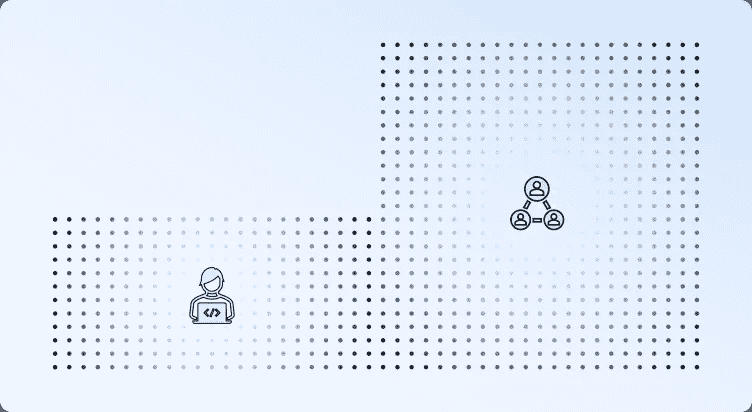

# 开发公司特定的 ChatGPT 是技术的三分之一和流程改进的三分之二

> 原文：[`towardsdatascience.com/developing-a-company-specific-chatgpt-is-one-third-technology-and-two-thirds-process-improvements-2c6b4adf637f?source=collection_archive---------9-----------------------#2023-11-18`](https://towardsdatascience.com/developing-a-company-specific-chatgpt-is-one-third-technology-and-two-thirds-process-improvements-2c6b4adf637f?source=collection_archive---------9-----------------------#2023-11-18)

作者提供的图片

## 对开发基于 GPT 的公司特定虚拟助手所涉及的流程、角色和复杂性进行了实际概述

 [克里斯蒂安·埃尔扬](https://eljand.medium.com/?source=post_page-----2c6b4adf637f--------------------------------)

·

[关注](https://medium.com/m/signin?actionUrl=https%3A%2F%2Fmedium.com%2F_%2Fsubscribe%2Fuser%2F89e9cc88ab40&operation=register&redirect=https%3A%2F%2Ftowardsdatascience.com%2Fdeveloping-a-company-specific-chatgpt-is-one-third-technology-and-two-thirds-process-improvements-2c6b4adf637f&user=Kristjan+Eljand&userId=89e9cc88ab40&source=post_page-89e9cc88ab40----2c6b4adf637f---------------------post_header-----------) 在 [Towards Data Science](https://towardsdatascience.com/?source=post_page-----2c6b4adf637f--------------------------------) 发布 ·5 分钟阅读 ·2023 年 11 月 18 日

--

在整个 2023 年，我们一直在为 Enefit（波罗的海地区最大的能源公司之一）的员工开发基于 GPT 模型的虚拟助手。在第一篇文章中（[点击阅读](https://www.linkedin.com/pulse/developing-company-specific-chatgpt-forenefit-kristjan-eljand)），我概述了问题、开发过程和初步结果。在本文中，我将深入探讨开发虚拟助手中非技术相关挑战的重要性。

# 介绍

在 2023 年初，显然大型语言模型的技术已经取得了突破。与过去十年那些常常让用户失望的聊天机器人不同，ChatGPT 展现出了精准、多才多艺和真正有用的特性。OpenAI 和微软决定通过开放 API 服务提供对其 GPT 模型的程序化访问，从而创造了实施公司特定用例的机会。

我们在启动 Enefit 虚拟助手项目时知道基础技术已经就绪，内部兴趣很高，而且软件开发挑战虽然新颖且复杂，但有优秀的专家可以解决。

在开发的早期阶段，这一叙述证明是正确的：近 80%的项目活动是软件开发任务，20%是非技术相关活动。随着项目的进展，这些比例发生了剧烈变化，导致需要全新的流程和角色。

# 数据/信息治理 2.0

虚拟助手只能根据基础文档的准确性提供公司特定的信息。换句话说，如果基础文档包含不正确、结构不佳或过时的信息，虚拟助手也无法提供更好的答案。这通常被称为 GIGO（垃圾进，垃圾出）原则，它设定了 AI 能力的基本限制。

因此，构建虚拟助手的一个重要部分是确保数据/信息的质量。这包括：

+   为每个文档/信息组指派一位负责人，负责信息的准确性。

+   同意一种反馈机制，让虚拟助手的用户能够报告错误回答或虚假信息。

+   建立反馈管理流程，以确保用户反馈能到达信息拥有者并得到处理。

从本质上讲，这意味着所有相关方都参与数据管理：提供持续反馈的用户和负责响应这些反馈的数据拥有者。

文档拥有者还可以通过丰富文档部分的关键词、测试虚拟助手的准确性、必要时重组内容、测试、改进、测试、改进等方式，提升虚拟助手查找其管辖信息的能力。实际上，信息拥有者应将虚拟助手视为需要协作的同事！

结束这一部分之前，我将谈谈微软的新 Copilot。目前，所有人的目光都集中在 Copilot 的发布上。大多数技术爱好者已经观看了演示视频，并期望它是一个即插即用的产品，能够半神奇地提供公司相关问题的好答案。然而，这种期望很可能会导致失望，因为即使是 Copilot 也无法免受“垃圾进，垃圾出”（GIGO）原则的影响。

从 Copilot 的营销视频中看，我们发现了关于文档管理要求的广泛文档。总之，微软期望 ([阅读更多](https://learn.microsoft.com/en-us/training/modules/implement-microsoft-365-copilot/3-prepare-your-data-copilot-searches)):

+   所有过时的文档将被删除。

+   所有文档应包含准确且相关的信息。

+   公司应建立新的数据治理流程以确保上述目标的实现。

+   文档应丰富关键词以增强搜索效果。

这些要求很高，尤其是当我们谈论存储在员工计算机上的文档时。

明确地说，我认为 Copilot 是一项了不起的新技术。然而，必须强调的是，没有数据治理流程，任何虚拟助理技术都无法成功实施。

# 指导虚拟助理

大型预训练语言模型（例如 GPT、Llama）是机械化的逻辑机器。这意味着如果我们希望它们履行特定角色（例如执行助理、合同助理、法律专家），我们需要指导它们并提供风格示例。

指导虚拟助理意味着向语言模型提供用户的问题和响应指南。例如，“*你是 Enefit 的虚拟助理，了解公司政策和规则。如果你在现有信息中找不到答案，请说你不知道…*”

通过这种类型的指导，我们可以指示虚拟助理如何行为，规定其回应时应使用的格式，并强调它应避免的内容。

然而，一般指南往往不够充分。例如，公司可能希望虚拟助理遵循特定的风格（正式、友好等）。在这种情况下，可以提供风格示例，实际上是问答对。由于语言模型训练是为了继续现有文本，虚拟助理会尝试以提供的风格示例类似的方式回答用户问题。

创建响应指南和风格示例、测试不同版本以及对其进行改进是虚拟助理开发的第三个重要部分。

‘虚拟助理培训师/指导者’这一角色完全新颖，只有在虚拟助理创建领域有深入了解的人才能有效担任。有效的虚拟助理开发需要软件开发人员、信息拥有者和虚拟助理培训师之间的密切合作，因为每个‘不佳’回应的原因可能都与不同的专家有关。

# 结论

使用现有技术开发一个 80%效率的聊天机器人是很容易的，但创建一个 95%质量的虚拟助手则是一个复杂的任务。

初看之下，人们可能会认为 80%已经足够，那么为什么要为最后的 20 个百分点付出这么多努力呢？实际上，根据过去十年与聊天机器人的经验，我们知道一个 80%准确的聊天机器人无法超越用户的“认知有用性门槛”。

这个认知有用性门槛是一个存在于我们所有人心中的隐性基准，但我们无法准确定义这个限制在哪里。然而，利用技术，我们可以迅速判断是否已超越这个限制。如果技术的质量低于这一门槛，我们将完全放弃使用该技术。

换句话说，80%和 95%之间的区别在于，在第一种情况下，没有人会开始使用这项技术，而在第二种情况下，它会成为许多员工的日常助手。

> *80%和 95%准确率之间的差异在于，第一种情况下没有人会开始使用这项技术，而在第二种情况下，它会成为许多员工的日常助手！*

为了实现最后的 15-20%，需要实施一个数据管理系统，以确保基础信息的相关性，创建与虚拟助手开发相关的新角色和流程，对所有相关方进行新技术的培训，并在战略和运营层面支持实施和采纳。因此，技术仅占虚拟助手开发的三分之一，而组织和流程相关的挑战占其余部分。
