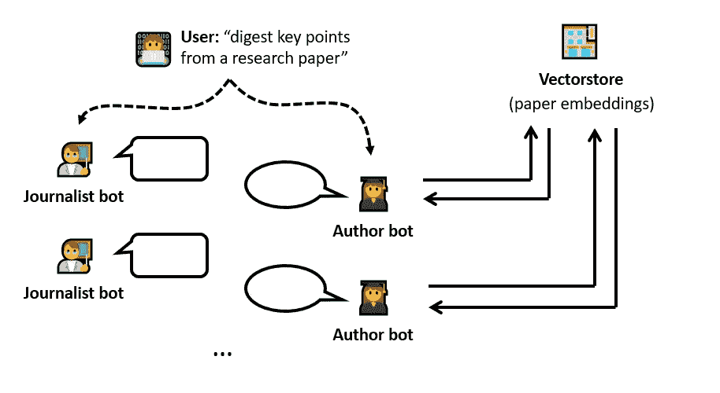
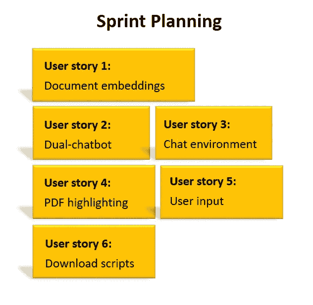
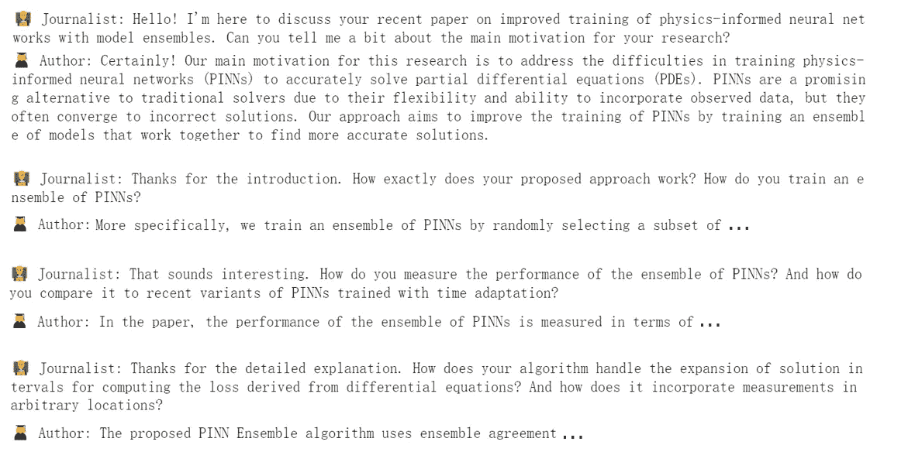
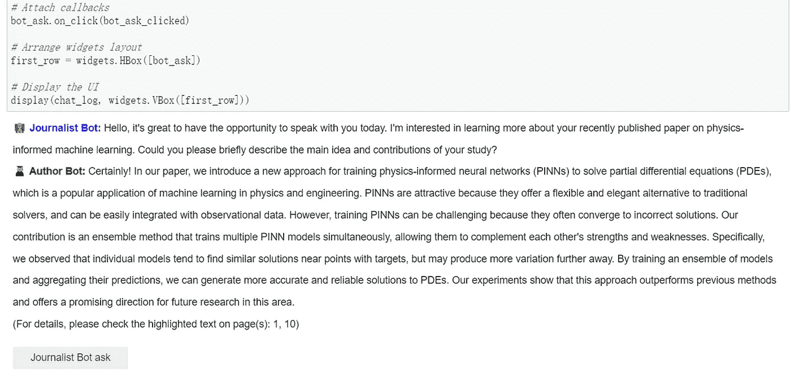
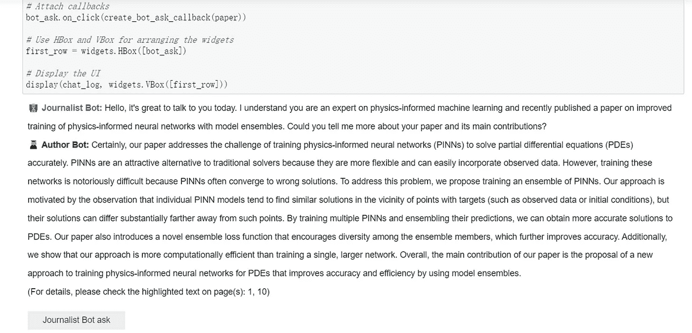
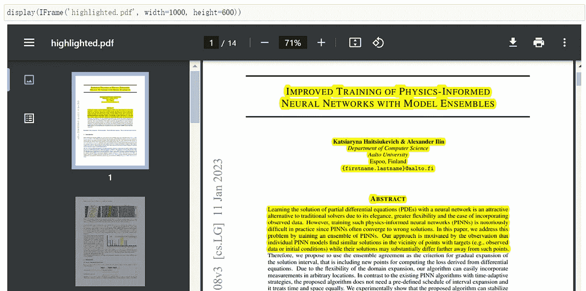
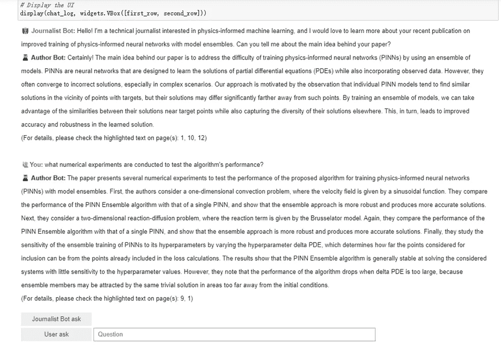
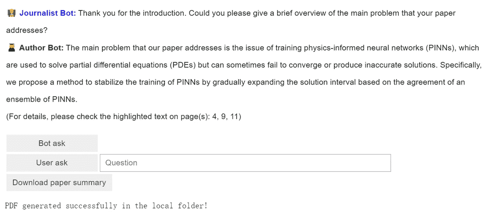

# 为研究论文消化开发的自主双聊天机器人系统

> 原文：[`towardsdatascience.com/developing-an-autonomous-dual-chatbot-system-for-research-paper-digesting-ea46943e9343`](https://towardsdatascience.com/developing-an-autonomous-dual-chatbot-system-for-research-paper-digesting-ea46943e9343)

## 关于概念、实施和演示的项目演练

[](https://shuaiguo.medium.com/?source=post_page-----ea46943e9343--------------------------------)[](https://towardsdatascience.com/?source=post_page-----ea46943e9343--------------------------------) [帅果](https://shuaiguo.medium.com/?source=post_page-----ea46943e9343--------------------------------)

·发表于[Towards Data Science](https://towardsdatascience.com/?source=post_page-----ea46943e9343--------------------------------) ·阅读时长 28 分钟·2023 年 8 月 14 日

--


图片由[Aaron Burden](https://unsplash.com/@aaronburden?utm_source=medium&utm_medium=referral)提供，来自[Unsplash](https://unsplash.com/?utm_source=medium&utm_medium=referral)

作为一名研究人员，阅读和理解科学论文一直是我日常工作的重要部分。我仍然记得在研究生阶段学到的如何高效消化论文的技巧。然而，由于每天都有无数的研究论文发表，我感到很难跟上最新的研究趋势和见解。旧有的技巧帮助有限。

随着大型语言模型（LLMs）的最新发展，情况开始发生变化。得益于其出色的上下文理解能力，LLMs 可以相当准确地从用户提供的文档中识别相关信息，并生成高质量的答案以回应用户关于文档的问题。基于这一思想，已经开发了大量的文档问答工具，有些工具专门设计用于帮助研究人员在相对较短的时间内理解复杂的论文。

虽然这无疑是一个进步，但在使用这些工具时我注意到了一些摩擦点。我面临的主要问题之一是提示工程。由于 LLM 的回答质量在很大程度上依赖于我的问题质量，我常常发现自己花费相当多的时间来制定“完美”的问题。当阅读不熟悉的研究领域的论文时，这尤其具有挑战性：我经常不知道该问什么问题。

这个经历让我思考：是否可以开发一个系统来自动化处理研究论文的问答过程？一个能够更高效且自主地提炼论文关键点的系统？

之前，我曾做过 [一个我为语言学习开发双聊天机器人系统的项目](https://medium.com/towards-data-science/building-an-ai-powered-language-learning-app-learning-from-two-ai-chatting-6db7f9b0d7cd)。那里的概念简单而有效：通过让两个聊天机器人用用户指定的外语聊天，用户可以通过观察对话来学习语言的实际使用。这个项目的成功让我产生了一个有趣的想法：类似的双聊天机器人系统是否也有助于理解研究论文呢？

因此，在这篇博客中，我们将把这个想法变为现实。具体来说，我们将演示开发一个可以自主处理研究论文的双聊天机器人系统的过程。

为了让这次旅程变得有趣，我们将其视为一个软件项目并进行一个 Sprint：我们将从“创意阶段”开始，介绍利用双聊天机器人系统来解决我们的问题的概念。接下来是“Sprint 执行阶段”，在此期间，我们将逐步构建设计的功能。最后，我们将在“Sprint 回顾阶段”展示我们的演示，并在“Sprint 反思阶段”中反思所学到的内容和未来的机会。

准备好进行 Sprint 了吗？让我们开始吧！

> 这是我系列 LLM 项目的第二篇博客。第一篇是 构建一个 AI 驱动的语言学习应用，第三篇是 通过真实模拟训练数据科学软技能。欢迎查看！

## **目录**

**·** **1\. 概念：双聊天机器人系统** **·** **2\. Sprint 计划：我们想要构建什么** **·** **3\. 功能 1：文档嵌入引擎** **·** **4\. 功能 2：双聊天机器人系统**

∘ 4.1 抽象聊天机器人类

∘ 4.2 记者聊天机器人类

∘ 4.3 作者机器人类

∘ 4.4 快速测试：面试

**·** **5\. 功能 3：用户交互**

∘ 5.1 创建聊天环境（在 Jupyter Notebook 中）

∘ 5.2 实现 PDF 高亮功能

∘ 5.3 允许用户输入问题

∘ 5.4 允许下载生成的脚本

**·** **6\. Sprint 回顾：展示演示！** **·** **7\. Sprint 反思**

# 1\. 概念：双聊天机器人系统

我们解决方案的基础在于双机器人系统的概念。顾名思义，这个系统涉及两个由大型语言模型驱动的聊天机器人进行自主对话。通过指定一个高级任务描述并分配相关角色给聊天机器人，用户可以引导对话朝着他们期望的方向发展。

举一个具体的例子：[在我之前的项目中，我们开发了一个双机器人系统来辅助语言学习](https://medium.com/towards-data-science/building-an-ai-powered-language-learning-app-learning-from-two-ai-chatting-6db7f9b0d7cd)，学习者（用户）可以指定一个现实生活场景（例如，在餐厅用餐），并为聊天机器人分配角色（例如，机器人 1 作为服务员，机器人 2 作为顾客），然后两个机器人会模拟用户选择的外语对话，模仿在给定场景中分配角色之间的互动。这允许按需生成新鲜、特定场景的语言学习材料，从而帮助用户更好地理解现实生活中的语言使用。

那么，我们如何将这个概念适应于研究论文的自动消化呢？

关键在于**角色分配**。更具体地说，一个机器人可以担任“**记者**”的角色，其主要任务是进行采访以理解和提取研究论文中的关键见解。与此同时，另一个机器人可以扮演“**作者**”的角色，拥有对研究论文的全面访问权，负责回答“记者”机器人的提问。

当谈到互动时，记者机器人将启动对话并开始采访过程。然后，作者机器人将作为传统的文档问答引擎，根据研究论文的相关背景回答记者的问题。记者机器人随后会提出更多问题以进一步澄清。通过这种反复问答的过程，研究论文的关键贡献、方法论和发现可以被自动提取。



双机器人系统的工作流程示意图。（图片来源：作者）

上述双机器人系统引入了一种从传统用户-聊天机器人互动的转变：用户不再需要思考向 LLM 模型提出的正确问题，介绍的“记者”机器人将自动为用户提出合适的问题。这种方法可以绕过用户设计适当提示的需要，从而显著降低用户的认知负担。这在*深入不熟悉的研究领域*时尤其有用。总体而言，双机器人系统可能构成一种更用户友好、高效且引人入胜的方法，用于提炼复杂的科学研究论文。

接下来，让我们进行 Sprint 规划，并定义我们希望在这个项目中解决的几个用户故事。

# 2\. 冲刺规划：我们想要构建的内容

确定概念后，接下来是规划我们当前的冲刺。根据敏捷开发的常规做法，我们的冲刺规划将围绕用户故事展开。

> 在敏捷开发中，**用户故事**是从最终用户的角度对功能或特性的简洁、非正式和简单的描述。这是一种在敏捷开发中常用的做法，用于以一种可理解和可操作的方式定义和传达需求。

+   🎯 **用户故事 1: 文档嵌入**

> “作为用户，我希望将 PDF 格式的研究论文输入系统，并希望系统将我的输入论文转换成**机器可读格式**，以便双机器人系统能够高效地理解和分析它。”（由 GPT-4 生成）

这个用户故事集中在数据摄取上。本质上，我们需要构建一个数据处理管道，包括文档加载、拆分、嵌入创建和嵌入存储。

在这里，“嵌入”指的是文本数据的数值表示。通过创建研究论文每部分的数值表示，作者机器人可以更好地理解研究论文的语义含义，并能够准确回答记者机器人的问题。

此外，我们还需要一个数据库来存储研究论文计算出的嵌入。这一数据库需要能够被作者机器人快速访问，以便生成快速而准确的回答。

在第三部分中，我们将利用**OpenAI Embeddings API**和 Meta 的**FAISS 向量存储**来解决这个用户故事。

+   🎯 **用户故事 2: 双机器人**

> “作为用户，我希望观察两个聊天机器人之间的自主对话——一个扮演‘记者’角色提问，另一个扮演‘作者’角色回答，这些对话来源于研究论文的内容。这将帮助我理解论文的关键点，而无需完整阅读或自己提出问题。”（由 GPT-4 生成）

这个用户故事代表了我们项目的基石：双机器人系统的开发。如“概念”部分所述，我们需要构建两种类型的聊天机器人类：一种能够提出一系列问题来查询论文的详细信息（即记者机器人），另一种能够利用文档嵌入生成对这些问题的全面回答（即作者机器人）。

在第四部分中，我们将通过使用**LangChain**框架来解决这个用户故事。

+   🎯 **用户故事 3: 聊天环境**

> “作为用户，我希望有一个直观的聊天界面，在这里我可以实时观察聊天机器人的对话展开。”（由 GPT-4 生成）

这个用户故事的目标是构建一个聊天环境，用户可以查看记者和作者机器人之间生成的对话。为了符合 MVP（最简可行产品）的精神，我们将在 5.1 节使用简单的**Jupyter 小部件**来演示聊天环境。

+   🎯 **用户故事 4: PDF 高亮**

> “作为用户，我希望能够根据聊天机器人的讨论在原研究论文中突出显示相关部分。这将帮助我快速找到对话中讨论的信息的来源。”（由 GPT-4 生成）

这个用户故事着重于为用户提供问答的可追溯性。对于每一个由作者机器人生成的回答，用户可以自然地理解讨论的信息源自研究论文的确切位置。这个功能不仅提升了我们双聊天机器人系统的透明度，还使得用户体验更加互动和引人入胜。

在 5.2 节，我们将利用 LangChain 的**对话检索链**来返回作者机器人用于生成回答的来源，并使用**PyMuPDF**库来突出显示原 PDF 中的相关文本。

+   🎯 **用户故事 5: 用户输入**

> “作为用户，我希望能够在聊天机器人的对话过程中进行干预并提出自己的问题，这样我可以引导对话并从论文中提取我需要的信息。”（由 GPT-4 生成）

这个用户故事关注于用户参与的需求。虽然我们的目标双聊天机器人系统旨在自主运作，但我们仍需提供用户提出自己问题的选项。这个功能确保了对话不会仅仅按照机器人的设定方向进行，而是可以由用户的好奇心和兴趣来引导。此外，用户可能会受到第一次对话的启发，想要提出后续问题或深入挖掘他们特别感兴趣的某些方面。这些都强调了用户干预的重要性。

在 5.3 节，我们将通过升级 Jupyter Notebook 中的用户界面来处理这个用户故事。

+   🎯 **用户故事 6: 下载脚本**

> “作为用户，我希望能够下载聊天机器人对话的记录。这将允许我离线查看要点或与我的同事分享信息。”（由 GPT-4 生成）

这个用户故事关注于生成内容的可访问性和可分享性。虽然用户可以在专用的聊天环境中查看对话，但提供一个可以供用户后续查看和分享的讨论记录是很有益的。

在 5.4 节，我们将使用**PDFDocument**库将生成的脚本转换为 PDF 文件，以供用户下载。

规划到此为止，现在是时候开始工作了！



我们规划的用户故事。（作者提供的图片）

# 3\. 特性 1：文档嵌入引擎

让我们实现我们论文消化应用的第一个功能：文档嵌入引擎。在这里，我们将构建一个数据处理类，具备文档加载、拆分、嵌入创建和存储的功能。这解决了我们的第一个用户故事：

> “作为用户，我希望将 PDF 格式的研究论文输入系统，并希望系统将我的输入论文转换为**机器可读格式**，以便双重聊天机器人系统能够有效理解和分析。”（由 GPT-4 生成）

我们首先创建一个 `embedding_engine.py` 文件，并导入必要的库：

```py
from langchain.embeddings.openai import OpenAIEmbeddings
from langchain.document_loaders import PyMuPDFLoader
from langchain.text_splitter import RecursiveCharacterTextSplitter
from langchain.vectorstores import FAISS
from langchain.chains.summarize import load_summarize_chain
from langchain.chat_models import ChatOpenAI
from langchain.utilities import ArxivAPIWrapper
import os
```

然后，我们使用 OpenAI 嵌入 API 实例化了一个嵌入模型：

```py
class Embedder:
    """Embedding engine to create doc embeddings."""

    def __init__(self, engine='OpenAI'):
        """Specify embedding model.

        Args:
        --------------
        engine: the embedding model. 
                For a complete list of supported embedding models in LangChain, 
                see https://python.langchain.com/docs/integrations/text_embedding/
        """
        if engine == 'OpenAI':
            # Reminder: need to set up openAI API key 
            # (e.g., via environment variable OPENAI_API_KEY)
            self.embeddings = OpenAIEmbeddings()

        else:
            raise KeyError("Currently unsupported chat model type!")
```

接下来，我们定义了加载和处理 PDF 文件的函数：

```py
def load_n_process_document(self, path):
    """Load and process PDF document.

    Args:
    --------------
    path: path of the paper.
    """

    # Load PDF
    loader = PyMuPDFLoader(path)
    documents = loader.load()

    # Process PDF
    text_splitter = RecursiveCharacterTextSplitter(chunk_size=1000, chunk_overlap=100)
    self.documents = text_splitter.split_documents(documents)
```

在这里，我们使用了 `PyMuPDFLoader` 来加载 PDF 文件，该工具在底层利用 PyMuPDF 库解析 PDF 文件。返回的 `documents` 变量是 LangChain `Document()` 对象的列表。每个 `Document()` 对象对应原始 PDF 的一页，页面内容存储在 `page_content` 键中，相关的元数据（例如，页码等）存储在 `metadata` 键中。

解析加载的 PDF 后，我们使用了 LangChain 的 `RecursiveCharacterTextSplitter` 将原始 PDF 拆分成多个较小的块。由于作者机器人稍后将使用 PDF 中的相关文本来回答问题，创建小块文本不仅可以帮助作者机器人专注于具体细节以回答问题，还可以确保提供给作者机器人的上下文不会超出所用 LLM 的令牌限制。

接下来，我们设置向量存储以管理文本嵌入向量：

```py
def create_vectorstore(self, store_path):
    """Create vector store for doc Q&A.
       For a complete list of vector stores supported by LangChain,
       see: https://python.langchain.com/docs/integrations/vectorstores/

    Args:
    --------------
    store_path: path of the vector store.

    Outputs:
    --------------
    vectorstore: the created vector store for holding embeddings
    """
    if not os.path.exists(store_path):
        print("Embeddings not found! Creating new ones")
        self.vectorstore = FAISS.from_documents(self.documents, self.embeddings)
        self.vectorstore.save_local(store_path)

    else:
        print("Embeddings found! Loaded the computed ones")
        self.vectorstore = FAISS.load_local(store_path, self.embeddings)

    return self.vectorstore
```

在这里，我们使用了 Facebook AI 相似度搜索（FAISS）库作为我们的向量存储，它接受加载的 PDF 和嵌入引擎作为构造函数的输入。创建的 `self.vectorstore` 存储了我们之前创建的每个 PDF 块的嵌入向量。在查询时，它将调用嵌入引擎来嵌入问题，然后检索与嵌入查询“最相似”的嵌入向量。与最相似嵌入向量对应的文本将作为上下文输入到作者机器人，以帮助生成答案。这个过程被称为**向量搜索**，是文档问答的核心。

最后，我们创建了一个辅助函数来生成论文的简短摘要。这将在稍后为记者机器人设定场景时非常有用。

```py
def create_summary(self, llm_engine=None):
    """Create paper summary. 
    The summary is created by using LangChain's summarize_chain.

    Args:
    --------------
    llm_engine: backbone large language model.

    Outputs:
    --------------
    summary: the summary of the paper
    """

    if llm_engine is None:
        raise KeyError("please specify a LLM engine to perform summarization.")

    elif llm_engine == 'OpenAI':
        # Reminder: need to set up openAI API key 
        # (e.g., via environment variable OPENAI_API_KEY)
        llm = ChatOpenAI(
            model_name="gpt-3.5-turbo",
            temperature=0.8
        )

    else:
        raise KeyError("Currently unsupported chat model type!")

    # Use LLM to summarize the paper
    chain = load_summarize_chain(llm, chain_type="stuff")
    summary = chain.run(self.documents[:20])

    return summary
```

我们求助于 LLM 来创建摘要。从技术上讲，我们可以通过使用 LangChain 的 `load_summarize_chain` 来实现这一目标，该方法接受 LLM 模型和总结方法作为输入。

在摘要方法方面，我们使用了**stuff**方法，它简单地将所有文档“填充”到一个上下文中，并提示 LLM 生成摘要。有关其他更高级的方法，请参阅 LangChain 的[官方页面](https://python.langchain.com/docs/use_cases/summarization)。

太棒了！现在我们已经开发了`Embedder`类来处理文档加载、拆分以及嵌入创建和存储，我们可以转到我们应用的核心部分：双聊天机器人系统。

# 4. 功能 2：双聊天机器人系统

在本节中，我们处理我们的第二个用户故事：

> “作为用户，我想观察两个聊天机器人之间的自主对话——一个扮演‘记者’提问，另一个扮演‘作者’回答，问题和回答都来自研究论文的内容。这将帮助我理解论文的关键点，而无需完整阅读论文或自己提出问题。”（由 GPT-4 生成）

我们将首先创建一个抽象基类，用于定义聊天机器人的共同行为。之后，我们将开发继承自聊天机器人基类的记者机器人和作者机器人。我们将所有类定义放在`chatbot.py`中。

## 4.1 抽象聊天机器人类

由于我们的记者机器人和作者机器人有很多相似之处（因为它们都是角色扮演机器人），将它们共享的行为定义封装在一个抽象基类中是一个好习惯：

```py
from abc import ABC, abstractmethod
from langchain.chat_models import ChatOpenAI

class Chatbot(ABC):
    """Class definition for a single chatbot with memory, created with LangChain."""

    def __init__(self, engine):
        """Initialize the large language model and its associated memory.
        The memory can be an LangChain emory object, or a list of chat history.

        Args:
        --------------
        engine: the backbone llm-based chat model.
        """

        # Instantiate llm
        if engine == 'OpenAI':
            # Reminder: need to set up openAI API key 
            # (e.g., via environment variable OPENAI_API_KEY)
            self.llm = ChatOpenAI(model_name="gpt-3.5-turbo", temperature=0.8)

        else:
            raise KeyError("Currently unsupported chat model type!")

    @abstractmethod
    def instruct(self):
        """Determine the context of chatbot interaction. 
        """
        pass

    @abstractmethod
    def step(self):
        """Action produced by the chatbot. 
        """
        pass

    @abstractmethod
    def _specify_system_message(self):
        """Prompt engineering for chatbot.
        """       
        pass
```

我们定义了三个常用方法：

+   `instruct`：这个方法用于设置聊天机器人并将内存附加到它上面。

+   `step`：这个方法用于向聊天机器人提供输入并接收机器人的回应。

+   `specify_system_message`：这个方法用于给聊天机器人提供具体的指令，说明它在对话中应该如何行为。

有了聊天机器人模板，我们准备创建两个具体的聊天机器人角色，即记者机器人和作者机器人。

## 4.2 记者聊天机器人类

记者机器人的角色是采访作者机器人并从研究论文中提取关键见解。考虑到这一点，让我们用具体的代码填充模板方法。

```py
from langchain.memory import ConversationBufferMemory

class JournalistBot(Chatbot):
    """Class definition for the journalist bot, created with LangChain."""

    def __init__(self, engine):
        """Setup journalist bot.

        Args:
        --------------
        engine: the backbone llm-based chat model.
        """

        # Instantiate llm
        super().__init__(engine)

        # Instantiate memory
        self.memory = ConversationBufferMemory(return_messages=True)
```

在构造函数方法中，除了指定一个主干 LLM，记者机器人另一个重要的组件是内存对象。内存跟踪对话历史，并帮助记者机器人避免重复或无关的问题，并生成有意义的后续问题。从技术上讲，我们通过使用 LangChain 提供的`ConversationBufferMemory`来实现这一点，它简单地将最后几次输入/输出附加到聊天机器人的当前输入中。

接下来，我们通过创建一个 `ConversationChain` 来设置记者聊天机器人，使用之前定义的骨干 LLM、内存对象以及聊天机器人的提示。请注意，我们还指定了 `topic`（论文主题）和 `abstract`（论文摘要），这些将在稍后用于向记者机器人提供论文的背景信息。

```py
from langchain.chains import ConversationChain
from langchain.prompts import (
    ChatPromptTemplate, 
    MessagesPlaceholder, 
    SystemMessagePromptTemplate, 
    HumanMessagePromptTemplate
)

def instruct(self, topic, abstract):
    """Determine the context of journalist chatbot. 

    Args:
    ------
    topic: the topic of the paper
    abstract: the abstract of the paper
    """

    self.topic = topic
    self.abstract = abstract

    # Define prompt template
    prompt = ChatPromptTemplate.from_messages([
        SystemMessagePromptTemplate.from_template(self._specify_system_message()),
        MessagesPlaceholder(variable_name="history"),
        HumanMessagePromptTemplate.from_template("""{input}""")
    ])

    # Create conversation chain
    self.conversation = ConversationChain(memory=self.memory, prompt=prompt, 
                                          llm=self.llm, verbose=False)
```

在 LangChain 中，用于指示聊天机器人的提示生成和接收是通过不同的提示模板处理的。对于我们当前的应用程序，最关键的部分是设置 `SystemMessagePromptTemplate`，因为它允许我们给记者机器人提供 *高级目的*，并定义其期望的行为。

以下是指令的详细信息。请注意，指令/提示是通过 ChatGPT (GPT-4) 生成和优化的。这是有利的，因为在当前情况下，LLM 生成的提示往往比人工编写的提示考虑更多细节。此外，使用 LLM 生成高级指令代表了一种更具可扩展性的解决方案，可以将系统适应到“记者-作者”互动之外的其他情境。

```py
def _specify_system_message(self):
    """Specify the behavior of the journalist chatbot.
    The prompt is generated and optimized with GPT-4.

    Outputs:
    --------
    prompt: instructions for the chatbot.
    """       

    prompt = f"""You are a technical journalist interested in {self.topic}, 
    Your task is to distill a recently published scientific paper on this topic through
    an interview with the author, which is played by another chatbot.
    Your objective is to ask comprehensive and technical questions 
    so that anyone who reads the interview can understand the paper's main ideas and contributions, 
    even without reading the paper itself. 
    You're provided with the paper's summary to guide your initial questions.
    You must keep the following guidelines in mind:
    - Focus exclusive on the technical content of the paper.
    - Avoid general questions about {self.topic}, focusing instead on specifics related to the paper.
    - Only ask one question at a time.
    - Feel free to ask about the study's purpose, methods, results, and significance, 
    and clarify any technical terms or complex concepts. 
    - Your goal is to lead the conversation towards a clear and engaging summary.
    - Do not include any prefixed labels like "Interviewer:" or "Question:" in your question.

    [Abstract]: {self.abstract}"""

    return prompt
```

在这里，我们为记者机器人提供了论文的研究领域和摘要，作为初始问题的基础。这反映了现实世界中记者最初对论文了解不多，需要通过提问来获取更多信息的情境。

最后，我们需要一个 `step` 方法来与记者机器人互动：

```py
def step(self, prompt):
    """Journalist chatbot asks question. 

    Args:
    ------
    prompt: Previos answer provided by the author bot.
    """
    response = self.conversation.predict(input=prompt)

    return response
```

在这种情况下，输入提示将是作者机器人对记者机器人上一个问题的回答。如果对话尚未开始，输入提示将简单为“开始对话”，以提示记者机器人启动采访。

这就是记者机器人的全部内容。现在让我们转向作者机器人。

## 4.3 作者机器人类

作者机器人的角色是根据研究论文回答记者机器人提出的问题。以下是作者机器人的构造方法：

```py
class AuthorBot(Chatbot):
    """Class definition for the author bot, created with LangChain."""

    def __init__(self, engine, vectorstore, debug=False):
        """Select backbone large language model, as well as instantiate 
        the memory for creating language chain in LangChain.

        Args:
        --------------
        engine: the backbone llm-based chat model.
        vectorstore: embedding vectors of the paper.
        """

        # Instantiate llm
        super().__init__(engine)

        # Instantiate memory
        self.chat_history = []

        # Instantiate embedding index
        self.vectorstore = vectorstore

        self.debug = debug
```

这里有两点变化：首先，与记者机器人不同，作者机器人应该能够访问完整的论文。因此，我们之前创建的向量存储需要提供给构造函数。另外，请注意，我们不再使用内存对象（例如`ConversationBufferMemory`）来跟踪聊天记录。相反，我们将简单地使用一个列表来存储历史记录，并在之后明确传递给作者机器人。列表的每个元素将是一个 (query, answer) 的元组。在 LangChain 中，两种维护对话历史的方法都被支持。

接下来，我们为作者机器人设置对话链。

```py
from langchain.chains import ConversationalRetrievalChain

def instruct(self, topic):
    """Determine the context of author chatbot. 

    Args:
    -------
    topic: the topic of the paper.
    """

    # Specify topic
    self.topic = topic

    # Define prompt template
    qa_prompt = ChatPromptTemplate.from_messages([
        SystemMessagePromptTemplate.from_template(self._specify_system_message()),
        HumanMessagePromptTemplate.from_template("{question}")
    ])

    # Create conversation chain
    self.conversation_qa = ConversationalRetrievalChain.from_llm(llm=self.llm, verbose=self.debug,
                                                                 retriever=self.vectorstore.as_retriever(
                                                                     search_kwargs={"k": 5}),
                                                                 return_source_documents=True,
                                                                combine_docs_chain_kwargs={'prompt': qa_prompt})
```

由于作者机器人需要通过首先检索相关背景来回答问题，我们采用了 `ConversationalRetrievalChain`。引用 LangChain 的官方文档：

> **对话检索链**首先将聊天记录（无论是明确传递的还是从提供的记忆中检索到的）和查询合并成一个独立的问题，然后从检索器中查找相关文档，最后将这些文档和查询传递给问题回答链以返回响应。

因此，除了基础 LLM，我们还需要为链提供一个向量存储。请注意，这里我们通过`search_kwargs`指定了返回的相关文档（PDF 块）的数量。通常，选择正确的数量不是一项简单的任务，需要仔细考虑准确性、相关性、全面性和计算资源的平衡。最后，我们将`return_source_documents`设置为 True，这对确保问答过程中的透明性和可追溯性非常重要。

要与作者机器人互动：

```py
def step(self, prompt):
    """Author chatbot answers question. 

    Args:
    ------
    prompt: question raised by journalist bot.

    Outputs:
    ------
    answer: the author bot's answer
    source_documents: documents that author bot used to answer questions
    """
    response = self.conversation_qa({"question": prompt, "chat_history": self.chat_history})
    self.chat_history.append((prompt, response["answer"]))

    return response["answer"], response["source_documents"]
```

如前所述，我们明确将聊天记录（以前的查询-回答元组列表）提供给对话链。因此，我们还需要手动将新获得的查询-回答元组附加到聊天记录中。对于响应，我们不仅得到答案，还得到作者机器人用于生成答案的源文档（PDF 块），这些文档将在稍后用于突出显示 PDF 中的相应文本。

最后，我们告知作者机器人角色并指定详细的指令。与记者机器人一样，作者机器人的指令/提示也由 ChatGPT（GPT-4）生成和优化。

```py
def _specify_system_message(self):
    """Specify the behavior of the author chatbot.
    The prompt is generated and optimized by GPT-4.

    Outputs:
    --------
    prompt: instructions for the chatbot.
    """       

    prompt = f"""You are the author of a recently published scientific paper on {self.topic}.
    You are being interviewed by a technical journalist who is played by another chatbot and
    looking to write an article to summarize your paper.
    Your task is to provide comprehensive, clear, and accurate answers to the journalist's questions.
    Please keep the following guidelines in mind:
    - Try to explain complex concepts and technical terms in an understandable way, without sacrificing accuracy.
    - Your responses should primarily come from the relevant content of this paper, 
    which will be provided to you in the following, but you can also use your broad knowledge in {self.topic} to 
    provide context or clarify complex topics. 
    - Remember to differentiate when you are providing information directly from the paper versus 
    when you're giving additional context or interpretation. Use phrases like 'According to the paper...' for direct information, 
    and 'Based on general knowledge in the field...' when you're providing additional context.
    - Only answer one question at a time. Ensure that each answer is complete before moving on to the next question.
    - Do not include any prefixed labels like "Author:", "Interviewee:", Respond:", or "Answer:" in your answer.
    """

    prompt += """Given the following context, please answer the question.

    {context}"""

    return prompt
```

这就是构建作者机器人的全部内容。

## 4.4 快速测试：采访

该是时候带两个机器人“试驾”一下了！

为了检验开发的记者机器人和作者机器人是否能进行有意义的对话以达到消化论文的目的，我们选择了一篇样本科学研究论文并进行测试。

最近在研究物理信息机器学习时，我选择了一篇名为“[**改进物理信息神经网络的模型集成训练**](https://arxiv.org/abs/2204.05108)**”**（CC BY 4.0 许可）的 arXiv 论文进行测试。

```py
paper = 'Improved Training of Physics-Informed Neural Networks with Model Ensembles'

# Create embeddings
embedding = Embedder(engine='OpenAI')
embedding.load_n_process_document("../Papers/"+paper+".pdf")

# Set up vectorstore
vectorstore = embedding.create_vectorstore(store_path=paper)

# Fetch paper summary
paper_summary = embedding.create_summary(llm_engine='OpenAI')

# Instantiate journalist and author bot
journalist = JournalistBot('OpenAI')
author = AuthorBot('OpenAI', vectorstore)

# Provide instruction
journalist.instruct(topic='physics-informed machine learning', abstract=paper_summary)
author.instruct('physics-informed machine learning')

# Start conversation
for i in range(4):
    if i == 0:
        question = journalist.step('Start the conversation')
    else:
        question = journalist.step(answer)
    print("👨‍🏫 Journalist: " + question)

    answer, source = author.step(question)
    print("👩‍🎓 Author: " + answer)
```

生成的对话脚本如下所示。请注意，为了节省空间，一些作者机器人的回答未完全显示：



开发的记者机器人和作者机器人的采访。（图片由作者提供）

由于作者机器人仅被动回答问题（即传统的问答代理），我们将重点放在记者机器人的行为上，以评估它是否能够有效引导采访。在这里，我们可以看到记者机器人首先提出了一个关于论文的一般性问题（动机），然后调整问题以深入探讨提议策略的方法。总体而言，开发的记者机器人的行为符合我们的预期，能够进行采访以提炼出论文的关键点。表现不错😃

# 5\. 特性 3：用户互动

在本节中，我们将之前的实验封装到一个合适的用户界面中。为此，我们将解决三个用户故事，以逐步构建所需的功能。

## 5.1 创建聊天环境（在 Jupyter Notebook 中）

我们从第 3 个用户故事开始：

> “作为用户，我希望有一个直观的聊天界面，可以实时观看聊天机器人的对话展开。”（由 GPT-4 生成）

为了保持简单，我们选择 Jupyter 小部件，因为它们允许在 Jupyter Notebook 中快速构建整个聊天环境。

首先，我们设置显示对话的布局：

```py
import ipywidgets as widgets
from IPython.display import display

# Create button
bot_ask = widgets.Button(description="Journalist Bot ask")

# Chat history
chat_log = widgets.HTML(
    value='',
    placeholder='',
    description='',
)

# Attach callbacks
bot_ask.on_click(bot_ask_clicked)

# Arrange widgets layout
first_row = widgets.HBox([bot_ask])

# Display the UI
display(chat_log, widgets.VBox([first_row]))
```

我们创建了一个按钮（`bot_ask`），当用户点击它时，会调用一个回调函数`bot_ask_clicked`，并生成一轮记者和作者机器人之间的对话。之后，我们使用 HTML 小部件在笔记本中以 HTML 内容的形式显示对话。

回调函数`bot_ask_clicked`定义如下。除了显示记者机器人的问题和作者机器人的回答外，我们还指明了相关源文本的位置（即页面编号）。这是可能的，因为作者机器人的`step()`方法还返回`source`变量，这是一个包含页面内容及其相关元数据的 LangChain `Document`对象列表。

```py
def bot_ask_clicked(b):

    if chat_log.value == '':
        # Starting conversation 
        bot_question = journalist.step("Start the conversation")
        line_breaker = ""

    else:
        # Ongoing conversation
        bot_question = journalist.step(chat_log.value.split("<br><br>")[-1])
        line_breaker = "<br><br>"

    # Journalist question
    chat_log.value += line_breaker + "<b style='color:blue'>👨‍🏫 Journalist Bot:</b> " + bot_question      

    # Author bot answers
    response, source = author.step(bot_question)  

    # Author answer with source
    page_numbers = [str(src.metadata['page']+1) for src in source]
    unique_page_numbers = list(set(page_numbers))
    chat_log.value += "<br><b style='color:green'>👩‍🎓 Author Bot:</b> " + response + "<br>"
    chat_log.value += "(For details, please check the highlighted text on page(s): " + ', '.join(unique_page_numbers) + ")"
```

综合考虑，我们得到了以下界面：



聊天界面。（作者提供的图片）

## 5.2 实现 PDF 高亮功能

在我们当前的 UI 中，我们仅指明了作者机器人查找记者机器人问题答案的页面。理想情况下，用户希望在原始 PDF 中突出显示相关文本，以便快速参考。这是第 4 个用户故事的动机：

> “作为用户，我希望根据聊天机器人的讨论，在原始研究论文中突出显示相应的部分。这将帮助我快速定位在对话过程中讨论的信息来源。”（由 GPT-4 生成）

为了实现这一目标，我们使用了 PyMuPDF 库来搜索相关文本并执行文本高亮：

```py
import fitz

def highlight_PDF(file_path, phrases, output_path):
    """Search and highlight given texts in PDF.

    Args:
    --------
    file_path: PDF file path
    phrases: a list of texts (in string)
    output_path: save and output PDF
    """

    # Open PDF
    doc = fitz.open(file_path)

    # Search the doc
    for page in doc:
        for phrase in phrases:            
            text_instances = page.search_for(phrase)

            # Highlight texts
            for inst in text_instances:
                highlight = page.add_highlight_annot(inst)

    # Output PDF
    doc.save(output_path, garbage=4)
```

在上述代码中，`phrases`是一个字符串列表，每个字符串表示作者机器人用来生成回答的源文本之一。为了高亮文本，代码首先遍历 PDF 的每一页，查找该页是否包含`phrase`。一旦找到短语，它将在原始 PDF 中进行高亮显示。

为了将此高亮功能集成到我们之前开发的聊天 UI 中，我们首先需要更新回调函数：

```py
def create_bot_ask_callback(title):

    def bot_ask_clicked(b):

        if chat_log.value == '':
            # Starting conversation 
            bot_question = journalist.step("Start the conversation")
            line_breaker = ""

        else:
            # Ongoing conversation
            bot_question = journalist.step(chat_log.value.split("<br><br>")[-1])
            line_breaker = "<br><br>"

        chat_log.value += line_breaker + "<b style='color:blue'>👨‍🏫 Journalist Bot:</b> " + bot_question      

        # Author bot answers
        response, source = author.step(bot_question)  

        ##### NEW: Highlight relevant text in PDF
        phrases = [src.page_content for src in source]
        paper_path = "../Papers/"+title+".pdf"
        highlight_PDF(paper_path, phrases, 'highlighted.pdf')
        ##### NEW

        page_numbers = [str(src.metadata['page']+1) for src in source]
        unique_page_numbers = list(set(page_numbers))
        chat_log.value += "<br><b style='color:green'>👩‍🎓 Author Bot:</b> " + response + "<br>"
        chat_log.value += "(For details, please check the highlighted text on page(s): " + ', '.join(unique_page_numbers) + ")"

    return bot_ask_clicked
```

尽管我们的 UI 外观保持不变：



在底层，我们将有一个新的 PDF 文件，其中相关文本（在第 1 和第 10 页）被适当地高亮显示：



## 5.3 允许用户输入问题

到目前为止，这两个机器人的对话都是自主的。理想情况下，如果用户觉得合适，也应该能够提出自己的问题。这正是我们要解决的第 5 个用户故事：

> “作为用户，我希望能够在聊天机器人的对话中进行干预并提出自己的问题，这样我可以引导对话并从论文中提取我需要的信息。”（由 GPT-4 生成）

为了实现这个目标，我们可以添加另一个按钮，让用户决定是否由记者机器人或用户发起新一轮的交流：

```py
# Create "user ask" button
user_ask = widgets.Button(description="User ask")

# Define callback
def create_user_ask_callback(title):

    def user_ask_clicked(b):

        chat_log.value += "<br><br><b style='color:purple'>🙋‍♂️You:</b> " + user_input.value

        # Author bot answers
        response, source = author.step(user_input.value)

        # Highlight relevant text in PDF
        phrases = [src.page_content for src in source]
        paper_path = "../Papers/"+title+".pdf"
        highlight_PDF(paper_path, phrases, 'highlighted.pdf')

        page_numbers = [str(src.metadata['page']+1) for src in source]
        unique_page_numbers = list(set(page_numbers))
        chat_log.value += "<br><b style='color:green'>👩‍🎓 Author Bot:</b> " + response + "<br>"
        chat_log.value += "(For details, please check the highlighted text on page(s): " + ', '.join(unique_page_numbers) + ")"

        # Inform journalist bot about the asked questions 
        journalist.memory.chat_memory.add_user_message(user_input.value)

        # Clear user input
        user_input.value = ""

    return user_ask_clicked
```

上述回调函数本质上与定义记者-作者互动的回调函数相同。唯一的区别是“问题”将由用户直接输入。此外，为了保持采访逻辑的一致性，我们将用户问题附加到记者机器人的记忆中，就像用户提出的问题是由记者机器人提出的一样。

我们相应地更新了主要的用户界面逻辑：

```py
# Chat history
chat_log = widgets.HTML(
    value='',
    placeholder='',
    description='',
)

# User input question
user_input = widgets.Text(
    value='',
    placeholder='Question',
    description='',
    disabled=False,
    layout=widgets.Layout(width="60%")
)

# Attach callbacks
bot_ask.on_click(create_bot_ask_callback(paper))
user_ask.on_click(create_user_ask_callback(paper))

# Arrange the widgets
first_row = widgets.HBox([bot_ask])
second_row = widgets.HBox([user_ask, user_input])

# Display the UI
display(chat_log, widgets.VBox([first_row, second_row]))
```

这是我们得到的结果，用户可以输入自己的问题，并由作者机器人进行回答：



除了让记者机器人提问外，用户还有机会提出自己的问题。（图片由作者提供）

## 5.4 允许下载生成的脚本

一切顺利！作为最后一个要实现的功能，我们希望能够将对话历史保存到磁盘以供以后参考。这是第 6 个用户故事的目标：

> “作为用户，我希望能够下载聊天机器人对话的记录。这将让我离线查看关键点或与同事分享信息。”（由 GPT-4 生成）

为此，我们添加了一个新的下载脚本按钮，并将回调函数附加到该按钮。在这个回调函数中，我们使用了 PDFDocument 将对话脚本转换为 PDF 文件：

```py
from pdfdocument.document import PDFDocument

download = widgets.Button(description="Download paper summary",
                         layout=widgets.Layout(width='auto'))

def create_download_callback(title):

    def download_clicked(b):
        pdf = PDFDocument('paper_summary.pdf')
        pdf.init_report()

        # Remove HTML tags
        chat_history = re.sub('<.*?>', '', chat_log.value)  

        # Remove emojis
        chat_history = chat_history.replace('👨‍🏫', '')
        chat_history = chat_history.replace('👩‍🎓', '')
        chat_history = chat_history.replace('🙋‍♂️', '')

        # Add line breaks
        chat_history = chat_history.replace('Journalist Bot:', '\n\n\nJournalist: ')
        chat_history = chat_history.replace('Author Bot:', '\n\nAuthor: ')
        chat_history = chat_history.replace('You:', '\n\n\nYou: ')

        pdf.h2("Paper Summary: " + title)
        pdf.p(chat_history)
        pdf.generate()

        # Download PDF
        print('PDF generated successfully in the local folder!')

    return download_clicked
```

我们相应地更新了主要的用户界面逻辑：

```py
# Chat history
chat_log = widgets.HTML(
    value='',
    placeholder='',
    description='',
)

# User input question
user_input = widgets.Text(
    value='',
    placeholder='Question',
    description='',
    disabled=False,
    layout=widgets.Layout(width="60%")
)

# Attach callbacks
bot_ask.on_click(create_bot_ask_callback(paper))
user_ask.on_click(create_user_ask_callback(paper))
download.on_click(create_download_callback(paper))

# Arrange the widgets
first_row = widgets.HBox([bot_ask])
second_row = widgets.HBox([user_ask, user_input])
third_row = widgets.HBox([download])

# Display the UI
display(chat_log, widgets.VBox([first_row, second_row, third_row]))
```

现在，用户界面中出现了一个下载按钮。当用户点击它时，会自动生成并下载一份论文总结的 PDF 文件到本地文件夹：



用户现在可以选择下载生成对话的脚本。（图片由作者提供）

# 6\. 冲刺评审：展示演示！

现在是时候展示我们的辛勤工作💪

在这个演示中，我们展示了我们开发的双聊天机器人系统的全部功能：

+   这两个机器人可以自主进行采访，目的是消化论文的主要观点。

+   用户也可以进入对话并提出感兴趣的问题。

+   生成的答案的相关文本会在原始 PDF 中自动高亮显示。

+   对话历史可以下载到本地文件夹。

我们成功解决了所有用户故事，干得好🎉 现在冲刺评审已经结束，是时候进行一些回顾了。

# 7\. 冲刺回顾

在这个项目中，我们专注于解决高效消化复杂研究论文的问题。为此，我们开发了一个双聊天机器人系统，其中一个机器人扮演“记者”，另一个机器人扮演“作者”，两个机器人进行采访。这样，记者机器人可以代表用户查询论文的关键点。这是有益的，因为它消除了用户自行设计问题的需求——这一活动在处理不熟悉的主题时可能既具有挑战性又耗时。

设计的双聊天机器人方法的成功关键在于记者机器人引导采访并生成有见地且相关的问题的能力。在当前的实现中，我们使用了 GPT-3.5-Turbo 作为主要的语言模型。为了进一步提升用户体验，可能需要使用 GPT-4 来增强记者机器人的推理能力。

另外重要的是，记者机器人需要能够解释和理解在相关研究领域中使用的技术术语和概念。除了使用先进的语言模型，针对目标领域的研究论文对现有语言模型进行微调可能是一种有前景的策略。

展望未来，我们可以扩展我们当前的项目，有几种可能性：

+   **更好的 UI 设计。** 为了简单起见，我们使用了 Jupyter Notebook 来展示双聊天机器人系统的主要理念。我们可以使用更复杂的库（例如 Streamlit）来构建更用户友好、互动性更强的 UI。

+   **多模态能力。** 例如，可以使用文本转语音（TTS）技术为生成的脚本创建音频。这对用户很有帮助，因为他们可以在通勤、锻炼或其他阅读不便的活动中继续消耗内容。

+   **访问外部数据库。** 如果双聊天机器人系统能够访问更大的外部研究论文库，那将是非常棒的，这样作者机器人可以提供与领域内最新发展的比较分析，从而综合多个论文的见解。

+   **生成文献综述。** 由于生成的访谈脚本可以作为比论文摘要更丰富的论文精华，我们可以首先收集特定研究领域中各种论文的脚本，然后请求一个单独的语言模型基于分析这些积累的访谈脚本生成该领域的综合评述。这一功能对于研究人员在启动新的研究项目或文献综述论文时尤其有价值。

我们的冲刺真是富有成效！如果你觉得我的内容有用，可以在[这里](https://www.buymeacoffee.com/Shuaiguo09f)请我喝杯咖啡🤗 非常感谢你的支持！和往常一样，你可以在[这里](https://github.com/ShuaiGuo16/research_paper_digesting_with_dual_chatbot)找到包含完整代码的配套笔记本💻 期待与你分享更多令人兴奋的 LLM 项目。敬请关注！
