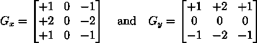
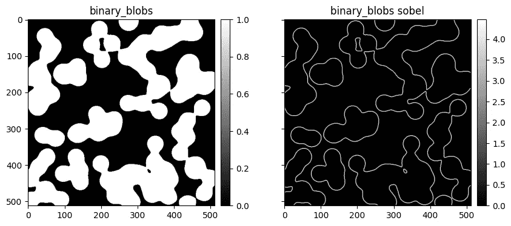
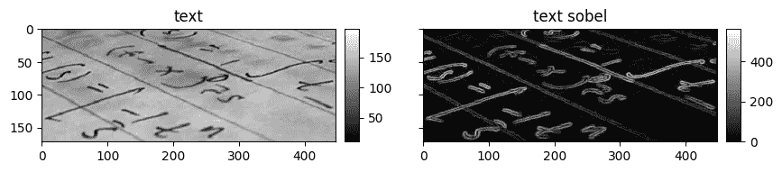
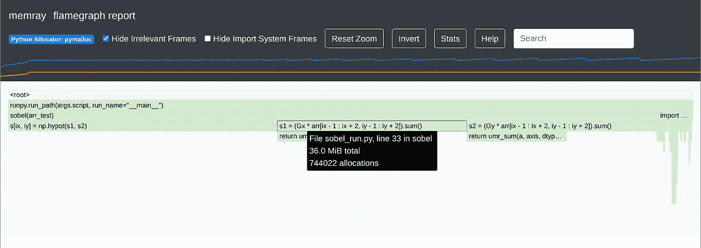
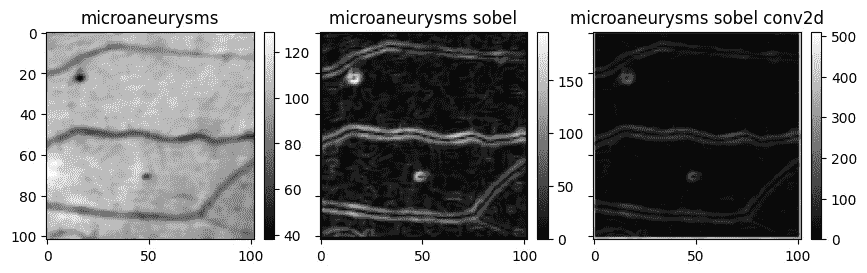

# 开发科学软件

> 原文：[`towardsdatascience.com/developing-scientific-software-d023a96188a3?source=collection_archive---------4-----------------------#2023-07-01`](https://towardsdatascience.com/developing-scientific-software-d023a96188a3?source=collection_archive---------4-----------------------#2023-07-01)

## 第二部分：Python 的实际应用

[](https://medium.com/@cdacostaf?source=post_page-----d023a96188a3--------------------------------)[](https://towardsdatascience.com/?source=post_page-----d023a96188a3--------------------------------) [Carlos Costa, Ph.D.](https://medium.com/@cdacostaf?source=post_page-----d023a96188a3--------------------------------)

·

[关注](https://medium.com/m/signin?actionUrl=https%3A%2F%2Fmedium.com%2F_%2Fsubscribe%2Fuser%2Fc1d045b63ee9&operation=register&redirect=https%3A%2F%2Ftowardsdatascience.com%2Fdeveloping-scientific-software-d023a96188a3&user=Carlos+Costa%2C+Ph.D.&userId=c1d045b63ee9&source=post_page-c1d045b63ee9----d023a96188a3---------------------post_header-----------) 发表在 [Towards Data Science](https://towardsdatascience.com/?source=post_page-----d023a96188a3--------------------------------) · 14 min read · 2023 年 7 月 1 日[](https://medium.com/m/signin?actionUrl=https%3A%2F%2Fmedium.com%2F_%2Fvote%2Ftowards-data-science%2Fd023a96188a3&operation=register&redirect=https%3A%2F%2Ftowardsdatascience.com%2Fdeveloping-scientific-software-d023a96188a3&user=Carlos+Costa%2C+Ph.D.&userId=c1d045b63ee9&source=-----d023a96188a3---------------------clap_footer-----------)

--

[](https://medium.com/m/signin?actionUrl=https%3A%2F%2Fmedium.com%2F_%2Fbookmark%2Fp%2Fd023a96188a3&operation=register&redirect=https%3A%2F%2Ftowardsdatascience.com%2Fdeveloping-scientific-software-d023a96188a3&source=-----d023a96188a3---------------------bookmark_footer-----------)

图片由 [Elton Luz](https://unsplash.com/@eltonluz?utm_source=medium&utm_medium=referral) 提供，来源于 [Unsplash](https://unsplash.com/?utm_source=medium&utm_medium=referral)

在本文中，我们将遵循 [本系列第一部分](https://medium.com/@cdacostaf/developing-of-scientific-software-c8e89f6ade7) 中提出的 TDD 原则，开发一种称为 Sobel 滤波器的边缘检测滤波器。

在第一篇文章中，我们讨论了为科学软件开发可靠测试方法的重要性——以及它的复杂性。我们还看到如何通过遵循受 TDD 启发但适用于科学计算的开发周期来克服这些问题。下面是这些指令的简化版本。

## 实现周期

1.  收集需求

1.  草拟设计

1.  实现初步测试

1.  实现你的 Alpha 版本

1.  构建预言库

1.  重新审视测试

1.  实现性能分析

## 优化周期

1.  优化

1.  重新实现

## 新方法周期

1.  实现新方法

1.  与之前策划的预言进行验证

# 开始：Sobel 滤波器

在本文中，我们将按照上述指令开发一个应用 [Sobel 滤波器](https://en.wikipedia.org/wiki/Sobel_operator) 的函数。Sobel 滤波器是常用的计算机视觉工具，用于检测或增强图像中的边缘。继续阅读以查看一些示例！



图 1\. Sobel–Feldman 算子的核心。来源：自己的工作。

从第一步开始，我们收集一些需求。我们将遵循 [这篇文章](https://homepages.inf.ed.ac.uk/rbf/HIPR2/sobel.htm) 中描述的 Sobel 滤波器的标准公式。简单来说，Sobel 算子包括用以下两个 3 × 3 核心对图像 A 进行卷积，平方每个像素，求和并取逐点平方根。如果 Ax 和 Ay 是卷积后的图像，那么 Sobel 滤波器 S 的结果是 √(Ax² + Ay²)。

# 需求

我们希望这个函数接受任何 2D 数组并生成另一个 2D 数组。我们可能希望它在 ndarray 的任何两个轴上操作。我们甚至可能希望它在两个以上（或以下）轴上工作。我们可能有处理数组边缘的规格。

现在让我们记住保持简单，先从 2D 实现开始。但在此之前，让我们草拟设计。

# 草拟设计

我们从一个简单的设计开始，利用 Python 的注释。我强烈推荐尽可能多地注释，并使用 [mypy](https://mypy-lang.org/) 作为 linter。

```py
from typing import Tuple

from numpy.core.multiarray import normalize_axis_index
from numpy.typing import NDArray

def sobel(arr: NDArray, axes: Tuple[int, int] = (-2, -1)) -> NDArray:
    """Compute the Sobel filter of an image

    Parameters
    ----------
    arr : NDArray
        Input image
    axes : Tuple[int, int], optional
        Axes over which to compute the filter, by default (-2, -1)

    Returns
    -------
    NDArray
        Output
    """
    # Only accepts 2D arrays
    if arr.ndim != 2:
        raise NotImplementedError

    # Ensure that the axis[0] is the first axis, and axis[1] is the second
    # axis. The obscure `normalize_axis_index` converts negative indices to
    # indices between 0 and arr.ndim - 1.
    if any(
        normalize_axis_index(ax, arr.ndim) != i
        for i, ax in zip(range(2), axes)
    ):
        raise NotImplementedError
    pass
```

# 实现测试

这个函数功能不多。但它有文档、注释，并且其当前限制也已包含在内。现在我们有了设计，我们立即转向测试。

首先，我们注意到空图像（全零）没有边缘。因此，它们也必须输出零。实际上，任何常量图像也应返回零。让我们把这点融入到第一个测试中。我们还将探讨如何使用猴子测试来测试多个数组。

```py
# test_zero_constant.py

import numpy as np
import pytest

# Test multiple dtypes at once
@pytest.mark.parametrize(
    "dtype",
    ["float16", "float32", "float64", "float128"],
)
def test_zero(dtype):
    # Set random seed
    seed = int(np.random.rand() * (2**32 - 1))
    np.random.seed(seed)

    # Create a 2D array of random shape and fill with zeros
    nx, ny = np.random.randint(3, 100, size=(2,))
    arr = np.zeros((nx, ny), dtype=dtype)

    # Apply sobel function
    arr_sob = sobel(arr)

    # `assert_array_equal` should fail most of the times.
    # It will only work when `arr_sob` is identically zero,
    # which is usually not the case.
    # DO NOT USE!
    # np.testing.assert_array_equal(
    #     arr_sob, 0.0, err_msg=f"{seed=} {nx=}, {ny=}"
    # )

    # `assert_almost_equal` can fail when used with high decimals.
    # It also relies on float64 checking, which might fail for
    # float128 types.
    # DO NOT USE!
    # np.testing.assert_almost_equal(
    #     arr_sob,
    #     np.zeros_like(arr),
    #     err_msg=f"{seed=} {nx=}, {ny=}",
    #     decimal=4,
    # )

    # `assert_allclose` with custom tolerance is my preferred method
    # The 10 is arbitrary and depends on the problem. If a method
    # which you know to be correct does not pass, increase to 100, etc.
    # If the tolerance needed to make the tests pass is too high, make
    # sure the method is actually correct.
    tol = 10 * np.finfo(arr.dtype).eps
    err_msg = f"{seed=} {nx=}, {ny=} {tol=}"  # Log seeds and other info
    np.testing.assert_allclose(
        arr_sob,
        np.zeros_like(arr),
        err_msg=err_msg,
        atol=tol,  # rtol is useless for desired=zeros
    )

@pytest.mark.parametrize(
    "dtype", ["float16", "float32", "float64", "float128"]
)
def test_constant(dtype):
    seed = int(np.random.rand() * (2**32 - 1))
    np.random.seed(seed)

    nx, ny = np.random.randint(3, 100, size=(2,))
    constant = np.random.randn(1).item()
    arr = np.full((nx, ny), fill_value=constant, dtype=dtype)
    arr_sob = sobel(arr)

    tol = 10 * np.finfo(arr.dtype).eps
    err_msg = f"{seed=} {nx=}, {ny=} {tol=}"
    np.testing.assert_allclose(
        arr_sob,
        np.zeros_like(arr),
        err_msg=err_msg,
        atol=tol,  # rtol is useless for desired=zeros
    )
```

此代码片段可以从命令行运行

```py
$ pytest -qq -s -x -vv --durations=0 test_zero_constant.py
```

# Alpha 版本

当然，我们的测试目前会失败，但现在足够了。让我们实现第一个版本。

```py
from typing import Tuple

import numpy as np
from numpy.core.multiarray import normalize_axis_index
from numpy.typing import NDArray

def sobel(arr: NDArray, axes: Tuple[int, int] = (-2, -1)) -> NDArray:
    if arr.ndim != 2:
        raise NotImplementedError
    if any(
        normalize_axis_index(ax, arr.ndim) != i
        for i, ax in zip(range(2), axes)
    ):
        raise NotImplementedError

    # Define our filter kernels. Notice they inherit the input type, so
    # that a float32 input never has to be cast to float64 for computation.
    # But can you see where using another dtype for Gx and Gy might make
    # sense for some input dtypes?
    Gx = np.array(
        [[-1, 0, 1], [-2, 0, 2], [-1, 0, 1]],
        dtype=arr.dtype,
    )
    Gy = np.array(
        [[-1, -2, -1], [0, 0, 0], [1, 2, 1]],
        dtype=arr.dtype,
    )

    # Create the output array and fill with zeroes
    s = np.zeros_like(arr)
    for ix in range(1, arr.shape[0] - 1):
        for iy in range(1, arr.shape[1] - 1):
            # Pointwise multiplication followed by sum, aka convolution
            s1 = (Gx * arr[ix - 1 : ix + 2, iy - 1 : iy + 2]).sum()
            s2 = (Gy * arr[ix - 1 : ix + 2, iy - 1 : iy + 2]).sum()
            s[ix, iy] = np.hypot(s1, s2)  # np.sqrt(s1**2 + s2**2)
    return s
```

使用这个新函数，所有测试应该通过，我们应该得到这样的输出：

```py
$ pytest -qq -s -x -vv --durations=0 test_zero_constant.py
........
======================================== slowest durations =========================================
0.09s call     t_049988eae7f94139a7067f142bf2852f.py::test_constant[float16]
0.08s call     t_049988eae7f94139a7067f142bf2852f.py::test_zero[float64]
0.06s call     t_049988eae7f94139a7067f142bf2852f.py::test_constant[float128]
0.04s call     t_049988eae7f94139a7067f142bf2852f.py::test_zero[float128]
0.04s call     t_049988eae7f94139a7067f142bf2852f.py::test_constant[float64]
0.02s call     t_049988eae7f94139a7067f142bf2852f.py::test_constant[float32]
0.01s call     t_049988eae7f94139a7067f142bf2852f.py::test_zero[float16]

(17 durations < 0.005s hidden.  Use -vv to show these durations.)
8 passed in 0.35s
```

到目前为止，我们有：

1.  收集了我们问题的需求。

1.  绘制了初步设计。

1.  实现了一些测试。

1.  实现了通过这些测试的 alpha 版本。

这些测试为未来版本提供了*验证*，以及一个非常基础的*oracle 库*。但是，尽管单元测试在捕捉与预期结果的细微偏差方面非常出色，它们在区分错误结果与数量上不同——但仍然正确——的结果方面表现并不好。假设明天我们要实现另一个 Sobel 型操作符，它有一个更长的内核。我们不期望结果与当前版本完全匹配，但我们期望两个函数的输出在质量上非常相似。

此外，尝试对我们的函数进行多种不同输入是一个很好的做法，以了解它们对不同输入的表现。这确保了我们科学地验证结果。

[Scikit-image](https://scikit-image.org/)拥有一个出色的图像库，我们可以用它来创建 oracles。

```py
# !pip installscikit-image pooch
from typing import Dict, Callable

import numpy as np
import skimage.data

bwimages: Dict[str, np.ndarray] = {}
for attrname in skimage.data.__all__:
    attr = getattr(skimage.data, attrname)
    # Data are obtained via function calls
    if isinstance(attr, Callable):
        try:
            # Download the data
            data = attr()
            # Ensure it is a 2D array
            if isinstance(data, np.ndarray) and data.ndim == 2:
                # Convert from various int types to float32 to better
                # assess precision
                bwimages[attrname] = data.astype(np.float32)
        except:
            continue

# Apply sobel to images
bwimages_sobel = {k: sobel(v) for k, v in bwimages.items()}
```

一旦我们有了数据，就可以绘制它。

```py
import matplotlib.pyplot as plt
from mpl_toolkits.axes_grid1 import make_axes_locatable

def create_colorbar(im, ax):
    divider = make_axes_locatable(ax)
    cax = divider.append_axes("right", size="5%", pad=0.1)
    cb = ax.get_figure().colorbar(im, cax=cax, orientation="vertical")
    return cax, cb

for name, data in bwimages.items():
    fig, axs = plt.subplots(
        1, 2, figsize=(10, 4), sharex=True, sharey=True
    )
    im = axs[0].imshow(data, aspect="equal", cmap="gray")
    create_colorbar(im, axs[0])
    axs[0].set(title=name)

    im = axs[1].imshow(bwimages_sobel[name], aspect="equal", cmap="gray")
    create_colorbar(im, axs[1])
    axs[1].set(title=f"{name} sobel")
```



图 2\. “Binary blobs”数据集在 Sobel 滤波之前（左）和之后（右）。来源：自制。



图 3\. “Text”数据集在 Sobel 滤波之前（左）和之后（右）。来源：自制。

这些看起来非常好！我建议将这些数据存储为数组和图形，以便我能快速对照新版本。我强烈推荐[HD5F](https://docs.h5py.org/en/stable/)用于数组存储。你还可以设置一个[Sphinx Gallery](https://sphinx-gallery.github.io/stable/index.html)，在更新文档时直接生成图形，这样你就有了一个可重复的图形构建，可以用来与以前的版本进行对比。

在结果经过验证后，你可以将它们存储在磁盘上，并将它们作为单元测试的一部分进行使用。类似这样：

```py
oracle_library = [(k, v, bwimages_sobel[k]) for k, v in bwimages.items()]
# save_to_disk(oracle_library, ...)
```

```py
# test_oracle.py
import numpy as np
import pytest
from numpy.typing import NDArray

# oracle_library = read_from_disk(...)

@pytest.mark.parametrize("name,input,output", oracle_library)
def test_oracles(name: str, input: NDArray, output: NDArray):
    output_new = sobel(input)
    tol = 10 * np.finfo(input.dtype).eps
    mean_avg_error = np.abs(output_new - output).mean()
    np.testing.assert_allclose(
        output_new,
        output,
        err_msg=f"{name=} {tol=} {mean_avg_error=}",
        atol=tol,
        rtol=tol,
    )
```

# 性能分析

计算这些数据集的 Sobel 滤波器花费了一段时间！因此下一步是对代码进行性能分析。我建议为每个测试创建一个`benchmark_xyz.py`文件，并定期重新运行它们，以探测性能回归。这甚至可以成为你的单元测试的一部分，但在这个示例中我们不会深入探讨。另一个想法是使用上述 oracles 进行基准测试。

有许多方法来计时代码执行。要获得系统范围的“真实”经过时间，使用内置`time`模块中的`perf_counter_ns`来以纳秒为单位测量时间。在 Jupyter notebook 中，内置的`[%%timeit](https://ipython.readthedocs.io/en/stable/interactive/magics.html#cell-magics)` [cell magic](https://ipython.readthedocs.io/en/stable/interactive/magics.html#cell-magics)会对某个单元执行时间进行计时。下面的装饰器灵感来源于这个 cell magic，并可以用来计时任何函数。

```py
import time
from functools import wraps
from typing import Callable, Optional

def sizeof_fmt(num, suffix="s"):
    for unit in ["n", "μ", "m"]:
        if abs(num) < 1000:
            return f"{num:3.1f} {unit}{suffix}"
        num /= 1000
    return f"{num:.1f}{suffix}"

def timeit(
    func_or_number: Optional[Callable] = None,
    number: int = 10,
) -> Callable:
    """Apply to a function to time its executions.

    Parameters
    ----------
    func_or_number : Optional[Callable], optional
        Function to be decorated or `number` argument (see below), by
        default None
    number : int, optional
        Number of times the function will run to obtain statistics, by
        default 10

    Returns
    -------
    Callable
        When fed a function, returns the decorated function. Otherwise
        returns a decorator.

    Examples
    --------

    .. code-block:: python

        @timeit
        def my_fun():
            pass

        @timeit(100)
        def my_fun():
            pass

        @timeit(number=3)
        def my_fun():
            pass

    """
    if isinstance(func_or_number, Callable):
        func = func_or_number
        number = number
    elif isinstance(func_or_number, int):
        func = None
        number = func_or_number
    else:
        func = None
        number = number

    def decorator(f):
        @wraps(f)
        def wrapper(*args, **kwargs):
            runs_ns = np.empty((number,))

            # Run first and measure store the result
            start_time = time.perf_counter_ns()
            result = f(*args, **kwargs)
            runs_ns[0] = time.perf_counter_ns() - start_time
            for i in range(1, number):
                start_time = time.perf_counter_ns()
                f(*args, **kwargs)  # Without storage, faster
                runs_ns[i] = time.perf_counter_ns() - start_time
            time_msg = f"{sizeof_fmt(runs_ns.mean())} ± "
            time_msg += f"{sizeof_fmt(runs_ns.std())}"
            print(
                f"{time_msg} per run (mean ± std. dev. of {number} runs)"
            )
            return result

        return wrapper

    if func is not None:
        return decorator(func)
    return decorator
```

对我们的函数进行测试：

```py
arr_test = np.random.randn(500, 500)
sobel_timed = timeit(sobel)
sobel_timed(arr_test);
# 3.9s ± 848.9 ms per run (mean ± std. dev. of 10 runs)
```

不太快 :(

在调查慢速或性能回归时，还可以跟踪每一行的运行时间。`[line_profiler](https://github.com/pyutils/line_profiler)` [库](https://github.com/pyutils/line_profiler) 是一个很好的资源。它可以通过 [Jupyter 单元魔法](https://ipython-books.github.io/43-profiling-your-code-line-by-line-with-line_profiler/) 或使用 API 来使用。以下是一个 API 示例：

```py
from line_profiler import LineProfiler

lp = LineProfiler()
lp_wrapper = lp(sobel)
lp_wrapper(arr_test)
lp.print_stats(output_unit=1)  # 1 for seconds, 1e-3 for milliseconds, etc.
```

这是一个示例输出：

```py
Timer unit: 1 s

Total time: 4.27197 s
File: /tmp/ipykernel_521529/1313985340.py
Function: sobel at line 8

Line #      Hits         Time  Per Hit   % Time  Line Contents
==============================================================
     8                                           def sobel(arr: NDArray, axes: Tuple[int, int] = (-2, -1)) -> NDArray:
     9                                               # Only accepts 2D arrays
    10         1          0.0      0.0      0.0      if arr.ndim != 2:
    11                                                   raise NotImplementedError
    12                                           
    13                                               # Ensure that the axis[0] is the first axis, and axis[1] is the second
    14                                               # axis. The obscure `normalize_axis_index` converts negative indices to
    15                                               # indices between 0 and arr.ndim - 1.
    16         1          0.0      0.0      0.0      if any(
    17                                                   normalize_axis_index(ax, arr.ndim) != i
    18         1          0.0      0.0      0.0          for i, ax in zip(range(2), axes)
    19                                               ):
    20                                                   raise NotImplementedError
    21                                           
    22         1          0.0      0.0      0.0      Gx = np.array(
    23         1          0.0      0.0      0.0          [[-1, 0, 1], [-2, 0, 2], [-1, 0, 1]],
    24         1          0.0      0.0      0.0          dtype=arr.dtype,
    25                                               )
    26         1          0.0      0.0      0.0      Gy = np.array(
    27         1          0.0      0.0      0.0          [[-1, -2, -1], [0, 0, 0], [1, 2, 1]],
    28         1          0.0      0.0      0.0          dtype=arr.dtype,
    29                                               )
    30         1          0.0      0.0      0.0      s = np.zeros_like(arr)
    31       498          0.0      0.0      0.0      for ix in range(1, arr.shape[0] - 1):
    32    248004          0.1      0.0      2.2          for iy in range(1, arr.shape[1] - 1):
    33    248004          1.8      0.0     41.5              s1 = (Gx * arr[ix - 1 : ix + 2, iy - 1 : iy + 2]).sum()
    34    248004          1.7      0.0     39.5              s2 = (Gy * arr[ix - 1 : ix + 2, iy - 1 : iy + 2]).sum()
    35    248004          0.7      0.0     16.8              s[ix, iy] = np.hypot(s1, s2)
    36         1          0.0      0.0      0.0      return s
```

大量时间花费在最内层的循环中。NumPy 更喜欢矢量化数学，因为这样可以依赖编译的代码。由于我们使用显式的 for 循环，因此这个函数非常慢是合理的。

此外，明智地处理循环中的内存分配非常重要。NumPy 对于在循环中分配小量内存有一定的智能，因此定义` s1 `或` s2 `的行可能并未分配新的内存。但它们也可能分配了，或者可能在幕后有一些我们未察觉的内存分配。因此，我建议也进行内存分析。我喜欢使用 [Memray](https://bloomberg.github.io/memray/)，但还有其他工具，如 [Fil](https://pythonspeed.com/fil/docs/) 和 [Sciagraph](https://www.sciagraph.com/)。我还会避免使用 [memory_profiler](https://github.com/pythonprofilers/memory_profiler)，因为（非常不幸的是！）它不再维护。此外，Memray 更强大。以下是 Memray 使用中的一个示例：

```py
$ # Create sobel.bin which holds the profiling information
$ memray run -fo sobel.bin --trace-python-allocators sobel_run.py
Writing profile results into sobel.bin
Memray WARNING: Correcting symbol for aligned_alloc from 0x7fc5c984d8f0 to 0x7fc5ca4a5ce0
[memray] Successfully generated profile results.

You can now generate reports from the stored allocation records.
Some example commands to generate reports:

python3 -m memray flamegraph sobel.bin
```

```py
$ # Generate flame graph
$ memray flamegraph -fo sobel_flamegraph.html --temporary-allocations sobel.bin
⠙ Calculating high watermark... ━━━━━━━━━━━━━━━━━━━━━━━━━━━━━━━━━━╸  99% 0:00:0100:01
⠏ Processing allocation records... ━━━━━━━━━━━━━━━━━━━━━━━━━━━━━━━╸  98% 0:00:0100:01
Wrote sobel_flamegraph.html
```

```py
$ # Show memory tree
$ memray tree --temporary-allocations sobel.bin

⠧ Calculating high watermark... ━━━━━━━━━━━━━━━━━━━━━━━━━━━━━━━━━━╸ 100% 0:00:0100:01
⠧ Processing allocation records... ━━━━━━━━━━━━━━━━━━━━━━━━━━━━━━━╸ 100% 0:00:0100:01

Allocation metadata
-------------------
Command line arguments: 
'memray run -fo sobel.bin --trace-python-allocators sobel_run.py'
Peak memory size: 11.719MB
Number of allocations: 15332714

Biggest 10 allocations:
-----------------------
📂 123.755MB (100.00 %) <ROOT>  
└── [[3 frames hidden in 2 file(s)]]
    └── 📂 123.755MB (100.00 %) _run_code  /usr/lib/python3.10/runpy.py:86
        ├── 📂 122.988MB (99.38 %) <module>  sobel_run.py:40
        │   ├── 📄 51.087MB (41.28 %) sobel  sobel_run.py:35
        │   ├── [[1 frames hidden in 1 file(s)]]
        │   │   └── 📄 18.922MB (15.29 %) _sum  
        │   │       lib/python3.10/site-packages/numpy/core/_methods.py:49
        │   └── [[1 frames hidden in 1 file(s)]]
        │       └── 📄 18.921MB (15.29 %) _sum  
        │           lib/python3.10/site-packages/numpy/core/_methods.py:49
...
```



图 4\. Memray 火焰图（alpha 版本）。来源：自制作品。

# Beta 版本和一个 Bug

现在我们有了一个可用的 alpha 版本和一些性能分析函数，我们将利用 [SciPy 库](https://scipy.org/) 来获得一个更快的版本。

```py
from typing import Tuple

import numpy as np
from numpy.core.multiarray import normalize_axis_index
from numpy.typing import NDArray
from scipy.signal import convolve2d

def sobel_conv2d(
    arr: NDArray, axes: Tuple[int, int] = (-2, -1)
) -> NDArray:
    if arr.ndim != 2:
        raise NotImplementedError
    if any(
        normalize_axis_index(ax, arr.ndim) != i
        for i, ax in zip(range(2), axes)
    ):
        raise NotImplementedError

    # Create the kernels as a single, complex array. Allows us to use
    # np.abs instead of np.hypot to calculate the magnitude.
    G = np.array(
        [[-1, 0, 1], [-2, 0, 2], [-1, 0, 1]],
        dtype=arr.dtype,
    )
    G = G + 1j * np.array(
        [[-1, -2, -1], [0, 0, 0], [1, 2, 1]],
        dtype=arr.dtype,
    )
    s = convolve2d(arr, G, mode="same")
    np.absolute(s, out=s)  # In-place abs
    return s.real
```

```py
sobel_timed = timeit(sobel_conv2d)
sobel_timed(arr_test)
# 14.3 ms ± 1.71 ms per loop (mean ± std. dev. of 10 runs)
```

好得多！但它是正确的吗？



图 5\. “微动脉瘤” 数据集在使用两个版本的 Sobel 滤波前（左）和后（中间和右）。来源：自制作品。

图像看起来非常相似，但如果注意颜色比例，它们并不相同。运行测试时标记了一个小的平均误差。幸运的是，我们现在可以很好地检测定量和定性差异。

在调查这个 Bug 后，我们将其归因于不同的边界条件。查看 `[convolve2d](https://docs.scipy.org/doc/scipy/reference/generated/scipy.signal.convolve2d.html)` [文档](https://docs.scipy.org/doc/scipy/reference/generated/scipy.signal.convolve2d.html) 告诉我们，输入数组在应用卷积核之前会用零填充。在 alpha 版本中，我们填充了*输出*！

哪一个是正确的？可以说 SciPy 实现更有意义。在这种情况下，我们应该采用新版本作为标准，如果需要，修复 alpha 版本以匹配它。这在科学软件开发中很常见：如何更好地做事的新信息会改变标准和测试。

在这种情况下，修复很简单，在处理之前用零填充数组即可。

```py
def sobel_v2(arr: NDArray, axes: Tuple[int, int] = (-2, -1)) -> NDArray:
    # ...
    arr = np.pad(arr, (1,))  # After padding, it is shaped (nx + 2, ny + 2)
    s = np.zeros_like(arr)
    for ix in range(1, arr.shape[0] - 1):
        for iy in range(1, arr.shape[1] - 1):
            s1 = (Gx * arr[ix - 1 : ix + 2, iy - 1 : iy + 2]).sum()
            s2 = (Gy * arr[ix - 1 : ix + 2, iy - 1 : iy + 2]).sum()
            s[ix - 1, iy - 1] = np.hypot(s1, s2)  # Adjust indices
    return s
```

一旦我们修正了函数，就可以更新依赖于它们的测试和预期结果。

# 最后的思考

我们展示了如何在[这篇文章](https://medium.com/@cdacostaf/developing-of-scientific-software-c8e89f6ade7)中探讨的一些软件开发理念中付诸实践。我们还介绍了一些工具，你可以使用它们来开发高质量、高性能的代码。

我建议你在自己的项目中尝试这些想法。特别是，练习代码分析和改进。我们编写的 Sobel 滤波器函数非常低效，我建议尝试改进它。

例如，可以尝试使用如[Numba](https://numba.readthedocs.io/en/stable/user/5minguide.html)的 JIT 编译器进行 CPU 并行化，将内部循环移植到[Cython](https://cython.readthedocs.io/en/latest/src/tutorial/cython_tutorial.html)，或者使用[Numba](https://numba.readthedocs.io/en/stable/cuda/index.html)或[CuPy](https://docs.cupy.dev/en/stable/user_guide/basic.html)实现 CUDA GPU 函数。欢迎查看我关于用 Numba 编写 CUDA 内核的系列文章。
