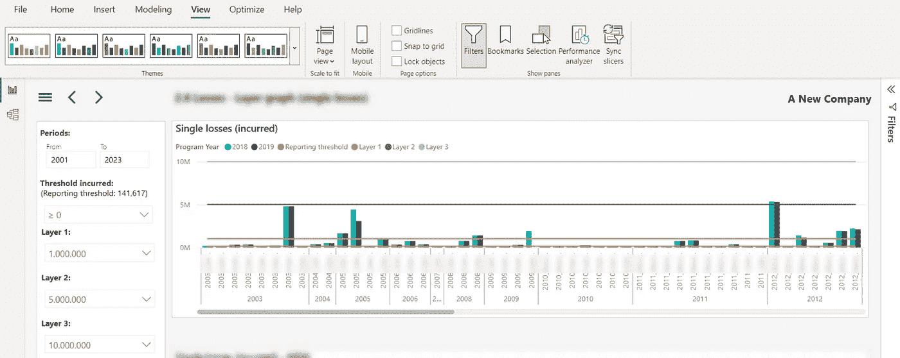

# 细节决定成败：通过跳出框框成为 Power BI 冠军

> 原文：[`towardsdatascience.com/devil-is-in-the-detail-become-a-power-bi-champion-by-thinking-out-of-the-box-54c173a07733?source=collection_archive---------9-----------------------#2023-07-07`](https://towardsdatascience.com/devil-is-in-the-detail-become-a-power-bi-champion-by-thinking-out-of-the-box-54c173a07733?source=collection_archive---------9-----------------------#2023-07-07)

## Power BI 充满了“未被充分认可的英雄”！其中之一是分析面板，结合视觉类型的变化，显著帮助我提升了 Power BI 报告的性能

 [Nikola Ilic](https://datamozart.medium.com/?source=post_page-----54c173a07733--------------------------------)

·

[关注](https://medium.com/m/signin?actionUrl=https%3A%2F%2Fmedium.com%2F_%2Fsubscribe%2Fuser%2F64005b7daa38&operation=register&redirect=https%3A%2F%2Ftowardsdatascience.com%2Fdevil-is-in-the-detail-become-a-power-bi-champion-by-thinking-out-of-the-box-54c173a07733&user=Nikola+Ilic&userId=64005b7daa38&source=post_page-64005b7daa38----54c173a07733---------------------post_header-----------) 发表在 [Towards Data Science](https://towardsdatascience.com/?source=post_page-----54c173a07733--------------------------------) · 5 分钟阅读 · 2023 年 7 月 7 日

--

[由 Alice Dietrich 在 Unsplash 上拍摄的照片](https://unsplash.com/de/fotos/FwF_fKj5tBo)

几周前，我在为我的一位客户进行[Power BI 报告的性能优化](https://data-mozart.com/mastering-dp-500-implement-performance-improvements-in-power-query-and-data-sources/)。该报告页面的渲染速度非常慢（超过 15 秒）。给你一点背景信息：该报告使用的是 SSAS Tabular 2016 中托管的表格模型的实时连接。

# 如果我告诉你，我成功地将报告页面的性能提升了两倍以上，而没有修改计算背后的任何一行 DAX 代码，你会怎么想？！

继续阅读，你将看到为什么细节常常决定成败，以及如何跳出思维框架可能帮助你成为真正的 Power BI 大师:)

作者提供的图片

让我快速解释一下上面的插图。图中有一条折线和聚集柱状图…
