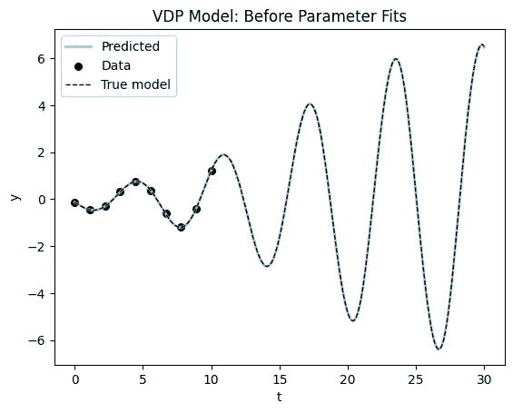

# 作为 Pytorch 神经网络层的微分方程

> 原文：[`towardsdatascience.com/differential-equations-as-a-pytorch-neural-network-layer-7614ba6d587f`](https://towardsdatascience.com/differential-equations-as-a-pytorch-neural-network-layer-7614ba6d587f)

## 如何在 pytorch 中使用微分方程层

[](https://medium.com/@moleculeboy24?source=post_page-----7614ba6d587f--------------------------------)[](https://towardsdatascience.com/?source=post_page-----7614ba6d587f--------------------------------) [Kevin Hannay](https://medium.com/@moleculeboy24?source=post_page-----7614ba6d587f--------------------------------)

·发表于 [Towards Data Science](https://towardsdatascience.com/?source=post_page-----7614ba6d587f--------------------------------) ·阅读时间 17 分钟·2023 年 4 月 26 日

--

微分方程是现代科学的大多数数学基础。它们通过描述变化率（微分）的方程来描述系统的状态。许多系统都可以通过这种形式的方程很好地描述。例如，描述运动、电磁学和量子力学的物理定律都采用这种形式。更广泛地说，微分方程通过质量作用定律描述化学反应速率，通过 SIR 模型描述神经元放电和疾病传播。

深度学习革命带来了新一套工具，用于在巨大的数据集上进行大规模优化。在这篇文章中，我们将探讨如何使用这些工具来拟合 pytorch 中自定义微分方程层的参数。

## 我们要解决的问题是什么？

假设我们有一些时间序列数据 y(t)，我们希望用微分方程对其建模。数据表现为在时间 tᵢ 上的一组观察值 yᵢ。基于对基础系统的某些领域知识，我们可以写出一个微分方程来近似该系统。

在最一般的形式下，这表现为：


一般常微分方程系统

其中 y 是系统的状态，t 是时间，而 θ 是模型的参数。在这篇文章中，我们将假设参数 θ 是未知的，我们希望从数据中学习这些参数。

本文的所有代码可在 [github](https://github.com/khannay/paramfittorchdemo) 或 [colab notebook](https://colab.research.google.com/github/khannay/paramfittorchdemo/blob/main/nbs/00_training.ipynb) 上找到，所以如果你想跟随学习，无需尝试复制粘贴。

让我们导入本帖所需的库。我们将使用的唯一非标准机器学习库是 [torchdiffeq](https://github.com/rtqichen/torchdiffeq) 库来解决微分方程。该库在 pytorch 中实现了数值微分方程求解器。

```py
import torch 
import torch.nn as nn
from torchdiffeq import odeint as odeint
import pylab as plt
from torch.utils.data import Dataset, DataLoader
from typing import Callable, List, Tuple, Union, Optional
from pathlib import Path
```

## 模型

我们建模过程的第一步是定义模型。对于微分方程，这意味着我们必须选择函数 f(y,t;θ) 的形式和表示参数 θ 的方式。我们还需要以与 pytorch 兼容的方式完成这项工作。

这意味着我们需要将我们的函数编码为 *torch.nn.Module* 类。正如你所看到的，这非常简单，只需要定义两个方法。让我们从三个示例模型中的第一个开始。

## van Der Pol 振荡器 (VDP)

我们可以使用 *torch.nn.Module* 类来定义一个微分方程系统，其中参数通过 *torch.nn.Parameter* 声明创建。这让 pytorch 知道我们希望为这些参数累积梯度。我们还可以通过不使用此声明来包含固定参数（我们不想调整的参数）。

我们将使用的第一个示例是经典的 VDP 振荡器，它是一个具有单个参数 μ 的非线性振荡器。该系统的微分方程是：


VDP 振荡器方程

其中 **x** 和 **y** 是状态变量。VDP 模型用于模拟从电子电路到心律失常和昼夜节律的一切。我们可以在 pytorch 中定义此系统如下：

```py
class VDP(nn.Module):
    """ 
    Define the Van der Pol oscillator as a PyTorch module.
    """
    def __init__(self, 
                 mu: float, # Stiffness parameter of the VDP oscillator
                 ):
        super().__init__() 
        self.mu = torch.nn.Parameter(torch.tensor(mu)) # make mu a learnable parameter

    def forward(self, 
                t: float, # time index
                state: torch.TensorType, # state of the system first dimension is the batch size
                ) -> torch.Tensor: # return the derivative of the state
        """ 
            Define the right hand side of the VDP oscillator.
        """
        x = state[..., 0] # first dimension is the batch size
        y = state[..., 1]
        dX = self.mu*(x-1/3*x**3 - y)
        dY = 1/self.mu*x
        # trick to make sure our return value has the same shape as the input
        dfunc = torch.zeros_like(state) 
        dfunc[..., 0] = dX
        dfunc[..., 1] = dY
        return dfunc

    def __repr__(self):
        """Print the parameters of the model."""
        return f" mu: {self.mu.item()}"
```

你只需要定义 *__init__* 方法 (**init**) 和 forward 方法。我添加了一个字符串方法 __*repr__* 来美观地打印参数。关键点在于我们如何在 forward 方法中将微分方程转换为 torch 代码。此方法需要定义微分方程的右侧。

让我们看看如何使用来自 torchdiffeq 的 odeint 方法来集成这个模型：

```py
vdp_model = VDP(mu=0.5)

# Create a time vector, this is the time axis of the ODE
ts = torch.linspace(0,30.0,1000)
# Create a batch of initial conditions 
batch_size = 30
# Creates some random initial conditions
initial_conditions = torch.tensor([0.01, 0.01]) + 0.2*torch.randn((batch_size,2))

# Solve the ODE, odeint comes from torchdiffeq
sol = odeint(vdp_model, initial_conditions, ts, method='dopri5').detach().numpy()
plt.plot(ts, sol[:,:,0], lw=0.5);
plt.title("Time series of the VDP oscillator");
plt.xlabel("time");
plt.ylabel("x");p
```


这里是解的相平面图（动态状态的参数图的相平面图）。

```py
# Check the solution
plt.plot(sol[:,:,0], sol[:,:,1], lw=0.5);
plt.title("Phase plot of the VDP oscillator");
plt.xlabel("x");
plt.ylabel("y");
```


颜色表示我们批次中的 30 条独立轨迹。解返回为具有 (time_points, batch number, dynamical_dimension) 维度的 torch 张量。

```py
sol.shape
(1000, 30, 2)
```

## Lotka-Volterra 捕食者-猎物方程

作为另一个示例，我们创建一个 Lotka-Volterra 捕食者-猎物方程的模块。在 Lotka-Volterra (LV) 捕食者-猎物模型中，有两个主要变量：猎物的种群 (x) 和捕食者的种群 (y)。该模型由以下方程定义：


捕食者-猎物动态的 Lotka-Volterra 方程

除了主要变量，还有四个参数用于描述模型中的各种生态因素：

α 表示在没有捕食者情况下猎物种群的内在增长率。β 表示捕食者对猎物的捕食率。γ 表示在没有猎物情况下捕食者种群的死亡率。δ 表示捕食者将消耗的猎物转化为新捕食者生物量的效率。

这些变量和参数共同描述了生态系统中捕食者与猎物之间的相互作用动态，并用于数学建模猎物和捕食者种群随时间的变化。这里是这个系统作为 *torch.nn.Module* 的实现：

```py
class LotkaVolterra(nn.Module):
    """ 
     The Lotka-Volterra equations are a pair of first-order, non-linear, differential equations
     describing the dynamics of two species interacting in a predator-prey relationship.
    """
    def __init__(self,
                 alpha: float = 1.5, # The alpha parameter of the Lotka-Volterra system
                 beta: float = 1.0, # The beta parameter of the Lotka-Volterra system
                 delta: float = 3.0, # The delta parameter of the Lotka-Volterra system
                 gamma: float = 1.0 # The gamma parameter of the Lotka-Volterra system
                 ) -> None:
        super().__init__()
        self.model_params = torch.nn.Parameter(torch.tensor([alpha, beta, delta, gamma]))

    def forward(self, t, state):
        x = state[...,0]      #variables are part of vector array u 
        y = state[...,1]
        sol = torch.zeros_like(state)

        #coefficients are part of tensor model_params
        alpha, beta, delta, gamma = self.model_params    
        sol[...,0] = alpha*x - beta*x*y
        sol[...,1] = -delta*y + gamma*x*y
        return sol

    def __repr__(self):
        return f" alpha: {self.model_params[0].item()}, \
            beta: {self.model_params[1].item()}, \
                delta: {self.model_params[2].item()}, \
                    gamma: {self.model_params[3].item()}"
```

这遵循了与第一个示例相同的模式，主要区别在于我们现在有四个参数，并将它们存储为 *model_params* 张量。以下是捕食者-猎物方程的积分和绘图代码。

```py
lv_model = LotkaVolterra() #use default parameters
ts = torch.linspace(0,30.0,1000) 
batch_size = 30
# Create a batch of initial conditions (batch_dim, state_dim) as small perturbations around one value
initial_conditions = torch.tensor([[3,3]]) + 0.50*torch.randn((batch_size,2))
sol = odeint(lv_model, initial_conditions, ts, method='dopri5').detach().numpy()
# Check the solution

plt.plot(ts, sol[:,:,0], lw=0.5);
plt.title("Time series of the Lotka-Volterra system");
plt.xlabel("time");
plt.ylabel("x");
```


现在是系统的相平面图：


## 洛伦兹系统

我们将使用的最后一个示例是洛伦兹方程，这些方程因其美丽的混沌动态图而闻名。它们最初来源于流体动力学的简化模型，并呈现以下形式：


其中 x、y 和 z 是状态变量，σ、ρ 和 β 是系统参数。

```py
class Lorenz(nn.Module):
    """ 
    Define the Lorenz system as a PyTorch module.
    """
    def __init__(self, 
                 sigma: float =10.0, # The sigma parameter of the Lorenz system
                 rho: float=28.0, # The rho parameter of the Lorenz system
                beta: float=8.0/3, # The beta parameter of the Lorenz system
                ):
        super().__init__() 
        self.model_params = torch.nn.Parameter(torch.tensor([sigma, rho, beta]))

    def forward(self, t, state):
        x = state[...,0]      #variables are part of vector array u 
        y = state[...,1]
        z = state[...,2]
        sol = torch.zeros_like(state)

        sigma, rho, beta = self.model_params    #coefficients are part of vector array p
        sol[...,0] = sigma*(y-x)
        sol[...,1] = x*(rho-z) - y
        sol[...,2] = x*y - beta*z
        return sol

    def __repr__(self):
        return f" sigma: {self.model_params[0].item()}, \
            rho: {self.model_params[1].item()}, \
                beta: {self.model_params[2].item()}"
```

这展示了如何集成这个系统并绘制结果。该系统（在这些参数值下）显示了混沌动态，因此起始条件虽然很接近，但会指数级地彼此发散。

```py
lorenz_model = Lorenz()
ts = torch.linspace(0,50.0,3000)
batch_size = 30
# Create a batch of initial conditions (batch_dim, state_dim) as small perturbations around one value
initial_conditions = torch.tensor([[1.0,0.0,0.0]]) + 0.10*torch.randn((batch_size,3))
sol = odeint(lorenz_model, initial_conditions, ts, method='dopri5').detach().numpy()

# Check the solution
plt.plot(ts[:2000], sol[:2000,:,0], lw=0.5);
plt.title("Time series of the Lorenz system");
plt.xlabel("time");
plt.ylabel("x");
```


这里展示了第一组初始条件的著名蝴蝶图（相平面图）。


洛伦兹方程展示了混沌动态，并描绘出一个美丽的奇异吸引子。

## 数据

现在我们可以在 pytorch 中定义微分方程模型了，我们需要创建一些数据用于训练。这是事情变得真正有趣的地方，因为我们首次看到了能够利用深度学习机制来拟合参数的可能性。实际上，我们可以直接使用数据张量，但这是一种很好的组织数据的方式。如果你有一些实验数据需要使用，它也会很有用。

Torch 提供了 *Dataset* 类用于加载数据。要使用它，你只需创建一个子类并定义两个方法。一个是返回数据点数量的 *__len__* 函数，另一个是返回给定索引处数据点的 *__getitem__* 函数。如果你想知道这些方法是如何在 python 列表中支持 *len(array)* 和 *array[0]* 下标访问的。

其余的样板代码在父类 *torch.utils.data.Dataset* 中定义。我们将在定义训练循环时看到这些方法的强大功能。

```py
class SimODEData(Dataset):
    """ 
        A very simple dataset class for simulating ODEs
    """
    def __init__(self,
                 ts: List[torch.Tensor], # List of time points as tensors
                 values: List[torch.Tensor], # List of dynamical state values (tensor) at each time point 
                 true_model: Union[torch.nn.Module,None] = None,
                 ) -> None:
        self.ts = ts 
        self.values = values 
        self.true_model = true_model

    def __len__(self) -> int:
        return len(self.ts)

    def __getitem__(self, index: int) -> Tuple[torch.Tensor, torch.Tensor]:
        return self.ts[index], self.values[index]
```

接下来，让我们创建一个快速生成器函数来生成一些模拟数据以测试算法。在实际使用中，数据将从文件或数据库中加载，但在这个例子中，我们将仅生成一些数据。实际上，我建议你总是从生成的数据开始，以确保你的代码在尝试加载真实数据之前正常工作。

```py
def create_sim_dataset(model: nn.Module, # model to simulate from
                       ts: torch.Tensor, # Time points to simulate for
                       num_samples: int = 10, # Number of samples to generate
                       sigma_noise: float = 0.1, # Noise level to add to the data
                       initial_conditions_default: torch.Tensor = torch.tensor([0.0, 0.0]), # Default initial conditions
                       sigma_initial_conditions: float = 0.1, # Noise level to add to the initial conditions
                       ) -> SimODEData:
    ts_list = [] 
    states_list = [] 
    dim = initial_conditions_default.shape[0]
    for i in range(num_samples):
        x0 = sigma_initial_conditions * torch.randn((1,dim)).detach() + initial_conditions_default
        ys = odeint(model, x0, ts).squeeze(1).detach() 
        ys += sigma_noise*torch.randn_like(ys)
        ys[0,:] = x0 # Set the first value to the initial condition
        ts_list.append(ts)
        states_list.append(ys)
    return SimODEData(ts_list, states_list, true_model=model)
```

这只是输入一个带有一些初始状态的微分方程模型，并从中生成一些时间序列数据（并添加一些高斯噪声）。然后这些数据被传入我们的自定义数据集容器中。

## 训练循环

接下来我们将为 pytorch 训练循环创建一个包装函数。训练意味着我们想要更新模型参数以增加与数据的对齐度（或减少成本函数）。

深度学习中的一个技巧是不要在进行梯度步骤之前使用所有数据。这部分是因为在使用巨大数据集时，你不能将所有数据放入 GPU 的内存中，但这也可以帮助梯度下降算法避免陷入局部最小值。

训练循环的文字描述：

+   将数据集分割成小批量，这些是你整个数据集的子集。通常要随机选择这些小批量。

+   迭代小批量

+   使用当前模型参数生成预测

+   计算损失（这里我们将使用均方误差）

+   使用反向传播计算梯度。

+   使用梯度下降步骤更新参数。这里我们使用 Adam 优化器。

+   完整遍历数据集的过程称为一个周期（epoch）。

好的，这里是代码：

```py
def train(model: torch.nn.Module, # Model to train
          data: SimODEData, # Data to train on
          lr: float = 1e-2, # learning rate for the Adam optimizer
          epochs: int = 10, # Number of epochs to train for
          batch_size: int = 5, # Batch size for training
          method = 'rk4', # ODE solver to use
          step_size: float = 0.10, # for fixed diffeq solver set the step size
          show_every: int = 10, # How often to print the loss function message
          save_plots_every: Union[int,None] = None, # save a plot of the fit, to disable make this None
          model_name: str = "", #string for the model, used to reference the saved plots 
          *args: tuple, 
          **kwargs: dict
          ):

    # Create a data loader to iterate over the data. This takes in our dataset and returns batches of data
    trainloader = DataLoader(data, batch_size=batch_size, shuffle=True)
    # Choose an optimizer. Adam is a good default choice as a fancy gradient descent
    optimizer = torch.optim.Adam(model.parameters(), lr=lr)
    # Create a loss function this computes the error between the predicted and true values
    criterion = torch.nn.MSELoss() 

    for epoch in range(epochs):
        running_loss = 0.0 
        for batchdata in trainloader:
            optimizer.zero_grad() # reset gradients, famous gotcha in a pytorch training loop
            ts, states = batchdata # unpack the data 
            initial_state = states[:,0,:] # grab the initial state
            # Make the prediction and then flip the dimensions to be (batch, state_dim, time)
            # Pytorch expects the batch dimension to be first
            pred = odeint(model, 
                          initial_state, 
                          ts[0], 
                          method=method, 
                          options={'step_size': step_size}).transpose(0,1) 
            # Compute the loss
            loss = criterion(pred, states)
            # compute gradients
            loss.backward() 
            # update parameters
            optimizer.step() 
            running_loss += loss.item() # record loss
        if epoch % show_every == 0:
            print(f"Loss at {epoch}: {running_loss}")
        # Use this to save plots of the fit every save_plots_every epochs
        if save_plots_every is not None and epoch % save_plots_every == 0:
            with torch.no_grad():
                fig, ax = plot_time_series(data.true_model, model, data[0])
                ax.set_title(f"Epoch: {epoch}")
                fig.savefig(f"./tmp_plots/{epoch}_{model_name}_fit_plot")
                plt.close()
```

## 示例

## 拟合 VDP 振荡器

让我们使用这个训练循环从模拟的 VDP 振荡器数据中恢复参数。

```py
true_mu = 0.30
model_sim = VDP(mu=true_mu)
ts_data = torch.linspace(0.0,10.0,10) 
data_vdp = create_sim_dataset(model_sim, 
                              ts = ts_data, 
                              num_samples=10, 
                              sigma_noise=0.01)
```

让我们创建一个参数值错误的模型并可视化起始点。

```py
vdp_model = VDP(mu = 0.10) 
plot_time_series(model_sim, 
                 vdp_model, 
                 data_vdp[0], 
                 dyn_var_idx=1, 
                 title = "VDP Model: Before Parameter Fits");
```


现在，我们将使用训练循环来拟合 VDP 振荡器的参数到模拟数据中。

```py
train(vdp_model, data_vdp, epochs=50, model_name="vdp");
print(f"After training: {vdp_model}, where the true value is {true_mu}")
print(f"Final Parameter Recovery Error: {vdp_model.mu - true_mu}")
```

```py
Loss at 0: 0.1369624137878418
Loss at 10: 0.0073615191504359245
Loss at 20: 0.0009214915917254984
Loss at 30: 0.0002127257248503156
Loss at 40: 0.00019956652977271006
After training:  mu: 0.3018421530723572, where the true value is 0.3
Final Parameter Recovery Error: 0.0018421411514282227
```

不错！让我们看看图现在是什么样子的……



图示确认我们几乎完全恢复了参数。再绘制一个图，我们绘制系统在相平面上的动态（状态变量的参数化图）。


这是该模型的训练过程的可视化：


VDP 模型的训练过程视频

## 洛特卡-沃尔泰拉方程

现在让我们调整方法以拟合来自洛特卡-沃尔泰拉方程的模拟数据。

```py
model_sim_lv = LotkaVolterra(1.5,1.0,3.0,1.0)
ts_data = torch.arange(0.0, 10.0, 0.1)
data_lv = create_sim_dataset(model_sim_lv, 
                              ts = ts_data, 
                              num_samples=10, 
                              sigma_noise=0.1,
                              initial_conditions_default=torch.tensor([2.5, 2.5]))
model_lv = LotkaVolterra(alpha=1.6, beta=1.1,delta=2.7, gamma=1.2) 

plot_time_series(model_sim_lv, model_lv, data = data_lv[0], title = "Lotka Volterra: Before Fitting");
```

这是初始参数的拟合，然后我们将像之前一样拟合并查看结果。


```py
train(model_lv, data_lv, epochs=60, lr=1e-2, model_name="lotkavolterra")
print(f"Fitted model: {model_lv}")
print(f"True model: {model_sim_lv}")
```

```py
Loss at 0: 1.1298701763153076
Loss at 10: 0.1296287178993225
Loss at 20: 0.045993587002158165
Loss at 30: 0.02311511617153883
Loss at 40: 0.020882505923509598
Loss at 50: 0.020726025104522705
Fitted model:  alpha: 1.5965800285339355,             beta: 1.0465354919433594,                 delta: 2.817030429840088,                     gamma: 0.939825177192688
True model:  alpha: 1.5,             beta: 1.0,                 delta: 3.0,                     gamma: 1.0
```

首先是拟合系统的时间序列图：


现在让我们使用相平面图来可视化结果。


这是拟合过程的可视化……


## 洛伦兹方程

最后，让我们尝试拟合洛伦兹方程。

```py
model_sim_lorenz = Lorenz(sigma=10.0, rho=28.0, beta=8.0/3.0)
ts_data = torch.arange(0, 10.0, 0.05)
data_lorenz = create_sim_dataset(model_sim_lorenz, 
                              ts = ts_data, 
                              num_samples=30, 
                              initial_conditions_default=torch.tensor([1.0, 0.0, 0.0]),
                              sigma_noise=0.01, 
                              sigma_initial_conditions=0.10)
lorenz_model = Lorenz(sigma=10.2, rho=28.2, beta=9.0/3) 
fig, ax = plot_time_series(model_sim_lorenz, lorenz_model, data_lorenz[0], title="Lorenz Model: Before Fitting");

ax.set_xlim((2,15));
```

这是初始拟合，然后我们将调用训练循环。


```py
train(lorenz_model, 
      data_lorenz, 
      epochs=300, 
      batch_size=5,
      method = 'rk4',
      step_size=0.05,
      show_every=50,
      lr = 1e-3)
```

这是训练结果：

```py
Loss at 0: 114.25119400024414
Loss at 50: 4.364489555358887
Loss at 100: 2.055854558944702
Loss at 150: 1.2539702206850052
Loss at 200: 0.7839434593915939
Loss at 250: 0.5347371995449066
```

让我们看看拟合的模型。从完整的动态图开始。


让我们放大数据的主体部分，看看拟合效果如何。


你可以看到模型在数据范围内非常接近真实模型，并且对于 t < 16 的未见数据具有良好的泛化能力。现在是相位平面图（放大）。

```py
plot_phase_plane(model_sim_lorenz, lorenz_model, data_lorenz[0], title = "Lorenz Model: After Fitting", time_range=(0,20.0));
```


你可以看到我们拟合的模型在 t ∈ [0,16] 范围内表现良好，但随后开始发散。

# 神经微分方程简介

这种方法在我们知道右侧方程形式的情况下效果很好，但如果我们不知道呢？我们可以使用这个方法来发现模型方程吗？

这个主题过于庞大，无法在这篇文章中完全覆盖，但将我们的微分方程模型迁移到 torch 框架的最大优势之一是我们可以将其与人工神经网络层混合搭配。

我们可以做的最简单的事情是用神经网络层替换方程右侧的 f(y,t; θ)。这类方程被称为神经微分方程，可以看作是[递归神经网络的推广](https://dl.acm.org/doi/10.5555/3327757.3327764)。


神经微分方程将方程的右侧替换为人工神经网络

作为第一个例子，让我们对我们简单的 VDP 振荡器系统进行操作。首先，我们将重新生成模拟数据，你会注意到我正在创建更长的时间序列数据和更多的样本。拟合神经微分方程需要更多的数据和计算能力，因为我们有许多需要确定的参数。

```py
# remake the data 
model_sim_vdp = VDP(mu=0.20)
ts_data = torch.linspace(0.0,30.0,100) # longer time series than the custom ode layer
data_vdp = create_sim_dataset(model_sim_vdp, 
                  ts = ts_data, 
                  num_samples=30, # more samples than the custom ode layer
                  sigma_noise=0.1,
                  initial_conditions_default=torch.tensor([0.50,0.10]))
```

现在我定义一个简单的前馈神经网络层来填充方程的右侧。

```py
 class NeuralDiffEq(nn.Module):
    """ 
    Basic Neural ODE model
    """
    def __init__(self,
                 dim: int = 2, # dimension of the state vector
                 ) -> None:
        super().__init__()
        self.ann = nn.Sequential(torch.nn.Linear(dim, 8), 
                                 torch.nn.LeakyReLU(), 
                                 torch.nn.Linear(8, 16), 
                                 torch.nn.LeakyReLU(), 
                                 torch.nn.Linear(16, 32), 
                                 torch.nn.LeakyReLU(), 
                                 torch.nn.Linear(32, dim))

    def forward(self, t, state):
        return self.ann(state) 
```

这里是拟合前系统的图：

```py
model_vdp_nde = NeuralDiffEq(dim=2) 
plot_time_series(model_sim_vdp, model_vdp_nde, data_vdp[0], title = "Neural ODE: Before Fitting");
```


你可以看到我们一开始离正确解很远，但我们注入到模型中的信息却少得多。让我们看看能否通过拟合模型得到更好的结果。

```py
train(model_vdp_nde, 
      data_vdp, 
      epochs=1500, 
      lr=1e-3, 
      batch_size=5,
      show_every=100,
      model_name = "nde")
```

```py
Loss at 0: 84.39617252349854
Loss at 100: 84.34061241149902
Loss at 200: 73.75008296966553
Loss at 300: 3.4929964542388916
Loss at 400: 1.6555403769016266
Loss at 500: 0.7814530655741692
Loss at 600: 0.41551147401332855
Loss at 700: 0.3157300055027008
Loss at 800: 0.19066352397203445
Loss at 900: 0.15869349241256714
Loss at 1000: 0.12904016114771366
Loss at 1100: 0.23840919509530067
Loss at 1200: 0.1681726910173893
Loss at 1300: 0.09865255374461412
Loss at 1400: 0.09134986530989408
```

通过可视化结果，我们可以看到模型能够拟合数据，甚至可以外推到未来（尽管它的效果和速度不如指定模型）。


现在是我们神经微分方程模型的相位平面图。


这些模型需要很长时间才能训练，并且需要更多数据才能获得良好的拟合。这是有道理的，因为我们同时试图学习模型和参数。


NDE 拟合过程的视频。

## 结论与总结

在这篇文章中，我展示了如何在 pytorch 生态系统中使用 torchdiffeq 包应用微分方程模型。这篇文章中的代码可以在[github](https://github.com/khannay/paramfittorchdemo)上找到，并且可以直接在[google colab](https://colab.research.google.com/github/khannay/paramfittorchdemo/blob/main/nbs/00_training.ipynb)中打开进行实验。你也可以通过 pip 安装这篇文章中的代码：

```py
pip install paramfittorchdemo
```

这篇文章是一个介绍，未来我将写更多关于以下主题的内容：

+   如何将一些动力学的机制知识与深度学习相结合。这些被称为[通用微分方程](https://arxiv.org/abs/2001.04385)，因为它们使我们能够将科学知识与深度学习结合起来。这基本上将两种方法融合在一起。

+   如何将微分方程层与其他深度学习层结合。

+   模型发现：我们能否从数据中恢复实际的模型方程？这使用[SINDy](https://www.pnas.org/doi/10.1073/pnas.1906995116)等工具从数据中提取模型方程。

+   用于管理这些模型训练的 MLOps 工具。这包括[MLFlow](https://mlflow.org/)、[Weights and Biases](https://wandb.ai/home)和[Tensorboard](https://pytorch.org/docs/stable/tensorboard.html)等工具。

+   任何其他我从你那里听到的反馈！

如果你喜欢这篇文章，确保关注我并在[lLinked-in](https://www.linkedin.com/in/kevin-hannay-7a6049198/)上与我联系。除非另有说明，否则所有图片均由作者提供。
