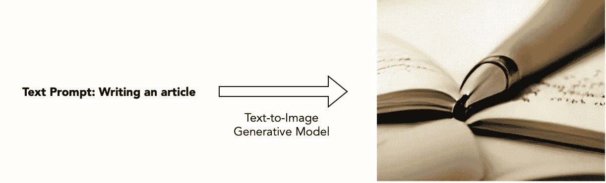
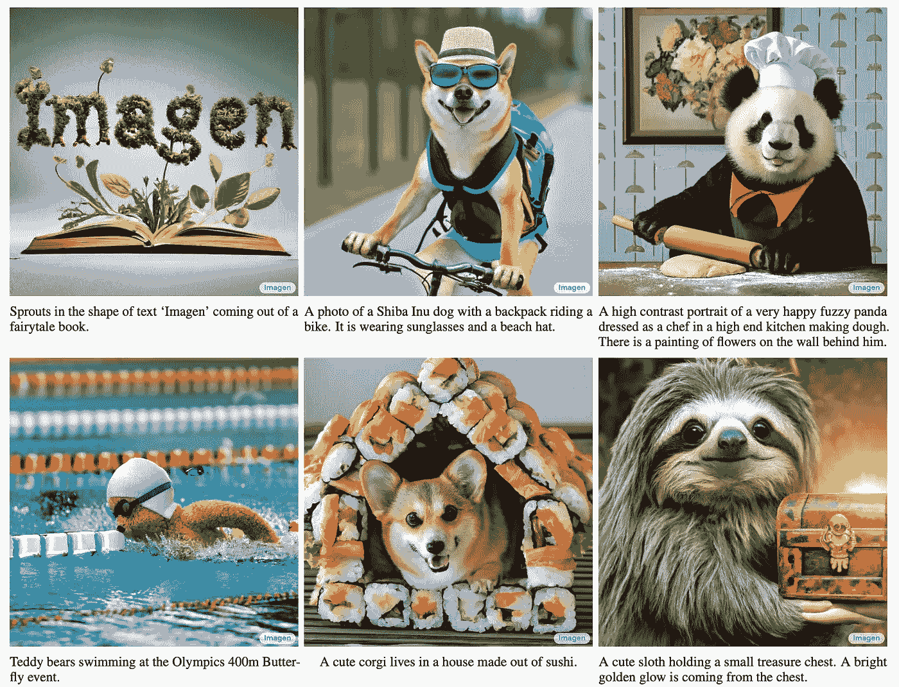
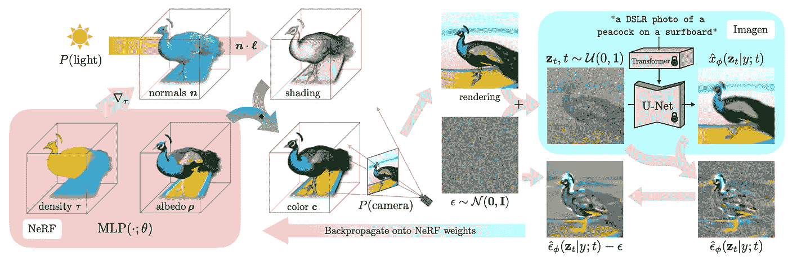
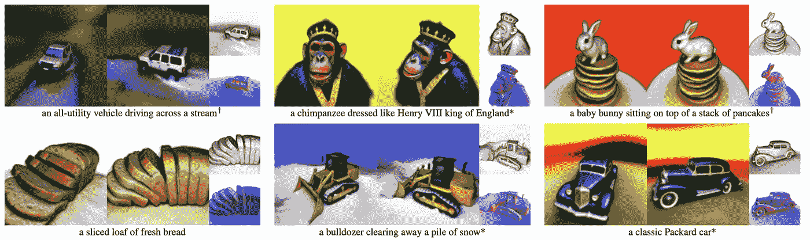

# 扩散概率模型与文本到图像生成

> 原文：[`towardsdatascience.com/diffusion-probabilistic-models-and-text-to-image-generation-9f441d0bc786`](https://towardsdatascience.com/diffusion-probabilistic-models-and-text-to-image-generation-9f441d0bc786)

## 你能想象的任何东西的照片级生成

 [Tim Cheng](https://taying-cheng.medium.com/?source=post_page-----9f441d0bc786--------------------------------)

·发布于 [Towards Data Science](https://towardsdatascience.com/?source=post_page-----9f441d0bc786--------------------------------) ·阅读时间 4 分钟·2023 年 3 月 29 日

--

图 1\. 文本到图像生成。图片由作者制作。

如果你是最新计算机视觉论文的忠实追随者，你一定会对生成网络在图像生成中的惊人效果感到惊讶。许多之前的文献都是基于开创性的生成对抗网络（GAN）思想，但最近的论文情况已不再如此。事实上，如果你仔细查看最新的论文，如 ImageN 和 Staple Diffusion，你会不断看到一个陌生的术语：扩散概率模型。

本文深入探讨了新兴趋势模型的基本知识，简要概述了如何学习，以及随之而来的令人兴奋的应用。

# 从逐渐添加高斯噪声开始……

图 2\. 扩散去噪概率模型概述。图片来源：[`arxiv.org/abs/2006.11239`](https://arxiv.org/abs/2006.11239)。

考虑一张添加了少量高斯噪声的图像。图像可能变得有些嘈杂，但原始内容仍然很可能被识别出来。现在重复这一步骤；最终，图像将变成几乎纯粹的高斯噪声。这被称为扩散概率模型的前向过程。

目标很简单：通过利用前向过程是马尔可夫链的事实（当前时间框架的过程与之前的时间框架独立），我们实际上可以学习一个逆过程，在当前帧上稍微去噪图像。

给定一个经过适当学习的逆过程和一个随机高斯噪声，我们现在可以反复应用噪声，并最终获得一个与原始数据分布非常相似的图像——因此这是一个生成模型。

扩散模型的一个优点是，训练可以通过仅选择中间的随机时间戳进行优化（而不是必须完全重建图像）。与 GAN 相比，训练本身更加稳定，因为小的超参数差异可能会导致模型崩溃。

*请注意，这只是对去噪扩散概率模型的一个非常高层次的概述。有关数学细节，请参考* [*这里*](https://arxiv.org/abs/2006.11239) *和* *这里**。 

# 文字到图像生成的惊人结果

图 3\. ImageN 生成的结果。文本提示位于图像下方。图像来源于：[`arxiv.org/abs/2205.11487`](https://arxiv.org/abs/2205.11487)。

图像生成中的去噪扩散模型的理念首次发布于 2020 年，但直到最近的 Google 论文[ImageN](https://arxiv.org/abs/2205.11487)才真正引爆了这个领域。

类似于 GAN，扩散模型也可以根据图像和文本等提示进行条件化。Google Research Brain 团队建议，冻结的大型语言模型实际上是提供文本条件以生成真实感图像的绝佳编码器。

# 从 2D 到 3D 的转变……

图 4\. DreamFusion 流程概述。图像来源于：[`arxiv.org/abs/2209.14988`](https://arxiv.org/abs/2209.14988)。

与众多计算机视觉趋势一样，在二维领域的出色表现激发了向 3D 扩展的雄心；扩散模型也不例外。最近，Poole 等人提出了基于 ImageN 和 NeRF 坚实基础的[DreamFusion](https://arxiv.org/abs/2209.14988)文本到 3D 模型。

*有关 NeRF 的简要概述，请参阅* [*这里*](https://medium.com/p/db4a0d4c391b)*。 

图 4 展示了 DreamFusion 的流程图。该流程从一个随机初始化的 NeRF 开始。基于生成的密度、反射率和法线（在给定光源下），网络输出着色，并随后根据特定摄像机角度的 NeRF 形成颜色。渲染的图像与高斯噪声结合，目标是利用冻结的 ImageN 模型重建图像，并随后更新 NeRF 模型。

图 5\. DreamFusion 的结果。图像来源于：[`arxiv.org/abs/2209.14988`](https://arxiv.org/abs/2209.14988)。

一些令人惊叹的 3D 结果展示在图 5 所示的画廊中。通过简单图像完全展现了对象的一致颜色和形状。

最近的工作如[Magic3D](https://research.nvidia.com/labs/dir/magic3d/)进一步改进了流程，使重建过程更快且更细致。

# **结束备注**

这就是对图像生成扩散模型进展的概述。当简单的词汇转变为生动的图像时，大家更容易想象并描绘他们最疯狂的想法。

> *“写作是声音的绘画” — 伏尔泰*

*感谢你能看到这里* 🙏*!* *我定期撰写有关计算机视觉/深度学习的不同领域的文章，如果你有兴趣了解更多，* [*请加入并订阅*](https://taying-cheng.medium.com/membership) *！*
