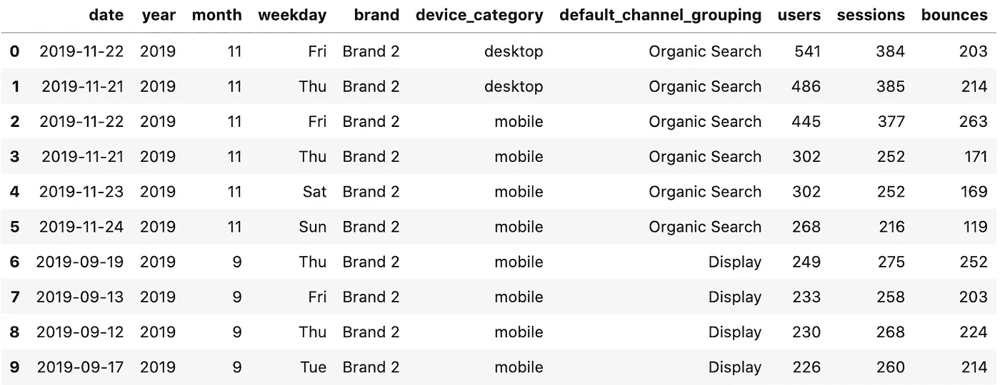
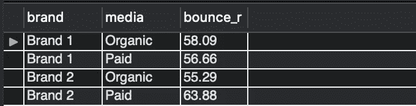

# 使用 Python 和 MySQL 进行数字营销分析

> 原文：[`towardsdatascience.com/digital-marketing-analysis-simultaneously-with-python-and-mysql-ee00e05a3813`](https://towardsdatascience.com/digital-marketing-analysis-simultaneously-with-python-and-mysql-ee00e05a3813)

## 一个数字营销分析练习，展示了 SQL 和 Python 环境中的逐步解释代码

[](https://goncaloggomes.medium.com/?source=post_page-----ee00e05a3813--------------------------------)[](https://towardsdatascience.com/?source=post_page-----ee00e05a3813--------------------------------) [Gonçalo Guimarães Gomes](https://goncaloggomes.medium.com/?source=post_page-----ee00e05a3813--------------------------------)

·发布于[Towards Data Science](https://towardsdatascience.com/?source=post_page-----ee00e05a3813--------------------------------) ·阅读时间 15 分钟·2023 年 3 月 19 日

--


照片由[Zdeněk Macháček](https://unsplash.com/es/@zmachacek?utm_source=medium&utm_medium=referral)拍摄，发布在[Unsplash](https://unsplash.com/?utm_source=medium&utm_medium=referral)上

# 介绍

在这段简短的旅程中，我们将探索一个简单的数据集，包含基本的网页营销指标，如‘用户’，‘会话’和‘跳出率’，为期五个月。

这种设置的目的是获取一些基本但有用的知识，以回答一些必要的操作营销问题，而不是专注于理解网站性能。

我们将关注两种强大且常用的数字工具，探索两种方法，以便最终得出相同的结果。

一方面，我们将探讨**MySQL Workbench**的语法，涉及一些多样化的查询；另一方面，对于每个问题，我们将使用**Python**的图形和可视化资源进行对比。这两个环境将分别标记为# MySQL 和# Python。每个问题将附有注释和两种代码的解释，以便更深入理解。

## # MySQL

```py
-- displaying dataset (case_sql.csv)
SELECT * FROM case_sql;
```


图片由作者提供。

你可以在[这里](https://docs.google.com/spreadsheets/d/1jAqQFD-_RXWjzpM_Bk7V30acFWt7pdANki-JGkK4F9U/edit?usp=sharing)下载 SQL 数据集。

## # Python

```py
# import python libraries
import pandas as pd
import numpy as np
import seaborn as sns
import matplotlib.pyplot as plt
import matplotlib.style as style
%matplotlib inline
color = sns.color_palette()
from pandas.plotting import table 
from datetime import datetime
```

```py
# load the data set
df = pd.read_csv("case.csv", sep=";")

# number of observations and columns
df.shape
(31507, 7)

# display rows sample
df.sample(15)
```


图片由作者提供。

```py
# SHAPE
# Create a function that prints the shape of the dataframe and some other basic info 
# --> number of observations, features, duplicates, missing values (True, False) datatypes and its proportion.

def shape_df(df):
    print(f"Number of observations: {df.shape[0]}")
    print(f"Number of variables:    {df.shape[1]}")
    print(f"Number of duplicates:   {df.duplicated().sum()}")
    print(f"Are there any missing values? {df.isnull().values.any()}\n-----")
    print(f"{df.dtypes.sort_values(ascending=True)}\n-----")
    print(f"Datatypes' proportion:\n{df.dtypes.value_counts(ascending=True)}")

# calling the function
shape_df(df)

Number of observations: 31507
Number of variables:    7
Number of duplicates:   4083
Are there any missing values? False
-----
date                         int64
users                        int64
sessions                     int64
bounces                      int64
brand                       object
device_category             object
default_channel_grouping    object
dtype: object
------
Datatypes proportion:
object    3
int64     4
dtype: int64
```

```py
# lowering columns' capital letters for easy typing
df.columns = map(str.lower, df.columns)

# remove spaces in columns name
df.columns = df.columns.str.replace(' ','_')
```

## 将日期转换为 datetime 类型

```py
# make string version of original column 'date', call it 'date_'
df['date_'] = df['date'].astype(str)

# create the new columns using string indexing
df['year'] = df['date_'].str[0:4]
df['month'] = df['date_'].str[4:6]
df['day'] = df['date_'].str[6:]

# concatenate 'year', 'month' and 'day'
df["date"] = df["year"] + "-" + df["month"] + "-" + df["day"]

# convert to datetime
df["date"] = pd.to_datetime(df["date"], format="%Y-%m-%d")
```

```py
# extract 'year', 'month' and 'weekday'
df["year"] = df["date"].dt.year
df["month"] = df["date"].dt.month
df["weekday"] = df["date"].dt.dayofweek.map({0 : "Mon", 1 : "Tue", 2 : "Wed", 3: "Thu", 4 : "Fri", 5 : "Sat", 6 : "Sun"})
```

```py
# select columns to perform exploratory data analysis
cols = "date year month weekday brand device_category  default_channel_grouping  users  sessions  bounces".split()
df = df[cols].copy()

# display final dataset
df.head(10)
```



图片由作者提供。

你可以在[这里](https://docs.google.com/spreadsheets/d/1z46kppT8urisj-7hTDNGwxoZtcNo8_wz7seb9PS293c/edit?usp=sharing)下载 Python 数据集。

# 1\. 查看按设备类型划分的用户分布

## # MySQL

```py
-- Device distribution
SELECT 
    device_category, -- select the device_category column
    ROUND(COUNT(users) / (SELECT 
                    COUNT(users)
                FROM
                    case_sql) * 100,
            1) AS percent -- calculate the percentage of users in each category
FROM
    case_sql -- select data from the case_sql table
GROUP BY 1 -- group the result by device_category
ORDER BY 1; -- order the result by device_category in ascending order
```


图片来源于作者。

我们可以看到，通过设备分布，**手机和桌面并列**为最常见的访问类型。

## **# Python**

```py
# device distribution
# counts the number of occurrences of each unique device category in the device_category column of the DataFrame df, including missing values (if any).
df.device_category.value_counts(dropna=False).plot(kind='pie', figsize=(8,4),
                                              explode = (0.02, 0.02, 0.02),
                                              autopct='%1.1f%%',
                                              startangle=150);
# Params
plt.xticks(rotation=0, horizontalalignment="center")
plt.title("Device distribution", fontsize=10, loc="right");
```


图片来源于作者。

# 2. 从品牌的角度来看，上述情况如何？

## # MySQL

```py
-- Brand distribution
SELECT 
    brand, -- select the brand column
    COUNT(users) AS users, -- count the number of users for each unique brand and alias the result as "users"
    ROUND(COUNT(users) / (SELECT 
                    COUNT(users)
                FROM
                    case_sql) * 100,
            2) AS percent -- calculate the percentage of users for each brand out of the total number of users in the case_sql table and alias the result as "percent"
FROM
    case_sql -- select data from the case_sql table
GROUP BY 1; -- group the result by the first column (brand)
```


图片来源于作者。

在品牌层面上，品牌 2 的访问量占比最高，为 56.28%，而品牌 1 的总访问量为 43.72%。

## # Python

```py
# Brand distribution
absolut = df["brand"].value_counts().to_frame()

# Pie chart
absolut.plot(kind='pie', subplots=True, autopct='%1.2f%%', 
             explode= (0.05, 0.05), startangle=20, 
             legend=False, fontsize=12, figsize=(8,4))

# Params
plt.xticks(rotation=0, horizontalalignment="center")
plt.title("Brand's distribution", fontsize=10, loc="right");

display(absolut) # Table
```


图片来源于作者。

# 3. 我们看到最多用户访问品牌 1 网站的那一天是星期几？

## # MySQL

```py
SELECT 
    date, -- select the date column
    DAYNAME(date) AS day_name, -- calculate the day name corresponding to each date
    SUM(users) AS users -- sum the number of users for each unique date where the brand is 'Brand 1'
FROM
    case_sql -- select data from the case_sql table
WHERE
    brand = 'Brand 1' -- filter rows where the brand is 'Brand 1'
GROUP BY 1 -- group the result by date
ORDER BY 3 DESC -- order the result by users in descending order
LIMIT 1; -- select only the first row of the result (the row with the highest number of users)
```


图片来源于作者。

在 2019 年 9 月至 2020 年 1 月之间的 298,412 名用户中，访问**品牌 1**网站的用户最多的一天是**2019 年 11 月 22 日**，共计 885 次访问，那天是周五。

## # Python

```py
# filter users that arrived at 'Brand 1' only, assign it 'brand_1'
brand_1 = df[df["brand"] == "Brand 1"].copy()

''' sum total users that came from all "channelgrouping" for the same date, 
assign it 'brandgroup' no matter the type of device '''

brandgroup = brand_1.groupby(["date","weekday"])[["default_channel_grouping","users"]].sum()

# filter the date by maximum users, assign it 'users'
users = brandgroup[brandgroup["users"] == brandgroup.users.max()].copy()

# reseat index
users.reset_index(["date"], inplace=True)
users.reset_index(["weekday"], inplace=True)

# results
print(f"""Date: {users.date} \n\nTotal users: {users.users} \n\nDay of week: {users.weekday}""")

Date: 0   2019-11-22
Name: date, dtype: datetime64[ns] 

Total users: 0    885
Name: users, dtype: int64 

Day of week: 0    Fri
Name: weekday, dtype: object

# calling the variable
users
```


图片来源于作者。

# 3.1 在那一天，有多少用户访问了品牌 2？

## # MySQL

```py
SELECT 
    DATE(date) AS date, -- Select the date from the 'date' column and convert it to a date data type
    DAYNAME(date) AS dayofweek, -- Select the day of the week from the 'date' column
    SUM(CASE
        WHEN brand = 'Brand 1' THEN users -- Sum the 'users' column for Brand 1
        ELSE NULL
    END) AS b1_users,
    SUM(CASE
        WHEN brand = 'Brand 2' THEN users -- Sum the 'users' column for Brand 2
        ELSE NULL
    END) AS b2_users
FROM
    case_sql -- From the 'case_sql' table
GROUP BY 1, 2 -- Group the results by the first and second columns (date and dayofweek)
ORDER BY 3 DESC -- Order the results by b1_users in descending order
LIMIT 1; -- Limit the results to only the highest total number of Brand 1 users
```


图片来源于作者。

实际上，两个品牌在**同一天**都达到了最高访问量。

## # Python

```py
# filter users that arrived at 'Brand 2', assign it 'brand_2'
brand_2 = df[df["brand"] == "Brand 2"].copy()

# rename the 'users' column from previous (above) Python code
brandgroup.rename(columns = {'users':'brand1_users'}, inplace = True)

# include a new column with the filtered users from 'Brand_2'
brandgroup["brand2_users"] = brand_2.groupby(["date","weekday"])[["default_channel_grouping","users"]].sum()

# filter the new column (brand2_users) by maximum users
users2 = brandgroup[brandgroup["brand2_users"] == brandgroup.brand2_users.max()].copy()
```


图片来源于作者。

# 4. 在所有渠道分组中，哪个渠道贡献了最高数量的用户？

## # MySQL

```py
SELECT 
    default_channel_grouping AS channels,
    SUM(users) AS total_users,
    ROUND(SUM(users) / (SELECT 
                    SUM(users)
                FROM
                    case_sql) * 100,
            1) AS percent -- calculate the percentage of users for each channel
FROM
    case_sql
GROUP BY 1
ORDER BY 2 DESC;
```


图片来源于作者。

**自然搜索**仍然是生成最多用户的渠道（近 141,000 名用户），占据了两个网站总访问量的近一半，其次是付费搜索和直接访问。展示广告排名第 4，社交媒体排名第 6，共贡献了 6,722 位用户。

## # Python

```py
# sum users by all channel groups and plot bar chart 
ax = df.groupby("default_channel_grouping")["users"].sum().sort_values(ascending=True)\
.plot(kind="bar", figsize=(9,6), fontsize=12, linewidth=2, 
      color=sns.color_palette("rocket"), grid=False, table=False)

# show data labels
for p in ax.patches:
    ax.annotate("%.0f" % p.get_height(), (p.get_x() + p.get_width() / 2., p.get_height()),
                ha='center', va='center', xytext=(0, 7), textcoords='offset points')

# params
plt.xlabel("Channel groups", fontsize=10)
plt.xticks(rotation=90, horizontalalignment="center")
plt.ylabel("Absolute values", fontsize=10)
plt.title("Best channel group (highest number of users)", fontsize=10, loc="right");
```


图片来源于作者。

# 4.1 所有渠道分组中，哪个品牌贡献的用户数量最高？

## # MySQL

```py
SELECT 
    default_channel_grouping AS channels,
    SUM(CASE -- sum users by brand and map to new columns
        WHEN brand = 'brand 1' THEN users -- if brand = 'brand 1', sum users and store in 'Brand_1' column
        ELSE NULL -- if not 'brand 1', set value to null
    END) AS Brand_1, -- create column for Brand 1 users
    SUM(CASE 
        WHEN brand = 'brand 2' THEN users 
        ELSE NULL 
    END) AS Brand_2 
FROM
    case_sql
GROUP BY 1 -- group by channel
ORDER BY 3 DESC; -- order by Brand 2 users in descending order
```


图片来源于作者。

## # Python

```py
# create pivot_table
# sum all users for each brand by channels
type_pivot = df.pivot_table(
    columns="brand",
    index="default_channel_grouping",
    values="users", aggfunc=sum)

display(type_pivot)

#Display pivot_table with a bar chart
type_pivot.sort_values(by=["Brand 2"], ascending=True).plot(kind="bar", figsize=(12,8) ,fontsize = 15)
plt.xlabel("Channel groups", fontsize=10)
plt.xticks(rotation=90, horizontalalignment="center")
plt.ylabel("Absolute values", fontsize=10)
plt.title("Channel groups by brand (highest number of users)", fontsize=10, loc="right");
```


图片来源于作者。


图片来源于作者。

**自然搜索**为品牌 2 带来了 105,062 位用户，为品牌 1 带来了 35,911 位用户。除‘其他’之外，品牌 1 在这一方面表现更优，品牌 2 在所有渠道中为网站带来的用户数量最高。

# 5. 在所有渠道中，哪个品牌在 2019 年贡献了至少 5% 的付费会话？

## # MySQL

```py
SELECT 
    brand,
    default_channel_grouping AS channels,
    ROUND(SUM(sessions) / (SELECT 
                    SUM(sessions)
                FROM
                    case_sql) * 100,
            1) AS percent
FROM
    case_sql
WHERE
    default_channel_grouping IN ('Paid Search' , 'Paid Social', 'Display', 'Other Advertising') -- include only rows with these values
        AND date < '2020-01-01' -- only date before '2020-01-01' will be included.
GROUP BY 1 , 2
HAVING percent > 5 -- filters the groups to only include values greater than 5%.
ORDER BY 1 , 3 DESC
```


图片来源于作者

## # Python

```py
# groupby dataframe by selected cols
df = df.groupby(["date","brand","default_channel_grouping"])["sessions"].sum().to_frame().copy()

# calculate percentages (new column)
df["percent"] = (df.apply(lambda x: x/x.sum())*100).round(2)

# reset index
df = df.reset_index().copy()

# display a 5 rows sample
df.sample(5)
```


图片来源于作者。

```py
# filter paid channels using lambda function
paid = df.apply(lambda row: row[df['default_channel_grouping'].isin(['Display','Paid Search','Paid Social','Other Advertising'])])

# filter year 2019
paid = paid[paid['date'] < '2020-01-01']

# groupby channels by brand
paid = paid.groupby(["brand","default_channel_grouping"])[["sessions","percent"]].sum()

# filter sessions higher than 5%
paid[paid["percent"] >5]
```


图片来源于作者。

# 6. 两个品牌按设备类型分别收到多少次访问？

## # MySQL

```py
SELECT 
    brand,
    SUM(CASE
        WHEN device_category = 'Desktop' THEN users
        ELSE NULL
    END) AS desktop,
    SUM(CASE
        WHEN device_category = 'Mobile' THEN users
        ELSE NULL
    END) AS mobile,
    SUM(CASE
        WHEN device_category = 'Tablet' THEN users
        ELSE NULL
    END) AS tablet
FROM
    case_sql
GROUP BY 1
ORDER BY 1;
```


图片来源于作者。

## # Python

```py
# pivot_table
type_pivot = df.pivot_table(
    columns="device_category",
    index="brand",
    values="users", aggfunc=sum)

display(type_pivot)

# display pivot_table (chart)
ax = type_pivot.sort_values(by=["brand"], ascending=False).plot(kind="bar", figsize=(12,8) ,fontsize = 15);

# adding data labels
for p in ax.patches:
    ax.annotate("%.0f" % p.get_height(), (p.get_x() + p.get_width() / 2., p.get_height()), ha='center', va='center', xytext=(0, 7), textcoords='offset points')

plt.xlabel("Brands", fontsize=10)
plt.xticks(rotation=0, horizontalalignment="center")
plt.ylabel("Absolute values", fontsize=10)
plt.title("Brand by type of device", fontsize=10, loc="right")
plt.legend(["Desktop","Mobile","Tablet"]);
```


图片来源于作者。

**移动设备** 是品牌 2 的首选设备类型，而**桌面设备** 是品牌 1 使用最多的设备。

# 6.1 用户平均设备使用类型按渠道分布如何？

## # MySQL

```py
SELECT 
    default_channel_grouping,
    AVG(CASE
        WHEN device_category = 'Desktop' THEN users
        ELSE NULL
    END) AS desktop,
    AVG(CASE
        WHEN device_category = 'Mobile' THEN users
        ELSE NULL
    END) AS mobile,
    AVG(CASE
        WHEN device_category = 'Tablet' THEN users
        ELSE NULL
    END) AS tablet
FROM
    case_sql
GROUP BY 1
ORDER BY 1;
```


图片来自作者。

## # Python

```py
# pivot_table
type_pivot = df.pivot_table(
    columns="device_category",
    index="default_channel_grouping",
    values="users", aggfunc=np.mean)

display(type_pivot)
```


图片来自作者。

```py
# display pivot_table
type_pivot.sort_values(by=["default_channel_grouping"], ascending=False).plot(kind="bar", figsize=(12,8) ,fontsize = 15);

plt.xlabel("Date", fontsize=10)
plt.xticks(rotation=90, horizontalalignment="center")
plt.ylabel("Absolute values", fontsize=10)
plt.title("Average use of device types by channel grouping", fontsize=10, loc="right")
plt.legend(["Desktop","Mobile","Tablet"]);
```


图片来自作者。

平均而言，桌面设备在推荐、直接和其他渠道中使用更频繁。至于其他渠道，垂直导向的内容应该始终考虑在内。

# 7. 如何评估渠道分组的跳出率？

跳出率的计算方法是将总跳出次数除以总会话次数。

## # MySQL

```py
SELECT 
    default_channel_grouping,
    SUM(sessions) AS sessions,
    SUM(bounces) AS bounces,
    ROUND(SUM(bounces) / SUM(sessions) * 100, 2) AS bounces_r
FROM
    case_sql
GROUP BY 1
ORDER BY 4 DESC;
```


图片来自作者。

**平均跳出率：54.93%** (avg_bounces_r)

```py
SELECT 
    SUM(sessions) AS sessions,
    SUM(bounces) AS bounces,
    ROUND(SUM(bounces) / SUM(sessions) * 100, 2) AS bounces_r,
    AVG(ROUND(bounces/sessions*100, 2)) AS avg_bounces_r
FROM
    case_sql;
```

## # Python

```py
# group individual channels by sum of users
dfbounce = df.groupby("default_channel_grouping")["users"].sum().to_frame()

# group individual channels by sum of sessions
dfbounce["sessions"] = df.groupby("default_channel_grouping")["sessions"].sum()

# group individual channels by sum of bounces
dfbounce["bounces"] = df.groupby("default_channel_grouping")["bounces"].sum()

# calculus of bounce rate for each individual channel
dfbounce["bounces_r"] = dfbounce.apply(lambda x: 0.0 if x["sessions"] == 0.0 else (x["bounces"] / x["sessions"])*100, axis=1).round(2)

dff = dfbounce.copy()

dfbounce.drop(["users"],axis=1,inplace=True)

# sort values by rate
dfbounce.sort_values(by="bounces_r", ascending=False)
```


图片来自作者。

```py
# display bar chart with the bounce rate for each channel
ax = dfbounce.groupby("default_channel_grouping")["bounces_r"].sum().sort_values(ascending=True)\
.plot(kind="bar", figsize=(9,6), fontsize=12, linewidth=2, color=sns.color_palette("rocket"), grid=False, table=False)

for p in ax.patches:
    ax.annotate("%.2f" % p.get_height(), (p.get_x() + p.get_width() / 2., p.get_height()), 
                ha='center', va='center', xytext=(0, 7), textcoords='offset points')

plt.axhline(dfbounce.groupby("default_channel_grouping")["bounces_r"].mean().mean(), linewidth=1, color ="r")
plt.xlabel("channel groups", fontsize=10)
plt.xticks(rotation=90, horizontalalignment="center")
plt.ylabel("Absolute values", fontsize=10)
plt.title("Bounce rate by channelGrouping", fontsize=10, loc="right");
```


图片来自作者。

正如预期，显示渠道的跳出率最高，其次是直接渠道和付费社交。自然搜索的跳出率与平均水平持平。低于最低跳出率阈值的有推荐、原生广告和其他广告。

# 7.1 网站上的跳出率是否随着时间的推移有所改善或恶化？

## # MySQL

```py
SELECT 
    YEAR(date) AS year, -- extract year
    MONTH(date) AS month,  -- extract month 
    DATE_FORMAT(date, '%b') AS month_,   -- format the date column to display month name
    ROUND(SUM(bounces) / SUM(sessions) * 100, 2) AS bounces_r  -- calculate bounce rate
    case_sql                        
GROUP BY 1 , 2 , 3                  
ORDER BY 1 , 2 , 3; 
```


图片来自作者。

## # Python

```py
 df_date = df.groupby("date")[['sessions','bounces']].sum()

''' create function to assess the bounce rate, assign it as 'bounce_r'
Return 0 if session's value is 0, else divide the bounces by sessions 
for each date and multiply it by 100 to get the percentage '''

def div(bounces, sessions):
    return lambda row: 0.0 if row[sessions] == 0.0 else float((row[bounces]/(row[sessions])))*100

# create column 'bounce_r' with the function results
df_date["bounce_r"] = (df_date.apply(div('bounces', 'sessions'), axis=1)).round(1)

# drop unnecessary columns
df_date.drop(["sessions","bounces"], axis=1, inplace=True)

# sum all bounces over time and plot chart
ax = df_date.plot(kind="line", figsize=(14,6), fontsize=12, linewidth=2)

plt.xlabel("Date", fontsize=10)
plt.xticks(rotation=90, horizontalalignment="center")
plt.ylabel("Rate", fontsize=10)
plt.title("Evolution of the bounce rate over time", fontsize=10, loc="right");
```


图片来自作者。

```py
# Smoothing the line with a step of 15 days interval
resampled = df_date["bounce_r"].resample("m").mean() 

plt.figure(figsize = (12,6))
ax = sns.lineplot(data = resampled)
plt.title("Evolution of the bounce rate over time (smooth)", fontsize=10, loc="right")
plt.xlabel("Date", fontsize=10)
plt.xticks(rotation=0, horizontalalignment="center")
plt.ylabel("Rate", fontsize=10);
```


图片来自作者。

网站上的跳出率正在**改善**。

# 7.2 跳出率按渠道和品牌的细分

## # Python

```py
# filter by brand
b1 = df[df["brand"] == "Brand 1"]
b2 = df[df["brand"] == "Brand 2"]

# ** brand 1 **

# group individual channels by sum of sessions for brand 1
dfbrand = b1.groupby("default_channel_grouping")["sessions"].sum().to_frame()
dfbrand.rename(columns={"sessions":"sessions1"}, inplace=True)

# group individual channels by sum of bounces for brand 1
dfbrand["bounces1"] = b1.groupby("default_channel_grouping")["bounces"].sum()

# calculus of bounce rate for each individual channel for brand 1
dfbrand["1bounces_r"] = dfbrand.apply(lambda x: 0.0 if x["sessions1"] == 0.0 else (x["bounces1"] / x["sessions1"]*100), axis=1).round(2)

# ** brand 2 **

# group individual channels by sum of bounces for brand 2
dfbrand["sessions2"] = b2.groupby("default_channel_grouping")["sessions"].sum()

# group individual channels by sum of bounces for brand 2
dfbrand["bounces2"] = b2.groupby("default_channel_grouping")["bounces"].sum()

# calculus of bounce rate for each individual channel for brand 2
dfbrand["2bounces_r"] = dfbrand.apply(lambda x: 0.0 if x["sessions2"] == 0.0 else (x["bounces2"] / x["sessions2"]*100), axis=1).round(2)

# sort values by rate
dfbrand.sort_values(by="1bounces_r", ascending=False)
```


图片来自作者。

```py
# clean dataframe
dfchannels = dfbrand.copy()
dfbrand_chart = dfbrand.copy()
dfbrand_chart.drop(["sessions1","sessions2","bounces1","bounces2"], axis=1, inplace=True)

# display bar chart with the average bounce rate for each channel
ax = dfbrand_chart.plot(kind="bar", figsize=(13,6), fontsize=12, linewidth=2, color=sns.color_palette("BrBG"), grid=False, table=False)

for p in ax.patches:
    ax.annotate("%.1f" % p.get_height(), (p.get_x() + p.get_width() / 2., p.get_height()), ha='center', va='center', xytext=(0, 7), textcoords='offset points')

plt.xlabel("channel groups", fontsize=10)
plt.xticks(rotation=90, horizontalalignment="center")
plt.ylabel("Absolute values", fontsize=10)
plt.title("Bounce rate by channelGrouping and by brand", fontsize=10, loc="right")
plt.legend(["Brand 1","Brand 2"]);
```


图片来自作者。

品牌 1 的显示渠道跳出率低于预期。通常，这些渠道会导致较高的跳出率。需要详细了解内容策略，并尝试将其调整到品牌 2。

品牌 2 在推荐渠道中的跳出率高于可接受范围。

# 8. 入站媒体与付费媒体的比例

## # MySQL

```py
SELECT 
    brand,
    CASE
        WHEN
            default_channel_grouping IN ('Paid Search', 
                'Paid Social',
                'Display',
                'Other Advertising')
        THEN
            'Paid'
        WHEN
            default_channel_grouping IN ('Direct',
                'Native',
                'Organic Search',
                'Referral',
                'Social',
                'Email',
                '(Other)')
        THEN
            'Organic'
        ELSE NULL
    END AS media,
    ROUND(SUM(bounces) / SUM(sessions) * 100, 2) AS bounce_r
FROM
    case_sql
GROUP BY brand , media
ORDER BY 1;
```



图片来自作者。

## # Python

```py
# create dictionary
media_dict = 
{
    'Display': 'paid',
    'Paid Search': 'paid',
    'Paid Social': 'paid',
    'Other Advertising': 'paid',
    'Direct': 'organic',
    'Native': 'organic',
    'Organic Search': 'organic',
    'Referral': 'organic',
    'Social': 'organic',
    'Email': 'organic',
    '(Other)': 'organic'
}

# mapping the dict into a new column
df['media'] = df['default_channel_grouping'].map(media_dict)

# define cols position in dataframe
cols = ['brand','media','sessions','bounces']

# reindex columns order
df = df.reindex(columns = cols)

# groupby dataframe by selected cols
df = df.groupby(["brand","media"])[["sessions","bounces"]].sum()

# bounce rate by channel
df["bounces_r"] = df.apply(lambda x: 0.0 if x["sessions"] == 0.0 else (x["bounces"] / x["sessions"])*100, axis=1).round(2)
```


图片来自作者。

# 结论

正如承诺的，我们通过逐步的方法进行了简单的数字营销分析，使用了 MySQL Workbench 和 Python。

两种工具各有其特点和要求，但推理过程相对类似，抛开它们的图形能力和局限性。

欢迎下载数据集并通过实践本文中涉及的一些技术细节来探索，实施新代码并提出进一步的分析问题。

探索你可能也喜欢的其他项目：

[](/sql-digital-marketing-analysis-be52c14e39aa?source=post_page-----ee00e05a3813--------------------------------) ## SQL 数字营销分析

### 在 MySQL Workbench 中审查一些应用于营销操作和常见问题的主要 SQL 查询的方法……

towardsdatascience.com [](/15-business-questions-about-mobile-marketing-campaigns-roas-return-on-ad-spend-ff636a8095b6?source=post_page-----ee00e05a3813--------------------------------) ## 15 个关于移动营销活动的商业问题：ROAS（广告支出回报）

### 一项探索性营销数据分析，用于监控和评估移动营销活动的表现（EDA）

towardsdatascience.com [](/machine-learning-predicting-bank-loan-defaults-d48bffb9aee2?source=post_page-----ee00e05a3813--------------------------------) ## 机器学习：预测银行贷款违约

### 一种数据科学方法，用于预测和理解申请人的档案，以最小化未来贷款违约的风险。

towardsdatascience.com

如何与我联系：

+   [Linkedin](http://bit.ly/2ybRqYT)

+   [Twitter](https://bit.ly/3gAwMTP)

+   留个言

✅ 感谢阅读！
