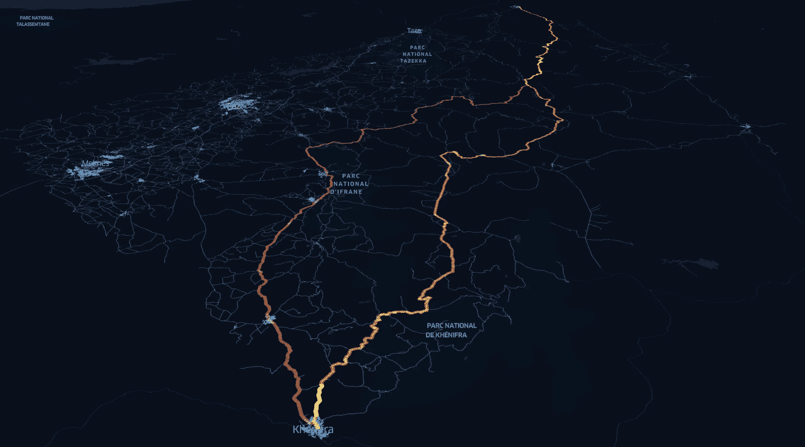

# Dijkstra 算法在 OSM 网络中按旅行时间加权

> 原文：[`towardsdatascience.com/dijkstras-algorithm-weighted-by-travel-time-in-osm-networks-792aa92e03af?source=collection_archive---------8-----------------------#2023-10-10`](https://towardsdatascience.com/dijkstras-algorithm-weighted-by-travel-time-in-osm-networks-792aa92e03af?source=collection_archive---------8-----------------------#2023-10-10)

## 使用 OSMNX 1.6 查找最快和最短路径

 [Bryan R. Vallejo](https://bryanvallejo16.medium.com/?source=post_page-----792aa92e03af--------------------------------)

·

[关注](https://medium.com/m/signin?actionUrl=https%3A%2F%2Fmedium.com%2F_%2Fsubscribe%2Fuser%2Fcbd681aaa725&operation=register&redirect=https%3A%2F%2Ftowardsdatascience.com%2Fdijkstras-algorithm-weighted-by-travel-time-in-osm-networks-792aa92e03af&user=Bryan+R.+Vallejo&userId=cbd681aaa725&source=post_page-cbd681aaa725----792aa92e03af---------------------post_header-----------) 发表在 [Towards Data Science](https://towardsdatascience.com/?source=post_page-----792aa92e03af--------------------------------) ·7 分钟阅读·2023 年 10 月 10 日

-- 

作者提供的图片。摩洛哥示例中的最快路线（红色）和最短路线（橙色）

最短路径（迪杰斯特拉）算法可以应用于 OSM 网络，例如驾驶、自行车和行人，以找到原点和目的地之间的**最佳**路线。然而，该算法在网络中计算的是基于距离的最短路线，这并不一定意味着**最佳**路线。在考虑道路速度时，道路网络中的距离可能是相对的。确实，如果道路网络在所有道路上速度相同，那么两个点之间的**最佳**路线可能是最短的。当我们将高速公路与城市街道的速度进行比较时，我们会重新审视这一点，理解到**最佳**路线是最快的。

> “在道路网络中，距离可能是相对的，当我们考虑道路的速度时。”

多亏了 Python 库 OSMNX，现在可以在全球范围内为不同类型的道路添加速度，并计算 OSM 网络中节点之间的*旅行时间*。这使得 Python 库能够处理以*旅行时间*为权重的最短路径算法。

这个实践是之前一个教程的延续，该教程使用了最短路径算法来……
