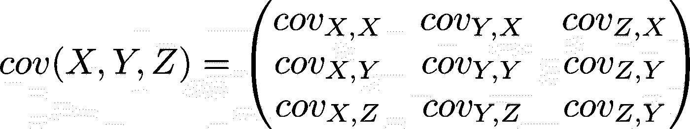
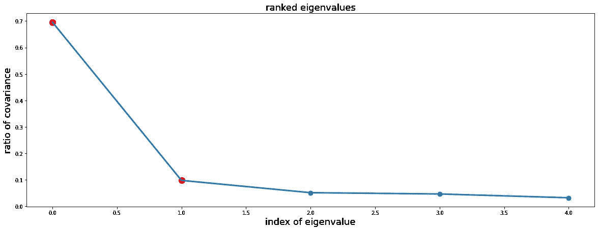
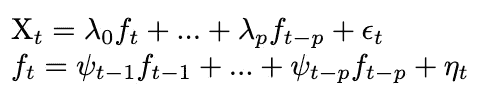
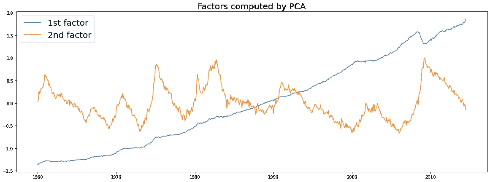
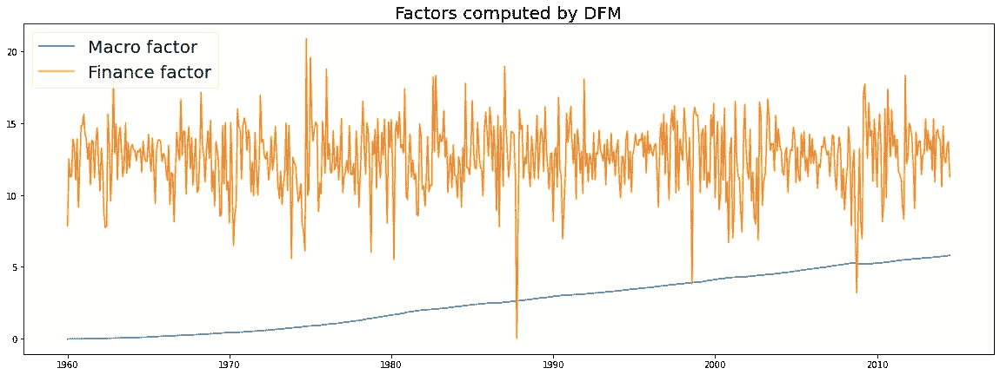
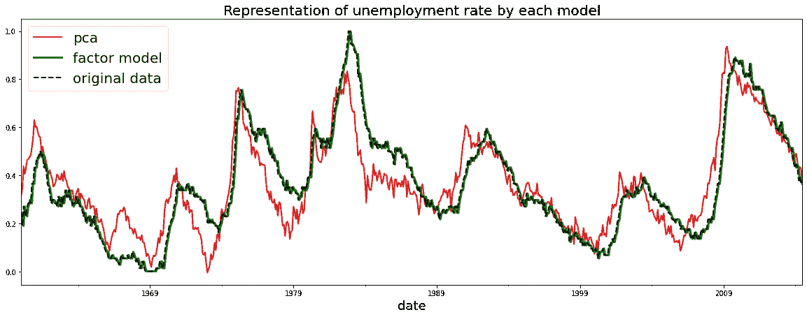
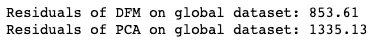

# 维度缩减：面对维度诅咒

> 原文：[`towardsdatascience.com/dimension-reduction-facing-the-curse-of-dimensionality-63a743e4b199?source=collection_archive---------4-----------------------#2023-04-13`](https://towardsdatascience.com/dimension-reduction-facing-the-curse-of-dimensionality-63a743e4b199?source=collection_archive---------4-----------------------#2023-04-13)

## PCA 与动态因子模型的比较

[](https://medium.com/@Vgraff?source=post_page-----63a743e4b199--------------------------------)[](https://towardsdatascience.com/?source=post_page-----63a743e4b199--------------------------------) [Victor Graff](https://medium.com/@Vgraff?source=post_page-----63a743e4b199--------------------------------)

·

[跟进](https://medium.com/m/signin?actionUrl=https%3A%2F%2Fmedium.com%2F_%2Fsubscribe%2Fuser%2F6802a7b0402e&operation=register&redirect=https%3A%2F%2Ftowardsdatascience.com%2Fdimension-reduction-facing-the-curse-of-dimensionality-63a743e4b199&user=Victor+Graff&userId=6802a7b0402e&source=post_page-6802a7b0402e----63a743e4b199---------------------post_header-----------) 发表在 [Towards Data Science](https://towardsdatascience.com/?source=post_page-----63a743e4b199--------------------------------) ·10 分钟阅读·2023 年 4 月 13 日

--

[](https://medium.com/m/signin?actionUrl=https%3A%2F%2Fmedium.com%2F_%2Fbookmark%2Fp%2F63a743e4b199&operation=register&redirect=https%3A%2F%2Ftowardsdatascience.com%2Fdimension-reduction-facing-the-curse-of-dimensionality-63a743e4b199&source=-----63a743e4b199---------------------bookmark_footer-----------)

[Kolleen Gladden](https://unsplash.com/@rockthechaos?utm_source=medium&utm_medium=referral) 的照片，来自 [Unsplash](https://unsplash.com/?utm_source=medium&utm_medium=referral)

许多数据科学家不得不面对维度的挑战。数据集可能包含大量变量，使得理解和计算变得复杂。例如，资产管理者可能会被与其投资组合相关的许多动态变量所困扰，处理大量数据可能导致计算问题。降维是一种将大量变量的信息提取到较小的降维变量集合中的方法，而不会丧失过多的解释性。换句话说，降维方法可以被认为是寻找一个最小化重构误差的子空间。

存在几种方法来进行信息提取，每种方法都适用于不同的用例。本文旨在提供这两种方法的详细比较：主成分分析（PCA）和动态因子模型（DFM）。PCA 可以用于任何类型的结构化数据集，而动态因子模型则用于时间序列应用，因为它嵌入了时间序列的演变。

分析基于经济和金融数据。用于本研究的数据是克拉克、托德；卡里耶罗、安德烈亚；马切利诺、马西米利亚诺的文章*测量不确定性及其对经济的影响*中使用数据的复制版，数据可在[Harvard dataverse](https://dataverse.harvard.edu/dataset.xhtml?persistentId=doi%3A10.7910%2FDVN%2FENTXDD)上获取。数据包括 18 个宏观经济变量和 12 个金融变量，涵盖了这些变量从 1960 年到 2014 年的演变。在通过降维算法处理之前，数据被转换以确保平稳性。

整个代码可在[Github](https://github.com/graffv/Comparison_PCA_DFM/blob/main/PCA%20-%20DFM%20comparison.ipynb)上获取。

# 主成分分析（PCA）

## 理论

PCA 可以看作是一种无监督的降维方法。假设我们有大量的变量。所有这些变量似乎都对分析有用，但没有明显的方法将这些变量汇总成类别。在这种情况下，算法将负责在没有模型师特定输入的情况下进行降维。换句话说，算法将创建更少的变量，称为降维成分，这些成分能够接近地重现初始变量。

PCA 的方法基于变量的协方差。如果两个变量高度协方差，这意味着它们遵循相同的趋势。第一个变量在重现第二个变量方面非常高效，使得只保留第一个变量而不丧失在需要时重建第二个变量的能力成为可能。PCA 创建一个变量子集，最大化与初始变量集的协方差，以便在较低维度中存储尽可能多的信息。

该方法的思路是计算由原始变量集创建的空间的正交基。创建这个基的向量是方差-协方差矩阵的特征向量。通过选择最能代表初始数据的特征向量，即包含最多协方差的特征向量，可以轻松地减少维度。特征值量化了向量存储的协方差量：特征值越大，其相关的向量就越有趣。

PCA 算法的过程如下：

1\. 计算协方差矩阵



2\. 计算其特征向量和特征值

3\. 对特征值进行排序，以保留包含最多信息的向量

每个特征值与所有特征值之和的比率表示其相关特征向量中包含的协方差量。剩下的任务是确定保留的特征向量数量。我们将在下一节中看到为此选择的不同参数。

## 应用到数据

Python 使得定义 PCA 模型变得简单，因为它包含在库 [*sklearn*](https://scikit-learn.org/stable/modules/generated/sklearn.decomposition.PCA.html) 中。属性 *n_components* 可以初步设置为一个较大的值，以便比较特征值，然后选择保留的组件数量。一旦拟合，特征值将按降序显示，以帮助我们做出决策。下面的图显示了每个特征值所包含的协方差比率。

```py
from sklearn.decomposition import PCA
pca = PCA(n_components=5).fit(u_data)
plt.plot(pca.explained_variance_ratio_)
```



选择合适特征向量数量的通常规则是查看图中表示的“肘部”。取到肘部的向量数量提供了信息保留和结果维度之间的有趣折衷。在这种情况下，我们保留前两个组件。

前两个组件的协方差比率为 69.6% 和 9.7%。因此，通过仅保留两个组件，我们保留了初始数据中几乎 80% 的信息，同时将维度从 30 减少到 2！

总结来说，PCA 是一种很好的降维工具。它易于部署，并且在保留信息方面产生了良好的结果，同时显著减少了维度。然而，PCA 像一个黑箱，阻止了对结果组件的有意义理解。此外，PCA 适用于任何类型的结构化数据，但如果数据以时间序列的形式存在，则不包含数据的动态性。

下一节将讨论动态因子模型，它们可能是应对这些局限性的潜在解决方案。

# 动态因子模型（DFM）

## 理论

动态因子模型用于观察 N 个变量随时间的演变（这些变量组合成一个向量 Xt），并使用较少数量的动态公共因子。这种方法的优势在于它将大量变量的共同运动嵌入到较少的成分中。

这种方法适用于时间序列应用。因此，它们在金融和经济学中被广泛使用，因为许多关键变量随时间共同演变。

DFM 将向量 Xt 定义为减少因子（ft）过去和当前值的线性组合。这些因子本身是动态的，即以自回归方式定义。减少的成分数量为 q，自回归的滞后为 p。



每个 λ 是一个 (N x q) 矩阵，其中 q 是减少的成分数量，每个 ft 是一个 (q x 1) 向量，每个 ψ 是一个 (q x q) 矩阵。动态性体现在每个减少的向量 ft 遵循向量自回归过程，因此它本身是基于 f 的过去值计算的。此外，向量 X 受当前和过去数据的影响。

DFM 的一个非常重要的方面是组件的数量是在计算前基于对数据的定性知识定义的。如果变量容易分类，这可以是一个有趣的特征，但如果没有出现有意义的类别，这也可能是一个挑战。

一旦因子的数量被定义，估计成分的主要方法是使用高斯最大似然估计器（MLE）。ε 和 η 被假设为遵循高斯分布，MLE 的目标是通过调整高斯参数（均值和标准差）来最大化获得样本数据（Xt, ft）的概率。幸运的是，这一步骤在 Python 库中直接实现，使得计算变得容易。

一旦估计完成，这些计算出的成分将代表它们被分配的类别。这就意味着我们得到的成分数量与我们定义的类别数量相同。这使我们能够以高效且有意义的方式减少维度。

## 数据应用

DFM 将应用于与之前展示的相同数据集。这里有个好消息：我们直接有两个明显的类别：宏观经济学和金融。

Python 的 *statsmodels* 库中包含了一个 DFM 模型：[DynamicFactorMQ](https://www.statsmodels.org/dev/generated/statsmodels.tsa.statespace.dynamic_factor_mq.DynamicFactorMQ.html)。为了计算模型，需要几个参数。首先，显然是我们旨在减少的初始数据。其次，一个将每个变量与其类别关联起来的字典（从技术上讲，每个变量可以属于多个类别，但我们在这里不讨论这种情况）。

```py
factors = dict()
for macro_variable in list(macro_variables.values()):
    factors[macro_variable] = ["Macro"]
for finance_variable in list(finance_variables.values()):
    factors[finance_variable] = ["Finance"]
```

然后，我们定义与每个因子 ft 相关的 VAR 模型的滞后阶数，即多少个时间步骤向后影响因子的当前状态。在我们的案例中，一个滞后似乎足够。增加滞后显然会增加计算约束，但通过在每一步提供更长时间的信息，可以显著影响模型的效率。

最后，需要定义特定成分。这个成分表示向量 Xt 中不能通过 ft 的当前值和过去值解释的部分。这个成分可以看作是线性回归中的残差。它可以拟合为 AR(1)模型或白噪声。从经济学角度来看，这一选择是重要的：我们估计模型的残差是自回归的（即现值和过去值相关）还是独立同分布的？对于经济学研究来说，一个不相关的特定成分通常是不现实的，因为测量方法通常会引入相关误差。

```py
factor_model = DynamicFactorMQ(u_data,
                    factors=factors,
                    factor_orders = {'Macro': 1, "Finance": 1},
                    idiosyncratic_ar1=True,
                    standardize=False)
model_results = factor_model.fit(disp=30)
```

# 方法比较

接下来的问题显然是：应该使用哪种方法？如预期的那样，这取决于我们要寻找的内容。

让我们总结一下每个模型的优缺点。

**主成分分析（PCA）**

+   可以应用于任何类型的结构化数据

+   计算时无需对数据有*先验*知识

+   选择降维成分的经验法则

+   无监督过程

**动态因子模型（DFM）**

+   应用于时间序列数据

+   对数据的定性知识，以确定嵌入在降维因子中的类别

+   预先确定的降维成分数量

乍一看，PCA 似乎比 DFM 更受关注，但要做出决定还需要进一步观察。这两者之间的主要区别在于 DFM 能够提供其结果的有意义解释。

## 可读性

首先，我们来看一下创建的组件。



这两个图显示了每个模型中两个选择因子的演变。有趣的是，这两个模型似乎都将一个变量分离为趋势（蓝色）和另一个变量分离为波动性（橙色）。DFM 给我们提供了这一观察结果背后的含义：看到宏观变量（例如 GDP、房价等）随着时间的推移而增加并不奇怪。此外，金融变量被认为波动性更大。PCA 似乎捕捉到了相同类型的信息，但我们仍然只能对这种现象做出假设。DFM 在这一点上有优势。

## 准确性

让我们回到降维方法的目的：作为较低维度下原始数据的良好替代。因此，我们需要确保模型能够准确地重现原始数据。

Python 为这两种算法提供了一种便捷的方法来重现初始变量。对于 PCA，将数据转换为其降维空间后，*inverse_transform* 方法提供了由模型处理的每个初始变量的表示。DFM 模型将所有表示包含在其 *fittedvalues* 属性中。

```py
#PCA
scores = pca.transform(u_data)
reconstruct = u_data + pca.inverse_transform(scores) - u_data

#DFM
model_results.fittedvalues
```

我们可以轻松绘制每个模型的数据表示。下面的图中，我们展示了失业率变量的一个例子。



在这个例子中，DFM 显然更适合，因为它始终更接近原始数据，变化更少。为了进行更全面和定量的评估，让我们计算两个模型在整个数据集上的残差。

```py
print(f"Residuals of DFM on global dataset: {np.round(np.abs(model_results.resid).sum().sum(), 2)}")
print(f"Residuals of PCA on global dataset: {np.round(np.abs(resid_pca).sum().sum(), 2)}")
```



残差和

在重现初始数据方面，DFM 明显比 PCA 更具性能。模型中的分类和动态似乎准确捕捉了初始变量集的信息。

# 结论

我们比较了两种降维方法，各有优缺点。我们看到，在所呈现的情况下，DFM 模型更适合，但 PCA 也非常有价值。让我们总结一下：

何时偏好 PCA？

+   数据中没有时间动态。

+   初始数据没有明显的分类。

+   对初始数据的定性知识很少。

何时偏好 DFM？

+   时间动态是数据的一个重要特征。

+   分析需要对降维组件的理解。

+   数据的分类很容易找到。

总结来说，没有哪种算法在所有情况下都优于另一种。建模者的角色是评估每种情况中什么是最好的。此外，正如我们所见，两种模型都易于在 Python 上实现。实现这两者有助于增加对数据的理解，并带来更好的解决方案。

我希望这篇文章对你有所帮助，并能帮助你理解这两种模型之间的差异。请随时给我任何反馈或想法！

## 参考文献

Clark, Todd; Carriero, Andrea; Marcellino, Massimiliano, 2017, “Replication Data for: “Measuring Uncertainty and Its Impact on the Economy””, [`doi.org/10.7910/DVN/ENTXDD`](https://doi.org/10.7910/DVN/ENTXDD), Harvard Dataverse, V3
