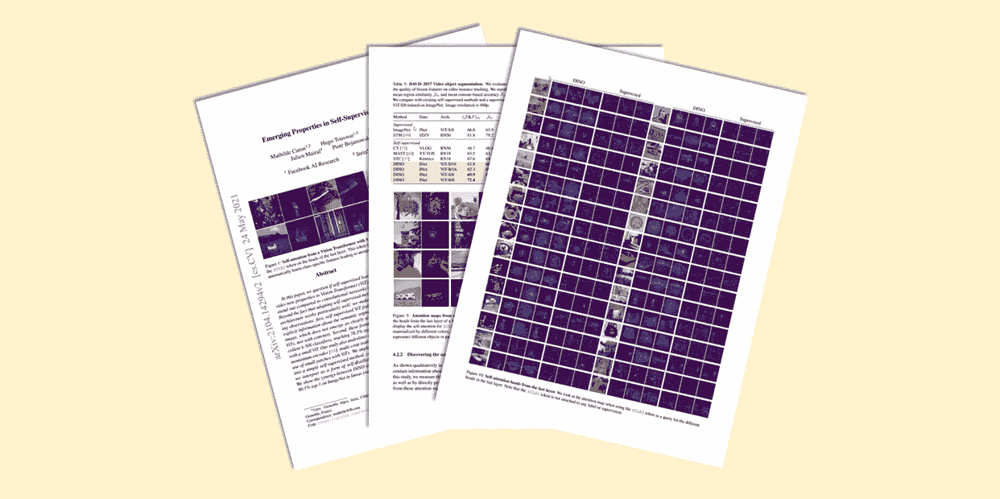

# DINO — 一种计算机视觉的基础模型

> 原文：[`towardsdatascience.com/dino-a-foundation-model-for-computer-vision-4cb08e821b18?source=collection_archive---------0-----------------------#2023-09-27`](https://towardsdatascience.com/dino-a-foundation-model-for-computer-vision-4cb08e821b18?source=collection_archive---------0-----------------------#2023-09-27)

## [🚀Sascha 的论文俱乐部](https://towardsdatascience.com/tagged/saschas-paper-club)

## 由 M. Caron 等人撰写的《自监督视觉变换器中的新兴特性》

 [Sascha Kirch](https://medium.com/@SaschaKirch?source=post_page-----4cb08e821b18--------------------------------)

·

[关注](https://medium.com/m/signin?actionUrl=https%3A%2F%2Fmedium.com%2F_%2Fsubscribe%2Fuser%2F5c38dace9d5e&operation=register&redirect=https%3A%2F%2Ftowardsdatascience.com%2Fdino-a-foundation-model-for-computer-vision-4cb08e821b18&user=Sascha+Kirch&userId=5c38dace9d5e&source=post_page-5c38dace9d5e----4cb08e821b18---------------------post_header-----------) 发表在 [Towards Data Science](https://towardsdatascience.com/?source=post_page-----4cb08e821b18--------------------------------) · 13 分钟阅读 · 2023 年 9 月 27 日 

--

计算机视觉的这一十年令人兴奋。来自自然语言领域的巨大成功被转移到视觉领域，包括 ViT（视觉变换器）的引入，以及最近的大规模自监督预训练技术在基础模型的名下成为头条新闻。

今天我们将深入了解一个名为 DINO（自 **DI**蒸馏，**N**O 标签）的框架，这是一个基于 ViT（视觉变换器）有趣特性的视觉基础模型。它也是今天表现最佳的基础模型之一的前身：[DINOv2](https://arxiv.org/abs/2304.07193)。

图片来源于 [出版物](https://arxiv.org/abs/2104.14294)，作者 [Sascha Kirch](https://medium.com/@SaschaKirch)

> **论文：** [自监督视觉变换器中的新兴特性](https://arxiv.org/abs/2104.14294)，作者 [Mathilde Caron](https://arxiv.org/search/cs?searchtype=author&query=Caron%2C+M) 等，2021 年 4 月 29 日
> 
> **资源：** [GitHub](https://github.com/facebookresearch/dino) — [博客文章](https://ai.meta.com/blog/dino-paws-computer-vision-with-self-supervised-transformers-and-10x-more-efficient-training/)
> 
> **类别：** 基础模型、计算机视觉、视觉变换器、知识蒸馏、相似性学习、自监督学习
> 
> [**其他讲解**](https://medium.com/@SaschaKirch/list/paper-walkthroughs-by-sascha-kirch-89c7847da8e2)**：**
> 
> [BYOL] — [CLIP] — [GLIP] — [Segment Anything] — [DINO] — [[Depth Anything](https://medium.com/towards-data-science/depth-anything-a-foundation-model-for-monocular-depth-estimation-8a7920b5c9cc?sk=fc6197edd68e6137c3396c83e50f65cb)] — [DDPM]

# 大纲

1.  背景与背景

1.  方法
