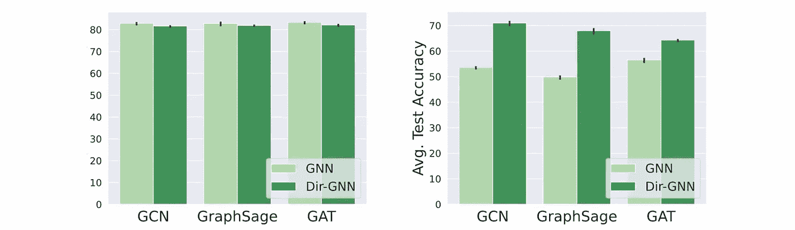
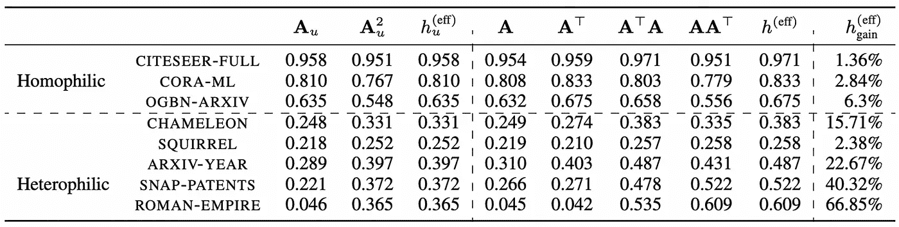
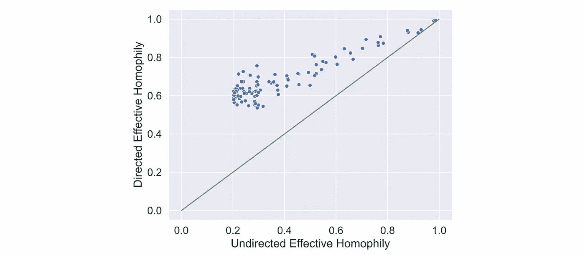
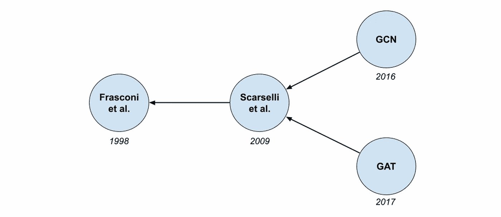
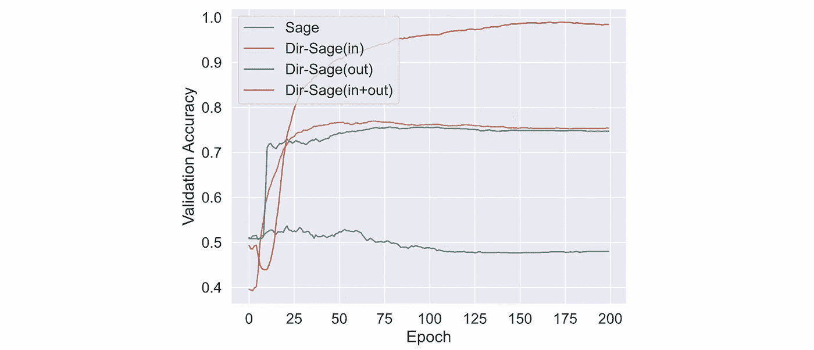
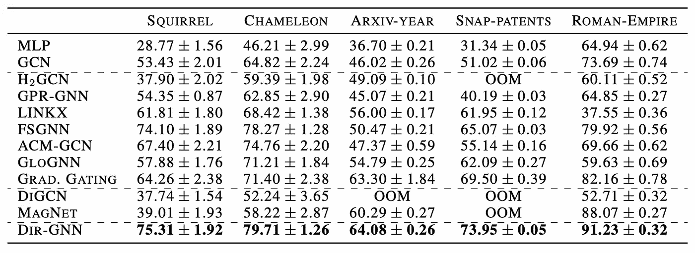
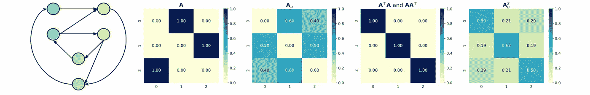

# 方向改善图学习

> 原文：[`towardsdatascience.com/direction-improves-graph-learning-170e797e94fe`](https://towardsdatascience.com/direction-improves-graph-learning-170e797e94fe)

## 有向图上的图神经网络

## 研究在异质图上进行消息传递时合理使用方向可以带来非常显著的提升。

 [迈克尔·布朗斯坦](https://michael-bronstein.medium.com/?source=post_page-----170e797e94fe--------------------------------)

·发布于 [Towards Data Science](https://towardsdatascience.com/?source=post_page-----170e797e94fe--------------------------------) ·10 分钟阅读·2023 年 6 月 8 日

--

*图神经网络（GNNs）在建模关系数据方面非常有效。然而，当前的 GNN 模型通常假设输入图是无向的，忽略了许多实际图（如社交网络、交通网络、交易网络和引用网络）固有的方向性。在这篇博文中，我们探讨了在异质图的背景下边的方向性影响，并概述了 Dir-GNN，一种针对有向图的全新消息传递方案，允许单独聚合进入和离开边。尽管其简单性，该方案在多个实际异质有向图上显著提高了性能。*

基于 Shutterstock。

*本文由* [*埃曼纽尔·罗西*](https://emanuelerossi.co.uk/) *共同撰写，基于论文 E. Rossi et al., “*[*边的方向性改善异质图上的学习*](https://arxiv.org/abs/2305.10498)*” (2023) arXiv:2305.10498，与* [*贝特朗·夏尔潘捷*](https://twitter.com/Bertrand_Charp)*、* [*弗朗西斯科·迪·乔瓦尼*](https://twitter.com/Francesco_dgv)*、* [*法布里齐奥·弗拉斯卡*](https://twitter.com/ffabffrasca) *和* [*斯特凡·古恩曼*](https://twitter.com/guennemann) *[1] 合作完成。论文的代码可以在* [*这里*](https://github.com/emalgorithm/directed-graph-neural-network)*找到。*

许多有趣的实际图，例如在建模社交、交通、金融交易或学术引用网络时遇到的图，都是*有向的*。边的方向通常传达了关键的见解，否则如果仅考虑图的连接模式，这些见解将会丧失。

相反，大多数在各种图机器学习应用中取得显著进展的图神经网络（GNNs）假设输入图是*无向*的。多年来，使输入图成为无向图已变得非常普遍，以至于流行的 GNN 库之一 PyTorch-Geometric 在加载数据集时包含了一个通用工具函数，该函数会自动将图转换为无向图[2]。

对无向图的这种倾向源于 GNNs 的两个“原罪”。首先，无向图具有对称的拉普拉斯算子和正交特征向量，提供了傅里叶变换的自然推广，而早期的谱 GNN 依赖于此以正常运作。其次，早期用于基准测试 GNNs 的数据集主要是*同质性*图[3]，如 Cora 和 Pubmed[4]。在这些数据集中，通过将定向图转换为无向图来忽略方向似乎是有利的，早期证据有助于巩固“无向”范式。

在同质性图（左）中，方向大多无用，这一观察导致了大多数当前的 GNNs 忽视了这一信息。相反，在异质性设置中（右），如果使用得当，方向性可以带来大幅收益（10%到 15%），正如我们在 Dir-GNN 框架中提出的那样。

我们在最近的论文[5]中挑战了这一*现状*，表明方向性可以在异质性设置中带来广泛的收益。

# 在定向图中测量同质性

图的同质性通常被测量为与节点本身具有相同标签的邻居的比例，平均遍及所有节点（*节点同质性*）。对于定向图，我们提出了*加权节点同质性*：

h(S) = 1/*n* Σ*ᵤ* ( Σ*ᵥ* *sᵤᵥ* * **I**[*yᵤ* = *yᵥ*] ) / Σ*ᵥ* *sᵤᵥ*

其中**I**表示指示函数，*n*是节点数量，**S**是一般邻接矩阵，可以选择𝐀或𝐀ᵀ，或者更高阶矩阵，例如𝐀𝐀ᵀ或𝐀²（对于定向图），或对称矩阵𝐀ᵤ= (𝐀+ 𝐀ᵀ) / 2 及其高阶对应矩阵𝐀ᵤ²（如果图被视为无向图）。

即使当 1-hop 邻居存在异质性[6]时，情况也可能在转到更远的节点时发生变化。与无向图相比，定向图中有四种不同的 2-hops，分别由矩阵𝐀²、(𝐀ᵀ)²、𝐀𝐀ᵀ和𝐀ᵀ𝐀表示，这些矩阵可以体现出不同程度的（加权）同质性。

由于 GNNs 通过多跳聚合进行操作，它们可以利用图中任何 2-hop（甚至更远的跳数）的同质性。为了获得一个全面的度量来捕捉 GNN 原则上可以利用的最大同质性，我们引入了*有效同质性*的概念，定义为图中任何跳数的最大加权节点同质性。

从经验上看，当将图转为无向图时，有向同质数据集的有效同质性保持不变。相反，在异质图中，这种转换平均减少了约 30%的有效同质性。

我们比较了多种同质和异质数据集的有向和无向扩散矩阵的加权同质性。对于异质数据集，有向图的有效同质性*(h*⁽ᵉᶠᶠ⁾)比无向图的*(h*⁽ᵉᶠᶠ⁾*)*大得多，表明有效利用方向性可能带来潜在的收益。

在合成实验中，我们再次观察到，有向的[随机块模型](https://en.wikipedia.org/wiki/Stochastic_block_model)图的有效同质性始终高于其无向对应物。有趣的是，对于较少同质的图，这一差距会扩大。

# 一个玩具示例

特别地，我们观察到𝐀𝐀ᵀ和𝐀ᵀ𝐀在异质图中始终出现为“最同质的矩阵”。

为了提供一个直观的理解，想象我们正在尝试预测一篇特定学术论文的出版年份，例如 Kipf & Welling 2016 年 GCN 论文，给定有向引用网络和其他论文的出版年份。考虑两种不同的 2 跳关系：一种是查看我们关注的论文 *v* 引用的论文的引用（由矩阵 𝐀² 的 *v* 行表示），另一种是查看引用与我们论文相同来源的论文（由(𝐀𝐀ᵀ)*ᵥ*表示）。

在第一种情况下（𝐀²），我们从 GCN 论文开始，并跟随其引用两次。我们最终找到了一篇 1998 年由 Frasconi *et al.* 发表的论文。这篇较旧的论文并没有提供很多关于我们的 GCN 论文发布时间的有用信息，因为它时间跨度过长。

有向引用网络的玩具示例。

在第二种情况下（𝐀𝐀ᵀ），我们从 GCN 论文开始，跟随一个引用，然后返回到引用相同来源的论文，例如 2017 年的 GAT 论文。这篇论文与我们的 GCN 论文出版年份更接近，因此提供了更好的线索。更一般地，分享更多引用的节点，如我们第二个例子中的节点，在𝐀𝐀ᵀ中的分数更高，因此对我们的最终预测贡献更大。

现在，考虑一个无向 2 跳关系（𝐀ᵤ²），这只是四种可能的 2 跳矩阵的平均值。这包括我们的第一种类型（如 Frasconi et al.），这并不是非常有用。因此，高度有用的𝐀𝐀ᵀ矩阵被较少信息的矩阵（如𝐀²）稀释，导致一个较少同质的运算符，从而总体上导致一个较不可靠的预测器。

虽然我们在示例中使用了引用网络，但这种直觉具有更广泛的适用性。在社交网络中，例如，影响者的特征更可能与那些有很多共同关注者的用户类似，由 𝐀ᵀ𝐀 表示。类似地，在交易网络中，两个账户向同一组账户汇款（由 𝐀𝐀ᵀ 捕获），很可能表现出类似的行为。

# Dir-GNN：有向图神经网络

为了有效利用方向性，我们提出了 *有向图神经网络*（Dir-GNN）框架，它通过对节点的入邻居和出邻居进行独立聚合，将 MPNNs 扩展到有向图：

**m***ᵤ*⁽ᵏ⁾ᵢₙ = AGGᵢₙ({{**x***ᵥ*⁽ᵏ⁻¹⁾, **x***ᵤ*⁽ᵏ⁻¹⁾) : (*u*,*v*) ∈ E }})

**m***ᵤ*⁽ᵏ⁾ₒᵤₜ = AGGₒᵤₜ({{**x***ᵥ*⁽ᵏ⁻¹⁾, **x***ᵤ*⁽ᵏ⁻¹⁾) : (*v*,*u*) ∈ E }})

**x***ᵤ*⁽ᵏ⁾ = COM(**x***ᵤ*⁽ᵏ⁻¹⁾, **m***ᵤ*⁽ᵏ⁾ᵢₙ, **m***ᵤ*⁽ᵏ⁾ₒᵤₜ)

其中，聚合映射 AGGᵢₙ 和 AGGₒᵤₜ，以及组合映射 COM 是可学习的（通常是一个小的神经网络）。重要的是，AGGᵢₙ 和 AGGₒᵤₜ 可以拥有独立的参数集，以允许对入边和出边进行不同的聚合 [7]。

有趣的是，这种程序模式类似于经典 Weisefiler-Lehman 图同构测试（1-WL）对有向图的自然扩展 [8]。这一联系非常重要：在区分能力方面，我们证明了 Dir-GNN *严格比*标准 MPNNs 更强大，后者要么将图转换为无向图，要么仅沿边的方向传播消息。

我们的框架也很灵活：定义特定架构（如 GCN、GraphSAGE 或 GAT）的有向对应物很容易。例如，我们可以定义 Dir-GCN 为：

𝐗⁽ᵏ⁾ = σ(𝐒ₒᵤₜ𝐗⁽ᵏ⁻¹⁾𝐖ₒᵤₜ⁽ᵏ⁾ + (𝐒ₒᵤₜ)ᵀ𝐗⁽ᵏ⁻¹⁾𝐖ᵢₙ⁽ᵏ⁾)

其中 𝐒ₒᵤₜ= **D**ₒᵤₜ⁻¹ᐟ² 𝐀 **D**ᵢₙ⁻¹ᐟ²，**D**ᵢₙ 和 **D**ₒᵤₜ 分别表示对角线的入度和出度矩阵。

我们还展示了 Dir-GNN 在多层迭代应用时，能导致更具同质性的聚合。与其他模型不同，Dir-GNN 可以访问四个 2-hop 矩阵 𝐀²、(𝐀ᵀ)²、𝐀𝐀ᵀ 和 𝐀ᵀ𝐀，并学会对它们进行不同的加权。相比之下，操作在无向图上的模型仅能访问 𝐀ᵤ²，而仅沿入边或出边传播信息的模型分别限于 (𝐀ᵀ)² 和 𝐀²。

由于 Dir-GNN 对两个方向的独立聚合，因此它是唯一一个在 𝐀𝐀ᵀ 和 𝐀ᵀ𝐀 上操作的模型，我们已经证明这两个矩阵是最具同质性的，因此最可靠的预测器。

# 实验结果

我们首先在一个需要方向信息的合成任务上比较了 GraphSAGE 及其有向扩展（Dir-SAGE）。结果确认，只有 Dir-SAGE(in+out)在访问到入边和出边的情况下，能够几乎完美地解决该任务。作用于无向图版本的模型表现得与随机情况相当，而仅对入边或出边的模型表现相似，准确率约为 75%。

在检查 GraphSAGE 及其 Dir-扩展在一个需要方向性信息的合成任务上的表现时，只有利用双向信息的 Dir-SAGE (in+out)才能解决该任务。

我们进一步通过消融研究验证了我们的方法，将 GCN、GraphSAGE 和 GAT 基础模型与它们的 Dir-扩展进行比较。在异质数据集上，使用方向性在所有三个基础 GNN 模型中带来了异常大的准确率提升（10%到 20%绝对提升）。此外，Dir-GNN 击败了专门为异质图设计的最先进模型。

这些结果表明，当存在时，使用边的方向可以显著提高异质图上的学习效果。相比之下，忽略方向性是非常有害的，即使是复杂的架构也无法弥补信息的丧失。

在异质图上，通过明智地使用方向性取得了新的最先进结果。

另一方面，在同质数据集上使用方向性则表现不变（甚至稍有负面影响）。这与我们的发现一致，即在我们的框架中使用方向性通常会增加异质数据集的有效同质性，而对同质数据集几乎没有影响。

总之，我们的论文展示了在 GNN 中利用方向性的好处，特别是在异质图的情况下。我们希望这些发现能引发范式转变，将方向性提升为 GNN 中的一等公民。简而言之，**在使图无向之前三思而后行！**

[1] 本帖标题“方向提升图学习”是对 J. Gasteiger、S. Weissenberger 和 S. Günnemann 的先前工作[Diffusion improves graph learning](https://proceedings.neurips.cc/paper_files/paper/2019/file/23c894276a2c5a16470e6a31f4618d73-Paper.pdf)（2019 年）的故意戏仿，该工作展示了基于扩散的图重连方案（DIGL）在同质环境中提高了 GNN 的性能。在这里，我们关注的是*异质*情况。

[2] [这个 Pytorch-Geometric 例程](https://github.com/pyg-team/pytorch_geometric/blob/66b17806b1f4a2008e8be766064d9ef9a883ff03/torch_geometric/io/npz.py#L26) 用于加载存储在 npz 格式中的数据集。它将一些定向数据集，如 [Cora-ML](https://github.com/pyg-team/pytorch_geometric/blob/6fa2ee7bfef32311df73ca78266c18c4449a7382/torch_geometric/datasets/citation_full.py#L99) 和 [Citeseer-Full](https://github.com/pyg-team/pytorch_geometric/blob/6fa2ee7bfef32311df73ca78266c18c4449a7382/torch_geometric/datasets/citation_full.py#L99)，自动转换为非定向版本，并且没有选项获取定向版本。

[3] *同质性* 指的是节点具有类似属性（通常是标签，有时是特征）趋向于连接在一起的假设。在同质图中，一个节点的邻域看起来就像是一个节点本身，通常允许通过对邻居的简单聚合（例如，平均）来预测节点的属性。违反这一假设的图称为*异质性图*。

[4] Cora 数据集由 [Andrew McCallum](https://people.cs.umass.edu/~mccallum/data.html) 于 1990 年代末期引入，它对 GNNs 的意义相当于 MNIST Digits 数据集对 CNNs 的意义。

[5] E. Rossi 等人，“[边的方向性改善了在异质图上的学习](https://arxiv.org/abs/2305.10498)”（2023）*arXiv*:2305.10498。

[6] 异质性并不一定是*本质上*不好的。例如，考虑以下具有三类（蓝色、橙色、绿色）的玩具定向图：

查看不同邻接矩阵的*兼容性矩阵*（兼容性矩阵中的位置*ij* 捕获了从标签为 *i* 的节点到标签为 *j* 的节点的边的比例，按给定邻接矩阵加权）。同质邻接矩阵在其兼容性矩阵的对角线上的质量更高，因为它包含了标签相同的节点之间的边。而在我们的示例中，定向（𝐀）和非定向（𝐀ᵤ）的一跳都是极度异质的，而定向的两跳（𝐀𝐀ᵀ 和 𝐀ᵀ𝐀）比非定向的两跳（𝐀ᵤ²）更具同质性。

[7] 重要的是要注意，我们不是第一个处理定向图并提出单独聚合入邻居和出邻居的人。然而，我们的贡献在于提供了对定向图的更全面的处理，包括一个通用框架（Dir-GNN）、关于方向性好处的全面实证证据，特别是在异质性背景下，以及分析定向图模型表达能力的起点。有关相关先前工作的更详细概述，请参阅我们论文中的“相关工作”部分 [5]。

[8] 尽管已经提出了多个关于[WL 测试](https://medium.com/towards-data-science/expressive-power-of-graph-neural-networks-and-the-weisefeiler-lehman-test-b883db3c7c49)在有向图上的扩展，但 M. Grohe、K. Kersting、M. Mladenov 和 P. Schweitzer 讨论的变体，[色彩细化及其应用](https://www.lics.rwth-aachen.de/global/show_document.asp?id=aaaaaaaaabbtcqu)中，“An Introduction to Lifted Probabilistic Inference”（2021），*MIT Press*，将入邻居和出邻居分开处理。

*我们感谢 Christopher Morris 和 Chaitanya K. Joshi 的深刻讨论，并指出了相关工作。有关图上深度学习的更多文章，请参见 Michael 的* [*其他文章*](https://towardsdatascience.com/graph-deep-learning/home) *在 Towards Data Science 中，* [*订阅*](https://michael-bronstein.medium.com/subscribe) *他的文章和* [*YouTube 频道*](https://www.youtube.com/c/MichaelBronsteinGDL)*，获取* [*Medium 会员资格*](https://michael-bronstein.medium.com/membership)*，或在* [*Twitter*](https://twitter.com/mmbronstein)*上关注他*。
