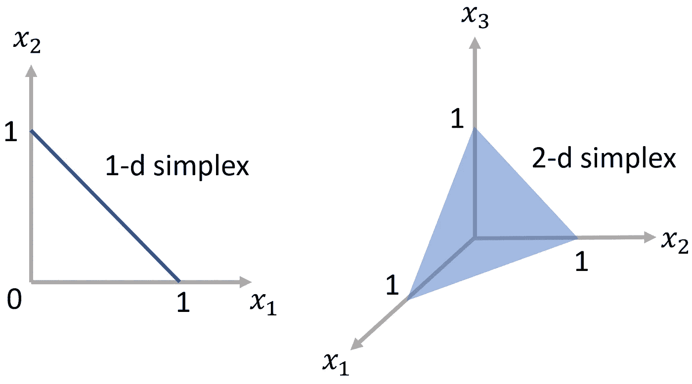
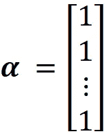
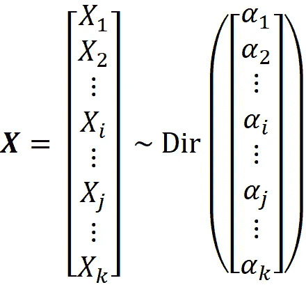
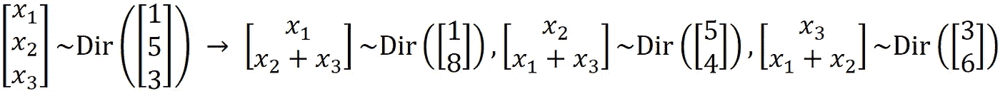

# Dirichlet 分布：基础直观理解及 Python 实现

> 原文：[`towardsdatascience.com/dirichlet-distribution-the-underlying-intuition-and-python-implementation-59af3c5d3ca2`](https://towardsdatascience.com/dirichlet-distribution-the-underlying-intuition-and-python-implementation-59af3c5d3ca2)

## 关于 Dirichlet 分布你需要知道的一切

[](https://reza-bagheri79.medium.com/?source=post_page-----59af3c5d3ca2--------------------------------)[](https://towardsdatascience.com/?source=post_page-----59af3c5d3ca2--------------------------------) [Reza Bagheri](https://reza-bagheri79.medium.com/?source=post_page-----59af3c5d3ca2--------------------------------)

·发布于 [Towards Data Science](https://towardsdatascience.com/?source=post_page-----59af3c5d3ca2--------------------------------) ·27 分钟阅读·2023 年 8 月 1 日

--


图片来源: [`pixabay.com/vectors/cubes-dice-platonic-solids-numbers-160400/`](https://pixabay.com/vectors/cubes-dice-platonic-solids-numbers-160400/)

Dirichlet 分布是贝塔分布的一种推广。在贝叶斯统计中，它通常用作多项式分布的共轭先验，因此可以用来建模概率随机向量的不确定性。它具有广泛的应用，包括贝叶斯分析、文本挖掘、统计遗传学和非参数推断。本文对 Dirichlet 分布进行了直观介绍，并展示了它与多项式分布的联系。此外，还展示了如何在 Python 中建模和可视化 Dirichlet 分布。

**定义**

假设连续随机变量 *X*₁, *X*₂, …*Xₖ* (*k*≥2) 形成随机向量 ***X***，定义为：


我们还定义了向量 ***α*** 如下：


其中


现在，如果随机向量 ***X*** 具有参数 ***α*** 的 *Dirichlet 分布*，则它具有以下联合 PDF：


函数 B(***α***) 称为 *多变量* *贝塔函数*，其定义为


其中 Г(*x*) 是伽马函数。如果随机向量 ***X*** 具有参数 ***α*** 的 Dirichlet 分布，则记作 ***X*** ~ Dir(***α***)。多变量贝塔函数包含在联合概率密度函数（PDF）中用于归一化。联合 PDF 应该在其定义域上积分为 1：


因此，我们有：


基于方程 1，随机变量*X*₁、*X*₂、…*Xₖ*的取值应满足以下条件，以使*f***ₓ**(***x***)>0：


这些条件定义了 Dirichlet 分布的*支持*。***X***的支持及其分布的支持是所有***x***的集合（***X***可以取的值），其中*f***ₓ**(***x***)>0。如果***X***有*k*个元素，具有 Dirichlet 分布的***X***的支持是一个*k*-1 维的*单纯形*。单纯形是由于方程 3 的约束而形成的有界线性流形。单纯形是三角形概念的高维推广。因此，*k*-1 维单纯形可以被视为一个位于*k*维空间中的*k*-1 维三角形。

例如，如果*k*=2，那么***X***的支持是图 1（左）中显示的 1 维单纯形。它是一条直线，触及每个坐标轴，距离原点 1 个单位。对于这条线上的每一点，我们有：


对于*k*=3，那么***X***的支持是图 1（右）中显示的 2 维单纯形。现在它是一个触及每个坐标轴的三角形，距离原点 1 个单位。



图 1（作者提供）

对于这个三角形表面上的每一个点，我们有：


让随机向量


具有参数的 Dirichlet 分布：


让


然后，可以证明***X***的均值如下：


也可以证明：


**直觉**

如前所述，Dirichlet 分布通常作为多项分布的共轭先验。因此，为了理解其背后的直觉，我们首先需要回顾多项分布。假设离散随机向量***X***定义为：


让向量***p***为：


那么***X***被称为具有参数*n*和***p***的多项分布，如果它具有以下联合 PMF：


多项分布可以用于建模一个*k*面骰子。假设我们有一个*k*面骰子，并将其掷*n*次。让*pᵢ*表示获得第*i*面的概率，并让随机变量*Xᵢ*表示第*i*面观察到的总次数（*i*=1…*k*）。那么随机向量


具有参数*n*的多项分布


这一点在图 2 中展示。


图 2（作者提供的图片）

现在假设我们不知道向量 ***p*** 中的 *pᵢ* 值。因此，我们不知道每一面 *k*-面骰子的概率，我们想通过观察 *n* 次掷骰子的结果来推断它。***p*** 的元素表示一些互斥事件的概率，因此我们应该有：


***p*** 的值可以使用 *贝叶斯方法* 推断。在这里，我们假设未知的概率向量 ***p*** 由连续随机向量 ***P*** 表示。***P*** 的概率分布称为 *先验分布*。先验分布表示对估计参数 ***P*** 的先验知识或假设。在掷骰子之后，我们可以分析观察到的数据，并使用这些数据更新我们对 ***P*** 的信念。因此，我们得到一个新的 ***P*** 分布，这称为 *后验分布*。后验分布是通过用观察数据更新先验概率分布得到的。

请记住，随机向量***X***中的随机变量 *Xᵢ* 代表观察到的第 *i* 面的总次数。如果我们知道 ***p*** 的值，我们可以使用以下条件概率计算在 *n* 次掷骰子后观察到 *X*₁=*m*₁, *X*₂=*m*₂, … *Xₖ*=*mₖ* 的概率：


其中：


这个条件概率给出了在 *n* 次掷骰子后观察到每一面骰子特定次数的概率，假设我们知道 ***P*** 的真实值。如前所述，***P*** 的概率分布是我们的先验分布。我们用 *f_****P***(***p***) 来表示这个分布的联合概率密度函数。现在，我们可以使用贝叶斯定理将先验和后验联合概率密度函数连接起来：


这里 *f_****P***|***X*** (***p***|***X***=***m***) 是后验分布的联合概率密度函数。这个分布在观察到 ***X*** 后更新我们对 ***P*** 的信念。我们也称 *P*(***X***=***m***|***p***) 为似然函数，它可以写成一个已知 ***p*** 值的多项式分布的概率质量函数（方程 4）：


贝叶斯定理的分母是 ***X***=***m*** 的概率，称为 ***X*** 的边际概率质量函数：


请注意，这与 ***p*** 的真实值无关。现在我们假设先验分布是具有参数 ***α***₁ 的 Dirichlet 分布。


其中


记住，具有 Dirichlet 分布的随机变量应遵循方程 3 中的条件，这些条件与方程 5 的条件完全相同。实际上，方程 3 中的条件允许我们使用 Dirichlet 分布来表示互斥事件的概率的随机变量。

现在我们可以使用贝叶斯规则（方程 6）来写：


这里 *c* 是一个不依赖于 *pᵢ* 值的常数。后验联合 PDF 应该被归一化，因此我们有以下条件：


通过将方程 7 和 8 与方程 1 和 2 进行比较，我们得出结论，后验分布是一个参数为的 Dirichlet 分布


和 *c* 仅仅是其归一化因子，我们得到：


最后，我们可以写：


所以，如果我们假设先验分布是 Dirichlet 分布，那么在观察到 ***X***=***m*** 之后的后验分布也是 Dirichlet 分布。我们只需将每个侧面观察到的数量 (*mᵢ*) 添加到先验分布中的相应参数 (*αᵢ*) 中，就能得到后验分布的参数。

在贝叶斯概率理论中，如果后验分布属于与先验分布相同的家族，那么先验和后验被称为 *共轭分布*。因此，我们得出结论，Dirichlet 分布是多项分布的共轭先验（图 3）。


图 3（作者提供的图片）

Dirichlet 分布的一个特殊情况是当



然后我们得到：


这意味着


与其 *k*-1 维单纯形上的均匀分布是一样的，因为联合 PDF 在单纯形上具有相同的值。

**在 Python 中建模和可视化**

我们可以使用 `scipy` 库在 Python 中对 Dirichlet 分布进行建模。在 `scipy` 中，Dirichlet 分布可以通过对象 `dirichlet` 创建。该对象接受参数 `alpha`，该参数对应于方程 1 中的 ***α***。我们也可以将 `alpha` 传递给此对象的方法。方法 `pdf()` 还接受参数 `x`，该参数对应于方程 1 中的 ***x***，并返回 `x` 处分布的联合 PDF。我们还可以使用方法 `mean()` 和 `var()` 计算分布的均值和方差。例如，设：


现在我们想计算 ***X*** 的均值及其在 [0.5, 0.3, 0.2]ᵀ 的联合 PDF，使用以下代码片段：

```py
from scipy.stats import dirichlet
dist = dirichlet([5, 5, 5])
print("PDF at [5,5,5]: ",dist.pdf([0.5, 0.3, 0.2]))
print("Mean of disitrubtion: ", dist.mean())
```

```py
PDF at [5,5,5]:  5.1081030000000025
Mean of disitrubtion:  [0.33333333 0.33333333 0.33333333]
```

如果 `x` 的值在单纯形之外，`pdf()` 会抛出错误：

```py
# This results in an error
dist.pdf([0.5, 0.3, 0.3])
```


我们可以可视化 *k*=2 和 3 时的 Dirichlet 联合 PDF（*k* 是 ***X*** 的元素个数）。如前所述，当我们在 ***X*** 中有 3 个随机变量（具有 Dirichlet 分布）时，单纯形是一个二维三角形（图 1）。我们可以计算这个单纯形表面上联合 PDF 的轮廓，并用 *重心坐标* 在二维图中绘制（图 4）。


图 4（作者提供的图像）

重心坐标是一个点在仿射空间中相对于单纯形的坐标。它们可以提供一个点相对于直线、三角形或四面体的位置，而不是全局笛卡尔坐标。在 *k* 维笛卡尔坐标系中，一个点的坐标可以表示为 *k*-1 维单纯形的边的归一化加权平均。这些权重给出了该点相对于单纯形的重心坐标。考虑图 5 中显示的二维空间。


图 5（作者提供的图像）

一维单纯形是端点 [0,1] 和 [0,1] 之间的线段。在这个单纯形上的任意点 ***p*** 的坐标可以表示为端点坐标的归一化加权平均：


其中


这里 *λ*₁ 是 ***p*** 到端点 [0,1] 的距离除以单纯形的长度 (*L*)。类似地，*λ*₂ 是 ***p*** 到端点 [1,0] 的距离除以 *L*。权重 *λ*₁ 和 *λ*₂ 是 ***p*** 相对于该单纯形的重心坐标，并且由于端点距离原点只有一个单位，它们与笛卡尔坐标具有相同的值。

接下来，考虑图 6 中显示的二维单纯形。这个单纯形是由端点 [1,0,0]、[0,1,0] 和 [0,0,1] 组成的三角形。该单纯形上点 ***p*** 的坐标等于这些端点坐标的归一化加权平均：


其中


图 6（作者提供的图像）

在这个三角形中，每个节点代表一个坐标轴 *x*₁、*x*₂ 或 *x*₃。假设我们要计算 *x*₁ 的值。设每条边的长度为 *L*（这是一个等边三角形）。为了得到 *x*₁ 的值，我们绘制一条经过 ***p*** 并且与不经过 *x*₁ 所代表的节点的边（这里是 *x*₂*x*₃）平行的直线。这条直线将其余的每一边（*x*₁*x*₂ 和 *x*₁*x*₃）分成两个线段。在这些边上，不包含节点 *x*₁ 的线段长度是 *λ*₁*L*（见图 6）。我们可以类似地计算 *λ*₂ 和 *λ*₃ 的值。

现在，我们创建一个 Python 函数来绘制二维单纯形上 Dirichlet 分布的联合 PDF 的等高线。清单 1 导入了我们后续需要的所有库，并在二维图上定义了这个三角形单纯形的边。这些边存储在列表`edges`中。请注意，这个二维单纯形现在绘制在二维屏幕上，因此所有的边都是二维的。然而，点的重心坐标仍然是这些边的笛卡尔坐标的加权平均值：


这里的*H*是三角形的高度（图 7）。

我们使用`matplotlib.tri`库来创建一个三角网格。数组`normal_vecs`保存了这个三角形每条边的法向量（每条边的法向量都垂直于该边）。

```py
# Listing 1

import numpy as np
import matplotlib.pyplot as plt
import matplotlib.tri as tri
from scipy.stats import dirichlet, multinomial, beta
from math import pi
from mpl_toolkits.axes_grid1 import make_axes_locatable
import matplotlib.gridspec as gridspec
%matplotlib inline

H = np.tan(pi/3)*0.5
edges = np.array([[0, 0], [1, 0], [0.5, H]])
shifted_edges = np.roll(edges, 1, axis=0)
triangle = tri.Triangulation(edges[:, 0], edges[:, 1])

# For each edge of the triangle, the pair of other edges
edge_pairs = [edges[np.roll(range(3), -i)[1:]] for i in range(3)]
# The normal vectors for each side of the triangle
normal_vecs = np.array([[pair[0,1] - pair[1,1],
              pair[1,0] - pair[0,0]] for pair in edge_pairs])
```

在清单 2 中，函数`cart_to_bc()`将点的二维笛卡尔坐标转换为相对于`edges`中定义的二维三角形的重心坐标。

```py
# Listing 2

def cart_to_bc(coords):
    '''Converts 2D Cartesian coordinates to barycentric'''
    bc_coords = np.sum((np.tile(coords, (3, 1))-shifted_edges)*normal_vecs,
                axis=1) / np.sum((edges-shifted_edges)*normal_vecs, axis=1)
    return np.clip(bc_coords, 1.e-10, 1.0 - 1.e-10)

def bc_to_cart(coords):
    '''Converts barycentric coordinates to 2D Cartesian'''
    return (edges * coords.reshape(-1, 1)).sum(axis=0) 
```

图 7 展示了如何进行这些计算以计算*λ*₃（作为示例）。如图所示，三角形的一条边（***x***₁）位于二维笛卡尔坐标系统的原点。我们可以用向量***x***₁***p***来表示这个三角形上的点***p***。从几何学中，我们知道


其中***n***是边***x***₁***x***₂的法向量。因此，如果我们知道点***p***的笛卡尔坐标、三角形的边以及每条边的法向量，我们就可以轻松计算出点***p***的重心坐标。


图 7（作者提供的图片）

需要注意的是，这个函数并不总是返回准确的重心坐标。如果重心坐标超出了区间 [1e-10 -10, 1–1e-10]，则会使用`numpy`中的`clip()`函数将其裁剪到区间边界。原因将在后文中解释。

我们还有函数`bc_to_cart()`，它将这个三角形的重心坐标转换为笛卡尔坐标。点***p***的笛卡尔坐标等于三角形边的笛卡尔坐标的加权平均值，而重心坐标只是这些权重：


最后，列表 3 定义了函数`plot_contours()`，该函数绘制 Dirichlet 分布在这个三角形上的联合 PDF 等高线。此函数在笛卡尔 2D 空间上创建一个三角网格。接下来，计算网格上每个点的重心坐标。然后，它使用重心坐标计算该点的联合 PDF。在计算完三角形上所有点的联合 PDF 后，绘制等高线。请注意，三角网格上的某些点可能稍微超出简单边界。这意味着该点的 *x*₁+*x*₂+*x*₃ 可能稍微小于零或大于 1。将这样的点传递给 `dirichlet` 对象的 `pdf()` 方法会引发错误。因此，我们在 `cart_to_bc()` 中裁剪重心坐标以避免此错误。

```py
# Listing 3

def plot_contours(dist, nlevels=200, subdiv=8, ax=None):
    refiner = tri.UniformTriRefiner(triangle)
    mesh = refiner.refine_triangulation(subdiv=subdiv)
    pdf_vals = [dist.pdf(cart_to_bc(coords)) for coords in zip(mesh.x, mesh.y)]
    if ax:
        contours = ax.tricontourf(mesh, pdf_vals, nlevels, cmap='jet')
        ax.set_aspect('equal')
        ax.set_xlim(0, 1)
        ax.set_ylim(0, H)
        ax.set_axis_off()
    else:
        contours = plt.tricontourf(mesh, pdf_vals, nlevels, cmap='jet')
        plt.axis('equal')
        plt.xlim(0, 1)
        plt.ylim(0, H)
        plt.axis('off')
    return contours
```

让我们尝试 `plot_contours()`。我们首先绘制等高线


如前所述，由于联合 PDF 在单纯形上具有相同的值，因此它与其 2D 单纯形上的均匀分布相同。列表 4 绘制了联合 PDF 的等高线，结果图如图 8 所示。

```py
# Listing 4

plt.figure(figsize=(10, 10))
contours = plot_contours(dirichlet([1, 1, 1]))
v = np.linspace(0, 3, 2, endpoint=True)
plt.colorbar(contours, ticks=[1,2,3], fraction=0.04, pad=0.1)
plt.text(0-0.02, -0.05, "$p_1$", fontsize=22)
plt.text(1-0.02, -0.05, "$p_2$", fontsize=22)
plt.text(0.5-0.02, H+0.03, "$p_3$", fontsize=22)
plt.title("Dir([1,1,1])", fontsize=22)
plt.show()
```


图 8

如您所见，联合 PDF 在整个单纯形上具有相同的值。接下来，我们绘制等高线


作为列表 5 中的第二个示例。结果如图 9 所示。

```py
# Listing 5

plt.figure(figsize=(10, 10))
contours = plot_contours(dirichlet([5, 5, 5]))
plt.colorbar(contours, fraction=0.04, pad=0.1)
plt.text(0-0.02, -0.05, "$p_1$", fontsize=22)
plt.text(1-0.02, -0.05, "$p_2$", fontsize=22)
plt.text(0.5-0.02, H+0.03, "$p_3$", fontsize=22)
plt.title("Dir([5,5,5])", fontsize=22)
plt.show()
```


图 9

**影响 *α* 对联合 PDF 的影响**

我们还可以创建联合 PDF 表面的 3D 图。这里我们假设 2D 单纯形位于 XY 平面，Z 轴给出 PDF 的值。列表 6 中的函数`plot_surface()`生成这样的图。

```py
# Listing 6

def plot_surface(dist, ax, nlevels=200, subdiv=8, log_plot=False, **args):
    refiner = tri.UniformTriRefiner(triangle)
    mesh = refiner.refine_triangulation(subdiv=subdiv)
    pdf_vals = [dist.pdf(cart_to_bc(coords)) for coords in zip(mesh.x, mesh.y)]
    pdf_vals = np.array(pdf_vals, dtype='float64')
    if log_plot:
        pdf_vals = np.log(pdf_vals)
    ax.plot_trisurf(mesh.x, mesh.y, pdf_vals, linewidth=1, **args)
```

列表 7 使用此函数绘制了具有不同参数的 Dirichlet 分布的联合 PDF。图形如图 10 所示。

```py
# Listing 7

fig = plt.figure(figsize=(15, 10))
ax1 = fig.add_subplot(231, projection='3d')
ax2 = fig.add_subplot(232, projection='3d')
ax3 = fig.add_subplot(233, projection='3d')
ax4 = fig.add_subplot(234, projection='3d')
ax5 = fig.add_subplot(235, projection='3d')
ax6 = fig.add_subplot(236, projection='3d')

ax = [ax1, ax2, ax3, ax4, ax5, ax6]
params = [[1,1,1], [1,7,1], [0.65,7,1], [5,5,5], [30,30,30], [5, 5, 30]]

for i in range(6):
    plot_surface(dirichlet(params[i]), ax[i],
                 antialiased=False, color='yellow')
    ax[i].view_init(35, -135)
    ax[i].set_title("Dir({})".format(params[i]), fontsize=16)
    ax[i].zaxis.set_rotate_label(False) 
    ax[i].set_zlabel("$f_\mathregular{P}(\mathregular{p})$", fontsize=16,
                     weight="bold", style="italic", labelpad=5, rotation=90)
    ax[i].set_xlim([-0.15, 1.1])
    ax[i].set_ylim([-0.15, 1.1])
    if i>2:
        ax[i].set_zlim([0, 65])
    ax[i].xaxis.set_ticklabels([])
    ax[i].yaxis.set_ticklabels([])
    ax[i].set_xticks([])
    ax[i].set_yticks([])
    if i==0:
        ax[i].text(-0.15, -0.07, 2, "$p_1$", fontsize=14)
        ax[i].text(1.07, 0.03, 2, "$p_2$", fontsize=14)
        ax[i].text(0.5, H+0.15, 2, "$p_3$", fontsize=14)
    else:
        ax[i].text(-0.15, -0.07, 0, "$p_1$", fontsize=14)
        ax[i].text(1.07, 0.03, 0, "$p_2$", fontsize=14)
        ax[i].text(0.5, H+0.15, 0, "$p_3$", fontsize=14)

plt.show()
```


图 10

这些图可以帮助您理解 ***α*** 对联合 PDF 形状的影响。具有 Dirichlet 分布的随机变量 *p*₁、*p*₂ 和 *p*₃ 可以表示 3 个相互排斥事件的概率。因此，单纯形的每条边表示这些事件中的一个，相应的 *αᵢ* 就像是该事件发生概率的权重。

如前所述，***α***=[1 1 1]ᵀ 意味着我们在单纯形上有均匀分布。这里，PDF 的值在单纯形上处处为 2，因此联合 PDF 具有平坦的表面。当 *αᵢ* 相对于其他元素增加时，这意味着第 *i* 个事件发生的机会更高，因为与其他事件相比，它被观察得更多（这里我们可以假设我们从 Dir([1 1 1]ᵀ) 作为先验分布开始）。一个例子是图 10 中 Dir([1 7 1]ᵀ) 的图形。现在，表面在单纯形的边缘附近升高，表示该事件。

当总和*α*₁+*α*₂+*α*₃增加时，意味着观察的总数量增加了。这将减少我们对***P***的分布的不确定性，并使 Dirichlet 分布的联合 PDF 看起来更尖锐。正如你在图 10 中看到的，Dir([30 30 30]ᵀ)相比 Dir([5 5 5]ᵀ)要尖锐得多。然而，两者在边缘上看起来都是对称的。因为所有事件被观察的次数相同。当某个*αᵢ*相对于其他值变大时，联合 PDF 的峰值会向表示该事件的边缘移动。这在 Dir([5 5 30]ᵀ)中得到了体现。这里第三个事件的权重（*α*₃）较大，意味着第三个事件被观察得更多，因此发生的概率更高。

请注意，所有的***α***元素应大于零，因此我们不能给事件分配零权重。然而，如果我们设置*αᵢ*<1，则相应事件的权重会显著下降。这在图 10 中的 Dir([0.65 7 1]ᵀ)的图示中得到了体现。如果你将其与 Dir([1 7 1]ᵀ)的图示进行比较，你会发现为了得到非零 PDF，*p*₁的重心坐标应非常小。这几乎像在*p*₂和*p*₃上有一个 1 维的简单形体。

列表 8 绘制了 Dirichlet 分布的联合 PDF 的对数尺度图（以更好地展示联合 PDF 表面的变化）。结果如图 11 所示。

```py
# Listing 8

fig = plt.figure(figsize=(15, 10))

ax1 = fig.add_subplot(121, projection='3d')
ax2 = fig.add_subplot(122, projection='3d')

ax = [ax1, ax2]
params = [[0.2, 0.2, 0.2], [0.8,0.8,0.8], [0.2,0.5,1]]

for i in range(2):
    plot_surface(dirichlet(params[i]), ax[i], log_plot=True, cmap='jet')
    ax[i].view_init(10, -135)
    ax[i].set_title("Dir({})".format(params[i]), fontsize=20)
    ax[i].zaxis.set_rotate_label(False) 
    ax[i].set_zlabel("$log(f_\mathregular{P}(\mathregular{p}))$",
                     fontsize=18, weight="bold", style="italic",
                     labelpad=5, rotation=90)
    ax[i].set_xlim([-0.15, 1.1])
    ax[i].set_ylim([-0.15, 1.1])
    ax[i].set_zlim([0, 17])
    ax[i].xaxis.set_ticklabels([])
    ax[i].yaxis.set_ticklabels([])
    ax[i].set_xticks([])
    ax[i].set_yticks([])
    ax[i].text(-0.09, -0.07, 0, "$p_1$", fontsize=14)
    ax[i].text(1.07, 0.03, 0, "$p_2$", fontsize=14)
    ax[i].text(0.5, H+0.22, 0, "$p_3$", fontsize=14)

plt.show()
```


图 11

请注意，当所有*αᵢ*小于 1 时，联合 PDF 有一个凸面的表面。PDF 在三角形简单形体的边缘和侧面几乎非常小。它几乎像在三角形的边上有三个 1 维的简单形体。因此，具有这种分布的先验表示一个设置，其中一个或两个*pᵢ*非常小，它们对应的事件发生的概率很小。

通过比较 Dir([0.2 0.2 0.2]ᵀ)和 Dir([0.8 0.8 0.8]ᵀ)，你会发现增加*αᵢ*的值倾向于使联合 PDF 的表面变平。因此，它减少了边缘和侧面的联合 PDF 值，并增加了在简单形体中部区域的值。

最后，需要注意的是，Dirichlet 分布的参数也可以是非整数的。但例如 Dir([1.65 6 20]ᵀ)是什么意思呢？在这里，我们可以将参数的小数部分分配给先验分布。例如，我们可以将其写成 Dir([0.65+1 1+5 7+13]ᵀ)。这意味着我们从 Dir([0.65 1 7]ᵀ)作为先验分布开始（Dir([0.65 1 7]ᵀ)的联合 PDF 如图 10 所示）。选择这个先验分布意味着我们最初认为*p*₁几乎为零，它对应的事件发生的可能性非常小。然后我们观察到第一个事件只发生了一次，而第二个和第三个事件分别发生了 5 次和 13 次。这些数字被加到先验分布的参数中，形成了后验分布。

**Python 中的贝叶斯推断**

现在我们可以绘制轮廓图了，我们可以使用狄利克雷分布来推断多项式分布的参数分布。假设我们有一个 3 面的骰子（当然，它也可以是一个 6 面的骰子，只是上面有 3 个标签（1、2 和 3），每个标签出现在两个面上）。设获得面*i*的概率为*pᵢ*，*Xᵢ*表示观察到面*i*的总次数（*i*=1..3）。如前所述，随机向量


具有参数*n*的多项式分布


设实际的***p***值为：


因此，这不是一个公平的骰子！我们可以使用`scipy`中的多项式对象来建模这个分布。以下代码片段显示了掷这个骰子 10 次的结果：

```py
p_act = np.array([0.6, 0.2, 0.2])
sample = multinomial.rvs(n=10, p=p_act, random_state=1)
sample
```

```py
array([6, 3, 1])
```

因此，如果我们掷 10 次，我们会得到以下观察结果：

+   面 1：6 次

+   面 2：3 次

+   面 3：仅 1 次

当然，这些是一些随机事件，因此如果我们在`rvs()`中更改`random_state`，我们可以获得不同的观察结果（我们固定`random_state`以使这个特定的观察结果可重复）。

现在假设我们不知道每一面的概率，因此实际的向量***p***（如方程 10 所示）的值未知。然而，我们仍然可以掷这个骰子*n*次并观察结果，因此，我们知道*Xᵢ*的值。如果我们假设未知的概率向量***p***由随机向量***P***表示，我们可以使用狄利克雷分布来推断掷骰子后的***P***的概率分布。

列表 9 首先生成掷骰子*n*次的结果并存储在*m*中。然后计算*f_****P***|***X*** (***p***|***X***=***m***)，这是后验分布的联合 PDF，并在二维简单形上绘制其轮廓。我们尝试了 5 个不同的*n*值，范围从 3 到 10000，图 12 展示了这些图形。我们以 Dir([1 1 1]ᵀ)作为***P***的先验分布。因此，最初我们对***P***有均匀分布，其中不同的***P***值是同样可能的。因此，我们对***P***有最大的未知。

用于生成观察数据的实际***P***值（方程 10）在这些图中用白色标记显示。随着*n*的增加，我们获得了更多的观察数据，我们对***P***的未知性减少。通过增加*n*，狄利克雷分布从最初的均匀分布变得更加尖锐，并更接近表示***p_***act 的白色标记。

```py
# Listing 9

p_act_coords = bc_to_cart(p_act)

alpha_prior = [1, 1, 1]
number_rolls = [3, 15, 50, 500, 10000]
num_cols = 2

fig, axes = plt.subplots(3, num_cols, figsize=(16, 25))
plt.subplots_adjust(wspace=0.2, hspace=0.05)

contours = plot_contours(dirichlet(alpha_prior), ax=axes[0, 0])
axes[0, 0].set_title("Prior distribution", fontsize=22, pad=50)
axes[0, 0].scatter(p_act_coords[0],
                   p_act_coords[1],
                   s=300, color='white',
                   marker='+')
axes[0, 0].text(0-0.02, -0.05, "$p_1$", fontsize=16)
axes[0, 0].text(1-0.02, -0.05, "$p_2$", fontsize=16)
axes[0, 0].text(0.5-0.02, H+0.05, "$p_3$", fontsize=16)
divider = make_axes_locatable(axes[0, 0])
cax = divider.append_axes('right', size='2%', pad=0.2)
cbar = fig.colorbar(contours, cax=cax)

for i in range(1, 6):
    m= multinomial.rvs(n=number_rolls[i-1], p=p_act, random_state=0)
    contours = plot_contours(dirichlet(m + alpha_prior),
                             ax=axes[i // num_cols, i % num_cols])
    axes[i//num_cols, i%num_cols].set_title("n={}".format(number_rolls[i-1]),
                                            fontsize=22, pad=50)
    axes[i//num_cols, i%num_cols].scatter(p_act_coords[0],
                                          p_act_coords[1],
                                          s=300, color='white',
                                          marker='+')
    axes[i//num_cols, i%num_cols].text(0-0.02, -0.05,
                                       "$p_1$", fontsize=16)
    axes[i//num_cols, i%num_cols].text(1-0.02, -0.05,
                                         "$p_2$", fontsize=16)
    axes[i//num_cols, i%num_cols].text(0.5-0.02, H+0.05,
                                         "$p_3$", fontsize=16)
    divider = make_axes_locatable(axes[i // num_cols, i % num_cols])
    cax = divider.append_axes('right', size='2%', pad=0.2)
    cbar = fig.colorbar(contours, cax=cax)

plt.show()
```


图 12

**与贝塔分布的关系**

让随机向量


具有参数的狄利克雷分布


基于方程 1，***X***的联合 PDF 是：


其中


由于我们有


我们可以从 PDF 中去除 *x*₂：


如你所见，*X*₁ 和 *X*₂ 的联合 PDF 仅是 *x*₁ 的函数。因此，随机向量 ***X*** 由单一随机变量 *X*₁ 决定，这意味着上式右侧也是随机变量 *X*₁ 的 PDF。所以，我们可以写成：


具有这种 PDF 的连续随机变量称为具有参数 *α*₁ 和 *α*₂ 的 *贝塔分布*，我们用 *X*₁ ~ Beta(*α*₁, *α*₂) 来表示。类似地，我们可以用 *x*₂ 表达 PDF：


因此，我们得出结论 *X*₂ ~ Beta(*α*₂, *α*₁)，并得出：


*X*₁ 和 *X*₂ 的分布被称为 ***X*** 的 *边际分布*。当 ***α*** 仅有两个元素，并且我们仅考虑 ***X*** 中的一个随机变量时，贝塔分布是狄利克雷分布的特例。因此，它是一个单变量分布。列表 10 绘制了 Dir([5 1]ᵀ) 的联合 PDF 以及其边际分布的 PDF：Beta(5,1) 和 Beta(1,5)。这些图示见图 13。

```py
# Listing 10

N = 1000
simplex_edges = np.array([[1,0], [0,1]])
tol=1e-6
gamma1 = np.linspace(tol, 1-tol, N)
gamma2 = 1-gamma1
bc_coords = np.stack((gamma1, gamma2), axis=-1)
cart_coords = gamma1.reshape(-1,1)*simplex_edges[0] + \
              gamma2.reshape(-1,1)*simplex_edges[1]
alpha = [5, 1]
pdf = [dirichlet(alpha).pdf(x) for x in bc_coords]

x = np.arange(0, 1.01, 0.01)
param_list = [(1,1), (2,2), (5,1)]
beta_dist1 = beta.pdf(x=x, a=alpha[0], b=alpha[1])
beta_dist2 = beta.pdf(x=x, a=alpha[1], b=alpha[0])

fig = plt.figure(figsize=(15, 15))
plt.subplots_adjust(wspace=0.2, hspace=0.1)
gs = gridspec.GridSpec(2, 2, width_ratios=[2.5, 1],
                       height_ratios=[1, 2.5])
ax1 = fig.add_subplot(221, projection='3d')
ax2 = fig.add_subplot(222)
ax3 = fig.add_subplot(223)

ax1.plot(simplex_edges[:,0], simplex_edges[:,1],
         [0,0], color = 'gray', label='1-d Simplex')
ax1.plot(cart_coords[:,0], cart_coords[:,1], pdf, color = 'black',
         label='Dir([{},{}])'.format(alpha[0], alpha[1]))
ax1.plot(x, [0]*len(x), beta_dist1, color = 'blue',
         label='Beta({},{})'.format(alpha[0], alpha[1]))
ax1.plot([0]*len(x), x, beta_dist2, color = 'green',
         label='Beta({},{})'.format(alpha[1], alpha[0]))

ax1.view_init(25, -135)
ax1.set_xlabel("$x_1$", fontsize=18)
ax1.set_ylabel("$x_2$", fontsize=18, labelpad= 9)
ax1.set_zlabel("$f_\mathregular{X}(\mathregular{x})$", fontsize=18,
               weight="bold", style="italic",
               labelpad= 2, rotation = 45)
ax1.set_xlim([0, 1])
ax1.set_ylim([0, 1])
ax1.set_zlim([0, 6])
ax1.grid(False)
ax1.legend(loc='best', fontsize= 14)

ax2.plot(x, beta_dist1, label='Beta({},{})'.format(alpha[0],
         alpha[1]), linewidth=2, color='blue')
ax2.set_xlabel('$x_1$', fontsize=18)
ax2.set_ylabel('$f_{X_1}(x_1)$', fontsize=18)
ax2.legend(loc='upper left', fontsize= 16)
ax2.set_xlim([0,1])
ax2.tick_params(axis='both', which='major', labelsize=12)

ax3.plot(x, beta_dist2, label='Beta({},{})'.format(alpha[0],
         alpha[1]), linewidth=2, color='blue')
ax3.set_xlabel('$x_2$', fontsize=18)
ax3.set_ylabel('$f_{X_2}(x_2)$', fontsize=18)
ax3.legend(loc='upper right', fontsize= 16)
ax3.set_xlim([0,1])
ax3.tick_params(axis='both', which='major', labelsize=12)
plt.show()
```


图 13

请注意，方程 11 中 Dir([*α*₁ *α*₂]ᵀ) 的联合 PDF 与方程 12 中其边际分布 (Beta(*α*₁, *α*₂)) 的 PDF 相同。然而，它们并不表示相同的分布。前者是随机向量 ***X*** 的联合 PDF，而后者是随机变量 *X*₁ 的 PDF。如图 13 所示，边际分布的 PDFs 是联合 PDF 在由坐标轴 (*x*₁, *f***ₓ**(***x***)) 和 (*x*₂, *f***ₓ**(***x***)) 形成的平面上的投影。

请记住，多项分布可以用于建模一个 *k* 面的骰子。当 *k*=2 时，骰子变成了硬币。现在 *X*₁ 可以表示在 *n* 次掷硬币中的正面总数。类似地，*X*₂ 表示反面总数。从方程 4，我们得到：


由于 *x*₁+*x*₂=*n*，*p*₁+*p*₂=1，我们可以从上述方程中消去 *p*₂ 和 *x*₂：


现在随机向量 ***X*** 由单一随机变量 *X*₁ 决定，这意味着上式右侧也是随机变量 *X*₁ 的 PDF。因此，*X*₁ 的 PDF 可以写成：


这是 binomial 分布的 PDF。binomial 分布是 multinomial 分布的特例，当随机向量 ***X*** 只有一个元素时（即 multinomial 分布的边际分布）。因此 *X*₁ 具有参数 *n* 和 *p*₁ 的 binomial 分布。类似地，*X*₂ 具有参数 *n* 和 *p*₂ 的 binomial 分布。


由于 beta 分布和 binomial 分布分别是 Dirichlet 和 multinomial 分布的特例，它们仍然是共轭分布。实际上，beta 分布是 binomial 分布的共轭先验，如图 14 所示。


图 14（作者提供的图片）

假设我们有一枚硬币，其正面朝上的概率为未知的 *p*。令随机变量 *P* 表示未知的概率 *p*，随机变量 *X* 表示 *n* 次掷硬币中正面的总数。假设 *P* 的概率分布是 Beta(*a*, *b*)（这是我们的先验分布）。现在如果我们掷硬币 *n* 次，观察到 *X*=*k*，则 *P* 的后验分布是 Beta(*a*+*k*, *b*+*n*-*k*)。

**聚合性质**

令随机向量 ***X*** 具有以下 Dirichlet 分布：



我们从***X***中移除随机变量 *Xᵢ* 和 *X_j*，并将 *Xᵢ*+*X_j* 插入到任意位置，得到的结果随机向量称为 ***X***’。可以证明，***X***’ 具有以下 Dirichlet 分布：


因此，为了创建新 Dirichlet 分布中参数的向量，首先，我们移除 *Xᵢ* 和 *X_j* 对应的参数 (*αᵢ* 和 *α_j*)，然后在 *Xᵢ* +*X_j* 被插入到 ***X*** 的相同位置时，插入 *αᵢ*+*α_j*（*αᵢ*+*α_j* 和 *Xᵢ* +*X_j* 在它们对应的向量中的索引是相同的）。聚合性质的证明见附录。

我们来看一个例子。设 ***X*** ~ Dir([1 5 3]ᵀ)。利用聚合性质，我们有：



列表 11 显示了所有这些分布的联合 PDF。该图如图 15 所示。在此图中，每个聚合随机向量 [*Xᵢ X_j*+*X_k*]ᵀ 具有 1 维单纯形。这里，我们假设该单纯形沿着经过 *Xᵢ* 的三角形的高度。

```py
# Listing 11

N = 1000
alpha = [1, 5, 3]

edges_marg_x1 = np.array([[0,0], [0.75,0.5*np.cos(pi/6)]])
edges_marg_x2 = np.array([[1,0], [0.25,0.5*np.cos(pi/6)]])
edges_marg_x3 = np.array([[0.5,H], [0.5,0]])
tol=1e-6
gamma1 = np.linspace(tol, 1-tol, N)
gamma2 = 1-gamma1
bc_coords = np.stack((gamma1, gamma2), axis=-1)
marg_x1_cart_coords = gamma1.reshape(-1,1)*edges_marg_x1[0] + \
                      gamma2.reshape(-1,1)*edges_marg_x1[1]
marg_x2_cart_coords = gamma1.reshape(-1,1)*edges_marg_x2[0] + \
                      gamma2.reshape(-1,1)*edges_marg_x2[1]
marg_x3_cart_coords = gamma1.reshape(-1,1)*edges_marg_x3[0] + \
                      gamma2.reshape(-1,1)*edges_marg_x3[1]

alpha_agg1 = [alpha[0], alpha[1]+alpha[2]]
alpha_agg2 = [alpha[1], alpha[0]+alpha[2]]
alpha_agg3 = [alpha[2], alpha[0]+alpha[1]]

pdf1 = [dirichlet(alpha_agg1).pdf(x) for x in bc_coords]
pdf2 = [dirichlet(alpha_agg2).pdf(x) for x in bc_coords]
pdf3 = [dirichlet(alpha_agg3).pdf(x) for x in bc_coords]

fig = plt.figure(figsize=(10, 10))
ax = fig.add_subplot(111, projection='3d')
plot_surface(dirichlet(alpha), ax, antialiased=False,
             color='yellow', alpha=0.15)
ax.plot([1,0.5], [0, H], [0, 0], "--", color='black')

ax.plot(marg_x1_cart_coords[:,0], marg_x1_cart_coords[:,1],
        pdf1, color = 'black', zorder=10,
        label="$[x_1, x_2+x_3]$ ~ Dir([{},{}])".format(alpha_agg1[0],
        alpha_agg1[1]))
ax.plot(marg_x2_cart_coords[:,0], marg_x2_cart_coords[:,1],
        pdf2, color = 'blue', zorder=12,
        label="$[x_2, x_1+x_3]$ ~ Dir([{},{}])".format(alpha_agg2[0],
        alpha_agg2[1]))
ax.plot(marg_x3_cart_coords[:,0], marg_x3_cart_coords[:,1],
        pdf3, color = 'red', zorder=10,
        label="$[x_3, x_1+x_2]$ ~ Dir([{},{}])".format(alpha_agg3[0],
        alpha_agg3[1]))

ax.view_init(30, -130)
ax.set_title("Dir([{},{},{}])".format(alpha[0], alpha[1],
             alpha[2]), fontsize=18)
ax.zaxis.set_rotate_label(False) 
ax.set_zlabel("$f_\mathregular{X}(\mathregular{x})$", fontsize=18,
               weight="bold", style="italic", labelpad=15)
ax.set_zlim([0, 17])

ax.xaxis.set_ticklabels([])
ax.yaxis.set_ticklabels([])
ax.set_xticks([])
ax.set_yticks([])
ax.legend(loc='best', fontsize=15)

ax.text(-0.06, -0.03, 0, "$x_1$", fontsize=17)
ax.text(1.03, 0.03, 0, "$x_2$", fontsize=17)
ax.text(0.5, H+0.09, 0, "$x_3$", fontsize=17)

plt.show()
```


图 15

**边际分布**

现在，利用聚合性质，当 ***X*** 具有超过 2 个元素时，我们可以找到 Dirichlet 分布的边际分布。令 ***X*** 具有 Dirichlet 分布：


我们可以对除 *X*₁ 外的 ***X*** 中的所有元素重复应用聚合性质，得到：


我们可以将前面的方程写成


其中


更一般地，我们可以为每个元素***X***写出相同的方程：


因此，根据方程 13，每个 *Xᵢ* 的边际分布是以下贝塔分布：


在这篇文章中，我们回顾了狄利克雷分布。我们展示了它是多项分布的共轭先验，并且由于这一重要特性，它可以用来推断多项分布的参数。我们还展示了如何在 Python 中对其进行建模以及如何可视化其联合 PDF。最后，我们看到贝塔分布和狄利克雷分布之间的联系，并展示了狄利克雷分布是贝塔分布在更高维度上的推广。

我希望你喜欢阅读这篇文章。如果你有任何问题或建议，请告诉我。本文中的所有代码清单可以从 GitHub 上以 Jupyter Notebook 形式下载，网址为：

[`github.com/reza-bagheri/probability_distributions/blob/main/dirichlet_distribution.ipynb`](https://github.com/reza-bagheri/probability_distributions/blob/main/dirichlet_distribution.ipynb)
