# 通过物理信息神经网络和符号回归发现微分方程

> 原文：[`towardsdatascience.com/discovering-differential-equations-with-physics-informed-neural-networks-and-symbolic-regression-c28d279c0b4d`](https://towardsdatascience.com/discovering-differential-equations-with-physics-informed-neural-networks-and-symbolic-regression-c28d279c0b4d)

## 一个逐步代码实现的案例研究

[](https://shuaiguo.medium.com/?source=post_page-----c28d279c0b4d--------------------------------)[](https://towardsdatascience.com/?source=post_page-----c28d279c0b4d--------------------------------) [Shuai Guo](https://shuaiguo.medium.com/?source=post_page-----c28d279c0b4d--------------------------------)

·发表于[Towards Data Science](https://towardsdatascience.com/?source=post_page-----c28d279c0b4d--------------------------------) ·阅读时间 25 分钟·2023 年 7 月 28 日

--


照片由[Steven Coffey](https://unsplash.com/@steeeve?utm_source=medium&utm_medium=referral)拍摄，来源于[Unsplash](https://unsplash.com/?utm_source=medium&utm_medium=referral)

微分方程作为一个强大的框架，用于捕捉和理解物理系统的动态行为。通过描述变量之间如何变化，它们提供了对系统动态的见解，并允许我们对系统未来的行为进行预测。

然而，我们在许多实际系统中面临的一个共同挑战是，它们的控制微分方程通常仅*部分已知*，未知的方面以几种方式表现出来：

+   微分方程的**参数**是未知的。例如在风工程中，流体动力学的控制方程已被很好地建立，但与湍流流动相关的系数非常不确定。

+   微分方程的**函数形式**是未知的。例如，在化学工程中，由于速率决定步骤和反应途径的不确定性，速率方程的确切函数形式可能没有完全理解。

+   **函数形式**和**参数**都是未知的。一个典型的例子是电池状态建模，其中常用的等效电路模型仅部分捕捉了电流-电压关系（因此缺失物理的函数形式是未知的）。此外，模型本身包含未知的参数（即电阻和电容值）。

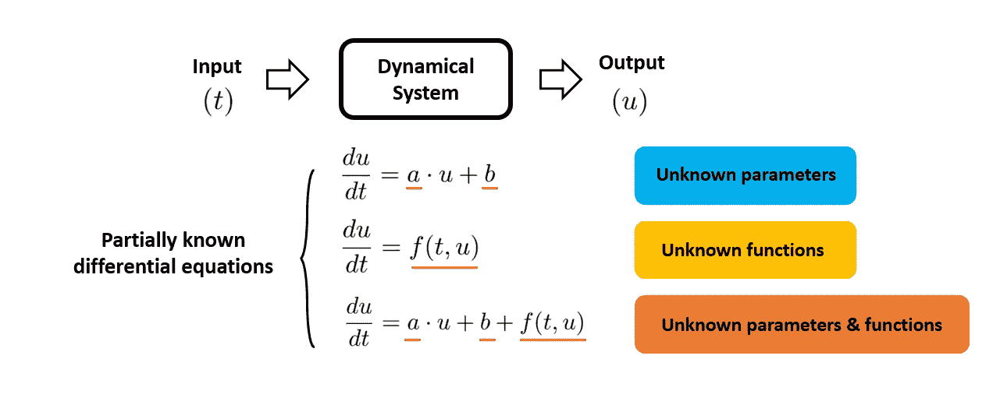

图 1\. 许多实际动态系统的控制方程仅部分已知。（图片由本博客作者提供）

对主方程的这种部分了解阻碍了我们对这些动力系统的理解和控制。因此，根据观察数据推断这些未知组件成为动力系统建模中的关键任务。

广义而言，使用观察数据恢复动力系统的主方程的过程属于**系统识别**的范畴。一旦发现这些方程，我们可以轻松地利用这些方程预测系统的未来状态，告知系统的控制策略，或通过分析技术进行理论研究。

最近，[Zhang et al.](https://arxiv.org/abs/2307.08107)(2023)提出了一种有前景的策略，该策略利用**物理信息神经网络**（PINN）和**符号回归**来发现常微分方程（ODEs）系统中的未知量。虽然他们的重点是发现用于阿尔茨海默病建模的微分方程，但他们提出的解决方案对一般动力系统也具有潜力。

在这篇博客文章中，我们将更深入地了解作者提出的概念，并动手重现论文中的一个案例研究。为此，我们将从零开始构建一个 PINN，利用[PySR 库](https://github.com/MilesCranmer/PySR)进行符号回归，并讨论获得的结果。

> 如果你对物理信息神经网络的最佳实践感兴趣，欢迎查看我的博客系列：
> 
> 物理信息神经网络：以应用为中心的指南
> 
> [揭示物理信息神经网络的设计模式](https://medium.com/towards-data-science/unraveling-the-design-pattern-of-physics-informed-neural-networks-series-01-8190df459527)。

记住这一点，让我们开始吧！

## **目录**

**·** **1\. 案例研究** **·** **2\. 为什么传统方法不够有效？** **·** **3\. PINN 在系统识别中的应用（理论）** **·** **4\. PINN 在系统识别中的应用（代码）**

∘ 4.1 定义架构

∘ 4.2 定义 ODE 损失

∘ 4.3 定义梯度下降步骤

∘ 4.4 数据准备

∘ 4.5 PINN 训练

**·** **5\. 符号回归**

∘ 5.1 PySR 库

∘ 5.2 实施

∘ 5.3 识别结果

·**6\. 总结**

· 参考文献

# 1\. 案例研究

让我们开始介绍我们旨在解决的问题。在这篇博客中，我们将重现[Zhang et al](https://arxiv.org/abs/2307.08107)原始论文中的第一个案例研究，即从数据中发现 Kraichnan-Orszag 系统。该系统由以下 ODEs 描述：

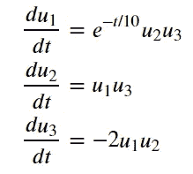

具有初始条件 *u*₁(0)=1，*u*₂(0)=0.8，*u*₃(0)=0.5。Kraichnan-Orszag 系统通常用于湍流研究和流体动力学研究，其目标是对湍流及其结构和动态发展理论见解。

为了模拟一个典型的系统识别设置，我们假设我们对控制常微分方程的了解仅限于部分已知。具体来说，我们假设我们对 *u*₁ 和 *u*₂ 的微分方程一无所知。此外，我们假设我们只知道 *u*₃ 的微分方程右侧是 *u*₁ 和 *u*₂ 的线性变换。然后，我们可以将常微分方程系统重写如下：

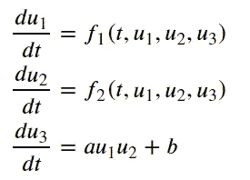

其中 *f*₁ 和 *f*₂ 代表未知函数，*a* 和 *b* 是未知参数。**我们的目标是校准 *a* 和 *b* 的值，并估计 *f*₁ 和 *f*₂ 的解析函数形式**。 本质上，我们正面临一个具有未知参数和函数形式的复杂系统识别问题。

# 2\. 为什么传统方法会失败？

在传统的系统识别范式中，我们通常使用数值方法（例如，欧拉法、龙格-库塔法等）来模拟和预测系统状态 *u*₁、*u*₂ 和 *u*₃。 然而，这些方法从根本上受限，因为它们通常需要完整的控制微分方程形式，并且无法处理微分方程仅部分已知的情况。

在方程参数未知的情况下，传统方法通常诉诸于优化技术，其中对参数进行初步猜测，然后通过迭代过程来优化，以最小化观察数据与数值求解器预测数据之间的差异。由于每次优化迭代都需要运行一次数值求解器，这种方法虽然可行，但计算开销可能非常大。

请注意，上述讨论仅描述了校准未知参数的情况。当我们需要估计微分方程中的未知函数时，问题变得更加复杂。从理论上讲，我们可以采用类似的方法，即在优化之前对未知函数的形式做出假设。然而，如果我们走这条路，会立即出现问题：如果我们假设一个过于简单的形式，我们面临**欠拟合**的风险，这可能导致较大的预测误差。另一方面，如果我们假设一个过于复杂的形式（例如，具有许多可调参数），我们面临**过拟合**的风险，这可能导致较差的泛化性能。

总之，传统方法在处理部分已知微分方程时面临重大挑战：

1️⃣ 传统数值方法依赖于具有完整控制微分方程的形式来进行模拟。

2️⃣ 将传统数值方法与优化算法结合可以解决参数估计问题，但通常代价很高。

3️⃣ 对于嵌入微分方程中的未知函数进行估计时，传统方法可能会得到对假设函数形式高度敏感的结果，这会导致欠拟合或过拟合的风险。

鉴于这些挑战，传统方法在处理未知参数和函数形式共存的系统识别问题时往往效果不佳。这自然引出了物理信息神经网络（PINNs）的话题。在下一节中，我们将看到 PINN 如何有效地解决传统方法面临的挑战。

# **3\. PINN 在系统识别中的应用（理论）**

物理信息神经网络（简称 PINN）是[Raissi 等人](https://www.sciencedirect.com/science/article/abs/pii/S0021999118307125)在 2019 年提出的一个强大概念。PINN 的基本思想，像其他*物理信息机器学习*技术一样，是创建一个混合模型，其中在模型训练中利用了观察数据和已知的物理知识（以微分方程形式表示）。PINN 最初被设计为一个高效的 ODE/PDE 求解器。然而，研究人员很快认识到 PINN 在解决逆问题和系统识别问题上（可以说）具有更大的潜力。

在接下来的内容中，我们将逐一解释如何利用 PINN 克服我们在上一节讨论的挑战。

1️⃣ 传统数值方法依赖于拥有完整形式的主控微分方程来进行模拟。

📣**PINN 的响应**：与传统方法不同，我能够处理部分已知的微分方程，因此不受完整方程的限制来进行模拟。

从外部角度看，PINN 仅仅类似于一个传统的神经网络模型，该模型将时间/空间坐标（例如，*t*，*x*，*y*）作为输入，并输出我们试图模拟的目标量（例如，速度*u*，压力*p*，温度*T*等）。然而，使 PINN 与传统 NN 不同的是，在 PINN 中，微分方程作为训练过程中的约束。具体来说，PINN 引入了一个额外的损失项，用于计算主控微分方程的残差，该残差通过将预测量代入主控方程计算得到。通过优化这个损失项，我们有效地使训练后的网络意识到潜在的物理规律。

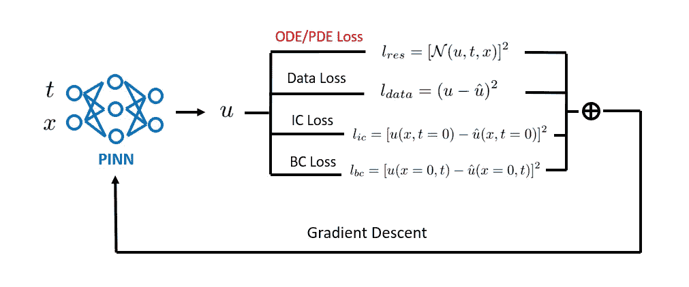

图 2. 物理信息神经网络将微分方程纳入损失函数中，因此有效地使训练后的网络意识到潜在的物理规律。（图像由本博客作者提供）

由于微分方程仅用于构建损失函数，因此它们对 PINN 模型结构没有影响。这实际上意味着我们在训练时不需要对微分方程有完全的了解。即使我们只知道方程的一部分，这些知识仍然可以被纳入以强制输出遵循已知的物理规律。这种适应知识完整度不同的灵活性相比传统数值方法具有显著优势。

2️⃣ 结合传统数值方法与优化算法可以解决参数估计问题，但通常代价较高。

📣**PINN 的回应**：我可以提供一种计算上高效的替代方案来估计未知参数。

与将参数估计视为单独优化任务的传统方法不同，PINNs 将这一过程无缝地集成到模型训练阶段。在 PINNs 中，未知参数被简单地视为额外的可训练参数，这些参数在训练过程中与其他神经网络的权重和偏差一起优化。

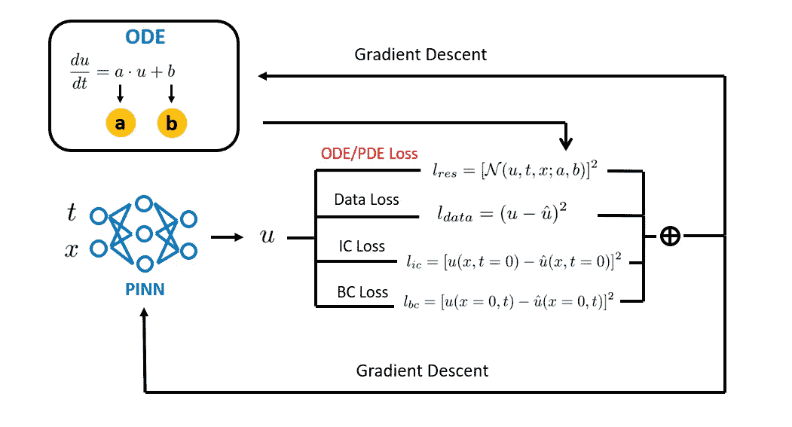

图 3\. 未知参数与 PINN 的权重和偏差一起优化。在训练结束时，我们得到的最终值 *a* 和 *b* 作为未知参数的估计值。（图片由本博客作者提供）

此外，PINNs 充分利用现代深度学习框架来执行训练。这允许快速计算所需的梯度（即通过自动微分），以用于高级优化算法（例如 Adam），从而大大加速了参数估计过程，尤其是对于高维参数空间的问题。这些因素使得 PINNs 成为参数估计问题的一个有竞争力的替代方案。

3️⃣ 对于嵌入微分方程中的未知函数，传统方法可能会得到对假设函数形式高度敏感的结果，这会产生欠拟合或过拟合的风险。

📣**PINN 的回应**：未知函数可以通过额外的神经网络有效地参数化，这些神经网络可以与我一起训练，就像之前的参数估计场景一样。

我们可以用独立的神经网络来逼近未知函数，然后将它们集成到主 PINN 模型中。就像在之前的参数估计场景中一样，我们可以将这些额外的神经网络视为需要估计的大量未知参数。

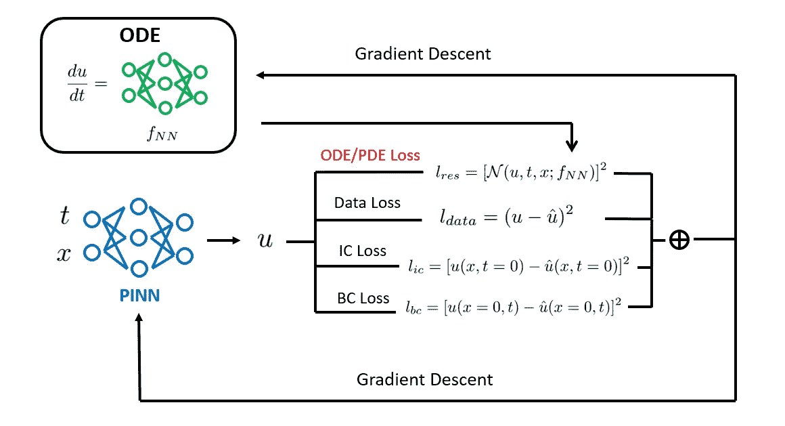

图 4。未知函数可以通过一个独立的神经网络进行参数化，并与原始 PINN 一起训练。ODE/PDE 残差损失项对辅助神经网络进行正则化，以满足控制方程。这样，辅助神经网络可以直接从数据中自动学习最佳的函数形式。（图像来源于本博客作者）

在训练过程中，这些辅助神经网络的权重和偏差将与原始 PINN 同时训练，以最小化损失函数（数据损失 + ODE 残差损失）。通过这种方式，这些辅助神经网络可以直接从数据中学习最佳的函数形式。通过消除对函数形式进行风险假设的需要，这种策略有助于缓解欠拟合和过拟合的问题。

总结来说，PINN 的优势在于其能够处理部分已知的微分方程，并有效地从数据中学习未知参数和函数形式。这种多功能性使其与传统方法区别开来，因此成为系统识别任务的有效工具。

在下一节中，我们将开始处理我们的案例研究，并将理论转化为实际代码。

# 4. PINN 用于系统识别（代码）

在本节中，我们将实现一个 PINN（在 TensorFlow 中）来解决我们的目标案例研究。让我们从导入必要的库开始：

```py
import pandas as pd
import numpy as np
import matplotlib.pyplot as plt
from scipy.integrate import solve_ivp

import tensorflow as tf
from tensorflow import keras
tf.random.set_seed(42)
```

## 4.1 定义架构

对于主要的 PINN，我们使用一个神经网络来预测***u***，其具有 1 维输入（即*t*）和 3 维输出（*u*₁、*u*₂和*u*₃）。此外，如前一节所讨论的，我们使用一个辅助神经网络来逼近未知函数*f*₁和*f*₂，该网络具有 4 维输入（即*t*、*u*₁、*u*₂和*u*₃）和 2 维输出（*f*₁和*f*₂）。整体 PINN 的架构如下所示：

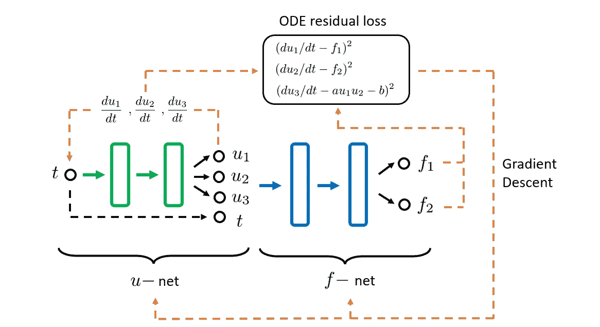

图 5。所使用的 PINN 模型的架构。（图像来源于本博客作者）

值得再次强调的是，需要向辅助神经网络提供所有可用的特征（在我们当前的情况下，*t*、*u*₁、*u*₂和*u*₃），因为我们不知道*f*₁和*f*₂的确切函数形式。在训练过程中，辅助神经网络将以数据驱动的方式自动确定哪些特征是必要的/重要的。

首先，让我们定义一个预测***u***的神经网络。在这里，我们使用两个隐藏层，每个层配备 50 个神经元和双曲正切激活函数：

```py
def u_net(u_input):
    """Definition of the network for u prediction.

    Args:
    ----
    u_input: input for the u-net

    Outputs:
    --------
    output: the output of u-net
    """

    hidden = u_input
    for _ in range(2):
        hidden = tf.keras.layers.Dense(50, activation="tanh")(hidden)
    output = tf.keras.layers.Dense(3)(hidden)

    return output
```

接下来，我们定义一个预测***f***的辅助神经网络。我们采用相同的网络架构：

```py
def f_net(f_inputs, a_init=None, b_init=None):
    """Definition of the network for f prediction.

    Args:
    ----
    f_inputs: list of inputs for the f-net
    a_init: initial value for parameter a
    b_init: initial value for parameter b

    Outputs:
    --------
    output: the output of f-net
    """

    hidden = tf.keras.layers.Concatenate()(f_inputs)
    for _ in range(2):
        hidden = tf.keras.layers.Dense(50, activation="tanh")(hidden)
    output = tf.keras.layers.Dense(2)(hidden)
    output = ParameterLayer(a_init, b_init)(output)

    return output
```

在上述代码中，我们将*a*和*b*添加到神经网络模型参数的集合中。这样，*a*和*b*可以与神经网络的其他权重和偏差一起优化。我们通过定义一个自定义层`ParameterLayer`实现了这一目标：

```py
class ParameterLayer(tf.keras.layers.Layer):

    def __init__(self, a, b, trainable=True):
        super(ParameterLayer, self).__init__()
        self._a = tf.convert_to_tensor(a, dtype=tf.float32)
        self._b = tf.convert_to_tensor(b, dtype=tf.float32)
        self.trainable = trainable

    def build(self, input_shape):
        self.a = self.add_weight("a", shape=(1,), 
                                 initializer=tf.keras.initializers.Constant(value=self._a),
                                 trainable=self.trainable)
        self.b = self.add_weight("b", shape=(1,), 
                                 initializer=tf.keras.initializers.Constant(value=self._b),
                                 trainable=self.trainable)

    def get_config(self):
        return super().get_config()

    @classmethod
    def from_config(cls, config):
        return cls(**config)
```

注意，这一层除了引入这两个参数作为模型属性外没有其他作用。

最后，我们将 *u*-net 和 *f*-net 结合在一起，定义完整的 PINN 架构：

```py
def create_PINN(a_init=None, b_init=None, verbose=False):
    """Definition of a PINN.

    Args:
    ----
    a_init: initial value for parameter a
    b_init: initial value for parameter b
    verbose: boolean, indicate whether to show the model summary

    Outputs:
    --------
    model: the PINN model
    """

    # Input
    t_input = tf.keras.Input(shape=(1,), name="time")

    # u-NN
    u = u_net(t_input)

    # f-NN
    f = f_net([t_input, u], a_init, b_init)

    # PINN model
    model = tf.keras.models.Model(inputs=t_input, outputs=[u, f])

    if verbose:
        model.summary()

    return model
```

在上述代码中，我们将输入 *t* 和 *u*-net 输出 *u*₁, *u*₂, 和 *u*₃ 进行串联，然后输入到 *f*-net 中。此外，我们在整体 PINN 模型中输出 ***u*** 和 ***f***。虽然在实际应用中只需要 ***u***（因为 ***u*** 是我们的建模目标），但后续 ***f*** 的预测会变得有用，以提取其分析函数形式（见第五部分）。

## 4.2 定义 ODE 损失

接下来，我们定义计算 ODE 残差损失的函数。回顾一下，我们的目标 ODEs 是：

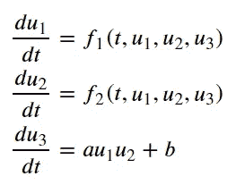

因此，我们可以按如下方式定义函数：

```py
@tf.function
def ODE_residual_calculator(t, model):
    """ODE residual calculation.

    Args:
    ----
    t: temporal coordinate
    model: PINN model

    Outputs:
    --------
    ODE_residual: residual of the governing ODE
    """

    # Retrieve parameters
    a = model.layers[-1].a
    b = model.layers[-1].b

    with tf.GradientTape() as tape:
        tape.watch(t)
        u, f = model(t)

    # Calculate gradients
    dudt = tape.batch_jacobian(u, t)[:, :, 0]
    du1_dt, du2_dt, du3_dt = dudt[:, :1], dudt[:, 1:2], dudt[:, 2:]

    # Compute residuals
    res1 = du1_dt - f[:, :1]
    res2 = du2_dt - f[:, 1:]
    res3 = du3_dt - (a*u[:, :1]*u[:, 1:2] + b)
    ODE_residual = tf.concat([res1, res2, res3], axis=1)

    return ODE_residual
```

虽然上述代码大部分是自解释的，但有几个问题值得提及：

+   我们使用了 `tf.GradientTape.batch_jacobian()`（而不是通常的 `GradientTape.gradient()`）来计算 *u*₁, *u*₂ 和 *u*₃ 相对于 *t* 的梯度。`GradientTape.gradient()` 在这里不起作用，因为它计算的是 d*u*₁/dt + d*u*₂/dt + d*u*₃/dt。我们也可以在这里使用 `GradientTape.jacobian()` 来计算每个输出值相对于每个输入值的梯度。有关更多细节，请参见 [官方页面](https://www.tensorflow.org/api_docs/python/tf/GradientTape#methods)。

+   我们使用了 `@tf.function` 装饰器将上述 Python 函数转换为 TensorFlow 图。这是有用的，因为梯度计算可能非常昂贵，使用图模式执行可以显著加速计算。

## 4.3 定义梯度下降步骤

接下来，我们配置了计算总损失相对于参数（网络权重和偏差，以及未知参数 *a* 和 *b*）的梯度的逻辑。这对于执行模型训练的梯度下降是必要的：

```py
@tf.function
def train_step(X_ODE, X, y, IC_weight, ODE_weight, data_weight, model):
    """Calculate gradients of the total loss with respect to network model parameters.

    Args:
    ----
    X_ODE: collocation points for evaluating ODE residuals
    X: observed samples
    y: target values of the observed samples
    IC_weight: weight for initial condition loss
    ODE_weight: weight for ODE loss
    data_weight: weight for data loss
    model: PINN model

    Outputs:
    --------
    ODE_loss: calculated ODE loss
    IC_loss: calculated initial condition loss
    data_loss: calculated data loss
    total_loss: weighted sum of ODE loss, initial condition loss, and data loss
    gradients: gradients of the total loss with respect to network model parameters.
    """

    with tf.GradientTape() as tape:
        tape.watch(model.trainable_weights)

        # Initial condition prediction
        y_pred_IC, _ = model(tf.zeros((1, 1)))

        # ODE residual
        ODE_residual = ODE_residual_calculator(t=X_ODE, model=model)

        # Data loss
        y_pred_data, _ = model(X)

        # Calculate loss
        IC_loss = tf.reduce_mean(keras.losses.mean_squared_error(tf.constant([[1.0, 0.8, 0.5]]), y_pred_IC))
        ODE_loss = tf.reduce_mean(tf.square(ODE_residual))
        data_loss = tf.reduce_mean(keras.losses.mean_squared_error(y, y_pred_data))

        # Weight loss
        total_loss = IC_loss*IC_weight + ODE_loss*ODE_weight + data_loss*data_weight

    gradients = tape.gradient(total_loss, model.trainable_variables)

    return ODE_loss, IC_loss, data_loss, total_loss, gradients
```

在上述代码中：

1.  我们考虑三个损失项：初始条件损失 `IC_loss`、ODE 残差损失 `ODE_loss` 和数据损失 `data_loss`。`IC_loss` 通过将模型预测的***u***(*t*=0)与已知的***u***初始值进行比较来计算，`ODE_loss` 通过调用我们之前定义的 `ODE_residual_calculator` 函数来计算，而数据损失则是通过将模型预测值（即 *u*₁, *u*₂, *u*₃）与它们的观测值进行简单比较来计算的。

1.  我们将总损失定义为 `IC_loss`、`ODE_loss` 和 `data_loss` 的加权和。通常，权重控制在训练过程中对各个损失项的重视程度。在我们的案例研究中，将它们全部设置为 1 就足够了。

## 4.4 数据准备

在本小节中，我们讨论了如何组织数据以进行 PINN 模型训练。

回忆一下，我们的总损失函数包含 ODE 残差损失和数据损失。因此，我们需要生成时间维度上的配点（用于评估 ODE 损失）和配对输入(*t*)-输出(***u***)的监督数据。

```py
# Set batch size
data_batch_size = 100
ODE_batch_size = 1000

# Samples for enforcing ODE residual loss
N_collocation = 10000
X_train_ODE = tf.convert_to_tensor(np.linspace(0, 10, N_collocation).reshape(-1, 1), dtype=tf.float32)
train_ds_ODE = tf.data.Dataset.from_tensor_slices((X_train_ODE))
train_ds_ODE = train_ds_ODE.shuffle(10*N_collocation).batch(ODE_batch_size)

# Samples for enforcing data loss
X_train_data = tf.convert_to_tensor(u_obs[:, :1], dtype=tf.float32)
y_train_data = tf.convert_to_tensor(u_obs[:, 1:], dtype=tf.float32)
train_ds_data = tf.data.Dataset.from_tensor_slices((X_train_data, y_train_data))
train_ds_data = train_ds_data.shuffle(10000).batch(data_batch_size)
```

在上面的代码中，我们在目标时间域[0, 10]内分配了 10000 个等间距的配点。为了方便数据损失计算，我们预生成了配对输入(*t*)-输出(***u***)数据集`u_obs`，其第一列为时间坐标，其余三列分别表示 *u*₁、*u*₂ 和 *u*₃。`u_obs`包含 1000 个数据点，计算方式如下代码：

```py
# Set up simulation
u_init = [1, 0.8, 0.5]
t_span = [0, 10]
obs_num = 1000

# Solve ODEs
u_obs = simulate_ODEs(u_init, t_span, obs_num)
```

其中 `simulate_ODEs` 是 ODE 求解器，它在给定初始条件和模拟域的情况下模拟***u***轨迹：

```py
def simulate_ODEs(u_init, t_span, obs_num):
    """Simulate the ODE system and obtain observational data. 

    Args:
    ----
    u_init: list of initial condition for u1, u2, and u3
    t_span: lower and upper time limit for simulation
    obs_num: number of observational data points

    Outputs:
    --------
    u_obs: observed data for u's
    """

    # Target ODEs
    def odes(t, u):
        du1dt = np.exp(-t/10) * u[1] * u[2]
        du2dt = u[0] * u[2]
        du3dt = -2 * u[0] * u[1]
        return [du1dt, du2dt, du3dt]

    # Solve ODEs
    t_eval = np.linspace(t_span[0], t_span[1], obs_num)
    sol = solve_ivp(odes, t_span, u_init, method='RK45', t_eval=t_eval)

    # Restrcture solution
    u_obs = np.column_stack((sol.t, sol.y[0], sol.y[1], sol.y[2]))

    return u_obs
```

下图展示了目标***u***的轮廓。请注意，我们已经抽取了 1000 个等间距的 (*t* — *u*₁)、(*t* — *u*₂) 和 (*t* — *u*₃) 数据对（包含在`u_obs`中），作为数据损失计算的监督数据。

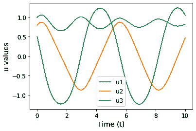

图 6\. 我们当前研究的 ODE 的输出轮廓。（图像由本博客作者提供）

## 4.5 PINN 训练

以下代码定义了主要的训练和验证逻辑：

```py
# Set up training configurations
n_epochs = 1000
IC_weight= tf.constant(1.0, dtype=tf.float32)   
ODE_weight= tf.constant(1.0, dtype=tf.float32)
data_weight= tf.constant(1.0, dtype=tf.float32)
a_list, b_list = [], []

# Initial value for unknown parameters
a_init, b_init = -1, 1

# Set up optimizer
optimizer = keras.optimizers.Adam(learning_rate=2e-2)

# Instantiate the PINN model
PINN = create_PINN(a_init=a_init, b_init=b_init)
PINN.compile(optimizer=optimizer)

# Configure callbacks
_callbacks = [keras.callbacks.ReduceLROnPlateau(factor=0.5, patience=100),
             tf.keras.callbacks.ModelCheckpoint('PINN_model.h5', monitor='val_loss', save_best_only=True)]
callbacks = tf.keras.callbacks.CallbackList(
                _callbacks, add_history=False, model=PINN)

# Start training process
for epoch in range(1, n_epochs + 1):  
    print(f"Epoch {epoch}:")

    for (X_ODE), (X, y) in zip(train_ds_ODE, train_ds_data):

        # Calculate gradients
        ODE_loss, IC_loss, data_loss, total_loss, gradients = train_step(X_ODE, X, y, IC_weight, 
                                                                         ODE_weight, data_weight, PINN)
        # Gradient descent
        PINN.optimizer.apply_gradients(zip(gradients, PINN.trainable_variables))

    # Parameter recording
    a_list.append(PINN.layers[-1].a.numpy())
    b_list.append(PINN.layers[-1].b.numpy())

    ####### Validation
    val_res = ODE_residual_calculator(tf.reshape(tf.linspace(0.0, 10.0, 1000), [-1, 1]), PINN)
    val_ODE = tf.cast(tf.reduce_mean(tf.square(val_res)), tf.float32)

    u_init=tf.constant([[1.0, 0.8, 0.5]])
    val_pred_init, _ = PINN.predict(tf.zeros((1, 1)))
    val_IC = tf.reduce_mean(tf.square(val_pred_init-u_init))

    # Callback at the end of epoch
    callbacks.on_epoch_end(epoch, logs={'val_loss': val_IC+val_ODE})

    # Re-shuffle dataset
    train_ds_data = tf.data.Dataset.from_tensor_slices((X_train_data, y_train_data))
    train_ds_data = train_ds_data.shuffle(10000).batch(data_batch_size) 

    train_ds_ODE = tf.data.Dataset.from_tensor_slices((X_train_ODE))
    train_ds_ODE = train_ds_ODE.shuffle(10*N_collocation).batch(ODE_batch_size) 
```

+   正如之前讨论的，我们将不同损失组件的权重设置为 1。

+   我们将 *a* 和 *b* 的初始猜测设置为-1 和 1，分别。回忆一下，这些值与它们的真实值不同，真实值分别为-2 和 0。

+   为了验证，我们将 ODE 残差损失和初始条件损失相加，作为最终的验证损失。请注意，我们在这里不考虑数据损失，因为我们假设没有额外的配对 *t* — **u** 数据集用于验证目的。计算出的验证损失用于调整学习率。

下图展示了损失收敛曲线。我们可以看到所有三个损失组件都正确收敛，这表明训练已满意完成。

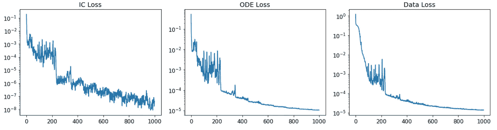

图 7\. 损失收敛图。（图像由本博客作者提供）

下图展示了预测的***u***与通过 ODE 求解器计算的真实值之间的比较。在这里，我们还可以看到 PINN 能够准确地解决我们的目标 ODE。

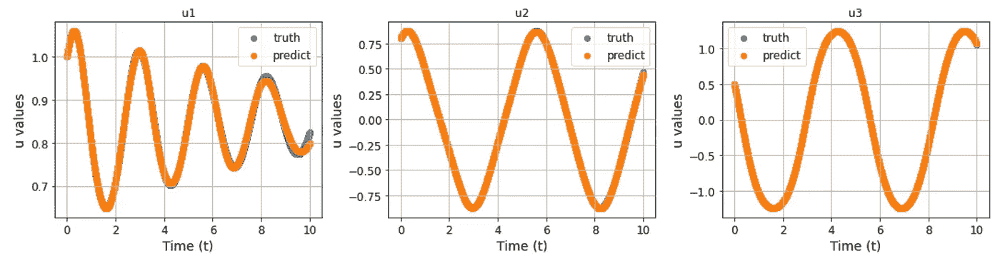

图 8\. 预测的**u**与 ODE 求解器计算的真实值的比较。

然而，训练 PINN 并不是我们的最终目标。相反，我们更感兴趣的是估计我们目标 ODE 中嵌入的未知数。让我们从参数估计开始。下图描绘了 *a* 和 *b* 的演变。

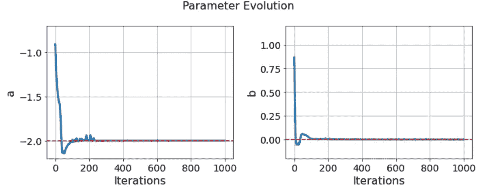

图 9\. 未知参数 a 和 b 迅速脱离了指定的初始值，并收敛到它们的真实值。这表明所采用的 PINN 策略能够对 ODE 系统进行参数估计。（图片由本博客作者提供）

我们可以清楚地看到，随着训练的进行，*a*和*b*的值迅速收敛到各自的真实值。这表明我们的 PINN 策略在参数估计方面是有效的。

除了未知参数外，我们还通过训练好的辅助*f*-网络获得了未知函数*f*₁和*f*₂的估计值。为了检查*f*₁和*f*₂的近似精度，我们可以将它们与计算得到的 d*u*₁/dt 和 d*u*₂/dt 进行比较，如下代码所示：

```py
X_test = np.linspace(0, 10, 1000).reshape(-1, 1)
X_test = tf.convert_to_tensor(X_test, dtype=tf.float32)

with tf.GradientTape() as tape:
    tape.watch(X_test)
    u, f = PINN(X_test)

# Calculate gradients
dudt = tape.batch_jacobian(u, X_test)[:, :, 0]
du1_dt, du2_dt = dudt[:, :1], dudt[:, 1:2]

# Visualize comparison
fig, ax = plt.subplots(1, 2, figsize=(10, 4))

ax[0].scatter(du1_dt.numpy().flatten(), f[:, 0].numpy())
ax[0].set_xlabel('$du_1$/dt', fontsize=14)
ax[0].set_ylabel('$f_1$', fontsize=14)

ax[1].scatter(du2_dt.numpy().flatten(), f[:, 1].numpy())
ax[1].set_xlabel('$du_2$/dt', fontsize=14)
ax[1].set_ylabel('$f_2$', fontsize=14)

for axs in ax:
    axs.tick_params(axis='both', which='major', labelsize=12)
    axs.grid(True)

plt.tight_layout()
```

从下图中我们可以清楚地看到，*f*-网络的预测完全符合控制 ODE，这与之前观察到的 ODE 残差非常小的情况一致。

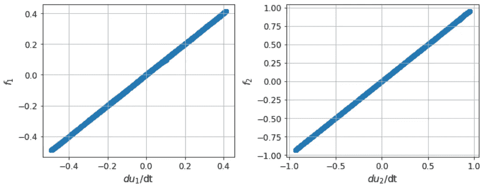

图 10\. 计算出的导数与预测的**f**函数值的比较。

尽管我们可以用*f*-网络准确地逼近未知函数*f*₁和*f*₂，但归根结底，*f*-网络是一个**黑箱**神经网络模型。自然地，我们会想问：这些估计函数的确切功能形式是什么？这个答案可以为我们提供对潜在物理过程的更深入理解，并帮助我们将结果推广到其他类似的问题。

那么，我们如何从训练好的神经网络模型中提取这些精确的功能形式呢？我们将在下一节中探讨这个问题。

# 5\. 符号回归

符号回归是一种强大的监督学习技术，可以用来发现最适合给定数据集的潜在数学公式。正如其名称所示，这项技术包括两个关键组成部分：**符号**和**回归**：

+   *符号*指的是使用符号表达式来建模输入输出关系，例如，“+”表示加法，“-”表示减法，“cos”表示余弦函数等。符号回归方法不是拟合预定义模型（例如，多项式模型等），而是通过整个潜在符号表达式的空间进行搜索，以找到最佳拟合。

+   *回归*指的是创建一个模型以预测输出变量的过程，该过程基于输入变量，从而捕捉它们之间的潜在关系。尽管“回归”一词可能会让人联想到线性回归，但在符号回归的背景下，它并不局限于任何特定的模型形式，而是可以采用各种数学运算符和结构。

在这一部分，我们将实现符号回归技术，将学习到的 *f*-网络提炼成可解释且紧凑的数学表达式，这与张等人在他们的原始论文中提出的策略一致。我们将首先介绍将用于符号回归的库 PySR。随后，我们将应用这个库解决我们的课题，并讨论超参数的选择。最后，我们将分析获得的结果。

## 5.1 PySR 库

[PySR](https://astroautomata.com/PySR/) 是一个开源 Python 库，旨在提供实用的高性能科学符号回归。它使用先进的 *evolutionary* 优化算法在简单解析表达式的空间中搜索，以获得准确且可解释的模型，从而将预测误差和模型复杂度共同最小化。

尽管 PySR 暴露了一个类似于 `scikit-learn` 风格的简单 Python 前端 API，但其后台是用纯 Julia 编写的，库名为 *SymbolicRegression.jl*。这为用户提供了定制操作符和优化损失函数的灵活性，同时享有高计算性能。有关 PySR 工作原理的更多细节，请参见[这篇论文](https://arxiv.org/abs/2305.01582)。

要开始使用 PySR，你需要首先[安装 Julia](https://julialang.org/downloads/)。然后运行

```py
pip3 install -U pysr
```

然后通过

```py
python3 -m pysr install
```

或者在 IPython 中调用

```py
import pysr
pysr.install()
```

PySR 也可以通过 conda 或 docker 安装。请查看[安装页面](https://astroautomata.com/PySR/)以获取更多细节。

## 5.2 实施

接下来，我们应用 PySR 库将学习到的 *f*-网络提炼成可解释且紧凑的数学表达式。首先，我们需要生成符号回归学习的数据集：

```py
t = np.linspace(0, 10, 10000).reshape(-1, 1)
u, f = PINN.predict(t, batch_size=12800)

# Configure dataframe
df = pd.DataFrame({
    't': t.flatten(),
    'u1': u[:, 0],
    'u2': u[:, 1],
    'u3': u[:, 2],
    'f1': f[:, 0],
    'f2': f[:, 1]
})
df.to_csv('f_NN_IO.csv', index=False)
```

请注意，对于我们当前的问题，符号回归学习的输入是 *t*、*u*₁、*u*₂ 和 *u*₃，输出是 *f*₁ 和 *f*₂。这是因为在我们的目标 ODE 中，我们假设 *f*₁=*f*₁(*t*、*u*₁、*u*₂、*u*₃) 和 *f*₂=*f*₂(*t*、*u*₁、*u*₂、*u*₃)。我们保存了生成的数据框（见下图）以备后用。

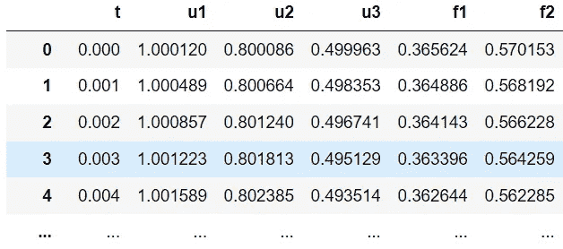

图 11\. 生成的符号回归学习数据框。（图片来源：本博客作者）

生成数据集后，我们就可以使用 PySR 进行符号回归了。请注意，建议在终端中运行 PySR 代码，而不是在 Jupyter Notebook 中。尽管 PySR 支持 Jupyter Notebook，但在终端环境中的打印（例如，搜索进度、当前最佳结果等）效果要更好。

按照 `scikit-learn` 风格，我们首先定义一个模型对象：

```py
from pysr import PySRRegressor

model = PySRRegressor(
    niterations=20,  
    binary_operators=["+", "*"],
    unary_operators=[
        "cos",
        "exp",
        "sin",
        "inv(x) = 1/x",
    ],
    extra_sympy_mappings={"inv": lambda x: 1 / x},
    loss="L1DistLoss()",
    model_selection="score",
    complexity_of_operators={
        "sin": 3, "cos": 3, "exp": 3,
        "inv(x) = 1/x": 3
    }
)
```

以下是指定超参数的详细信息：

+   `niterations`：算法运行的迭代次数。通常，较大的迭代次数会产生更好的结果，但代价是更高的计算成本。然而，由于 PySR 允许提前终止搜索任务，好的做法是将 `niterations` 设置为一个非常大的值并保持优化进行。一旦识别出的方程看起来令人满意，就可以提前停止任务。

+   `binary_operators`：用于搜索的二元运算符字符串列表。PySR 支持的内置二元运算符包括 `+`、`-`、`*`、`/`、`^`、`greater`、`mod`、`logical_or`、`logical_and`。

+   `unary_operators`：用于搜索的一元运算符列表。注意，一元运算符只接受单个标量作为输入。内置的一元运算符包括 `neg`、`square`、`cube`、`exp`、`abs`、`log`、`log10`、`log2`、`log1p`、`sqrt`、`sin`、`cos`、`tan`、`sinh`、`cosh`、`tanh`、`atan`、`asinh`、`acosh`、`atanh_clip`（=atanh((x+1)%2 - 1)）、`erf`、`erfc`、`gamma`、`relu`、`round`、`floor`、`ceil`、`round`、`sign`。注意，要提供自定义运算符，我们需要将“myfunction(x) = …”传递给运算符列表，就像我们用“inv(x) = 1/x”做的那样。

+   `extra_sympy_mappings`：提供自定义的 `binary_operators` 或 `unary_operators` 在 julia 字符串中与 [sympy](https://www.sympy.org/en/index.html) 中相同运算符的映射。这在导出结果时非常有用。

+   `loss`：指定元素级损失函数的 Julia 代码字符串（如在 LossFunctions.jl 中定义）。常用的损失包括 `L1DistLoss()`（绝对距离损失）、`L2DistLoss()`（最小二乘损失）、`HuberLoss()`（用于抗离群值的 Huber 损失函数）。损失函数指定了符号回归搜索的优化目标。

+   `model_selection`：从每个复杂度的最佳表达式列表中选择最终表达式的标准。`score` 意味着候选模型将根据最高得分进行选择，得分定义为 -Δlog(loss)/ΔC，其中 C 代表表达式的复杂度，Δ 表示局部变化。因此，如果一个表达式在稍高的复杂度下具有更好的损失，则更受青睐。

+   `complexity_of_operators`：默认情况下，所有运算符的复杂度为 1。要更改默认复杂度设置并优先考虑不同的运算符，我们可以提供一个字典，键为运算符字符串，值为其对应的复杂度级别。在我们当前的案例中，我们将所有一元运算符的复杂度级别设置为 3，这也在 Zhang 等人的原始论文中采用。

值得一提的是，`PySRRegressor` 提供了许多其他超参数，用于设置算法、数据预处理、停止标准、性能和并行化、监控、环境和结果导出。有关控制符号回归搜索的所有选项的完整列表，请查看 [PySRRegressor 参考页面](https://astroautomata.com/PySR/api/#pysrregressor-parameters)。

## 5.3 识别结果

在指定模型对象后，我们可以用三行代码启动拟合过程（用于提炼 *f*₁ 的解析形式）：

```py
df = pd.read_csv('f_NN_IO.csv')
X = df.iloc[:, :4].to_numpy()
f1 = df.loc[:, 'f1'].to_numpy()

model.fit(X, f1)
```

在脚本运行时，你应该能够看到进度条和当前最佳方程，如下图所示。注意 x0、x1、x2 和 x3 分别对应 *t*、*u*₁、*u*₂ 和 *u*₃。

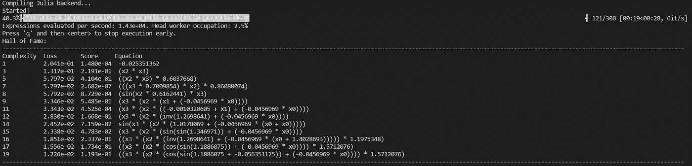

一旦优化任务完成，终端中将出现候选方程列表：

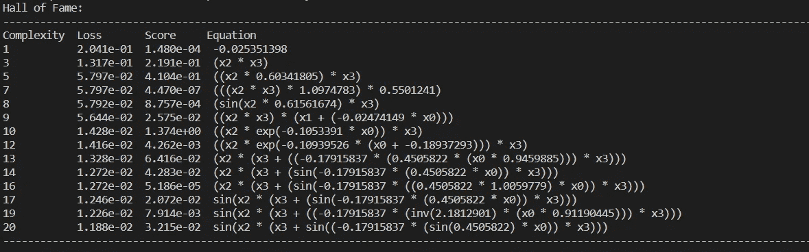

如果我们根据 **评分值** 对方程进行排名，可以看到排名前三的方程是：

+   *u*₂ *u*₃ *exp*( -0.1053391 *t* )

+   0.60341805 *u*₂ *u*₃

+   *u*₂ *u*₃

回忆一下我们真实的 ODE 是

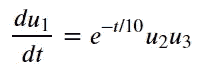

令人印象深刻的是，PySR 准确地识别出了基本输入（即，它识别出 *u*₁ 在 *f*₁ 中不起作用），并发现了一个接近 *f*₁ 真实表达式的解析表达式（排名第一的结果）。

我们对 *f*₂ 进行了相同的分析。优化结果如下图所示：

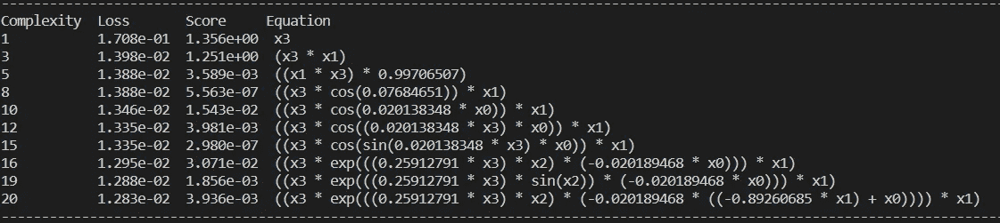

这次，我们注意到 *f*₂ 的真实表达式，即 *f*₂=*u*₁ *u*₃，仅作为第二好的（按评分计算）方程出现。然而，请注意，最佳方程，即 *u*₃，其得分仅比第二好的高一点。另一方面，*u*₁ *u*₃ 的损失值比单独使用 *u*₃ 低一个数量级。这些观察结果表明，在实际操作中，我们需要领域知识/经验来做出明智的决定，以判断追求高准确度所带来的复杂性是否值得。

# 6. 关键要点

在这篇博客文章中，我们探讨了从观测数据中发现微分方程的问题。我们遵循了 Zhang 等人提出的策略，将其实现为代码，并应用于一个案例研究。以下是关键要点：

1️⃣ 物理信息神经网络 (PINN) 是一个多用途的工具，用于进行系统识别，特别是在对控制微分方程只有部分信息已知的情况下。通过同化观察数据和现有的物理知识，PINN 不仅能有效估计未知参数，还能估计未知函数，如果我们采用用辅助神经网络对未知函数进行参数化的技巧，并与主 PINN 一起联合训练。这些因素共同作用，相比传统的系统识别方法，具有显著的优势。

2️⃣ 符号回归是一种强大的工具，用于揭开学习神经网络的黑箱。通过利用先进的进化算法在整个符号表达式空间中进行搜索，符号回归能够提取出可解释且紧凑的解析表达式，这些表达式可以准确描述隐藏的输入输出关系。这个知识蒸馏过程在实践中受到高度赞赏，因为它能有效增强我们对基础系统动态的理解。

在我们结束这篇博客之前，有几点在将 PINN+符号回归应用于实际问题时值得考虑：

## 1️⃣ 不确定性量化 (UQ)

在这篇博客中，我们假设我们观察到的 *u*₁、*u*₂ 和 *u*₃ 数据是无噪声的。然而，这种假设通常不成立，因为实际的动态系统中的观察数据很容易被噪声污染。因此，我们系统识别结果的 *准确性* 和 *可靠性* 都会受到影响。因此，一个关键方面是考虑在我们的系统识别工作流中进行不确定性量化。像贝叶斯神经网络和 [蒙特卡洛模拟](https://medium.com/towards-data-science/how-to-quantify-the-prediction-error-made-by-my-model-db4705910173) 这样的技术可以合理地考虑观察数据中的噪声，并提供对预测的置信区间的估计。

## 2️⃣ 符号回归的敏感性

一般来说，符号回归得到的结果可能对所使用的损失函数、提供的单一和二元运算符候选项以及定义的运算符复杂度敏感。例如，在我尝试重现 Zhang 等人发布的结果时，尽管我采用了完全相同的设置（据我所知），但我未能获得与原始论文中所示的 *f*₂ 完全一致的前 3 个方程。这种不匹配可能有几个因素：首先，进化优化技术本质上是随机的，因此结果可能在不同的运行中有所不同。其次，第一阶段训练的 PINN 可能不同，因此生成的数据集（即 *t*，*u*₁，*u*₂，*u*₃ → *f*₁，*f*₂）也不同，从而影响了符号回归的结果。

总的来说，这些观察结果表明，符号回归的结果不应盲目接受。相反，依赖领域知识/理解来批判性地评估识别出的方程的合理性至关重要。

如果你觉得我的内容有用，可以在[这里](https://www.buymeacoffee.com/Shuaiguo09f)请我喝咖啡🤗 非常感谢你的支持！

> 你可以在[这里](https://github.com/ShuaiGuo16/PINN_symbolic_regression)找到带有完整代码的伴随笔记本和脚本*💻*。
> 
> 要学习物理信息神经网络的最佳实践，请参阅：[解开物理信息神经网络设计模式的奥秘](https://medium.com/towards-data-science/unraveling-the-design-pattern-of-physics-informed-neural-networks-series-01-8190df459527)。
> 
> 要了解更多关于物理信息运算符学习的内容，请参阅：通过物理信息深度运算符学习。
> 
> 随时可以订阅我的[新闻通讯](https://shuaiguo.medium.com/subscribe)或在[Medium](https://shuaiguo.medium.com/)上关注我。

# 参考资料

[1] Zhang 等，结合 PINN 与符号回归发现阿尔茨海默病的反应扩散模型。arXiv，2023。

[2] Cranmer 等，使用 PySR 和 SymbolicRegression.jl 进行可解释的机器学习科学研究。arXiv，2023。
