# 发现最大流-最小割定理：一种全面而正式的方法

> 原文：[`towardsdatascience.com/discovering-the-maxflow-mincut-theorem-a-comprehensive-and-formal-approach-e2402ce935c7?source=collection_archive---------11-----------------------#2023-08-24`](https://towardsdatascience.com/discovering-the-maxflow-mincut-theorem-a-comprehensive-and-formal-approach-e2402ce935c7?source=collection_archive---------11-----------------------#2023-08-24)

## 探索流网络领域和**最大流-最小割定理**

 [Daniel García Solla](https://cardstdani.medium.com/?source=post_page-----e2402ce935c7--------------------------------)

·

[关注](https://medium.com/m/signin?actionUrl=https%3A%2F%2Fmedium.com%2F_%2Fsubscribe%2Fuser%2Fc63705819b32&operation=register&redirect=https%3A%2F%2Ftowardsdatascience.com%2Fdiscovering-the-maxflow-mincut-theorem-a-comprehensive-and-formal-approach-e2402ce935c7&user=Daniel+Garc%C3%ADa+Solla&userId=c63705819b32&source=post_page-c63705819b32----e2402ce935c7---------------------post_header-----------) 发表在 [Towards Data Science](https://towardsdatascience.com/?source=post_page-----e2402ce935c7--------------------------------) ·22 分钟阅读·2023 年 8 月 24 日

--

图片由 [israel palacio](https://unsplash.com/@othentikisra?utm_source=medium&utm_medium=referral) 提供，来源于 [Unsplash](https://unsplash.com/?utm_source=medium&utm_medium=referral)

## 引言

在网络流优化领域，Maxflow Mincut 定理作为一个显著的数学里程碑脱颖而出。它的优雅之处在于解决关于流体或资源在由节点和边互联的网络中流动的复杂优化问题。它的应用涵盖了从交通网络到通信基础设施的广泛系统，在这些系统中，高效的流动管理至关重要。通过理解这个定理及其数学表达背后的基本概念，你可以解开最大化资源利用和在各种实际场景中达到最佳性能的谜团。

在本文中，我们旨在简化并使定理对所有读者易于接近。我们将引导你了解其历史发展，概述其从早期公式化的根源，这将使我们能够欣赏到为这一定理及其整个数学研究领域铺平道路的杰出思想者的贡献。此外，我们将深入探讨 Maxflow Mincut 定理的实际应用。从设计高效的交通系统到处理图像处理任务，其多样性似乎无穷无尽。通过探索其实际影响，你将见证定理在各种领域和行业中的深远影响。

最终，目标是为你提供一个既简洁又正式的全面解释。不需要高级数学的先验知识，虽然一些图论和离散数学*(逻辑和集合论)*的知识会有很大帮助；你只需要一颗好奇的心和解开这个杰出定理实用性的愿望。

# 历史

Maxflow Mincut 定理首次由 Ford 和 Fulkerson 在 1956 年的开创性论文“*[***Maximal flow through a network***](http://www.cs.yale.edu/homes/lans/readings/routing/ford-max_flow-1956.pdf)*”中提出，并与其他相关数学家，如 ***Claude Shannon***，即信息论的发展者合作。该定理指出，网络中的最大流量等于一个割的最小容量，其中割是将网络节点分成两个不相交的集合，其容量是穿过割的所有边的容量之和。从那时起，这一定理成为流网络理论的基石。

然而，这个定理的引入伴随着其他关键的科学贡献，例如 [***Edmonds–Karp***](https://en.wikipedia.org/wiki/Edmonds%E2%80%93Karp_algorithm)、 [***Ford–Fulkerson***](https://en.wikipedia.org/wiki/Ford%E2%80%93Fulkerson_algorithm) 或 [***Dinic’s***](https://en.wikipedia.org/wiki/Dinic%27s_algorithm) 算法，这些算法都用于寻找可以通过源和汇之间的网络传递的最大流量。同样，通过最大流最小割定理，这个值与将汇与源分开的最小割相匹配。此外，我们可以利用算法的内部计算来识别构成最小割的边集，正如我们将进一步探讨的那样。

# 流网络

因此，为了简化后续定理的解释，我们首先将了解图论中流网络的基本原理和不可错过的概念。

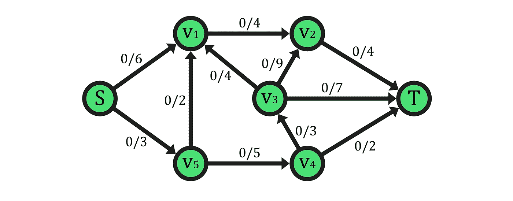

示例流网络（*作者提供的图像*）

如上例所示，流网络是一个加权的、有向的多重图，用于表示一个网络结构的对象或系统，其中一定量的资源，以所谓的“流量”来衡量，需要从一个或多个点 ***“源”（表示为 S 节点）*** 传输或移动到一个或多个其他节点，称为 ***“汇”*** ***(T 节点)***。尽管这个特定示例没有显示多重图的特性，因为两个节点之间只有一条边。

为了实现这样的模板表示，流网络的每条边都有权重。在这种情况下，加权边建模了多个资源*(流量)*交换点之间的物理/逻辑连接，其中实际的正值权重代表其 ***容量（最大流量支持）***。如上所示，容量标记在每条边标签的右侧，以及通过的当前流量，这里为 0。

除了每条边的容量外，定义资源每单位时间穿越每条边的速率的关键指标是 ***流量***。你可以把它想象成道路上的交通或管道中的水量。因此，由源节点或 ***超源*** 节点生成（如果所有网络的源节点连接到主源流量生成器），并传递到汇节点或 ***超汇***（如果汇节点上有类似构造），我们可以将流量定义为一个函数 ***f:E→R*** ，它接受属于图边集 ***E*** 的边 ***(u,v)*** 并输出其当前流量 ***f(u,v)***，这是一个实际的正值。

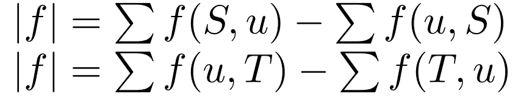

作者提供的图像

因此，如果我们计算流网络中所有对应的源***S***或汇***T***的上述表达式，我们可以得到通过图的总流量。

为了保证流量符合网络的约束，它必须满足两个基本属性：

1.  ***容量约束***：通过任何边的流量不能超过其容量。正式地，如果边的容量表示为“**c(u, v)**”，而通过该边的流量为“**f(u, v)**”，那么它必须满足条件**0 ≤ f(u, v) ≤ c(u, v)**，适用于网络中的所有边**(u, v)**。简单来说，我们不能通过一条边推动超过其容量所设定的流量。

1.  ***流量守恒***：在每个节点*（不包括源节点和汇节点）*，进入节点的总流量必须等于流出的总流量。

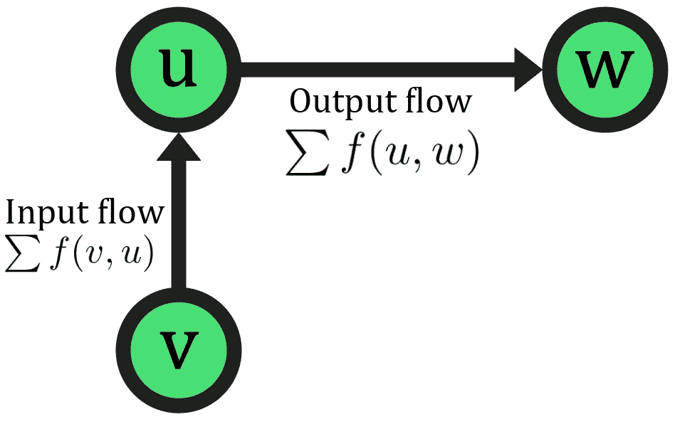

*作者图片*

这确保了流量持续流动，不会在网络内积累或消散，尽管你可以在系统需要时允许流量积累。在数学上，对于每个节点“***u***”及其邻接节点，由超节点“***v*** 和 ***w***”表示和聚类，流量守恒属性表示为：

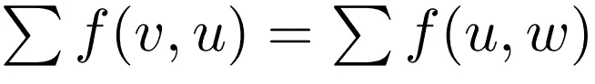

*流量守恒属性（作者图片）*

最后，请注意流量可以相互抵消，因为如果流量***f1(u,v)*** 和 ***f2(v,u)*** 在两个节点***u***和***v***之间共存，那么减少***f1(u,v)*** 相当于增加***f2(v,u)***，因为它们具有相反的方向。

## 剩余网络和增广路径

在这里，我们将引入两个新的、更复杂的概念，这些概念在使用之前提到的算法找到最大流量时将非常有帮助。

这些中的第一个是边的容量和在给定时间的流量之间的差异，称为剩余容量，并表示为：

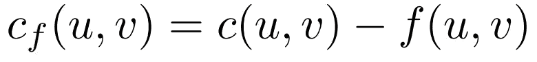

*作者图片*

牢记这个属性，我们可以定义一种特殊类型的流网络，称为***剩余网络***，它与标准网络的唯一区别在于其边的重新定义容量。剩余网络具有上述定义的函数***cf***，该函数将边的集合及其相应的容量和流量映射到相应的剩余容量。

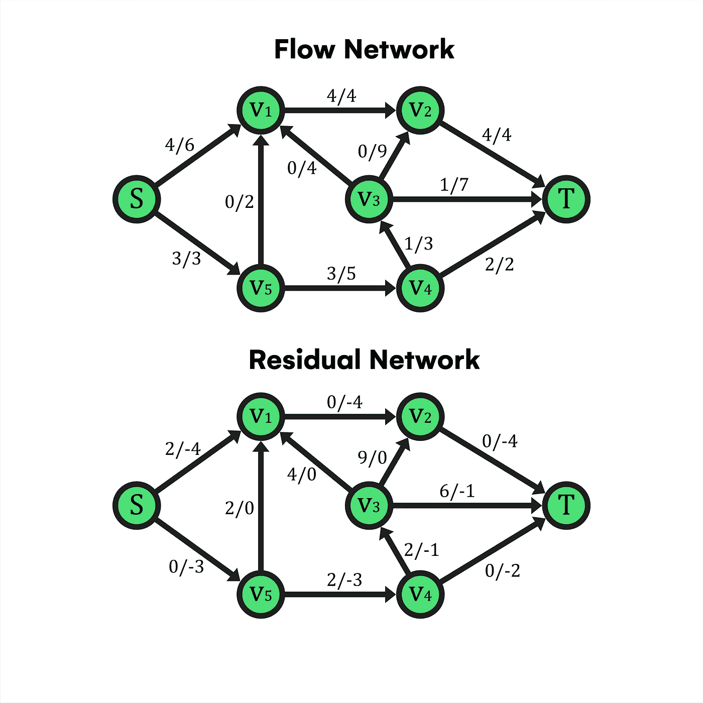

流量-剩余网络示例（*作者图片*）

在这个示例中，你有一个网络，其中上图中所有边都有特定的流量函数。因此，剩余网络是下图，其边标签包含可以根据相应边的方向发送的剩余容量，以及在撤销流量增广操作时可以交付的反向流量的数量（*记住流量抵消属性，这在网络具有某些对称性时可能有用*）。

在这里，通过网络实现的流量可以用之前看到的源或汇公式计算，在这种情况下，是***4+3***个单位从***S***发出，或***4+1+2***个单位到达***T***。然而，如果我们考虑边*(v5, v1)*的反向方向*(或双向)*，有可能沿着路径***S-V1-V5-V4-V3-T***发送 2 个更多的流量单位，这将增加总流量，并成为给定网络中最大的可用流量。随后，在得出残余网络后，可能在一个或多个连接源与汇的路径中，所有边的残余容量都大于 0。换句话说，有路径可以从源传输流量到汇，在有多个源或汇的情况下。

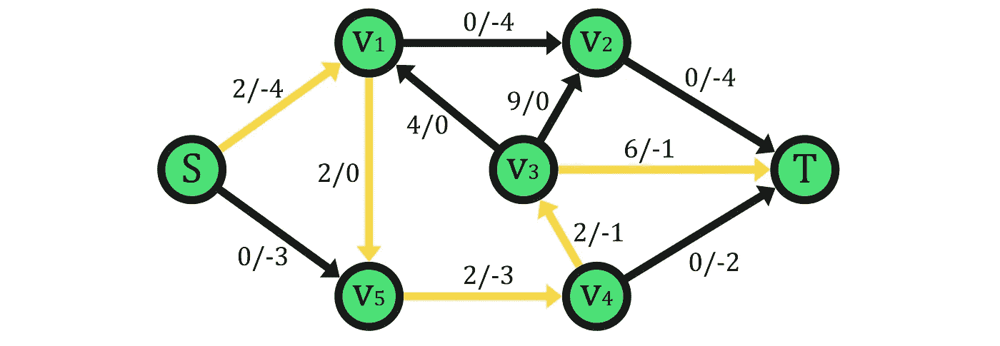

增广路径示意图 (*作者提供的图片*)

在这个背景下，这些路径是解决流量最大化或成本最小化问题的算法的基础，被称为***增广路径***。要理解为什么，在上面的网络中，我们可以看到建立的流量导致了一个增广路径的存在，其中 2 个单位的流量可以从***S***传输到***T***。因此，网络上的实际流量函数并未提供通过它的最大可运输流量，这也是我们稍后将讨论的最大流最小割定理面临的问题之一。

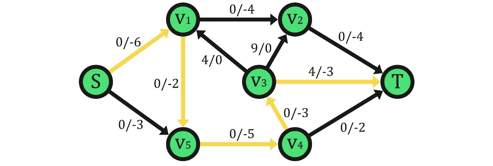

*作者提供的图片*

因此，如果我们增加通过显示路径的流量，我们将能够确保最终的流量达到最大值 9 个单位，因为不会有其他路径来增加网络流量。最后，在引入定理之前，重要的是要记住，要找到网络的最大流量，诸如***Ford-Fulkerson***这样的算法使用一种直观的过程，[***贪心算法***](https://en.wikipedia.org/wiki/Greedy_algorithm)从一个完全没有流量的残余网络开始，并通过这些路径来增加流量，*(通过残余边或相反方向的流量的帮助)*。因此，一旦没有更多的路径可以发现来增加流量，就可以确保流量达到了最大值，即由于一些边的容量不足或网络中甚至没有边，从***S***到***T***没有更快的方法来移动资源。

另一种思考这种过程的方法是考虑每次迭代中增加的流量。对于任意的增广路径，你可以增加的最大流量由最小剩余容量的边决定，因为它构成了从***S***流出的瓶颈。由于它能够限制沿增广路径的所有潜在流量，这种***瓶颈边***在需要最大化流量的情况下至关重要。

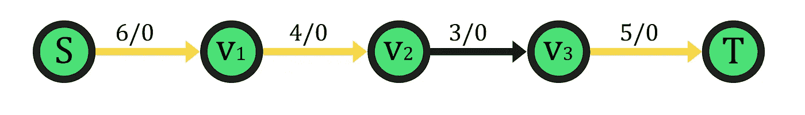

瓶颈边 (*作者图片*)

例如，考虑上面简单的流网络*(剩余的)*，只有一条增广路径可用，我们可以清楚地识别出边***(v2, v3),*** 的瓶颈组件，它将整个路径*(以及在这个情况下的网络)*的最大流量设置为 3。按照路径的建议将流量增加 3 个单位后，没有增广路径可以进一步增加流量，因此最大流量被认为已达到。然而，验证结果流量的另一种方法是关注网络中的瓶颈；如果每条 S 和 T 之间的路径都有一个为零的瓶颈值，即其最大剩余容量为 0，这等同于没有增广路径，则不能再添加更多流量，当前流量将被认为是最大流量。

为了解决瓶颈问题；我们应该强调，最大流量也可以表示为所有增广路径瓶颈的总和，这些瓶颈用于通过类似于 Ford-Fulkerson 的算法找到最大流量，因为每条路径的流量增加量由其对应的瓶颈决定。

## 流网络切割

我们将讨论的流网络基础的最后一部分是***切割***，它是最大流最小割定理的一个基本组成部分，并且是理解前面章节的一个关键概念，比如瓶颈与流网络分区之间的关系。

首先，我们从它的定义开始；一个切割是将网络节点分成两个集合，其中源节点 S 在集合***A***中，汇节点 T 在另一个与之不相交的集合***B***中。

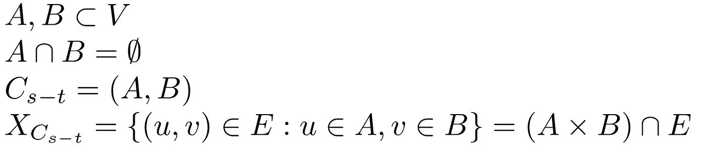

*作者图片*

集合***A***和***B***都不能是空的，因为它们必须分别包含源节点和汇节点。因此，如果网络是连通的，则会有边在 A 和 B 之间双向连接这些节点。此外，这些边包含在另一个名为***切割集***的集合中，但只有那些起点在 A 中的节点并且终点在 B 中的边被考虑，即能在正确方向上运输流量的边。

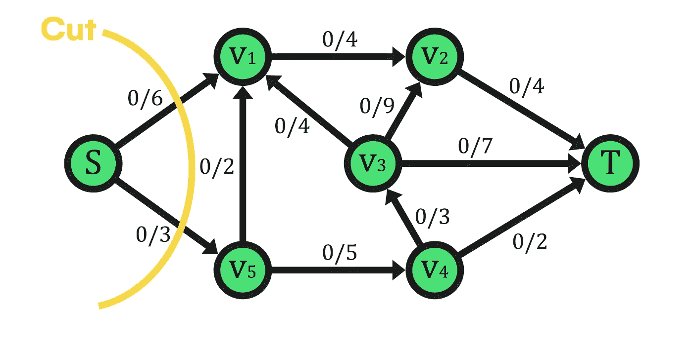

*作者图片*

例如，上面可以看到我们可以应用于图的最简单的切割， resulting in a partition of the vertex set V as the union of the sets ***A={S}*** and ***B={V1,V2,V3,V4,V5,T}***。由于唯一的网络源保持在一个集合中隔离，我们可以更准确地理解切割的概念及其后续属性。通常，切割被表示为一条线，旨在包围两个集合中的一个 A 或 B，不分区别。此外，分界线穿越了多个属于***cut-set***的边，这些边用于确定切割的流量和容量，它们在建立网络的任意切割和流量之间的关系时是至关重要的。这对于证明本文中提出的定理至关重要。

一方面，通过任何给定切割的流量定义为所有承载 A 到 B 方向的流量的边的总和，减去从 B 到 A 方向的边的流量。

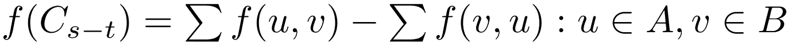

*图片来自作者*

然而，流量在这种情况下并没有显著的价值，因为它受到切割容量的限制。因此，我们也可以以类似的方式定义切割的容量，区别在于这里只考虑上述公式的第一项，即能从 S 到 T 传递流量的边的容量，而不需要减去其他边的值。

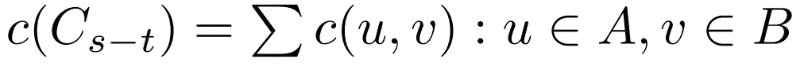

*图片来自作者*

一旦我们正式介绍了流量和切割容量的概念，就有必要考虑一些示例，以尽可能简化这些概念并理解它们在这一领域的原理。

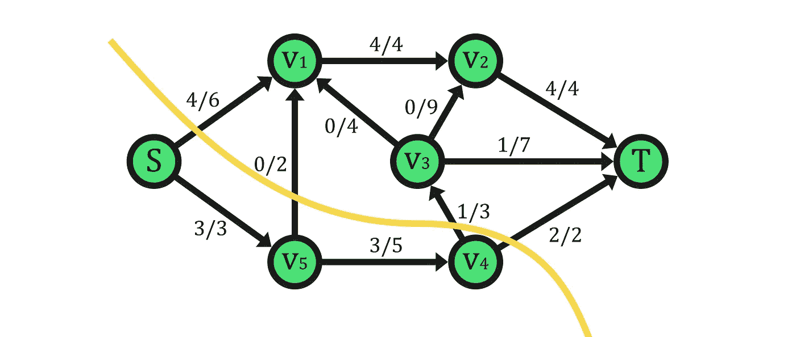

*图片来自作者*

首先，让我们检查每个集合的顶点，留下***A={S,V5,V4}***和***B={V1,V2,V3,T}***。由于网络已经分配了流量，因此切割流量不会为零，将由连接集合 A 到 B 的边上的流量总和决定。

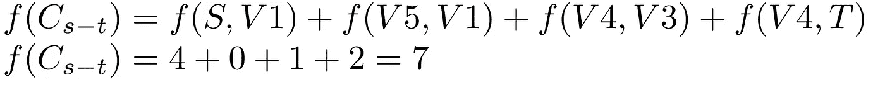

*图片来自作者*

此外，它的容量来自相同的边及其各自的容量，构成了可能通过切割的最大流量。

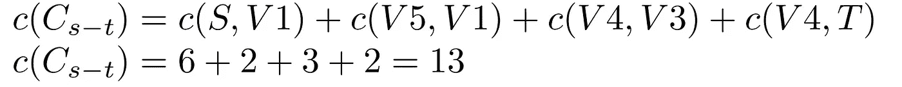

*图片来自作者*

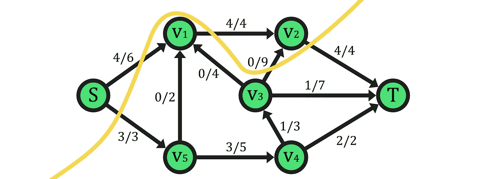

**(A={S,V2}, B={V1,V5,V3,V4,T})**切割 (*图片来自作者*)

在这个有趣的最后示例切割中，我们可以观察到切割不一定是一个分裂，其中两个集合的顶点组成了连接的组件，也就是说，只要满足切割的基本约束，每个集合可以包含任何节点。

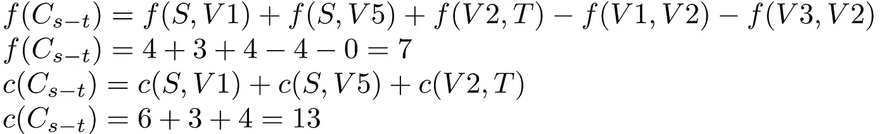

*图片来自作者*

此外，这个例子特别有助于理解切割与流量之间的关系，为解决定理提供了坚实的基础。首先，请注意根据切割定义，结果网络*(切割后)*在 s-t 方面是断开的。这意味着这样的切割的容量是从源头汇总到汇点的所有边的总和。在隔离单一流源的最基本情况下，切割的容量将超过或等于网络的最大流量。然而，在之前的示例中，可以看到通过插入更多具有外发边的节点，切割的容量不可避免地增加，因为有更多的边而不是严格所需的以达到最大流量，即源头的边决定了在瓶颈情况下随后的网络流量。

# 定理陈述

我们在解决流网络优化问题时的主要目标是确定从源头到汇点的最大可达流量。这必须在遵守容量限制、流量守恒的前提下完成，并确保达到的流量实际上是最大值。因此，我们在处理定理时的步骤将是用一个可以大致类似于流量的上界来限制该值，从而确认其正确性。

首先，需要强调的是，这样的上界实际上是一个切割，满足具有最小容量的特性。作为定理的主要引理，它可能并不完全清楚，所以让我们引入并证明两个更简单的概念；

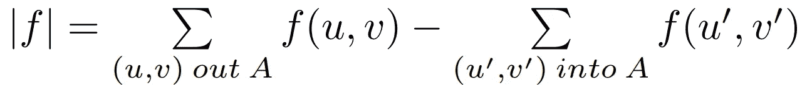

*作者图片*

第一个步骤涉及证明任何给定的切割处的流量与整个网络流量之间的上述等式，这反过来又与源生成的流量相匹配。为此，我们可以假设初始命题为真，同时对任何切割的集合 A 应用归纳法，其中 A={S}作为基本情况，然后使用前面提到的流量守恒原则，针对不同于 S 或 T 的节点。但由于这会比较复杂，我们将选择一种更简单但非常相似的方法。

> 请注意，在证明过程中，之前的流量值可以是任何允许的值。

1- ***流量定义：*** 在初始步骤中，我们从网络中任何给定流函数***f***的总流量值开始，并定义其可能的定义之一。在这里，以源节点 S 为参考，即任何网络切割的最小可能集合，我们将流量值与由 S 生成的流量相匹配，减去流入 S 的流量，因为有时可能会有一定量的流量返回到 S。

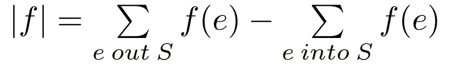

*作者图片*

2- ***流量守恒属性:*** 在考虑网络流量为源点 S 产生的总流量后，我们应用流量守恒原理，即除了 s-t 外，所有节点必须传播它们接收到的所有流量，从而使流量 ***|f|*** 通过减去流出流量与流入流量的差值来贡献为零。现在，如果我们考虑任何切割 ***(A,B)***，节点 ***v*** 在集合 ***A*** 中除产生流量的节点 ***{S}*** 外，总流量将为零，满足我们之前的等式。

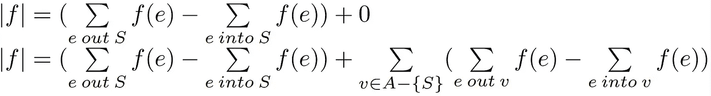

*图片由作者提供*

3- ***流量通过切割:*** 最后，我们得到一个表达式，其中在第二项中将集合 A 中除 S 外的所有节点的流出流量相加，并将 S 自身的流出流量在第一项中，减去所有之前节点的对应流入部分。这对应于前面提到的切割流量定义，因此我们可以得出结论，网络中的所有现有流量必然与任何给定切割的流量匹配。

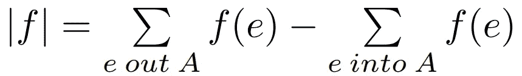

*图片由作者提供*

我们将证明的关于最大流最小割定理的第二个命题包括一个不等式，该不等式为网络中任何流量的值提供了一个上界，限制为任何给定切割的容量值。

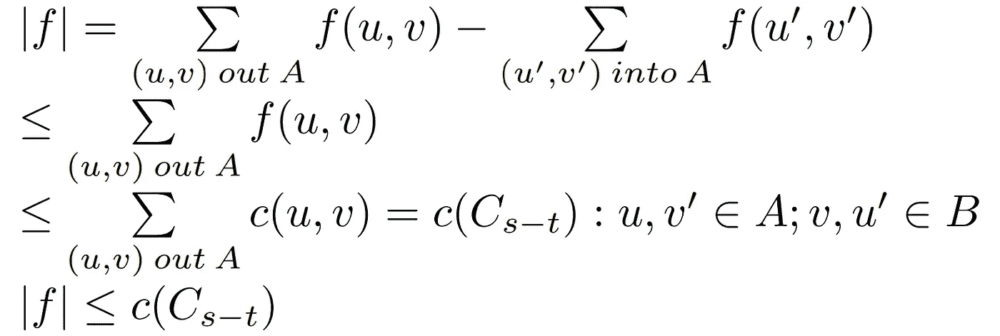

*图片由作者提供*

1- ***替代流量定义:*** 利用关于任何切割的流量的先前结果，我们可以将任意流量 ***|f|*** 等同于通过任意切割 ***(A,B)*** 的流量。

2/3- ***流量边界:*** 在第二步中，我们建立了一个不包含模拟集合 ***A*** 中流入流量的第二项的不等式，只保留从 A 到 B 的边的流出流量。移除这样的项后，结果将始终大于或等于之前的结果，因为如果没有边从 B 返回到 A，则剩余边从 A 到 B 的流量总和不会减少。

然后，我们可以通过设置从 A 流出的边的流量小于或等于这些边的容量来简单地增加不等式的值。这一不等式的有效性由所有网络边上出现的容量约束所给出。

4- [***弱对偶性***](https://en.wikipedia.org/wiki/Weak_duality)***:*** 在将集合 A 的所有流出边的容量总和与由于其定义的切割容量匹配后，可以得出结论，对于网络中的任何给定流量和切割，流量将始终小于或等于切割容量，这也成为我们即将证明的定理的起点。此外，如果我们试图最大化流量，我们将达到一个点，这可以通过最小化切割容量来满足，建立了一种弱对偶关系，其中没有确定性保证最小容量切割总是等于最大流量。

在此阶段，在达成最大流最小割定理之前的弱对偶性之后，我们可以提供一个更易于理解和验证的声明。

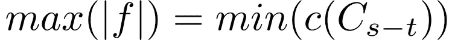

*作者提供的图像*

如前所述，该定理通过 [***强对偶性***](https://en.wikipedia.org/wiki/Strong_duality) 得以成立，即任何网络中的最大流量与可达的最小容量割匹配。与前述的弱对偶结果不同，该定理确保流量的 **最大化** 对偶与任何割容量的 **最小化** 完全相等，消除了两者结果之间存在差异的可能性，并且在引理上提供了强对偶条件。

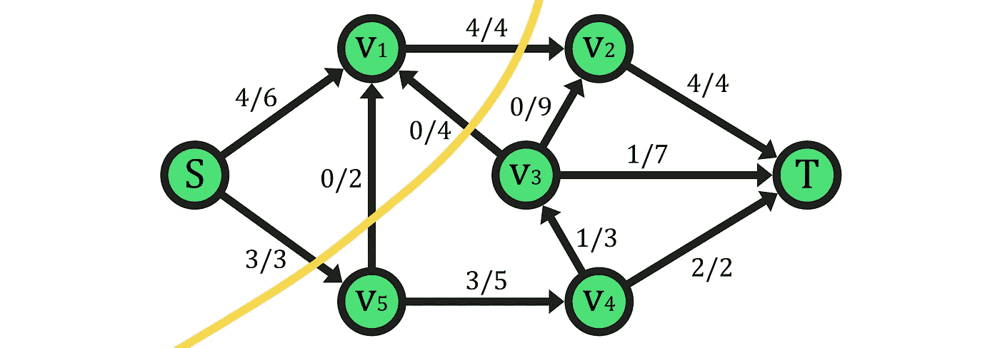

**(A={S,V1}, B={V2,V5,V3,V4,T})** 割 (*作者提供的图像*)

在进行演示之前，我们应该强调定理的一个使用案例。在这里，最大流的值为 7，等于每个外流割边的容量之和。请注意，这些边承载了最大容量的流量，在像所示的最小容量割中，这些边成为瓶颈，即割集本身作为全球网络流的瓶颈。为了简化对这个想法的解释，您可以在下面找到一个资源以帮助您理解：

[## 什么是最大流最小割定理的直观解释？](https://math.stackexchange.com/questions/161837/whats-an-intuitive-explanation-of-the-max-flow-min-cut-theorem?source=post_page-----e2402ce935c7--------------------------------)

### 我即将阅读最大流最小割定理的证明，该定理有助于解决最大网络流问题。可以…

[math.stackexchange.com](https://math.stackexchange.com/questions/161837/whats-an-intuitive-explanation-of-the-max-flow-min-cut-theorem?source=post_page-----e2402ce935c7--------------------------------)

# 证明

如果我们想证明最大网络流在所有情况下等于网络中的最小容量割，我们将使用 3 个必须等价的命题，以确保定理的正确性。

> 存在一个割 ***(A, B)*** 满足 ***|f|= cap(A, B)***。
> 
> 流量值 ***|f|*** 是最大值。
> 
> 流网络中不存在增广路径。

为了显示所有陈述是等价的，我们将演示逻辑推导 1⇒2⇒3⇒1。意思是我们可以从任何陈述推导出其他任何陈述。在 1⇒2 的情况下，可以使用之前展示的弱对偶性轻松验证。然后，考虑到任何流量都小于最小容量割，如果我们假设存在一个等于任意割容量的流（1），弱对偶性告诉我们，这个容量是任何给定流量的上界，因此结果流量与该上界相符，是最大流量（2）。

进行 2⇒3 的验证，最简单的方法是取对立命题 ¬3⇒¬2。然后，举例一个任意流 |f|，如果存在一个可以输送流量的增广路径 s-t ¬(3)，则可以通过相应路径增加 |f|，这意味着 |f| 原本不是最大流量 ¬(2)。

最具挑战性的步骤是 3⇒1。首先，我们假设网络中没有增广路径的流 |f|。此外，我们定义一个集合 ***A***，包含在残余网络中从 ***S*** 可达的所有顶点。也就是说，***A*** 包含所有在残余网络中存在从 ***S*** 到达路径的顶点，同时该路径的所有残余边都不为零。通过这些定义，我们可以确定 ***S*** 在 ***A*** 中，因为它是自我可达的，而由于没有增广路径，***T*** 在残余网络中从 ***S*** 无法到达，因此我们知道至少有一个节点 *(T)* 不在集合 ***A*** 中。然后，如果我们将 ***T*** 插入到一个不同的集合 ***B*** 中，那么 ***(A, B)*** 这一对满足作为网络中有效割集的所有标准。

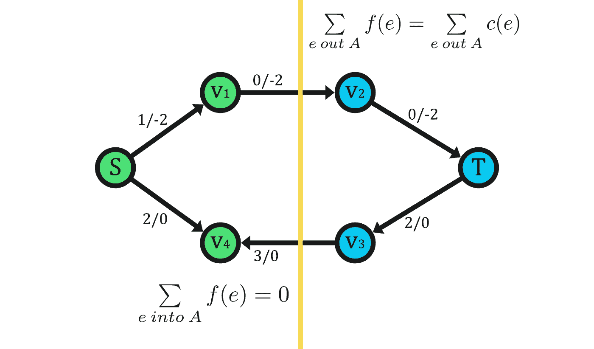

示例 **(A={S,V1,V4}, B={T,V2,V3})** 割 (*图片由作者提供*)

在这一点上，我们必须意识到关于割 ***(A, B)*** 的两件事。一方面，***S-T*** 方向上的割流必须等于其容量。因为根据之前的定义和假设（3），它们不相等的唯一可能性在于 ***B*** 的节点的可达性，因此如果它们中的任何一个从 ***S*** 在残余网络中可达，导致割边的流量未达到其最大容量，则该节点必须在 ***A*** 中而不是 ***B*** 中，这就产生了矛盾。另一方面，割的另一个方向的流量因同样的原因为零，即如果它不是零，那么在残余网络中就会有一条 ***A-B*** 方向的边 *(残余边流量以负号表示)* 到达 ***B*** 节点，造成矛盾。

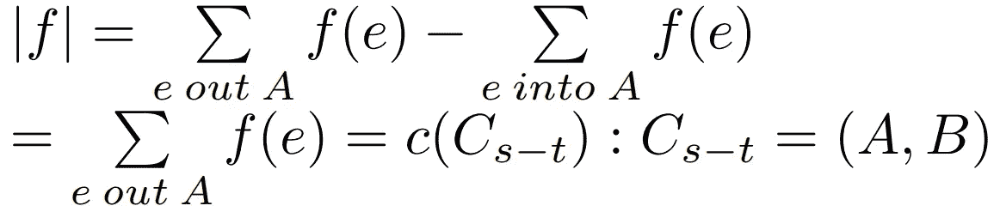

*图片由作者提供*

最后，剩下的唯一任务是将网络流与之前演示的割流匹配，去掉流量中的割流项（因为它为零），并使用割容量定义来得出流 ***|f|*** 等于得到的割容量（3⇒1）。

# 应用

最大流最小割定理在各个领域有着广泛的应用。然而，为了简洁起见，我们将简要提及一些关键方面，并提供更多详细资源，以帮助你正确理解这些应用。

## Ford-Fulkerson/Edmonds–Karp 算法

作为第一个后果，定理提供的发现和结果，加上其他定理如整性定理，导出了并支持了一系列旨在计算最大流的算法的正确性证明。

其中最重要的，也是我们已经讨论过的，是[***Ford Fulkerson’s***](https://en.wikipedia.org/wiki/Ford%E2%80%93Fulkerson_algorithm)算法，这是一种贪婪方法，通过寻找 s-t 增广路径来增加流量。然而，算法的最基本版本在某些特定输入下（*例如处理实际或无理数及其表示*）没有终止或收敛到最大流的保证，这影响了它的时间复杂度，时间复杂度为***O(|E| |f|)***，这意味着在最坏的情况下，算法需要遍历网络中所有边缘，以达到最大流中的每个*(至少一个)*流量单位。

然后，为了改进之前的版本，即最早创建的解决此类问题的版本，改进了计算增广路径的方法。这样，虽然***Ford-Fulkerson***版本使用深度优先搜索（DFS），计算随机路径到 T，而改进后的***Edmonds-Karp***变体使用广度优先搜索（BFS）算法来找到增广路径。因此，旨在每次迭代中选择边数最少的增广路径，这个算法相较于之前的版本具有终止保证，并且时间复杂度改变为***O(V E²)***。

然而，使用这些及类似的算法，不仅可以计算网络中的最大流，还可以计算其容量等于值的最小割。过程非常简单；在计算网络中所有边的最大流之后，根据最大流最小割定理，从 S 出发可以访问的节点在相应的剩余网络中形成我们寻找的割的集合 A，剩余的节点形成 B，从而得到结果最小容量割***(A, B)***。

最后，需要指出的是，最大流算法的研究领域远大于此处所展示的内容。因此，如果你希望继续学习，[***这里***](https://youtube.com/playlist?list=PLDV1Zeh2NRsDj3NzHbbFIC58etjZhiGcG)有一个资源详细介绍了这些算法及其实现。

## 实际应用案例

我们生活中几乎所有的系统都有可能被建模为流网络（*至少部分*），这使它们成为解决复杂可扩展性问题的重要工具。由于可能性很广，这里仅提及一些与基本概念直接相关的应用。

最初，所有的交通系统，从道路网络和公共交通系统到航空路线和货物分配，都可以表示为流网络。因此，我们可以分析交通模式、优化路线，并提高整体效率。这在城市规划中尤为重要，因为管理人员、车辆和货物的流动对于防止拥堵和确保顺畅运营至关重要。此外，并非所有这些用例都是完全有益的；例如，流网络也可以模拟一个国家的铁路系统，在军事冲突中可能成为攻击的目标，这些攻击应尽可能具备战略最优化。你可以在[***这个***](https://youtu.be/8QO487YsLPc)资源中了解更多关于这一特定应用的信息。

尽管在电信、能源分配甚至医疗保健中有其他超越的实现，我们将重点关注一个与计算机科学更密切相关的领域，特别是计算机视觉，该领域已取得了显著突破。在图像处理领域，流网络的主要应用依赖于[***图像分割***](https://www.researchgate.net/figure/Using-the-max-flow-min-cut-approach-for-image-segmentation-a-Define-set-of-pixels-in_fig5_292335453)算法，该算法负责将图像划分为对应于对象、主题或特定区域的区域，这些区域可能无法通过肉眼区分。在这种情况下，流网络通过将像素之间的关系建模为网络而展示其优势，其中边表示邻近像素之间相似性/差异性的可能值流动。此外，还值得提及在类似范围内的应用，如[***机器学习模型***](https://en.wikipedia.org/wiki/Flow-based_generative_model)，其中流的概念用于优化特定的学习、生成或分类任务。

## 结论

本文涵盖了流网络数学领域的一小部分，并证明和简化了其中一个基本定理。然而，由于这是一个具有广泛应用的主题，特别是在世界消费、交通和人口管理系统中，因此继续扩展理论并深入了解这些应用是有益的。为此，观察定理更高级形式化以及逐步理解本文提到的算法和学习有关流网络某些应用的新概念的最有效资源是以下内容：

> [`www.cs.upc.edu/~mjserna/docencia/grauA/P20/MaxFlow-fib.pdf`](https://www.cs.upc.edu/~mjserna/docencia/grauA/P20/MaxFlow-fib.pdf)
> 
> [`ocw.tudelft.nl/wp-content/uploads/Algoritmiek_Introduction_to_Network_Flow.pdf`](https://ocw.tudelft.nl/wp-content/uploads/Algoritmiek_Introduction_to_Network_Flow.pdf)
