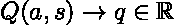
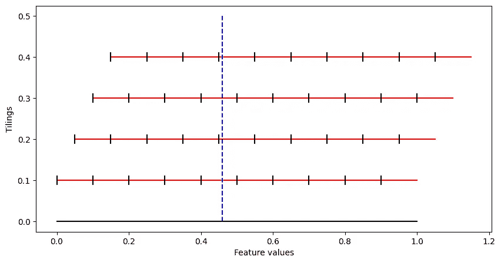
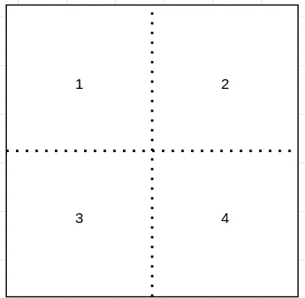
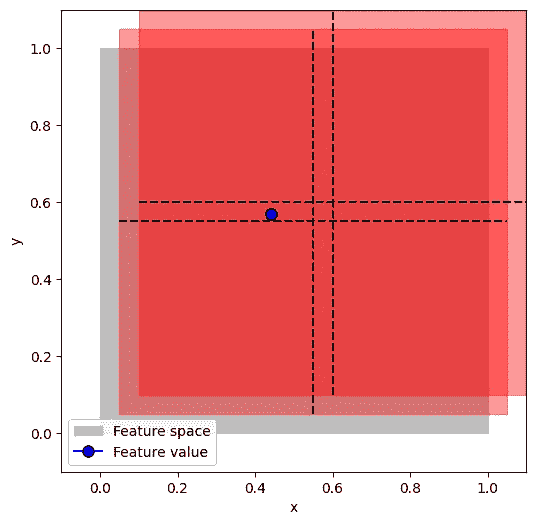

# 在强化学习中离散化连续特征

> 原文：[`towardsdatascience.com/discretizing-the-continues-features-in-reinforcement-learning-b69b388215ea`](https://towardsdatascience.com/discretizing-the-continues-features-in-reinforcement-learning-b69b388215ea)

## 如何使用平铺编码和 Python 将无限变量转换为离散空间

[](https://eligijus-bujokas.medium.com/?source=post_page-----b69b388215ea--------------------------------)[](https://towardsdatascience.com/?source=post_page-----b69b388215ea--------------------------------) [Eligijus Bujokas](https://eligijus-bujokas.medium.com/?source=post_page-----b69b388215ea--------------------------------)

·发表于 [Towards Data Science](https://towardsdatascience.com/?source=post_page-----b69b388215ea--------------------------------) ·阅读时间 6 分钟·2023 年 3 月 13 日

--


图片由 [Ehud Neuhaus](https://unsplash.com/@paramir?utm_source=medium&utm_medium=referral) 提供，来源于 [Unsplash](https://unsplash.com/?utm_source=medium&utm_medium=referral)

本文是强化学习系列的延续。要回顾，请访问以下文章：

[](/first-steps-in-the-world-of-reinforcement-learning-using-python-b843b76538e3?source=post_page-----b69b388215ea--------------------------------) ## Python 中强化学习的第一步

### Python 的原始实现，展示如何在强化学习的基本世界之一中找到最佳位置…

towardsdatascience.com [](/temporal-differences-with-python-first-sample-based-reinforcement-learning-algorithm-54c11745a0ee?source=post_page-----b69b388215ea--------------------------------) ## 使用 Python 的时间差 — 第一个基于样本的强化学习算法

### 使用 Python 编码并理解 TD(0) 算法

towardsdatascience.com [](/the-values-of-actions-in-reinforcement-learning-using-q-learning-cb4b03be5c81?source=post_page-----b69b388215ea--------------------------------) ## 使用 Q-learning 的强化学习中行动的价值

### 从零开始在 Python 中实现 Q-learning 算法

towardsdatascience.com

关于 Q 学习的最后一篇文章探讨了将数字分配给状态动作对的概念：



Q 值函数

使用的状态是可以列出并写入表格的状态。例如，我们对代理可能处于的迷宫中的所有可用位置进行了索引。即使在一个巨大的迷宫（想象一个百万乘百万的网格）中，我们仍然可以为每个状态分配一个唯一的索引，并在填写 Q 表时直接使用这些状态。

实践中，我们的代理所处的状态通常不能被唯一索引并适配到表格中。例如，假设状态是轮子的角度，该角度可以精确地旋转一次，并且可以取**[-360, 360]**度范围内的任何值。轮子可以精确地转到**12.155…、152.1568…**等度数。我们不能索引所有独特的度数并创建一个表——可能性是无限的。

然而，我们仍然希望使用强化学习（RL）提供的所有算法。因此，第一步是从具有无限可能性的特征中创建一个离散特征空间。

离散化连续特征空间的流行技术之一是所谓的**瓷砖编码**算法。

瓷砖编码的定义如下¹：

> 瓷砖编码是一种通过将状态空间划分为若干重叠区域（称为瓷砖），然后通过状态所落入的瓷砖集合来表示连续状态空间的方法。

我们可以用以下代码和图表示一个简单的 1 特征离散化：

```py
# Creating an example 1D feature that goes from 0 to 1
x = np.linspace(0, 1, 100)

# Defining the number of tilings 
n_tilings = 4

# Defining the offset 
offset = 0.05

# Defining the number of tiles in a tiling 
n_tiles = 10

# Creating a list of tilings
tilings = []
cur_tiling = 0
for i in range(n_tilings):
    # Creating a tiling by adding the offset to the feature
    tiling = x + cur_tiling * offset

    # Appending the tiling to the list
    tilings.append(tiling)

    # Incrementing the tiling
    cur_tiling += 1

# Ploting the x feature and the tilings 
# The x feature is plotted a horizontal line 
# The tilings are plotted as horizontal lines, each moved up by 0.1
vertical_offset = 0.1

plt.figure(figsize=(10, 5))
plt.plot(x, np.zeros_like(x), color='black')
for i, tiling in enumerate(tilings):
    plt.plot(tiling, np.zeros_like(x) + vertical_offset + vertical_offset * i, color='red')

    # Adding vertical ticks on the tiling lines
    for j in range(n_tiles):
        plt.plot(
            [j / n_tiles + offset * i, j / n_tiles + offset * i], 
            [vertical_offset + vertical_offset * i - 0.01, vertical_offset + vertical_offset * i + 0.01], 
            color='black'
            )

plt.xlabel('Feature values')
plt.ylabel('Tilings')

# Drawing a vertical line at x = 0.46
plt.plot([0.46, 0.46], [0, vertical_offset * n_tilings + 0.1], color='blue', linestyle='dashed')
plt.show()
```



x=0.46 的瓷砖编码实际操作；图由作者提供

为了理解瓷砖编码，我们需要完美地理解上述图中的内容。

最底部的水平线是特征**x**，它可以在[0, 1]范围内取得任何值。

每条红线是用于离散化特征**x**的***瓷砖***。

每个瓷砖被划分为**瓷砖**，这些瓷砖间隔均匀。

蓝色虚线是从 x 范围中取出的随机值。问题是，我们如何使用 4 个瓷砖和 8 个瓷砖来从 x 特征值创建一个离散状态？

算法如下：

给定来自连续 x 特征的**值 s**：

对于每个瓷砖：

+   初始化一个大小等于瓷砖数量的向量。将其填充为 0。

+   计算**s 值**落在哪个瓷砖中。保存该索引**i**。

+   用值 1 填充向量坐标**i**。

最后，将所有向量堆叠成一个向量。

让我们计算图中展示的示例。对于第一个瓷砖，在特征空间 x 的正上方，蓝色值落在第 5 个瓷砖空间中。因此，第一个瓷砖的特征向量是：

**[0, 0, 0, 0, 1, 0, 0, 0]**

对于第二个瓷砖，我们重复相同的过程，并得到如下向量：

**[0, 0, 0, 0, 1, 0, 0, 0]**

第三和第四个瓷砖向量：

**[0, 0, 0, 1, 0, 0, 0, 0]**

**[0, 0, 0, 1, 0, 0, 0, 0]**

表示蓝色虚线“状态”的最终离散向量是

[**0, 0, 0, 0, 1, 0, 0, 0, 0, 0, 0, 0, 1, 0, 0, 0, 0, 0, 0, 1, 0, 0, 0, 0, 0, 0, 0, 1, 0, 0, 0, 0**]

让我们再做一个例子，x 值为 0.44，以完全理解这个过程。


x=0.44；作者图表

每个平铺向量（从底部开始）：

**[0, 0, 0, 0, 1, 0, 0, 0]**

**[0, 0, 0, 1, 0, 0, 0, 0]**

**[0, 0, 0, 1, 0, 0, 0, 0]**

**[0, 0, 1, 0, 0, 0, 0, 0]**

最终状态向量：

[**0, 0, 0, 0, 1, 0, 0, 0, 0, 0, 0, 1, 0, 0, 0, 0, 0, 0, 0, 1, 0, 0, 0, 0, 0, 0, 1, 0, 0, 0, 0, 0**]

最终状态向量的长度为 **N 平铺 * N 瓦片**。

将向量分配给由 2 个特征表示的状态的过程遵循一个非常类似的算法。现在的平铺不再是水平线，而是矩形。

让我们假设我们的状态由连续的 x 和 y 变量组成，每个变量的范围从 0 到 1。

我们将用 2 个平铺将整个特征空间划分，每个平铺包含 4 个瓦片：


二维连续空间；作者图表

上图中的灰色区域表示原始特征空间。每个红色平铺被划分为 4 个瓦片。我们想为蓝点（0.44，0.44）创建一个表示状态的向量。

算法与 1D 情况相同，但现在我们为点分配索引，按从左到右的顺序，从左上角开始：



索引平铺；作者图表

因此，对于第一个和第二个平铺，蓝点将落入第 3 个平铺，结果状态向量如下：

**[0, 0, 1, 0]**

**[0, 0, 1, 0]**

最终向量将是：

**[0, 0, 1, 0, 0, 0, 1, 0]**

取另一个点：



另一个二维点；作者图表

向量将是：

**[1, 0, 0, 0]**

**[0, 0, 1, 0]**

最终向量为：

**[0, 0, 1, 0, 0, 0, 1, 0]**

创建表示 3D 及以上维度状态的向量的直觉与上述示例相同。

在 Python 中可以找到一个强大的实现：

[## RLAI 打开网页](http://incompleteideas.net/tiles/tiles3.html?source=post_page-----b69b388215ea--------------------------------)

### RLAI 打开网页在这里我们描述了实现平铺编码核心部分的软件，如...

[incompleteideas.net](http://incompleteideas.net/tiles/tiles3.html?source=post_page-----b69b388215ea--------------------------------)

在本文中，我展示了如何从连续特征空间到有限向量以表示状态，使用平铺编码。在本 RL 系列的下一篇文章中，我将使用这种编码为每个状态分配动作值。

快乐学习，敬请关注！

[1]

**作者：** *理查德·萨顿*

**网址:** [`www.incompleteideas.net/book/8/node6.html#:~:text=Tile%20coding%20is%20a%20form,exhaustive%20partitions%20of%20input%20space`](http://www.incompleteideas.net/book/8/node6.html#:~:text=Tile%20coding%20is%20a%20form,exhaustive%20partitions%20of%20input%20space)。
