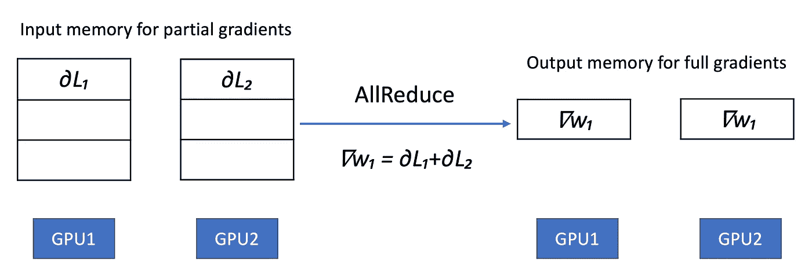

# PyTorch 中的分布式数据并行和分布式模型并行

> 原文：[`towardsdatascience.com/distributed-data-and-model-parallel-in-deep-learning-6dbb8d9c3540`](https://towardsdatascience.com/distributed-data-and-model-parallel-in-deep-learning-6dbb8d9c3540)

## 了解分布式数据并行和分布式模型并行如何在随机梯度下降中工作，以便让你可以在庞大的数据集上训练巨型模型

 [魏轶](https://jasonweiyi.medium.com/?source=post_page-----6dbb8d9c3540--------------------------------)

·发表于 [Towards Data Science](https://towardsdatascience.com/?source=post_page-----6dbb8d9c3540--------------------------------) ·阅读时长 14 分钟·2023 年 5 月 8 日

--

由 [Olga Zhushman](https://unsplash.com/ja/@ori_photostory?utm_source=medium&utm_medium=referral) 在 [Unsplash](https://unsplash.com/?utm_source=medium&utm_medium=referral) 拍摄的照片

你一定听说过，最近成功的模型，如 ChatGPT，拥有数万亿个参数，并且使用了数 TB 的数据进行训练。同时，你也可能经历过你的深度学习模型，即使只有几千万个参数，也无法在一个 GPU 上完成训练，并且用几 GB 的数据训练了好几天。

如果你想知道为什么其他人在同样的时间内能取得如此多的成就，并且希望成为他们，请理解这两种技术，它们使得在庞大的数据集上训练大型深度学习模型成为可能：

+   **分布式数据并行** 将一个小批量数据分割到多个 GPU 上。这使得训练速度更快。

+   **分布式模型并行** 将模型的参数、梯度和优化器的内部状态分割到多个 GPU 上。这使得你可以在 GPU 上加载更大的模型。

有许多分布式数据并行和分布式模型并行的 API 实现，如[DDP](https://pytorch.org/tutorials/intermediate/ddp_tutorial.html)、[FSDP](https://pytorch.org/docs/stable/fsdp.html)和[DeepSpeed](https://github.com/microsoft/DeepSpeed)。它们都有一个共同的主题，即将训练数据或模型拆分成多个部分，并将这些部分分配到不同的 GPU 上。本文不是关于如何使用这些 API，因为教程已经很丰富。本文是对这些 API 如何在幕后工作的直观理论探讨。之所以称之为“探讨”，是因为本文并没有完成这两个庞大的主题——它在你获得足够的背景知识和勇气去深入了解它们或面对技术面试时就会停止。

## 随机梯度下降中的并行性

了解分布式数据和模型并行的工作原理实际上意味着了解它们在执行深度神经网络的参数学习（或等同于模型训练）的随机梯度下降算法中的工作方式。具体来说，我们需要了解这两种技术如何在以下方面工作：

+   前向传播计算模型预测和数据点或样本的损失函数。

+   反向传播阶段，或称为反向传递，计算损失函数相对于每个模型参数的梯度。

让我们从较简单的分布式数据并行开始。

# 分布式数据并行

它通过并行化随机梯度下降遍历训练数据的方式来解决巨大的训练数据集问题。让我们回顾一下单个 GPU 中随机梯度下降的过程。

## 随机梯度下降的步骤

1.  训练过程将整个模型加载到该 GPU 中。

1.  然后该过程会多次遍历整个训练数据集，每次遍历称为一个时期（epoch）。

1.  在每个时期，该过程会通过随机采样的小批量遍历训练数据集中的所有样本。一个小批量由若干数据点组成。这种随机采样是不放回的，确保每个数据点在一个时期内仅存在于一个小批量中一次。小批量的随机采样解释了算法名称中的“随机”一词。每个数据点在前向传播和反向传播中都会被使用。

1.  在前向传播中，该过程将每个数据点通过神经网络推送以计算模型的输出，即预测，然后使用模型的预测来通过计算预测与实际之间的差异来计算损失函数。

1.  在反向传播中，该过程计算损失相对于每个模型参数的梯度，即神经网络中的权重和偏置。

1.  然后，该过程使用当前模型参数及其梯度的值，通过权重更新规则分配模型参数的新值。如果一个参数的当前值是*w*，其梯度是*∇w*，学习率是*α*，那么权重更新规则将计算新的参数值*w′*，即*w′ ← w - α·∇w*。

1.  重复步骤 3 到 6，直到模型训练得足够好，例如，直到损失不再减少一段时间，或者直到你耗尽资金或耐心为止。

## 分布式数据并行将一个小批量分配到多个 GPU 上

分布式数据并行在上述训练过程的第 4 步和第 5 步中做出了改进。它将一个小批量分成不同的部分，并将这些部分发送到不同的 GPU 上进行前向和反向传播。这样，相同的小批量可以更快地处理。

要理解这究竟意味着什么，我们假设我们的一个小批量仅包含两个数据点。也就是说，我们的批量大小是 2。这个小批量中的两个数据点是*(X₁, Y₁)*和*(X₂, Y₂)*。对于第一个数据点，前向传播使用*X₁*来计算模型的预测值*ŷ₁*，第二个数据点也是如此，计算*ŷ₂*。

我们有两个 GPU，分别命名为 GPU1 和 GPU2。

**分布式模型并行中的前向传播**

如果我们采用通常的二次损失函数，那么前向传播最终计算损失*L*的值：

分布式数据并行中的损失计算

注意在第(3)行中，两个术语*L₁*和*L₂*只依赖于单个但不同的数据点。因此，损失项*L₁*的计算与*L₂*的计算是独立的。这允许分布式数据并行将第一个数据点*(X₁, Y₁)*发送到 GPU1，将第二个数据点*(X₂, Y₂)*发送到 GPU2，以进行损失计算。

当然，为了使上述工作，每个 GPU 必须加载完整模型，以便它可以通过整个网络推送单个数据点来计算模型的预测，然后计算该数据点的损失。

## 分布式模型并行中的反向传播

现在让我们看看反向传播，它计算损失函数对每个模型参数的梯度。我们将关注一个单一的模型参数，比如*w₁*。损失*L*对*w₁*的梯度，记作*∇w₁*，通过*：*

分布式数据并行中的梯度计算

使用[微分的线性性](https://en.wikipedia.org/wiki/Linearity_of_differentiation)，第(3)行将完整梯度分成两个术语，每个术语对应一个单独的数据点。由于我们有两个 GPU，每个 GPU 加载了完整模型并接收了一个数据点，该 GPU 可以计算该数据点的梯度。换句话说，第(3)行的两个梯度项可以使用两个 GPU 并行计算。也就是说，GPU1 计算并保存*∂L₁*，GPU2 计算*∂L₂*。

## 同步的参数权重更新

最后，随机梯度下降通过使用权重更新规则来执行参数值更新：

梯度下降权重更新规则

该规则通过从当前参数值 *w₁* 中减去 *α·∇w₁* 来给出新值 *w₁′*，因此有了“梯度下降”这个术语。*α* 是学习率；它控制下降的步长。这里我使用符号 *w₁* 来表示参数名称及其当前值，以避免引入过多的符号。

所有 GPU 都需要使用相同的 *∇w₁* 来执行 *w₁* 的权重更新，以确保每个 GPU 在权重更新步骤后具有相同的模型。

在这里我们应该发现一个问题：权重更新规则需要模型参数*w₁*的完整梯度 *∇w₁*，但没有 GPU 拥有这个量。GPU1 持有量 *∂L₁*，因为它在其中计算 *∂L₁*；而 GPU2 持有 *∂L₂*。为了解决这个问题，一些 GPU 之间的计算会将 *∂L₁* 和 *∂L₂* 相加，然后将和转移到两个 GPU 上。[AllReduce](https://docs.nvidia.com/deeplearning/nccl/user-guide/docs/usage/operations.html#allreduce) GPU 操作符完成了这个工作。

## AllReduce 操作符

[AllReduce 操作符](https://docs.nvidia.com/deeplearning/nccl/user-guide/docs/usage/operations.html#allreduce) 对数据执行降维操作，例如求和、最大值，跨所有 GPU 并将结果写入所有 GPU。

下图说明了 AllReduce 如何将两个 GPU 上模型参数 *w₁* 的部分梯度 *∂L₁* 和 *∂L₂* 相加，并将结果 —— 完整梯度 *∇w₁* 写入所有 GPU。

由作者绘制的 AllReduce 操作符插图

## 为什么分布式并行可以减少训练时间？

数据在 GPU 之间的传输需要时间，但只要数据传输的时间少于计算所有数据点的损失和梯度的时间，就能在花费更多钱雇用更多 GPU 的代价下获得时间上的收益。

如果你很富有，你可以雇用 10,000 个 GPU，并将你的 mini-batch 大小设置为 10,000。这样在一个优化步骤中，你可以处理大量的训练数据。我将让你的想象力在这里放飞，思考一下这对你那几 TB 大小的数据集意味着什么。

## 分布式数据并行中的警告

分布式数据并行有一个问题——它要求每个 GPU 持有完整的模型。你不能在单个 GPU 中加载大型模型，通常 GPU 的内存为 16GB 到 24GB，因此它们大致支持一亿个参数。要训练比这更大的模型，我们需要分布式模型并行。

# 分布式模型并行

分布式模型并行将模型的参数、它们的梯度和优化器的内部状态分割成不同的部分，并将这些部分分布到 GPU 上。

很容易理解为什么分布式模型并行需要拆分模型的参数及其梯度——随机梯度下降中的权重更新规则需要这两者。但是，优化器的内部状态是什么呢？

**优化器的内部状态**

你看，为了减轻随机梯度下降算法中引入的问题，像 Adam 这样的优化器会跟踪每个模型参数的两个额外信息：其梯度的移动平均，以减少权重更新中的波动，以及平方梯度的移动平均，以实现每个参数的自适应学习率。有关更多详细信息，请查看：

## 我们可以在线性回归模型上使用随机梯度下降（SGD）吗？

### 了解为什么在参数学习中使用 SGD 在线性回归模型上是有效的，但请注意，SGD 可能会...

我们可以在线性回归模型上使用随机梯度下降（SGD）吗？

从数学上讲，Adam 对参数 *w₁* 的权重更新规则是：

Adam 优化器的权重更新规则

行（1）计算了 *w₁* 参数的梯度移动平均。*multiplier × old_value + (1-multiplier) × new_value* 公式结构告诉我们这是一个指数移动平均。*m₁* 是当前的指数移动平均值，*β₁* 控制了新值（这里是新的梯度 *∇w₁*）对新移动平均值的贡献量。*m₁′* 是梯度移动平均的新值。

同样，行（2）计算了平方梯度的指数移动平均，其中 *v₁* 是平方梯度的当前移动平均值，*β₂* 控制了在平均过程中平方梯度 *(∇w₁)²* 的贡献量。*v₁′* 是平方梯度移动平均的新值。

行（3）是参数权重更新规则。注意它提到了参数 *w₁* 的当前值，梯度移动平均 *m₁′* 和平方梯度移动平均 *v₁′*。再次查看 *我们可以在线性回归模型上使用随机梯度下降（SGD）吗？* 以获取直观理解。

梯度移动平均和平方梯度移动平均是 Adam 优化器的内部状态，实际上，Adam 还保留了权重的完整副本，但这是技术细节，在本文中你不需要担心。不同的优化器可能会保持不同的内部状态。

## 如何将模型拆分为多个部分？

为了理解分布式模型并行如何将模型分成多个部分，假设即使小批量大小设置为 1，我们的神经网络也太大，无法适配到 GPU 的内存中，如下图所示的神经网络：

作者提供的神经网络架构示意图

这个神经网络接受两个输入单元。因此，对于单个训练数据点 *(X₁, Y₁)*，其中 *X₁* 由两个输入单元 *X₁ = [x₁, x₂]* 组成，网络接受 *x₁* 和 *x₂* 作为输入，并使用两个隐藏层，四个神经元 *h₁* 到 *h*₄ 来计算模型的预测 *ŷ₁*，并使用实际的 *Y₁* 和模型预测 *ŷ₁* 来计算损失 *L*。为了简化起见，神经网络中没有激活函数，每个接收多个输入箭头的节点将接收到的数量相加。

我们如何将模型分成多个部分，以便每个部分都可以适配到一个 GPU 上？有许多方法。一种方法是垂直切分模型：

作者提出的模型不够智能的切分方法

其中 *w₁~w₄* 在 GPU1 中，*w₅~w₁₀* 在 GPU2 中。注意输入 *(X₁, Y₁)* 始终在所有 GPU 中。

这种切分方法虽然有效，但并不智能，因为它迫使计算必须顺序进行。GPU2 需要等待 GPU1 的结果。具体来说，GPU2 需要等待神经元 *h₁* 和 *h*₂ 的值，然后才能开始计算 *h₃* 和 *h₄* 的值。

我们认识到，为了实现并行计算，需要水平切分模型。我将使用一个更简单的例子来说明这种水平切分，以简化公式。

作者提供的神经网络架构示意图

## 分布式模型并行中的前向传播

以下方程描述了该神经网络的前向传播：

神经网络前向传播方程

我们可以看到方程 (1) 和 (2) 彼此独立，因此可以并行计算。方程 (3) 和 (4) 需要 *h₁* 和 *h*₂ 的值，因此需要等待 *h₁* 和 *h*₂ 的计算结果。

等效地，我可以将上述方程 (1) 到 (3) 重新写成以下块矩阵形式：

块矩阵形式的神经网络前向传播方程

块 *A₁* 和 *A*₂ 为

权重矩阵的块矩阵

我们现在意识到可以将 *X₁A₁* 放在 GPU1 中，而 *X₁A₂* 放在 GPU2 中以并行计算。换句话说，分布式模型并行可以将参数 *w₁* 和 *w₂* 放在 GPU1 中，将 *w₃* 和 *w₄* 放在 GPU2 中。

AllReduce 操作符将对它们求和，得到模型预测 *ŷ₁* 的值，并使 *ŷ₁* 对两个 GPU 可用。得到 *ŷ₁* 后，两个 GPU 现在可以计算损失 *L*。请注意，在前向传递中，训练数据 (*X₁, Y₁*) 始终在所有 GPU 中加载。或者，AllReduce 操作符可以计算模型预测和损失，然后通过一种叫做操作融合的技术将预测和损失一次性复制到所有 GPU。

## 分布式模型并行中的反向传递

现在让我们检查反向传递。它使用链式法则计算梯度。在你现在的数据科学工作之前，你已经熟悉链式法则了，对吗？

分布式模型并行中的梯度计算

方程 (1) 和 (2) 在 GPU1 上执行，方程 (3) 和 (4) 在 GPU2 上执行。

我们需要检查 GPU1 中是否有足够的信息来计算模型参数 *w₁* 和 *w₂* 的梯度，以及 GPU2 中是否有足够的信息来计算模型参数 *w₃* 和 *w₄*。

让我们通过查看方程 (1) 专注于 *w₁*。它揭示了计算梯度 *∇w₁* 需要：

+   训练数据 x*₁, Y₁*，始终对所有 GPU 可用。

+   模型预测 *ŷ₁*，通过 AllReduce 将其提供给所有 GPU。

所以 GPU1 能够计算 *w₁* 的梯度。由于 GPU1 拥有模型权重 *w₁* 及其梯度 *∇w₁*，它将能够计算梯度的指数移动平均和平方梯度的指数移动平均，这些都是优化器的内部状态。

这就是分布式模型并行在高层次上的工作原理。请注意，有许多方法可以将模型分割成多个部分。上面展示了一种方式来说明该技术的工作原理。

## ReduceScatter 操作符

我还想在分布式模型并行中提到一件事。在一个更实际的神经网络中，从模型预测到其输入有多个路径。请参见我之前介绍的原始神经网络，再次如下所示：

作者的神经网络架构插图

计算模型参数 *w₁* 对 *L* 的梯度，有两个路径：

+   route1: *L → ŷ₁ → h₃ → h₁ → x₁*

+   route2: *L → ŷ₁ → h*₄ *→ h₁ → x₁*

因此，完整的梯度是这两个路径中计算的梯度之和，公式为：

两条路径的梯度

梯度从 route1 和 route2 很可能在两个不同的 GPU 上计算。为了计算完整的梯度 *∇w₁*，需要将这些 GPU 的信息同步，并进行求和，类似于 AllReduce。不同之处在于，此时求和结果不需要传播到所有 GPU，只需放入负责更新模型参数 *w₁* 的单个 GPU。ReduceScatter 操作符就是为了这个目的。

## ReduceScatter

[ReduceScatter](https://docs.nvidia.com/deeplearning/nccl/user-guide/docs/usage/operations.html#reducescatter) 操作符执行与 AllReduce 操作符相同的操作，只不过结果在 GPU 之间以相等的块进行分散，每个 GPU 根据其排名索引获取一部分数据。

作者提供的 ReduceScatter 操作符示意图

以我们的例子为例，ReduceScatter 操作符对 *w₁* 参数的部分梯度进行求和，即来自 route1 的 *∂route₁* 和来自 route2 的 *∂route₂*，这些梯度在不同的 GPU 上计算，然后将总和放入唯一负责 *w₁* 参数权重更新的 GPU 中，这里是 GPU1*。请注意，GPU2 并未收到完整的梯度 *∇w₁*，因为它不负责对 *w₁* 参数进行权重更新。

## 分布式模型并行并不是为了提高训练速度而设计的

请注意，分布式模型并行的目标是让你将更大的模型加载到多个 GPU 中，而不是加速模型训练。事实上，从上面的例子来看，我们将模型横向切分后，在每个 GPU 上，前向和后向计算的传递并没有缩短，只是变得更薄。这意味着每次传递的步骤数相同，因此它们不一定更快（但由于每次传递的计算量较少，它们可以更快，当然，你还需要考虑数据同步所花费的时间）。要更快地训练大型模型，我们需要结合分布式数据和模型并行。

# 结合分布式数据和模型并行

在训练过程中同时启用分布式数据并行和分布式模型并行是一种常见做法。上面提到的 API，如 PyTorch 的 FSDP，支持这种组合。从概念上讲：

+   分布式模型并行在内层工作，它将一个大型模型分配给一组 GPU。这组 GPU 至少可以处理来自一个小批数据的单个数据点。它们表现得像一个具有无限内存的超级 GPU。这样，你可以加载更大的模型。

+   分布式模型并行在外层工作，它将来自同一小批数据的不同数据点分配到由分布式模型并行模拟的不同超级 GPU 上。这样，你可以更快地训练大型模型。

# 结论

本文从理论层面解释了在随机梯度下降算法的背景下，分布式数据并行和分布式模型并行的工作原理。有关 API 使用的详细信息，请参考上述其他文档，如 [DDP](https://pytorch.org/tutorials/intermediate/ddp_tutorial.html)、[FSDP](https://pytorch.org/docs/stable/fsdp.html) 和 [DeepSpeed](https://github.com/microsoft/DeepSpeed)。

## 支持我

如果你喜欢我的故事，请考虑成为我的推荐会员。我将从你的订阅费用中获得一小部分，这对我有很大支持。

 [## 使用我的推荐链接加入 Medium - 韦毅

### 阅读韦毅（以及在 Medium 上的其他成千上万位作者）的每一个故事。我很享受花费数千小时写作的过程……

medium.com](https://medium.com/@jasonweiyi/membership?source=post_page-----6dbb8d9c3540--------------------------------)
