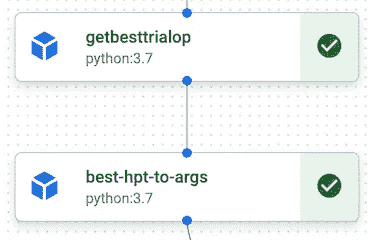

# Vertex AI 流水线中的分布式超参数调优

> 原文：[`towardsdatascience.com/distributed-hyperparameter-tuning-in-vertex-ai-pipeline-2f3278a1eb64?source=collection_archive---------11-----------------------#2023-03-29`](https://towardsdatascience.com/distributed-hyperparameter-tuning-in-vertex-ai-pipeline-2f3278a1eb64?source=collection_archive---------11-----------------------#2023-03-29)

## 启用 GCP Vertex AI 流水线中的分布式超参数调优路径

[](https://medium.com/@hangyu_5199?source=post_page-----2f3278a1eb64--------------------------------)[](https://towardsdatascience.com/?source=post_page-----2f3278a1eb64--------------------------------) [Hang Yu](https://medium.com/@hangyu_5199?source=post_page-----2f3278a1eb64--------------------------------)

·

[关注](https://medium.com/m/signin?actionUrl=https%3A%2F%2Fmedium.com%2F_%2Fsubscribe%2Fuser%2F2665192d75e3&operation=register&redirect=https%3A%2F%2Ftowardsdatascience.com%2Fdistributed-hyperparameter-tuning-in-vertex-ai-pipeline-2f3278a1eb64&user=Hang+Yu&userId=2665192d75e3&source=post_page-2665192d75e3----2f3278a1eb64---------------------post_header-----------) 发表在 [Towards Data Science](https://towardsdatascience.com/?source=post_page-----2f3278a1eb64--------------------------------) ·10 min read·2023 年 3 月 29 日[](https://medium.com/m/signin?actionUrl=https%3A%2F%2Fmedium.com%2F_%2Fvote%2Ftowards-data-science%2F2f3278a1eb64&operation=register&redirect=https%3A%2F%2Ftowardsdatascience.com%2Fdistributed-hyperparameter-tuning-in-vertex-ai-pipeline-2f3278a1eb64&user=Hang+Yu&userId=2665192d75e3&source=-----2f3278a1eb64---------------------clap_footer-----------)

--

[](https://medium.com/m/signin?actionUrl=https%3A%2F%2Fmedium.com%2F_%2Fbookmark%2Fp%2F2f3278a1eb64&operation=register&redirect=https%3A%2F%2Ftowardsdatascience.com%2Fdistributed-hyperparameter-tuning-in-vertex-ai-pipeline-2f3278a1eb64&source=-----2f3278a1eb64---------------------bookmark_footer-----------)

照片由[Marsha Reid](https://unsplash.com/@marsha_reid?utm_source=medium&utm_medium=referral)提供，发布在[Unsplash](https://unsplash.com/?utm_source=medium&utm_medium=referral)

# 介绍

Vertex AI 流水线提供了一种便捷的方法来实现从数据收集到端点监控的端到端机器学习工作流，几乎无需额外努力。对于新用户来说，开发和部署的简便性很大程度上归功于 GCP 提供的[**V**ertex AI 流水线示例](https://github.com/GoogleCloudPlatform/professional-services/tree/main/examples/vertex_pipeline)。

[## professional-services/examples/vertex_pipeline 在 main · GoogleCloudPlatform/professional-services](https://github.com/GoogleCloudPlatform/professional-services/tree/main/examples/vertex_pipeline?source=post_page-----2f3278a1eb64--------------------------------)

### 这个仓库展示了如何使用 Vertex AI 平台和智能分析技术进行端到端的 MLOps 过程…

[github.com](https://github.com/GoogleCloudPlatform/professional-services/tree/main/examples/vertex_pipeline?source=post_page-----2f3278a1eb64--------------------------------)

尽管示例全面展示了基本组件，官方示例仍然揭示了用户可以根据自身需求定制和增强管道的可行性。在所有组件中，最令人兴奋的之一是能够在短时间内探索大量搜索空间以识别最佳超参数的分布式超参数调整（HPT）。目前，GCP 推荐使用**cloudml-hypertune**和**google_cloud_pipeline_components**来实现这一目的，并提供了相应的教程：

[GCP HPT 任务教程](https://codelabs.developers.google.com/vertex-training-200#0)

[## Vertex AI: 分布式超参数调整 | Google Codelabs](https://codelabs.developers.google.com/vertex-training-200?source=post_page-----2f3278a1eb64--------------------------------#0)

### 在这个实验中，你将学习如何使用 Vertex AI 进行超参数调整和分布式训练。虽然这个实验使用了…

[codelabs.developers.google.com](https://codelabs.developers.google.com/vertex-training-200?source=post_page-----2f3278a1eb64--------------------------------#0)

[HPT 管道示例](https://github.com/GoogleCloudPlatform/vertex-ai-samples/blob/cad623ef84882f410fcc0dc39527be25a5e5f584/notebooks/community/ml_ops/stage3/get_started_with_hpt_pipeline_components.ipynb)

[## vertex-ai-samples/get_started_with_hpt_pipeline_components.ipynb 在…](https://github.com/GoogleCloudPlatform/vertex-ai-samples/blob/cad623ef84882f410fcc0dc39527be25a5e5f584/notebooks/community/ml_ops/stage3/get_started_with_hpt_pipeline_components.ipynb?source=post_page-----2f3278a1eb64--------------------------------)

### 你目前无法执行该操作。你在另一个标签页或窗口中登录了。你在另一个标签页或窗口中登出了…

[github.com](https://github.com/GoogleCloudPlatform/vertex-ai-samples/blob/cad623ef84882f410fcc0dc39527be25a5e5f584/notebooks/community/ml_ops/stage3/get_started_with_hpt_pipeline_components.ipynb?source=post_page-----2f3278a1eb64--------------------------------)

然而，这些教程的局限性在于分布式 HPT 被呈现为一个独立的 HPT 任务/管道，而没有明确展示如何将其集成到现有的 Vertex AI 管道中，如[**V**ertex AI 管道示例](https://github.com/GoogleCloudPlatform/professional-services/tree/main/examples/vertex_pipeline)所示，这促使我分享我成功弥合这一差距的尝试。我相信这将有利于许多已经建立或将要建立基于 Vertex AI 管道的 ML 工作流的企业。

**这个博客的主要贡献是将分布式 HPT 集成到 Vertex AI 管道中。具体来说，它演示了如何：**

1.  将数据收集和预处理链入 Vertex AI 管道中的分布式 HPT。相比之下，[GCP HPT 任务教程](https://codelabs.developers.google.com/vertex-training-200#0)和[HPT 管道示例](https://github.com/GoogleCloudPlatform/vertex-ai-samples/blob/cad623ef84882f410fcc0dc39527be25a5e5f584/notebooks/community/ml_ops/stage3/get_started_with_hpt_pipeline_components.ipynb)通过在训练步骤中加载静态的 tensorflow 数据集简化了数据收集和处理。

1.  优化 HPT 结果收集以避免 docker 参数长度限制。在[HPT 管道示例](https://github.com/GoogleCloudPlatform/vertex-ai-samples/blob/cad623ef84882f410fcc0dc39527be25a5e5f584/notebooks/community/ml_ops/stage3/get_started_with_hpt_pipeline_components.ipynb)中，所有试验的完整 HPT 结果被编码为一个字符串，该字符串作为输入参数传递给 docker 任务以进行进一步处理。然而，风险在于如果搜索空间较大，该字符串可能会违反 docker 输入参数的长度限制。因此，本文探讨了一种将这两个组件结合的简单解决方案。

1.  将最佳参数保存在 Firestore 中。在[HPT 管道示例](https://github.com/GoogleCloudPlatform/vertex-ai-samples/blob/cad623ef84882f410fcc0dc39527be25a5e5f584/notebooks/community/ml_ops/stage3/get_started_with_hpt_pipeline_components.ipynb)中，HPT 运行试验、保存模型并部署最佳模型，但之后如何访问最佳参数尚不清楚。这不适合 HPT 和训练期望解耦的场景。因此，本文探讨了使用 Firestore 选项来保存最佳超参数以供后续训练作业使用。

1.  将分布式 HPT 链到训练组件中，并使用最佳参数训练模型。与[HPT 管道示例](https://github.com/GoogleCloudPlatform/vertex-ai-samples/blob/cad623ef84882f410fcc0dc39527be25a5e5f584/notebooks/community/ml_ops/stage3/get_started_with_hpt_pipeline_components.ipynb)中所示的每个 HPT 试验都保存模型不同，本文探讨了一种替代方案，即重新训练并仅保存最佳模型，尽管这种方法是否提供了更好的存储-计算权衡仍然存在争议，取决于具体场景。

# 将分布式 HPT 集成到 Vertex AI 管道中

现在，让我们按照上面提到的主要步骤进行。值得注意的是，这里演示的 ML 管道主要基于[**Vertex AI 管道示例**](https://github.com/GoogleCloudPlatform/professional-services/tree/main/examples/vertex_pipeline)，仅对其进行了最小的更改以实现 HPT。为了演示，只通过网格搜索调整了两个超参数，如下所示。

```py
SEARCH_SPACE={"num_boost_round": [100, 200],
             "min_data_in_leaf": [5, 10]}
```

这个工作的 jupyter notebook 包含了部署分布式 HPT 的端到端过程，托管在以下的[仓库](https://github.com/simon19891101/professional-services/blob/distributed-hpt-demo/examples/vertex_pipeline/notebook/hpt_pipeline_development.ipynb)中。

[](https://github.com/simon19891101/professional-services/blob/distributed-hpt-demo/examples/vertex_pipeline/notebook/hpt_pipeline_development.ipynb?source=post_page-----2f3278a1eb64--------------------------------) [## professional-services/hpt_pipeline_development.ipynb at distributed-hpt-demo ·…

### Google Cloud 的专业服务团队开发的常见解决方案和工具...

github.com](https://github.com/simon19891101/professional-services/blob/distributed-hpt-demo/examples/vertex_pipeline/notebook/hpt_pipeline_development.ipynb?source=post_page-----2f3278a1eb64--------------------------------)

## 1. 将数据预处理链接到 HPT。

我遇到的第一个挑战是 **vertex-ai-samples** 的教程在调用 google_cloud_pipeline_components.v1.hyperparameter_tuning_job 的 HyperparameterTuningJobRunOp 类时，将数据收集硬编码在了 HPT 容器映像中，而实际上我们可能想要在管道中使用数据收集和处理组件。

```py
data, info = tfds.load(name='horses_or_humans', as_supervised=True, with_info=True)
```

然而，目前 HyperparameterTuningJobRunOp 不支持将输入数据作为参数传递，这激发了我寻找一种替代方法来传递数据源的动机。幸运的是，HyperparameterTuningJobRunOp 使用包含支持 HPT 容器输入参数的 HPT 容器规范的 worker_pool_specs。

```py
worker_pool_specs = [
    {
        "machine_spec": {
            "machine_type": "n1-standard-4",
        },
        "replica_count": 1,
        "container_spec": {"image_uri": hpt_container_image_uri, "args": CMDARGS},
    }
    ]
```

直观地说，它意味着将输入数据源作为容器规范的一部分传递是可行的，并且验证证明这是一次成功的尝试。

下面展示了这种操作的代码示例。具体来说，创建了一个名为 worker_pool_specs 的新管道组件，用于接收来自数据处理组件的 input_dataset，并生成传递给 HyperparameterTuningJobRunOp 的 worker_pool_specs。这样，数据预处理和核心 HPT 模块就如下面的截图所示相关联。值得注意的是，training_data_schema、label 和 features 也被传递，因为它们是 [**V**ertex AI 管道示例](https://github.com/GoogleCloudPlatform/professional-services/tree/main/examples/vertex_pipeline) 的训练脚本所需的。

```py
@component
def worker_pool_specs(project_id: str,
    data_region: str,
    data_pipeline_root: str,
    hpt_container_image_uri: str,
    custom_job_service_account: str,
    input_dataset: Input[Dataset],
    input_data_schema: str) -> list:
    """
    Pass the preprocessed data uri to hpt as a worker pool argument. The vanilla hpt API 
    doesn't support 'input data' so it's done this way.

    data_preprocess -> dataset.uri -> CMDARGS -> worker_pool_specs -> hpt
    """

    display_name = 'hpt-pipeline-template'
    fields = [field.split(':')[0] for field in input_data_schema.split(';')]
    label = fields[-1]
    features = ','.join(fields[0:-1])
    CMDARGS = [
    "--training_data_uri="+str(input_dataset.uri),
    "--training_data_schema="+input_data_schema,
    "--label="+label,
    "--features="+features
]

    # The spec of the worker pools including machine type and Docker image
    worker_pool_specs = [
    {
        "machine_spec": {
            "machine_type": "n1-standard-4",
        },
        "replica_count": 1,
        "container_spec": {"image_uri": hpt_container_image_uri, "args": CMDARGS},
    }
    ]

    return worker_pool_specs
```


通过 worker-pool-specs 组件将预处理链入 HPT

## 2\. 优化 HPT 结果收集

在原始的 [HPT 管道示例](https://github.com/GoogleCloudPlatform/vertex-ai-samples/blob/cad623ef84882f410fcc0dc39527be25a5e5f584/notebooks/community/ml_ops/stage3/get_started_with_hpt_pipeline_components.ipynb) 中，HPT 模块的输出，即 HPT 作业的资源名称，被传递给 GetTrialsOp 模块以检索所有超参数及其得分，从而让 GetBestTrialOp 模块找到最佳的，如下所示。

```py
tuning_op = HyperparameterTuningJobRunOp(
    display_name=display_name,
    project=project,
    location=region,
    worker_pool_specs=worker_pool_specs,
    study_spec_metrics=study_spec_metrics,
    study_spec_parameters=study_spec_parameters,
    max_trial_count=max_trial_count,
    parallel_trial_count=parallel_trial_count,
    base_output_directory=base_output_directory,
)

trials_op = hyperparameter_tuning_job.GetTrialsOp(
    gcp_resources=tuning_op.outputs["gcp_resources"]
)

best_trial_op = hyperparameter_tuning_job.GetBestTrialOp(
    trials=trials_op.output, study_spec_metrics=study_spec_metrics
)
```

当前，GetTrialsOp 模块将所有 HPT 试验的结果编码为一个字符串，如下所示。


GetTrialsOp 的示例输出

当搜索空间很大时，实际观察到的一个风险是，这个长字符串可能会违反 GetBestTrialOp docker 容器的输入参数长度限制。

> job_spec.worker_pool_specs[0].container_spec.args; 消息：容器参数应包含少于 100k 字符

为了避免这个限制，尝试了一种有些绕但有效的方法，尽管可能还有更好的选择。基本上，将 GetTrialsOp 的源代码（见 [hyperparameter_tuning_job](https://github.com/kubeflow/pipelines/tree/master/components/google-cloud/google_cloud_pipeline_components/experimental/hyperparameter_tuning_job)）注入到 GetBestTrialOp 的源代码中，使这两个管道组件合并为一个，以避免将长字符串作为 docker 输入传递。

```py
@component(
    packages_to_install=['google-cloud-aiplatform', 
                         'google-cloud-pipeline-components',
                         'protobuf'], base_image='python:3.7')
def GetBestTrialOp(gcp_resources: str, study_spec_metrics: list) -> str:

    from google.cloud import aiplatform
    from google_cloud_pipeline_components.proto.gcp_resources_pb2 import GcpResources
    from google.protobuf.json_format import Parse
    from google.cloud.aiplatform_v1.types import study

    api_endpoint_suffix = '-aiplatform.googleapis.com'
    gcp_resources_proto = Parse(gcp_resources, GcpResources())
    gcp_resources_split = gcp_resources_proto.resources[0].resource_uri.partition(
      'projects')
    resource_name = gcp_resources_split[1] + gcp_resources_split[2]
    prefix_str = gcp_resources_split[0]
    prefix_str = prefix_str[:prefix_str.find(api_endpoint_suffix)]
    api_endpoint = prefix_str[(prefix_str.rfind('//') + 2):] + api_endpoint_suffix

    client_options = {'api_endpoint': api_endpoint}
    job_client = aiplatform.gapic.JobServiceClient(client_options=client_options)
    response = job_client.get_hyperparameter_tuning_job(name=resource_name)

    trials = [study.Trial.to_json(trial) for trial in response.trials]

    if len(study_spec_metrics) > 1:
        raise RuntimeError('Unable to determine best parameters for multi-objective'
                       ' hyperparameter tuning.')
    trials_list = [study.Trial.from_json(trial) for trial in trials]
    best_trial = None
    goal = study_spec_metrics[0]['goal']
    best_fn = None
    if goal == study.StudySpec.MetricSpec.GoalType.MAXIMIZE:
        best_fn = max
    elif goal == study.StudySpec.MetricSpec.GoalType.MINIMIZE:
        best_fn = min
    best_trial = best_fn(
      trials_list, key=lambda trial: trial.final_measurement.metrics[0].value)

    return study.Trial.to_json(best_trial)
```


GetTrialsOp 注入到 GetBestTrialOp 中成为一个组件

## 3\. 将最佳参数保存到 firestore

在 [HPT 管道示例](https://github.com/GoogleCloudPlatform/vertex-ai-samples/blob/cad623ef84882f410fcc0dc39527be25a5e5f584/notebooks/community/ml_ops/stage3/get_started_with_hpt_pipeline_components.ipynb) 中，每个 HPT 试验保存其训练模型，并且最佳模型会在后续部署。然而，这种将 HPT 和模型训练耦合在一起的方法暴露了一些限制：

1.  部署的模型是在一次 HPT 试验期间训练的。然而，实际操作中并非所有训练都需要 HPT。例如，使用矩阵分解构建的推荐系统。该模型需要频繁地使用最新的用户-项目交互数据进行训练，但 HPT 并不总是需要。因此，解耦训练和 HPT 的选项是必要的。

1.  直接部署 HPT 模型可能会导致偏倚评估，因为 HPT 是基于验证数据的。

为此，与其保存训练后的模型，更倾向于将最佳 HPT 结果保存到 Firestore 等数据库以备后用。存储最佳超参数后，模型训练和 HPT 被解耦。最佳参数可以在需要新的 HPT 轮次之前重复用于训练模型。此外，通过在训练模型时添加单独的测试集，可以改进模型评估。

以下代码演示了如何将最佳 HPT 结果保存到 Firestore。具体来说，定义了一个名为 best_hpt_to_args 的管道组件，用于处理由之前讨论的 GetBestTrialOp 步骤找到的最佳超参数。Firestore 的存储结构需要根据具体情况决定。在这里，时间戳用于标记 HPT 管道。最后，此函数返回字符串“true”，这是管道条件所偏好的，以启动稍后讨论的条件模型训练。为了可观察性，验证准确率也被记录，但这是完全可选的。

```py
@component(packages_to_install=['google-cloud-firestore==2.3'])
def best_hpt_to_args(hpt_best: str,
                    project_id: str,
                    solution_name: str) -> str:
    """
    Write the best hpt params to firestore. 
    We keep the output to chain this component to the conditional training
    """

    import json
    from datetime import datetime
    from google.cloud import firestore
    hpt_best = json.loads(hpt_best.replace("'", '"'))

    hpt_best_dict = {}

    for i in hpt_best['parameters']:
        hpt_best_dict.update({i['parameterId']: i['value']})

    for i in hpt_best['finalMeasurement']['metrics']:
        hpt_best_dict.update({i['metricId']: i['value']})

    db = firestore.Client(project=project_id)
    task_flag=datetime.now().strftime('%Y-%m-%d %H:%M:%S')
    db.collection(solution_name).document(task_flag).set(hpt_best_dict,merge=True)

    return "true"
```


保存 HPT 结果的 Firestore 示例



将最佳 HPT 结果保存到 Firestore

## 4\. 使用最佳超参数训练模型

最后，HPT 完成了。我做的最后一个改进是添加了一个条件训练任务，以便利用最新的 HPT 最佳超参数立即更新生产中的模型。这一步是完全可选的，取决于具体的使用案例。值得注意的是，这个条件接收的是 hpt_op.output，这是一个函数，封装了从 worker_pool_specs 到 best_hpt_to_args 的所有 HPT 组件，因此它的输出等于 best_hpt_to_args 的输出。详情请参见笔记本。

```py
with dsl.Condition(
        hpt_op.output=="true",
        name="train_model"
    ):

    train_task = train_op(
      project_id=project_id,
      data_region=data_region,
      data_pipeline_root=data_pipeline_root,
      input_data_schema=training_data_schema,
      training_container_image_uri=training_container_image_uri,
      train_additional_args=train_additional_args,
      serving_container_image_uri=serving_container_image_uri,
      custom_job_service_account=custom_job_service_account,
      input_dataset=preprocess_task.outputs['output_dataset'],
      machine_type=machine_type,
      accelerator_count=accelerator_count,
      accelerator_type=accelerator_type,
      hptune_region=hptune_region,
      hp_config_max_trials=hp_config_max_trials,
      hp_config_suggestions_per_request=hp_config_suggestions_per_request,
      vpc_network=vpc_network)
```


条件训练

在训练脚本([images/training/app.py](https://github.com/simon19891101/professional-services/blob/distributed-hpt-demo/examples/vertex_pipeline/images/training/app.py))中，实现了一个名为 get_best_param_values 的函数，用于通过查询 Firestore 收集最新的 HPT 结果。根据标记 HPT 管道的不同方式，可能会有不同的方法来收集感兴趣的 HPT 结果。收集的超参数形式为字典，因此可以轻松用于训练模型。

```py
def get_best_param_values(project_id, solution_name='hpt-pipeline-template'):
    db = firestore.Client(project=project_id)

    docs = db.collection(solution_name).list_documents()
    doc_latest = max([doc.id for doc in docs])

    params_latest = db.collection(solution_name).document(doc_latest).get().to_dict()

    logging.info(f'Latest doc id {doc_latest}: {params_latest}')

    return params_latest
```

```py
best_param_values = get_best_param_values(project_id=args.hp_config_gcp_project_id)
```

# 总结

Vertex AI 管道在 GCP 上提供了一个出色的平台，用于以高性能和灵活性将 ML 解决方案生产化。然而，现有教程对于如何实现分布式 HPT 的覆盖面有限。为填补这一空白，本文展示了将分布式 GCP HPT 模块成功集成到现有 Vertex AI 管道中的尝试。具体而言，现有教程忽视的四个局限性已被解决：

1.  数据输入。这将允许用户即时使用预处理的数据进行 HPT。

1.  HPT 结果收集。优化的结果收集能够探索更大的搜索空间。

1.  HPT 结果存储。将 HPT 结果保存在 Firestore 中意味着训练和 HPT 可以解耦。

1.  使用最佳 HPT 结果进行模型训练。现在我们可以使用保存的 HPT 结果来训练新模型。

以上讨论的改进预计将大大有利于 Vertex AI 管道在需要涉及完全自动化分布式 HPT 的工业应用案例中，以优化运行中的 ML 解决方案的预测能力。有关详细的端到端实现，请访问[笔记本](https://github.com/simon19891101/professional-services/blob/distributed-hpt-demo/examples/vertex_pipeline/notebook/hpt_pipeline_development.ipynb)，并随时通过[LinkedIn](https://www.linkedin.com/in/hang-yu-0242ac120002/)与我联系。

感谢您的阅读！

*除非另有说明，否则所有图片均为作者提供。*
