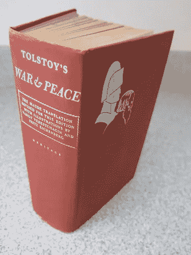

# 在 CPU 上分布式运行 Llama 2

> 原文：[`towardsdatascience.com/distributed-llama-2-on-cpus-via-llama-cpp-pyspark-65736e9f466d?source=collection_archive---------2-----------------------#2023-08-02`](https://towardsdatascience.com/distributed-llama-2-on-cpus-via-llama-cpp-pyspark-65736e9f466d?source=collection_archive---------2-----------------------#2023-08-02)

## *一个使用 Python 在普通硬件上进行批量推理的玩具示例，通过 llama.cpp 和 PySpark。*

[](https://jonathanapple.medium.com/?source=post_page-----65736e9f466d--------------------------------)[](https://towardsdatascience.com/?source=post_page-----65736e9f466d--------------------------------) [Jonathan Apple](https://jonathanapple.medium.com/?source=post_page-----65736e9f466d--------------------------------)

·

[关注](https://medium.com/m/signin?actionUrl=https%3A%2F%2Fmedium.com%2F_%2Fsubscribe%2Fuser%2F7d68a0f98df3&operation=register&redirect=https%3A%2F%2Ftowardsdatascience.com%2Fdistributed-llama-2-on-cpus-via-llama-cpp-pyspark-65736e9f466d&user=Jonathan+Apple&userId=7d68a0f98df3&source=post_page-7d68a0f98df3----65736e9f466d---------------------post_header-----------) 发表于 [Towards Data Science](https://towardsdatascience.com/?source=post_page-----65736e9f466d--------------------------------) ·6 分钟阅读·2023 年 8 月 2 日[](https://medium.com/m/signin?actionUrl=https%3A%2F%2Fmedium.com%2F_%2Fvote%2Ftowards-data-science%2F65736e9f466d&operation=register&redirect=https%3A%2F%2Ftowardsdatascience.com%2Fdistributed-llama-2-on-cpus-via-llama-cpp-pyspark-65736e9f466d&user=Jonathan+Apple&userId=7d68a0f98df3&source=-----65736e9f466d---------------------clap_footer-----------)

--

[](https://medium.com/m/signin?actionUrl=https%3A%2F%2Fmedium.com%2F_%2Fbookmark%2Fp%2F65736e9f466d&operation=register&redirect=https%3A%2F%2Ftowardsdatascience.com%2Fdistributed-llama-2-on-cpus-via-llama-cpp-pyspark-65736e9f466d&source=-----65736e9f466d---------------------bookmark_footer-----------)

*作者通过 DALL-E 制作的图像*

# 为什么？

本练习旨在使用 [Llama 2](https://github.com/facebookresearch/llama)，一个来自 [Meta AI](https://ai.meta.com/llama/) 的 LLM（大型语言模型），一次性总结多个文档。大规模的非结构化、半结构化和结构化文本摘要可以作为 [一个独立的特性，](https://medium.com/analytics-vidhya/text-summarization-using-nlp-3e85ad0c6349) 也可以作为数据管道的一部分，为下游机器学习模型提供数据。

具体来说，我们希望证明以下情况的同时可行性：

+   在 **CPUs** 上运行 Llama 2（即，去除 GPU 能力限制）

+   与 [**Apache Spark**](https://spark.apache.org/) 的平滑集成（大数据生态系统的关键部分）

+   **不使用第三方端点**（即，由于隔离基础设施或保密要求，模型必须在本地运行）

# **如何？**

很多艰巨的工作已经为我们完成了！

[llama.cpp 项目](https://github.com/ggerganov/llama.cpp) 通过减少其数值权重的分辨率（[“量化”](https://ggml.ai/)）来实现 LLM 在 CPU 上的 *简化* 运行。这些现成的模型文件[易于获取](https://huggingface.co/TheBloke)。

接下来，[llama-cpp-python](https://github.com/abetlen/llama-cpp-python) 绑定提供了从 Python 内部使用 **llama.cpp** 的简单方法。

最后，Spark 的 `applyInPandas()` ([文档](https://spark.apache.org/docs/3.1.2/api/python/reference/api/pyspark.sql.GroupedData.applyInPandas.html)) 可以将巨大的数据源分割成 [Pandas](https://pandas.pydata.org/) 大小的块并独立处理。请注意，如果向量化的 Spark 函数能够实现相同的结果，这种方法 *可能* 是一种反模式，但在我们的案例中，我们基本上是将 Spark 作为一个简单的协调器来扩展我们对 **llama.cpp** 的使用。可能还有更高效的批处理方式来使用 **llama.cpp**，但考虑到 Spark 的容错和可扩展性的简易性和自动化好处，这种方式很有吸引力。

# 计划



创意共享许可证 ([CC BY-SA 3.0](https://commons.wikimedia.org/wiki/Category:War_and_Peace#/media/File:War_and_Peace_book.JPG))

作为一个有趣的测试，我们将使用 Llama 2 来总结列夫·托尔斯泰的[《战争与和平》](https://gutenberg.org/cache/epub/2600/pg2600.txt)，这是一本超过 1200 页的小说，包含超过 360 章。我们将把每章当作一个文档。注意，Llama 2 已经“知道”这部小说；询问它关于一个关键角色会生成以下输出（使用 `llama-2–7b-chat.ggmlv3.q8_0.bin`）：

```py
Prompt:
Briefly describe the character Anna Pavlovna from 'War and Peace'

Response:
Anna Pavlovna is a major character in Leo Tolstoy's novel "War and Peace".
She is a wealthy, intelligent, and charming socialite who is known for her beauty and wit.
Despite her beauty and charm, she is also portrayed as being manipulative and cunning, often using her intelligence and wit to get what she wants.
Throughout the novel, Anna Pavlovna is shown to be a complex and multifaceted character, with both admirable and flawed qualities.
She is particularly close to the main character Pierre Bezukhov, and plays an important role in his personal and emotional development.
```

**步骤：**

1.  安装 7B 量化聊天模型和 **llama-cpp-python**。

1.  下载小说，按章节分割，创建一个 Spark `DataFrame`。

1.  按章节分区并生成摘要。

# 安装

配置 Spark 集群超出了我们的范围；我将假设你已经在本地、通过托管服务（如 [Synapse](https://learn.microsoft.com/en-us/azure/synapse-analytics/spark/apache-spark-overview) 或 [Elastic Map Reduce](https://docs.aws.amazon.com/emr/latest/ReleaseGuide/emr-spark.html)）或像 [Kubernetes](https://spark.apache.org/docs/3.1.1/running-on-kubernetes.html) 这样的自定义部署中运行了 Spark。

有两个工件需要安装在所有 *工作节点* 上，无论这些节点是物理机器、虚拟机还是无服务器池中的容器：

+   GGML 格式的 LLama 2 模型（位于 `/models`）

+   **llama-cpp-python** 模块（通过 `pip` 安装）

我们使用的是 Llama 2 的 7B 聊天 “Q8” 版本，可以在 [这里](https://huggingface.co/TheBloke/Llama-2-7B-Chat-GGML/tree/main) 找到。下载链接可能会变化，但单节点的“裸金属”设置类似于下面的内容：

确保您可以通过 `python3` 使用模型，并查看 [这个示例](https://github.com/abetlen/llama-cpp-python#high-level-api)。总结一下，*每个* Spark 上下文必须能够从 `/models` 读取模型并访问 **llama-cpp-python** 模块。

# **处理小说文本**

以下 Bash 命令下载小说并打印字数。

接下来，我们在 Python 中读取文本文件，去除 Project Gutenberg 的头部和尾部。我们将通过正则表达式 `CHAPTER .+` 进行分割，创建一个章节字符串的列表，并从中创建一个 Spark `DataFrame`（此代码假设有一个名为 `spark` 的 `SparkSession`）。

代码应该产生以下输出：

```py
number of chapters = 365
max words per chapter = 3636

+------------------------------------------------------------+-------+
|                                                        text|chapter|
+------------------------------------------------------------+-------+
|\n\n“Well, Prince, so Genoa and Lucca are now just family...|      1|
|\n\nAnna Pávlovna’s drawing room was gradually filling. T...|      2|
|\n\nAnna Pávlovna’s reception was in full swing. The spin...|      3|
|\n\nJust then another visitor entered the drawing room: P...|      4|
|\n\n“And what do you think of this latest comedy, the cor...|      5|
|\n\nHaving thanked Anna Pávlovna for her charming soiree,...|      6|
|\n\nThe rustle of a woman’s dress was heard in the next r...|      7|
|\n\nThe friends were silent. Neither cared to begin talki...|      8|
|\n\nIt was past one o’clock when Pierre left his friend. ...|      9|
|\n\nPrince Vasíli kept the promise he had given to Prince...|     10|
+------------------------------------------------------------+-------+
```

太好了！现在我们有了一个包含 365 行的 `DataFrame`，每行都包含完整的章节文本和编号。最后一步是创建一个包含每章总结的新 `DataFrame`。

# Spark 处理

以下是生成 **单章总结** 的 Python 代码（请参见对 `limit(1)` 的调用以返回单行）。代码片段下方有解释：

`llama2_summarize()` 函数是 Spark 按 *每组* 应用的代码。由于我们按 `chapter` 列分组，该函数会在每一章的行上调用；`df` 参数仅仅是一个 **Pandas** `DataFrame`，其中包含一行数据。请注意，我们在 *每次调用* `llama2_summarize()` 时都会读取模型；这是为了简便采用的快捷方式，但效率并不是很高。

最后，使用 Spark 我们进行 `groupby()` 并调用 `applyInPandas()`，设置模式以包含章节总结和编号。

输出（为了可读性进行重新格式化）如下所示：

```py
summary
The chapter is about a conversation between Prince Vasíli Kurágin and 
Anna Pávlovna Schérer, a well-known socialite and favorite 
of Empress Márya Fëdorovna. 
They are discussing various political matters, including the possibility 
of war with France and Austria's role in the conflict. 
Prince Vasíli is hoping to secure a post for his son through 
the Dowager Empress, while Anna Pávlovna is enthusiastic 
about Russia's potential to save Europe from Napoleon's tyranny. 
The conversation also touches on personal matters,
such as Prince Vasíli's dissatisfaction with his younger son
and Anna Pávlovna's suggestion that he marry off 
his profligate son Anatole to a wealthy heiress.

chapter
1
```

（请注意使用 *拿破仑*，尽管它在章节中并不存在！再说一次，这是一个有趣的练习，而不是使用真正未见过的文档的现实示例。）

这个单章测试的运行时间约为 **2 分钟**，在一个 64 核心的虚拟机上。我们略过了许多影响运行时间的选择，例如模型大小/量化和模型参数。关键结果是，通过适当扩展我们的 Spark 集群，我们可以在几分钟内总结 *所有* 章节。因此，使用由廉价虚拟机组成的大型 Spark 集群，每天处理数十万（甚至百万！）的文档是可能的。

# 总结

我们甚至没有提到调整标准 LLM 参数如 `temperature` 和 `top_p`，这些参数控制结果的“创造力”和随机性，或者 *提示工程*，这几乎是一门独立的学科。我们也选择了 Llama 2 7B 模型而没有说明理由；可能还有更小且性能更好的模型或模型系列，更适合我们的特定用例。

相反，我们展示了如何使用 Spark 轻松分发（量化）LLM 工作负载，只需付出相当少的努力。接下来的步骤可能包括：

+   更高效的模型加载/缓存

+   针对不同使用场景的参数优化

+   自定义提示
