# DL 笔记：高级梯度下降

> 原文：[`towardsdatascience.com/dl-notes-advanced-gradient-descent-4407d84c2515?source=collection_archive---------7-----------------------#2023-12-05`](https://towardsdatascience.com/dl-notes-advanced-gradient-descent-4407d84c2515?source=collection_archive---------7-----------------------#2023-12-05)

## 主要的优化算法用于训练神经网络，从头开始在 Python 中解释和实现。

  [Luis Medina](https://medium.com/@luisdamed?source=post_page-----4407d84c2515--------------------------------)

·

[关注](https://medium.com/m/signin?actionUrl=https%3A%2F%2Fmedium.com%2F_%2Fsubscribe%2Fuser%2F562a027a34f0&operation=register&redirect=https%3A%2F%2Ftowardsdatascience.com%2Fdl-notes-advanced-gradient-descent-4407d84c2515&user=Luis+Medina&userId=562a027a34f0&source=post_page-562a027a34f0----4407d84c2515---------------------post_header-----------) 发表在 [Towards Data Science](https://towardsdatascience.com/?source=post_page-----4407d84c2515--------------------------------) · 17 分钟阅读 · 2023 年 12 月 5 日

--


图片来源：[Jack Anstey](https://unsplash.com/@jack_anstey?utm_source=ghost&utm_medium=referral&utm_campaign=api-credit) / [Unsplash](https://unsplash.com/?utm_source=ghost&utm_medium=referral&utm_campaign=api-credit)

在我[之前关于梯度下降的文章](https://medium.com/@luisdamed/gradient-descent-f09f19eb35fb)中，我解释了其基本概念，并总结了这种优化方法的主要挑战。

然而，我只涉及了随机梯度下降（SGD）以及“批处理”和“小批量”梯度下降的实现。

其他算法在收敛速度、对“景观”特征（梯度消失问题）的鲁棒性，以及对学习率选择的依赖程度等方面提供了优势。

所以今天我将讨论更高级的优化算法，从零开始在 Python 中实现它们，并通过动画可视化进行比较。

我还列出了用于学习这些算法的资源。这些资源非常适合深入探讨正式的概念。

# 比较使用简单目标函数的算法

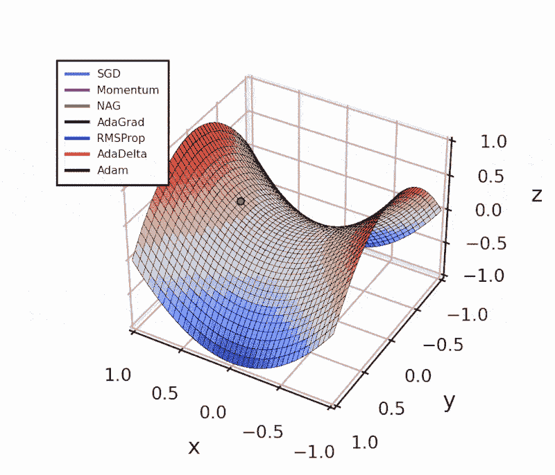

在这篇文章中，我将展示如何在 Python 中实现不同的算法。

我创建了一个 Jupyter Notebook，你可以通过[**GitHub 访问**](https://github.com/luisdamed/Gradient_Descent_Visualizations/blob/main/Advanced_Gradient_Descent_Trajectories.ipynb?ref=makerluis.com)或直接[**在 Google Colab 上查看**](https://colab.research.google.com/github/luisdamed/Gradient_Descent_Visualizations/blob/main/Advanced_Gradient_Descent_Trajectories.ipynb?ref=makerluis.com)以查看用于创建此处展示的图形的所有代码。

为生成动画，我使用了我之前的文章中展示的在 Python 中创建动画梯度下降图形的方法。

函数定义假设已经包含了以下代码，因为它们使用了`numpy`类和方法，并调用了函数`f`及其梯度`grad_f`。

```py
import numpy as np

# Create a function to compute the surface
def f(theta):
  x = theta[0]
  y = theta[1]
  return x**2 - y**2

# Define a function to compute the gradient
def grad_f(theta):
    returnValue = np.array([0.,0.])
    x = theta[0]
    y = theta[1]
    returnValue[0] += 2*x
    returnValue[1] += - 2*y
    return returnValue
```

# 动量


图片由[Sharon Pittaway](https://unsplash.com/@sharonp?utm_source=medium&utm_medium=referral)提供，拍摄于[Unsplash](https://unsplash.com/?utm_source=medium&utm_medium=referral)

我们可以将优化算法与球体滚下坡道进行比较。

如果“球体”像现实中那样具有动量，它在以全速加速下坡后更不容易停留在局部最小值中。

这就是人们在处理梯度下降被困在局部最小值的问题时意识到的。

从高中物理中我们知道，*平动*动量定义为物体质量与其速度的乘积：

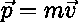

平动动量。

我们还知道，质量为***m***的物体的重力势能与其所处的高度***h***是*成正比*的：

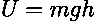

重力势能。

此外，物体的势能与施加在其上的力之间存在直接的[关系](https://phys.libretexts.org/Under_Construction/Purgatory/2%3A_Applying_Models_to_Mechanical_Phenomena/2.5%3A_Force_and_Potential_Energy?ref=makerluis.com)

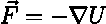

力等于势能的负梯度。

**p**与***U***之间的关系可以从牛顿第二定律推导出来：

> 物体的运动变化与施加的力成正比，并且沿着力的施加方向发生。

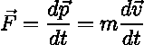

牛顿第二定律。

> 💡 实际上，这个物理类比过于简化，无法涵盖将动量添加到梯度下降优化中的所有优缺点。要获取全面的信息，推荐查看[**为什么动量真的有效？**](https://distill.pub/2017/momentum/?ref=makerluis.com)

# 如何添加动量？

当我们初始化优化算法时，我们把“球”放在高度***h***处，赋予它势能***U***。

施加在球上的力与这种势能的梯度成正比，就像我们优化的函数的梯度一样（我们正在移动的表面）。

动量在优化中的作用是利用梯度来改变粒子的“速度”，进而改变其位置。

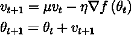

动量更新。

由于速度项，“粒子”在具有一致梯度的任何方向上加速。

我将这实现为以下 Python 函数：

```py
def gradient_descent(x_init, y_init, step_size, n_iters, momentum):
  eta = step_size
  mu = momentum  # Notice that, if mu = 0, this algorithm is just SGD

  # Initialize arrays to store results
  theta = np.tile([x_init, y_init], (n_iters,1) )
  z = np.tile([f(theta[0])], n_iters )

  # Initialize velocity term
  v_t = np.array([0,0])

  for k in range (1, n_iters):

   # Update velocity
      v_t = mu*v_t - eta*grad_f(theta[k-1])

   # Update position
      theta[k] = theta[k-1] + v_t
      z[k] = f(theta[k])

  # Store position coordinates
  dataset = np.stack((theta[:,0], theta[:,1], z), 1)  

  return dataset
```

动量更新既加速了在低曲率方向上的优化，又平滑了（阻尼效应）由于“地形”特征或噪声数据造成的振荡[3]。

一些人认为动量更新实际上与摩擦系数的物理效果更一致，因为它减少了系统的动能[2]。

另一种解释是，它为优化过程提供了“短期”记忆。

由于小于 1，动量参数像是之前梯度的指数加权和，速度更新可以重写为[3][5]：

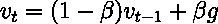

速度项被重写为加权和。

其中*g*是瞬时梯度，*v*是平滑的梯度估计器。

参数**β**控制我们对当前梯度与之前梯度之间新值的权重分配。

通常它的值为 0.9，但有时会“调度”，即在迭代过程中从 0.5 逐步增加到 0.99。

# Nesterov 加速梯度（NAG）

由 Nesterov 于 1983 年提出。

Nesterov 更新实现了“前瞻”功能，以提高动量在凸函数上的稳定性和收敛速度。

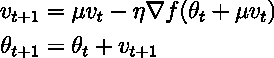

NAG 更新。

动量使用当前位置来更新梯度，而 NAG 首先对当前位置进行部分更新，知道

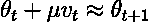

对前瞻性更新的直觉。

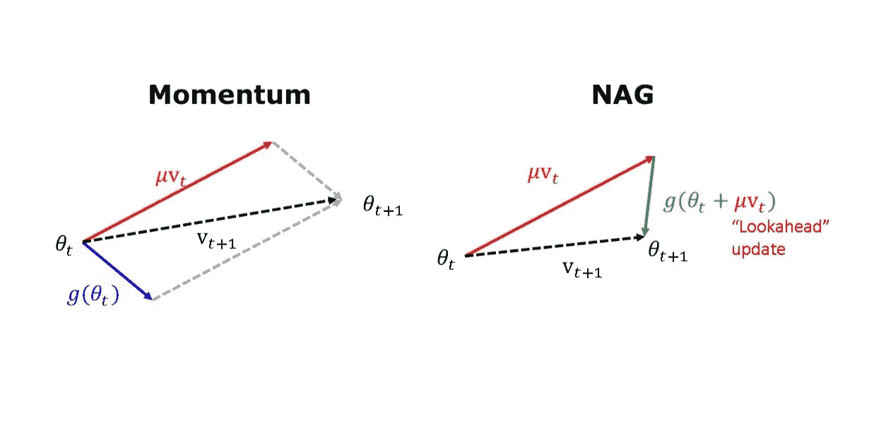

动量和 NAG 更新的矢量表示。

为了将其实现为 Python 函数，我对之前展示的“速度更新”代码进行了以下修改：

```py
# Update velocity

# Momentum
v_t = mu*v_t - eta *grad_f(theta[k-1])

# NAG
v_t = mu*v_t - eta *grad_f(theta[k-1] + mu * v_t)
```

这一部分更新有助于提高优化的准确性。实际上，这意味着与动量法相比，它在局部最小值附近的振荡更少。

差异在下图中非常明显。

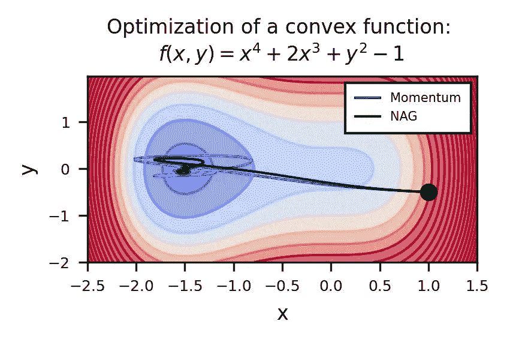

比较动量法和 NAG 在复杂表面上的下降优化。

两个优化器在相同坐标上初始化，并使用相同的动量参数（0.95，固定）。

以下动画也帮助我们理解调度或“退火”动量参数的直观感受。

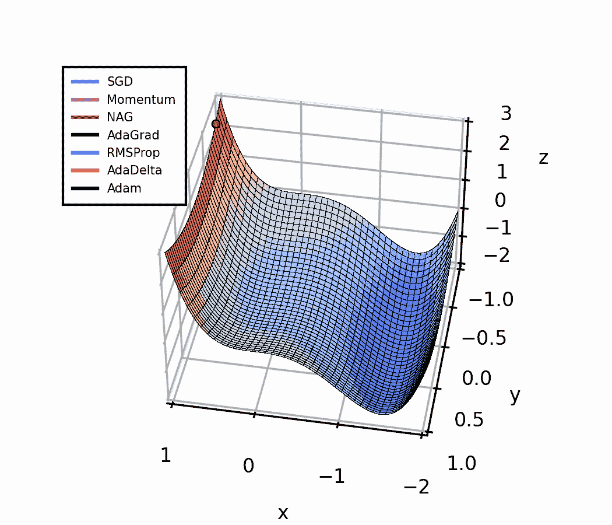

比较不同优化算法在穿越梯度消失区域时的表现。在这种情况下，基于动量的方法表现更好。

一开始，少量动量有助于穿越梯度消失区域。当我们接近局部最小值时，较大的动量值可能会减小我们观察到的振荡，从而提高收敛速度。

# 自适应方法

上面动画中展示的其他优化算法是自适应方法，我将在本节中描述这些方法。

通过这个简单的例子，动量法和 NAG 似乎比其他方法优越。然而，自适应算法更具鲁棒性。我将在另一篇文章中通过实际例子来展示这一点。

## 自适应梯度算法（AdaGrad）

AdaGrad 是一类用于随机优化的[次梯度](https://web.stanford.edu/class/ee392o/subgrad_method.pdf?ref=makerluis.com)算法，由[John Duchi、Elad Hazan 和 Yoram Singer 于 2011 年](https://jmlr.org/papers/v12/duchi11a.html?ref=makerluis.com)提出。

他们提出通过将梯度的历史信息纳入每次新的权重更新中来改进基于梯度的学习。

与动量法通过偏置梯度本身不同，AdaGrad 动态地为目标函数的每个参数单独修改学习率。

这意味着我们对每个模型权重使用不同的学习率。这些学习率基于梯度的一致性进行调整。

为此，梯度估计的序列如下存储：

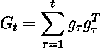

梯度的平方和或梯度历史的外积。

如果我们优化一个具有*n*个坐标或参数的函数，g**ₜ**将是一个具有*n*个元素的向量，G**ₜ**也是如此。

然后，更新规则如下：

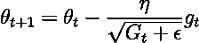

AdaGrad 更新。

参数**ε**用于避免除零错误，通常设置为一个小值，如 1e-08。

有趣的是，G**ₜ**的定义类似于梯度分布的非中心（零均值）[方差](https://en.wikipedia.org/wiki/Variance?ref=makerluis.com)。

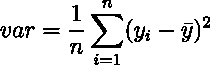

方差定义。

方差是分布的离散能量的度量。

因此，对于每个参数**θᵢ**，学习率是根据**θᵢ**的梯度方差的*倒数*来调整的。

考虑到这一点，我们可以说，梯度分布中离散程度较大的参数将按较大的比例缩小学习率，而梯度较一致（方差较低）的参数将具有较大的学习率。

AdaGrad 还根据时间（之前梯度的累积）和目标函数的曲率（“区域”中的梯度方差较低将分配较小的步长）自动实现学习率衰减。这改善了算法的收敛速度。

我已将 AdaGrad 实现为以下 Python 函数：

```py
def Adagrad(x_init, y_init, step_size, n_iters):
  eta = step_size
  G_t = 0
  eps = 1e-8

  theta = np.tile([x_init, y_init], (n_iters,1) )
  z = np.tile([f(theta[0])], n_iters )
  for k in range (1, n_iters):
      # Compute gradient
      g_t = grad_f(theta[k-1])

      # Accumulate squared gradients
      G_t += g_t**2

      # Update position
      theta[k] = theta[k-1] - eta * g_t / (np.sqrt(G_t) + eps)
      z[k] = f(theta[k])

  # Store position coordinates
  dataSet = np.stack((theta[:,0], theta[:,1], z), 1)

  return dataSet
```

AdaGrad 的一个缺点是，这种训练过程中学习率的衰减可能过于激进，导致在训练人工神经网络时学习过早停止。每次参数更新都很稳健，但变化接近最优点的速度可能会下降得太多。

另一个缺点是，虽然学习率在学习过程中会自我调整，但 AdaGrad 仍然对初始条件敏感。如果优化开始时梯度很大，那么训练过程中学习率会较低。

我们可以在动画图中看到这一点。AdaGrad 很快打破了对称性，但学习非常慢，与其他算法相比。

为了弥补这一点，可能需要将学习率调整到更高的值，这在一定程度上削弱了自我调整特性的目的。

## 均方根传播（RMSprop）

未发表的方法，但在课程《神经网络与机器学习》第 6 讲的[幻灯片](https://www.cs.toronto.edu/~tijmen/csc321/slides/lecture_slides_lec6.pdf?ref=makerluis.com)中提到，由[Geoffrey Hinton](https://en.wikipedia.org/wiki/Geoffrey_Hinton?ref=makerluis.com)教授提供。

这个算法的概念类似于动量。它还结合了梯度幅度的短期历史来执行权重更新。

然而，与 AdaGrad 类似，RMSProp 修改的是学习率而不是梯度。

为此，学习率被除以最近梯度幅度的滑动平均。

首先，算法计算平方成本值及其之前值的加权和。

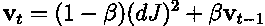

平方成本的指数加权和。

这就像是一个短期均值，其中参数**β**调整了给更近期的成本值相较于较旧的成本值的权重。

它类似于我之前提到的动量的重写形式，但应用于平方成本，而不是梯度。

下一步是将学习率除以这个移动平均的平方根。

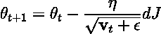

RMSProp 更新规则。

这样，步长依赖于梯度幅度的历史（短期记忆）。

注意，计算加权平方和的平方根（或加权平均）等同于计算这些值的均方根（RMS）。

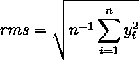

RMS 的定义。

信号的 RMS 是其*总*能量的表示（与方差不同，方差表示的是*离散*能量）[1]。

因此，使用 RMSProp 时，学习率会根据成本函数的梯度及其先前值的总能量进行调节。这种调整是动态的，并且针对损失函数的每个方向或组件（每个权重！）。

目标是通过在这些情况下减小步长来减少由于梯度大幅变化引起的波动性。

这也有助于解决梯度消失问题，因为当梯度非常小时，我们会采取更大的步伐。

这是我作为 Python 函数编码的方式：

```py
def RMSProp(x_init, y_init, step_size, n_iters, decay):
  beta = decay # 0.8, 0.9, ..., 0.99
  eta = step_size
  eps = 1e-8
  MSQ = 0

  theta = np.tile([x_init, y_init], (n_iters,1) )
  z = np.tile([f(theta[0])], n_iters )
  for k in range (1, n_iters):
      # Compute gradient
      g_t = grad_f(theta[k-1])

      # Compute the weighted mean of squared values
      MSQ = beta * MSQ + (1 - beta) * g_t**2

      # Update position (divide eta by RMS)
      theta[k] = theta[k-1] - eta * g_t / (np.sqrt(MSQ) + eps)
      z[k] = f(theta[k])

  # Store position coordinates
  dataSet = np.stack((theta[:,0], theta[:,1], z), 1)

  return dataSet
```

RMSprop 对学习率的初始选择非常稳健，并且还实现了自动学习率衰减。然而，由于它基于梯度值的短期历史，因此衰减比 AdaGrad 更加温和。

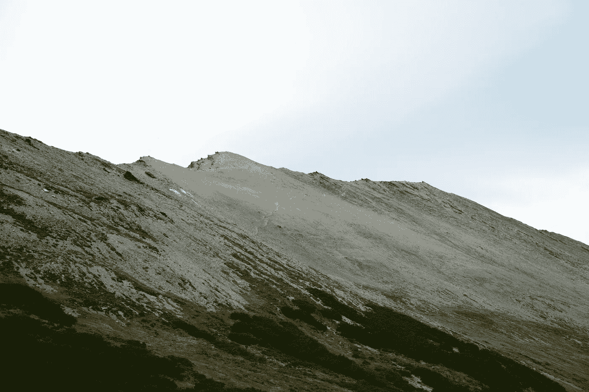

图片由 [Gonzalo Kaplanski](https://unsplash.com/@gonzakap?utm_source=medium&utm_medium=referral) 拍摄，来源于 [Unsplash](https://unsplash.com/?utm_source=medium&utm_medium=referral)

# AdaDelta

由 [Matthew Zeiler 于 2012 年提出](https://arxiv.org/abs/1212.5701?ref=makerluis.com)。

这种方法是为了克服 AdaGrad 的主要局限性而开发的：学习率的持续衰减导致提前停止，并且需要手动调整“全局”学习率。

为了克服持续的学习率衰减，算法在一个窗口或固定大小内累积过去梯度的历史。

实际上，这涉及到将学习率除以固定窗口内先前梯度的 RMS，就像 RMSprop 所做的那样：

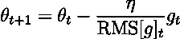

学习率缩放类似于 RMSProp。

AdaGrad 的下一个改进是优化更新单元的修正。

在 AdaGrad（以及我迄今为止描述的所有其他优化算法）中，优化步骤的单位与我们为优化成本函数而修改的参数单位不匹配 [9]：

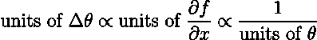

我们在学校里知道不能将苹果和橙子相加。但使用这些优化算法时，就像我们在加“苹果”（当前参数值，**θₜ** 和一些未知量（优化步骤 **Δθ**），这些在数学上可以加到一起以获得新的苹果（更新后的参数，**θₜ ₊₁**）。这有效，但在现实生活中没有意义。

Zeiler 决定纠正单位，将更新项从[牛顿法](https://en.wikipedia.org/wiki/Newton%27s_method?ref=makerluis.com)重新排列，并假设损失函数的曲率可以用对角[海森矩阵](https://en.wikipedia.org/wiki/Hessian_matrix?ref=makerluis.com)来近似：

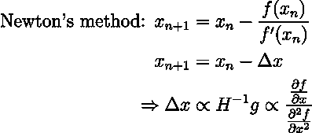

将这一观察与类似于 RMSProp 的更新规则进行比较，Zeiler 确定了正确的更新项形式，以保持正确的单位。

直观的解释在原始出版物中更为详尽，但实际上，它导致在更新项的分子中添加了以前更新值的指数加权平均的平方根：

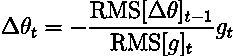

AdaDelta 参数更新步骤。

这基本上假设损失函数在小窗口大小 *w* 内是平滑的（曲率低），以便**Δθₜ** 可以通过以前值的指数 RMS 来近似。

如果我们将其实现为 Python 函数，算法看起来是这样的：

```py
def AdaDelta(x_init, y_init, step_size, n_iters, decay):

  eta = step_size
  G_t = 0
  eps = 1e-8
  E_gsq = 0
  E_xsq = 0

  theta = np.tile([x_init, y_init], (n_iters,1) )
  z = np.tile([f(theta[0])], n_iters )
  for k in range (1, n_iters):
      g_t = grad_f(theta[k-1])
      E_gsq = decay * E_gsq + (1 - decay) * g_t**2
      delta = - np.sqrt(E_xsq + eps) / np.sqrt(E_gsq + eps) * g_t
      E_xsq = decay * E_xsq + (1 - decay) * delta**2
      theta[k] = theta[k-1] + delta
      z[k] = f(theta[k])

  # Setting up Data Set for Animation
  dataSet = np.stack((theta[:,0], theta[:,1], z), 1)  # Combining our position coordinates

  return dataSet
```

AdaDelta 结合了其所基于的优化方法的优点。

例如，分子中前期参数更新的短期记忆类似于动量，并具有加速梯度下降的效果。

分母提供了 AdaGrad 的每维度准确性，但没有过度的学习率衰减（就像 RMSProp 一样）。

此外，AdaDelta 对突发的梯度变化更为稳健，对初始学习率的选择也很稳健（请参见本文最后一节中的实际示例）。

# Adam（自适应动量）

这是今天最流行的算法之一。

它由[迪德里克·P·金马和吉米·雷·巴于 2014 年提出](https://arxiv.org/pdf/1412.6980.pdf?ref=makerluis.com)，并因其计算效率高以及在处理大量数据和参数的问题上表现良好而变得非常流行。

Adam 类似于动量（Momentum）和 RMSprop 的结合，因为它动态地改变了损失函数的梯度以及用于缩放这些梯度的学习率来更新权重。

为此，算法包括计算两个在本文之前部分已经熟悉的术语。

首先，动量项是成本函数前几个梯度的指数加权和（这类似于加权方差）：

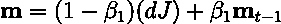

成本梯度的指数加权平均。

然后，有一个来自 RMSprop 的术语，是平方梯度的指数加权移动平均。

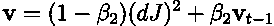

成本梯度的指数加权平均。

将两者与 SGD 算法结合，过去梯度的信息被纳入更新步骤。它们在短窗口内的总能量（RMS）用于缩放学习率，而它们的离散度（方差）有助于调整用于更新权重的当前梯度值。

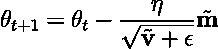

Adam 的更新规则。

带有波浪号 (~) 的值对应于引入的偏差校正项，以减少学习过程中 m 和 v 初始值的贡献：

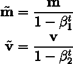

Adam 的初始化偏差校正项。

t = 当前训练轮次。

与 AdaDelta 不同，Adam 确实需要调整一些超参数，但这些参数很容易解释。

**β₁** 和 **β₂** 是梯度和平方梯度的 [指数移动平均](https://en.wikipedia.org/wiki/Exponential_smoothing) 的衰减率。

较大的值会对先前的梯度赋予更多权重，表现更平滑，对最近的变化反应较少。接近零的值会赋予最近梯度变化更多权重。典型值为**β₁** = 0.9 和**β₂** = 0.999。

**ε** 与所有前述情况一样，是一个常数，添加以避免除以零，通常设为 1e-8。

尽管有许多附加项和显著的优势，Adam 实现起来非常简单：

```py
def Adam(x_init, y_init, step_size, n_iters, 
         beta_1 = 0.9, beta_2 = 0.999):

  eps = 1e-8
  eta = step_size

  # Initialize vectors
  m_t = np.array([0,0])
  v_t = np.array([0,0])
  theta = np.tile([x_init, y_init], (n_iters,1) )
  z = np.tile([f(theta[0])], n_iters )

  for k in range (1, n_iters):
      # Compute gradient
      g_t = grad_f(theta[k-1])

      # Compute "momentum-like" term (weighted average)
      m_t = beta_1 * m_t + (1 - beta_1)*g_t

      # Compute the mean of squared gradient values
      v_t = beta_2 * v_t + (1 - beta_2)*g_t**2

      # Initialization bias correction terms
      m_t_hat = m_t/(1 - beta_1**k)
      v_t_hat = v_t/(1 - beta_2**k)

      # Update position with adjusted gradient and lr
      theta[k] = theta[k-1] - eta * m_t_hat/(np.sqrt(v_t_hat)+ eps)
      z[k] = f(theta[k])

  # Store position coordinates
  dataSet = np.stack((theta[:,0], theta[:,1], z), 1) 

  return dataSet
```

有趣的是，论文的作者指出了这个术语

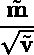

Adam 的学习率缩放。

*类似于* [信噪比 (SNR)](https://en.wikipedia.org/wiki/Signal-to-noise_ratio#Definition) 的定义：

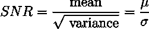

信噪比。

然后，我们可以说，对于较小的 SNR 值，参数更新将接近零。这意味着当对是否朝着真实梯度方向移动存在太多不确定性时，我们不会进行大幅更新。

Adam 及其变体在训练深度学习模型时通常优于其他算法，特别是在梯度非常嘈杂和稀疏的情况下。

# 不同学习率的性能表现

我决定比较不同优化器在不同“全局”学习率下的表现。

这是一个相当简单的例子，但它提供了这些方法如何受到学习率选择影响的一个概念。

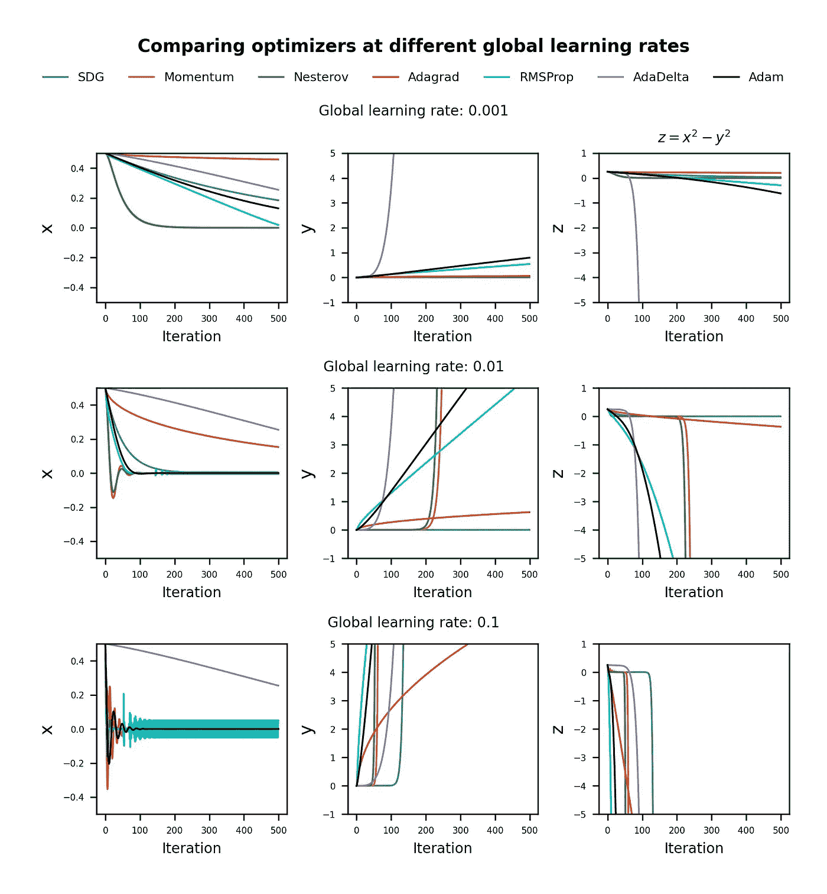

比较不同算法优化过程中 x 和 y 坐标的演变。对于 Momentum 和 NAG，mu = 0.95。对于 RMSProp 和 AdaDelta，衰减参数 = 0.9。

AdaDelta 对全局学习率设置似乎非常鲁棒，在所有三种情况下“下降”速率相同。我们还可以看到，在这种情况下，AdaGrad 需要较大的学习率才能实现与 AdaDelta 相当的性能。

对于较小的学习率，Adam 和 RMSProp 显然相似，并且优于 Momentum 和 SGD。

然而，对于较大的学习率，RMSProp 在最优 x 值（x = 0）周围表现出一致的振荡，而 Adam 在初始瞬态后稳定下来，这得益于分子中动量项的阻尼效应。

自适应算法比 SGD 和 Momentum 方法更早打破对称性，除了全局学习率为 0.1 的情况，此时 Momentum 和 NAG 优于 AdaDelta。

再次强调，这些观察结果仅适用于特定的场景。

# 结论

当我们将这些优化算法应用于简单函数时，如上述的鞍点例子，它们的优点并不完全显现。

对于其他小规模模型或数据集的场景，即使是 SGD 也可能效果更好，因此理解每种优化器最佳工作条件是重要的。

在训练神经网络时，我们优化损失函数，而在任何时刻我们没有其梯度的确切值，仅有对其的估计。这就是为什么像 Adam 和 AdaDelta 这样的对梯度中的噪声和稀疏性具有鲁棒性的算法在数据科学社区中被广泛使用。

此外，我们可以处理大量的模型权重，而不仅仅是 x 和 y 坐标。在这些情况下，获取每个参数的学习率的能力是有益的。

在未来的文章中，我将展示这些方法在另一篇文章中的更现实的比较，使用人工神经网络。

# 进一步阅读

+   [DL Notes: 梯度下降](https://medium.com/@luisdamed/gradient-descent-f09f19eb35fb)

+   [DL Notes: 前馈人工神经网络](https://medium.com/@luisdamed/feedforward-artificial-neural-networks-52bcf96d6ac3)

+   在 Python 中创建梯度下降动画（数据科学的前沿）

# 参考文献

**所有图示，除非另有说明，均由作者创建。**

[1] 在线课程 [深入理解深度学习](https://www.udemy.com/course/deeplearning_x/?ref=makerluis.com)，由 Mike X Cohen 主讲（[sincxpress.com](https://sincxpress.com/?ref=makerluis.com)）

[2] [斯坦福在线：CS231 卷积神经网络进行视觉识别](https://cs231n.github.io/neural-networks-3?ref=makerluis.com)

[3] Goh. “为什么 Momentum 真正有效”，Distill，2017\. [`doi.org/10.23915/distill.00006`](http://doi.org/10.23915/distill.00006?ref=makerluis.com)

[4] Villalarga, D. “[AdaGrad](https://optimization.cbe.cornell.edu/index.php?title=AdaGrad&ref=makerluis.com)”。发布于康奈尔大学计算优化开放教材 — 优化维基。

[5] Bengio, Yoshua. “深度架构的梯度训练的实际建议。” *神经网络：实用技巧：第二版*。柏林，海德堡：Springer Berlin Heidelberg, 437–478, 2012\. 在线: [arXiv:1206.5533](https://arxiv.org/abs/1206.5533?ref=makerluis.com) [cs.LG]

[6] Sutskever, I., Martens, J., Dahl, G. & Hinton, G. “在深度学习中初始化和动量的重要性”。*机器学习研究会议论文集,* 28(3):1139–1147, 2013\. 网址: [`proceedings.mlr.press/v28/sutskever13.html`](https://proceedings.mlr.press/v28/sutskever13.html?ref=makerluis.com).

[7] Duchi, J., Hazan, E., Singer, Y., “在线学习和随机优化的自适应子梯度方法”。*机器学习研究杂志,* 12(61):2121−2159, 2011\. 网址: [`jmlr.org/papers/v12/duchi11a.html`](https://jmlr.org/papers/v12/duchi11a.html?ref=makerluis.com)

[8] Jason Brownlee, [从零开始的 AdaGrad 梯度下降](https://machinelearningmastery.com/gradient-descent-with-adagrad-from-scratch/?ref=makerluis.com)。2021

[9] Zeiler, M. “ADADELTA: 一种自适应学习率方法”，2012\. [arXiv:1212.5701v1](https://arxiv.org/abs/1212.5701v1?ref=makerluis.com) [cs.LG]

[10] Kingma, D., Ba, J. “Adam: 一种随机优化方法”，2014\. [arXiv:1412.6980](https://arxiv.org/abs/1412.6980?ref=makerluis.com) [cs.LG]

*最初发布于* [*https://www.makerluis.com*](https://www.makerluis.com/dl-notes-advanced-gradient-descent/) *2023 年 12 月 5 日。*
