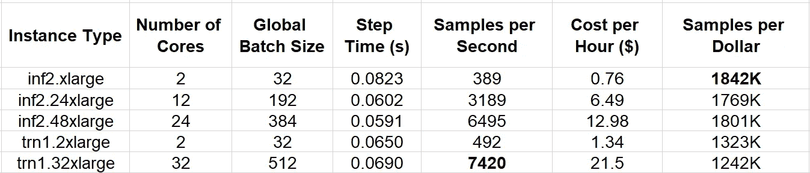

# 在 AWS Inferentia 上进行深度学习训练

> 原文：[`towardsdatascience.com/dl-training-on-aws-inferentia-53e103597a03?source=collection_archive---------7-----------------------#2023-08-30`](https://towardsdatascience.com/dl-training-on-aws-inferentia-53e103597a03?source=collection_archive---------7-----------------------#2023-08-30)

## 又一个节省开支的 AI 模型训练技巧

[](https://chaimrand.medium.com/?source=post_page-----53e103597a03--------------------------------)[](https://towardsdatascience.com/?source=post_page-----53e103597a03--------------------------------) [Chaim Rand](https://chaimrand.medium.com/?source=post_page-----53e103597a03--------------------------------)

·

[关注](https://medium.com/m/signin?actionUrl=https%3A%2F%2Fmedium.com%2F_%2Fsubscribe%2Fuser%2F9440b37e27fe&operation=register&redirect=https%3A%2F%2Ftowardsdatascience.com%2Fdl-training-on-aws-inferentia-53e103597a03&user=Chaim+Rand&userId=9440b37e27fe&source=post_page-9440b37e27fe----53e103597a03---------------------post_header-----------) 发表在 [Towards Data Science](https://towardsdatascience.com/?source=post_page-----53e103597a03--------------------------------) · 5 分钟阅读 · 2023 年 8 月 30 日

--

[](https://medium.com/m/signin?actionUrl=https%3A%2F%2Fmedium.com%2F_%2Fbookmark%2Fp%2F53e103597a03&operation=register&redirect=https%3A%2F%2Ftowardsdatascience.com%2Fdl-training-on-aws-inferentia-53e103597a03&source=-----53e103597a03---------------------bookmark_footer-----------)

图片来源：[李生昌](https://unsplash.com/@changlisheng?utm_source=medium&utm_medium=referral) 通过 [Unsplash](https://unsplash.com/?utm_source=medium&utm_medium=referral)

本文的主题是 AWS 自家研发的 AI 芯片，[AWS Inferentia](https://aws.amazon.com/machine-learning/inferentia/)——更具体地说，是第二代 AWS Inferentia2。这是对我们去年关于 [AWS Trainium](https://aws.amazon.com/machine-learning/trainium/) 的 文章 的续集，并且是关于专用 AI 加速器系列文章的一部分。与我们之前在系列文章中探讨的芯片不同，AWS Inferentia 是为 AI 模型的 **推理** 设计的，*专门* 针对深度学习推理应用。然而，AWS Inferentia2 和 AWS Trainium 共享相同的底层 [NeuronCore-v2](https://awsdocs-neuron.readthedocs-hosted.com/en/latest/general/arch/neuron-hardware/neuron-core-v2.html#neuroncores-v2-arch) 架构以及相同的软件栈（[AWS Neuron SDK](https://awsdocs-neuron.readthedocs-hosted.com/en/latest/index.html)），这就引发了一个问题：**AWS Inferentia 是否也可以用于 AI 训练工作负载？**

当然，与 [Amazon EC2 Trn1 实例](https://aws.amazon.com/ec2/instance-types/trn1/) 系列相比，[Amazon EC2 Inf2 实例](https://aws.amazon.com/ec2/instance-types/inf2/) 系列的某些规格（由 AWS Inferentia 加速器提供支持）可能会使其在一些训练工作负载上不太适用。例如，尽管 Inf2 和 Trainium 都支持高带宽和低延迟的 NeuronLink-v2 设备间互连，但 Trainium 设备是以 [2D 环形拓扑](https://awsdocs-neuron.readthedocs-hosted.com/en/latest/general/arch/neuron-features/collective-communication.html#trn1-32xlarge-topology) 连接的，而不是 [环形拓扑](https://awsdocs-neuron.readthedocs-hosted.com/en/latest/general/arch/neuron-features/collective-communication.html#inf2-48xlarge-topology)，这可能会影响 Collective Communication 操作符的性能（更多细节请参见 [这里](https://awsdocs-neuron.readthedocs-hosted.com/en/latest/general/arch/neuron-features/collective-communication.html)）。然而，一些训练工作负载可能不需要 Trn1 架构的独特功能，并且在 Inf1 和 Inf2 架构上表现同样出色。

实际上，能够在 Trainium *和* Inferentia 加速器上进行训练，将极大增加我们可用的训练实例种类，并提升我们根据每个深度学习项目的具体需求来调整训练实例选择的能力。在我们最近的文章 深度学习的实例选择 中，我们详细阐述了拥有多样化实例类型对于深度学习训练的价值。虽然 Trn1 系列仅包含两个实例类型，但启用 Inf2 训练将增加四种额外的实例类型。若将 Inf1 纳入其中，则会增加四种更多的实例类型。

我们在这篇文章中的目的是展示在 AWS Inferentia 上训练的机会。我们将定义一个玩具视觉模型，并比较在 Amazon EC2 Trn1 和 Amazon EC2 Inf2 实例系列上的训练性能。特别感谢[Ohad Klein](https://www.linkedin.com/in/ohad-klein-947aaa187/?originalSubdomain=il)和[Yitzhak Levi](https://www.linkedin.com/in/yitzhak-levi-49a217201/)对本帖的贡献。

## 免责声明

1.  请注意，截止到本文撰写时，有些深度学习模型架构尚不受 Neuron SDK 支持。例如，虽然 CNN 模型的推理是支持的，但训练 CNN 模型[仍不支持](https://github.com/orgs/aws-neuron/projects/1/views/1?filterQuery=cnn&pane=issue&itemId=12024107)。SDK 文档包括一个[模型支持矩阵](https://awsdocs-neuron.readthedocs-hosted.com/en/latest/general/arch/model-architecture-fit.html#aws-trainium-neuroncore-v2)，详细列出了每种模型架构、训练框架（例如 TensorFlow 和 PyTorch）和 Neuron 架构版本的支持功能。

1.  我们将描述的实验是在 Amazon EC2 上运行的，当时最新版本的[Deep Learning AMI for Neuron](https://aws.amazon.com/releasenotes/aws-deep-learning-ami-neuron-pytorch-1-13-ubuntu-20-04/)为“Deep Learning AMI Neuron PyTorch 1.13（Ubuntu 20.04）20230720”，该版本包括 Neuron SDK 的 2.8 版本。鉴于 Neuron SDK 仍在积极开发中，可能会随着时间的推移，我们获得的比较结果会有所变化。强烈建议您使用最新版本的底层库重新评估本文的发现。

1.  我们在这篇文章中的目的是展示 AWS Inferentia 计算实例的潜力。请**不要**将本文视为对这些实例或我们可能提及的其他产品的推荐。选择训练环境时有很多变量，这些变量可能会根据项目的具体情况而大相径庭。特别是，不同模型在两种不同实例类型上的相对价格性能结果可能完全不同。

# 玩具模型

类似于我们在之前的文章中描述的实验，我们定义了一个简单的[视觉变换器](https://en.wikipedia.org/wiki/Vision_transformer)（ViT）支持的分类模型（使用[timm](https://pypi.org/project/timm/) Python 包版本 0.9.5），以及一个随机生成的数据集。

```py
from torch.utils.data import Dataset
import time, os
import torch
import torch_xla.core.xla_model as xm
import torch_xla.distributed.parallel_loader as pl
from timm.models.vision_transformer import VisionTransformer

# use random data
class FakeDataset(Dataset):
  def __len__(self):
    return 1000000

  def __getitem__(self, index):
    rand_image = torch.randn([3, 224, 224], dtype=torch.float32)
    label = torch.tensor(data=[index % 1000], dtype=torch.int64)
    return rand_image, label

def train(batch_size=16, num_workers=4):
  # Initialize XLA process group for torchrun
  import torch_xla.distributed.xla_backend
  torch.distributed.init_process_group('xla')

  # multi-processing: ensure each worker has same initial weights
  torch.manual_seed(0)
  dataset = FakeDataset()
  model = VisionTransformer()

  # load model to XLA device
  device = xm.xla_device()
  model = model.to(device)
  optimizer = torch.optim.Adam(model.parameters())
  data_loader = torch.utils.data.DataLoader(dataset,
                         batch_size=batch_size, num_workers=num_workers)
  data_loader = pl.MpDeviceLoader(data_loader, device)
  loss_function = torch.nn.CrossEntropyLoss()
  summ, tsumm = 0, 0
  count = 0

  for step, (inputs, target) in enumerate(data_loader, start=1):
    t0 = time.perf_counter()
    inputs = inputs.to(device)
    targets = torch.squeeze(target.to(device), -1)
    optimizer.zero_grad()
    outputs = model(inputs)
    loss = loss_function(outputs, targets)
    loss.backward()
    xm.optimizer_step(optimizer)
    batch_time = time.perf_counter() - t0
    if step > 10:  # skip first steps
      summ += batch_time
      count += 1
    t0 = time.perf_counter()
    if step > 500:
      break
  print(f'average step time: {summ/count}')

if __name__ == '__main__':
  os.environ['XLA_USE_BF16'] = '1'
  # set the number of dataloader workers according to the number of vCPUs
  # e.g. 4 for trn1, 2 for inf2.xlarge, 8 for inf2.12xlarge and inf2.48xlarge
  train(num_workers=4)
# Initialization command:
# torchrun --nproc_per_node=2 train.py
```

# 结果

下表中我们比较了各种 Amazon EC2 Trn1 和 Amazon EC2 Inf2 实例类型的速度和价格性能。



ViT 基础的分类模型性能比较（作者）

虽然明显看到 Trainium 驱动的实例类型支持更好的绝对性能（即，提高的训练速度），但在 Inferentia 驱动的实例上训练的**价格**性能提高了约 39%（对于双核实例类型）并且对于更大的实例类型则更高。

再次提醒，不要仅根据这些结果做出设计决策。一些模型架构可能在 Trn1 实例上成功运行，但在 Inf2 上会出现故障。其他模型可能在两者上都能成功，但表现出的比较性能结果可能与这里展示的结果非常不同。

请注意，我们已省略了编译 DL 模型所需的时间。虽然这仅在第一次运行模型时需要，但编译时间可能非常长（例如，我们的玩具模型可能超过十分钟）。减少模型编译开销的两种方法是[并行编译](https://awsdocs-neuron.readthedocs-hosted.com/en/latest/frameworks/torch/torch-neuronx/api-reference-guide/training/pytorch-neuron-parallel-compile.html#pytorch-neuronx-parallel-compile-cli)和[离线编译](https://awsdocs-neuron.readthedocs-hosted.com/en/latest/compiler/neuronx-cc/faq.html#where-can-i-compile-to-neuron)。重要的是，确保你的脚本不包含会触发频繁重新编译的操作（或图形更改）。有关更多细节，请参阅[Neuron SDK 文档](https://awsdocs-neuron.readthedocs-hosted.com/en/latest/compiler/index.html)。

# 总结

虽然被市场宣传为 AI **推理**芯片，但看来 AWS Inferentia 还提供了另一个选项来进行**训练**深度学习模型。在我们关于 AWS Trainium 的上一篇文章中，我们强调了在将模型适配到新的 AI ASIC 时可能遇到的一些挑战。在 AWS Inferentia 支持的实例类型上训练相同模型的可能性，也许会提高你努力的潜在回报。
