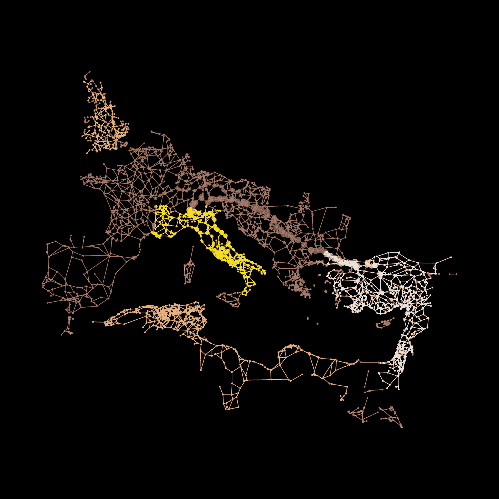

# 所有道路都通向罗马吗？

> 原文：[`towardsdatascience.com/do-all-the-roads-lead-to-rome-5b6756ce7d52?source=collection_archive---------1-----------------------#2023-10-08`](https://towardsdatascience.com/do-all-the-roads-lead-to-rome-5b6756ce7d52?source=collection_archive---------1-----------------------#2023-10-08)



## 使用 Python、网络科学和地理空间数据量化古老问题

[](https://medium.com/@janosovm?source=post_page-----5b6756ce7d52--------------------------------)[](https://towardsdatascience.com/?source=post_page-----5b6756ce7d52--------------------------------) [Milan Janosov](https://medium.com/@janosovm?source=post_page-----5b6756ce7d52--------------------------------)

·

[关注](https://medium.com/m/signin?actionUrl=https%3A%2F%2Fmedium.com%2F_%2Fsubscribe%2Fuser%2F838408aa2ad4&operation=register&redirect=https%3A%2F%2Ftowardsdatascience.com%2Fdo-all-the-roads-lead-to-rome-5b6756ce7d52&user=Milan+Janosov&userId=838408aa2ad4&source=post_page-838408aa2ad4----5b6756ce7d52---------------------post_header-----------) 发表在 [Towards Data Science](https://towardsdatascience.com/?source=post_page-----5b6756ce7d52--------------------------------) ·7 分钟阅读·2023 年 10 月 8 日

--

[](https://medium.com/m/signin?actionUrl=https%3A%2F%2Fmedium.com%2F_%2Fbookmark%2Fp%2F5b6756ce7d52&operation=register&redirect=https%3A%2F%2Ftowardsdatascience.com%2Fdo-all-the-roads-lead-to-rome-5b6756ce7d52&source=-----5b6756ce7d52---------------------bookmark_footer-----------)

我最近发现了一个令人兴奋的数据集，标题是 [*罗马道路网络（2008 版）*](https://dataverse.harvard.edu/dataset.xhtml?persistentId=doi%3A10.7910%2FDVN%2FTI0KAU)，这是哈佛大学 Dataverse 中的罗马帝国历史道路网络，格式完美！此外，我一直在研究公共交通网络以及如何识别这种网络中的热点和瓶颈。然后，我迅速意识到，通过将这些内容结合起来，我可以快速回答这个古老的问题，看看罗马地区在当时究竟有多中心。

*在本文中，所有图片均由作者创建。*

# 1. 阅读并可视化数据

首先，让我们使用 GeoPandas 和 Matplotlib 快速加载并探索罗马道路网络数据。

```py
import geopandas as gpd # version: 0.9.0
import matplotlib.pyplot as plt # version: 3.7.1

gdf = gpd.read_file('dataverse_files-2')
gdf = gdf.to_crs(4326)
print(len(gdf))
gdf.head(3)
```

这个单元格的输出：

现在可视化它：

```py
f, ax = plt.subplots(1,1,figsize=(15,10))
gdf.plot(column = 'CERTAINTY', ax=ax)
```
