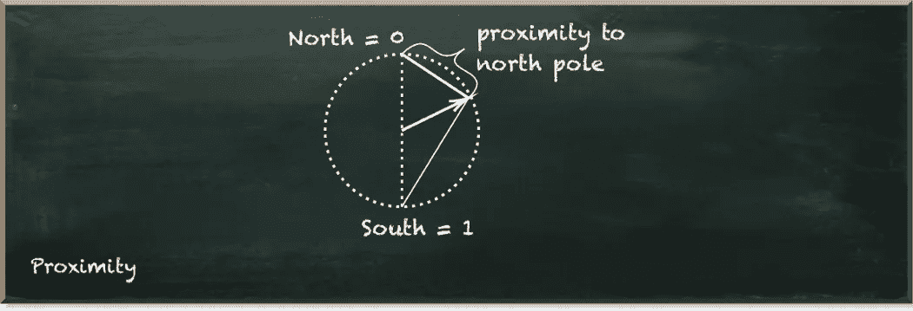
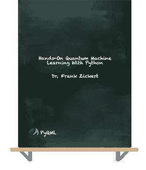

# 离散化的量子比特在实际中有效吗？

> 原文：[`towardsdatascience.com/do-discretized-qubits-work-in-practice-60acf19fc68c`](https://towardsdatascience.com/do-discretized-qubits-work-in-practice-60acf19fc68c)

## 如果量子比特不仅仅是 0 或 1 会怎么样？

[](https://pyqml.medium.com/?source=post_page-----60acf19fc68c--------------------------------)[](https://towardsdatascience.com/?source=post_page-----60acf19fc68c--------------------------------) [Frank Zickert | 量子机器学习](https://pyqml.medium.com/?source=post_page-----60acf19fc68c--------------------------------)

·发布于 [Towards Data Science](https://towardsdatascience.com/?source=post_page-----60acf19fc68c--------------------------------) ·阅读时间 9 分钟·2023 年 1 月 18 日

--

想开始学习量子机器学习吗？请查看 [**Hands-On Quantum Machine Learning With Python**](https://www.pyqml.com/volume1?provider=medium&origin=discretizedqubit)**.**

机器学习模型变得越来越复杂，因此训练也越来越困难。以 ChatGPT 为例。在单个 GPU 上训练它将需要 355 年。

量子计算是一项有前景的技术，可能加速这种模型的训练。然而，它也带来了自身的一系列挑战。

量子比特（qubits）是我们在量子计算机中使用的基本单元。与经典比特只能是 0 或 1 不同，量子比特处于它们的两个基态|0⟩和|1⟩之间的复杂线性关系中，这种状态称为叠加态。



作者提供的图片

这使得它们极为强大。首先，这种关系不是离散的，而是连续的，这意味着量子比特可以取两个基态之间的任何值。其次，这种关系建立在复数之上——这些是二维结构——超出了我们习惯使用的一维数字的能力。

但问题来了。不幸的是，总是会有问题。

一旦我们测量一个量子比特，它会坍缩到它的基态之一。不可避免地，我们看到的只有 0 或 1。

此外，我们只有非常少量的量子比特。而且，我们拥有的量子比特容易出错。我们称它们为有噪声的。

显然，我们——算法开发者——无法增加可用的量子比特数量。这一挑战仍然留给了像 IBM 这样的硬件制造商。然而，我们可以尽可能高效地利用我们现有的少量量子比特。

为此，我[提出了离散化期望值的方法](https://medium.com/towards-data-science/how-to-get-the-most-out-of-your-quantum-bit-56d4dc535aa6)，从而通过一个量子比特编码多个值。

[](/how-to-get-the-most-out-of-your-quantum-bit-56d4dc535aa6?source=post_page-----60acf19fc68c--------------------------------) ## 如何最大限度地利用你的量子位

### 量子位中不仅仅是 0 和 1

towardsdatascience.com

期望值源于对电路的重复执行和量子位的测量。因此，例如，如果一个量子位在十次执行中只有三次是 1，它的期望值是`0.3`。

以下函数接受在 Qiskit 中运行量子电路得到的`counts`对象——IBM 的量子开发工具包。`blocks`参数表示我们希望使用的离散值的数量。

```py
def discretize(counts, blocks):
    weigthed = 0
    sum_count = 0
    print (counts)
    for key, value in counts.items():
        weigthed += int(key)*int(value*0.999*blocks)
        sum_count += value
    return int(weigthed/sum_count)
```

这个函数遍历`counts`对象中的所有项。这些项是键值对，例如`0: 300`，其中键(`0`)表示测量值，而值(`300`)表示我们观察到的次数。

我们将每个键与其值相乘，然后乘以块数，并稍微减少该值（乘以`0.999`）。这意味着我们将位于两个离散值之间的确切线上的值视为较低的值。

总体离散值是所有加权值的总和除以所有未加权值的总和。

这只是一个简短的函数。然而，让我们看看它在实践中的表现。

首先，我们编写一个辅助函数，为我们创建`counts`对象。

```py
from math import asin, sqrt
from qiskit import QuantumCircuit, execute, Aer
from qiskit.visualization import plot_histogram

def prob_to_angle(prob):
    return 2*asin(sqrt(prob))

def simulate_step(blocks, steps, current):
    qc = QuantumCircuit(1)

    qc.ry(prob_to_angle((current+0.5)/steps), 0)

    # Tell Qiskit how to simulate our circuit
    backend = Aer.get_backend('statevector_simulator') 

    # Do the simulation, returning the result
    result = execute(qc,backend, shots=1000).result()

    # get the probability distribution
    counts = result.get_counts()

    return discretize(counts, blocks)
```

这个函数接受`blocks`、`steps`和`current`步骤作为参数。我会稍后解释这些。首先，让我们深入了解函数的定义。我们创建一个包含一个量子位的量子电路，并应用围绕 Y 轴的旋转。

[这篇文章](https://pyqml.medium.com/how-to-precisely-control-your-qubits-in-qiskit-357f44780725)详细解释了这个算子。

[](https://pyqml.medium.com/how-to-precisely-control-your-qubits-in-qiskit-357f44780725?source=post_page-----60acf19fc68c--------------------------------) [## 如何精确控制你在 Qiskit 中的量子位

### 实际中的 RY 算子

[这篇文章](https://pyqml.medium.com/how-to-precisely-control-your-qubits-in-qiskit-357f44780725?source=post_page-----60acf19fc68c--------------------------------)

本质上，`ry`门将默认状态|0⟩旋转到一个表示测量量子位为 1 的某个概率的状态。在这里，这个概率是`(current+0.5)/steps`。

然后，我们定义一个`backend`并`execute`量子电路，以获得`result`，它提供`counts`，我们对其进行`discretize`。

当我们使用这个辅助函数时，它的行为变得明显。

```py
import collections

blocks = 4
steps = 20
values = [simulate_step(blocks, steps, x) for x in range(steps)]
print (values)

sorted(collections.Counter(values).items(), key=lambda x: x[0])
```

这段代码的输出如下：

```py
{'0': 0.975, '1': 0.025}
{'0': 0.925, '1': 0.075}
{'0': 0.875, '1': 0.125}
{'0': 0.825, '1': 0.175}
{'0': 0.775, '1': 0.225}
{'0': 0.725, '1': 0.275}
{'0': 0.675, '1': 0.325}
{'0': 0.625, '1': 0.375}
{'0': 0.575, '1': 0.425}
{'0': 0.525, '1': 0.475}
{'0': 0.475, '1': 0.525}
{'0': 0.425, '1': 0.575}
{'0': 0.375, '1': 0.625}
{'0': 0.325, '1': 0.675}
{'0': 0.275, '1': 0.725}
{'0': 0.225, '1': 0.775}
{'0': 0.175, '1': 0.825}
{'0': 0.125, '1': 0.875}
{'0': 0.075, '1': 0.925}
{'0': 0.025, '1': 0.975}
[0, 0, 0, 0, 0, 1, 1, 1, 1, 1, 2, 2, 2, 2, 2, 3, 3, 3, 3, 3]
[(0, 5), (1, 5), (2, 5), (3, 5)]
```

那么，这里发生了什么？

首先，我们定义将我们量子位的期望值离散化为四个`blocks`。我们希望用 20 个`steps`来评估这个函数。因此，我们为每个当前步骤(`x`)运行电路。

输出的前几行表示`counts`在`discretize`函数内部打印的结果。如你所见，当测量量子比特为 1 的概率增加时，测量其为 0 的概率则减少。该概率表示当前步骤与总步骤数之间的比率。这就是我们通过`prob_to_angle((current+0.5)/steps)`计算的内容。

下一行展示了离散化值的列表。如我们所见，前五个项对应值为`0`，接下来的五个项对应值为`1`，以此类推。

最后一项输出显示了离散化值的分布。每个值从`0`到`3`出现五次。由于我们有 20 个步骤，这表明离散化工作正常。

但这仍然不是一个真正的测试。我们使用了准备完美量子态及其确切`counts`的`statevector_simulator`。

但，测量量子态只能通过经验获得。在现实中我们不能计算更大量子电路的完美量子态。如果可以的话，就没有理由去构建和使用量子计算机了。

所以，接下来的辅助函数使用`qasm_simulator`来经验性地创建`counts`。

```py
def simulate_step_qasm(blocks, steps, current):
    qc = QuantumCircuit(1)

    qc.ry(prob_to_angle((current+0.5)/steps), 0)
    qc.measure_all()

    # Tell Qiskit how to simulate our circuit
    backend = Aer.get_backend('qasm_simulator') 

    # Do the simulation, returning the result
    result = execute(qc,backend, shots=1000).result()

    # get the probability distribution
    counts = result.get_counts()

    return discretize(counts, blocks)
```

仅有两个区别。首先，我们使用了`qasm_simulator`而不是`statevector_simulator`。其次，我们在应用`ry`门后测量量子比特。

让我们看看结果。

```py
values = [simulate_step_qasm(blocks, steps, x) for x in range(steps)]
print (values)
sorted(collections.Counter(values).items(), key=lambda x: x[0])
```

```py
{'1': 29, '0': 971}
{'1': 74, '0': 926}
{'1': 130, '0': 870}
{'1': 161, '0': 839}
{'1': 218, '0': 782}
{'0': 742, '1': 258}
{'1': 325, '0': 675}
{'0': 621, '1': 379}
{'0': 599, '1': 401}
{'0': 506, '1': 494}
{'1': 516, '0': 484}
{'0': 447, '1': 553}
{'0': 390, '1': 610}
{'0': 318, '1': 682}
{'0': 284, '1': 716}
{'0': 225, '1': 775}
{'0': 169, '1': 831}
{'1': 871, '0': 129}
{'0': 67, '1': 933}
{'0': 20, '1': 980}
[0, 0, 0, 0, 0, 1, 1, 1, 1, 1, 2, 2, 2, 2, 2, 3, 3, 3, 3, 3]
[(0, 5), (1, 5), (2, 5), (3, 5)]
```

我们看到`counts`的分布不再那么完美。然而，离散化仍然有效。我们看到每个离散值恰好出现了五次。

但我们还没有完全到达目标。尽管我们在结果中看到统计偏差，`qasm_simulator`模拟的是无噪声的量子计算机。然而我们目前还没有这样的设备。

相反，我们当前的设备容易出错。它们是有噪声的。我们来增加一些噪声。

```py
from qiskit import transpile
from qiskit.providers.fake_provider import FakeQuito
from qiskit.providers.aer import AerSimulator

# create a fake backend
device_backend = FakeQuito()

# create a simulator from the backend
sim_quito = AerSimulator.from_backend(device_backend)

def simulate_step_noise(blocks, steps, current):
    qc = QuantumCircuit(1)

    qc.ry(prob_to_angle((current+0.5)/steps), 0)
    qc.measure_all()

    # Tell Qiskit how to simulate our circuit
    # transpile the circuit
    mapped_circuit = transpile(qc, backend=sim_quito)

    # run the transpiled circuit, no need to assemble it
    result = sim_quito.run(mapped_circuit, shots=1000).result()

    # get the probability distribution
    counts = result.get_counts()

    return discretize(counts, blocks)
```

虽然电路保持不变，这次我们创建了另一个后端。我们创建了一个模拟器，其噪声特性与 IBM 在基多的量子计算机相同。这是一台通过 IBM 云提供的五量子比特量子计算机。

```py
values = [simulate_step_noise(blocks, steps, x) for x in range(steps)]
print (values)
sorted(collections.Counter(values).items(), key=lambda x: x[0])
```

```py
{'1': 55, '0': 945}
{'1': 83, '0': 917}
{'0': 855, '1': 145}
{'1': 177, '0': 823}
{'1': 230, '0': 770}
{'0': 700, '1': 300}
{'1': 319, '0': 681}
{'0': 619, '1': 381}
{'0': 617, '1': 383}
{'0': 539, '1': 461}
{'0': 496, '1': 504}
{'1': 541, '0': 459}
{'0': 407, '1': 593}
{'1': 623, '0': 377}
{'1': 663, '0': 337}
{'0': 284, '1': 716}
{'0': 219, '1': 781}
{'0': 178, '1': 822}
{'1': 862, '0': 138}
{'0': 80, '1': 920}
[0, 0, 0, 0, 0, 1, 1, 1, 1, 1, 2, 2, 2, 2, 2, 2, 3, 3, 3, 3]
[(0, 5), (1, 5), (2, 6), (3, 4)]
```

我们看到`counts`的偏差甚至更大。因此，我们看到一个错误的离散化。在`{0: 284, 1: 716}`的情况下，我们将一个`3`误认为是`2`。如果我们仅将`counts`解释为 0 或 1，我们肯定不会看到错误。相关项显然更接近 1 而不是 0。

否则，结果并不太糟。事实上，我们来看一下如果我们将期望值解释为八个值而不是四个值会发生什么。

```py
steps = 24
blocks = 8
values = [simulate_step_noise(blocks, steps, x) for x in range(steps)]
print (values)
sorted(collections.Counter(values).items(), key=lambda x: x[0])
```

```py
{'1': 45, '0': 955}
{'1': 71, '0': 929}
{'1': 132, '0': 868}
{'1': 134, '0': 866}
{'0': 811, '1': 189}
{'1': 202, '0': 798}
{'1': 266, '0': 734}
{'0': 700, '1': 300}
{'1': 325, '0': 675}
{'1': 368, '0': 632}
{'1': 413, '0': 587}
{'1': 440, '0': 560}
{'1': 486, '0': 514}
{'1': 530, '0': 470}
{'1': 580, '0': 420}
{'1': 623, '0': 377}
{'0': 354, '1': 646}
{'0': 301, '1': 699}
{'0': 275, '1': 725}
{'0': 226, '1': 774}
{'0': 213, '1': 787}
{'1': 825, '0': 175}
{'0': 121, '1': 879}
{'0': 97, '1': 903}
[0, 0, 1, 1, 1, 1, 2, 2, 2, 2, 3, 3, 3, 4, 4, 4, 5, 5, 5, 6, 6, 6, 7, 7]
[(0, 2), (1, 4), (2, 4), (3, 3), (4, 3), (5, 3), (6, 3), (7, 2)]
```

我们预计每个离散值会出现三次。因此，尽管结果并非完全不合理，但我们在这里看到相当多的错误。

所以，离散化的期望值增加了对噪声的敏感性。但错误缓解技术，如零噪声外推技术（ZNE）或 Clifford 数据回归（CDR），帮助我们减轻噪声的负面影响。

[](/how-to-implement-quantum-error-mitigation-with-qiskit-and-mitiq-e2f6a933619c?source=post_page-----60acf19fc68c--------------------------------) ## 如何用 Qiskit 和 Mitiq 实施量子误差缓解

### 了解如何实施 Clifford 数据回归

towardsdatascience.com

## 结论

尽管我们不能轻易增加可用的量子比特数量，但能够编码四个甚至八个值而不是仅两个值的能力可能在使用当前量子计算机时成为决定性因素。虽然我们无法轻易增加可用的量子比特数量，但我们可以使用适当的技术，如离散化。结合误差缓解技术，我们可能会使我们少量的量子比特显得更大。

[](https://pyqml.medium.com/membership?source=post_page-----60acf19fc68c--------------------------------) [## 使用我的推荐链接加入 Medium - Frank Zickert | 量子机器学习

### 开始学习量子机器学习（并获得对 Medium 上所有故事的完全访问权限）。获取完整访问权限…

pyqml.medium.com](https://pyqml.medium.com/membership?source=post_page-----60acf19fc68c--------------------------------)

不要错过下一集，订阅我的[Substack 频道](https://pyqml.substack.com/)。

想开始学习量子机器学习吗？可以看看[**动手实践量子机器学习与 Python**](https://www.pyqml.com/volume1?provider=medium&origin=discretizedqubit)**。**



免费获取前三章[这里](https://www.pyqml.com/volume1?provider=medium&origin=discretizedqubit)。
