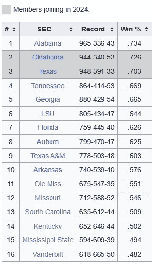
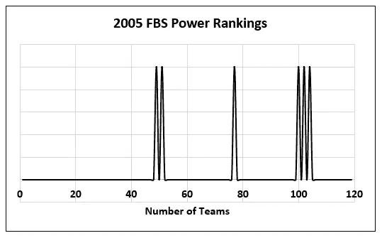
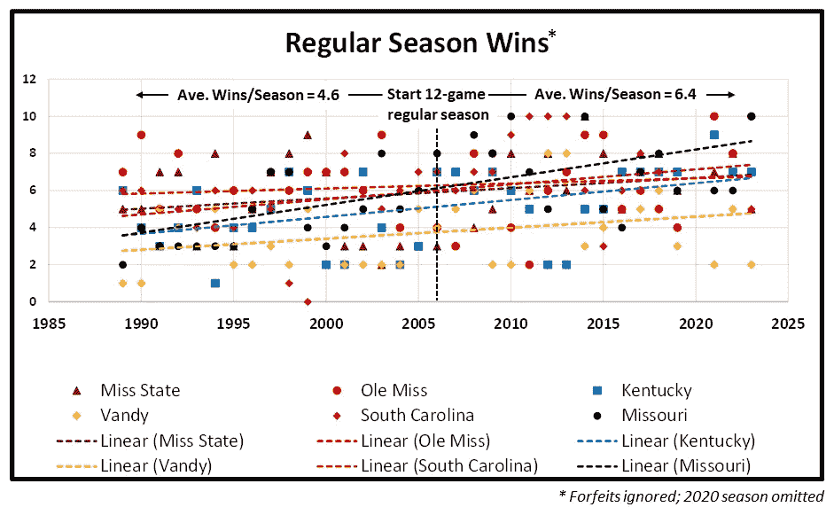
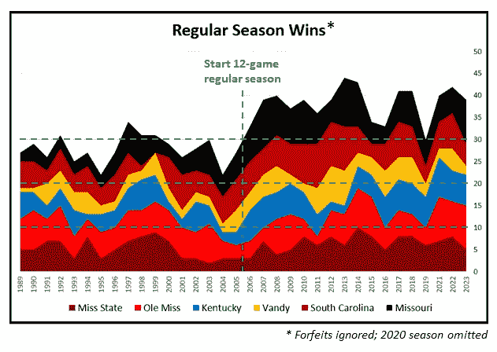
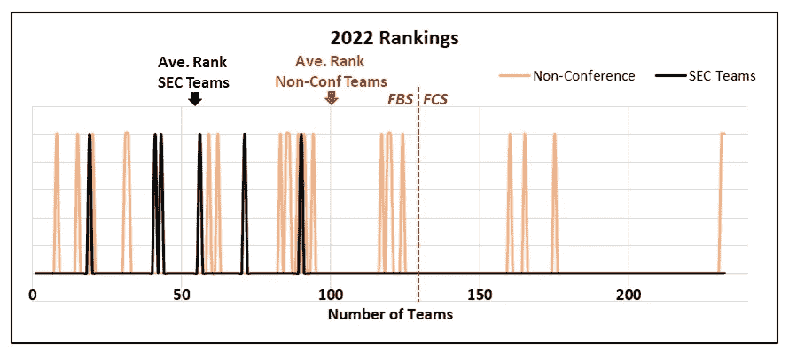
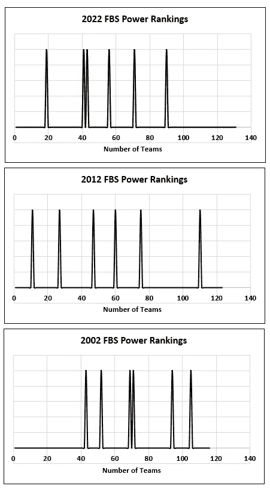

# 更多的比赛是否意味着更多的胜利？

> 原文：[`towardsdatascience.com/do-more-games-mean-more-wins-1589568a563b?source=collection_archive---------7-----------------------#2023-12-28`](https://towardsdatascience.com/do-more-games-mean-more-wins-1589568a563b?source=collection_archive---------7-----------------------#2023-12-28)

## 快速成功数据科学

## 在大学橄榄球中，确实如此。

 [Lee Vaughan](https://medium.com/@lee_vaughan?source=post_page-----1589568a563b--------------------------------)

·

[关注](https://medium.com/m/signin?actionUrl=https%3A%2F%2Fmedium.com%2F_%2Fsubscribe%2Fuser%2F5d604015c08b&operation=register&redirect=https%3A%2F%2Ftowardsdatascience.com%2Fdo-more-games-mean-more-wins-1589568a563b&user=Lee+Vaughan&userId=5d604015c08b&source=post_page-5d604015c08b----1589568a563b---------------------post_header-----------) 发表在[Towards Data Science](https://towardsdatascience.com/?source=post_page-----1589568a563b--------------------------------) ·6 分钟阅读·2023 年 12 月 28 日

--

照片由[Dave Adamson](https://unsplash.com/@aussiedave?utm_content=creditCopyText&utm_medium=referral&utm_source=unsplash)拍摄，[Unsplash](https://unsplash.com/photos/a-close-up-of-a-leather-object-with-a-banana-on-it-EnX2W4WtHLg?utm_content=creditCopyText&utm_medium=referral&utm_source=unsplash)

我有一个让人讨厌的朋友，他喜欢在每次机会中吹嘘他母校的橄榄球队。在过去几年里，他的球队赢得了比以往更多的*常规赛*胜利（比*一个*胜场）。现在他在炫耀这些，回顾（远远）过去母校的辉煌岁月。唯一的问题是，回到 1950 年代和 60 年代，球队只打*10*场常规赛。

1970 年代，这个数字增加到了 11。

2006 年，这个数字增加到了 12。

1960 年赢得 10 场比赛中的 9 场，胜率为 90%。今天赢得 12 场中的 10 场，仅为 83%。所以，赢得 10 场比赛并不像听起来那么出色。

但事情不仅仅如此。如果额外的比赛平均来说是*更容易赢*的，那打破旧记录就会显得*不那么*令人印象深刻。

数据科学的好处在于**你不必为你能证明的事情争论**。一个好的数据科学家应该能够进行分析性思考，并将数据用于其目的。

在这篇文章中，我们将评估*增加*比赛数量对*赢得*比赛的影响。这将涉及普遍的数据科学实践，如制定前提、设计分析、选择适当的数据和呈现结果。

具体来说，我们将评估将常规赛从 11 场比赛增加到 12 场比赛的影响。为了平滑教练更换和不断演变的规则和规定的影响，我们将使用我朋友的母校和其他五所具有类似足球传统的学校，覆盖 34 个赛季，包括 2006 年。

# 思维实验

在开始之前，我们做一个思维实验。如果一所大学橄榄球强校（如阿拉巴马、俄亥俄州立大学或俄克拉荷马）在他们的赛程中增加一支随机球队，他们可能会*赢得*这场额外的比赛，因为他们比大多数其他球队*更强*。

同样，底层球队由于足球传统较少，预计会*输掉*这场额外的比赛，因为大多数其他球队*比他们更好*。

理论上，中等水平的球队——假设他们是从*全部名单*中随机抽取——赢得这场额外比赛的概率大约是 50%。这将导致他们的记录*平均*提升*0.5*场比赛，所有条件相等。因此，将会有些年份，他们有*机会*赢得比历史上多*一场比赛*。

# 设计方法

正如罗纳德·里根所说，“信任但需验证。”对于中等水平的球队，现实是否符合这一理论？他们平均每年会多赢得 0.5 场比赛吗？

为了验证这一点，我查看了六支经常在强大的东南会议（SEC）中排名下半部分的球队：

+   奥尔·密斯

+   密苏里

+   南卡罗来纳

+   肯塔基

+   密西西比州立

+   范德比尔特

按历史胜率排名的 SEC 球队（[Wikipedia](https://en.wikipedia.org/wiki/Southeastern_Conference)）

这些球队的[Congrove 计算机排名](https://www.collegefootballpoll.com/rankings/year/2005/)将他们排在 2005 年 FBS 球队的中下游，即 12 场常规赛开始的前一年。

2005 年对六支球队的排名（由作者和[collegefootballpoll.com](https://www.collegefootballpoll.com/rankings/year/2005/)提供）

> **注意：** *足球碗分区*，前身为*第一分区 A*，是美国最高级别的大学足球赛事。FBS 包括了最大的全国大学体育协会（NCAA）学校。截至 2023 年，FBS 中共有 133 支球队。

分析涵盖了 1989–2023 年，但省略了因疫情缩短的 2020 赛季。这使得 2006 年 12 场比赛季开始前后的 17 个赛季都被考虑在内。

胜负记录来源于维基百科。被取消的胜场被计为胜场。

密西西比州立大学、奥尔·密西西比大学、肯塔基大学和范德比尔特大学在 1992 年之前每个赛季打七场联盟比赛，从那时起改为八场。

南卡罗来纳州在 1992 年加入 SEC，开始每年打八场联盟比赛。在此之前，他们与主要的联盟球队（SEC、ACC、Big East）和一些强大的独立球队（包括佛罗里达州立大学和西弗吉尼亚大学）进行混合比赛。

密苏里州在 2012 年加入 SEC，开始每年打八场联盟比赛。在此之前，他们参加了类似的大 12 联盟，每年打七场联盟比赛，1996 赛季后改为八场。

# 结果

下图展示了分析结果，以散点图和线性趋势线呈现。所有趋势线都有正斜率，其中密苏里州进步最大，奥尔·密西西比进步最小。

1989–2023 年每队常规赛胜场的散点图（作者提供）

在 12 场常规赛开始前的 17 年中，这六支球队平均赢得 4.63 场比赛。在随后的 17 年中，他们平均赢得 6.37 场比赛。因此，平均而言，他们在每赛季打 12 场比赛时多赢了 1.74 场比赛。

这里有另一个视图，使用*堆叠面积图*。颜色区域“越厚”，胜场数越高。2006 年后，“平台高度”有显著变化。

针对分析的六支球队的堆叠面积图（作者提供）

# 含义

对于分析中的*所有*球队，额外的比赛都是*非联盟*比赛。这意味着学校对日程安排有更多控制权。

如果他们选择了*同等*强度的对手，我们会预期未来会有*平衡*，导致每赛季*0.5 场*的胜场改进，因为每支球队的胜率大约为 50%。事实上，他们每赛季平均多赢得*1.74 场*比赛，表明他们利用这一额外的比赛来*填充*日程安排，增加与实力较弱的对手的比赛。

这一点在 2022 赛季中显而易见，如下图所示。尽管有少数强劲的非联盟对手（例如南卡罗来纳州与克莱姆森有传统的对抗），但六支 SEC 球队的平均排名几乎是对手的两倍。其中一些对手甚至来自较低级别的*足球冠军分区（FCS）*。

2022 年 6 支 SEC 球队与其非会议对手的排名（由作者使用[collegefootballpoll.com](https://www.collegefootballpoll.com/rankings/year/2002/)制作）

> **注：**为了将前图中的 FBS 和 FCS 排名合并，我将 FCS 排名加到 2022 年 FBS 的总球队数（131）中。因此，FCS 排名 5 变成了 136（5 + 131）。

当然，实现每个常规赛季平均提升 1.7 场比赛不仅仅是增加一场简单的比赛。过去二十年中，这六支球队努力提升了他们的项目，基于[collegefootballpoll.com](https://www.collegefootballpoll.com/rankings/year/2002/)的计算机排名，这一点得到了体现。

2002 年、2012 年和 2022 年六支球队的赛季末排名（由作者和[collegefootballpoll.com](https://www.collegefootballpoll.com/rankings)制作）

一般更高的排名是否与自 2006 年以来每年增加的一场可赢得的比赛有关？也许有关。但他们每赛季平均多赢*两*场比赛的事实表明，还有其他因素在起作用，例如设施、教练、招募等方面的改进。

# 结论

这是一个小项目，但它突出了数据科学将逻辑思维、硬数据和结构化分析结合在一起，以解决一个论点的能力。

毕竟，仅仅因为你的中等水平大学橄榄球队偶尔有了 9 或 10 场胜利的赛季，而过去从未超过 7 或 8 场胜利，这可能并不那么令人印象深刻。现在的球队比过去打更多的比赛，其中至少一场可能是故意安排的弱队。

# 谢谢！

感谢阅读，未来请关注我更多的*快速成功数据科学*项目。
