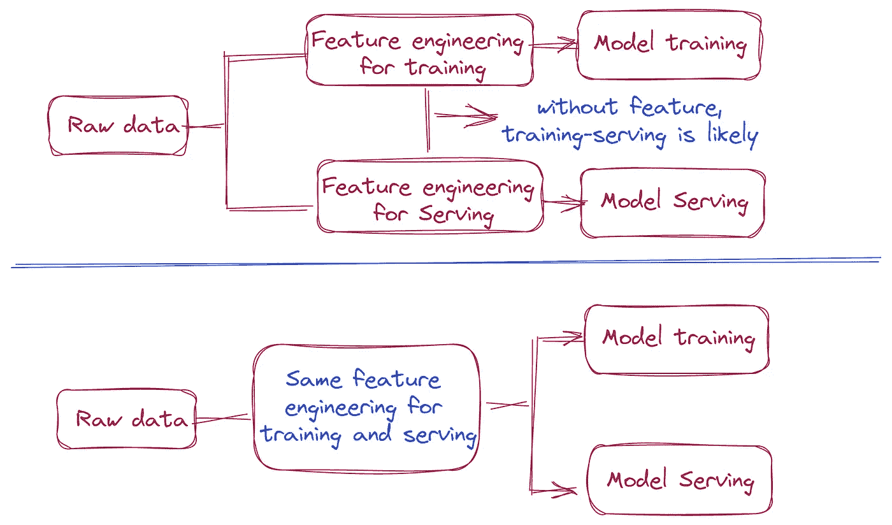
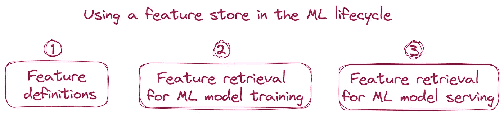

# 你真的需要一个特征存储吗？

> 原文：[`towardsdatascience.com/do-you-really-need-a-feature-store-f71cf9586158`](https://towardsdatascience.com/do-you-really-need-a-feature-store-f71cf9586158)

## 特征存储——原始数据与机器学习模型之间的接口

 [YUNNA WEI](https://medium.com/@weiyunna91?source=post_page-----f71cf9586158--------------------------------)

·发布于 [Towards Data Science](https://towardsdatascience.com/?source=post_page-----f71cf9586158--------------------------------) ·8 分钟阅读·2023 年 3 月 17 日

--

“特征存储”已经存在了几年。既有开源解决方案（如 [Feast](https://feast.dev/) 和 [Hopsworks](https://www.hopsworks.ai/open-source-hopsworks)），也有商业产品（如 [Tecton](https://www.tecton.ai/)、[Hopsworks](https://www.hopsworks.ai/open-source-hopsworks)、[Databricks Feature Store](https://docs.databricks.com/machine-learning/feature-store/index.html)）。已经有很多关于“特征存储”的文章和博客发布，解释了什么是“特征存储”，以及为什么“特征存储”是有价值的。一些组织也已经将“特征存储”纳入了他们的机器学习应用程序。然而，值得指出的是，“特征存储”是你整体机器学习基础设施中新增的一个组件，它需要额外的投资和努力来建设和运维。因此，有必要真正理解和讨论***“特征存储对每个组织来说真的必要吗？”***。在我看来，答案一如既往，这要视情况而定。

因此，今天文章的重点是分析何时需要特征存储，以便组织能够明智地投资于那些能够真正为业务增加价值的机器学习技术。

为了回答这个问题，以下是一些关键的考虑因素：

+   你们的机器学习应用程序需要什么样的特征？

+   你们组织管理的机器学习应用程序类型是什么？

+   是否需要在组织中的不同团队之间共享和重用特征？

+   训练与服务之间的偏差是否经常成为负面影响机器学习模型性能的问题？

除了回答上述问题，我还将解释特征存储在端到端机器学习生命周期中的角色，如果你认为特征存储对你们组织的机器学习基础设施是必要的。

让我们详细探讨上述每一个考虑因素。

照片由[特尔纳瓦大学](https://unsplash.com/@trnavskauni?utm_source=medium&utm_medium=referral)提供，发表于[Unsplash](https://unsplash.com/?utm_source=medium&utm_medium=referral)

## 你的机器学习应用需要哪些功能？

机器学习应用的特征大致可以分为以下几类：

+   批处理特征 — 这些特征在大多数时间内保持不变，例如客户的元数据，包括教育背景、性别、年龄等。此外，批处理特征通常涉及实体的元数据，这些实体通常是关键的业务实体，如客户、产品、供应商等。批处理特征的输入数据源通常是数据仓库和数据湖。

+   流处理特征 — 与批处理特征不同，流处理特征是需要在低延迟情况下不断更新的特征。例如，用户在过去 30 分钟内的交易数量。流处理特征通常由流处理引擎计算，如 Spark Structured Streaming 或 Apache Flink，并直接推送到在线特征存储中以实现低延迟服务。流处理特征的输入数据源是消息存储，如 Kafka、Kinesis 和 Event hub。

+   结合批处理和流处理的高级特征 — 需要将流数据与静态数据结合，以生成供机器学习模型学习的新特征。这类特征也由流处理引擎计算，因为它也需要低延迟。与流处理特征的唯一区别是它需要与另一个数据源进行连接。

如果你的机器学习应用需要大量的流处理特征，并且这些特征需要在非常低的延迟下提供服务，那么在线特征存储可以带来显著的价值，因为特征存储的关键功能之一是允许你预计算这些流处理特征，而不是在模型服务时计算，这可能会显著降低模型服务的速度。

## 你的组织管理的机器学习应用类型是什么？

第二个考虑因素是明确你的组织管理的机器学习应用类型。每种类型的机器学习应用需要的机器学习基础设施差异较大。

我将机器学习应用分为以下三类：

+   第一类是批处理特征工程 + 批处理推断：特征工程、模型训练和模型服务都在固定的时间间隔内进行。无需流处理特征，模型服务的延迟也不需要非常低。在这种情况下，你不需要在线特征存储和流处理来预计算特征，因为你有足够的时间按需计算特征。

+   第二类是批量训练 + 在线推断（具有批量和流式特性）：机器学习模型在批量级别进行训练，但模型通常被包装成 API 进行在线服务。在这种情况下，为了决定是否需要特征存储，有两个重要的考虑因素。第一个是服务延迟，第二个是需要实时计算的特征数量。如果服务延迟非常低，并且有相当多的特征需要在非常严格的时间限制内计算，那么你很可能需要特征存储的支持来预计算这些特征，以便在服务机器学习模型时，可以从在线特征存储中获取所需特征，而不是实时计算它们。在线存储是一个数据库，仅存储每个实体的最新特征值，例如 Redis、DynamoDB 和 PostgreSQL。相反，如果模型服务的延迟不低，且模型服务所需的特征数量较少，你可能仍然可以实时计算特征，因此在线特征存储不是绝对必要的。

根据我的经验，需要流式特征和极低延迟服务的机器学习应用通常是操作性机器学习应用，如欺诈检测、推荐、动态定价和搜索。对于这些类型的机器学习应用，特征存储的功能是将特征计算与特征消费解耦，以便复杂的特征工程逻辑不需要按需计算。

## 是否需要在组织内的各种团队之间共享和重用特征？

第三个考虑因素是是否需要在组织内的各种团队之间共享和重用特征。

特征存储的关键功能之一是集中式特征注册表，用户可以在其中持久化特征定义和相关的特征元数据。用户可以通过与注册表互动来发现注册的特征数据。注册表作为组织内所有机器学习特征的信息的唯一真实来源。

对于拥有多个数据科学团队的组织，特别是当这些团队可能会重复生产类似特征时，拥有一个集中式特征存储可以显著改善团队合作和数据科学团队的生产力，使团队能够发布、共享和重用机器学习特征。通常，建立和维护数据工程管道以策划机器学习应用所需的特征需要大量工程工作。如果一个团队可以重用另一个团队已经策划的特征，则可以显著减少重复的工程工作并节省大量工程时间。

另外，拥有特征存储提供了一种机制，允许企业管理机器学习特征的使用，这实际上是业务中一些最精心策划和精炼的数据资产。

## 训练-服务偏差是否常常是一个负面影响机器学习模型性能的问题？

下一步的考虑是训练-服务偏差，这通常是一个负面影响机器学习模型性能的问题。训练-服务偏差是指在生产环境中部署的机器学习模型的表现比数据科学家在其本地笔记本环境中开发和测试的模型更差。训练-服务偏差的主要原因是生产环境中的特征工程逻辑与数据科学家在笔记本环境中创建和使用的原始特征工程逻辑实现方式不同（可能只是略有不同）。

特征存储可以通过创建一个一致的特征接口来修复训练-服务偏差，其中模型训练和模型服务使用相同的特征工程实现，如下图所示。

如果训练-服务偏差是你的机器学习应用在生产环境中表现不如预期的常见原因，特征存储可以成为救星。

训练-服务偏差 | 图片来源：作者

## 那么，特征存储在端到端机器学习生命周期中处于什么位置

基于以上分析，如果你已经决定特征存储对你的机器学习应用有帮助，并且你打算将其作为机器学习基础设施的新组件，以下是如何在端到端机器学习生命周期中使用特征存储的说明。

+   特征定义 — 数据科学家可以从原始数据中定义所需的特征。特征定义包括源数据、特征实体、特征名称、特征模式、特征元数据和生存时间（TTL）。

+   机器学习模型训练的特征检索 — 大多数特征存储解决方案提供的功能允许数据科学家从定义的特征构建训练数据集。单个训练数据集可能需要从多个特征表中提取特征。

+   机器学习模型服务的特征检索 — 机器学习模型服务有两种类型：批处理评分和实时预测。获取批处理评分的特征与获取机器学习模型训练数据集的特征类似，不同之处在于批处理评分的特征具有最新的时间戳。获取实时预测的特征是为特定预测请求获取特征向量。特征向量通常是非常小的数据，因为它仅包含请求实体的最新特征值。

在机器学习生命周期中使用特征存储 | 图片来源：作者

## 总结

如果你正在推出需要大量流式特性的实时预测用例，特性存储可以通过解耦特性计算和特性服务来帮助你实现低延迟服务要求。

如果你们组织的数据科学团队迅速扩展，并且需要在各种机器学习团队之间共享和重用工作，特性存储可以作为一个中心注册库，用于发布和重用特性。

我希望这篇文章能够帮助你决定是否需要为你的组织设置特性存储。如果你有任何问题，请随时留言。我通常每周发布一篇与构建高效数据和人工智能堆栈相关的文章。欢迎关注我的 Medium，以便在这些文章发布时获得通知。

如果你想查看更多有关现代和高效数据+人工智能堆栈的指南、深度探讨和见解，请订阅我的**免费**通讯 — [***高效数据+人工智能堆栈***](https://yunnawei.substack.com/)，谢谢！

注：以防你还没有成为 Medium 会员，而你真的应该成为，因为你将获得对 Medium 的无限访问权限，你可以使用我的[推荐链接](https://medium.com/@weiyunna91/membership)进行注册！

非常感谢你的支持！
