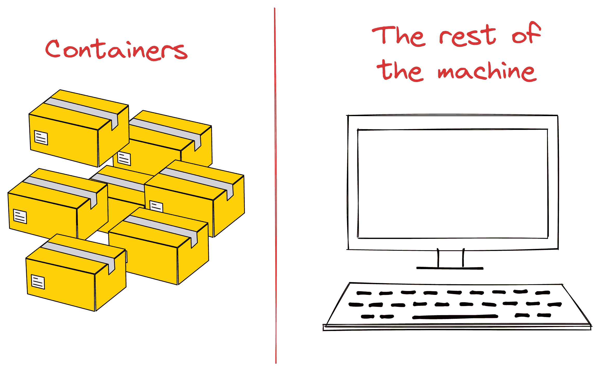

# 现代数据科学家的 Docker：2023 年你不能忽视的 6 个概念

> 原文：[`towardsdatascience.com/docker-for-the-modern-data-scientists-6-concepts-you-cant-ignore-in-2023-8c9477e1f4a5`](https://towardsdatascience.com/docker-for-the-modern-data-scientists-6-concepts-you-cant-ignore-in-2023-8c9477e1f4a5)

## 一本关于酷炫、必备工具的插图指南

[](https://ibexorigin.medium.com/?source=post_page-----8c9477e1f4a5--------------------------------)[](https://towardsdatascience.com/?source=post_page-----8c9477e1f4a5--------------------------------) [Bex T.](https://ibexorigin.medium.com/?source=post_page-----8c9477e1f4a5--------------------------------)

·发表于 [Towards Data Science](https://towardsdatascience.com/?source=post_page-----8c9477e1f4a5--------------------------------) ·11 分钟阅读·2023 年 6 月 7 日

--


图片由我使用 Leonardo AI 制作

这是我见过的最搞笑的 meme 之一：

它涉及到的不仅仅是数据科学和机器学习中的一个最棘手的问题，而是所有编程中的难题——共享应用程序/脚本，并使这些东西在其他人的机器上也能正常工作。

尽管微软、苹果和林纳斯·托瓦兹在发布不同的操作系统时出于好意，但他们无意中创造了软件兼容性的无尽挣扎。

Linux、Windows、macOS——每个操作系统都有其独特的怪癖和特性。别忘了 Python 版本、库版本的差异以及机器学习中 GPU 驱动程序的不可预测性。

进入容器。虽然它们已经存在一段时间以解决这个问题，但自 2013 年 Docker 发布以来，它们才获得了巨大的普及。从那时起，Docker 及其容器已经成为共享任何运行代码的工具的首选。

因此，本教程将突出六个最重要的概念，以帮助你作为数据科学家或机器学习工程师在复杂的 Docker 世界中导航。

## 小提示

像许多其他伟大的软件一样，与 Docker 的交互非常直观且容易。你只需多读几遍文档，就能知道如何充分利用这个工具。

这就是为什么我们更关注每个命令背后的理论——这些更难理解，而文档几乎总是解释得不好。

因此，在整个教程中，我将更注重于概念而非代码，但会根据需要适时加入一些相关页面以深入了解某些内容。

让我们开始吧！

## 0\. 为什么不用 ZIP 文件？


图片由我制作

为什么要学习一个全新的工具，既然你可以将模型的所有代码和数据集放入 zip 文件中并分享？这就像寄一盒乐高砖块给朋友让他们建造一辆车，而不是直接把现成的车开到朋友家。

有几个很好的理由来考虑使用 Docker，而不是 zip 文件或其他方法：

1.  **依赖和兼容性混乱**：zip 文件不关心主机系统。它们就像环球旅行的游客，期望每台机器都能说他们的语言。但不同的操作系统有不同的架构，这在处理各种库和依赖及其版本时可能会成为一个巨大问题。

1.  **可重复性问题**：想象一下，当有人尝试运行你的 zip 文件时出现了问题。这是代码中的 bug 还是环境相关的问题？这可能导致几个小时的挫败性调试，甚至让最有耐心的人也会抓狂。

1.  **隔离假象**：使用 zip 文件，你事先无法了解其内容，解压它就像把一群调皮的老鼠释放到你的操作系统中。你无法控制它们会在哪里运行，并可能造成破坏。恶意人士可以利用这种混乱，导致安全攻击。

1.  **部署困境**：从 zip 文件中部署模型通常涉及繁琐的手动配置、环境设置和依赖管理。这就像每次搬到新城市时都要从头开始建造一座房子。

总而言之，虽然 zip 文件可能看起来是共享应用程序的最简单方式，但它们无法匹敌 Docker 容器的强大和优势。

但你问，*容器*究竟是什么？我们接下来回答这个问题。

## 1. Docker 容器

容器就像你机器上的迷你操作系统，与 Spotify、Chrome、Photoshop、游戏等其他进程和应用程序隔离开来。它们可以直接访问你机器的资源，包括 RAM、CPU、磁盘，有时甚至是 GPU，从而能够运行任何软件并进行自定义配置。



由我制作的图像

这些轻量级和可移植的计算环境旨在提供运行机器学习模型所需的一切，并且可以在隔离环境中运行而不会干扰主机上的其他进程。它们只使用了可用资源的一小部分，确保你的机器其余部分不受影响。


由我制作的图像

另一个显著的优点是容器能够保证结果的一致性。无论是一天、一个月还是一年，对于相同的输入，输出结果都将保持不变。但这还不是全部——容器还保证在任何地方的一致性。无论是在你的个人笔记本电脑、邻居的旧 Windows 机器，还是在云端（AWS、Azure、GCP），它们的运行方式都是相同的。


图片由我提供

容器的另一个显著好处是它们的高安全性和隔离性。即使你在容器内搞得一团糟，也可以放心，这些混乱不会泄露到你机器的其他部分或影响其他容器。一切都在容器内*得到很好的控制*。

此外，与虚拟机（VMs）等替代方案相比，容器更加轻量且资源需求最小。这种效率使你能够在现有操作系统上运行整个操作系统，如 Ubuntu、Debian 和 CentOS Linux 进程。

虽然有许多工具可以用于处理容器，但 Docker 脱颖而出，成为最好的工具。它是一个开源项目，拥有庞大的用户基础，是创建、管理和运行容器应用程序的首选工具。

## 2\. 虚拟化

容器强大能力而不会压倒主机的秘密在于虚拟化技术。

虚拟化在主操作系统内创建隔离的环境，使多个容器能够独立而高效地运行。


图片由我提供

虚拟化将主机资源，如 CPU、RAM 和磁盘，进行划分，并将每一部分呈现为单独的资源供软件使用。例如，64GB RAM 可以虚拟化为四个独立的 16GB RAM。

与虚拟机（VMs）通过硬件级别实现类似目标的虚拟化不同，容器是在软件级别进行虚拟化。它们利用主操作系统的内核，并共享底层操作系统资源。

这种方法实现了轻量和高效的虚拟化，使多个容器能够在单一主机上共存。启动和停止容器的过程开销最小，从而实现更快的更新和分发。

## 3\. Docker 镜像

使用 Docker 时，你可能经常会遇到“镜像”和“容器”这两个术语交替使用，但它们之间存在明显的区别。

Docker 镜像类似于包含详细说明和步骤的食谱，用于运行应用程序。另一方面，Docker 容器就像是一道准备好的菜肴，将食谱变为现实——一个完全功能的实例。

尽管单个镜像可以有多个运行的容器实例，这些容器却独立操作，彼此之间互不知晓。

对于个人项目，你通常会构建自己的镜像。然而，对于许多任务，社区已经提供了许多预构建的镜像。

例如，Docker Hub 是最大的注册中心，托管着超过一百万个镜像，只需几条终端命令，你就可以在机器上安装 Docker。

这个注册表包含了各种操作系统（Ubuntu、CentOS、Debian）、软件栈和编程语言（Node.js、Python、MySQL、Nginx）、数据库、预打包和预配置的机器学习框架（TensorFlow、PyTorch 支持 GPU、Sklearn）等的官方镜像，还有更多。

举例来说，假设你想下载 Python 3.12 的官方候选版并开始在你的机器上使用它。你可以通过简单的两个命令来完成这一操作：

```py
$ docker pull python:3.12-rc-bullseye
$ docker run -it python:3.12-rc-bullseye
```

第二个带有 `-it` 标志的命令将在从 `python:3.12-rc-bullseye` 镜像创建的容器内启动一个交互式终端。这个运行中的容器实例将类似于一个仅装备了 Python 3.12 的迷你操作系统，没有安装其他任何东西。

然而，就像任何 Ubuntu 发行版一样，你可以在容器内安装额外的工具，比如 Git 或 Conda，并执行几乎任何你在 Ubuntu 中通常会做的任务，尽管没有图形用户界面（GUI）。

## 4\. Dockerfile

当我们调用 `[docker pull](https://docs.docker.com/engine/reference/commandline/pull/)` 和 `[docker run python](https://docs.docker.com/engine/reference/commandline/run/)` 时，容器如何知道从哪里获取 Python 3.12 的二进制文件及其所有依赖项并安装它们？

解决方案在于 Dockerfiles。这些文本文件是构建自定义镜像的蓝图或配方，封装了我们的 Python 脚本或机器学习模型，以及它们的依赖项和配置。

当你创建镜像时，你将广泛使用 Dockerfiles（每个目录/项目一个 Dockerfile）。虽然 Dockerfiles 对于复杂项目来说可能变得很长，但它们通常包括以下命令用于 Python 项目：

```py
# Use an official Python runtime as the base image
FROM python:3.9-slim

# Set the working directory inside the container
WORKDIR /app

# Copy the requirements file to the container
COPY requirements.txt .

# Install the required Python packages
RUN pip install --no-cache-dir -r requirements.txt

# Copy the rest of the application code to the container
COPY . .

# Define the command to run when the container starts
CMD ["python", "train.py"]
```

上面是一个用于将 `train.py` 脚本容器化的示例 Dockerfile，位于我们当前的工作目录中。以下是这些命令的概述：

1.  `FROM` - 一个用于指定基础镜像的关键字。基础镜像是 Docker Hub 上的预构建镜像，你可以在自定义镜像中使用这些基础镜像，而无需重新发明轮子。上述，我们使用 Python 3.9 基础镜像，以免使用 `apt-get` 手动安装 Python。

1.  `WORKDIR` - 这个命令将容器内的工作目录设置为 `/app`，应用程序文件（`train.py` 和 `requirements.txt`）将被复制到该目录。

1.  `RUN` - 在这个关键字后，你可以包含任何有效的终端命令，例如 `pip install` 或运行 bash 脚本以在容器构建过程中执行特定任务。

1.  `CMD` - 这个命令指定了容器启动时使用 `docker start` 时要运行的默认命令。在这种情况下，它通过执行 `python train.py` 来训练一个新模型。

要使用这个 Dockerfile 构建新镜像，你只需运行

```py
docker build -t my_image .
```

就这么简单！

如你所见，Dockerfile 的语法对有经验的 YAML 文件使用者或终端操作人员来说并不完全陌生。

查看 [这个页面](https://docs.docker.com/language/python/) 的 Docker 文档，以了解更多关于构建镜像和编写 Python 应用程序的 Dockerfile 的信息。

## 5\. 镜像层

层是 Docker 镜像中一个有点奇怪的概念。

Dockerfile 中的每条指令/命令都有助于在生成的镜像中创建一个新的、只读的、不可变的层。层叠加在一起，形成一个分层的文件系统，代表最终的镜像。


[图片来自 Docker 文档。Apache-2 许可证。](https://github.com/docker/docs)

使用分层结构有许多好处，比如缓存。由于构建镜像是一个增量过程，内容经常更新，缓存使得重复调用`docker build`变得更快。

如果 Docker 检测到这些层在当前构建中没有变化，像`FROM`或`RUN`这样的重命令只需几分之一秒。


[图片来自 Docker 文档。Apache-2 许可证。](https://github.com/docker/docs)

除了缓存，层还允许高效的存储利用、版本控制（镜像历史、轻松回滚）和轻量级分发。

从 [这个页面](https://docs.docker.com/build/guide/layers/) 了解更多关于层、多阶段构建和缓存的知识。

## 6\. Docker 引擎

单个主机可以有数十个构建的镜像和运行的容器。主机是如何在不崩溃的情况下分配资源的？这就是 Docker 引擎的作用。


图片由我提供

Docker 引擎负责所有神奇的 Docker 技巧，处理创建、运行和维护镜像及容器的任务。它有许多组件，但这里有 *三个* 最重要的：

1.  **Docker Daemon** 或 `dockerd` - 主机上的一个后台进程，管理容器的生命周期。它负责虚拟化和资源分配。

1.  **Docker 客户端** — 一款允许用户与 Docker 引擎交互的软件。主要是 Docker 命令行接口（`[docker](https://docs.docker.com/engine/reference/commandline/cli/)` [CLI](https://docs.docker.com/engine/reference/commandline/cli/)），但也有适用于喜欢图形用户界面（GUI）的用户的跨平台 [Docker Desktop](https://www.docker.com/products/docker-desktop/)。

1.  **Docker API** — 一组接口和协议，允许 Docker 客户端或其他外部工具与 Docker Daemon 进行交互。如果你愿意的话，可以看作是 Docker 的内部语言。

99% 的时间你将通过 Docker 客户端进行工作，但了解其他组件很重要，因为它们在容器操作中发挥着至关重要的作用。

## 结论

由于我提到（以及未提到）的所有好处，Docker 在社区中极受欢迎。因此，许多很棒的项目在此基础上进行了扩展，以增强默认功能。

例如，Kubernetes，通常缩写为 K8s，是一个强大的容器编排平台，可以自动化容器化应用程序的部署、扩展和管理。它可以在一个节点集群中管理和调度 Docker 容器，提供自动扩展、负载均衡和自愈功能等特性。

还有 Docker Compose，它允许你启动多个容器，定义它们之间的关系，并将它们的配置管理为一个应用栈。

对于我们来说，Kubeflow 是一个开源平台，旨在简化在 Kubernetes 上部署、管理和扩展机器学习（ML）工作负载。它旨在提供无缝集成的 ML 工作流体验，使数据科学家和工程师更容易构建、训练和大规模部署机器学习模型。

每一种这些技术都值得你花时间，因为它们会大大提升你在进行 MLOps 时的生活质量。

感谢阅读！

喜欢这篇文章吗？还有，它那奇特的写作风格？想象一下能够访问到几十篇类似的文章，全部由一位才华横溢、迷人、风趣的作者（顺便说一下，就是我 :)）撰写。

仅需 4.99 美元的会员订阅，你不仅可以访问我的故事，还能获得来自 Medium 上最优秀头脑的知识宝藏。如果你使用[我的推荐链接](https://ibexorigin.medium.com/membership)，你将获得我超级 nova 的感激之情，并且为支持我的工作得到一个虚拟的击掌。

[](https://ibexorigin.medium.com/membership?source=post_page-----8c9477e1f4a5--------------------------------) [## 通过我的推荐链接加入 Medium - Bex T.

### 独家访问我所有的⚡高级⚡内容和 Medium 上的所有内容，不受限制。通过给我买一杯咖啡来支持我的工作…

ibexorigin.medium.com](https://ibexorigin.medium.com/membership?source=post_page-----8c9477e1f4a5--------------------------------)
