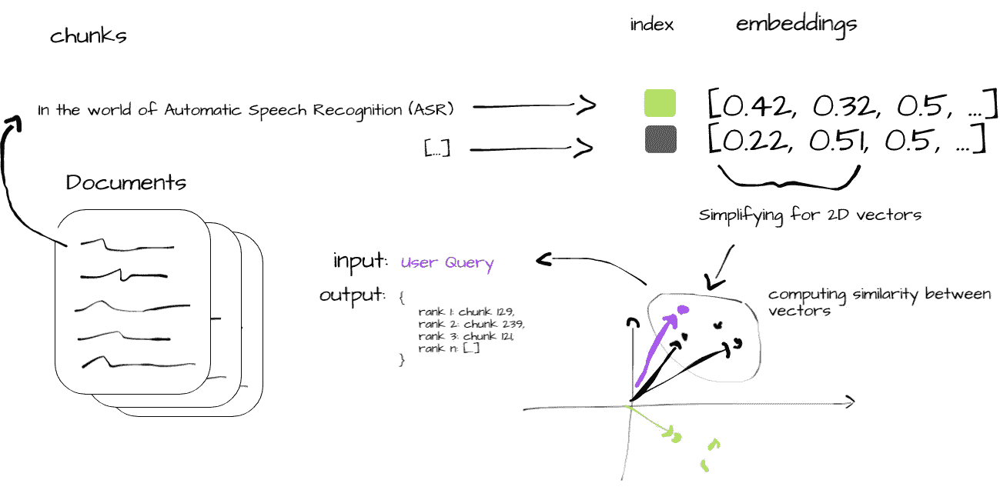

# 面向文档的智能体：与向量数据库、LLMs、Langchain、FastAPI 和 Docker 的探索之旅

> 原文：[`towardsdatascience.com/document-oriented-agents-a-journey-with-vector-databases-llms-langchain-fastapi-and-docker-be0efcd229f4`](https://towardsdatascience.com/document-oriented-agents-a-journey-with-vector-databases-llms-langchain-fastapi-and-docker-be0efcd229f4)

## 利用 ChromaDB、Langchain 和 ChatGPT：从大型文档数据库中获得增强的响应和引用来源

[](https://medium.com/@luisroque?source=post_page-----be0efcd229f4--------------------------------)[](https://towardsdatascience.com/?source=post_page-----be0efcd229f4--------------------------------) [Luís Roque](https://medium.com/@luisroque?source=post_page-----be0efcd229f4--------------------------------)

·发表于 [Towards Data Science](https://towardsdatascience.com/?source=post_page-----be0efcd229f4--------------------------------) ·阅读时长 11 分钟·2023 年 7 月 5 日

--

# 介绍

面向文档的智能体在商业领域开始获得关注。公司越来越多地利用这些工具来充分发挥内部文档的作用，从而优化业务流程。最近的一份麦肯锡报告[1]强调了这一趋势，指出生成式 AI 每年可能为全球经济贡献 2.6 至 4.4 万亿美元，并自动化目前 70% 的工作活动。该研究指出，客户服务、销售和营销以及软件开发是主要受到转型影响的领域。大部分变化来自于这样的事实，即驱动公司这些领域的信息可以通过使用如面向文档的智能体等解决方案，让员工和客户更加容易获取。

目前的技术条件下，我们仍面临一些挑战。即使考虑到具有 100k 令牌限制的新型大型语言模型（LLMs），这些模型的上下文窗口仍然有限。虽然 100k 令牌看似是一个较大的数字，但当我们查看支持例如客户服务部门的数据库规模时，这个数字就显得微不足道。另一个经常出现的问题是模型输出的准确性。在本文中，我们将提供一个逐步指南，帮助构建一个可以处理任何大小文档并提供可验证答案的面向文档的智能体。

我们使用向量数据库——ChromaDB——来增强我们的模型上下文长度能力，并使用 Langchain 来促进我们架构中不同组件之间的集成。作为我们的 LLM，我们使用 OpenAI 的 chatGPT。由于我们希望服务于我们的应用程序，我们使用 FastAPI 创建用户与我们的代理交互的端点。最后，我们的应用程序使用 Docker 进行容器化，这使我们可以在任何类型的环境中轻松部署。


图 1：AI 代理每天变得更聪明 ([图片来源](https://unsplash.com/photos/1DjbGRDh7-E))

一如既往，代码可以在我的[Github](https://github.com/luisroque/large_laguage_models)上找到。

# 向量数据库：语义搜索应用的核心要素

向量数据库对于释放生成式 AI 的潜力至关重要。这些类型的数据库经过优化，以处理向量嵌入——包含原始数据丰富语义信息的数据表示。与传统的标量数据库不同，传统数据库在处理向量嵌入的复杂性方面表现不佳，而向量数据库则对这些嵌入进行索引，将它们与源内容关联，并支持高级功能，如语义信息检索和 AI 应用中的长期记忆。

向量数据库与向量索引不同，如 Facebook 的 AI 相似性搜索（FAISS）——我们在系列中的上一篇文章[2]已经介绍过。这些数据库允许数据的插入、删除和更新，存储相关的元数据，并支持实时数据更新，而无需全面重新索引——这是一个耗时且计算上昂贵的过程。

向量数据库使用相似性度量而非精确匹配来查找最接近查询的向量。它们使用近似最近邻（ANN）搜索算法来优化搜索。一些此类算法的例子包括：随机投影、产品量化或层次导航小世界。这些算法压缩原始向量，加快查询过程。此外，类似余弦相似度、欧几里得距离和点积的相似性度量比较并识别与查询最相关的结果。

图 2 简洁地展示了向量数据库中的相似性搜索过程。从原始文档的摄取 (i) 开始，数据被拆分成可管理的块 (ii)，并转换为向量嵌入 (iii)。这些嵌入被索引以便快速检索 (iv)，并计算块向量与用户查询之间的相似性度量 (v)。该过程以输出最相关的数据块 (vi) 结束，为用户提供与其原始查询一致的见解。



图 2：相似性搜索过程：i) 原始文档摄取，ii) 处理为块，iii) 创建嵌入，iv) 索引，v) 计算相似性度量，最后，vi) 生成输出块（图片由作者提供）

# 构建面向文档的智能体

我们从服务器启动时加载所有必要的模型和数据。

我们从预定义的目录加载数据，并将其处理成可管理的块。这些块的设计大小使我们能够在从相似性搜索过程中获得结果后将块传递给 LLM。此过程利用 DirectoryLoader 将文档加载到内存中，并使用 RecursiveCharacterTextSplitter 将其拆分为可管理的块。它在字符级别拆分文档，默认块大小为 1000 个字符，块重叠为 20 个字符。块重叠确保了块之间的上下文连续性，最小化了在块边界丢失有意义上下文的风险。

```py
def load_docs(directory: str):
    """
    Load documents from the given directory.
    """
    loader = DirectoryLoader(directory)
    documents = loader.load()

    return documents

def split_docs(documents, chunk_size=1000, chunk_overlap=20):
    """
    Split the documents into chunks.
    """
    text_splitter = RecursiveCharacterTextSplitter(chunk_size=chunk_size, chunk_overlap=chunk_overlap)
    docs = text_splitter.split_documents(documents)

    return docs
```

然后，我们使用 SentenceTransformerEmbeddings 方法从这些块中生成向量嵌入，并将其索引到我们的向量数据库 ChromaDB 中。这些嵌入被存储在数据库中，作为可搜索的数据。数据库并不驻留在内存中；请注意，我们将其持久化到磁盘，这减少了内存开销。接下来，我们加载聊天模型，具体来说是 OpenAI 的 gpt-3.5-turbo，它作为我们的 LLM。

```py
@app.on_event("startup")
async def startup_event():
    """
    Load all the necessary models and data once the server starts.
    """
    app.directory = '/app/content/'
    app.documents = load_docs(app.directory)
    app.docs = split_docs(app.documents)

    app.embeddings = SentenceTransformerEmbeddings(model_name="all-MiniLM-L6-v2")
    app.persist_directory = "chroma_db"

    app.vectordb = Chroma.from_documents(
        documents=app.docs,
        embedding=app.embeddings,
        persist_directory=app.persist_directory
    )
    app.vectordb.persist()

    app.model_name = "gpt-3.5-turbo"
    app.llm = ChatOpenAI(model_name=app.model_name)

    app.db = Chroma.from_documents(app.docs, app.embeddings)
    app.chain = load_qa_chain(app.llm, chain_type="stuff", verbose=True)
```

最后，“/query/{question}” 端点接收用户查询。它在数据库上运行相似性搜索，使用问题作为输入。如果存在匹配的文档，它们将被送入 LLM，并生成答案。答案和来源（原始文档及其元数据）会被返回，确保提供的信息易于验证。

```py
@app.get("/query/{question}")
async def query_chain(question: str):
    """
    Queries the model with a given question and returns the answer.
    """
    matching_docs_score = app.db.similarity_search_with_score(question)
    if len(matching_docs_score) == 0:
        raise HTTPException(status_code=404, detail="No matching documents found")

    matching_docs = [doc for doc, score in matching_docs_score]
    answer = app.chain.run(input_documents=matching_docs, question=question)

    # Prepare the sources
    sources = [{
        "content": doc.page_content,
        "metadata": doc.metadata,
        "score": score
    } for doc, score in matching_docs_score]

    return {"answer": answer, "sources": sources}
```

我们使用 Docker 对应用程序进行容器化，这确保了隔离性和环境一致性，无论部署平台如何。下面的 Dockerfile 详细说明了我们的设置：

```py
FROM python:3.9-buster
WORKDIR /app
COPY . /app
RUN pip install - no-cache-dir -r requirements.txt
EXPOSE 1010
CMD ["uvicorn", "main:app", " - host", "0.0.0.0", " - port", "1010"]
```

应用程序运行在 Python 3.9 环境中，我们需要从 requirements.txt 文件中安装所有必要的依赖项：

```py
langchain==0.0.221
uvicorn==0.22.0
fastapi==0.99.1
unstructured==0.7.12
sentence-transformers==2.2.2
chromadb==0.3.26
openai==0.27.8
python-dotenv==1.0.0
```

应用程序随后通过 Uvicorn 在 1010 端口提供服务。

请注意，我们需要配置环境变量。我们的应用程序需要 OPENAI_API_KEY 以便使用 ChatOpenAI 模型。处理 API 密钥等敏感信息的最佳实践是将其存储为环境变量，而不是硬编码到应用程序中。

我们使用 python-dotenv 包从项目根目录的 .env 文件加载环境变量。在生产环境中，我们希望使用更安全的方法，例如 Docker secrets 或安全保险库服务。

# 实验：理解面向文档的智能体的有效性

实验的主要目标是评估我们的面向文档的智能体在提供全面和准确的用户查询响应方面的有效性。

我们使用一系列 Medium 文章作为我们的知识库。这些文章涵盖了各种 AI 和机器学习主题，被摄取并在我们的 Chroma 向量数据库中建立索引。所选的文章有：

1.  “Whisper JAX vs PyTorch：揭示 GPU 上 ASR 性能的真相”

1.  “测试支持 1162 种语言的大规模多语言语音（MMS）模型”

1.  “利用 Falcon 40B 模型，最强大的开源 LLM”

1.  “OpenAI 函数调用在语言学习模型中的力量：全面指南”

这些文章被拆分成可管理的块，转换为向量嵌入，并索引到我们的数据库中，从而形成了智能体知识的骨架。

用户查询通过调用我们应用的 API 端点来执行，该端点是使用 FastAPI 实现并通过 Docker 部署的。我们在实验中使用的查询是：“什么是 Falcon-40b，我可以将其用于商业用途吗？”。

```py
curl --location 'http://0.0.0.0:1010/query/What is Falcon-40b and can I use it for commercial use'
```

针对我们的查询，LLM 解释了什么是 Falcon-40b，并确认它可以用于商业用途。信息得到了来自四个不同来源块的支持，这些来源块均来自文章：“利用 Falcon 40B 模型，最强大的开源 LLM”。每个来源块也被添加到回答中，如我们所见，以便用户可以验证支持 LLM 答案的原始文本。这些块还根据与查询的相关性进行了评分，这为我们提供了关于该部分对智能体整体回答重要性的额外视角。

```py
{
    "answer": "Falcon-40B is a state-of-the-art language model developed by the Technology Innovation Institute (TII). It is a transformer-based model that performs well on various language understanding tasks. The significance of Falcon-40B is that it is now available for free commercial and research use, as announced by TII. This means that developers and researchers can access and modify the model according to their specific needs without any royalties. However, it is important to note that while Falcon-40B is available for commercial use, it is still trained on web data and may carry potential biases and stereotypes prevalent online. Therefore, appropriate mitigation strategies should be implemented when using Falcon-40B in a production environment.",
    "sources": [
        {
            "content": "This is where the significance of Falcon-40B lies. In the end of last week, the Technology Innovation Institute (TII) announced that Falcon-40B is now free of royalties for commercial and research use. Thus, it breaks down the barriers of proprietary models, giving developers and researchers free access to a state-of-the-art language model that they can use and modify according to their specific needs.\n\nTo add to the above, the Falcon-40B model is now the top performing model on the OpenLLM Leaderboard, outperforming models like LLaMA, StableLM, RedPajama, and MPT. This leaderboard aims to track, rank, and evaluate the performance of various LLMs and chatbots, providing a clear, unbiased metric of their capabilities. Figure 1: Falcon-40B is dominating the OpenLLM Leaderboard (image source)\n\nAs always, the code is available on my Github. How was Falcon LLM developed?",
            "metadata": {
                "source": "/app/content/Harnessing the Falcon 40B Model, the Most Powerful Open-Source LLM.txt"
            },
            "score": 1.045290231704712
        },
        {
            "content": "The decoder-block in Falcon-40B features a parallel attention/MLP (Multi-Layer Perceptron) design with two-layer normalization. This structure offers benefits in terms of model scaling and computational speed. Parallelization of the attention and MLP layers improves the model’s ability to process large amounts of data simultaneously, thereby reducing the training time. Additionally, the implementation of two-layer normalization helps in stabilizing the learning process and mitigating issues related to the internal covariate shift, resulting in a more robust and reliable model. Implementing Chat Capabilities with Falcon-40B-Instruct\n\nWe are using the Falcon-40B-Instruct, which is the new variant of Falcon-40B. It is basically the same model but fine tuned on a mixture of Baize. Baize is an open-source chat model trained with LoRA, a low-rank adaptation of large language models. Baize uses 100k dialogs of ChatGPT chatting with itself and also Alpaca’s data to improve its performance.",
            "metadata": {
                "source": "/app/content/Harnessing the Falcon 40B Model, the Most Powerful Open-Source LLM.txt"
            },
            "score": 1.319214940071106
        },
        {
            "content": "One of the core differences on the development of Falcon was the quality of the training data. The size of the pre-training data for Falcon was nearly five trillion tokens gathered from public web crawls, research papers, and social media conversations. Since LLMs are particularly sensitive to the data they are trained on, the team built a custom data pipeline to extract high-quality data from the pre-training data using extensive filtering and deduplication.\n\nThe model itself was trained over the course of two months using 384 GPUs on AWS. The result is an LLM that surpasses GPT-3, requiring only 75% of the training compute budget and one-fifth of the compute at inference time.",
            "metadata": {
                "source": "/app/content/Harnessing the Falcon 40B Model, the Most Powerful Open-Source LLM.txt"
            },
            "score": 1.3254718780517578
        },
        {
            "content": "Falcon-40B is English-centric, but also includes German, Spanish, French, Italian, Portuguese, Polish, Dutch, Romanian, Czech, and Swedish language capabilities. Be mindful that as with any model trained on web data, it carries the potential risk of reflecting the biases and stereotypes prevalent online. Therefore, please assess these risks adequately and implement appropriate mitigation strategies when using Falcon-40B in a production environment. Model Architecture and Objective\n\nFalcon-40B, as a member of the transformer-based models family, follows the causal language modeling task, where the goal is to predict the next token in a sequence of tokens. Its architecture fundamentally builds upon the design principles of GPT-3 [1], with a few important tweaks.",
            "metadata": {
                "source": "/app/content/Harnessing the Falcon 40B Model, the Most Powerful Open-Source LLM.txt"
            },
            "score": 1.3283030986785889
        }
    ]
}
```

# 结论

在这篇文章中，我们构建了解决在 AI 系统中处理大规模文档挑战的解决方案，利用向量数据库和一套开源工具。我们的方法采用 ChromaDB 和 Langchain 与 OpenAI 的 ChatGPT 一起构建一个高效的文档导向智能体。

我们的方法使得智能体能够通过搜索和处理来自大规模数据库的文本块——在我们的案例中，是一系列关于各种 AI 主题的 Medium 文章——来回答复杂的查询。除了智能体的回答，我们还返回了用于支持 LLM 主张的原始文档块及其与用户查询的相似性评分。这是一个重要的特性，因为这些智能体有时可能提供不准确的信息。

# 关于我

连续创业者和 AI 领域的领军人物。我为企业开发 AI 产品，并投资于专注于 AI 的初创公司。

[创始人 @ ZAAI](http://zaai.ai) | [LinkedIn](https://www.linkedin.com/in/luisbrasroque/) | [X/Twitter](https://x.com/luisbrasroque)

# 大型语言模型编年史：探索 NLP 前沿

本文属于“**大型语言模型编年史：探索 NLP 前沿**”，这是一个新的每周系列文章，将探讨如何利用大型模型的力量进行各种 NLP 任务。通过深入这些前沿技术，我们旨在赋能开发者、研究人员和爱好者，挖掘 NLP 的潜力，开启新的可能性。

迄今为止发布的文章：

1.  [用 ChatGPT 总结最新的 Spotify 发布](https://medium.com/towards-data-science/summarizing-the-latest-spotify-releases-with-chatgpt-553245a6df88)

1.  [掌握大规模语义搜索：使用 FAISS 和 Sentence Transformers 索引数百万份文档，获得闪电般快速的推理时间](https://medium.com/towards-data-science/master-semantic-search-at-scale-index-millions-of-documents-with-lightning-fast-inference-times-fa395e4efd88)

1.  [解锁音频数据的力量：使用 Whisper、WhisperX 和 PyAnnotate 进行高级转录和标记](https://medium.com/towards-data-science/unlock-the-power-of-audio-data-advanced-transcription-and-diarization-with-whisper-whisperx-and-ed9424307281)

1.  [Whisper JAX 与 PyTorch：揭示 GPU 上 ASR 性能的真相](https://medium.com/towards-data-science/whisper-jax-vs-pytorch-uncovering-the-truth-about-asr-performance-on-gpus-8794ba7a42f5)

1.  [Vosk 用于高效企业级语音识别：评估与实施指南](https://medium.com/towards-data-science/vosk-for-efficient-enterprise-grade-speech-recognition-an-evaluation-and-implementation-guide-87a599217a6c)

1.  [测试支持 1162 种语言的极大规模多语言语音 (MMS) 模型](https://medium.com/towards-data-science/testing-the-massively-multilingual-speech-mms-model-that-supports-1162-languages-5db957ee1602)

1.  [利用 Falcon 40B 模型，最强大的开源 LLM](https://medium.com/towards-data-science/harnessing-the-falcon-40b-model-the-most-powerful-open-source-llm-f70010bc8a10)

1.  [OpenAI 的函数调用在语言学习模型中的力量：全面指南](https://medium.com/towards-data-science/the-power-of-openais-function-calling-in-language-learning-models-a-comprehensive-guide-cce8cd84dc3c)

# 参考文献

[1] [`www.mckinsey.com/capabilities/mckinsey-digital/our-insights/the-economic-potential-of-generative-ai-the-next-productivity-frontier#introduction`](https://www.mckinsey.com/capabilities/mckinsey-digital/our-insights/the-economic-potential-of-generative-ai-the-next-productivity-frontier#introduction)

[2] [掌握大规模语义搜索：使用 FAISS 和 Sentence Transformers 索引数百万份文档，获得闪电般快速的推理时间](https://medium.com/towards-data-science/master-semantic-search-at-scale-index-millions-of-documents-with-lightning-fast-inference-times-fa395e4efd88)
