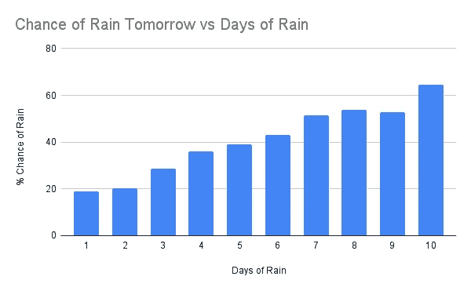
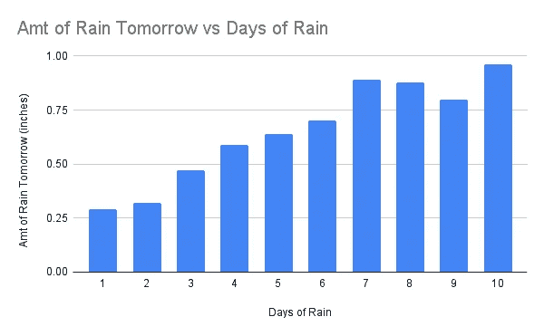
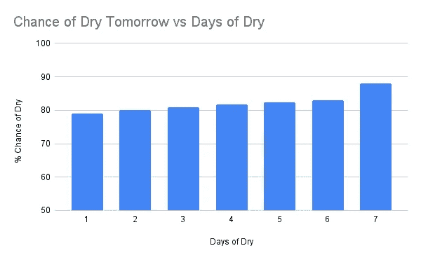
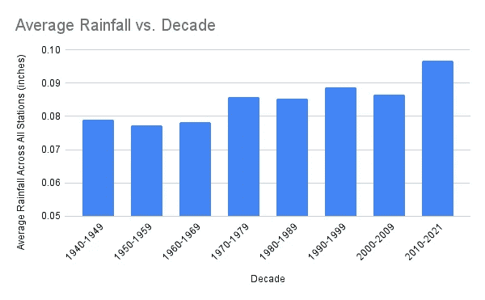

# 雨能预测雨吗？美国气象数据及今天和明天降雨的相关性

> 原文：[`towardsdatascience.com/does-rain-predict-rain-us-weather-data-and-the-correlation-of-rain-today-and-tomorrow-3a62eda6f7f7?source=collection_archive---------6-----------------------#2023-08-10`](https://towardsdatascience.com/does-rain-predict-rain-us-weather-data-and-the-correlation-of-rain-today-and-tomorrow-3a62eda6f7f7?source=collection_archive---------6-----------------------#2023-08-10)

## 介绍有用的气候数据集并验证全球变暖预测

[](https://medium.com/@chuck.connell.3?source=post_page-----3a62eda6f7f7--------------------------------)[](https://towardsdatascience.com/?source=post_page-----3a62eda6f7f7--------------------------------) [Chuck Connell](https://medium.com/@chuck.connell.3?source=post_page-----3a62eda6f7f7--------------------------------)

·

[关注](https://medium.com/m/signin?actionUrl=https%3A%2F%2Fmedium.com%2F_%2Fsubscribe%2Fuser%2Fc4e1ad08794e&operation=register&redirect=https%3A%2F%2Ftowardsdatascience.com%2Fdoes-rain-predict-rain-us-weather-data-and-the-correlation-of-rain-today-and-tomorrow-3a62eda6f7f7&user=Chuck+Connell&userId=c4e1ad08794e&source=post_page-c4e1ad08794e----3a62eda6f7f7---------------------post_header-----------) 发表在 [Towards Data Science](https://towardsdatascience.com/?source=post_page-----3a62eda6f7f7--------------------------------) ·8 分钟阅读·2023 年 8 月 10 日[](https://medium.com/m/signin?actionUrl=https%3A%2F%2Fmedium.com%2F_%2Fvote%2Ftowards-data-science%2F3a62eda6f7f7&operation=register&redirect=https%3A%2F%2Ftowardsdatascience.com%2Fdoes-rain-predict-rain-us-weather-data-and-the-correlation-of-rain-today-and-tomorrow-3a62eda6f7f7&user=Chuck+Connell&userId=c4e1ad08794e&source=-----3a62eda6f7f7---------------------clap_footer-----------)

--

[](https://medium.com/m/signin?actionUrl=https%3A%2F%2Fmedium.com%2F_%2Fbookmark%2Fp%2F3a62eda6f7f7&operation=register&redirect=https%3A%2F%2Ftowardsdatascience.com%2Fdoes-rain-predict-rain-us-weather-data-and-the-correlation-of-rain-today-and-tomorrow-3a62eda6f7f7&source=-----3a62eda6f7f7---------------------bookmark_footer-----------)

照片由[Wim van ‘t Einde](https://unsplash.com/fr/@wimvanteinde?utm_source=unsplash&utm_medium=referral&utm_content=creditCopyText)拍摄，发布在[Unsplash](https://unsplash.com/s/photos/weather?utm_source=unsplash&utm_medium=referral&utm_content=creditCopyText)上。

# 摘要

在波士顿的一个阴沉的六月和七月期间，每次我家计划做一些有趣的事情时似乎总是下雨。我们开始怀疑我们是否陷入了一个雨天模式，并问：“连续三天大雨是否意味着明天有可能还会下雨？”我意识到，使用现有的天气数据很容易回答这个问题。

本文介绍了我使用的美国天气数据集、我编写的 Python/pandas 程序用于分析数据，以及分析结果。简而言之，是的，一段连续的雨天强烈预测更多的降雨。令人惊讶的是，降雨的时间段越长，第二天降雨的可能性越大。结果还证明了全球变暖模型的一个预测——现在的降雨量比以往年份更多。

# 数据

有两个关于降雨的关键数据集来自美国海洋和大气管理局 (NOAA)。

我使用了 [每小时降水数据](https://www.ncei.noaa.gov/access/metadata/landing-page/bin/iso?id=gov.noaa.ncdc%3AC00313) (HPD)。描述页面通常是有用的，但[访问](https://www.ncei.noaa.gov/access/metadata/landing-page/bin/iso?id=gov.noaa.ncdc%3AC00313#OnlineAccess)标签下的数据集链接是错误的，指向的是一个旧版本。新数据集在[这里](https://www.ncei.noaa.gov/data/coop-hourly-precipitation/v2/) ，涵盖了 1940 到 2022 年的时期。HPD 具有细粒度的降水量数据，来自美国超过 2000 个 [采集站](https://www.ncei.noaa.gov/data/coop-hourly-precipitation/v2/station-inventory/)。数据文件包含每个站点的所有年份数据，每个 CSV 文件包含一个站点的数据。我只使用了每日总降水量，但小时信息可能对未来的分析有用。（有关数据使用权限，请参见 [限制](https://www.ncei.noaa.gov/access/metadata/landing-page/bin/iso?id=gov.noaa.ncdc%3AC00313#Constraints) 标签。）

那么，当下雪而不是下雨时呢？积雪会被融化以找到 [等效](https://www.weather.gov/chs/coop_equipment) 的降雨量。因此 HPD 中的所有数据包括液体降雨、融化的雪，以及介于两者之间的所有情况，如雪泥和冰雹。

还有一个有价值的数据集，名为 [地方气候数据 (LCD)](https://www.ncei.noaa.gov/data/local-climatological-data/)，可以用于类似的分析。LCD 包含的信息远超降水量，还包括温度、日出/日落、气压、能见度、风速、雾、烟雾、月度总结等。LCD 每天更新，因此包含了昨天的数据。使用它需要解码 [综合表面数据集 (ISD) 站点编号](https://www.ncei.noaa.gov/access/search/data-search/global-hourly)。

# 分析程序

[降雨分析程序](https://github.com/ChuckConnell/articles/blob/master/rain-predict.py)是用 Python/pandas 编写的。我编写的代码本身就可读，但值得探讨一些具体的特性。

程序可以读取[HPD 站点完整列表](https://github.com/ChuckConnell/articles/blob/master/rain_helpers.py)或从文本文件中读取特定的站点列表。这个功能用于在使用不同参数重新运行程序时，确保使用与之前运行完全相同的站点。

```py
from rain_helpers import ALL_STATION_FILES
STATION_LIST_INPUT = "/Users/chuck/Desktop/Articles/hpd_stations_used_list_1940-1950.txt"
ALL_STATIONS = True  # use every station, or a specific list ?

# Choose either all stations we know about, or a specific list of stations (usually from a previous run of this program)

if (ALL_STATIONS):
    station_files = ALL_STATION_FILES
else:
    with open(STATION_LIST_INPUT, 'r') as fp:  
        data = fp.read()
        station_files = data.split("\n")
        fp.close()
```

另一个实用的功能是能够选择站点文件的子集。你可以用 1/100 的站点快速运行代码以进行调试，或用大约 1/3 的站点来准确估算结果。根据[大数法则](https://en.wikipedia.org/wiki/Law_of_large_numbers)，我用 1/3（约 600 个站点）的测试结果几乎与完整数据集相同。

```py
SKIP_COUNT = 3 # 1 = don't skip any.

for i in range (0, len(station_files), SKIP_COUNT):    
    station_url = HPD_LOCAL_DIR + station_files[i] 
    stationDF = pd.read_csv(station_url, sep=',', header='infer', dtype=str)
```

另一个速度提升的方法是[下载](https://github.com/ChuckConnell/articles/blob/master/get_stations.py)所有站点文件到本地计算机，这样你就不必每次都从 NOAA 获取它们。完整的数据集约为 20GB。如果没有额外的空间，代码在从云端读取时也可以正常运行。

```py
HPD_CLOUD_DIR = "https://www.ncei.noaa.gov/data/coop-hourly-precipitation/v2/access/"  # Hourly Precipitation Data (HPD)
HPD_LOCAL_DIR = "/Users/chuck/Desktop/Articles/NOAA/HPD/"

station_url = HPD_LOCAL_DIR + station_files[i]  # toggle between local and cloud
```

代码中最棘手的部分是回溯每个日期，查看是否有连续的前几天降雨。问题在于需要查找的数据就在同一个 DataFrame 内部，这是一种自连接。虽然可以使用循环遍历 DataFrame，并在每一行中查找前几天的日期，但在任何编程语言中，遍历大型数据结构的循环都是不好的风格，*尤其*是在 pandas 中。我的代码通过拍摄 DataFrame 快照，创建包含九个前日期（以及一个明天日期）的字段，然后使用这些字段与快照进行连接，从而解决了这个问题。

```py
 # Grab a snapshot for a self-join later. Adjust fields names to avoid confusion after the join.

    stationCopyDF = stationDF
    stationCopyDF = stationCopyDF[["STATION","DATE","DlySumToday"]]  # keep just what we need
    stationCopyDF = stationCopyDF.rename({"DlySumToday":"DlySumOther", "DATE":"DATEother"}, axis='columns')  

    # Add in some other dates, for which we will pull in rainfall.

    stationDF["DATE_minus9"] = stationDF["DATE"] - pd.offsets.Day(9)
    stationDF["DATE_minus8"] = stationDF["DATE"] - pd.offsets.Day(8)
    ...
    stationDF["DATE_minus1"] = stationDF["DATE"] - pd.offsets.Day(1)
    stationDF["DATE_plus1"] = stationDF["DATE"] + pd.offsets.Day(1)

    # Join other rainfall onto base record. Adjust column names to make clear what we did.

    stationDF = stationDF.merge(stationCopyDF, how='inner', left_on=["STATION","DATE_minus9"], right_on = ["STATION","DATEother"])
    stationDF = stationDF.rename({"DlySumOther":"DlySum9DaysAgo"}, axis='columns')  
    stationDF = stationDF.drop(columns=["DATEother"])

    stationDF = stationDF.merge(stationCopyDF, how='inner', left_on=["STATION","DATE_minus8"], right_on = ["STATION","DATEother"])
    stationDF = stationDF.rename({"DlySumOther":"DlySum8DaysAgo"}, axis='columns')  
    stationDF = stationDF.drop(columns=["DATEother"])

    ....

    stationDF = stationDF.merge(stationCopyDF, how='inner', left_on=["STATION","DATE_minus1"], right_on = ["STATION","DATEother"])
    stationDF = stationDF.rename({"DlySumOther":"DlySum1DayAgo"}, axis='columns')  
    stationDF = stationDF.drop(columns=["DATEother"])

    stationDF = stationDF.merge(stationCopyDF, how='inner', left_on=["STATION","DATE_plus1"], right_on = ["STATION","DATEother"])
    stationDF = stationDF.rename({"DlySumOther":"DlySumTomorrow"}, axis='columns')  
    stationDF = stationDF.drop(columns=["DATEother"])
```

在每一行中获取前几天的降雨量后，代码可以轻松找到每个降雨周期的长度。注意，在计算降雨天数时，今天也算作一天。

```py
 stationDF["DaysOfRain"] = 0   
    stationDF.loc[(stationDF["DlySumToday"] >= RAINY), "DaysOfRain"] = 1
    stationDF.loc[(stationDF['DlySumToday'] >= RAINY) & (stationDF['DlySum1DayAgo'] >= RAINY), 'DaysOfRain'] = 2
    stationDF.loc[(stationDF['DlySumToday'] >= RAINY) & (stationDF['DlySum1DayAgo'] >= RAINY) & (stationDF['DlySum2DaysAgo'] >= RAINY), 'DaysOfRain'] = 3
    ... etc
```

# 结果

使用 2000 年到 2021 年的数据，共有 1808 个有效数据站点，包含 8,967,394 个数据点（日期、地点和降雨量）。

+   所有数据点的平均降雨量为 0.0983 英寸，约为 1/10 英寸。

+   降雨天数的比例（≥ 0.5 英寸）为 6.2%。

+   干燥天数的比例（≤ 0.05 英寸）为 78.0%。

促使这个项目的问题的答案是，

> 是的，降雨天数可以预测明天是否会下雨。降雨时间越长（最多 8 天），再次下雨的可能性就越大。

还有一个相关结果……

> 降雨天数可以预测明天预计的降雨量。降雨时间越长（最多 7 天），明天的降雨量也越大。

两张图表显示了这一结果。



明天降雨几率与降雨天数（作者提供的图片）



明天降雨量与降雨天数（作者提供的图片）

我尝试了不同的“雨天”设置，将其从 0.5 英寸改为 0.75 和 1.0。这些变化显示了雨天预测更多降雨的相同一般现象，但在八天内并没有完全的相关性。将“雨天”定义为 0.5 英寸似乎是预测明天降雨的最佳选择。

你可能会想知道在哪里会连续 10 天下雨。在全美范围内的 22 年中，接近九百万个数据点中只有 118 次这样的天气情况。部分地点包括：佛罗里达州博卡拉顿；波多黎各圣胡安；夏威夷卡胡纳瀑布；夏威夷考曼那；夏威夷基哈拉尼；夏威夷帕阿凯亚；密西西比州帕斯卡古拉；华盛顿州奎诺特；和华盛顿州奎尔辛。

连续干燥的天数（< 0.05 英寸的降雨）与第二天的干燥情况也有很好的相关性，但预测的准确性不如前者，因为明天干燥的可能性非常接近。明天干燥的概率始终接近 78%的总体均值。



连续干燥的天数在预测第二天的降雨量方面有一定的准确性。


明天降雨量与干燥天数（作者提供的图片）

# 气候变化

一个明显相关的问题是，随着地球温度因气候变化而上升，这里描述的结果是否有所改变。我对 1940 年至 1960 年、1960 年至 1980 年和 1980 年至 2000 年的美国数据进行了相同的分析。

主要结果是相同的——雨天预测更多的降雨。每个时间段的具体数字略有不同，但并没有改变强烈的相关性。例如，从 1960 年至 1980 年，有 1388 个有效数据的气象站和 6,807,917 个数据点，结果如下：

`1 个雨天后的降雨概率 = 17.3% 2 个雨天后的降雨概率 = 19.6% 3 个雨天后的降雨概率 = 27.4% 4 个雨天后的降雨概率 = 37.1% 5 个雨天后的降雨概率 = 43.8% 6 个雨天后的降雨概率 = 51.5% 7 个雨天后的降雨概率 = 52.4%`

一个更重要的推论是，气候变化模型预测随着地球变暖，降雨量将会增加。HPD 数据集可以验证这一点，至少在过去 80 年里是如此。

简单的方法是使用所有当前气候站（约 2000 个）并查看每十年的降雨数据。但这样做存在潜在的偏差。现在的气象站比 1940 年时要多，因为过去 80 年里气象站逐渐增加。新建的气象站可能位于降雨量较多的地方。如果是这样的话，新数据会显示更多的降雨，但仅仅是因为总体的气象站集比 1940 年的站点集要湿润。

更准确的方法是找到 1940 年代有降水数据的站点集合，然后在每个十年中使用相同的站点。我的程序可以做到这一点，因为它会输出每次运行时实际使用的站点列表。因此，我首先找到了 1940 到 1950 年的数据，然后在 1950 到 1960 年、1960 到 1970 年等期间再次使用了发出的站点列表。这大约涉及 840 个站点，包含 40 万到 250 万的数据点。

每十年的平均降水量应该非常接近——再次依据大数法则。但下图显示了在相同采集站点的降水量显著增加。这是支持全球变暖模型关键预测的一个显著结果。



平均降水量与十年（作者提供的图片）

# 了解更多信息

[`www.weather.gov/rah/virtualtourlist`](https://www.weather.gov/rah/virtualtourlist) — 美国国家气象局如何进行天气预报。

[`www.ncdc.noaa.gov/cdo-web/datasets`](https://www.ncdc.noaa.gov/cdo-web/datasets) — 美国国家海洋和大气管理局数据集概述。

[`www.epa.gov/climate-indicators/climate-change-indicators-us-and-global-precipitation`](https://www.epa.gov/climate-indicators/climate-change-indicators-us-and-global-precipitation#:~:text=Since%201901%2C%20global%20precipitation%20has,increases%20in%20precipitation%20than%20others.) — 美国环保局关于气候变化引起的降水增加的报告。
