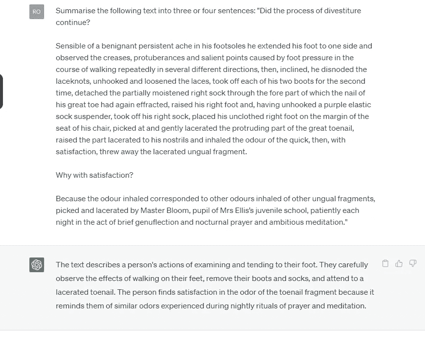

# 您的 LLM 流水线达到了您的目标吗？

> 原文：[`towardsdatascience.com/does-your-llm-pipeline-achieve-your-goal-d033c944af8d`](https://towardsdatascience.com/does-your-llm-pipeline-achieve-your-goal-d033c944af8d)

## *探索评估中最重要的内容及如何在您的 LLM 流水线中进行衡量。*

[](https://medium.com/@robertdegraaf78?source=post_page-----d033c944af8d--------------------------------)[](https://towardsdatascience.com/?source=post_page-----d033c944af8d--------------------------------) [Robert de Graaf](https://medium.com/@robertdegraaf78?source=post_page-----d033c944af8d--------------------------------)

·发表于 [Towards Data Science](https://towardsdatascience.com/?source=post_page-----d033c944af8d--------------------------------) ·8 分钟阅读·2023 年 7 月 20 日

--


AI 照片由 [Piret Ilver](https://unsplash.com/es/@saltsup?utm_source=unsplash&utm_medium=referral&utm_content=creditCopyText) 拍摄，刊登在 [Unsplash](https://unsplash.com/photos/98MbUldcDJY?utm_source=unsplash&utm_medium=referral&utm_content=creditCopyText) 上

有效实施 LLM 流水线所需的关键成分之一是评估流水线效果的方法。即您需要评估最终输出，这不仅是 LLM 本身或提示的产物，还包括 LLM、提示和设置（如温度或最小最大令牌）之间的交互。

考虑访问 GPT API 的样板代码（自动生成：）

```py
import os
import openai

openai.api_key = os.getenv("OPENAI_API_KEY")

response = openai.ChatCompletion.create(
  model="gpt-3.5-turbo",
  messages=[],
  temperature=1,
  max_tokens=256,
  top_p=1,
  frequency_penalty=0,
  presence_penalty=0
)
```

创建“响应”的函数中有七个参数，每个参数都会改变最终输出。能够选择这些输出的最佳组合取决于能够评估和区分不同参数值产生的输出。

这与最常见于论文或 LLM 制造商网站上的 LLM 评估问题不同。虽然您可能正在使用一个可以通过律师资格考试或这些来源中宣传的类似测试的 LLM，但这并不意味着您创建的提示和所选设置的流水线一定能以您需要的方式总结一系列法律文档。

当您为外部用户构建流水线时尤其如此，因此无法即时调整提示。例如，假设您想使用 LLM API 嵌入 LLM 解决方案，并使用基本提示框架生成特定项目的描述，如在目录中。这涉及到两个适用性层级：

首先，您生成的答案是否符合目的？

其次，你能否依赖答案在未来迭代中继续保持适用性？

从某种意义上说，第一个可以通过查看一个或几个独立的答案来评估。如果你判断它们是合适的，那么你就完成了。然而，要评估 LLM 解决方案的长期可靠性，你需要考虑多个答案的变化。

我们将在后续更详细地讨论这一差异，但在继续之前，我们需要考虑在 LLM 的背景下适用性是什么意思。

## 适用性究竟是什么意思？

在最基本的层面上，适用性意味着某物实现了它被设计要实现的目的。在许多技术应用中，困难在于知道这个目标是什么。

与 LLM 相关，有几个常见的目标用户经常会有，这取决于 LLM 的应用方式。以下是人们对 LLM 的一些常见使用场景：

+   总结文本

+   回答问题

+   生成文本描述

对于总结的使用场景，标准是最终保留了多少重要信息。这是一种保真度或信息丢失的衡量标准。

在回答问题的情况下，准确性是可能的衡量标准——你可以根据答案的正确频率来评分。

对于文本描述的情况，可能会有多个标准。类似于总结或回答问题，准确性或保真度将是重要的。然而，你可能还希望根据描述的易懂程度或回答是否符合你的风格要求来评分。

在他们的论文‘[大型语言模型编码临床知识](https://arxiv.org/abs/2212.13138)’中，Singhal、Azizi 等提出了 10 个标准，用于评估健康背景下的 LLM 实现。在一些情况下，如‘可能的伤害程度’，这些标准非常特定于健康背景。然而，在许多其他情况下，这些标准广泛适用。例如，本文建议的以下标准可以适用于各种 LLM 实现和多种背景：

+   答案中是否有不正确的阅读理解的证据？

+   答案是否包含了不该包含的内容？

+   答案是否省略了不该省略的内容？

完整的列表值得研究，可以通过上述链接在 arxiv 上获取。

不幸的是，将实现评估与这样一组标准对比是一个繁琐的过程，可能涉及一些手动评分标准，并且需要你在多个案例中生成模型输出，以获得性能的全面图景。

要分析这些调查结果，你需要对几乎整个矩阵输出进行统计分析，将任务明确地归入多变量统计领域。为了避免写得过长，不深入探讨这个领域，这意味着你需要考虑：

+   答案中的总体评分

+   类别中的总体评分

+   每个答案的方差，例如，你希望每个答案的评分在一个紧密的范围内，而不是在一个标准上评分很高，而在另一个标准上评分很低。

+   标准中的方差，例如，你希望每个答案的评分在一个紧密的范围内

## 实施后监控

另一个需要考虑的因素是，除了固有的随机性，使得未来的答案可能与当前答案不同外，在许多情况下，模型拥有者会调整模型，这可能会改善或降低你特定情况下的输出。

实际上，ChatGPT 和特别是 GPT4 的感知退化在各种地方进行了讨论，例如 [GPT4 讨论论坛](https://community.openai.com/t/experiencing-decreased-performance-with-chatgpt-4/234269)。退化的各种原因被提出，但值得考虑的是，在像 LLM 这样复杂且强大的工具中，其输出质量只能主观衡量，任何改善大多数用户体验的变更都可能导致在特定情况下性能下降。

还应该注意，在这些讨论中，一些用户提出感知到的退化实际上并不是退化，而是用户错误地认为一个偶然出现的非常合适的答案代表了未来总是会取得的结果，而实际上答案的适用性部分是由偶然因素决定的——这突出了测试多个案例和创建能够考虑概率效应的评估的重要性。

鉴于生产和评分答案的过程可能会很繁琐，你可能希望避免每次查看实施后的效果时都重复整个过程。因此，你可能会希望选择一个具有代表性的实施测试子集，并在半定期的时间间隔内进行分析。

## 示例

作为如何在简单情况下工作的一个例子，假设你正在创建一个管道来总结难以阅读的备忘录。你希望创建一个可以清晰、易读地总结这些备忘录的管道。你决定以下因素很重要：

1.  原始内容的准确总结

1.  阅读的容易程度

1.  无额外材料添加

1.  在相同输入下每次产生类似输出的可重复性。

最后一个，即可重复性，我们不直接测量，而是通过对前面三个评分过程中的几个示例进行重复测量来评估。

作为说明，想象一下总结一段公开领域的短文——詹姆斯·乔伊斯《尤利西斯》中的一段，乔伊斯以夸张搞笑的方式描述了主人公（布 loom）脱鞋袜的情景。这是 ChatGPT 的输出以及需要总结的原文：



从《尤利西斯》中提交的短文片段的 ChatGPT 输出，其中作者描述了主角回家后脱鞋的情景。

使用 GPT3.5 API playground 中的默认设置可以获得类似的输出。这些设置在本文开头的代码片段中可以找到。

使用这个输出的示例结果是：

“文本描述了一个人检查和处理他们的脚。他们有持续的疼痛，并注意到由于走路造成的痕迹和压力点。然后，他们脱下鞋子和袜子来解决脚趾甲的问题，发现熟悉的气味和夜间脚部护理的例行程序带来了满足感。”

这是一个全面的总结，在前面三个标准的评分中，我会给这个结果至少打 4 分。这些评分非常接近，因此标准之间的差异很小。当我用相同的设置重复输入时，尽管结果有所变化，但质量非常相似，因此结果之间的差异也很小，因此重复性很高。

我还在改变一个参数后尝试了这个实验——我将温度从 1 增加到 1.6。

我第一次尝试这个实验时得到了以下结果：

“文本谈到一个人检查他们的脚并进行处理。他们注意到由于走路而形成的变形和压力点，然后脱下靴子和袜子。他们特别解决了脚趾甲的问题，并从与夜间脚部护理程序相关的熟悉气味中获得满足感，这个程序每天都在祈祷般的沉思中进行。”

这个结果在所有标准中得分也很高，可以说（这是一个固有的主观过程）在提到“祈祷般的沉思”时更好地捕捉了意义。我会给这个结果 4.5 分的忠实度，阅读容易性仍然为 4 分，没有额外材料为 5 分。

我随后用完全相同的设置再次提交了请求，得到了这个结果：

“文本描述了主角继续脱下鞋子的过程，以及他们如何照顾自己的脚。他们注意到脚上走路留下的痕迹，然后继续脱掉靴子、袜子以及部分袜带。他们在挑拣并丢弃脚趾甲的一块时闻到自己脚的气味，从他们心爱的晚间脚部护理活动的例行方法中获得一种满足感。他们的步伐重新投射出阴影，虽然光辉明亮地照耀着，但周围依然有变化，然而火焰的回声中断，留下的是溶解的炭黑，不再具备原有的光辉，整体的结构被重新塑造……”

即使在第一句话中也存在语法问题，显然到输出的末尾已经严重退化。我会给这个输出在忠实度上打 3 分（它确实捕捉了原文的大部分精髓，与其他输出类似），在易读性上打 3 分（直到添加了无意义的词汇，实际上比原文更易读——通过丢弃“evening footcare session”之后的所有词汇可以挽救），但在未添加额外材料方面打 1 分。

在这种情况下，两者输出质量的差异非常大，这一点很直观，因为温度设置明显增加了响应的方差。

总体而言，虽然这里输出的差异有点夸张，但可以看出，在多个标准上评分输出和评分多个输出都有助于理解完整设置包在实现 LLM 目标方面的有效性。

## 结论

LLMs 是强大的工具，利用这些工具的力量通常需要开发者创建一个针对特定用例的管道。作为文本生成模型，输出的质量在许多情况下是一个固有的主观概念，并且通常需要多维的方法。

它们也会随着时间的推移而发生变化，这可能是好事也可能是坏事。设计一组可以快速且轻松运行和分析的测试问题将有助于保持你的实现长期高效。
