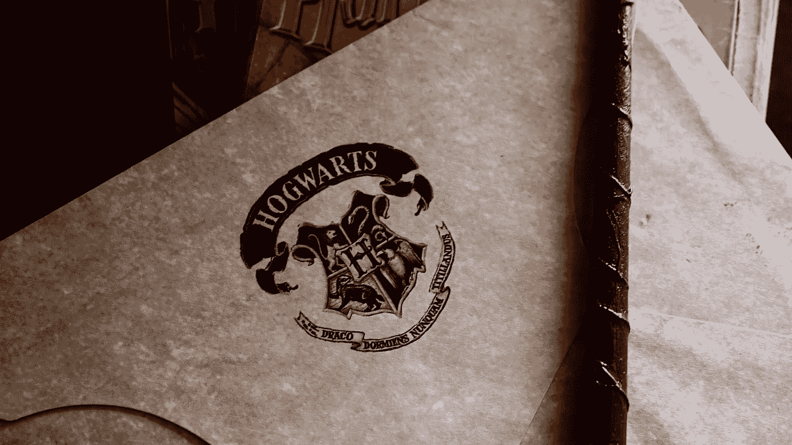
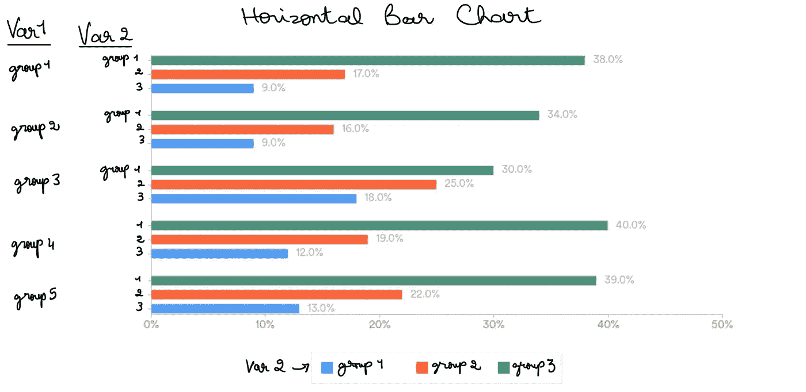
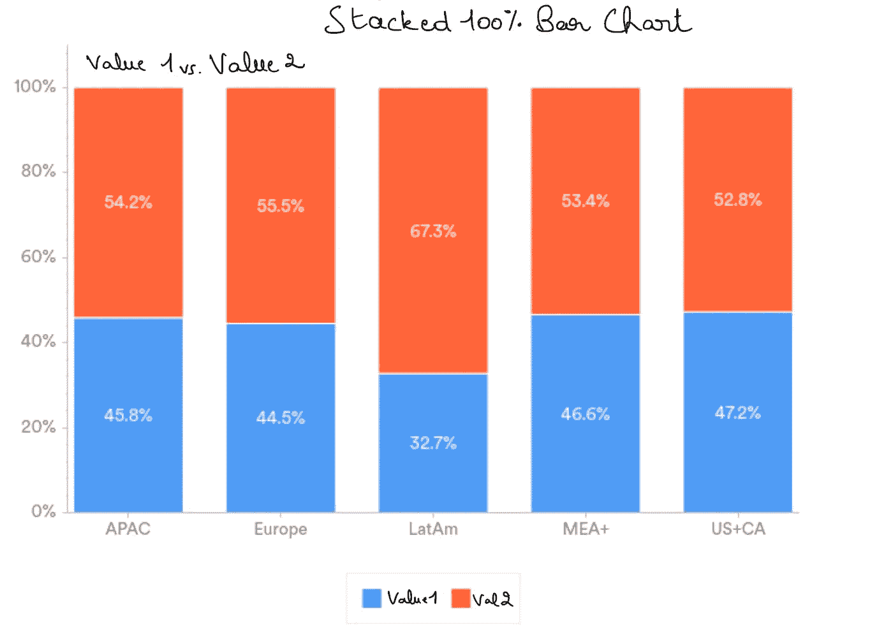

# 在申请科技公司之前，先掌握这 6 项必备的数据科学技能

> 原文：[`towardsdatascience.com/dont-apply-to-tech-without-mastering-these-6-must-have-data-science-skills-a-spotify-data-8b1b7b8cc0ba`](https://towardsdatascience.com/dont-apply-to-tech-without-mastering-these-6-must-have-data-science-skills-a-spotify-data-8b1b7b8cc0ba)

## 进入科技的魔法世界

## 一窥科技的魔法世界以及你需要做的准备才能成功成为数据巫师

[](https://medium.com/@elalamik?source=post_page-----8b1b7b8cc0ba--------------------------------)[](https://towardsdatascience.com/?source=post_page-----8b1b7b8cc0ba--------------------------------) [Khouloud El Alami](https://medium.com/@elalamik?source=post_page-----8b1b7b8cc0ba--------------------------------)

·发表在[数据科学之路](https://towardsdatascience.com/?source=post_page-----8b1b7b8cc0ba--------------------------------) ·阅读时间 20 分钟·2023 年 10 月 27 日

--



图片由[Tuyen Vo](https://unsplash.com/@bitu2104?utm_source=medium&utm_medium=referral)提供，[Unsplash](https://unsplash.com/?utm_source=medium&utm_medium=referral)

你是否一直在等待霍格沃茨的录取通知书？你的猫头鹰总是丢失在邮件中，你担心它可能永远不会到来？

如果你是一名渴望进入科技领域的 数据科学家，别再等待了。这里有一封信会让你像骑上扫帚一样飞向你梦想的公司。

我看到很多人今天自称为*数据巫师*。老实说，如果有比成为科学家更酷的事情，那一定是成为巫师。而在数据的世界里，如果有一个属于我们这些人的魔法世界，那无疑就是科技的魔法世界。

一旦你进入，你就获得了一剂成功与乐趣的神奇药水。

## 为什么？

+   **科技公司总是在人工智能竞赛的前沿** 在这个领域，大多数数据科学家在研发中处于产品的核心。这意味着一旦你进入，你就处于与尖端技术合作的最佳位置，并成为所有与人工智能相关事物的积极参与者。

+   **没有比科技行业更好的地方了，在这里你可以找到无尽的高质量数据来挥舞你的魔杖** 拥有丰富高质量数据的机会和可能性是无价的福利。你将不断地对数据进行实验，这将确保你始终保持竞争力。

不过，有一个问题，并不是每个人都有资格收到他们的魔法接受信。没有正确的魔法咒语，您可能会永远等待。

这就是我出现的地方。我在这里为您提供所需的内部地图。把它当作是 [马拉 uders 地图](https://harrypotter.fandom.com/wiki/Marauder%27s_Map)，我将在上面揭示所有隐藏的秘密通道，带您到达您想去的地方！


[Klim Musalimov](https://unsplash.com/@klim11?utm_source=medium&utm_medium=referral)拍摄的照片，来源于[Unsplash](https://unsplash.com/?utm_source=medium&utm_medium=referral)。

在这本“魔法书”——呃，文章中，我将与您分享将您转变为数据巫师的顶级技能，并帮助您找到在科技神秘领域中的位置（由一位科技女巫亲自撰写 ;）。

万圣节季节🎃，让我们将神秘感带入数据世界，揭开其中的魔法，好吗？

# 小小免责声明！

我将在下面分享的所有技能都是您在科技领域作为数据科学家所需的最重要的技能。

然而，由于“数据科学家”这个词在不同公司中可能意味着不同的事情，我实际上是在谈论我自己在 Spotify 的那种数据科学家。也适用于 FAANG 公司以及其他类似公司中的专家。

基本上，**利用数据生成洞察和价值以推动决策的人**。了解如何实现机器学习是必要的，但并不总是在实践中应用，除非需要。

基本上，**倾向于决策科学的数据科学家**。

> 本文适用于任何即将进入数据科学职业的人，无论您是学生、应届毕业生，还是已经在担任数据科学家的工作。

# 我在 Spotify 每天都使用这些技能。

自从 2.5 年前作为实习生加入 Spotify 以来，我一直在挥舞我的魔杖。我很幸运在没有掌握以下列出的技能的情况下进入公司。但我能逃脱的主要原因是因为我当时还是一名学生。

作为早期职业者，您可以逃避许多事情，但一旦开始积累经验，游戏规则也会开始变化。

除非您是作为实习生加入，否则进入科技领域（或其他任何工作）的障碍会迅速堆积在您面前。好消息是：您仍然可以进入这个圈子。

您只需聪明地玩转这场游戏，首先要确保手中掌握了正确的卡片，并在简历上出色地展示。这包括：

1.  掌握数据提取、准备与探索的炼金术

1.  用数据可视化编织迷人故事

1.  破解统计学的预测魔法

1.  通过 A/B 测试发现占卜的艺术

1.  学习 KPI 背后的数字魔法

1.  锻造您的巫师宝典

好吧，我知道这可能听起来有点神秘，但直接给你答案的乐趣在哪里呢 😈

# #1\. 掌握数据提取、准备和探索的炼金术


图像作者（DALL.E）

无论是分析 A/B 测试还是进行基础研究，过程总是从提取数据并将其转化为所需的形式开始。

我不是变形者，但我学会了在数据上施展技巧（或者至少我一直在尝试）。这通常从调用 SQL 的神奇功能来提取数据并将其转换为最终形态开始。然后，我们将数据集转移到 Python 中，以获得更深入的见解。

## 课程 #1 — **掌握数据汇总和处理复杂查询的艺术**

你可能认为你已经知道这些，但相信我，事情可能很快变得混乱。让我解释一下原因。

当我提到 SQL 时，我不是指基本的 SELECT 和 GROUP BY。在这个层面上，你需要调用更多的**高级查询函数**，例如窗口函数、日期时间数据、数组/结构操作等。

在我当前的一个项目中，我正在进行 A/B 测试分析，我们通过 4 个指标（+1 个防护指标以确保我们在过程中没有搞砸任何事情）来衡量成功 → 这意味着每次提取一个单一指标时，都需要编写 5 个复杂的查询，每个查询 40-50 行。

> 挑战？在复杂的查询网络中确保准确性。一旦你开始处理交织的查询，任何事情都可能出错。

## 课程 #2 — 掌握使用统计学进行探索性数据分析的技能

如果到这个阶段你已经磨练了从头创建准确数据集的技能，那么你已经通过了第一关。接下来是确保你使用统计技术和可视化工具（如直方图、散点图或箱形图）来理解数据。

> 再次强调，如果你不保持对数据数学含义的开放思维，事情可能很容易变得复杂。

在我之前提到的实验中，某个成功指标存在一些极端的异常值，这些值扭曲了指标结果。我不得不在用户级别上汇总数据，以捕捉这种偏差，然后正确地修复它。**这时统计知识就派上用场了。**

发现我的数据遵循泊松分布后，我能够通过一个简单的技巧来修正问题，即将异常值替换为比均值高 3 个标准差的限制值。这是我使用的查询：

```py
WITH statistics AS (
  SELECT
    CEIL(average_value + (std_dev*3)) AS upper_limit
  FROM (
    SELECT
      AVG(metric) AS average_value,
      STDDEV_SAMP(metric) AS std_dev
    FROM data
  )
)

SELECT
  id,
  IF(metric > s.upper_limit, s.upper_limit, metric) AS metric_count
FROM data us
CROSS JOIN statistics s
ORDER BY 2 DESC
```

如果这是一个正态分布，我会采用不同的方法，因为曲线的形状不同。具体来说，这种方法是：

```py
SELECT * 
FROM data 
WHERE metric_count <= 
(SELECT 
  DISTINCT PERCENTILE_DISC(metric_count, 0.997) OVER() AS percentile_99th -- 3 standard deviation above the mean to remove outliers
  FROM data)
ORDER BY 2 DESC
```

现在你明白为什么了解数据中的分布、趋势和潜在异常是如此重要了。就像我做的那样，有时你也需要通过在用户级别或其他维度上汇总数据来进一步挖掘。

## 你如何培养这些技能？

首先，动手使用 SQL 的高级函数进行复杂查询。学习如何检查查询的质量。

> 我恰好正在制作终极备忘单，帮助你学习数据科学家在科技领域最常用的高级 SQL 函数。
> 
> 注册我的通讯后，你就能获取到！你可以在下面的链接中找到，*⬇*

[](https://levelupwithk.substack.com/?source=post_page-----8b1b7b8cc0ba--------------------------------) [## K 的 DataLadder | Khouloud El Alami | Substack

### 一名 Spotify 数据科学家在科技领域的日常——起伏、学习和所有介于之间的事。点击阅读……

[levelupwithk.substack.com](https://levelupwithk.substack.com/?source=post_page-----8b1b7b8cc0ba--------------------------------)

复习统计概念与概率理论，并巩固基础：

+   **描述性统计** 确保你掌握数据的属性，如均值、中位数、方差和标准差，还包括异常值、四分位数等。

+   **分布理论** 使你熟悉不同的概率分布，如正态分布、二项分布和泊松分布（及其形状）。这将帮助你对数据做出正确的假设，并相应处理数据。

我仍然不时复习这些概念。即便是经验丰富的数据魔法师也常常需要刷新。毕竟，没有人能免于记忆法的失误。

# #2\. 用数据可视化编织迷人的故事


作者制作的图片 (DALL.E)

如果你还没意识到，所有优秀的数据科学家都仅仅依赖于他们的讲故事技巧。这在科技领域尤其如此。

讲故事就像是每个数据科学家必须精准掌握的魔法棒。即使是专家数据科学家也需不断磨练他们的叙事技能。

实际上，我将很快与其他 Spotify 数据科学家一起参加一个工作坊，学习如何制作有影响力的图表和数据可视化。科技公司非常重视这项技能——这完全有理由。

> 即使是你最突破性的发现，如果无法传达信息也会毫无用处。有效的沟通是关键，而它始于我们如何框定见解。

## 第 3 课——磨练你设计引人注目的视觉效果的能力，吸引你的同行高手。

第一个问题是什么？ **你的数据想讲述什么故事？**

## 想要可视化一个关系？

+   **散点图：** 这些是你绘制两个变量之间关系的首选工具。

+   **气泡图：** 需要包含两个以上的变量？气泡图能帮你搞定。

+   **困扰图：** 适合可视化不同组元素之间那些讨厌的重叠部分。


作者使用 Chartify 库制作

## 如何展示一个比较？

+   **时间序列数据：** 折线图或纵向条形图是最佳选择。


作者使用 Chartify 库制作

+   **静态数据：** 深入了解条形图，无论是垂直的还是水平的。漏斗图对于多个变量也很有效。



由作者使用 Chartify 库制作

## 需要检查分布吗？

+   **直方图和折线图：** 非常适合单变量洞察。

+   **散点图：** 它们非常适合显示两个变量的联合分布。

## 想要突出比例吗？

+   **时间序列数据：** 堆叠区域图，无论你使用绝对数字还是选择 100%基准。

+   **静态数据：** 堆叠条形图（100%基准）和百分位图是你的好帮手。



由作者使用 Chartify 库制作


由作者使用 Chartify 库制作

*想要深入了解如何将你的讲故事技能提升到一个新水平？那就一定要看看我写的这篇文章，它将帮助你实现这一目标！*

[## Step-by-Step Guide: The Art of Winning Stakeholders as a Data Scientist to Drive Impact](https://example.org/step-by-step-guide-the-art-of-winning-stakeholders-as-a-data-scientist-to-drive-impact-8dbb4e4a5179?source=post_page-----8b1b7b8cc0ba--------------------------------)

### 来自 Spotify 的数据科学家——将你的工作转化为行动的终极组合

towardsdatascience.com

## 课程#4——尝试使用仪表板工具提升简历

单独的可视化图表可以非常强大，而当它们组合在一起时则更具威力。

> 在科技领域，数据科学家通常构建仪表板以展示和跟踪关键指标。

在过去的几个月里，我花了大量时间从零开始设计和构建 Tableau 仪表板。我不是唯一一个，我的整个团队也投入了同样的精力来构建类似范围的仪表板。

> 为什么这么忙碌？因为数据科学家的真正魔力在于从研究中创造商业价值。由于我们不断支持跨职能的工程师、设计师、产品经理等团队，我们的时间变得更加宝贵。

我们不能被临时问题分散注意力。相反，精心制作的仪表板使利益相关者能够获取他们需要的数据，让我们可以专注于我们的强项——研究！

了解 Tableau 或 Power BI 等工具的基础知识，可以为你的科技职位简历增添一些额外的魔力！

我认为这不是必需的，因为你可以在工作中学习这项技能，但如果你渴望进入迷人的科技世界，可以考虑增加另一项技能。

我将在即将发布的文章中教你如何制作类似的图表。不要错过——点击订阅按钮！

# #3. **解密统计学的预测魔法**


图片由作者提供（DALL.E）

我们经常喜欢通过进行 A/B 测试来测试我们特性发布或更新的影响。当这种方法不可行时，我们转向其他估计发布因果效应的方法，如因果推断。

有时我们可能需要深入技术方法来对用户群体进行聚类或进行特征重要性分析，以理解用户行为 *(就像我在下面的文章中做的那样)*。

[特征重要性分析与 SHAP：我在 Spotify 学到的（在复仇者的帮助下）](https://towardsdatascience.com/feature-importance-analysis-with-shap-i-learned-at-spotify-aacd769831b4?source=post_page-----8b1b7b8cc0ba--------------------------------)

### 识别顶级特征并了解它们如何影响机器学习模型的预测结果，使用 SHAP

[特征重要性分析与 SHAP：我在 Spotify 学到的](https://towardsdatascience.com/feature-importance-analysis-with-shap-i-learned-at-spotify-aacd769831b4?source=post_page-----8b1b7b8cc0ba--------------------------------)

再次强调，掌握更高级的统计概念、建模和机器学习技术是基础。但你可能已经知道这一点。

## 第 5 课——深化你在分析、建模和预测方面的统计掌握

你不需要深入研究机器学习，比如沉浸于深度学习。实际上，我记不起上一次在日常工作中应用这些复杂性的情况。

然而，这并不意味着你所有的统计知识都会被遗忘。可以说，它被重新用于更实际的应用。此外，还有比深度学习更复杂的内容。

进行因果推断分析可能会很有挑战，具体取决于使用场景，但结果通常更直接且不那么抽象，相比于你可能在深度学习的研究中找到的内容。

所以答案是肯定的，你需要了解统计和概率。你可能不会做很多机器学习的操作，但我发现能够探索统计的力量比机器学习更有趣。这是相当被低估的。

# #4\. 发现 A/B 测试的艺术 **与** 创新


作者提供的图像 (DALL.E)

*想象一下像 Spotify、Apple、Google 等公司。它们有什么共同点——我不是说它们都是科技公司？*

这是创新。这些公司不断大量投资于新奇的事物。这就是它们保持竞争力的方式。研发是科技的核心。它从创建一个新特性并进行测试开始。

在这个过程中，数据科学家扮演着关键角色。我们进行研究，推动新特性的出现。然后，我们进行测试，以判断这个新特性是否值得发布给整个客户群。

怎么做？我们设计实验，也称为 A/B 测试来验证我们的假设。当你看到一个新特性被发布时，是因为它经过了实验的检验。

> 作为数据科学家，我们参与实验的创建，选择指标并分析结果。
> 
> 我们确保实验在统计上是正确的，结果是可以解释的。这样，我们最大限度地提高了基于数据的决策的可能性。

## 第 6 课 — 熟悉 A/B 测试的基础知识

不得不说，这一切又都涉及统计学。它们无处不在，我们似乎无法摆脱它们。

进行实验完全依赖于假设检验的统计概念。因此，确保你彻底了解这一点。

我在加入 Spotify 之前从未做过 A/B 测试。我尝试学习这个，但坦白说，当你没有直接在公司内部做这个事时，很难做到。如果你目前的工作中没有机会学习 A/B 测试，那么这里有一个简单的逐步指南，帮助你掌握这些概念：

## 1\. 假设检验

+   **这是什么？** 确定数据中是否有足够的证据推断某个条件对整个总体而不仅仅是我们测试的样本成立的过程。

+   **为什么重要？** 这是 A/B 测试的核心；你在测试改变（B）是否比现状（A）更好。

+   **如何学习？** 参考基础统计学教材或在线课程，重点关注推断统计学。

## 2\. 检验统计量

+   **这是什么？** 一个标准化的值，帮助决定是否拒绝原假设（现状）。它们帮助你评估你在对照组（A）和处理组（B）之间观察到的差异是否具有统计学意义，还是可能由于随机偶然因素产生的。

+   **为什么重要？** 这个值会告诉你测试中观察到的效应是否可能是由于偶然因素还是你所做的改变。

+   **如何学习？** 与假设检验一起学习。像可汗学院或 Coursera 这样的在线平台提供了很好的模块来覆盖这一点。

这是主要检验统计量及其使用时机的详细说明：

1.  **Z 检验 →** 当样本量较大且总体方差已知时使用。

1.  **学生 t 检验 →** 当样本量较小且总体方差未知时使用。

1.  **卡方检验 →** 用于分类/二元结果的测试，以检查观察到的频率与预期频率的差异。

1.  **F 统计量 →** 用于在 A/B/C…测试中比较多个组之间的方差。

检验统计量是根据样本数据计算的，我们利用它来确定 p 值。

**什么是 p 值？** 在假设原假设为真的情况下，观察到的检验统计量与样本中计算出的检验统计量一样极端或更极端的概率。

## 3\. 样本量计算

+   **这是什么？** 基本上，是你需要多少观察才能检测到对照组和处理组之间的显著差异。你不能在整个客户群体（总体）上测试你的新特性，万一出现问题怎么办？我们不想在总体中搞乱事情，因此我们使用样本。

+   **这有何意义？** 观察数量过少可能会错过真实效果；观察数量过多可能浪费资源（或影响体验）。

+   **如何学习这个？** 使用在线计算器来获取感觉，然后通过在线课程或统计学教材深入学习数学。

## 4\. 基础曝光与自定义曝光

+   **这是什么？** 基础曝光是指默认百分比的用户会接触到某个变体，而自定义曝光则允许进行特定的定向。例如，我们可能只希望那些在 Spotify 上播放过歌曲的用户，而不仅仅是打开过播放列表的用户。

+   **这有何意义？** 确保你在测试正确的人群，并且不会偏倚你的结果。

+   **如何了解更多？** 阅读来自主要科技公司的案例研究或 A/B 测试最佳实践，以了解不同的策略。

## 5\. 最小可检测效果（MDE）

+   **这是什么？** 你希望你的测试能够检测到的最小效果大小。

+   **这为什么重要？** 有助于样本大小计算，并为“成功”测试设定明确的基准。

+   **如何了解更多？** 关于 A/B 测试的文章和案例研究通常会讨论这一点。一些 A/B 测试工具内置了计算器。

## **6\. 新颖效应与首因效应**

+   **这是什么？** 用户可能对新事物（新颖性）有积极反应，或者更容易记住他们首次看到的东西（首因效应），这可能会影响结果。

+   **这为什么重要？** 确保你没有将短期的兴奋误认为是实际的偏好。

+   **如何了解更多？** 行为心理学资源可以提供见解，A/B 测试文献也可以深入探讨这些偏差。

你还可以生成模拟数据并进行 A/B 测试，以获取对过程的感觉。

在我即将发布的文章中，我会更深入地探讨 A/B 测试，因为我目前在 Spotify 学到了很多关于这一点的知识。如果你想了解更多，请继续关注！

> 最后一句话——记住我们正在涉足统计学的领域。绝对的确定性是一种幻觉。然而，优秀的数据科学家努力遵循实验最佳实践，以避免因假阳性或假阴性导致的误导性结论。

# **#5\. 了解 KPI 背后的数字魔法**


图片由作者提供（DALL.E）

自从我加入公司以来，我听到的最多的就是指标讨论。这对我来说总是感觉相当模糊，就像“数字魔法”这个词一样。起初，由于复杂性，我并不总是参与定义指标的过程，但现在我参与了。

将业务目标转化为可衡量的 KPI 是至关重要的。这通常是数据科学家的职责之一，将业务目标正确地转化为可操作的指标。

> 指标框架成为许多利益相关者的参考点，特别是当我们想要衡量成功并跟踪进展时。

## 课程 #7 — 学习指标背后的哲学

让我们以 A/B 测试为例进行讨论。

如果你不知道如何正确定义你的指标，你的实验将毫无价值。如果你没有选择合适的指标来捕捉你试图衡量的变化，你可能会：

1.  因为你可能选择了不够敏感的错误指标而错过了变化

1.  对你试图衡量的任何漏洞修复或功能发布的真实效果得出错误结论

1.  制定错误建议可能会带来更大的后果

定义指标并不像看起来那么简单。我们在我参与的上一个实验中花了几周时间讨论指标，以找到衡量成功的最佳方法。

因为我们花了很长时间讨论指标，我意识到它们是多么重要。

## 在创建指标时，数据科学家常常需要确保它们：

+   易于定义、理解和创建。

+   在实验中可重复使用。

+   对变化敏感且响应迅速。

## 如何学习指标的哲学？

如果你无法获得现实世界的指标，你可以：

1.  **深入案例研究：** 在线有许多商业案例研究。选择一个与你感兴趣的行业相关的案例。试图了解业务目标，并对可能衡量成功的指标进行头脑风暴。

1.  **启动理论项目：** 想象一个假设的产品或服务。成功的标准是什么？为这种成功定义关键绩效指标。你甚至可以与同事或导师讨论以获得反馈。

1.  **阅读科学论文：** 我最近深入研究了这篇由 Alex Deng 和 Xiaolin Shi 撰写的[论文](https://exp-platform.com/Documents/2016KDDMetricDevelopmentLessonsDengShi.pdf)，作为我对指标框架研究的一部分。我发现它非常有信息量并且适用于实际案例，我建议任何刚开始研究指标的人都阅读它。

对于那些已经在工作中的人，你可以：

1.  **参与跨职能合作：** 与公司内的产品经理或业务战略家合作。了解更广泛的业务目标，并对可能与这些目标一致的关键绩效指标进行头脑风暴。

1.  **回顾过去的项目：** 回顾以往的项目或实验。设定的指标是否有效？它们是否捕捉到了预期的效果？反思过去的经验可以是一个很好的学习工具。

1.  **找一个导师：** 如果你的组织里有一个特别擅长指标设置的人，考虑请他们指导你。定期讨论可以帮助你完善指标的方法。

> 指标不是一成不变的。随着业务目标的演变，你的指标也应随之调整。

# #6\. 锻造你的**法典**


作者提供的图像（DALL.E）

虽然你的数据科学技艺至关重要，但你使用的工具和技巧——你的代码——需要保持锋利和强效。

## 第 8 课——提升你的编程技能，以便更好地独立解决问题和团队协作

让我们深入探讨一下这意味着什么：

1.  **代码编写效率：** 能够编写有效的代码是有价值的，但效率不仅仅是速度。它涉及到创造能够最佳运作、明智使用资源并且容易被他人理解的解决方案。

1.  **Python 和 SQL 精通：** 这些是许多数据科学家的核心技能。确保你不仅仅是熟悉它们，而是深入了解它们的复杂性。

1.  **大数据平台：** 随着数据的增长，其复杂性也在增加。像 BigQuery 或 AWS 这样的平台在处理大数据方面处于前沿。熟悉这些平台可以提升你的简历，并让你看起来‘随时准备行动’。

1.  **代码组织与文档：** 干净、组织良好的代码不仅是为了你自己。这是为了将来可能会接触到你工作的人。确保你学习编写可共享代码的最佳实践。

1.  **与 Git 的协作：** 数据科学不是一个人的工作。共享和存储代码是必不可少的，像 Git 这样的平台使其变得无缝。除了‘了解’ Git，尝试理解提交信息、分支和合并的最佳实践。我认为 Git 并不是特别直观，但它可以改变游戏规则。

1.  **持续学习：** 技术领域迅速变化。库更新，新工具不断出现，方法论也在变化。保持更新不仅是有益的，而且是必需的。确保你留出时间进行探索，以免过度落伍。

*要深入阅读，你可以查看我写的这篇文章，详细介绍了掌握 Python、SQL 和机器学习的顶级内容以及方法！*

[](/dont-start-your-data-science-journey-without-these-5-must-do-steps-from-a-spotify-data-scientist-c9cec11fd1b?source=post_page-----8b1b7b8cc0ba--------------------------------) ## 不要在开始数据科学旅程前错过这五个必须做的步骤，来自 Spotify 数据科学家

### 这是我在开始数据科学之旅之前希望自己能做到的一切的完整指南，祝你第一年顺利……

[towardsdatascience.com

# 终极技能——最后一个要点


作者提供的图片 (DALL.E)

> 确保你始终将一切与潜在的业务目标连接起来。这是最宝贵的技能。

科技公司首先是商业企业，因此我们所做的一切都与推动全球商业目标相关。每一份数据、每一个分析和每一个建议都应与更大的商业愿景产生共鸣。

*这将贯穿于你的整个数据科学职业生涯——它本身就是一段旅程。*

**为了展示你出色的商业敏锐度**，确保你练习解决根植于现实商业场景的数据问题。这些是你在简历上最要突出的。

考虑将这些添加到你的 Github 仓库中（你将把它们链接到你的简历上），以及一个详细说明你的策略、见解和建议的幻灯片。这样，他们会知道谁才是真正的老板——我是说游戏中的“巫师”。

# 总结——在申请科技职位之前磨练这些技能可以增加你获得梦想工作的机会。

当然，这意味着你必须确保在简历上突出这些内容，否则他们怎么会知道你的魔法能力？所以请通过引用示例和链接展示你的项目来做到这一点。

就像未能有效传达重要见解——如果你不能以引人入胜的方式分享这些内容，那就没有意义了 ;)！

## 1\. 学习高级数据处理和探索性数据分析（EDA）

→ 专注于掌握 SQL 的高级功能，以提升你的准确性和处理复杂查询的能力。

→ 复习统计概念和概率理论，以提高你的 EDA 能力并捕捉异常。

## 2\. 发展讲述引人入胜的视觉故事的技能

→ 熟悉你可以使用的不同类型的视觉效果以及它们的不同应用场景。

→ 练习使用不同的可视化库，并打磨你的风格。

→ 试验像 Tableau、Power BI、Data Studio 等仪表盘工具。

## 3\. 深入掌握统计学以进行建模和预测

→ 复习你的数学基础。

→ 探索统计学在商业用例中的其他应用，而不仅仅是机器学习。

## 4\. 熟悉 A/B 测试的基础知识

→ 复习假设检验、检验统计量、样本量计算、暴露量、最小可检测效应等概念。

→ 模拟你自己的 A/B 测试，并进行在线练习。

## 5\. 了解指标框架背后的哲学

→ 了解如何成功设置指标。

→ 如果你是学生或没有从事数据科学工作，你可以深入研究案例研究，开始理论项目，阅读科学论文。如果不是，你也可以与同行合作，回顾过去的项目，或者寻找一个导师。

## 6\. 提升你的编程武器库

→ 学习如何编写高效的 SQL 和 Python 代码，以便同行在 Git 上可以共享和阅读。

→ 尝试大数据平台，以提升你的简历。

→ 继续学习最新的科技和人工智能趋势。

在这一点上，我写这篇文章很开心，也希望你读起来也很开心！愿这篇文章能为你的科技之路增添光彩。干杯🎃！

# 我有礼物送给你🎁！

注册我的[**新闻通讯**](https://levelupwithk.substack.com/) **K’s DataLadder**，你将自动获得我的**终极 SQL 备忘单**，其中包含我在大科技公司工作中每天使用的所有查询 + 另一个神秘礼物！

我每周分享作为科技领域数据科学家的经验，包括实用技巧、技能和故事，旨在帮助你提升水平——因为没有人真正知道，除非他们亲身经历！

## 如果你还没有做过

+   订阅我的[**YouTube**](https://rebrand.ly/tdf62uv)频道。新视频很快就会发布！

+   在[**Instagram**](https://www.instagram.com/elalamikhouloud/)、[**LinkedIn**](https://www.linkedin.com/in/elalamik/)和[**X**](https://twitter.com/elalamik)上关注我，选择你喜欢的方式

很快见！
