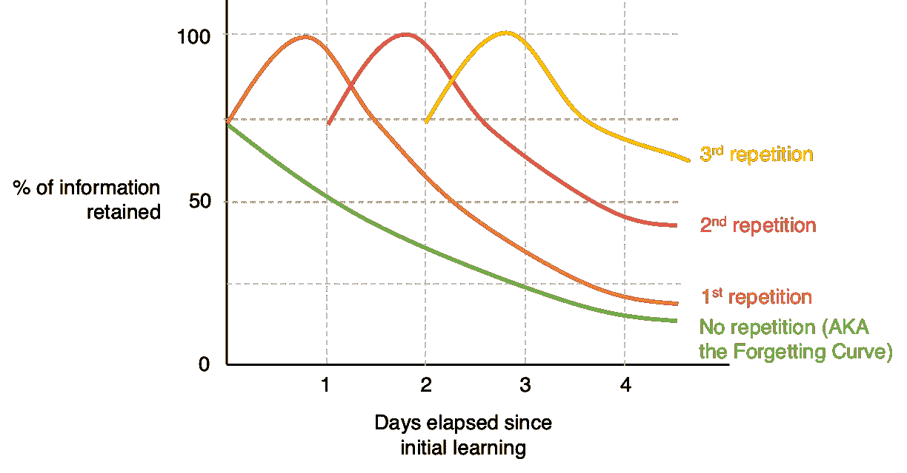

# 不要害怕超越在线编程课程

> 原文：[`towardsdatascience.com/dont-be-afraid-to-go-beyond-online-coding-courses-9667ebdea9a7`](https://towardsdatascience.com/dont-be-afraid-to-go-beyond-online-coding-courses-9667ebdea9a7)

## 互动编程课程很棒，但（由于设计原因）它们只能帮你走到一定程度。以下是如何在克服其局限性的同时最大化它们的潜力

 [Matt Chapman](https://medium.com/@mattchapmanmsc?source=post_page-----9667ebdea9a7--------------------------------)

·发布于[Towards Data Science](https://towardsdatascience.com/?source=post_page-----9667ebdea9a7--------------------------------) ·8 分钟阅读·2023 年 5 月 8 日

--

图片由[Alex Radelich](https://unsplash.com/@alexradelich)提供，来源于[Unsplash](https://unsplash.com/photos/2gYsZUmockw)

我在 2019 年开始了我的第一个在线编程课程。

我还没有完成它。

这个课程承诺通过构建真实世界的应用程序来教你 Python。我很喜欢这个课程，但它并没有特别关注 Python 的*数据科学*应用场景，不久之后我就放弃了它。

根据 2019 年麻省理工学院研究人员的研究[1]，我并不是唯一一个习惯于放弃在线课程的人——这些课程的辍学率常常高达 96%。我的朋友们，如果你们是那 4%*不*退学的人，请自我介绍一下。你们是谁？

尽管如此，尽管我个人缺乏毅力，我对在线编程课程还是充满了喜爱。我在像 CodeAcademy 和 Udemy 这样的网站上上过（并享受过！）许多课程，并且我经常向有志成为数据科学家的朋友推荐这些课程。

但问题是。

像所有形式的学习一样，它们也有其局限性。如果你没有意识到这些，那么**你有很高的风险错过那些对建立成功的数据科学职业至关重要的东西**。我在本文中的目的是突出这些局限性，以便你对这些网站能为你的职业带来什么有更现实的期望。

我将先讨论在线编程课程的优点，然后讨论一些局限性，最后讨论如何在充分利用这些课程的同时避免它们的陷阱。

# 在线课程使学习数据科学变得非常简单

从你登陆 CodeAcademy.com 的那一刻起，大约需要 41 秒来创建账户、注册免费课程并开始编码。我知道，因为我刚刚测了时间。

在 2023 年，这可能听起来并不特别值得注意。毕竟，我们是 i 世代——我们习惯了只需点击几下就能快速上手。

但当你考虑数据科学教育的历史背景时，这点*令人瞠目结舌*。在这些网站出现之前，学习“数据科学”的主要方式是阅读那些名字吓人的大部头书籍，比如*统计学习的要素*和*模式识别与机器学习*。**即使是我们这些斯莱特林也不得不承认，自那时以来我们已经取得了令人印象深刻的进展。**

为什么速度很重要？好吧，冒着陈词滥调的风险，如果你是想学习**编码**的人，那么你实际上是想学习如何**编码**，而不是安装包和在命令行上卡住。像**CodeAcademy**这样的网站让你能够轻松跳入学习，而不必麻烦的设置过程，这是非常棒的。

# 他们的引导路径对于像我这样毫无头绪的新手来说非常棒。

除此之外，这些网站提供了出色的引导学习路径。作为一个[最近刚刚转行进入数据科学领域](https://medium.com/@mattchapmanmsc/career-change-into-data-science-in-2023-was-it-worth-it-9e0c47b3b416)的人，这点对我帮助巨大。为什么？因为*学习编程最难的事情之一就是知道从哪里开始*。你应该选择哪些语言？你应该以什么顺序学习各种函数和方法？你应该解决什么样的问题？

在线编码课程去除了这一猜测过程。通过提供清晰的引导路径，它们展示了你需要学习的内容，并给出大致的学习时间估计。我喜欢这样，因为它使目标变得非常具体。**CodeAcademy**提供的职业路径（除了技能路径）使这一点更加真实：完成“数据科学家：NLP 专家”路径的目标比“学习 Python，以便进行数据科学”这种模糊的目标要更容易实现。

到了这一步，你可能会想：有什么不好的吗？在线课程似乎很棒！不过，除了这些优势之外，还有一些重要的局限性需要注意。

# 他们不会教你“宏观层面”的问题解决技能。

图片由[Olav Ahrens Røtne](https://unsplash.com/@olav_ahrens)提供，来源于[Unsplash](https://unsplash.com/photos/4Ennrbj1svk)。

这些网站的速度和结构意味着它们非常擅长教你如何编码——编写语法和理解新的编程语言。但 Python 并不等于数据科学。SQL、R 或任何其他单独的语言也是如此。

> Python 并不等于数据科学。

数据科学不能简化为一堆编码语言；它远不止于此。这是一种利用科学方法以假设驱动的方法解决问题的学科。它*不是*仅仅解决像 Fizzbuzz 或旅行推销员这样的抽象编码难题。

不要误解我的意思：我并不反对这些挑战。解决快速的难题是提升编码技能和练习解决跨领域问题的好方法，这是一个很棒的技能。但这些难题与数据科学家日常工作中遇到的问题相差甚远。在行业中，你通常需要从根本原因入手：将商业问题转化为可验证的假设或机器学习用例，并制定如何用数据科学方法解决它的计划。做好这一点是至关重要的技能，但遗憾的是，这种技能很难通过 MOOCs 或标准化编码课程来教授。

# 他们很少教你如何在浏览器外运行代码

许多课程提供基于浏览器的互动开发环境（IDEs），不需要你安装任何软件。

然而，尽管这些基于浏览器的 IDEs 在速度和可及性方面很出色，但它们也有不少缺点。最大的问题是，你可能会在不知道如何在特定平台之外运行代码的情况下完成在线课程。你学会了语法，但不知道如何在解决现实问题时“在野外”执行代码。

# 他们鼓励你作弊，但方式不对。

图片由 [Lucas Sankey](https://unsplash.com/@lucassankey) 提供，来源于 [Unsplash](https://unsplash.com/photos/Rm7LVHHItWA)

我们都经历过这种情况：你在一个 HackerRank 挑战上卡了好几个小时，完全没有思路。在你脑海里，你知道 Google 一下这个问题大概只需 5 秒钟，便可以找到一些代码复制粘贴。诱惑是难以抵挡的。

许多标准化在线课程面临相同的问题：如果你遇到困难，可以使用 Google 找到你的问题的答案。很多人参加这些课程意味着可能有人以前问过*完全相同*的问题，并得到了完美的回答，说明你需要做什么。这使得作弊变得非常容易，而在没有真正学习底层理论和框架的情况下通过在线课程。

当然，作为数据科学家“作弊”并没有什么错——这叫做 StackOverflow！（也就是说，如果我们把作弊定义为查找其他人代码中的有用提示的话）。但通常在像 StackOverflow 这样的站点上，你不能直接将别人的代码应用到你的问题上；你必须弄清楚如何将其调整以适应你的具体问题。你不是直接复制粘贴；而是复制-调整-粘贴。因为你通常可以在在线课程中找到*确切*的答案，你不总是学到这种复制-调整-粘贴的技巧。你只学会了如何复制和粘贴。

# 很难记住你所学的内容

人类在记忆新信息方面 notoriously 糟糕：平均而言，我们在学习后的一个月内忘记 90% 的新信息 [2]。正如 1880 年艾宾浩斯提出的遗忘曲线著名地展示的 [3]，为了让信息真正记住，你需要一遍又一遍地重新学习它。

图片由作者提供，基于艾宾浩斯经典的遗忘曲线

像 Duolingo 这样的应用程序对此非常了解：你会重复看到相同的信息，并通过轻微的变化来帮助你学习基本概念。然而，在许多在线编码课程中，课程进展非常快，你不总是有机会重新回顾之前学过的概念。

根据我的经验，这使得记住我所学的所有信息变得困难，我常常发现自己在记住即使是基础的新语法时也感到困难，因为我没有机会通过在线课程进行实践。

# 这让我们处于什么境地？

我对在线编码课程的总体看法在下图中总结。

图片来自[Neil Thomas](https://unsplash.com/@finleydesign)于[Unsplash](https://unsplash.com/photos/SIU1Glk6v5k)

在线数据科学课程可以是一个很好的资源，帮助你快速成长，但正如我在这篇文章中尝试展示的那样，它们也有其局限性。随着你进一步发展并希望过渡到现实世界的角色中，你需要找到在没有它们支持的情况下继续成长的方法。

那么，我们如何解决这些限制呢？这是我的一些建议：

1.  **学习问题解决框架以及编码语言。** 要成为一名成功的数据科学家，你需要学习如何将业务问题转化为具体的机器学习应用案例和可测试的假设。我在‘[如何寻找独特的数据科学项目创意](https://medium.com/towards-data-science/how-to-find-unique-data-science-project-ideas-that-make-your-portfolio-stand-out-1c2ddfdbefa6)’中谈到我自己的方法。

1.  **不要仅仅参加编码课程；还要上那些教授你在现实世界中运行代码所需支持工具的课程**（例如，GitHub、Jupyter notebooks、VS Code）。知道如何编码对于获得数据科学家的职位至关重要。但要在现实世界中运行代码，你需要掌握像 GitHub、Jupyter 和 AWS、Google Cloud Platform 等云工具。幸运的是，这些工具的技能门槛很低：掌握基础知识并不需要很长时间，你可以通过 YouTube 上的免费课程轻松自学。

1.  **尝试在课程提供的浏览器 IDE 之外应用你所学的知识**。如果你只在在线编码课程的课程内容中做项目，你将难以在未来求职时脱颖而出。根据我的经验，[创建在线作品集](https://medium.com/towards-data-science/the-portfolio-that-got-me-a-data-scientist-job-513cc821bfe4)是一个极其有用的方式来应用你的新技能，并向雇主展示它们。我的建议是将你在在线课程中学到的东西应用于个人项目，而不是课程内置的 IDE 中。

# 哦，还有一件事——

我开始了一份免费的新闻通讯，名为 [AI in Five](https://aiinfive.substack.com/)，每周分享 5 个要点，涵盖最新的 AI 新闻、编码技巧和数据科学家/分析师的职业故事。没有炒作，没有“数据是新石油”的废话，也没有埃隆的推文——只有实用的技巧和见解，帮助你在职业发展中提升。如果这听起来对你有帮助，[点击这里订阅](https://aiinfive.substack.com/)！

[## AI in Five | Matt Chapman | Substack](https://aiinfive.substack.com/?source=post_page-----9667ebdea9a7--------------------------------)

### 最新的新闻、职业故事和编码技巧，从数据科学和 AI 的世界中总结出 5 个要点…

[aiinfive.substack.com](https://aiinfive.substack.com/?source=post_page-----9667ebdea9a7--------------------------------)

# 来源

[1] [MOOC 转型](https://www.science.org/doi/10.1126/science.aav7958)

[2] [设计教育体验时的考虑因素](https://www.sciencedirect.com/science/article/abs/pii/B9780128196205000199)

[3] Ebbinghaus H (1880) *Urmanuskript “Ueber das Gedächtniß”*。帕绍：帕萨维亚大学出版社。
