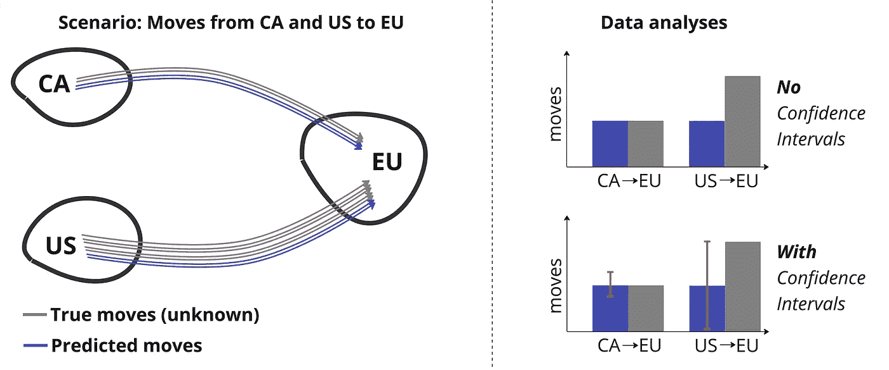
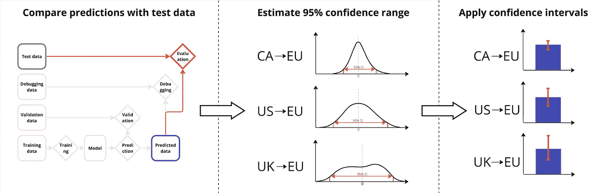

# 不要忘记你的 ML 产品的置信区间

> 原文：[`towardsdatascience.com/dont-forget-confidence-intervals-for-your-ml-product-272009bfab56`](https://towardsdatascience.com/dont-forget-confidence-intervals-for-your-ml-product-272009bfab56)

## 机器学习从来不是 100%正确的。因此，ML 模型只有在用户理解预测的不确定性时才有帮助。

[](https://medium.com/@benjamin.thuerer?source=post_page-----272009bfab56--------------------------------)[](https://towardsdatascience.com/?source=post_page-----272009bfab56--------------------------------) [Benjamin Thürer](https://medium.com/@benjamin.thuerer?source=post_page-----272009bfab56--------------------------------)

·发表于[Towards Data Science](https://towardsdatascience.com/?source=post_page-----272009bfab56--------------------------------)·7 分钟阅读·2023 年 10 月 10 日

--

几乎每天我们都会发现新的机器学习产品、服务或数据集的发布。尽管我们处于人工智能时代，但很少有这些产品会告知用户对结果的置信度。然而，[研究](https://doi.org/10.1145/3351095.3372852)表明，良好的决策需要了解何时信任 AI，何时不信任。否则，用户常常需要频繁尝试模型以了解何时可以信任该模型以及何时不能信任，以便确定所提供的产品是否对他们有用。

用户采用这种试错原则的原因在于每个模型（无论是基于机器学习还是统计学）都是建立在数据及其不确定性上的。模型的基础数据并不代表模型所要预测的实际真相。否则，如果那个真相是可以获得的，你本来不需要模型。因此，得到的模型只会提供一个估计值，而不是一个真实值。

> 简而言之，机器学习和统计模型的正确性是不确定的，不能总是被信任。

# 示例：预测跨县移动

让我们举一个例子（图 1）。假设一个产品为你提供从一个国家到另一个国家迁移的人数。当然，存在一些数据（如税务报告）可以提供这些信息，但这些数据是否真正代表了全部迁移人口？每个学生、移民或前配偶都会更改他们的税务报告吗？不，很可能不是这样。因此，即使是提供迁移信息这样简单的产品也会偏向其底层数据样本（例如公开的税务报告）。更复杂的产品容易出现偏见，这是很容易想象的。

对于机器学习来说，这种限制更为严重，因为其概率性质、多样的输入以及每个输入仅代表总体的一小部分。因此，底层模型会偏向训练数据中描述的大多数情况，并会偏离我们不知道的真实世界情况。简而言之，机器学习和统计模型的正确性是不确定的，不能总是被信任。



图 1：模型预测从一个国家到另一个国家的迁移示例。用户不知道真实的迁移情况（灰色）。如果不了解模型的置信度，结果的解释可能会产生误导。在这种情况下，假设从 CA 到欧盟和从美国到欧盟的人数是相同的。

# 置信区间将决策留给用户

我们有时*盲目*信任数据产品的原因在于我们对开发产品的人或公司有信任。我们确实期望公司在推出产品之前进行严格的质量测试。但在一个越来越多工作也外包给人工智能的资本主义世界中，我们能否相信每个产品的发布都足够好且经过适当测试？

实际上，**没有**任何数据产品（特别是没有机器学习模型）会告诉你何时它是错误的。它只会给你一个预测（无论这个预测有多么偏离）。那么，如果一个重要的业务决策是基于错误的预测做出的，那该怪谁呢？作为开发这个产品的数据科学家，我不想成为那个被责怪的人！这就是为什么提供直观的置信区间对于每一个数据产品都很重要。

> **置信区间是告知客户产品不确定性的解决方案，以便他们可以做出是否信任预测的明智决策**。

起初这听起来很复杂，有些用户可能会对*置信区间*这一术语感到害怕，但它们并不像听起来那么可怕。直观的置信区间是有帮助的，也是产品质量的标志。它们显示公司关心你作为用户，因为他们试图帮助你做出最佳决策。

# 什么是 95%置信区间？

选择 95%的置信区间是一种常见的描述信心的方法，因为它易于解释。置信区间包含数据的下限和上限（通常显示为图表上的细条）。下限和上限基本上描述了一个范围或一个走廊，其中 95%的预测值将落在实际（未知）真实值的范围内。因此，较大的范围（与预测值相比）表明用户应该对所提供的值的信心较低，因为潜在的真实值可能会有很大差异。

# 如何计算置信区间？

以上面的例子为例，定义一个产品，该产品提供从加拿大和美国到欧盟国家的迁移量。如图 1 所示，这里的假设模型对来自加拿大的迁移预测更接近真实情况。因此，告知最终用户对加拿大模型的高信心与对美国模型的低信心相比，将是有益的。

如果我们不以置信区间的形式提供这些信息，则数据的直观结论（右侧的蓝色条，因为你无法知道灰色条）是两个国家向欧盟的流出量相等。然而，一旦我们添加描述对这些数字的信任度的置信区间，解释就会发生变化。如果置信区间描述了 95%的信心，那么更好的解释是实际的迁移量可能与这里提供的差异很大。它可能是两倍多，但仍然在 95%的置信范围内。因此，用户不应仅依据所提供的数据做出商业决策，而应关注 CA 迁移或评估其他数据来源。



图 2：当你的模型通过测试数据得到积极评价并投入生产时，你可以使用这些测试数据来计算真实值与预测值之间的差异，这反过来允许你估计置信范围。

那么我们如何创建并添加置信区间到我们的模型中？顾名思义，要构建置信区间（或任何其他信心度量），你首先需要定义你的指标代表什么以及信心对你和你的用户意味着什么。衍生信心度量的方法有很多，但都依赖于某种可以用来验证和测试你预测的知识。例如：

+   **当你拥有真实数据时：** 真实数据通常在历史上已经存在或在某个延迟后出现。如果是这样，可以用来评估你的预测偏差有多大，并且可以用来更新你对未来预测的信心。例如，当你可以访问税务报告以查看有多少人迁移时，你可以看到你的预测与实际情况的相关性如何。

+   **当你对你的预测拥有专家知识时：** 对于很多产品来说，真实情况并不总是可用的，或者有很长的延迟。然而，有时你可以定义数据应该遵循的某些特征或模式。如果是这样，你可以将这些特征视为与真实情况的相关因素，并让它们帮助你建立置信区间。例如，当你对 Covid19 如何影响运动有专家知识时，你可以分析你的预测与这些知识的匹配程度。

+   **当你有一个测试集评估时：** 即使没有持续的真实情况或专家知识，你仍然可以使用测试集评估来描述置信区间（见图 2）。每个建立的模型都需要一个测试集，以确保模型能够成功预测预期结果（有关模型开发的更多信息，请参见[这里](https://medium.com/towards-data-science/success-in-ml-projects-through-technical-drawings-69dd8d2744a4)）。该测试集还会告诉你模型的表现良好与否。至少对于样本内类别，它将允许你提供置信区间。不过，缺点是模型随着时间的推移容易发生漂移。因此，找到更新置信区间的方法是很重要的。

# 简单代码示例 (SQL)

当你拥有上述条件之一时，估计 95%的置信区间可以相当简单，只要数据是正态分布的，并且每个样本相互独立（没有自相关）。下面是如何在标准 SQL 中估计每个类别（主键）的置信区间的示例。

*首先，我们计算预测结果与真实情况之间的误差：*

```py
SELECT 
  date, 
  primary_key, 
  (prediction - groundtruth) AS error
FROM input_table
```

*然后，基于标准差和样本大小计算误差范围：*

```py
WITH base as (
SELECT
  primary_key,
  count(*) AS n,
  STDDEV(error) AS error_std
FROM error_table
GROUP BY primary_key
)

-- 1.96 represents z-score for 95% confidence level
SELECT
  primary_key,
  1.96 * SAFE_DIVIDE(error_std, sqrt(n)) AS margin_of_error
```

*最后，应用误差范围来推导下限和上限置信区间：*

```py
SELECT
  date,
  primary_key,
  prediction - margin_of_error as lower_confidence_interval,
  prediction + margin_of_error as upper_confidence_interval
FROM input_table
JOIN margin_of_error_table USING(primary_key)
```

# 总结

统计和机器学习模型提供的是估计，而不是真实情况。我们都必须理解这一点，并找到相应的工作方式。置信度的测量将允许用户理解在基于某个模型的产品中应对收到的答案投入多少信任和权重，从而使用户能够做出更好的决策。

重要的是要强调，低置信度得分并不一定意味着产品质量低，这可能只是意味着产品不适用于当前的用例，其他数据源在决策过程中应当更具权重。

可以得出结论，置信区间为最终用户提供了帮助，以做出明智的决策，同时也保护数据科学家免于过于简单的解读，认为每个数据始终是正确的。

*除非另有说明，否则所有图片均由作者提供。*
