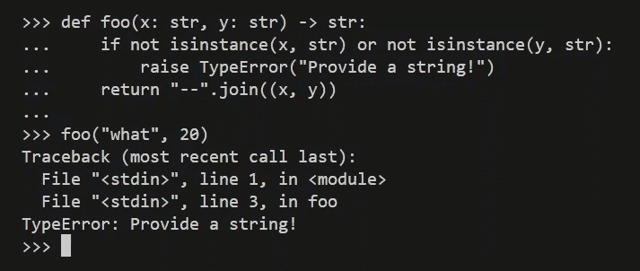
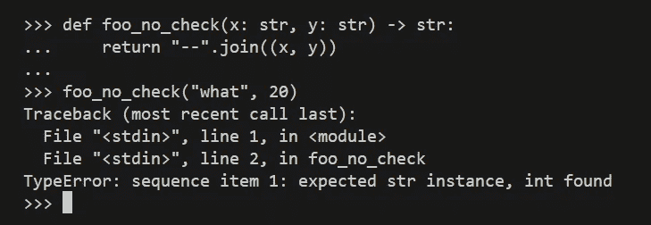
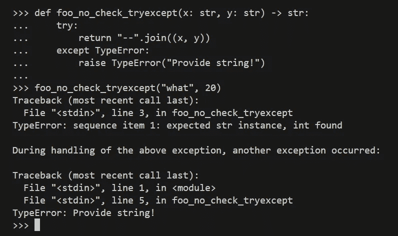
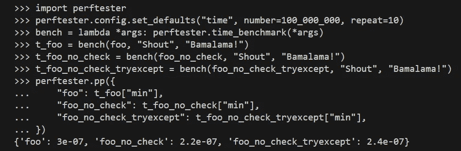

# 别忘了 Python 是动态的！

> 原文：[`towardsdatascience.com/dont-forget-that-python-is-dynamic-e298e2a30118`](https://towardsdatascience.com/dont-forget-that-python-is-dynamic-e298e2a30118)

## PYTHON 编程

## 越来越多的静态和动态检查……这是我们希望 Python 发展的方向吗？

 [Marcin Kozak](https://medium.com/@nyggus?source=post_page-----e298e2a30118--------------------------------)

·发表于 [Towards Data Science](https://towardsdatascience.com/?source=post_page-----e298e2a30118--------------------------------) ·8 分钟阅读·2023 年 6 月 13 日

--

Python 将走向何方？照片由 [Jamie Templeton](https://unsplash.com/@jamietempleton?utm_source=medium&utm_medium=referral) 拍摄，来源于 [Unsplash](https://unsplash.com/?utm_source=medium&utm_medium=referral)

Python 是一种动态语言。然而，近年来，越来越多的关注被放在了静态类型检查上。这反过来导致了对运行时类型检查的兴趣增加。我们将走多远呢？在这篇文章中，我们将回顾为什么 Python 曾经被认为是一个强大的动态类型编程语言。

现在仍然如此吗？

Python 的优势一直在于其简洁性，这至少部分源于动态类型，不仅因为我们可以在 REPL 中编写 Python 代码，还因为以下原因：

+   你可以在整个程序中轻松地改变变量的类型。

+   你不需要定义变量的类型。

+   代码（或可以）易于阅读和理解。

+   有时，你可以用几行代码实现即使是相当复杂的算法。而静态类型语言通常需要更多的——或者至少更多的——代码行数。

当然，动态类型也有其代价。第一个是性能下降，这是我们都知道的。性能下降的原因在于，类型——这些类型没有被声明——必须在运行时进行检查（由 Python 完成）。另一个代价是运行时错误的风险增加：由于类型不是在编译时检查，而是在运行时检查，相关错误会在程序执行期间抛出，而不是在编译期间。

我们需要记住，Python 提供了一系列工具来处理其性能下降的问题：

 [## Python 的速度：并没有那么糟糕！

### 我总是听到 Python 非常慢。真的是这样吗？

[medium.com](https://medium.com/pythoniq/the-speed-of-python-it-aint-that-bad-9f703dd2924e?source=post_page-----e298e2a30118--------------------------------)

多年来，Python 爱好者为 Python 是一种动态类型语言而感到自豪和高兴。当然，那些不喜欢 Python 的人声称它是一种糟糕的语言……我还能说什么呢？每个人都可以有自己的看法；编程是一个自由的世界。

> 编程是一个自由的世界。

然而，最近一段时间，Python 正在向编程的静态方面发展。这一变化的最重要方面是类型提示。虽然它们是可选的，但现在大多数大型项目都实现了类型提示。你会更常听到在一个严肃的项目中你必须提示类型，而不是你不必这样做——更不用说你不应该这样做。准备好听到这样的说法：“当然，类型提示是可选的，因此对于原型和短脚本，你不需要使用它们，但对于大型项目——嗯，唯一的选择就是提示类型。”我听到过不止一次，也不止两次。

这个情况引发了以下问题：我们真的需要所有这些类型提示、静态类型检查器和运行时类型检查器吗？

我不会对这个问题做出回应。这主要是因为我远不是那些自以为知道一切的人……嗯，几乎知道一切的人。但我希望邀请你自己思考这个问题。

不过，我会提醒你——也提醒我自己——Python 的动态类型，也被称为 [*鸭子类型*](https://en.wikipedia.org/wiki/Duck_typing)，是这个语言成功的基础。以下是关于鸭子类型如何工作的流行解释：

> 如果它走起来像鸭子，叫起来也像鸭子，那它一定是一只鸭子。

Duck typing 在没有类型提示和运行时类型检查的情况下也可以非常强大。我将通过非常简单的示例向你展示这一点，不再赘述，让我们直接跳入这个简单的示例：

通过运行时类型检查捕捉错误。图片由作者提供

在这里，我们检查 `x` 和 `y` 的类型，它们都应该是字符串（`str`）。注意，这样我们有点在检查我们提供给 `str.join()` 方法的内容是否是 `tuple[str, str]`。当然，我们不必检查这个方法是否得到了一个元组，因为我们是自己创建的；只需检查 `x` 和 `y` 的类型。当其中任何一个不是字符串时，函数将抛出 `TypeError` 并带有简单的消息：“`提供一个字符串！`”。

很棒，对吧？我们可以确保函数仅在正确类型的值上运行。如果不符合，我们会看到自定义的消息。我们也可以使用自定义错误：

 ## 我们是否应该在 Python 中使用自定义异常？

### Python 有这么多内置异常，我们很少需要创建和使用自定义异常。或者说我们需要吗？

[towardsdatascience.com

现在，让我们移除类型检查，看看函数的表现：

捕捉没有运行时类型检查的错误；消息不是内置的。图片来源于作者

哈，看起来确实以非常相似的方式工作……我的意思是，异常基本上在同一个地方被引发，所以我们没有冒任何风险。那么……

确实，这里函数 `foo_no_check()` 使用了鸭子类型，它使用了一种隐式类型的概念。在这个例子中，`str.join()` 方法假设它接受一个字符串元组，因此 `x` 和 `y` 必须是字符串，如果不是，隐式类型 `tuple[str, str]` 就没有被实现。因此出现了错误。

你可能会说：“但是嘿！看看消息！之前我们可以使用自定义消息，现在却不能了！”

我们真的不能吗？看看：

捕捉没有运行时类型检查的错误；错误消息已自定义。图片来源于作者

我们现在可以看到两条消息：内置的（`sequence item 1: expected str instance, in found`）和自定义的（`提供字符串！`）。

# 性能

你可能会问：有什么区别？所以，我检查类型。有什么问题吗？

好吧，确实有很大的区别：性能。让我们使用 `[perftester](https://github.com/nyggus/perftester)` 包来基准测试这三个版本的函数：

 ## 轻松基准测试 Python 函数：perftester

### 你可以使用 perftester 来轻松地对 Python 函数进行基准测试

[towardsdatascience.com

这是基准测试结果：

使用 perftester 包进行的基准测试。图片来源于作者

在本文所有的基准测试中，我使用的是 Windows 10 机器上的 Python 3.11，WSL 1，32GB 内存和四个物理（八个逻辑）核心。

在第二行，我将默认实验次数设置为 10，在每次运行中，每个函数都要执行一亿次。我们从十次运行中取最好的一次，并报告平均时间（秒）。

`foo()` 函数，即具有运行时类型检查的那个，明显比其他两个要慢。`foo_no_check()` 函数是最快的，尽管 `foo_no_check_tryexcept()` 仅稍慢一点。

结论？运行时类型检查是昂贵的。

你可能会说：“什么？你在开玩笑吗？昂贵？这只是小于一秒的微小部分！甚至不到一微秒！”

确实。这并不多。但这是一个只有两个检查的非常简单的函数。现在想象一个庞大的代码库，有许多类、方法和函数——以及大量的运行时类型检查。有时候，这可能会显著降低性能。

> 运行时类型检查是昂贵的。

# 结论

阅读关于鸭子类型时，你通常会看到猫会喵、狗不会、牛会哞的例子。当你听到一种动物在喵的时候，它既不是狗也不是牛，而是一只猫。但不是老虎。我决定使用一个不寻常的例子，希望它足够清晰，让你看到鸭子类型的优势。

如你所见，Python 异常处理在运行时类型检查方面做得很出色。你可以通过在需要时添加额外的类型检查来帮助它，但始终记住，它们会增加一些开销时间。

结论？Python 拥有很好的异常处理工具，效果非常好。很多时候，我们根本不需要使用运行时类型检查。然而，有时候我们可能需要。当两种类型具有相似的接口时，鸭子类型可能会失败。

例如，假设你想要加两个数字（`x + y`），但用户提供了两个字符串。这*不会*意味着出错，因为你可以加两个字符串。在这种情况下，你可能需要添加运行时类型检查，如果你不想让程序继续使用这些不正确的值。迟早它会破坏，因此问题是你是否希望程序继续运行到那时。如果是的话，你可能会冒着异常被稍晚引发的风险，所以添加类型检查实际上可以节省时间。此外，稍晚在程序流中引发异常可能会导致找到错误真正原因的困难。

总而言之，我并不是说运行时类型检查绝对不应该使用。但很多时候，这些检查是在不需要的时候被添加的。

我希望我激发了你的兴趣和灵感。今天，这就是我想要达到的目标。请在评论中分享你的想法。告诉我们你是否会在这样简单的情况下使用运行时类型检查。

我没有讨论静态检查和鹅类型。我已经写了几篇关于静态检查和类型提示的文章：

 [## Python 的类型提示：朋友、敌人还是单纯的头疼？

### 类型提示在 Python 社区中的受欢迎程度正在上升。这将引领我们到哪里？我们可以做些什么来使用它…

[betterprogramming.pub](https://betterprogramming.pub/pythons-type-hinting-friend-foe-or-just-a-headache-73c7849039c7?source=post_page-----e298e2a30118--------------------------------)  ## Python 类型提示：鸭子类型兼容性和一致性

### 当你提示`float`时，不必同时提示`int`，提示`tuple`时也不必提示`namedtuple`。为什么？

towardsdatascience.com  ## Python 类型提示：从类型别名到类型变量和新类型

### 查看类型别名、类型变量和新类型的实际应用

towardsdatascience.com

我还没有写过关于鹅类型的内容，但迟早会有那一天。

Python 是否仍被认为是一种强大的动态类型语言？说实话，我不知道。Python 中如此多的关注点都集中在静态和运行时检查上，我担心很多人已经忘记了 Python 真正的力量在于完全不同的东西：它的简单性、可读性——还有，*鸭子类型*。

我听说过一些经验丰富的 Python 爱好者表达他们对 Python 不再像以前那样的失望之情。他们中的一些人决定从 Python 转向其他语言，声称“如果我需要在变量上定义类型，Python 会是我最后的选择！”这非常有道理。静态类型语言可以比 Python 快得多——而且它们仍然可以像 Go 那样相当简单和可读。但 Python… Python 提供了简单而强大的鸭子类型… 许多人似乎忘记了这种*鸭子类型*。

我自己喜欢 Python 和 Go。Go 是静态类型的，这使它比 Python 明显更快。但你知道吗？对我来说，Go 的静态类型代码往往比带有类型提示的 Python 代码更容易阅读和理解！

当我看到代码中到处都是运行时检查时，我感到疲惫和沮丧。这不是 Python 创建的初衷。是的，类型提示可以非常有用——但只有在正确使用并且*不过度使用*时才有效。如果使用过度，它们可能成为相当大的负担。

> 当我看到代码中到处都是运行时检查时，我感到疲惫和沮丧。这不是 Python 创建的初衷。

感谢阅读。如果你喜欢这篇文章，你可能也会喜欢我写的其他文章；你可以在[这里](https://medium.com/@nyggus)看到它们。如果你想加入 Medium，请使用下面的推荐链接：

 [## 使用我的推荐链接加入 Medium - Marcin Kozak

### 阅读 Marcin Kozak（以及 Medium 上的其他成千上万的作家）的每一篇故事。你的会员费直接支持…

medium.com](https://medium.com/@nyggus/membership?source=post_page-----e298e2a30118--------------------------------)
