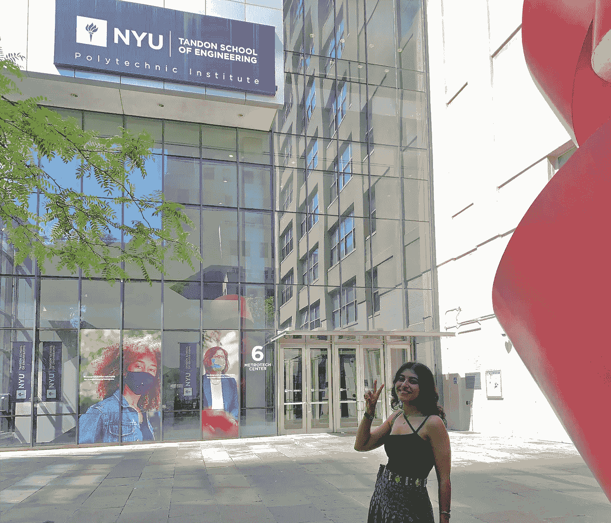

# 别在没有这 5 个必做步骤的情况下开始你的数据科学之旅——一位 Spotify 数据科学家的完整指南

> 原文：[`towardsdatascience.com/dont-start-your-data-science-journey-without-these-5-must-do-steps-from-a-spotify-data-scientist-c9cec11fd1b?source=collection_archive---------0-----------------------#2023-09-24`](https://towardsdatascience.com/dont-start-your-data-science-journey-without-these-5-must-do-steps-from-a-spotify-data-scientist-c9cec11fd1b?source=collection_archive---------0-----------------------#2023-09-24)

## 这是我希望在开始数据科学之旅之前做的一切的完整指南，祝你在数据领域的第一年取得优异成绩。

 [Khouloud El Alami](https://medium.com/@elalamik?source=post_page-----c9cec11fd1b--------------------------------)

·

[关注](https://medium.com/m/signin?actionUrl=https%3A%2F%2Fmedium.com%2F_%2Fsubscribe%2Fuser%2F9c6a36490614&operation=register&redirect=https%3A%2F%2Ftowardsdatascience.com%2Fdont-start-your-data-science-journey-without-these-5-must-do-steps-from-a-spotify-data-scientist-c9cec11fd1b&user=Khouloud+El+Alami&userId=9c6a36490614&source=post_page-9c6a36490614----c9cec11fd1b---------------------post_header-----------) 发表在 [Towards Data Science](https://towardsdatascience.com/?source=post_page-----c9cec11fd1b--------------------------------) ·18 分钟阅读·2023 年 9 月 24 日

--

你是否刚刚开始你的数据科学之旅？也许你已经盯着这个数据科学学位或培训营太久了，现在你不知道从哪里开始？

或者你已经开始了数据科学之旅，现在感到不知所措，四处碰壁？

四年前，我还是你——除了我盲目地跳进了一个没有编程技能的数据科学学位。剧透：我经历了很多挣扎。

毕业两年后庆祝我的胜利

快进到今天：我是一名 Spotify 的数据科学家，我来这里是为了给你四年前我希望有人给我的提醒。如果你正准备迈出通往梦想学位的下一步，那么这篇文章可能会对你产生重大影响。

相信我，你不想在没有准备的情况下跳入这个领域。我以为进入纽约大学意味着我可以顺利度过这一年。我是说，我知道过程会有波折，但我没准备好面对最终遇到的那些**可怕的山峰**。
