# 双重机器学习简化版：第一部分 — 基本的因果推断应用

> 原文：[`towardsdatascience.com/double-machine-learning-simplified-part-1-basic-causal-inference-applications-3f7afc9852ee?source=collection_archive---------2-----------------------#2023-07-12`](https://towardsdatascience.com/double-machine-learning-simplified-part-1-basic-causal-inference-applications-3f7afc9852ee?source=collection_archive---------2-----------------------#2023-07-12)

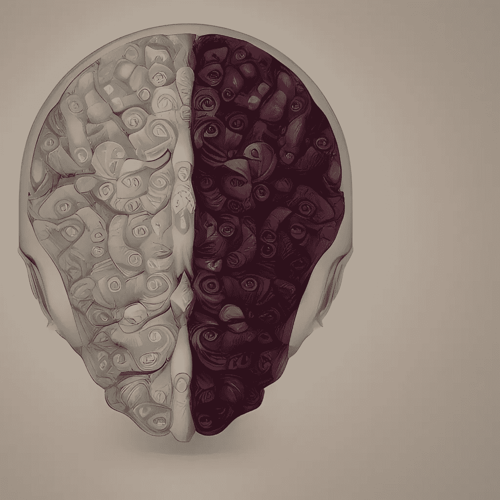

所有图片由作者提供

## 学习如何在因果推断任务中利用 DML

[](https://medium.com/@jakepenzak?source=post_page-----3f7afc9852ee--------------------------------)[](https://towardsdatascience.com/?source=post_page-----3f7afc9852ee--------------------------------) [Jacob Pieniazek](https://medium.com/@jakepenzak?source=post_page-----3f7afc9852ee--------------------------------)

·

[关注](https://medium.com/m/signin?actionUrl=https%3A%2F%2Fmedium.com%2F_%2Fsubscribe%2Fuser%2F6f0948d99b1c&operation=register&redirect=https%3A%2F%2Ftowardsdatascience.com%2Fdouble-machine-learning-simplified-part-1-basic-causal-inference-applications-3f7afc9852ee&user=Jacob+Pieniazek&userId=6f0948d99b1c&source=post_page-6f0948d99b1c----3f7afc9852ee---------------------post_header-----------) 发表在 [Towards Data Science](https://towardsdatascience.com/?source=post_page-----3f7afc9852ee--------------------------------) ·17 分钟阅读·2023 年 7 月 12 日[](https://medium.com/m/signin?actionUrl=https%3A%2F%2Fmedium.com%2F_%2Fvote%2Ftowards-data-science%2F3f7afc9852ee&operation=register&redirect=https%3A%2F%2Ftowardsdatascience.com%2Fdouble-machine-learning-simplified-part-1-basic-causal-inference-applications-3f7afc9852ee&user=Jacob+Pieniazek&userId=6f0948d99b1c&source=-----3f7afc9852ee---------------------clap_footer-----------)

--

[](https://medium.com/m/signin?actionUrl=https%3A%2F%2Fmedium.com%2F_%2Fbookmark%2Fp%2F3f7afc9852ee&operation=register&redirect=https%3A%2F%2Ftowardsdatascience.com%2Fdouble-machine-learning-simplified-part-1-basic-causal-inference-applications-3f7afc9852ee&source=-----3f7afc9852ee---------------------bookmark_footer-----------)

> 本文是**2 部分**系列中的**第一部分**，旨在简化和普及双重机器学习。在第一部分中，我们将覆盖双重机器学习的基础知识，以及两个基本的因果推断应用示例（使用 python）。然后，在[第二部分](https://medium.com/towards-data-science/double-machine-learning-simplified-part-2-extensions-the-cate-99926151cac)中，我们将扩展这些知识，将因果推断问题转化为预测任务，其中我们预测个体级别的处理效果，以辅助决策和数据驱动的目标定位。

统计/机器学习（ML）与因果推断/计量经济学（CI）任务之间的概念性和实践性区别已经存在多年——ML 旨在预测，而 CI 旨在推断处理效果或变量之间的“因果”关系。然而，数据科学家仍然常常从训练的机器学习模型或其他可解释的 ML 方法中得出因果结论。尽管如此，业界和许多学术学科在推动因果声明的严谨性方面取得了显著进展，这也刺激了因果推断领域的广泛讨论。在这一进展中，我们看到了一些惊人的工作，开始弥合 ML 与 CI 之间的概念差距，特别是 CI 工具利用了 ML 方法的强大能力。

本系列的主要动机是使双重机器学习（DML）的使用和应用变得普及，这一方法首次由 Chernozhukov *等人*在其开创性论文《用于处理和因果参数的双重机器学习》中介绍，并使数据科学家能够在日常因果推断任务中利用 DML。[1] 为此，我们将首先深入探讨 DML 的基础知识。具体而言，我们将涵盖一些概念/理论基础，包括因果关系的回归框架及[Frisch-Waugh-Lovell 定理](https://en.wikipedia.org/wiki/Frisch%E2%80%93Waugh%E2%80%93Lovell_theorem)，然后我们将利用这一框架来发展 DML。最后，我们将展示双重机器学习的两个显著应用：

1.  *在我们的处理过程中趋向于外生性/CIA/可忽略性（尤其是当我们的协变量集具有高维度时）*

1.  *在实验数据（随机对照试验（RCTs）或 A/B 测试）中提高精确度和统计功效*

如果这些内容对你来说仍感到非常陌生，我推荐查看我的[上一篇文章](https://medium.com/towards-data-science/controlling-for-x-9cb51652f7ad)，其中涵盖了因果回归框架和 Frisch-Waugh-Lovell 定理。尽管如此，我会在下面涵盖这些主题，并尽力简化并使其对所有人都易于理解。让我们首先快速概述一下这些理论基础！

## **因果回归框架与 FWL 定理**

确立因果关系的金标准是 RCT 或 A/B 测试，在这些测试中，我们随机分配一部分个体接受处理，***T***（测试组），而其他个体则不接受处理（对照组）或接受不同的处理（在“A/B”测试中）。为了估计处理对结果***y***的平均处理效应（ATE），我们可以估计以下双变量线性回归：

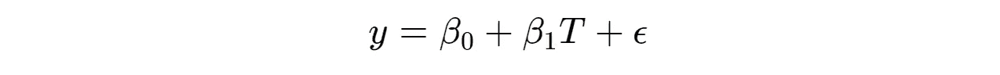

(1)

由于处理是随机分配的，我们确保处理是外生的；即，独立于误差项ε，因此不存在我们未控制的混杂变量（影响处理和结果的变量）—— cov(T,ε)=0（例如，假设违反情况下，y = 收入 & T = 教育年限，那么我们可以预期例如 IQ 这样的变量会在ε中混杂真实关系）。由于这种独立性，***T***上的系数估计具有因果解释——ATE：

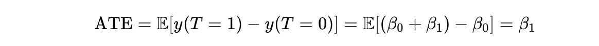

(2) 离散处理

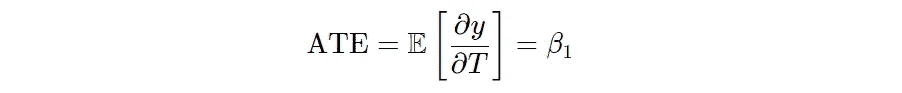

(3) 连续处理

当我们处理非实验或观察数据时，几乎总是处理变量*不是*与ε独立的，或者是内生的——cov(T,ε)≠0，并且存在我们未考虑的混杂变量。换句话说，我们不能再将处理中的真实随机变化与结果解释分开。在这种情况下，简单的双变量回归将因[遗漏变量偏倚](https://en.wikipedia.org/wiki/Omitted-variable_bias)而导致 ATE 的偏倚估计（β（真实 ATE）+偏倚）。然而，如果我们能控制所有可能的混杂变量，***X***，以及在使用参数模型时的混杂函数形式，我们可以在我们的处理上实现外生性，或者也称为条件独立假设（CIA），或[可忽略性](https://en.wikipedia.org/wiki/Ignorability)。换句话说，处理中的剩余变化是“好像是随机的”。即，在误差项中没有剩余的混杂因素，或者：

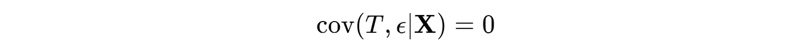

(4)

如果外生性成立（***X***之外没有混杂变量），那么在多元回归中控制***X***允许***T***上的系数估计具有类似的 ATE 因果解释：

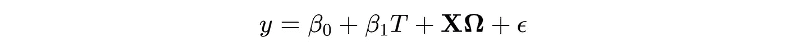

(5)

> **警告：** 控制所有可能的协变量不是最佳实践，而是控制那些被假设/已知会影响结果***y***和感兴趣的处理***T***的变量。这是[混淆变量](https://en.wikipedia.org/wiki/Confounding)的概念。相反，如果***y***和***T***都影响某个变量，我们不希望控制该变量，因为这可能会引入***y***和***T***之间的虚假关联。这是[碰撞变量](https://en.wikipedia.org/wiki/Collider_(statistics))的概念。我们将在本文后面展示这一点的实际例子。此外，我们不希望包括那些是我们处理变量的中介变量的变量；即，一个受处理影响进而影响结果的协变量。包括这种中介变量可能会侵蚀我们处理效应的估计。简而言之，我们只希望包括混淆变量（以及可能的非中介和非碰撞预测变量以提高精确度；这将在下面的例子 2 中讨论）。

然而，在实践中，外生性/CIA/可忽略性非常难以获得和证明，因为我们不太可能观察到所有的混淆变量并控制这些混淆变量可能出现的潜在非线性关系。这是 DML 的一个特定动机——然而，让我们首先讨论 FWL 定理，因为这使我们能够理论上开发 DML。

[FWL 定理](https://en.wikipedia.org/wiki/Frisch%e2%80%93Waugh%e2%80%93Lovell_theorem)是一个重要的计量经济学定理，它允许我们在上述多重回归（方程 5）中利用以下 3 步程序获得***相同的***ATE 参数估计β₁，关于处理变量***T***：

1.  分别对***y***进行回归***X***，对***T***进行回归***X***

1.  保存第 1 步的残差——称之为***y***和***T***。

1.  对***y***进行回归***T***

在准 Python 代码中，

```py
import statsmodels.formula.api as smf

reg_y = smf.ols(formula='y ~ 1 + X', data = df).fit()
reg_T = smf.ols(formula='T ~ 1 + X', data = df).fit()

y_residual = reg_y.resid
T_residual = reg_T.resid

ATE_model = smf.ols(formula='y_residual ~ 1 + T_residual', data = df).fit()
```

直观地说，FWL 定理将***T***和***y***中的变异部分从混淆变量***X***中分离出来，然后利用剩余的变异来解释关键的关系（即，***T***如何影响***y***）。更具体地说，它利用***X***的一种特殊类型的正交投影矩阵，称为消除矩阵或残差生成矩阵，来残差化***T***和***y***。有关 FWL 程序的实际应用，请参见我之前的帖子。该定理对于理解 DML 至关重要。

> 请注意，我（故意）略过了一些额外的因果推断假设，例如 Positivity/Common Support 和 SUTVA/反事实一致性。一般来说，CIA/可忽略性假设是需要辩护的最常见假设。然而，建议感兴趣的读者熟悉额外的假设。简言之，Positivity 确保我们有与处理过的家庭相似且可比较的未处理家庭，以便进行反事实估计，而 SUTVA 确保没有溢出/网络类型效应（一个个体的处理影响另一个个体）。

## 双重机器学习… 简化版！

双重机器学习的核心是允许在 FWL 程序的步骤 1) 和 2) 中进行的残差化/正交化使用任何高度灵活的 ML 模型，从而构造一个部分线性模型。也就是说，我们可以通过以下方式估计 ATE：

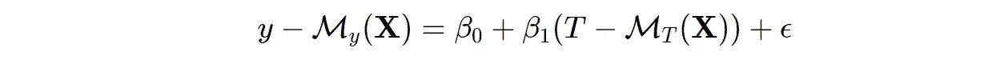

(6)

其中**𝑀𝑦**和***MT***都是任何用于预测***y***和***T***的*ML*模型，给定混淆因素和/或控制变量***X***。**𝑀𝑦**和***MT***也被称为“干扰函数”，因为我们正在构造函数来部分去除***y***和***T***中由 X 解释的变化，这不是主要关注的内容。为了避免过拟合并确保这种方法的稳健性，我们使用*交叉验证预测*通过样本和交叉拟合。我相信这里再次看到这种程序在准 Python 代码中的示例会很有用：

```py
from sklearn.model_selection import cross_val_predict
import statsmodels.formula.api as smf

M_y = *some ML model*
M_T = *some ML model*

y_residual = df[y] - cross_val_predict(M_y, df[X], df[y], cv=3)
T_residual = df[T] - cross_val_predict(M_T, df[X], df[T], cv=3)

ATE_model = smf.ols(formula='y_residual ~ 1 + T_residual', data = df).fit()
```

其中 *T_residual* 上的系数将是我们估计的 ATE，并且围绕我们的估计有渐近正态推断。就这样！

这是 DML 估计 ATE 背后的过程。*它使我们的混淆建模具有高度的灵活性和非参数特性，特别是在存在高维协变量的情况下。*

我不会深入探讨为什么这有效的技术细节，并且我会将感兴趣的读者引导到[原始论文](https://arxiv.org/pdf/1608.00060.pdf)和[EconML 文档](https://econml.azurewebsites.net/index.html)。然而，简而言之，DML 满足一个称为 Neyman 正交性的条件（即，干扰函数在真实值附近的小扰动对矩条件有二阶效应，因此不会影响我们的关键参数估计），这解决了正则化偏差的问题，并且与 DML 中的交叉验证程序结合使用，解决了过拟合偏差，从而确保了该方法的稳健性。

DML 有一些非常酷的扩展将在系列的[第二部分](https://medium.com/towards-data-science/double-machine-learning-simplified-part-2-extensions-the-cate-99926151cac)中讨论，但现在我们先通过两个应用来查看它的实际效果。

## DML 应用

**应用 1：** *在处理非实验/观察数据时，趋向于外生性/CIA/可忽略性*

回顾一下，我们讨论了在没有随机实验数据的情况下，我们必须控制所有潜在的混杂因素，以确保我们获得我们感兴趣的处理的外生性。换句话说，当我们控制了所有潜在的混杂因素时，我们的处理是“如同随机分配”。这里仍然存在两个主要问题：

1.  了解所有混杂因素并且获取所有这些混杂因素的数据是困难的，在某些情况下甚至是不可能的。解决这个问题涉及对数据生成过程的深入了解，仔细构建因果模型（即，构建一个[DAG](https://en.wikipedia.org/wiki/Directed_acyclic_graph)的同时评估潜在混杂因素并避免碰撞器），以及/或者利用[准实验](https://en.wikipedia.org/wiki/Quasi-experiment)设计。

1.  如果我们确实处理了第一点，我们仍然需要在使用参数模型（例如在回归框架中）时指定混杂的正确参数形式，包括交互项和高阶项。仅在回归中包含线性项可能不足以控制混杂。这就是 DML 发挥作用的地方；它可以以高度非参数的方式灵活地部分控制混杂。这特别有利于节省数据科学家直接建模混杂的函数形式的麻烦，并使更多的注意力可以集中在识别和测量混杂因素上。让我们看看这是如何工作的！

假设，作为一个高度简化的例子，我们在一家电子商务公司工作，并且我们的任务是估计个人在网站上花费的时间对他们在过去一个月的购买金额或销售额的平均处理效应（ATE）。然而，进一步假设我们只有观察数据可以使用，但我们已经测量了所有潜在的混杂因素（那些影响网站停留时间和销售额的变量）。让这个因果过程通过以下的有向无环图（DAG）进行描述：

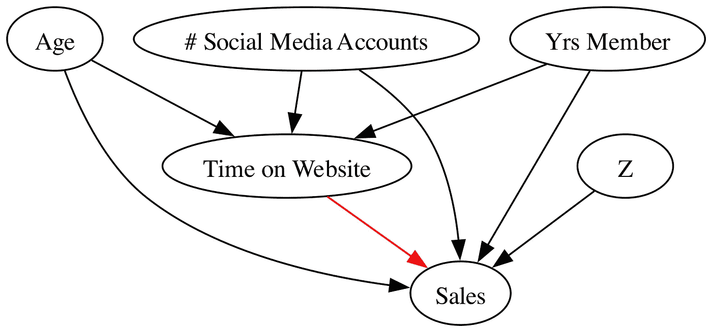

假设数据生成过程如下（*请注意，所有值和数据都是为了演示目的而随意选择和生成的，因此不一定代表真实世界直观的很大程度，除非我们对 ATE 的估计*）：

```py
import numpy as np
import pandas as pd

# Sample Size
N = 100_000

# Observed Confounders (Age, Number of Social Media Accounts, & Years Member on Website)
age = np.random.randint(low=18,high=75,size=N)
num_social_media_profiles = np.random.choice([0,1,2,3,4,5,6,7,8,9,10], size = N)
yr_membership = np.random.choice([0,1,2,3,4,5,6,7,8,9,10], size = N)

# Additional Covariates (Arbitrary Z)
Z = np.random.normal(loc=50, scale = 25, size = N)

# Error Terms
ε_1 = np.random.normal(loc=20,scale=5,size=N)
ε_2 = np.random.normal(loc=40,scale=15,size=N)

# Treatment DGP (T = g(X) + ε) - Hrs spent on website in past month
time_on_website = np.maximum(10
                             - 0.01*age 
                             - 0.001*age**2 
                             + num_social_media_profiles 
                             - 0.01 * num_social_media_profiles**2
                             - 0.01*(age * num_social_media_profiles)
                             + 0.2 * yr_membership
                             + 0.001 * yr_membership**2
                             - 0.01 * (age * yr_membership)
                             + 0.2 * (num_social_media_profiles * yr_membership)
                             + 0.01 * (num_social_media_profiles * np.log(age) * age * yr_membership**(1/2))
                             + ε_1
                               ,0)

# Outcome DGP (y = f(T,X,Z) + ε) - Sales in past month
sales = np.maximum(25
                   +  5 * time_on_website # Simulated ATE = $5
                   - 0.1*age 
                   - 0.001*age**2 
                   + 8 * num_social_media_profiles 
                   - 0.1 * num_social_media_profiles**2
                   - 0.01*(age * num_social_media_profiles)
                   + 2 * yr_membership
                   + 0.1 * yr_membership**2
                   - 0.01 * (age * yr_membership)
                   + 3 * (num_social_media_profiles * yr_membership)
                   + 0.1 * (num_social_media_profiles * np.log(age) * age * yr_membership**(1/2))
                   + 0.5 * Z
                   + ε_2
                     ,0)

collider = np.random.normal(loc=100, scale=50, size=N) + 2*sales + 7*time_on_website

df = pd.DataFrame(np.array([sales,time_on_website,age,num_social_media_profiles,yr_membership,Z]).T
                  ,columns=["sales","time_on_website","age","num_social_media_profiles","yr_membership","Z"])
```

根据构建，我们的兴趣处理（过去一个月在网站上花费的时间）和我们的结果（过去一个月的销售额）有以下混杂因素：年龄、社交媒体账户数量和网站会员年限，这种混杂是任意非线性的。此外，我们可以看到构建的**ATE 真实值是 $5**（在上面的销售 DGP 中说明）。*也就是说，平均而言，每增加一小时的在网站上花费的时间，个人会多花 $5。* 注意，我们还包括了一个碰撞器变量（受网站花费时间和销售额影响的变量），该变量将在下面的演示中用于说明这种偏差如何影响 ATE。

为了展示 DML 灵活部分化高度非线性混杂因素的能力，我们将运行以下 4 个模型：

1.  销售（y）对网站上花费的时间（T）进行天真的 OLS 回归

1.  销售（y）对网站上花费的时间（T）及所有混杂因素的线性项进行多重 OLS 回归

1.  使用 DML 残差化过程的 OLS 回归，详见公式 (5)

1.  包括碰撞器变量的 DML 残差化过程的 OLS 回归

代码如下：

```py
import statsmodels.formula.api as smf
from sklearn.ensemble import GradientBoostingRegressor
from sklearn.model_selection import cross_val_predict

# 1 - Naive OLS
naive_regression = smf.ols(formula=’sales ~ 1 + time_on_website’,data=df).fit()

# 2 - Multiple OLS
multiple_regression = smf.ols(formula=’sales ~ 1 + time_on_website + age + num_social_media_profiles + yr_membership’,data=df).fit()

# 3 - DML Procedure
M_sales = GradientBoostingRegressor()
M_time_on_website = GradientBoostingRegressor()

df[‘residualized_sales’] = df["sales"] - cross_val_predict(M_sales, df[["age","num_social_media_profiles","yr_membership"]], df[‘sales’], cv=3)
df[‘residualized_time_on_website’] = df[‘time_on_website’] - cross_val_predict(M_time_on_website, df[["age","num_social_media_profiles","yr_membership"]], df[‘time_on_website’], cv=3)

DML_model = smf.ols(formula=’residualized_sales ~ 1 + residualized_time_on_website’, data = df).fit()

# 4 - DML Procedure w/ Collider
M_sales = GradientBoostingRegressor()
M_time_on_website = GradientBoostingRegressor()

df[‘residualized_sales’] = df["sales"] - cross_val_predict(M_sales, df[["age","num_social_media_profiles","yr_membership","collider"]], df[‘sales’], cv=3)
df[‘residualized_time_on_website’] = df['time_on_website'] - cross_val_predict(M_time_on_website, df[["age","num_social_media_profiles","yr_membership", "collider"]], df['time_on_website'], cv=3)

DML_model_collider = smf.ols(formula='residualized_sales ~ 1 + residualized_time_on_website', data = df).fit()
```

对应的结果（见附录中的代码以创建此表）：

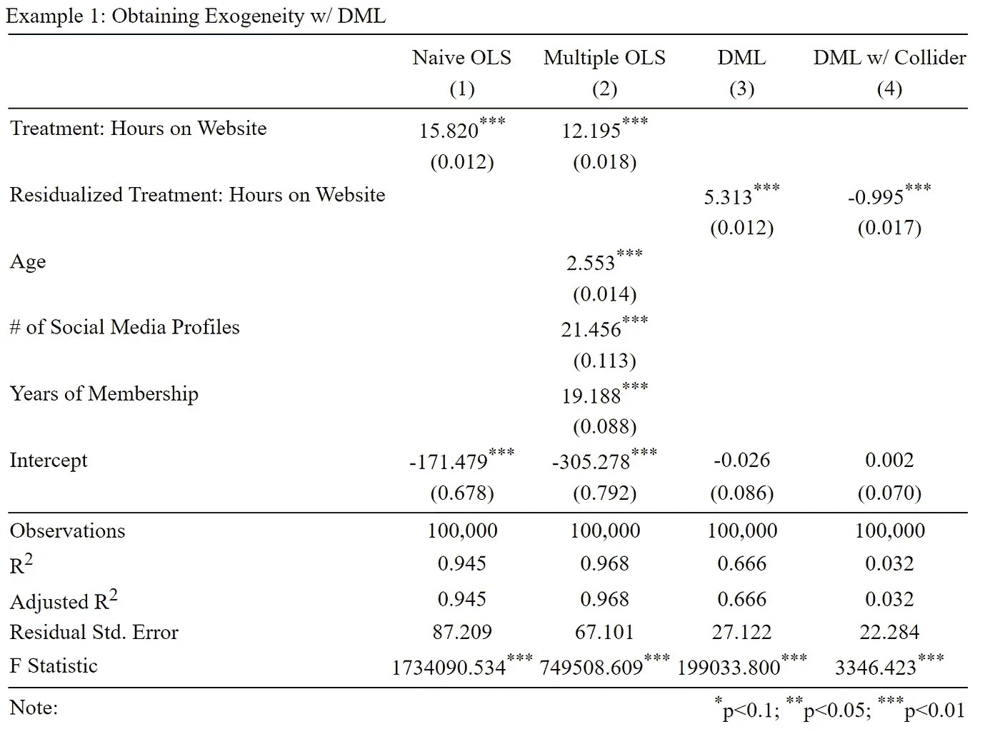

回忆一下我们模拟的 ATE 真实值是**$5**。注意，唯一能够捕捉这个值的模型是 DML 过程！我们可以看到，天真的模型在估计中有显著的正偏差，而仅对混杂因素的线性项进行控制的多重回归则稍微减少了这种偏差。此外，带有碰撞器的 DML 过程展示了一个负偏差；通过在我们的碰撞器 DGP 中求解销售额，可以*松散地*演示/观察到销售与我们处理之间的这种负相关。

```py
collider = 100 + 2*sales + 7*time_on_website

# Note the negative relationship between sales and time_on_website here
sales = (collider - 100 - 7*time_on_website)/2
```

这些结果展示了使用灵活的非参数 ML 模型在 DML 过程中去除混杂的明确能力！相当令人满意，对吧？ **DML 去除了对混杂 DGP 的正确参数化规格的必要性（前提是所有混杂因素都被控制）！**

> 细心的读者会注意到，我们在销售的生成过程中包括了任意的协变量 ***Z***。然而，注意到 ***Z*** 并不会直接影响在网站上花费的时间，因此它不符合混杂因素的定义，因此对结果没有影响（除了可能提高估计的精确度——见应用程序 2）

**应用程序 2：** *提高实验数据的精确度和统计效能（随机对照试验 (RCTs) 或 A/B 测试）*

一个常见的误解是，如果一个实验有一个*足够大的*样本量，就可以获得足够的[统计功效](https://en.wikipedia.org/wiki/Power_of_a_test)来准确测量感兴趣的处理。然而，确定实验中的统计功效以及最终 ATE 估计精度的一个常被忽视的因素是你试图测量的结果的变异性。

例如，假设我们对某个特定广告对个人购买金额的影响感兴趣，并且我们预计效果较小，但并非微不足道——例如，ATE 为$5。然而，假设个人销售额的标准差非常大……可能在$100 甚至$1000 的范围内。在这种情况下，由于这种高变异性，准确捕捉 ATE 可能会非常困难——也就是说，我们的估计可能会获得非常低的精度（大的标准误差）。然而，捕捉到$5 的 ATE 可能在经济上是有意义的（如果我们对 100,000 户家庭进行实验，这可能达到$500,000）。这就是 DML 能够发挥作用的地方。在我们展示实际操作之前，让我们先查看方程（1）中简单回归的 ATE 估计的标准误差公式：

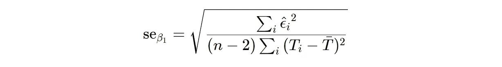

(7)

在这里，我们观察到我们估计的标准误差直接受到残差（ε）大小的影响。那么这告诉我们什么呢？如果我们的处理是随机化的，我们可以在多重普通最小二乘法（OLS）或双重机器学习（DML）程序中包含协变量，这样做的目的是减少我们结果的变异性，而不是获得外生性。更具体地说，我们可以包含那些对结果有强预测作用的变量，从而减少残差，并因此降低我们估计的标准误差。让我们来看一下这个实际应用。首先，假设以下有向无环图（DAG）（注意处理是随机化的，所以没有混杂因素）：

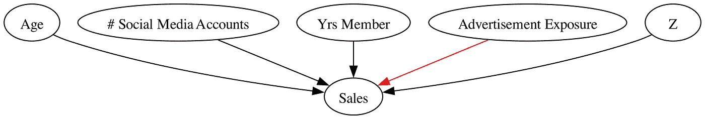

此外，假设以下数据生成过程（DGP）：

```py
import numpy as np
import pandas as pd

# Sample Size
N = 100_000

# Observed Confounders (Age, Number of Social Media Accounts, & Years Member on Website)
age = np.random.randint(low=18,high=75,size=N)
num_social_media_profiles = np.random.choice([0,1,2,3,4,5,6,7,8,9,10], size = N)
yr_membership = np.random.choice([0,1,2,3,4,5,6,7,8,9,10], size = N)

# Additional Covariates (Arbitrary Z)
Z = np.random.normal(loc=50, scale = 25, size = N)

# Error Term
ε = np.random.normal(loc=40,scale=15,size=N)

# Randomized Treatment (T) - Advertisement Exposure
advertisement_exposure = np.random.choice([0,1],size=N,p=[.5,.5])

# Outcome (y = f(T,X,Z) + ε) - Sales in past month
sales = np.maximum(500
                   +  5 * advertisement_exposure # Ground Truth ATE of $5
                   - 10*age 
                   - 0.05*age**2 
                   + 15 * num_social_media_profiles 
                   - 0.01 * num_social_media_profiles**2
                   - 0.5*(age * num_social_media_profiles)
                   + 20 * yr_membership
                   + 0.5 * yr_membership**2
                   - 0.8 * (age * yr_membership)
                   + 5 * (num_social_media_profiles * yr_membership)
                   + 0.8 * (num_social_media_profiles * np.log(age) * age * yr_membership**(1/2))
                   + 15 * Z
                   + 2 * Z**2
                   + ε
                     ,0)

df = pd.DataFrame(np.array([sales,advertisement_exposure,age,num_social_media_profiles,yr_membership, Z]).T
                  ,columns=["sales","advertisement_exposure","age","num_social_media_profiles","yr_membership","Z"])
```

在这里，我们再次人工模拟**真实的 ATE 为$5**。不过这次，我们生成的销售数据具有非常大的方差，因此难以检测到$5 的 ATE。

为了演示在 DML 程序中包含那些对我们的结果有强预测作用的协变量如何大大提高 ATE 估计的精度，我们将运行以下三个模型：

1.  销售（y）对*随机*广告暴露（T）的简单 OLS

1.  销售（y）对*随机*广告暴露（T）及所有销售预测变量的线性项的多重 OLS

1.  使用 DML 残差化程序的 OLS，如方程（5）所述

代码如下：

```py
import statsmodels.formula.api as smf
from sklearn.ensemble import GradientBoostingRegressor
from sklearn.model_selection import cross_val_predict

# 1 - Naive OLS
naive_regression = smf.ols(formula=“sales ~ 1 + advertisement_exposure”,data=df).fit()

# 2 - Multiple OLS
multiple_regression = smf.ols(formula=“sales ~ 1 + advertisement_exposure + age + num_social_media_profiles + yr_membership + Z”,data=df).fit()

# 3 - DML Procedure
M_sales = GradientBoostingRegressor()
M_advertisement_exposure = GradientBoostingClassifier() # Note binary treatment 

df[‘residualized_sales’] = df["sales"] - cross_val_predict(M_sales, df[["age","num_social_media_profiles","yr_membership","Z"]], df[‘sales’], cv=3)
df['residualized_advertisement_exposure'] = df['advertisement_exposure'] - cross_val_predict(M_advertisement_exposure, df[["age","num_social_media_profiles","yr_membership", "Z"]], df['advertisement_exposure'], cv=3, method = 'predict_proba')[:,0]

DML_model = smf.ols(formula='residualized_sales ~ 1 + residualized_advertisement_exposure', data = df).fit()
```

> 您可能会注意到我们还包括了用于预测广告曝光的 ML 模型。这主要是为了与 DML 程序保持一致。 然而，因为我们知道广告曝光是随机的，这并非完全必要，但我建议验证我们的示例模型确实无法学到任何东西（即，在我们的案例中，它应该为所有个体预测 ~0.50 的概率，因此残差将保持与初始处理分配相同的变异）。

这些模型的相应结果（请参阅附录中的代码以创建此表）：

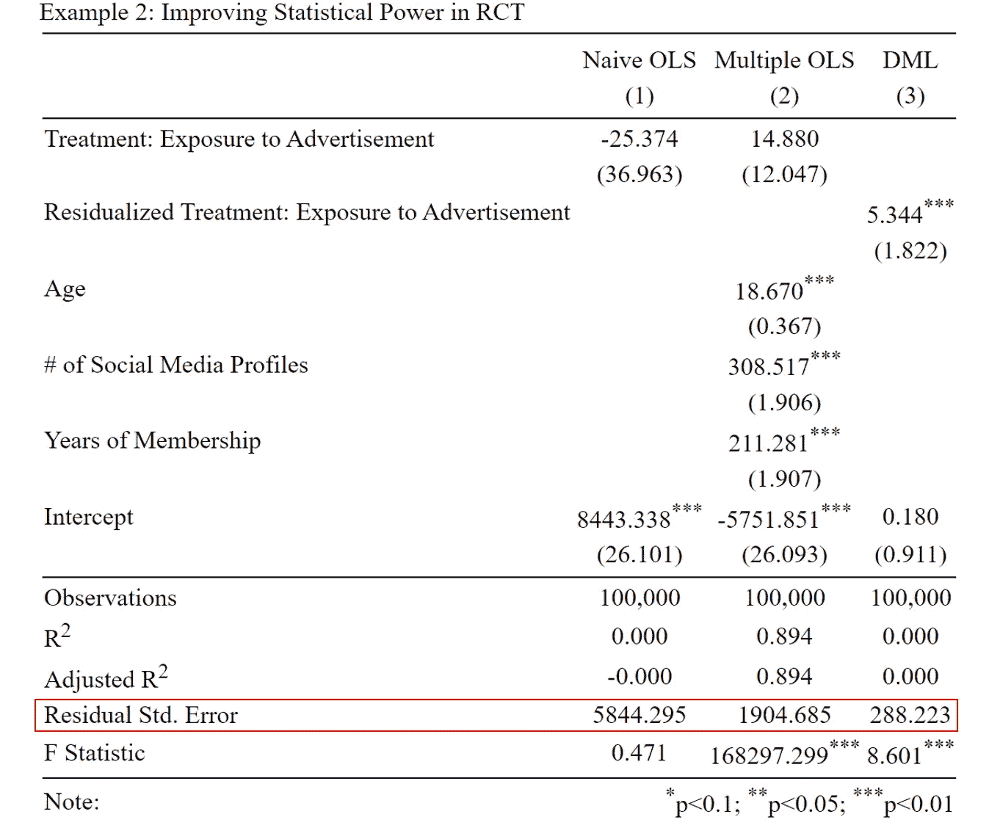

首先，请注意，由于处理是随机分配的，因此上面没有发生真正的混淆。 (1) 和 (2) 中的 ATE 估计误差是由于不精确的估计（见括号中的大标准误差）直接导致的。 注意随着我们从 (1) 到 (3) 迁移，标准误差如何变小（精度提高），其中 DML 程序具有最精确的估计。 请注意上面红框中的“残差标准误差”行。 我们可以看到 DML 程序通过从我们结果的 ML 模型（销售）中的预测因子中部分消除可学习的变异，显著减少了 ATE 模型残差的变异。 再次，在这个例子中，我们看到 DML 是唯一一个能够获得真实 ATE 的模型！

这些结果展示了在实验环境中使用 DML 以提高统计能力和 ATE 估计精度的好处。 具体而言，这可以应用于 RCT 或 A/B 测试环境，其中结果的变异非常大和/或在精确估计方面遇到困难，并且可以访问强有力的结果预测因子。

## 结论

就这样——双重机器学习简化版（希望如此）！ 感谢您花时间阅读我的文章。 我希望这篇文章能为您提供对 DML 基础知识的清晰而直观的理解，以及**DML 所具备的真正力量**，以及如何在日常因果推断任务中利用 DML。

敬请关注[第二部分](https://medium.com/towards-data-science/double-machine-learning-simplified-part-2-extensions-the-cate-99926151cac)系列，我们将深入探讨一些非常酷的 DML 扩展，这些扩展将我们的因果推断问题转化为预测任务，我们超越 ATE，预测个体级别的处理效应，以辅助决策和数据驱动的目标。

一如既往，我希望你们读这篇文章时和我写这篇文章时一样愉快！

## 附录

*创建漂亮的表格：*

```py
# Example 1
file = open('Example 1.html','w')

order = ['time_on_website','residualized_time_on_website','age','num_social_media_profiles','yr_membership','Intercept']
rename = {'time_on_website':'Treatment: Hours on Website','residualized_time_on_website':'Residualized Treatment: Hours on Website','age':'Age',
          'num_social_media_profiles':"# of Social Media Profiles", "yr_membership":"Years of Membership"}
columns = ['Naive OLS','Multiple OLS','DML','DML w/ Collider']

regtable = Stargazer([naive_regression, multiple_regression, DML_model, DML_model_collider])
regtable.covariate_order(order)
regtable.custom_columns(columns,[1,1,1,1])
regtable.rename_covariates(rename)
regtable.show_degrees_of_freedom(False)
regtable.title('Example 1: Obtaining Exogeneity w/ DML')

file.write(regtable.render_html())
file.close()

# Example 2
file = open('Example 2.html','w')

order = ['advertisement_exposure','residualized_advertisement_exposure','age','num_social_media_profiles','yr_membership','Intercept']
rename = {'advertisement_exposure':'Treatment: Exposure to Advertisement','residualized_advertisement_exposure':'Residualized Treatment: Exposure to Advertisement','age':'Age',
          'num_social_media_profiles':"# of Social Media Profiles", "yr_membership":"Years of Membership"}
columns = ['Naive OLS','Multiple OLS','DML']

regtable = Stargazer([naive_regression, multiple_regression, DML_model])
regtable.covariate_order(order)
regtable.custom_columns(columns,[1,1,1])
regtable.rename_covariates(rename)
regtable.show_degrees_of_freedom(False)
regtable.title('Example 2: Improving Statistical Power in RCT')

file.write(regtable.render_html())
file.close()
```

## 资源

[1] V. Chernozhukov, D. Chetverikov, M. Demirer, E. Duflo, C. Hansen, 和 a. W. Newey. 双重机器学习用于处理和因果参数。*ArXiv 电子印刷品*，2016 年 7 月。

*通过这个 GitHub 仓库访问所有代码：* [`github.com/jakepenzak/Blog-Posts`](https://github.com/jakepenzak/Blog-Posts)

*感谢你阅读我的文章！我在 Medium 上的文章旨在探讨利用* ***计量经济学*** *和* ***统计学/机器学习*** *技术的现实世界和理论应用。此外，我还致力于通过理论和模拟提供有关各种方法论的理论基础的文章。最重要的是，我写作是为了学习和帮助他人学习！我希望使复杂的主题对所有人稍微更容易理解。如果你喜欢这篇文章，请考虑* [***关注我在 Medium 上的账号***](https://medium.com/@jakepenzak)*！*
