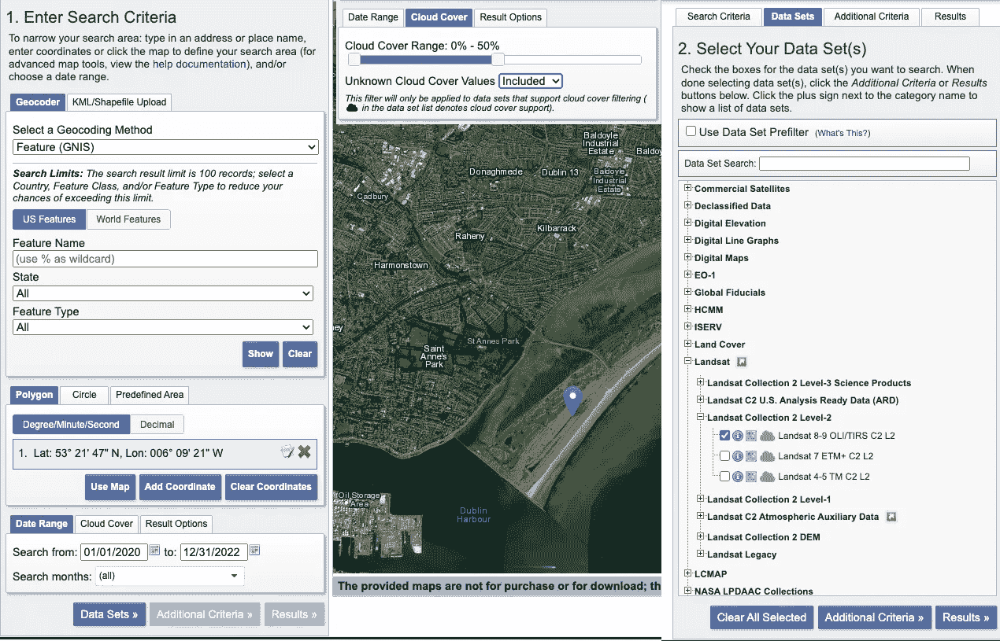
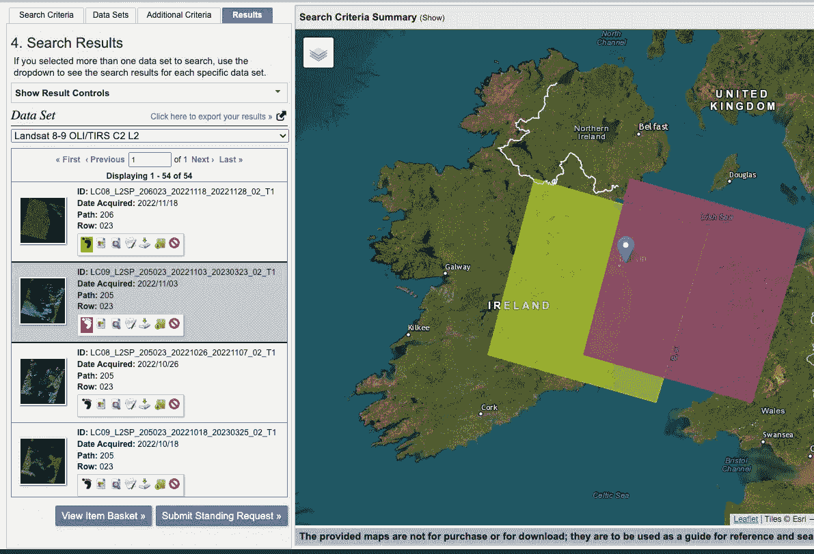
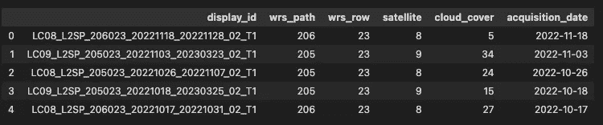
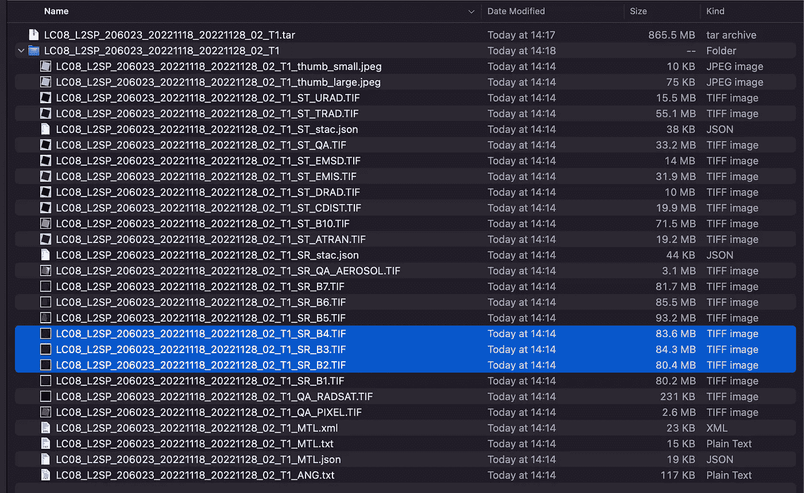
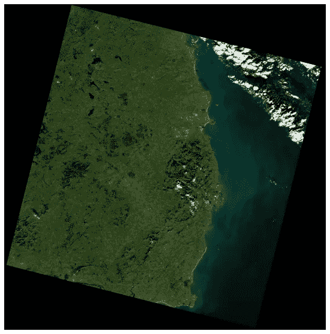

# 使用 Python 下载 Landsat 卫星图像

> 原文：[`towardsdatascience.com/downloading-landsat-satellite-images-with-python-a2d2b5183fb7`](https://towardsdatascience.com/downloading-landsat-satellite-images-with-python-a2d2b5183fb7)

## 使用 landsatxplore Python 包简化 Landsat 场景下载

[](https://conorosullyds.medium.com/?source=post_page-----a2d2b5183fb7--------------------------------)[](https://towardsdatascience.com/?source=post_page-----a2d2b5183fb7--------------------------------) [Conor O'Sullivan](https://conorosullyds.medium.com/?source=post_page-----a2d2b5183fb7--------------------------------)

·发布在 [Towards Data Science](https://towardsdatascience.com/?source=post_page-----a2d2b5183fb7--------------------------------) ·阅读时间 6 分钟·2023 年 5 月 9 日

--


图片由 [NASA](https://unsplash.com/@nasa?utm_source=medium&utm_medium=referral) 提供，[Unsplash](https://unsplash.com/?utm_source=medium&utm_medium=referral) 上发布

Landsat 卫星是最常用的地球观测数据来源之一。它们已经提供了四十多年高质量的地球表面图像。然而，手动下载这些图像可能会很繁琐！幸运的是，使用 [landsatxplore](https://github.com/yannforget/landsatxplore) 包，你可以轻松地下载和处理 Landsat 场景，只需几行代码。

我们将探索 landsatxplore 包，并逐步演示如何使用 Python 下载 Landsat 卫星图像。这包括：

+   使用 USGS 帐户设置 API 访问

+   搜索和过滤 Landsat 场景

+   使用 Python 下载和处理场景

告别手动下载，迎接自动化、高效的工作流程！

# 设置 landsatxplore

## 步骤 1：注册 USGS

首先，你需要 [设置一个 USGS 帐户](https://ers.cr.usgs.gov/)。这是你用来通过 [EarthExplorer](http://earthexplorer.usgs.gov) 下载场景的相同帐户。记住你的 **用户名** 和 **密码**，因为我们稍后会用到它们。

一旦注册完成，你可以使用 [USGS M2M API](https://m2m.cr.usgs.gov/api/docs/json/)。然而，这需要一些设置工作。相反，我们将使用 landsatxplore 包，它会为你抽象出大部分技术细节。

## 步骤 2：安装 landsatxplore

按照 [GitRepo](https://github.com/yannforget/landsatxplore) 上的说明进行操作。

## 步骤 3：检查 API 连接

使用下面的代码确认一切设置正确。你应该用你注册 USGS 帐户时使用的 **用户名** 和 **密码** 替换掉这些占位符。

```py
from landsatxplore.api import API

# Your USGS  credentials
username = "XXXXXXXXXXXX"
password = "XXXXXXXXXXXX"

# Initialize a new API instance
api = API(username, password)

# Perform a request
response = api.request(endpoint="dataset-catalogs")
print(response)
```

响应的输出应如下所示：

> {‘EE’: ‘EarthExplorer’, ‘GV’: ‘GloVis’, ‘HDDS’: ‘HDDS Explorer’}

这些是通过 API 提供的数据集。对于本教程，我们只考虑 EarthExplorer 数据集。

# 从 EarthExplorer 搜索场景

在我们继续使用 API 下载场景之前，我们将通过 EarthExplorer 进行手动搜索。这是为了将结果与使用 Python 看到的结果进行比较。如果你对 EarthExplorer 门户不熟悉，[这个教程](https://www.youtube.com/watch?v=eAmTxsg6ZYE&ab_channel=USGS)可能会有所帮助。

我们使用以下标准进行场景搜索：

+   这些场景必须包含给定纬度和经度的点。该点位于都柏林的布尔岛上。

+   采集时间为**01/01/2020**到**12/31/2022**

+   最大云量为**50%**

+   Level 2 Landsat 8 或 9 集合的一部分



EarthExplorer 搜索标准（来源：作者）

你可以在下面看到搜索结果。我们记录了一些内容以便与我们的 Python 搜索进行比较：

+   有**54 个场景**符合搜索条件。

+   有**2 个切片**包含布尔岛上的点。这些切片的路径和行值分别为**(206, 023)**和**(205, 023)**。

+   第一个场景的 ID 是**LC08_L2SP_206023_20221118_20221128_02_T1**。如果你对这个 ID 的含义感兴趣，请参见[Landsat 命名规则](https://www.usgs.gov/faqs/what-naming-convention-landsat-collections-level-1-scenes)。



EarthExplorer 搜索结果（来源：作者）

# 使用 landsatxplore Python 包

## 搜索场景

让我们使用 landsatxplore 进行等效搜索。我们使用下面的搜索功能来完成这一操作：

+   **数据集** — 定义我们想要的卫星场景。我们使用的值是 Landsat 8 和 9 的数据集 ID。有关 Landsat 5 和 7 的 ID，请参见[GitRepo](https://github.com/yannforget/landsatxplore)。

+   **纬度**和**经度**提供了布尔岛上的相同点。我们已经[将坐标转换为十进制度](https://www.latlong.net/degrees-minutes-seconds-to-decimal-degrees)。

+   **start_date**、**end_date**和**max_cloud_cover**也与之前相同。

```py
# Search for Landsat TM scenes
scenes = api.search(
    dataset='landsat_ot_c2_l2',
    latitude=53.36305556,
    longitude=-6.15583333,
    start_date='2020-01-01',
    end_date='2022-12-31',
    max_cloud_cover=50
)

# log out
api.logout()
```

搜索结果将以 JSON 字典的形式返回信息。我们将其转换为 Pandas DataFrame（第 4 行），其中每一行代表一个唯一的场景。返回了大量的元数据！因此，我们筛选出本应用程序所需的内容（第 5 行）。最后，我们按**获取日期**对其进行排序——即 Landsat 捕获场景的日期。

```py
import pandas as pd

# Create a DataFrame from the scenes
df_scenes = pd.DataFrame(scenes)
df_scenes = df_scenes[['display_id','wrs_path', 'wrs_row','satellite','cloud_cover','acquisition_date']]
df_scenes.sort_values('acquisition_date', ascending=False, inplace=True)
```

你可以在下面看到这个数据集的快照。与我们使用 EarthExplorer 的搜索进行比较，我们可以确定结果是相同的。这个数据集有**54 行**，并且有两个唯一的**wrs_path**和**wrs_row**对——**(206, 23)**和**(205, 23)**。第一个**display_id**与我们之前看到的也是相同的。



df_scenes 数据集快照（来源：作者）

如果我们愿意，可以进一步筛选数据集。我们可以使用**satellite**列仅选择来自 Landsat 8 或 9 的图像。此外，**cloud_cover**列提供了图像被云层覆盖的百分比。当你对最终的场景列表感到满意时，可以继续下载它们。

## 下载数据

下面是用于下载 Landsat 场景的代码。我们使用 EarthExplorer 函数（第 5 行）。这与之前一样初始化——使用你的 USGS 凭证。要下载一个场景，我们需要使用其**display_id**并定义输出目录（第 12 行）。我们使用的是上面提到的第一个场景的**display_id**（第 8 行）。

```py
from landsatxplore.earthexplorer import EarthExplorer
import os

# Initialize the API
ee = EarthExplorer(username, password)

# Select the first scene
ID = 'LC08_L2SP_206023_20221118_20221128_02_T1'

# Download the scene 
try: 
    ee.download(ID, output_dir='./data')
    print('{} succesful'.format(ID))

# Additional error handling
except:
    if os.path.isfile('./data/{}.tar'.format(ID)):
        print('{} error but file exists'.format(ID))
    else:
        print('{} error'.format(ID))

ee.logout()
```

你可能已经注意到上面的额外错误处理。这是因为包的[问题](https://github.com/yannforget/landsatxplore/issues/98)。在某些情况下，场景将正确下载但仍然会出现错误。额外的错误处理会再次检查场景文件是否存在。

## 处理数据

场景将作为 tar 文件下载。文件的名称将是**display_id**后跟**.tar**：

*LC08_L2SP_206023_20221118_20221128_02_T1.tar*

我们可以直接在 Python 中处理这些数据。首先，我们需要解压 tar 文件（第 4–6 行）。新文件夹的名称设置为场景的**display_id**（第 5 行）。

```py
import tarfile

# Extract files from tar archive
tar = tarfile.open('./data/{}.tar'.format(ID))
tar.extractall('./data/{}'.format(ID))
tar.close()
```

你可以看到下面的解压文件夹和所有可用的文件。这包括所有关于 Landsat [level-2 科学产品](https://www.usgs.gov/landsat-missions/landsat-collection-2-level-2-science-products)的资料。数据的应用无穷无尽！例如，我们将使用可见光波段可视化这个场景。这些波段在下面突出显示的文件中可用。



Landsat level-2 科学产品文件（来源：作者）

我们加载蓝色、绿色和红色波段（第 6–8 行）。我们堆叠这些波段（第 11 行），[对它们进行缩放](https://www.usgs.gov/faqs/how-do-i-use-scale-factor-landsat-level-2-science-products)（第 12 行）并裁剪以增强对比度（第 15 行）。最后，我们使用 matplotlib 显示这张图像（第 18–20 行）。你可以在下面看到这张图像。

```py
import tifffile as tiff
import numpy as np
import matplotlib.pyplot as plt

# Load Blue (B2), Green (B3) and Red (B4) bands
B2 = tiff.imread('./data/{}/{}_SR_B2.TIF'.format(ID, ID))
B3 = tiff.imread('./data/{}/{}_SR_B3.TIF'.format(ID, ID))
B4 = tiff.imread('./data/{}/{}_SR_B4.TIF'.format(ID, ID))

# Stack and scale bands
RGB = np.dstack((B4, B3, B2))
RGB = np.clip(RGB*0.0000275-0.2, 0, 1)

# Clip to enhance contrast
RGB = np.clip(RGB,0,0.2)/0.2

# Display RGB image
fig, ax = plt.subplots(figsize=(10, 10))
plt.imshow(RGB)
ax.set_axis_off()
```



Landsat 场景的 RGB 通道可视化（来源：作者）

如果你想了解更多关于处理卫星图像 RGB 通道的细节，可以查看这篇文章：

[](/visualising-the-rgb-channels-of-satellite-images-with-python-6d541af1f98d?source=post_page-----a2d2b5183fb7--------------------------------) ## 使用 Python 可视化卫星图像的 RGB 通道

### 在可视化卫星图像时，如何处理多个光谱带、大像素值和倾斜的 RGB 通道

[towardsdatascience.com

可视化 RGB 通道只是开始。下载数据后，我们可以进行任何遥感任务——从计算指标到训练模型。最棒的是，我们可以在不离开 Python 笔记本的情况下完成所有这些。

我希望你喜欢这篇文章！你可以通过成为我的 [**推荐会员**](https://conorosullyds.medium.com/membership) 来支持我 **:)**

[](https://conorosullyds.medium.com/membership?source=post_page-----a2d2b5183fb7--------------------------------) [## 通过我的推荐链接加入 Medium — Conor O’Sullivan

### 作为 Medium 会员，你的会员费用的一部分会流向你阅读的作者，并且你可以全面访问所有故事……

conorosullyds.medium.com](https://conorosullyds.medium.com/membership?source=post_page-----a2d2b5183fb7--------------------------------)

| [Twitter](https://twitter.com/conorosullyDS) | [YouTube](https://www.youtube.com/channel/UChsoWqJbEjBwrn00Zvghi4w) | [Newsletter](https://mailchi.mp/aa82a5ce1dc0/signup) — 免费注册获取 [Python SHAP 课程](https://adataodyssey.com/courses/shap-with-python/)
