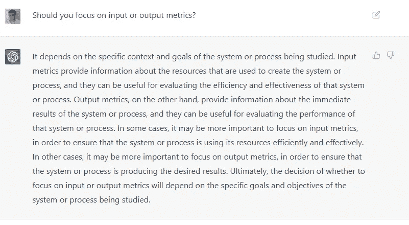

# 通过精心设计指标推动运营成功

> 原文：[`towardsdatascience.com/driving-operational-successes-through-careful-metric-design-ca55e3f84dad?source=collection_archive---------18-----------------------#2023-01-12`](https://towardsdatascience.com/driving-operational-successes-through-careful-metric-design-ca55e3f84dad?source=collection_archive---------18-----------------------#2023-01-12)

## 将战略转化为运营指标的艺术

 [Jordan Gomes](https://medium.com/@jordangom?source=post_page-----ca55e3f84dad--------------------------------)

·

[关注](https://medium.com/m/signin?actionUrl=https%3A%2F%2Fmedium.com%2F_%2Fsubscribe%2Fuser%2Fbd72dcfe2a5a&operation=register&redirect=https%3A%2F%2Ftowardsdatascience.com%2Fdriving-operational-successes-through-careful-metric-design-ca55e3f84dad&user=Jordan+Gomes&userId=bd72dcfe2a5a&source=post_page-bd72dcfe2a5a----ca55e3f84dad---------------------post_header-----------) 发表在 [Towards Data Science](https://towardsdatascience.com/?source=post_page-----ca55e3f84dad--------------------------------) ·11 分钟阅读·2023 年 1 月 12 日

--

**TL;DR:**

+   数据/业务分析师有时会被赋予“惊人的机会”来帮助创建一些指标。或者他们可能会看到创建新指标的需求并主动承担这些任务。但虽然建立指标很容易，设计**好的**指标却很难。

+   除了追踪，指标还是组织使利益相关者围绕一个共同的愿景和目标对齐的方式，而这伴随着一系列挑战。

+   一个框架可以帮助运营团队确保他们正确设置指标：输入 > 输出 > 结果框架。

+   无论上述框架是否使用，一旦新的指标被设计出来，验证它们并确保它们通过几个测试是很重要的。

定义指标基本上是将战略转化为一组“数量”。 明确定义的指标帮助你确保保持在实现组织目标的正确轨道上。但翻译错误可能会很昂贵：如果你设计的指标没有完全代表战略的精神，组织很容易偏离原来的目标，最终虽然你有人员做得很好（他们达到了你为指标设定的 OKR），组织却完全没有达到你的预期状态：

> 想象一下你从洛杉矶飞往纽约市。如果一位从 LAX 起飞的飞行员将航向调整仅仅 3.5 度向南，你将会降落在华盛顿特区，而不是纽约。这样一个小的变化在起飞时几乎不易察觉——飞机的机头仅移动了几英尺——但当这种变化放大到整个美国，你最终会相隔数百英里。

图片来源于 [Mitchel Boot](https://unsplash.com/@valeon?utm_source=medium&utm_medium=referral) 在 [Unsplash](https://unsplash.com/?utm_source=medium&utm_medium=referral)

James Clear 在 **《原子习惯》** 中写了以上内容。诚然——这本书旨在阐明完全不同的内容。但与运营指标的想法是相同的：你的目的地是你的战略，指标将帮助你保持在正确的路径上。如果你没有正确设置你的指标，维持你设定的目标将会很困难。

# 指标：它们是什么以及我们为什么需要它们

简而言之，**衡量指标让你能够量化某事。** 你可以为任何事情构建一个指标，这实际上是指标设计工作中最大的挑战之一（数量 <> 质量）。

衡量指标让你了解‘一个过程’的表现——它们帮助你了解历史演变，它们让你进行基准测试，在‘领先指标’的情况下，它们提供对未来表现的早期预测

但最重要的是，衡量指标的真正力量在于它们的对齐。它们提供了组织内部的共同语言和共同视角。它们围绕一个共同目标进行联合。这也是为什么拥有正确的指标可能很棘手：在某些情况下，一旦指标被定义——**它们往往会成为目标，团队将试图推动它。**

当这种情况发生时——这通常是你开始看到指标可能存在/存在的不同问题时。

图片来源于 [Pierre Bamin](https://unsplash.com/@bamin?utm_source=medium&utm_medium=referral) 在 [Unsplash](https://unsplash.com/?utm_source=medium&utm_medium=referral)

# 衡量指标定义的常见挑战

定义度量指标伴随着许多挑战——但有两个挑战让我特别警觉，每当你在这样的项目中工作时，都需要格外小心。

## 这些指标可能会激励错误的行为。

指标可能会产生意想不到的后果，这些后果可能与公司的整体目标不一致。仔细考虑指标对行为的潜在影响，并确保它们的设计能够激励正确的行为和结果是非常重要的。

比如，假设减少通过电子邮件打开的支持票数是你团队的首要任务。一种解决方案可能是尽可能让联系电子邮件支持变得困难。例如，将你的支持电子邮件地址“隐藏”在你网站的随机页面上，使其非常复杂，并以.png 格式展示，以便人们必须手动重新输入。这样做可能会降低联系数量，但这可能会产生其他意想不到的后果（例如，增加“负面”社交媒体互动）。

这并不一定是因为人们想要操控系统——更可能是因为人们未必对组织及其所有内容有完全的理解。一旦某人的绩效与指标挂钩——那么他们试图改变该指标是合情合理的，因此，指标设计者必须确保“游戏规则”被清晰地阐明。

有许多方法可以解决这个问题，但这些方法也有其自身的挑战：

+   你可以设计一个配对指标，即另一个旨在“强制”某种行为的指标（例如，与注册数配对的指标可以是流失率）。当你开始有太多指标，并且这些指标并不一定指向相同方向时，可能会出现一些挑战——从噪音中解读信号，决定该做什么可能会变得困难。

+   你可以设计一个复合指标，考虑多个因素，以确保它不能被轻易操控。在《[可靠的在线控制实验](https://www.amazon.com/Trustworthy-Online-Controlled-Experiments-Practical/dp/1108724264)》（一本我推荐给任何对 A/B 测试感兴趣的人的好书，别被书名吓到！）中，作者解释了每当你进行实验时，应该构建“**客观实验标准**”（OEC）。OEC 是一个复合指标，考虑到你的实验应当影响的指标和你不希望实验负面影响的指标（例如成本指标、警戒指标、健康指标）——这最终将允许你创建一个二元决策规则，以决定你的实验是否成功。这个概念非常有趣，对于实验来说效果很好。说到这里，复合指标在跟踪过程时可能很难使用——你需要理解其底层逻辑，才能理解指标的变化并进行调试——因此你最终会跟踪所有构成复合指标的不同指标。

**最终**，这项任务落在了度量指标设计师的肩上，确保设置了正确的检查，以保证指标的变动与公司的目标一致。

## 这个指标具有欺骗性

想象一下：你是一个在大电子商务公司工作的分析师。某处有人发现交易数量与整体收入之间有很大相关性。根据这项研究，一位副总裁决定应对交易数量设定一个 OKR，并要求不同的团队去推动这个 OKR。

团队开始进行一些活动来增加交易数量（重新针对以前的客户、提供折扣等）。他们取得了成功——但目前还不清楚这对收入的影响如何。

不幸的是，后续分析揭示了公司大部分收入实际上来自于“高价值”商品，而交易数量的增加主要发生在“低价值”商品上——**最终**未能对收入产生任何实质性影响。

更清楚地说，团队确实增加了交易数量，但这并没有转化为收入。

在这种情况下，指标是具有欺骗性的。它未能考虑到业务的一个重要方面：并不是所有交易都能带来收入。这对公司来说成本相当高：公司建立了一个指标和一个报告基础设施，向所有不同的利益相关者进行沟通并解释了这些指标，这些利益相关者不得不改变他们的操作来推动该指标，公司还必须进行多项研究以理解其潜在影响，等等。总之，投入很大，而回报却不多。

# 一种为运营团队定义度量指标的简单方法

指标是一个很好的工具，但设计它们会面临许多挑战，并且通常不是一项容易的工作。但为了帮助，有几个框架存在。特别是“输入 > 输出 > 结果”框架，我将在下段中讨论。为了使话题不那么枯燥，我将以高中生教育项目为例，展示如何使用输入 > 输出 > 结果框架来定义指标，从而使该项目取得成功！

***快速免责声明：*** *就像任何框架一样，它并不一定适用于所有情况 / 它也不一定是你业务的最佳选择。最终，框架只是一个帮助决策的工具——你不应该盲目遵循，而是应该根据自己的情况进行调整。*

## 输入是你可以控制的

+   这就是 ROI 中的“I”

+   这就是你带到桌面上的：你在任务上花费的时间、生产某物使用的材料量等。

+   这应该完全在你的控制之下

在我们的例子（教育项目）中，教师人数、他们的资历、资金等都可能是我们系统的输入指标。

## 输出由你的输入驱动

+   输出直接跟随输入：如果你从漏斗的角度思考，输出是输入后的漏斗的下一步

+   这些可以通过你的输入来改变：如果输入增加（或减少），输出也会相应地变化。它们非常可操作。

+   他们对你的活动反应迅速，这意味着当输入增加或减少时，输出也会相应地变化。然而，它们并不完全在你的控制之下。

+   你的输出和结果之间有**因果关系**

这些指标通常是最难定义的。它们正好处于你的输入和结果之间，但定义这个‘之间’的确切位置可能会变得棘手——因为你要保持可操作性，同时也要考虑因果关系。

就像生活中的许多事情一样，一切都关于平衡。在我们的教育项目例子中，学生的成绩、他们的一致性、他们随时间的进步等都可能是我们的输出。

## 结果是北极星

结果对你来说是最重要的——是你通过所有活动想要推动的东西。它们是你业务健康的主要指标。它们代表了驱动你和你的团队的“WHY”。推动结果通常比输出更困难，需要多个输出的“帮助”，并且需要一些时间。虽然输出是你应在“日常”中跟踪的指标，但结果是你在一段时间后希望实现的目标。

在我们的例子中，高中毕业生人数可能是北极星。

这里是最终流程：教师人数、他们的平均资历、学校的资金（输入）帮助推动学生的成绩及其随时间的一致性更高（输出），这最终会导致更多学生顺利毕业（结果）。

# 验证指标

无论是否使用此框架——一旦新的指标被设计出来，验证它们并确保它们通过几个测试是很重要的：

## 确保指标正确地代表现象

第一步是确保你考虑使用的指标能够正确地代表你试图评估的现象。这高度依赖于你的业务/活动/公司，这里没有秘密公式。

“打开邮件”是否是“潜在客户阅读了我们的沟通”的良好代理？成绩是否是知识的良好代理？一般来说，想法是选择某种测量方法，并确保指标是可靠的（即测量是值得信赖的）和准确的（即它正确地描述了它应该描述的现象）。

## 确保指标分类明确，并且与其创建原因对齐

输入指标应该在你的直接控制范围内/直接可操作。输出指标应该直接“跟随”你的输入指标，即应该清楚地说明增加一个单位的输入会改变多少输出。然后，你的结果和输出之间应该有因果关系。如果你的输入不一定流入你的输出，或者最终你的输出似乎对你的结果没有任何影响，那么系统实际上并没有正常运作，你有可能推动错误的方向。

关于最后一点——这是最难证明的事情之一：你输出和结果之间的因果关系。根据你愿意承担的‘风险’级别（以及你手头拥有的工具），可能需要你进行一些实验——在正确定义你应该推动的结果之前。

## 确保指标不会激励“错误行为”

如前所述，你不想激励错误的行为。你不想让你的支持人员减少支持票据而不关心客户满意度。你不想推动你的销售人员进行销售而不关心留存率。

这里的想法是利用这一步来思考如何“游戏”指标的最坏方式——并据此构建配对指标，即阻止任何人采取可能对你的业务产生负面影响的“最小阻力路径”的次要指标。

如果你测量一些数量（例如销售额），你可能还需要确保测量一些质量指标（例如留存率）。如果你在短期内进行测量，你可能还需要确保在长期内也进行测量。在[*高效能管理*](https://www.amazon.co.uk/High-Output-Management-Andrew-Grove/dp/0679762884/ref=sr_1_1?ie=UTF8&qid=1504535096&sr=8-1&keywords=andy+grove)一书中，安迪·格罗夫以类似的方式讨论了“配对指标”：

> “指标往往会引导你的注意力集中在它们所监测的内容上。这就像骑自行车：你可能会把自行车转向你所看的方向。例如，如果你开始仔细测量你的库存水平，你可能会采取措施降低库存水平，这在一定程度上是好的。但你的库存可能变得过于精简，以至于无法应对需求变化而不造成短缺。因此，由于指标引导了一个人的活动，你应该防止过度反应。你可以通过配对指标来做到这一点，这样两个效果和反效果都会被测量。”

## 结束语：你应该将精力集中在哪里？

根据杰夫·贝索斯的说法，你应该专注于输入。其他一些商界人士也有相同的想法（例如，基思·拉博伊斯有一句有趣的名言：“为了赢得一场足球比赛，你不是专注于进球，而是专注于训练团队”）。

我个人分享这种想法，但我想提供一个更细致的观点，而且现在感觉你需要在文章中至少提到一次 chatGPT——我问了 chatGPT 它对这件事的“看法”。

简而言之——“这要看情况”。

## 希望你喜欢这篇文章！你有什么想分享的建议吗？在评论区告诉大家吧！

**如果你想阅读更多我的文章，这里有一些你可能会喜欢的其他文章**：

 ## 7 个让你的数据分析更强大的技巧

### 增强你对结果的信心，打造更强的个人品牌

[towardsdatascience.com  ## 如何建立一个成功的仪表盘

### 来自那些曾经建立过几个不成功项目的人的检查清单

[towardsdatascience.com  [## 如何…选择要从事的数据项目

### 如果你对如何使用时间有合理的方法，你可以优化你产生的价值。

[medium.com](https://medium.com/@jolecoco/how-to-choose-which-data-projects-to-work-on-c6b8310ac04e?source=post_page-----ca55e3f84dad--------------------------------)
