# 使用多臂老虎机进行动态定价：通过实践学习

> 原文：[`towardsdatascience.com/dynamic-pricing-with-multi-armed-bandit-learning-by-doing-3e4550ed02ac?source=collection_archive---------1-----------------------#2023-08-16`](https://towardsdatascience.com/dynamic-pricing-with-multi-armed-bandit-learning-by-doing-3e4550ed02ac?source=collection_archive---------1-----------------------#2023-08-16)

## 将强化学习策略应用于实际案例，尤其是动态定价中，可以揭示许多惊喜

 [Massimiliano Costacurta](https://medium.com/@massi.costacurta?source=post_page-----3e4550ed02ac--------------------------------)

·

[关注](https://medium.com/m/signin?actionUrl=https%3A%2F%2Fmedium.com%2F_%2Fsubscribe%2Fuser%2F233cb43234c3&operation=register&redirect=https%3A%2F%2Ftowardsdatascience.com%2Fdynamic-pricing-with-multi-armed-bandit-learning-by-doing-3e4550ed02ac&user=Massimiliano+Costacurta&userId=233cb43234c3&source=post_page-233cb43234c3----3e4550ed02ac---------------------post_header-----------) 发表在 [Towards Data Science](https://towardsdatascience.com/?source=post_page-----3e4550ed02ac--------------------------------) ·16 分钟阅读·2023 年 8 月 16 日

--

由 [Markus Spiske](https://unsplash.com/@markusspiske?utm_source=medium&utm_medium=referral) 拍摄，照片来自 [Unsplash](https://unsplash.com/?utm_source=medium&utm_medium=referral)

# 动态定价、强化学习与多臂老虎机

在决策问题的广阔世界中，有一个困境特别属于强化学习策略：探索与利用。想象一下走进一个赌场，那里有一排排的老虎机（也称为“单臂赌博机”），每台机器支付的奖励各不相同且未知。你是探索并玩每台机器以发现哪个机器的回报最高，还是坚持玩一台机器，希望它就是大奖？这个隐喻场景构成了多臂赌博机（MAB）问题的核心概念。目标是找到一个在一系列游戏中最大化奖励的策略。虽然探索提供了新的见解，但利用则是利用你已经拥有的信息。

现在，将这一原则转移到零售场景中的动态定价上。假设你是一个电子商务商店的老板，拥有一款新产品。你不确定其最佳销售价格。你该如何设定一个最大化收入的价格？你应该探索不同的价格以了解客户的支付意愿，还是应该利用一个在历史上表现良好的价格？动态定价本质上是一个伪装的多臂赌博机问题。在每一个时间点，每一个候选价格点都可以看作是老虎机的一个“臂”，而从该价格生成的收入则是其“奖励”。另一种看法是，动态定价的目标是迅速而准确地测量客户群体对不同价格点的需求反应。简单来说，目标是找出最能反映客户行为的需求曲线。

在这篇文章中，我们将探讨四种多臂赌博机算法，以评估它们在一个明确定义（尽管并不简单）的需求曲线下的效果。随后，我们将分析每种算法的主要优点和局限性，并深入研究评估其性能的关键指标。

# 需求曲线建模

传统上，经济学中的需求曲线描述了产品价格与消费者愿意购买的产品数量之间的关系。它们通常向下倾斜，表示一个常见的观察，即价格上涨时，需求通常会下降，反之亦然。想想智能手机或演唱会门票这样的热门产品。如果价格降低，更多的人往往会购买，但如果价格飙升，即使是忠实粉丝也可能会重新考虑。

然而，在我们的背景下，我们将稍微不同地建模需求曲线：我们将价格与概率进行对比。为什么？因为在动态定价场景中，特别是数字商品或服务的情况下，考虑在给定价格下销售的可能性往往比猜测确切数量更有意义。在这样的环境中，每次定价尝试都可以看作是对成功（或购买）可能性的探索，这可以简单地建模为一个伯努利随机变量，其概率*p*取决于给定的测试价格。

这里才是特别有趣的地方：虽然直观上我们可能认为我们的多臂赌博算法的任务是发现概率最高的购买价格，但事实并不是那么简单。实际上，我们的最终目标是最大化收入（或边际）。这意味着我们不是寻找能让最多人点击‘购买’的价格，而是寻找能让乘以其相关购买概率后获得最高预期回报的价格。想象一下，设定一个较高的价格，虽然卖出的人较少，但每笔销售却能产生相当可观的收入。相反，一个非常低的价格可能会吸引更多的买家，但总收入可能仍低于高价情况。因此，在我们的背景下，谈论‘需求曲线’有些不寻常，因为我们的目标曲线主要代表购买概率而不是需求直接。

现在，来谈谈数学，让我们先说消费者行为，特别是在处理价格敏感性时，并不总是线性的。线性模型可能会暗示每次价格增加时，需求都会线性下降。实际上，这种关系通常更为复杂和非线性。建模这种行为的一种方式是使用逻辑函数，它可以更有效地捕捉这种微妙的关系。我们选择的需求曲线模型是：

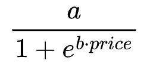

在这里，*a*确定了最大可达购买概率，而*b*调节了需求曲线对价格变化的敏感程度。*b*的值越高，曲线就越陡，随着价格的增加更快地接近较低的购买概率。

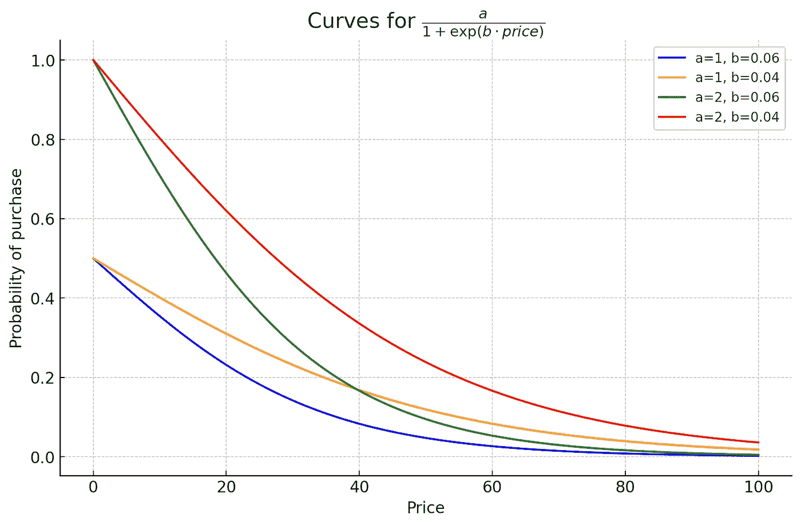

具有不同参数 a 和 b 组合的四个需求曲线示例

对于任何给定的价格点，我们将能够获得一个相关的购买概率，*p*。然后，我们可以将*p*输入到一个伯努利随机变量生成器中，以模拟顾客对特定价格提议的反应。换句话说，给定一个价格，我们可以轻松地模拟我们的奖励函数。

接下来，我们可以将这个函数乘以价格，以获得给定价格点的期望收入：

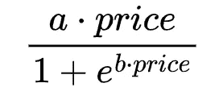

毫不奇怪，这个函数并不会在概率最高的地方达到最大值。此外，最大值所对应的价格并不取决于参数*a*的值，而最大期望回报却取决于*a*的值。

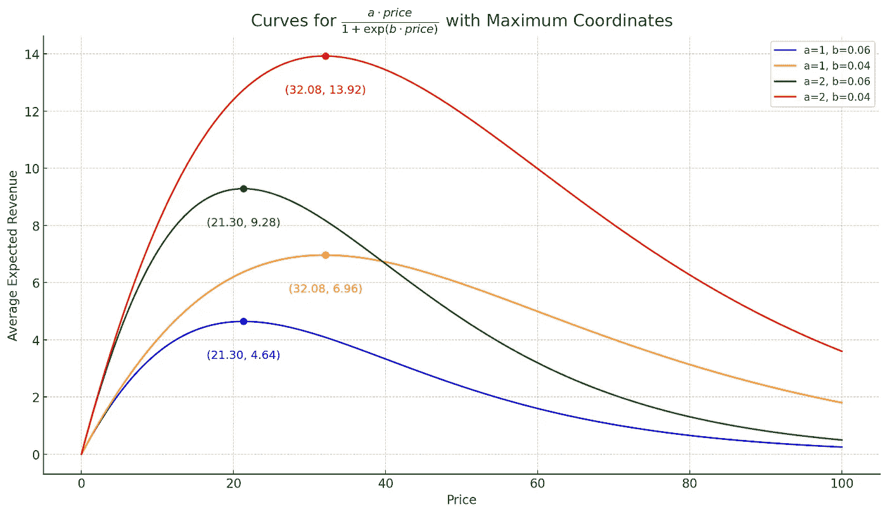

期望收入曲线与相关最大值

结合一些微积分知识，我们还可以推导出导数的公式（你需要同时使用乘法法则和链式法则）。这不是一个轻松的练习，但也没有特别困难的地方。这是期望收入的导数的解析表达式：

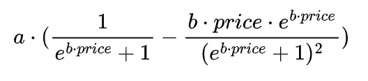

这个导数允许我们找到最大化期望收入曲线的确切价格。换句话说，通过使用这个特定的公式以及一些数值算法，我们可以轻松确定将其设为 0 的价格。反过来，这就是最大化期望收入的价格。

这正是我们需要的，因为通过固定*a*和*b*的值，我们将立即知道我们的赌博机需要找到的目标价格。用 Python 编码这只需几行代码：

对于我们的用例，我们将设置*a*=2 和*b*=0.042，这将给我们一个大约 30.44 的目标价格，关联的最佳概率为 0.436（→最佳平均奖励为 30.44*0.436=13.26）。这个价格在一般情况下显然是未知的，正是我们的多臂赌博机算法将要寻找的价格。

# 多臂赌博机策略

既然我们已经确定了目标，现在是时候探索各种策略以测试和分析它们的性能、优点和缺点了。虽然在 MAB 文献中存在几种算法，但在实际应用中，四种主要策略（及其变种）主要构成了基础。在本节中，我们将简要概述这些策略。我们假设读者对这些策略有基本了解；不过，对于那些有兴趣深入研究的人，我们在文章末尾提供了参考文献。在介绍每个算法后，我们还将展示其 Python 实现。尽管每种算法具有其独特的参数，但它们都普遍使用一个关键输入：`arm_avg_reward`向量。该向量表示当前时间步*t*为止每个臂（或动作/价格）获得的平均奖励。这个关键输入指导所有算法做出有关后续价格设置的明智决策。

我将应用于我们的动态定价问题的算法如下：

**贪婪策略**：这一策略就像是每次都回到最初给你最多硬币的机器。尝试过每台机器后，它会坚持最初表现最好的那一台。但可能会有一个问题。如果那台机器只是最初运气好呢？贪婪策略可能会错过更好的选项。幸运的是，代码实现非常简单：

区分初始情境（所有回报均为 0 时）与常规情境是至关重要的。通常，你会发现只实现了‘else’部分，这确实在所有回报为 0 时也能工作。然而，这种方法可能导致对第一个元素的偏见。如果忽视这一点，你可能会因此付出代价，特别是当最优回报恰好与第一个臂相关时（是的，我经历过）。贪婪方法通常表现最差，我们将主要使用它作为性能基准。

***ϵ*-贪婪**：ε-贪婪（epsilon-greedy）算法是对贪婪方法主要缺陷的一种改进。它引入了一个概率 *ε*（epsilon），通常是一个小值，用于选择一个随机的臂，促进探索。以概率 1−*ε*，它选择回报估计最高的臂，偏向于利用。通过在随机探索和已知回报的利用之间进行平衡，ε-贪婪策略旨在实现比纯粹的贪婪方法更好的长期回报。同样，这种实现是直接的，只需在贪婪代码上添加一个额外的‘if’。

**UCB1（上置信界）**：UCB1 策略就像一个好奇的探险者，试图在新城市找到最好的餐馆。虽然有一个他们已经喜欢的地方，但每天都会有可能发现更好的地方。在我们的上下文中，UCB1 将已知价格点的回报与那些较少探索的价格点的不确定性相结合。数学上，这种平衡是通过一个公式实现的：价格点的平均回报加上一个基于距离上次尝试的时间的“未知奖励”奖金。这个奖金计算为

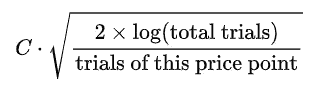

并代表了对未尝试价格的“增长的好奇心”。超参数 *C* 控制利用和探索之间的平衡，*C* 值较高时，鼓励更多探索较少采样的臂。通过始终选择已知回报和好奇心奖金的组合值最高的价格，UCB1 确保了既坚持已知又探索未知的混合，旨在揭示最大收入的最优价格点。我会从按部就班的实施开始，但我们很快会看到需要对其进行一些调整。

**汤普森采样**：这种贝叶斯方法通过基于后验奖励分布的概率选择臂来解决探索-利用困境。当这些奖励符合伯努利分布，表示像成功/失败这样的二元结果时，汤普森采样（TS）使用 Beta 分布作为共轭先验（参见[此表](https://en.wikipedia.org/wiki/Conjugate_prior)）。算法从每个臂开始使用非信息性 Beta(1,1)先验，并在观察到奖励后更新分布的参数：成功增加 alpha 参数，而失败增加 beta 参数。在每次游戏中，TS 从每个臂的当前 Beta 分布中抽取样本，并选择具有最高抽样值的臂。这种方法使 TS 能够根据获得的奖励动态调整，巧妙地平衡了对不确定臂的探索和对已知奖励臂的利用。在我们的具体场景中，尽管基础奖励函数遵循伯努利分布（购买为 1，错过购买为 0），但实际感兴趣的奖励是该基础奖励与当前测试价格的乘积。因此，我们的 TS 实现将需要稍作修改（这也会带来一些惊喜）。

改动其实很简单：要确定最有前途的下一个臂，提取自后验估计的样本乘以其各自的价格点（第 3 行）。这一修改确保决策基于预期的平均收入，而非最高购买概率。

# 我们如何评估结果？

此时，在收集了所有关键因素以构建一个比较我们动态定价背景下四种算法性能的仿真后，我们必须问自己：我们究竟要测量什么？我们选择的指标至关重要，因为它们将指导我们在比较和改进算法实现的过程中。在这方面，我关注三个关键指标：

1.  **遗憾**：该指标衡量所选择行动获得的奖励与采取最佳可能行动所能获得的奖励之间的差异。从数学上讲，时间*t*的遗憾定义为：遗憾(*t*)=最佳奖励(*t*)−实际奖励(*t*)。遗憾在时间上累积，提供了我们没有总是选择最佳行动而“失去”多少的洞察。与累计奖励相比，遗憾更为优选，因为它能更清晰地指示算法相对于最佳情况的表现。理想情况下，接近 0 的遗憾值表明接近于最佳决策。

1.  **反应性**：这一指标衡量算法接近目标平均奖励的速度。本质上，它是算法适应性和学习效率的衡量标准。一个算法越快达到期望的平均奖励，它的反应性就越强，意味着更快地调整到最佳价格点。在我们的情况下，目标奖励设定为最佳平均奖励的 95%，即 13.26。然而，初始步骤可能表现出较高的波动性。例如，一个幸运的早期选择可能会导致从一个低概率的高价格臂中获得成功，迅速达到阈值。由于这些波动，我选择了一个更严格的反应性定义：达到 95%最佳平均奖励十次所需的步骤数，排除最初的 100 步。

1.  **臂分配**：这表示每个算法使用可用臂的频率。以百分比形式呈现，它揭示了算法随时间选择每个臂的倾向。理想情况下，对于最有效的定价策略，我们希望算法将 100%的选择分配给表现最好的臂，0%分配给其他臂。这样的分配将固有地导致 0 的遗憾值，表示最佳性能。

# 运行仿真

评估 MAB 算法具有挑战性，因为其结果具有高度的随机性。这意味着由于确定量的固有随机性，结果在不同运行之间可能大相径庭。为了进行稳健的评估，最有效的方法是多次执行目标仿真，累积每次仿真的结果和指标，然后计算平均值。

初始步骤包括创建一个模拟决策过程的函数。这个函数将实现下图所示的反馈循环。

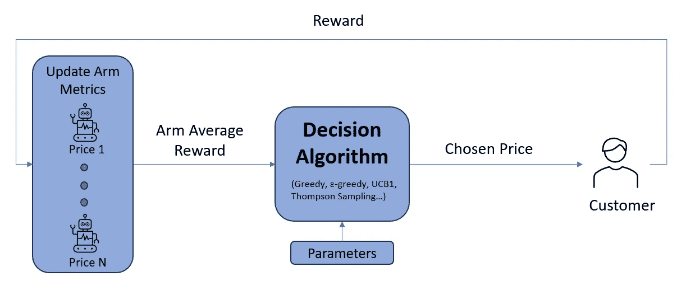

在仿真函数中实现的反馈循环

这是仿真循环的实现：

该函数的输入是：

+   `prices`：我们希望测试的候选价格列表（本质上是我们的“臂”）。

+   `nstep`：仿真中的总步骤数。

+   `strategy`：我们旨在测试的用于决策下一个价格的算法。

最后，我们需要编写外循环的代码。对于每个目标策略，这个循环将调用`run_simulation`多次，收集并汇总每次执行的结果，然后展示结果。

对于我们的分析，我们将使用以下配置参数：

+   `prices`：我们的价格候选值 → [20, 30, 40, 50, 60]

+   `nstep`：每次仿真的时间步数 → 10000

+   `nepoch`：仿真执行次数 → 1000

此外，通过设置我们的价格候选值，我们可以快速获得相关的购买概率，这些概率是（大约）[0.60, 0.44, 0.31, 0.22, 0.15]。

# 结果

在运行模拟之后，我们终于能够看到一些结果。我们从累计遗憾的图表开始：

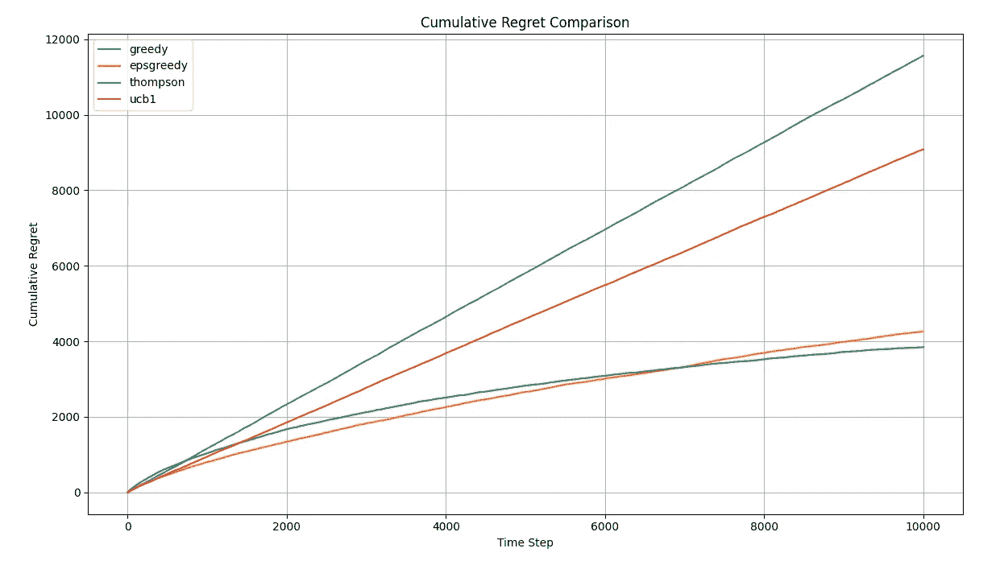

从图表中，我们可以看到，在平均累计遗憾方面，TS 是赢家，但它需要大约 7,500 步才能超越 ε-greedy。另一方面，我们有一个明显的失败者，那就是 UCB1。在其基本配置下，它基本上表现与贪婪方法相当（稍后我们会再讨论）。让我们通过探索其他可用的指标来更好地理解结果。在所有四种情况下，反应性表现出非常大的标准差，因此我们将关注中位数值而非均值，因为它们对离群值更具抵抗力。

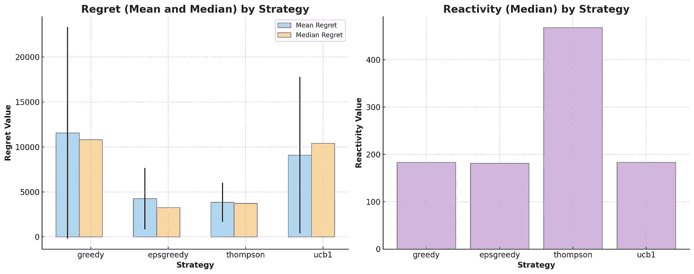

从图表中的初步观察显示，虽然 TS 在均值方面超越了 ε-greedy，但在中位数方面略显滞后。然而，其标准差较小。特别有趣的是反应性条形图，它展示了 TS 如何努力快速实现有利的平均奖励。起初，这对我来说有些反直觉，但在这个场景中 TS 的机制澄清了问题。我们之前提到 TS 估计购买概率。然而，决策是基于这些概率和价格的乘积。了解真实概率（如前所述，[0.60, 0.44, 0.31, 0.22, 0.15]）让我们能够计算 TS 正在积极导航的期望奖励：[12.06, 13.25, 12.56, 10.90, 8.93]。本质上，尽管基础概率差异较大，但从 TS 的角度来看，期望收益值相对接近，尤其是在接近最佳价格时。这意味着 TS 需要更多时间来辨别最佳臂。虽然 TS 仍然是表现最好的算法（如果模拟时间延长，其中位数最终会低于 ε-greedy 的中位数），但在这种情况下，它需要更长时间来确定最佳策略。下面的臂分配饼图显示 TS 和 ε-greedy 在识别最佳臂（价格=30）并在模拟过程中大部分时间使用它方面做得相当不错。

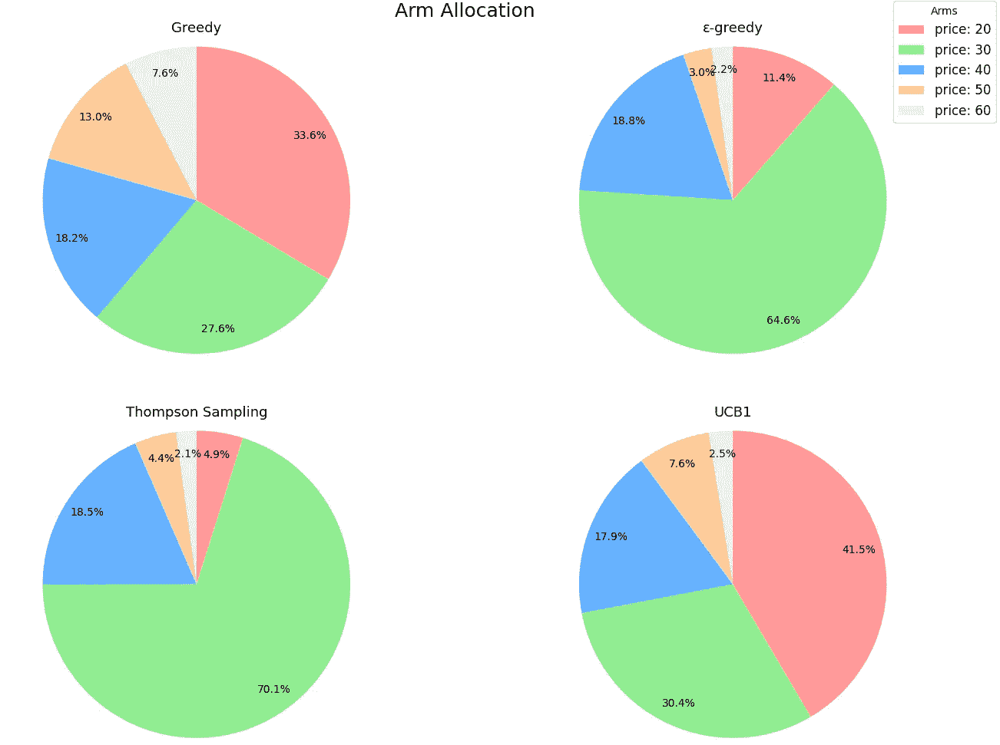

现在让我们回到 UCB1。遗憾和反应性确认它基本上作为一个完全利用的算法：快速获得良好的平均奖励水平，但遗憾较大且结果变异性高。如果我们查看臂分配，这一点更为明显。UCB1 仅比贪婪方法稍微聪明一些，因为它更多地关注具有较高期望奖励的 3 个臂（价格为 20、30 和 40）。然而，它基本上完全没有探索。

进入超参数调优。显然，我们需要确定平衡探索与利用的权重 *C* 的最佳值。第一步是修改 UCB1 代码。

在这段更新的代码中，我加入了在添加“不确定性奖励”之前标准化平均奖励的选项，这个奖励是由超参数*C*加权的。这样做的原因是为了让最佳超参数的搜索范围保持一致（比如 0.5–1.5）。如果没有这个标准化，我们可能会得到类似的结果，但搜索区间需要根据每次处理的值范围进行调整。我会避免让你寻找最佳*C*值的无聊，它可以通过网格搜索轻松确定。事实证明，最佳值是 0.7。现在，让我们重新运行模拟并检查结果。

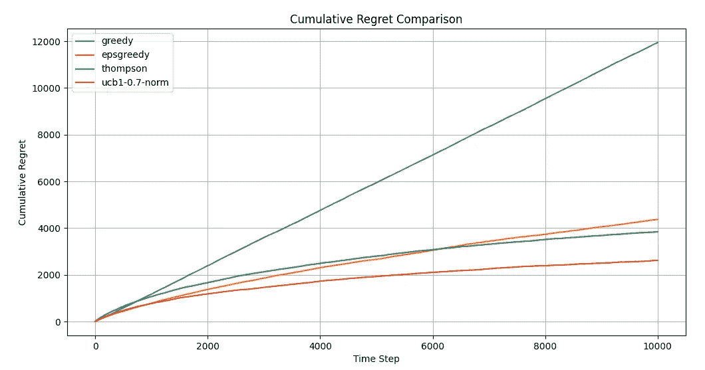

这真是个大反转，不是吗？现在，UCB1 显然是最好的算法。即使在反应性方面，与之前的得分相比，它也只是略微恶化。

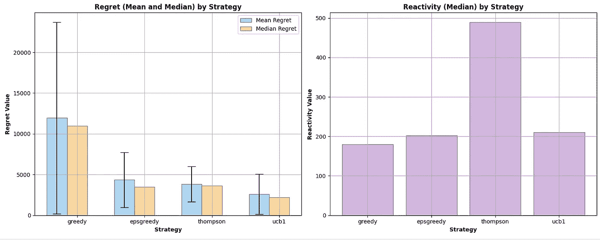

此外，从臂分配的角度来看，UCB1 现在是无可争议的领导者。

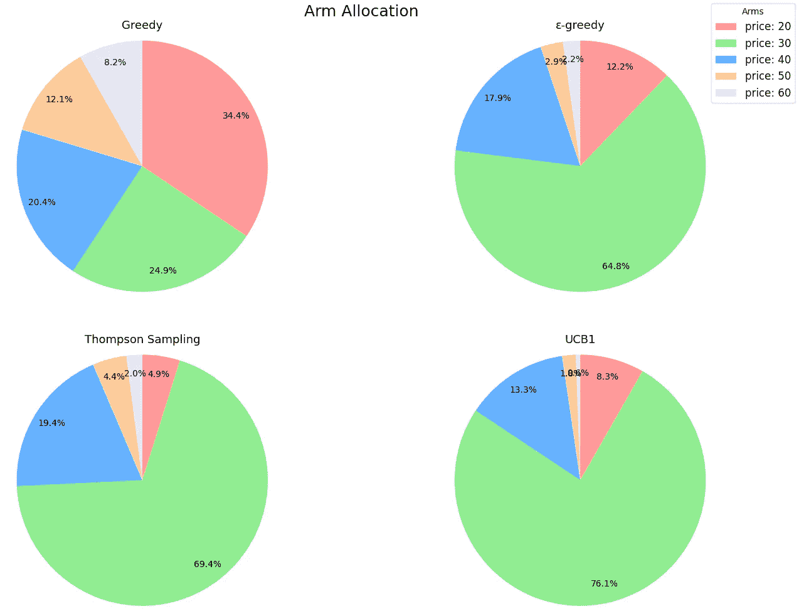

# 经验教训和下一步

+   **理论与经验**：从书本学习开始是深入新主题的一个必要步骤。然而，你越早投入实际经验，你将越快将信息转化为知识。当你将算法应用到现实世界用例时，遇到的细微差别、复杂性和特殊情况将提供远超你可能阅读的任何数据科学书籍的洞察。

+   **了解你的指标和基准**：如果你不能衡量你所做的事情，你就不能改进它。在开始任何实现之前，必须了解你打算使用的指标。如果我仅仅考虑了遗憾曲线，我可能会得出“UCB1 不起作用”的结论。通过评估其他指标，特别是臂分配，明显发现算法只是没有足够探索。

+   **没有一刀切的解决方案**：虽然 UCB1 在我们的分析中脱颖而出，但这并不意味着它是你动态定价挑战的普遍解决方案。在这种情况下，调优相对简单，因为我们知道我们要寻找的最佳值。在现实生活中，情况从未如此明确。你是否具备足够的领域知识或手段来测试和调整 UCB1 算法的探索因子？也许你会倾向于像ε-贪婪这样的可靠有效选项，承诺立即见效。或者，你可能正在管理一个繁忙的电子商务平台，每小时展示 10000 次产品，你愿意耐心等待，相信汤普森采样最终会获得最大的累计奖励。是的，生活并不容易。

最后，若这项分析看起来令人生畏，不幸的是，它已经代表了一个非常简化的情况。在现实世界的动态定价中，价格和购买概率并不是在真空中存在的——它们实际上存在于不断变化的环境中，并受到各种因素的影响。例如，购买概率在一年内、不同的客户群体和地区之间保持一致的可能性极低。换句话说，为了优化定价决策，我们必须考虑客户的背景。这一考虑将是我下一篇文章的重点，我将在文中通过整合客户信息和讨论**上下文赌博机**进一步探讨这一问题。所以，请继续关注！

[这里](https://medium.com/towards-data-science/dynamic-pricing-with-contextual-bandits-learning-by-doing-b88e49f55894) 是关于上下文赌博机的文章续篇！

# 代码库

[`github.com/massi82/multi-armed-bandit`](https://github.com/massi82/multi-armed-bandit)

# 参考文献

+   [`www.amazon.it/Reinforcement-Learning-Introduction-Richard-Sutton/dp/0262039249`](https://www.amazon.it/Reinforcement-Learning-Introduction-Richard-Sutton/dp/0262039249)

+   [`www.geeksforgeeks.org/epsilon-greedy-algorithm-in-reinforcement-learning/`](https://www.geeksforgeeks.org/epsilon-greedy-algorithm-in-reinforcement-learning/)

+   `towardsdatascience.com/multi-armed-bandits-upper-confidence-bound-algorithms-with-python-code-a977728f0e2d`

+   `towardsdatascience.com/thompson-sampling-fc28817eacb8`

+   [`www.youtube.com/watch?v=e3L4VocZnnQ`](https://www.youtube.com/watch?v=e3L4VocZnnQ)

+   [`www.youtube.com/watch?v=e3L4VocZnnQ`](https://www.youtube.com/watch?v=e3L4VocZnnQ)

+   [`www.youtube.com/watch?v=Zgwfw3bzSmQ&t=2s`](https://www.youtube.com/watch?v=Zgwfw3bzSmQ&t=2s)

你喜欢这篇文章吗？如果你对 AI、自然语言处理、机器学习和数据分析在解决现实问题中的应用感兴趣，你可能也会喜欢我的其他作品。我的目标是撰写可操作的文章，展示这些变革性技术在实际场景中的应用。如果你也是这样的人，可以在 Medium 上关注我，以了解我最新的文章！
