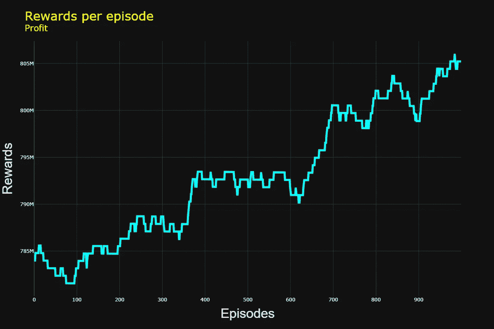
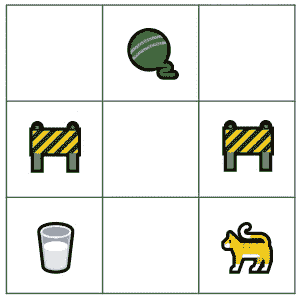
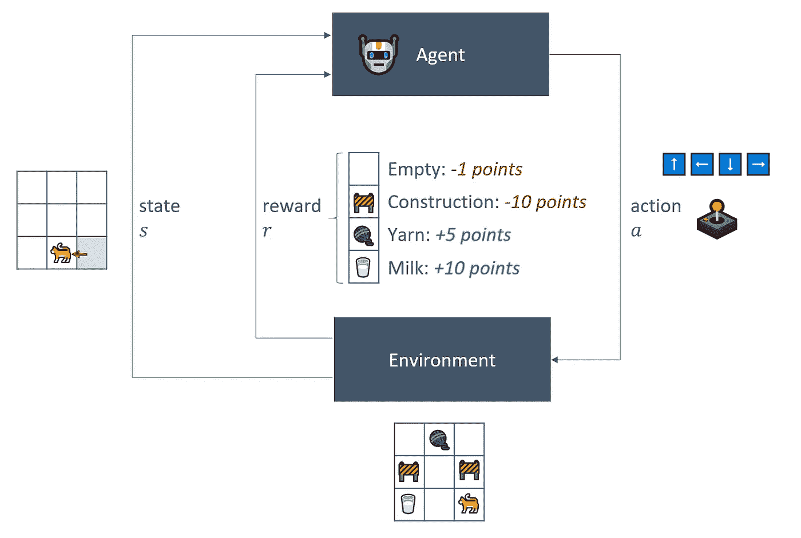
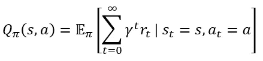
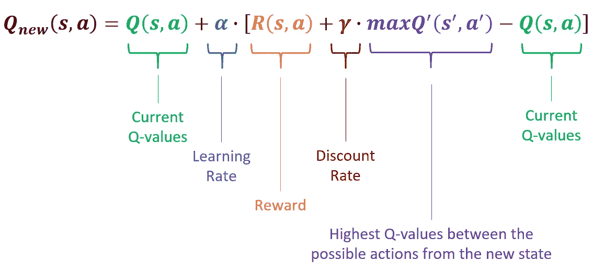
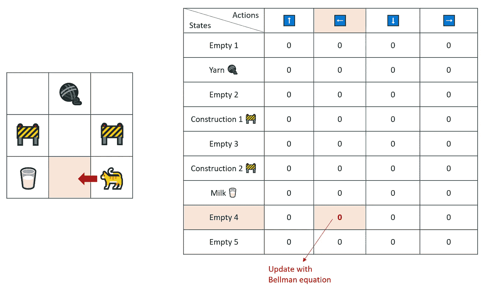
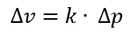
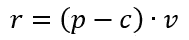

# 从头开始的动态定价与强化学习：Q-Learning

> 原文：[`towardsdatascience.com/dynamic-pricing-with-reinforcement-learning-from-scratch-q-learning-fb3fb764da49`](https://towardsdatascience.com/dynamic-pricing-with-reinforcement-learning-from-scratch-q-learning-fb3fb764da49)

## 介绍 Q-Learning 并附带实际的 Python 示例

[](https://nicolo-albanese.medium.com/?source=post_page-----fb3fb764da49--------------------------------)[](https://towardsdatascience.com/?source=post_page-----fb3fb764da49--------------------------------) [Nicolo Cosimo Albanese](https://nicolo-albanese.medium.com/?source=post_page-----fb3fb764da49--------------------------------)

·发布于 [Towards Data Science](https://towardsdatascience.com/?source=post_page-----fb3fb764da49--------------------------------) ·12 分钟阅读·2023 年 8 月 26 日

--



探索价格以寻找最佳的行动-状态值来最大化利润。图片由作者提供。

# 目录

1.  介绍

1.  强化学习概述

    2.1 关键概念

    2.2 Q-函数

    2.3 Q-值

    2.4 Q-Learning

    2.5 贝尔曼方程

    2.6 探索与利用

    2.7 Q-表

1.  动态定价问题

    3.1 问题陈述

    3.2 实现

1.  结论

1.  参考文献

# 1\. 介绍

在这篇文章中，我们介绍了强化学习的核心概念，并深入探讨 Q-Learning，一种使智能代理通过基于奖励和经验做出明智决策来学习最佳策略的方法。

我们还分享了一个从零开始构建的实际 Python 示例。特别是，我们训练一个代理掌握定价艺术，这是商业中的一个关键方面，以便它可以学习如何最大化利润。

话不多说，让我们开始我们的旅程吧。

# 2\. 强化学习概述

## 2.1 关键概念

强化学习（RL）是机器学习的一个领域，其中代理通过试错来学习完成任务。

简而言之，代理尝试与正面或负面反馈相关的动作，通过奖励机制来调整其行为，以最大化奖励，从而学习实现最终目标的最佳行动路径。

让我们通过一个实际的例子介绍强化学习（RL）的关键概念。想象一个简化的街机游戏，在这个游戏中，一只猫需要穿越迷宫来收集宝物——一杯牛奶和一团毛线——同时避免施工现场：



图片由作者提供。

1.  **代理** 是选择行动路径的个体。在这个例子中，代理是控制操纵杆决定猫的下一步动作的玩家。

1.  **环境** 是代理操作的背景。在我们的例子中，是一个二维迷宫。

1.  **行动** `a` 是从一个状态移动到另一个状态所需的最小步数。在这个游戏中，玩家有有限的可能行动可供选择：*上*、*左*、*下* 和 *右*。

1.  **状态** `s` 表示玩家和环境的当前情况。它包括猫的当前和允许的位置、宝藏和陷阱的位置，以及游戏状态的其他相关特征（分数、剩余生命等）。

1.  **奖励** `r` 代表分配给采取某个行动结果的反馈。例如，游戏可能分配：

    • 奖励 +5 分，当到达毛线球时，

    • 奖励 +10 分，针对牛奶杯，

    • 惩罚 -1 分，针对空白单元格，

    • 惩罚 -10 分，针对建造。

描述的 RL 框架在下图中显示：



RL 框架。图像由作者提供。

我们的目标是学习一个 **策略** `π`，即一套规则，使代理能够在最大化奖励的同时遵循行动路径，从而实现目标。

我们可以直接学习最优策略 `π*`，或通过学习行动-状态对的值（奖励）间接学习，并利用它们决定最佳行动路径。这两种策略分别被称为 **基于策略** 和 **基于价值**。现在让我们介绍 Q 学习，一种流行的基于价值的方法。

## 2.2 Q 函数

我们介绍 **Q 函数**，表示为 `Q(s,a)`，代表代理在状态 `s` 中采取行动 `a` 时，遵循策略 `π` 所能获得的期望累积奖励：



Q 函数。图像由作者提供。

在方程中：

+   `π` 是代理遵循的策略。

+   `s` 是当前状态。

+   `a` 是在该状态下采取的行动。

+   `r` 是与给定行动和状态相关的奖励。

+   `t` 代表当前迭代。

+   `γ` 是 **折扣因子**。它代表代理对即时奖励（利用）相对于延迟奖励（探索）的偏好。

## 2.3 Q 值

**Q 值** 指 Q 函数分配给特定状态-行动对的数值。在我们的例子中，Q 值提供了玩家通过在迷宫中通过特定行动移动猫到新位置，起始于某个状态时，可能获得的期望累积奖励。**简言之，它告诉我们玩家的选择有多“好”**。

## 2.4 Q 学习

鉴于 Q 值的概念，**Q 学习** 算法的工作原理如下：

1.  **初始化 Q 值** 任意，例如 `Q(s, a) = 0 ∀ s ∈ S, a ∈ A`。

1.  对于每个回合：

    1. 初始化状态 `s`

    对于每个步骤：

    1. **选择行动** `a`，观察奖励 `r`，获得新状态 `s'`

    2. 更新 Q 值使用**Bellman 方程** 3. `s ← s'`

1.  直到`s`是终止状态。

## 2.5 Bellman 方程

Bellman 方程允许代理用累积期望奖励的值来表示状态-动作对的价值。它用于在 Q 学习算法中更新 Q 值，如下所示：



Bellman 方程。图片由作者提供。

在之前的表达式中：

+   **学习率**`α`（介于 0 和 1 之间）决定了代理基于新经验更新 Q 值的程度。

+   **折扣率**`γ`（介于 0 和 1 之间）影响代理对即时奖励与未来奖励的偏好。较高的`γ`可以促进利用，因为代理会倾向于偏好已知的、带来即时收益的动作。

## 2.6 探索与利用

代理如何选择下一个动作？

代理可以“探索”新的动作，或“利用”已知与更高奖励相关的动作。

为了学习有效的策略，我们应该在训练过程中在探索和利用之间取得平衡。在我们的例子中，我们可以通过定义一个探索概率，即介于 0 和 1 之间的浮点数，来采用一种简单的方法：

+   如果从(0, 1)的均匀分布中生成的随机数**高于**探索概率，代理将执行**利用**，偏好已知的、高奖励的动作。

+   如果数字**小于**探索概率，代理将执行**探索**，鼓励尝试新的动作。

这种方法称为**epsilon-greedy**算法（参见[Cheng et Al. 2023, 附录 C](https://arxiv.org/pdf/2302.06953.pdf)）。

## 2.7 Q-表

当问题涉及有限数量的潜在动作时——例如*向上*、*向左*、*向下*和*向上*，可以简单地**列举**所有状态和动作的组合。这个表格，称为**Q-表**，在训练过程中会填充 Q 值，因为代理探索状态和动作对，并收集它们的相关奖励。在我们的例子中：



更新 Q-表。图片由作者提供。

# 3. 动态定价问题

给定一个与价格和需求相关的产品，我们的目标是训练一个智能代理，利用强化学习，随着时间的推移调整价格以最大化利润：

“*动态定价与对易腐资源的价格固定相关，考虑需求以最大化收入或利润*”（[Fleischmann, Hall, Pyke, 2004](https://papers.ssrn.com/sol3/papers.cfm?abstract_id=845826)）。

## 3.1 问题陈述

+   我们对一个简化的环境进行建模，该环境具有离散的**动作**空间`A`，其中代理可以增加、减少或保持价格不变：`A = {+1, -1, 0}`。

+   动作（价格操控）会导致新的需求，我们将离散的需求水平创建为**状态**`S = {低需求, 中需求, 高需求}`。

+   为了从价格变化（动作 `a`）中估算新的需求（状态 `s`），我们利用了价格弹性 `k` 的概念。价格弹性估计价格 `Δp` 变化与其导致的需求 `Δv` 变化之间的敏感度，我们假设在我们的例子中这是已知的：



图像来源于作者。

+   奖励 `r` 对应于**利润**，它源于价格 `p` 的应用及其相应的需求 `v`，并考虑到与产品相关的单位成本 `c`：



奖励 `r` 是动作（价格 `p`）和状态（需求 `v`）的函数。图像来源于作者。

+   当新价格与初始价格相比增加或减少过多时，我们会根据一个任意阈值分配负奖励。这样，我们惩罚价格的强烈波动。

## 3.2 实现

`DynamicPricingQL` 类实现了以下方法：

+   `calculate_demand_level` 将离散状态值（低、 中或高需求）分配给连续的需求量。

+   `calculate_demand` 使用输入价格通过价格弹性来估算需求量。

+   `fit` 训练代理。我们决定在达到最大步数时或利润（奖励）达到某个阈值时中断一个回合。

+   `get_q_table` 返回代理学习到的 Q-Table。

+   `plot_rewards` 显示了训练过程中获得的奖励图表。

+   `predict` 使用 Q 值来预测给定起始价格和需求作为输入的最佳价格。

```py
import numpy as np
from typing import Union
import plotly.express as px

class DynamicPricingQL:
    def __init__(self, 
                 initial_price: int = 1000, 
                 initial_demand: int = 1000000,
                 elasticity: float = -0.01,
                 cost_per_unit: int = 20, 
                 learning_rate: float = 0.1, 
                 discount_factor: float = 0.9, 
                 exploration_prob: float = 0.2, 
                 error_term: float = 0.2, 
                 random_walk_std: float = 0.5, 
                 target_reward_increase: float = 0.2) -> None:
        '''Class that implements a Dynamic Pricing agent using 
        Q-Learning to find the optimal price for a given product.

        Args:
            - initial_price: starting price of the product
            - initial_demand: starting volume of the product
            - elasticity: price elasticity of the product
            - cost_per_unit: unitary cost of the product
            - learning_rate: learning rate for the Bellman equation
            - exploration_prob: control the exploration-explotation trade-off
            - error_term: error term added to the reward estimate to account for fluctuations
            - random_walk_std: control the random walk fluctuations added to the demand estimate
            - target_reward_increase: end the training when the reward reaches this target increase 
        '''
        # Init variables
        self.learning_rate = learning_rate
        self.discount_factor = discount_factor
        self.exploration_prob = exploration_prob
        self.initial_price = initial_price
        self.cost_per_unit = cost_per_unit
        self.elasticity = elasticity
        self.error_term = error_term
        self.random_walk_std = random_walk_std
        self.initial_demand = initial_demand
        self.target_reward_increase = target_reward_increase
        self.current_price = initial_price
        self.current_demand = initial_demand

        # Estimate current demand level from the initial demand
        self.current_demand_level = self.calculate_demand_level(
            self.initial_demand)

        # Track whether the training procedure occurred or not
        self.isfit = False

        # The agent can only perform 3 actions: 
        #   - Increase the price
        #   - Decrease the price
        #   - Keep the price constant
        self.num_actions = 3

        # Consider 3 different states as discrete demand level
        self.num_demand_levels = 3

        # Initialize Q-values
        self.q_values = np.zeros((self.num_demand_levels, 
                                  self.num_actions))

        # Store rewards per episode for plotting
        self.episode_rewards = []

    def calculate_demand_level(self, 
                               demand: int, 
                               demand_fraction: float = 0.3) -> int:
        '''Estimate the demand level.
        Demand levels represent the states of the Q-Learning agent.
        In order to turn a continuous demand into a discrete set in three values,
        we use a fraction of the initial value to estimate a low, medium or high demand level.

        Args:
            - demand: current demand for the product
            - demand_fraction: fraction of demand controlling the assignment to the demand levels
        '''
        # Low demand level: 0
        if demand < (1 - demand_fraction) * self.initial_demand:
            return 0
        # High demand level: 2
        elif demand > (1 + demand_fraction) * self.initial_demand:
            return 2
        # Medium demand level: 1
        else:
            return 1

    def calculate_reward(self, 
                         new_price: int,
                         price_fraction: float = 0.2) -> float:
        '''Calculate the reward.
        The reward during an episode is the profit 
        under a certain price (action) and demand.
        We add an error term to account for fluctuations.

        Note: if the price is either too high or too low
        with respect to the initial price, we assign a negative reward.

        Args:
            - new_price: new price of the product
            - price_fraction: penalize price variations above or below this fraction
        '''

        # If the new price is more distant from the initial price
        # than a certain value given by price_fraction
        # then assign a negative reward to penalize high price changes 
        if new_price > self.initial_price * (1 + price_fraction)\
            or new_price < self.initial_price * (1 - price_fraction):

            # Negative reward to penalize significant price changes
            return -1 

        else:

            # Estimate the demand given the new price
            demand = self.calculate_demand(new_price)

            # Etimate profit given new price and demand
            profit = (new_price - self.cost_per_unit) *\
                      demand *\
                      (1 - self.error_term)

            # Return profit as reward for the agent
            return profit

    def calculate_demand(self, 
                         price: int) -> int:
        '''Calculate demand as: 
              current demand + delta(demand) + random walk fluctuation = 
              current demand + elasticity * (price - current price) + random walk fluctuation

        Args:
            - price: price of the product
        '''
        return np.floor(self.current_demand + \
                self.elasticity * (price - self.current_price) +\
                np.random.normal(0, self.random_walk_std))

    def fit(self,
            num_episodes: int = 1000,
            max_steps_per_episode: int = 100) -> None:
        '''Fit the agent for a num_episodes number of episodes.

        Args:
            - num_episodes: number of episodes
            - max_steps_per_episode: max number of steps for each episode
        '''
        # For each episode
        for episode in range(num_episodes):

            # The state is the current demand level 
            state = self.current_demand_level

            # To interrupt the training procedure
            done = False

            # The reward is zero at the beginning of the episode
            episode_reward = 0

            # Keep track of the training steps
            step = 0

            # Training loop
            while not done:

                # Depending on the exploration probability
                if np.random.rand() < self.exploration_prob:

                    # Explore a new price ...
                    action = np.random.randint(self.num_actions)

                else:

                    # ... or exploit prices known to increase the reward
                    action = np.argmax(self.q_values[state])

                # Set the new price given the action (increase, decrease or leave the price as is)
                new_price = self.current_price + action - 1

                # Calculate the new demand and demand level
                new_demand = self.calculate_demand(new_price)
                new_demand_level = self.calculate_demand_level(new_demand)

                # Estimate the reward (profit) under the current action
                reward = self.calculate_reward(new_price)

                # Save the reward
                episode_reward += reward

                # Bellman equation for the Q values
                self.q_values[state, action] = self.q_values[state, action] + \
                  self.learning_rate * \
                  (reward + self.discount_factor * np.max(self.q_values[new_demand_level]) -\
                  self.q_values[state, action])

                # Update price and demand for the next iteration
                self.current_price = new_price
                self.current_demand = new_demand
                self.current_demand_level = new_demand_level

                # Update the step counter
                step += 1

                # Exit the loop if the max number of steps was reached
                # or if the reward increased more than a certain threshold
                if step >= max_steps_per_episode or episode_reward >= self.target_reward_increase:
                    done = True

            # Save the training results for plotting
            self.episode_rewards.append(episode_reward)

        # Acknowledge the accomplishment of the training procedure
        self.isfit = True

        print("Training completed.")

    def get_q_table(self) -> np.ndarray:
        '''Return the Q table'''
        return self.q_values

    def plot_rewards(self, width=1200, height=800) -> None:
        '''Plot the cumulative rewards per episode using Plotly.

        Args:
            - width: width of the plot
            - height: height of the plot
        '''

        # Plot rewards per episode
        fig = px.line(
            self.episode_rewards, 
            title = "Rewards per episode <br><sup>Profit</sup>",
            labels = dict(index="Episodes", value="Rewards"),
            template = "plotly_dark",
            width = width, 
            height = height)

        # Style colors, font family and size 
        fig.update_xaxes(
            title_font = dict(size=32, family="Arial"))
        fig.update_yaxes(
            title_font = dict(size=32, family="Arial"))
        fig.update_layout(
            showlegend = False,
            title = dict(font=dict(size=30)),
            title_font_color = "yellow")
        fig.update_traces(
            line_color = "cyan", 
            line_width = 5)

        # Show the plot
        fig.show()

    def predict(self, 
                input_price: int, 
                input_demand: int) -> Union[int, str]:
        '''Predict the next price given an input price and demand.

        Args:
            - input_price: input price of the product
            - input_demand: input demand of the product
        '''
        # If the model was fit
        if self.isfit:

            # State equals the current demand level 
            state = self.calculate_demand_level(input_demand)

            # Identify the most profitable action from the Q values
            action = np.argmax(self.q_values[state])

            # The next price is given by the most profitable action
            prediction = input_price + action - 1

            # Return the predicted price
            return prediction

        # If the model was not fit
        else:
            return "Fit the model before asking a prediction for the next price."
```

让我们实例化并拟合代理：

```py
# For reproducibility
np.random.seed(62)

# Instantiate the agent class
pricing_agent = DynamicPricingQL(
    initial_price = 1000,
    initial_demand = 1000000,
    elasticity = -0.02,
    cost_per_unit = 20)

# Fit the agent
pricing_agent.fit(num_episodes=1000)
```

```py
Training completed.
```

训练后可以获得 Q-Table：

```py
pricing_agent.get_q_table()
```

```py
array([[0.00000000e+00, 0.00000000e+00, 0.00000000e+00],
       [7.92000766e+09, 8.01708509e+09, 7.98798684e+09],
       [0.00000000e+00, 0.00000000e+00, 0.00000000e+00]])
```

我们还可以绘制奖励图：

```py
pricing_agent.plot_rewards()
```


代码片段的输出。图像来源于作者。

我们观察到奖励在训练过程中增加，因为代理通过 Q 值学习了导致利润增加的定价策略。

我们可以通过训练好的代理使用 Q 值来预测下一个价格：

```py
input_price = 500
input_demand = 10000

next_price = pricing_agent.predict(input_price, input_demand)
print(f"Next Price: {next_price}")
```

```py
Next Price: 499
```

# 4. 结论

在这篇文章中，我们探讨了强化学习的关键概念，并介绍了用于训练智能代理的 Q 学习方法。我们还提供了一个从头开始构建的实际 Python 示例。特别地，我们实现了一个动态定价代理，该代理学习了产品的最佳定价策略，以最大化利润。

我们的例子是简化版的。我们旨在从头到尾分享一个功能全面的说明。对于实际应用，我们应考虑以下几点：

1.  Q 学习需要离散的动作空间，这意味着连续动作必须被离散化为有限的值集合。因此，我们将价格操作转换为离散的动作集合 `A = {+1, -1, 0}`。实际上，定价决策可能更加复杂和连续。

1.  状态应捕捉有关环境的相关信息，以帮助智能体做出决策。虽然离散需求水平提供了简单直观的状态表示，但在实际应用中，这种选择可能会显得有限。相反，状态应包含对环境（业务场景）相关的任何特征。例如，在一个关于电子商务平台动态定价的研究中，[Liu 等人（2021）](https://arxiv.org/pdf/1912.02572.pdf) 提出了由四类特征构成的状态表示：

    - 价格特征

    - 销售特征

    - 顾客流量特征

    - 竞争力特征。

# 5\. 参考文献

+   [Watkins, 1989](https://www.cs.rhul.ac.uk/~chrisw/new_thesis.pdf)

+   [Watkins 和 Dayan, 1992](https://link.springer.com/article/10.1007/BF00992698)

+   [Sutton 和 Barto, 2018](http://incompleteideas.net/book/RLbook2020.pdf)

+   [Fleischmann, Hall, Pyke, 2004](https://papers.ssrn.com/sol3/papers.cfm?abstract_id=845826)

+   [Cheng 等人, 2023](https://arxiv.org/pdf/2302.06953.pdf)

+   [Liu 等人（2021）](https://arxiv.org/pdf/1912.02572.pdf)
