# 地球并非平坦，你的 Voronoi 图也不应该是

> 原文：[`towardsdatascience.com/earth-isnt-flat-and-neither-should-your-voronoi-diagrams-be-25137e0a073b?source=collection_archive---------9-----------------------#2023-12-12`](https://towardsdatascience.com/earth-isnt-flat-and-neither-should-your-voronoi-diagrams-be-25137e0a073b?source=collection_archive---------9-----------------------#2023-12-12)

## *一个关于精确度的故事，揭示了使用 Python 绘制球面地理 Voronoi 图的强大功能*

[](https://raczeq.medium.com/?source=post_page-----25137e0a073b--------------------------------)[](https://towardsdatascience.com/?source=post_page-----25137e0a073b--------------------------------) [Kamil Raczycki](https://raczeq.medium.com/?source=post_page-----25137e0a073b--------------------------------)

·

[关注](https://medium.com/m/signin?actionUrl=https%3A%2F%2Fmedium.com%2F_%2Fsubscribe%2Fuser%2Fd6016d9c4a93&operation=register&redirect=https%3A%2F%2Ftowardsdatascience.com%2Fearth-isnt-flat-and-neither-should-your-voronoi-diagrams-be-25137e0a073b&user=Kamil+Raczycki&userId=d6016d9c4a93&source=post_page-d6016d9c4a93----25137e0a073b---------------------post_header-----------) 发表在 [Towards Data Science](https://towardsdatascience.com/?source=post_page-----25137e0a073b--------------------------------) ·7 分钟阅读·2023 年 12 月 12 日[](https://medium.com/m/signin?actionUrl=https%3A%2F%2Fmedium.com%2F_%2Fvote%2Ftowards-data-science%2F25137e0a073b&operation=register&redirect=https%3A%2F%2Ftowardsdatascience.com%2Fearth-isnt-flat-and-neither-should-your-voronoi-diagrams-be-25137e0a073b&user=Kamil+Raczycki&userId=d6016d9c4a93&source=-----25137e0a073b---------------------clap_footer-----------)

--

[](https://medium.com/m/signin?actionUrl=https%3A%2F%2Fmedium.com%2F_%2Fbookmark%2Fp%2F25137e0a073b&operation=register&redirect=https%3A%2F%2Ftowardsdatascience.com%2Fearth-isnt-flat-and-neither-should-your-voronoi-diagrams-be-25137e0a073b&source=-----25137e0a073b---------------------bookmark_footer-----------)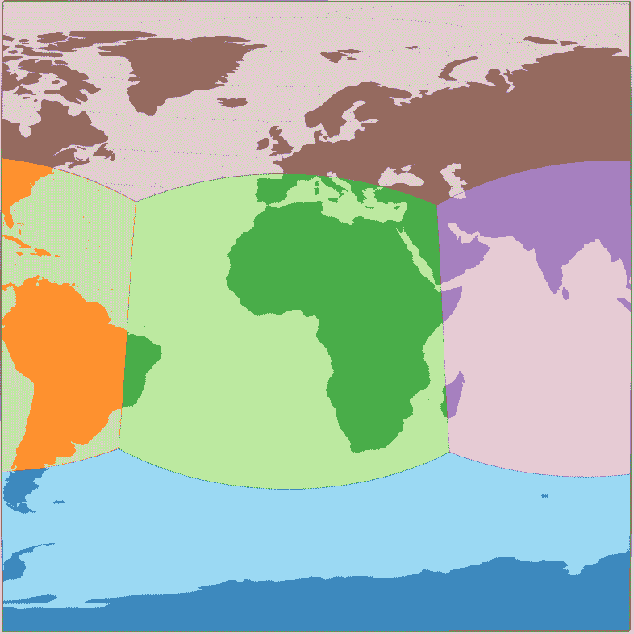

地球上的球面 Voronoi 图在两个投影之间移动：正交投影和等距投影。由作者使用 D3.js 库生成。

你可能对 Voronoi 图及其在地理空间分析中的应用有所了解。如果不了解，这里有一个简短的 TL;DR：它将平面划分为多个区域，每个区域包含所有比其他任何点更接近给定种子的点。它以数学家 Georgy Voronoy 的名字命名。你可以在[维基百科](https://en.wikipedia.org/wiki/Voronoi_diagram)上阅读更多内容。

这在地理空间领域有什么应用？使用 Voronoi 图，你可以快速找到某个城市居民最近的公共交通站点，比单独为每栋建筑计算要快得多。或者你也可以用它来进行不同品牌之间的市场份额分析。

在这篇文章中，我想展示计算的典型 Voronoi 图与球面 Voronoi 图之间的差异，并希望展示后者的优越性。

# 尺寸和投影——为什么这很重要？

如果我们想在地图上查看数据，我们必须处理投影。要在 2D 平面上显示内容，我们必须将坐标从地球上的 3D 坐标投影到 2D 平面上。

我们都知道并使用的最流行的投影是墨卡托投影（[Web Mercator](https://en.wikipedia.org/wiki/Web_Mercator_projection) 或更准确地说是 WGS84 墨卡托，因为大多数地图提供者都使用它），而最流行的坐标系统是世界大地测量系统 1984 — WGS84（或 [EPSG:4326](https://epsg.io/4326)）。这个系统基于经纬度，范围从经度 -180° 到 180°（从西到东），纬度从 -90° 到 90°（从南到北）。

每种投影到 2D 平面上都有一些失真。墨卡托是一种 *保角* 地图投影，这意味着地球上物体之间的角度应该被保留。纬度越高（或低于 0°），区域的失真和 **距离** 越大。由于 Voronoi 图 heavily 依赖于种子之间的距离，因此在生成图时也会传递相同的失真误差。

地球是一个不规则的椭球体，但为了我们的目的，它可以用球体形状来近似。通过在球体上生成 Voronoi 图，我们可以根据球体表面的弧线准确计算距离。随后，我们可以将生成的球面多边形映射到投影的 2D 坐标上，我们可以确定，分隔两个相邻 Voronoi 单元的线将垂直于连接定义这些单元的两个种子的线。

下面你可以看到我上面描述的角度和距离问题。尽管这些线在同一点交叉，Voronoi 单元的形状和角度却有所不同。

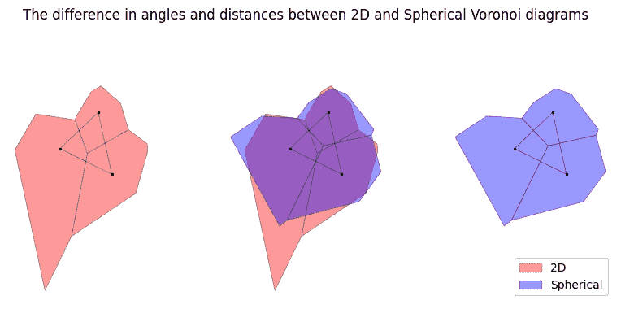

下面是 Voronoi 图中角度和距离差异的示例。图像由作者提供。

另一个问题是，如果你使用 2D Voronoi 图，你不能比较世界上不同部分的区域（即不在同一纬度上），因为这些区域会严重失真。

> 完整的 Jupyter Notebook 和下面示例中使用的代码可以在 [GitHub](https://github.com/RaczeQ/medium-articles/blob/main/articles/spherical-geovoronoi/code.ipynb) 上找到。这里为了简洁跳过了一些函数。

# 前提条件

安装所需的库

```py
pip install -q srai[voronoi,osm,plotting] geodatasets
```

导入所需的模块和函数

```py
import geodatasets
import geopandas as gpd
import matplotlib.pyplot as plt
import plotly.express as px

from shapely.geometry import MultiPoint, Point
from shapely.ops import voronoi_diagram

from srai.regionalizers import VoronoiRegionalizer, geocode_to_region_gdf
```

# 第一个示例

让我们在地球上定义六个点：北极和南极，以及赤道上的四个点。

```py
earth_points_gdf = gpd.GeoDataFrame(
    geometry=[
        Point(0, 0),
        Point(90, 0),
        Point(180, 0),
        Point(-90, 0),
        Point(0, 90),
        Point(0, -90),
    ],
    index=[1, 2, 3, 4, 5, 6],
    crs="EPSG:4326",
)
```

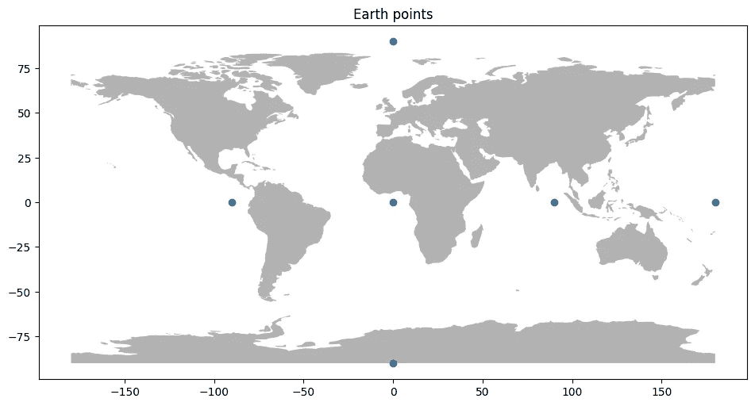

图片由作者提供。

使用`[voronoi_diagram](https://shapely.readthedocs.io/en/stable/manual.html#voronoi-diagram)`从`Shapely`库生成 Voronoi 图。

```py
def generate_flat_voronoi_diagram_regions(
    seeds_gdf: gpd.GeoDataFrame,
) -> gpd.GeoDataFrame:
    points = MultiPoint(seeds_gdf.geometry.values)

    # Generate 2D diagram
    regions = voronoi_diagram(points)

    # Map geometries to GeoDataFrame
    flat_voronoi_regions = gpd.GeoDataFrame(
        geometry=list(regions.geoms),
        crs="EPSG:4326",
    )
    # Apply indexes from the seeds dataframe
    flat_voronoi_regions.index = gpd.pd.Index(
        flat_voronoi_regions.sjoin(seeds_gdf)["index_right"],
        name="region_id",
    )

    # Clip to Earth boundaries
    flat_voronoi_regions.geometry = flat_voronoi_regions.geometry.clip_by_rect(
        xmin=-180, ymin=-90, xmax=180, ymax=90
    )
    return flat_voronoi_regions
```

```py
earth_poles_flat_voronoi_regions = generate_flat_voronoi_diagram_regions(
    earth_points_gdf
)
```

使用`[VoronoiRegionalizer](https://kraina-ai.github.io/srai/latest/examples/regionalizers/voronoi_regionalizer/)`从`srai`库生成 Voronoi 图。

在底层，它使用了`[SphericalVoronoi](https://docs.scipy.org/doc/scipy/reference/generated/scipy.spatial.SphericalVoronoi.html)`实现，来自`scipy`库，并正确地将 WGS84 坐标转换到球面坐标系统。

```py
earth_points_spherical_voronoi_regions = VoronoiRegionalizer(
    seeds=earth_points_gdf
).transform()
```

让我们查看两个图中的差异。

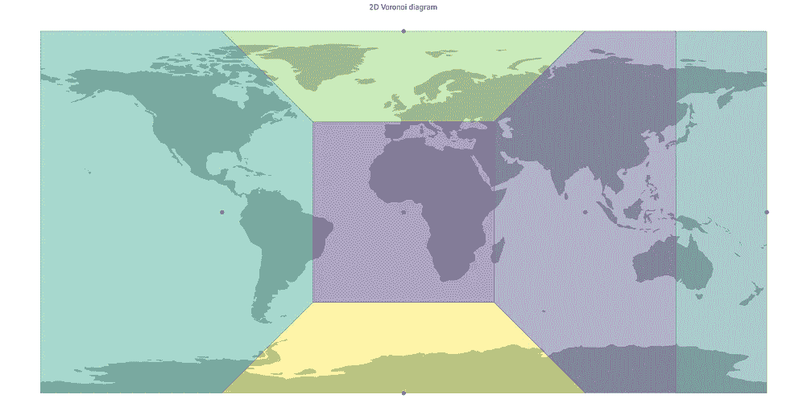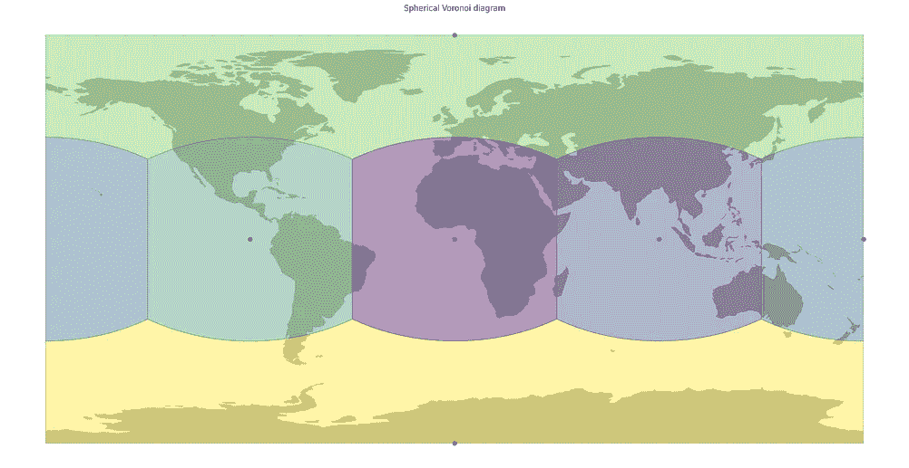

WGS84 坐标系中平面（左）和球面（右）版本的 Voronoi 图。由作者使用 GeoPandas 库生成。

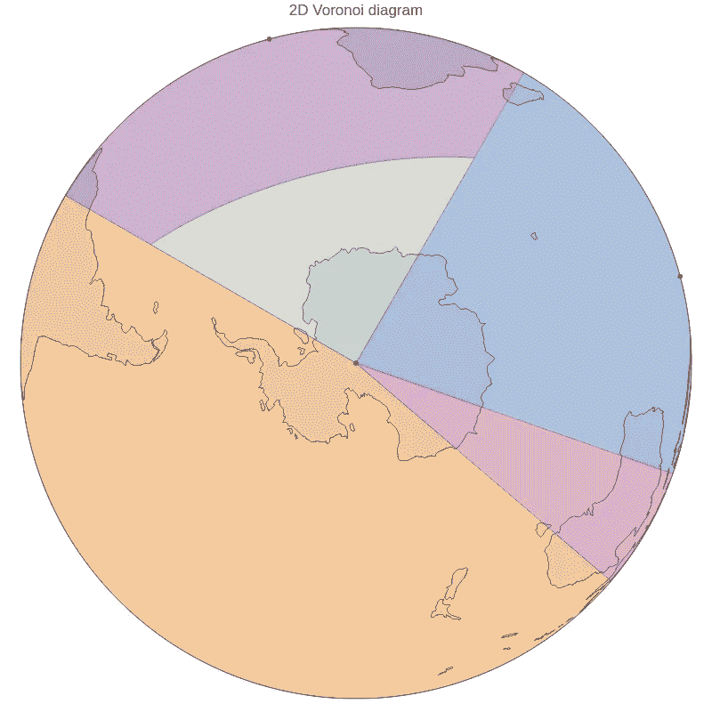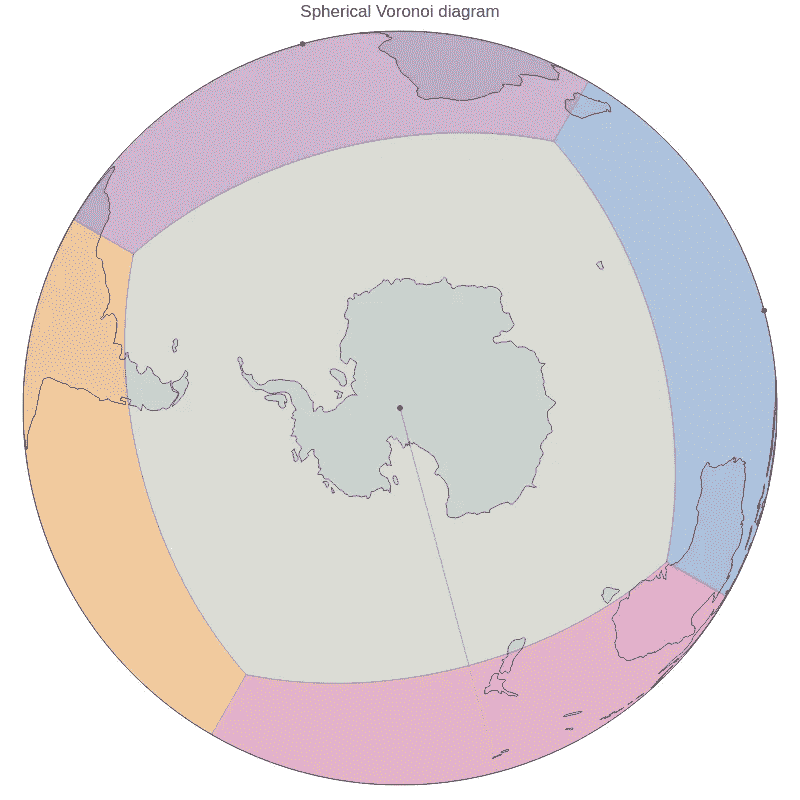

WGS84 坐标系中平面（左）和球面（右）版本的 Voronoi 图在正交投影下的差异。由作者使用 Plotly 生成。

首先可以看到的是，2D Voronoi 图不会绕地球回环，因为它在平面[笛卡尔坐标系](https://en.wikipedia.org/wiki/Cartesian_coordinate_system)上工作。球面 Voronoi 图正确覆盖了地球，不会在[*反子午线*](https://en.wikipedia.org/wiki/180th_meridian)（经度从 180°切换到-180°的地方）断裂。

为了定量测量差异，我们可以计算**IoU**（交并比）指标（或[*Jaccard Index*](https://en.wikipedia.org/wiki/Jaccard_index)）来衡量多边形形状之间的差异。该指标的值在 0 到 1 之间，0 表示没有重叠，1 表示完全重叠。

```py
def calculate_iou(
    flat_regions: gpd.GeoDataFrame, spherical_regions: gpd.GeoDataFrame
) -> float:
    total_intersections_area = 0
    total_unions_area = 0

    # Iterate all regions
    for index in spherical_regions.index:
        # Find matching spherical and flat Voronoi region
        spherical_region_geometry = spherical_regions.loc[index].geometry
        flat_region_geometry = flat_regions.loc[index].geometry

        # Calculate their intersection area
        intersections_area = spherical_region_geometry.intersection(
            flat_region_geometry
        ).area
        # Calculate their union area
        # Alternative code:
        # spherical_region_geometry.union(flat_region_geometry).area
        unions_area = (
            spherical_region_geometry.area
            + flat_region_geometry.area
            - intersections_area
        )

        # Add to the total sums
        total_intersections_area += intersections_area
        total_unions_area += unions_area

    # Divide the intersection area by the union area
    return round(total_intersections_area / total_unions_area, 3)
```

```py
calculate_iou(
    earth_points_flat_voronoi_regions, earth_points_spherical_voronoi_regions
)
```

计算出的值为**0.423**，这相当低，在大规模上，这些多边形彼此不同，这在上面的图中可以很容易看到。

# 实际数据示例：使用 AED（自动体外除颤器）位置划分地球。

本示例中使用的数据来自[OpenAEDMap](https://openaedmap.org/)，基于[OpenStreetMap](https://www.openstreetmap.org/)数据。准备好的文件过滤了位置（准确为 80694 个），去除了定义在同一位置上的重复节点。

```py
# Load AEDs positions to GeoDataFrame
aed_world_gdf = gpd.read_file(
    "https://raw.githubusercontent.com/RaczeQ/medium-articles/main/articles/spherical-geovoronoi/aed_world.geojson"
)
```

为 AED 生成 Voronoi 图。

```py
aed_flat_voronoi_regions = generate_flat_voronoi_diagram_regions(aed_world_gdf)

aed_spherical_voronoi_regions = VoronoiRegionalizer(
    seeds=aed_world_gdf, max_meters_between_points=1_000
).transform()
```

让我们比较这些 Voronoi 图。

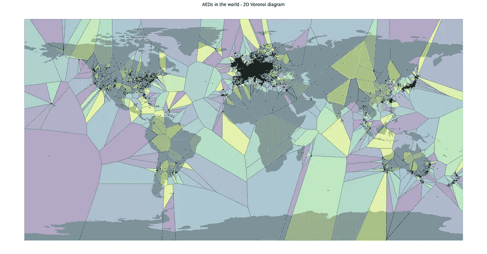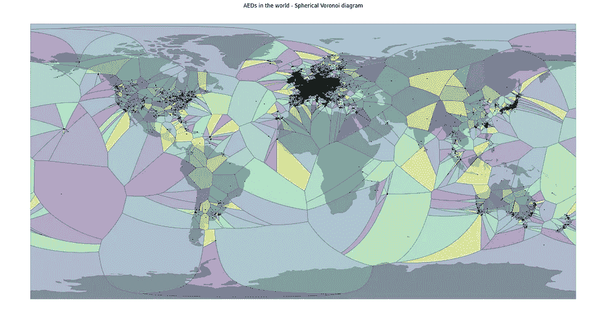

WGS84 坐标系中平面（左）和球面（右）版本的 Voronoi 图的差异。由作者使用 GeoPandas 生成。

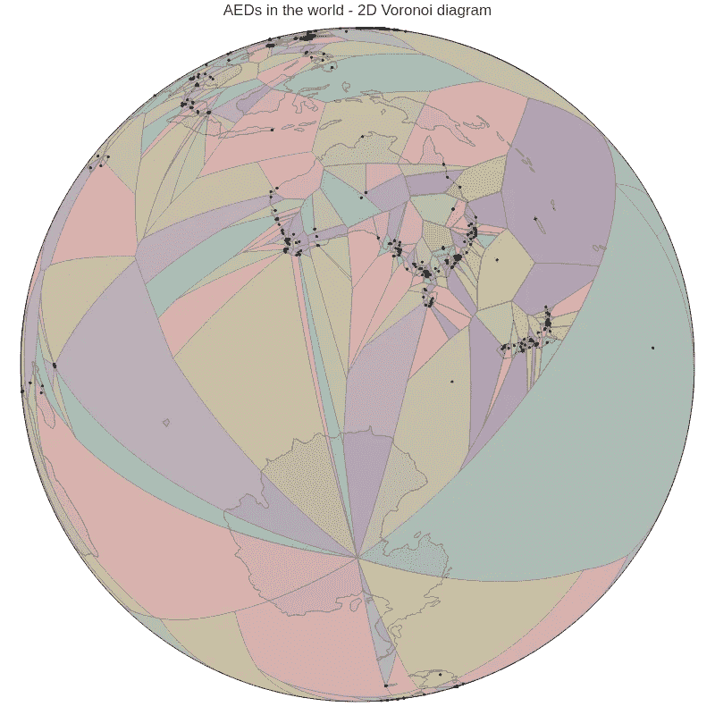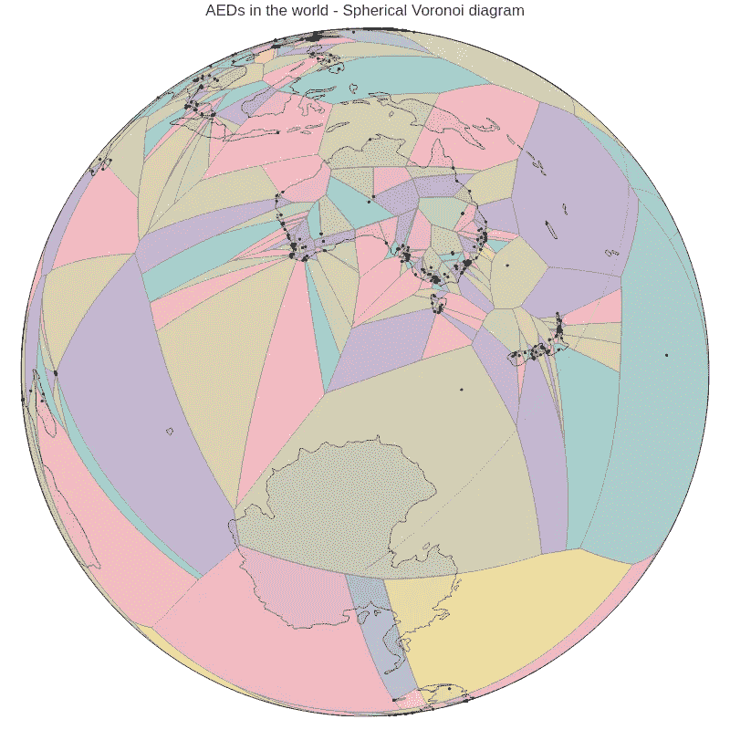

平面（左）和球面（右）版本的 Voronoi 图在正交投影中的差异。由作者使用 Plotly 生成。

观察图表时，差异非常明显。2D 版本中的所有边界都是直的，而球面版本在 WGS84 坐标系中看起来相当弯曲。你还可以清楚地看到，在平面版本中，很多区域汇聚在极地（正交投影侧重于南极），而球面版本没有。另一个明显的区别是反经线周围的连续性，这在第一个示例中已经提到。从新西兰出现的区域在平面版本中被急剧切割。

让我们看看 IoU 值：

```py
calculate_iou(aed_flat_voronoi_regions, aed_spherical_voronoi_regions)
```

计算值为**0.511**，比第一个示例稍好，但多边形大约匹配 50%。

## 缩放到城市规模

让我们在较小的尺度上看看差异。我们可以选择所有位于伦敦的 AED 并绘制它们。

```py
greater_london_area = geocode_to_region_gdf("Greater London")
aeds_in_london = aed_world_gdf.sjoin(greater_london_area)
```

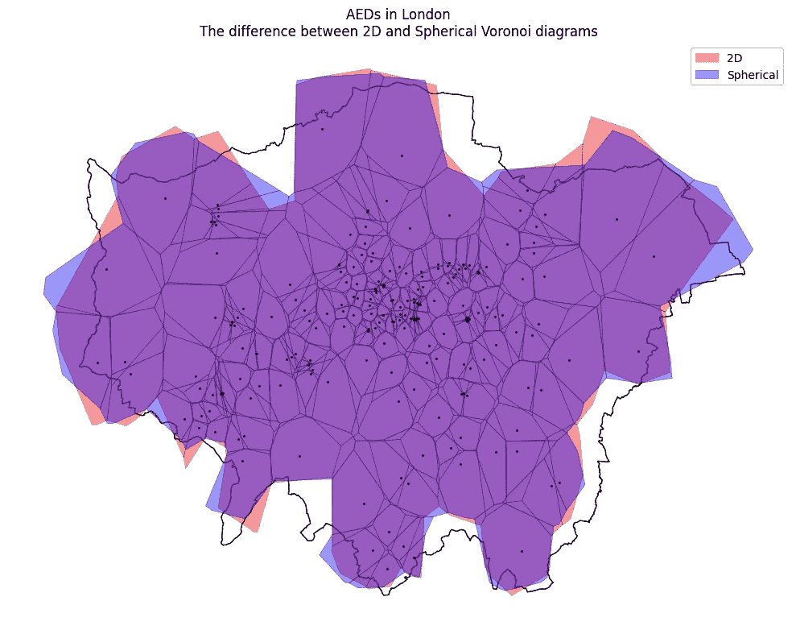

2D 和球面 Voronoi 图以红色和蓝色叠加在一起。图片由作者提供。

```py
calculate_iou(
    aed_flat_voronoi_regions.loc[aeds_in_london.index],
    aed_spherical_voronoi_regions.loc[aeds_in_london.index],
)
```

值为**0.675**。虽然有所改善，但仍然存在明显差异。由于 AED 的布置更加密集，形状和距离变小，因此在投影的 2D 平面和球面上计算的 Voronoi 图之间的差异减小。

让我们看一些叠加在一起的个别示例。

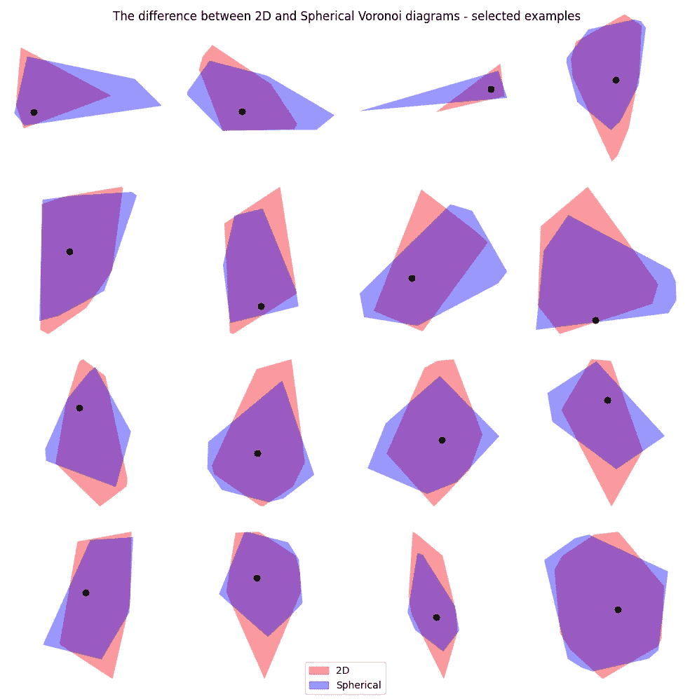

图片由作者提供。

这些多边形的区域大致匹配，但你可以看到角度和形状的差异。这些差异可能在空间分析中很重要，并可能改变结果。关注区域越大，差异就越明显。

# 总结

我希望你现在能看到为什么球面 Voronoi 图比平面 Voronoi 图更适合在地理空间领域中使用。

目前，该领域的大多数分析都是使用投影的 2D 平面中的 Voronoi 图进行的，这可能导致错误的结果。

很长一段时间内，Python 中的地理空间数据科学家和分析师没有简单的球面 Voronoi 图解决方案。现在只需安装一个库即可轻松实现。

当然，它的计算时间比平面解决方案略长，因为它需要将点投影到球面坐标并从球面坐标投影，同时正确裁剪与反经线相交的多边形，但如果你想在分析中保持精度，这不应该成为问题。

对于 JavaScript 用户，已经有一个现成的球面 Voronoi [D3.js 实现](https://github.com/Fil/d3-geo-voronoi)。

## 免责声明

我是 `srai` 库的维护者之一。
