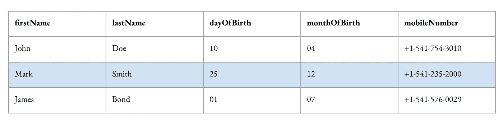
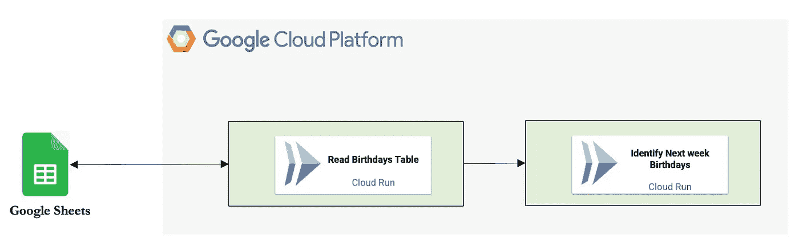
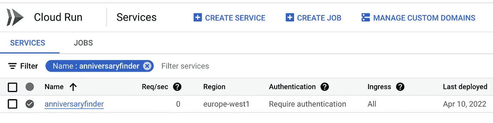
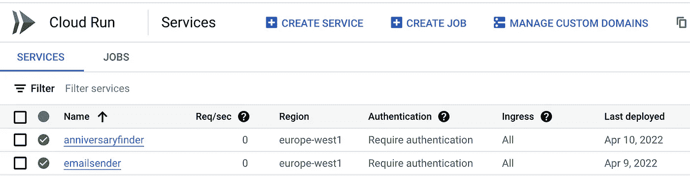
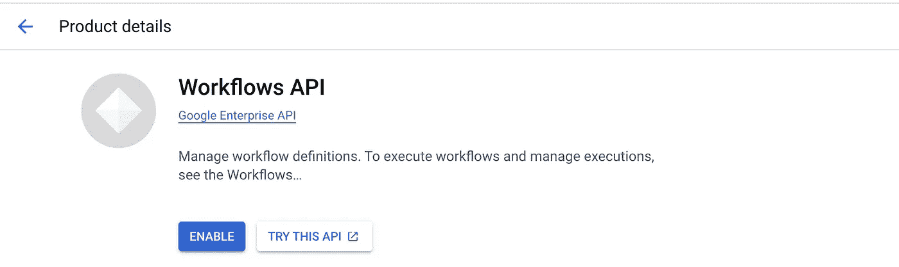
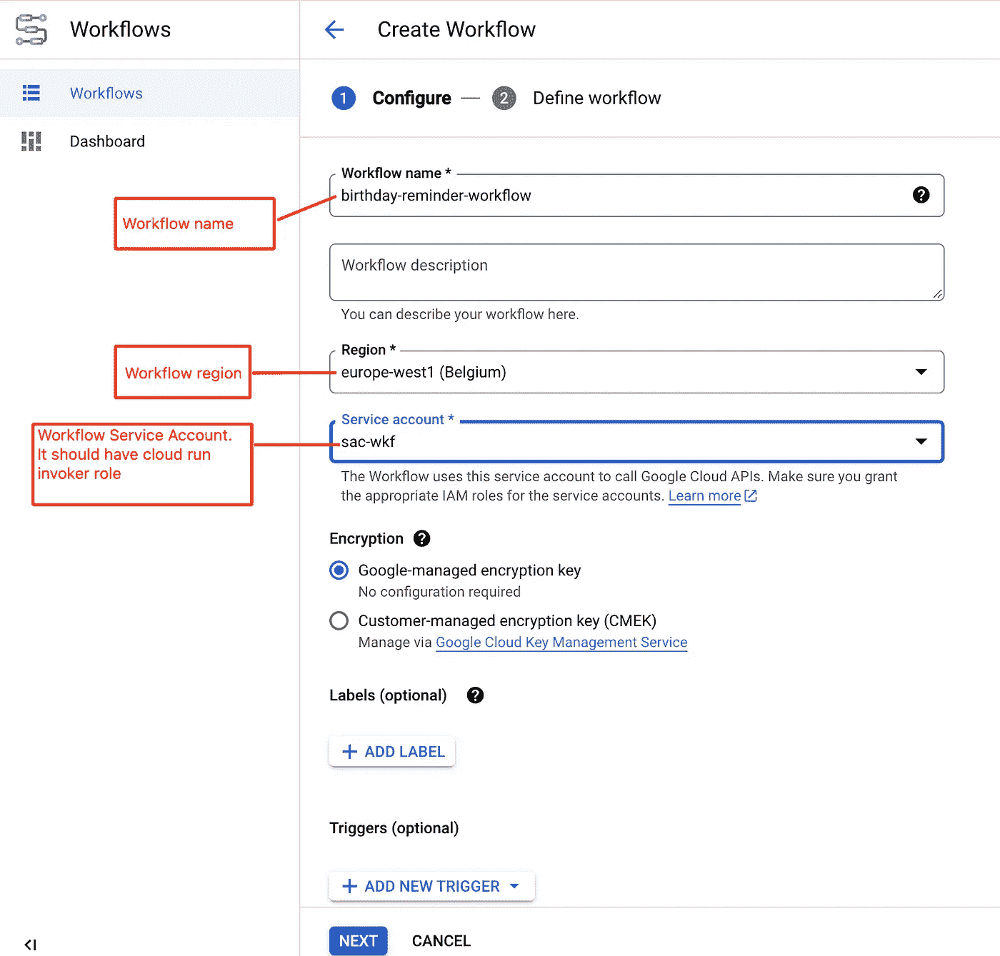
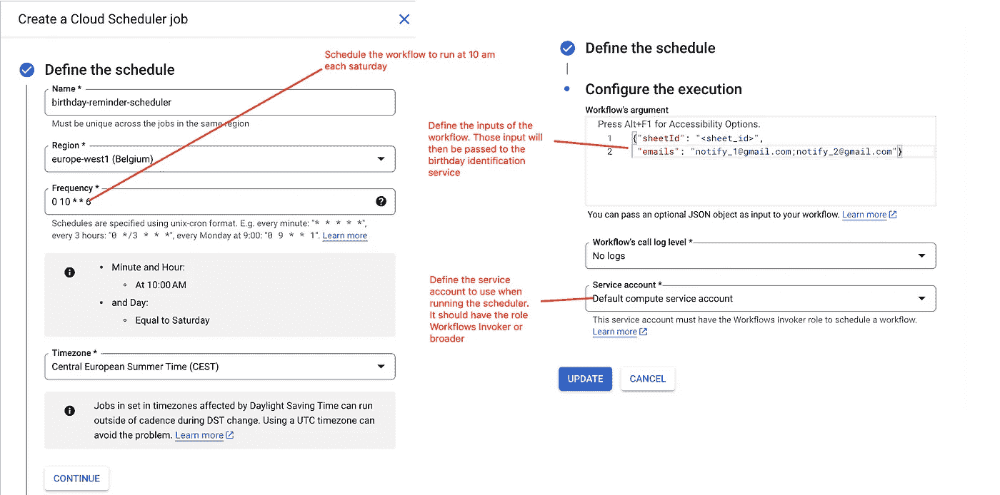
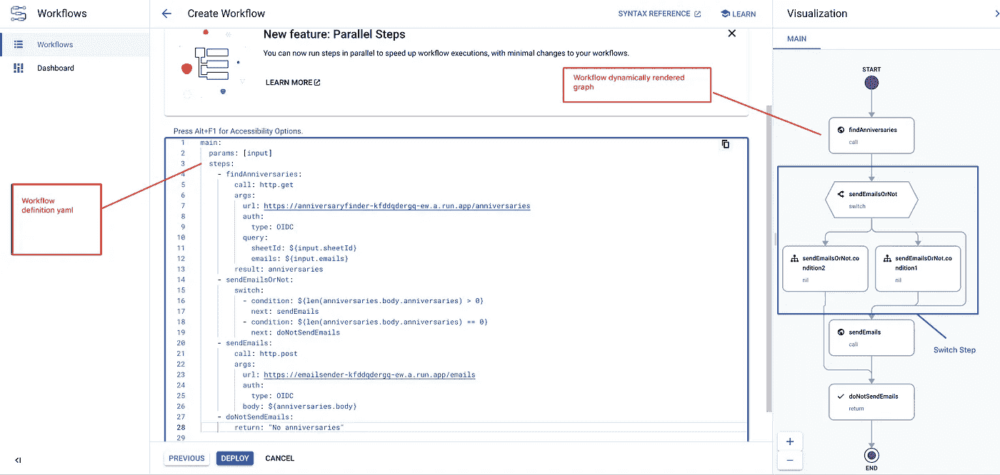

# 使用 Cloud Workflows 和 Cloud Scheduler 轻松构建事件提醒

> 原文：[`towardsdatascience.com/easily-build-an-event-reminder-with-cloud-workflows-and-cloud-scheduler-efba59b3df9a`](https://towardsdatascience.com/easily-build-an-event-reminder-with-cloud-workflows-and-cloud-scheduler-efba59b3df9a)

## 用例：识别生日并发送通知电子邮件

[](https://marcgeremie.medium.com/?source=post_page-----efba59b3df9a--------------------------------)[](https://towardsdatascience.com/?source=post_page-----efba59b3df9a--------------------------------) [Marc Djohossou](https://marcgeremie.medium.com/?source=post_page-----efba59b3df9a--------------------------------)

·发表于[Towards Data Science](https://towardsdatascience.com/?source=post_page-----efba59b3df9a--------------------------------) ·7 分钟阅读·2023 年 4 月 26 日

--


图片由[Imants Kaziļuns](https://unsplash.com/@imants72?utm_source=medium&utm_medium=referral)提供，来自[Unsplash](https://unsplash.com/?utm_source=medium&utm_medium=referral)

构建事件提醒功能，比如 Facebook 周年提醒，可能看起来比实际更费力。在本文中，我详细阐述了一种简单但高效的方式来构建生日提醒应用程序。请阅读以下内容以解锁访问包含完整工作代码的仓库。以下是主要涉及的主题：

> 云工作流与 Cloud Run 介绍
> 
> 建立生日识别服务
> 
> 建立电子邮件通知服务
> 
> 构建生日提醒服务
> 
> 总结

## 云工作流与 Cloud Run 介绍

[Cloud Workflows](https://cloud.google.com/workflows?hl=en) 是 Google Cloud 提供的一项服务，允许你编排一系列基于 HTTP 的服务。这些服务可以是内部的（当它们属于 Google Cloud 域时）或外部的。除了具有吸引人的成本，Cloud Workflows 还提供了一些独特且有趣的功能，例如[等待和回调](https://cloud.google.com/workflows/docs/creating-callback-endpoints)，可以让你等待长达 1 年的时间以发生某个事件。

[Cloud Run](https://cloud.google.com/run?hl=en) 用于大规模运行容器化应用程序。作为无服务器的服务，它不需要创建集群或虚拟机，从而加速了应用程序的构建和部署。虽然 Cloud Run 通常用于网站和 Rest API，但它也可以用于广泛的任务，包括轻量级的数据处理或任务自动化。关于这一点，本文使用了一个数据处理的 Cloud Run 服务来识别即将庆祝生日的人，以及一个任务自动化的 Cloud Run 服务来发送提醒电子邮件。

## 构建生日识别服务

假设我们已获得一组人员的详细信息，这些人员的周年纪念应该提前提醒几个人，也许是他们最亲近的朋友。



作者提供的图像，生日表 — 需要识别的人员生日列表

查看上表的第一行，我们看到史密斯先生出生于 12 月 25 日。因此，目标可能是自动通过电子邮件提前一周通知史密斯先生的朋友们（以便他们有足够的时间来安排惊喜派对 😀）。

现在，生日表可能存储在许多地方。作为 Google Cloud 用户，将生日详情存储在 [BigQuery](https://cloud.google.com/bigquery?hl=en) 表中是有意义的。另一个非常好的选择是 [Google Sheets](https://www.google.fr/intl/en/sheets/about/)，尤其是当生日表中的人数不多时。

使用 Google Sheets 作为存储解决方案，生日识别服务将如下所示：



作者提供的图像，生日识别服务架构 — Sheets 图标来自 flaticon¹

这可以很容易地转换成 Python 代码。

```py
import os

from flask import Flask, make_response, request, jsonify

from find_anniversary import AnniversaryFinder

app = Flask(__name__)

@app.route("/anniversaries", methods=['GET'])
def get_anniversaries():
    _args = request.args
    sheet_id = _args.get('sheetId')
    emails = _args.get('emails').split(';')
    anniversary_finder = AnniversaryFinder(sheet_id)
    ann = anniversary_finder.find_anniversary()
    resp = {'emails': emails, 'anniversaries': ann}
    return make_response(resp)
```

注意生日识别服务接受两个输入参数：

+   包含生日表 ID 的 Google Sheet

+   要通知即将到来的生日的电子邮件列表（例如 notify_1@gmail.com 和 notify_2@gmail.com）

它读取生日表，过滤表格以保留下周的幸运儿，并返回一个包含检测到的生日详情和需要通知的人员列表的 Python 字典。

```py
result = {
    'emails': ['notify_1@gmail.com', 'notify_2@gmail.com'],
    'anniversaries': [
        {'lastName': 'Smith',
         'firstName': 'Mark',
         'date': '25th of december',
         'mobile': '+1-541-235-2000'}]
}
```

现在我们可以给服务起个名字并将其部署，以便准备一个 Cloud Run 服务来识别生日表中的下一个生日：



作者提供的图像，生日识别服务已部署到 Cloud Run

> **注意**：本文不会详细介绍如何识别即将到来的生日或如何部署生日识别服务。

## 构建电子邮件通知服务

一旦识别出即将到来的生日，就该传达好消息了。例如，在社交网络上下文中，只有“生日男孩/女孩”的直接联系才能得到通知。

电子邮件通知 Cloud Run 服务的输入是一个包含 json 有效负载的内容：

+   生日男孩/女孩及其详细信息的列表（之前已识别）

+   需要通知的人员列表

```py
@app.route("/emails", methods=['POST'])
def send_email():
    req = request.get_json(silent=True, force=True)
    emails = req['emails']
    anniversaries = req['anniversaries']

    mail = SendEMail()
    with open('anniversaries_email_template.html') as _file:
        template_email = Template(_file.read())

    content = template_email.render(anniversaries=anniversaries)
    mail.send(emails, content)
    return make_response(req)
```

实际的电子邮件发送可以通过多种方式实现。个人来说，我成功使用了 [Sendgrid](https://sendgrid.com/) 或通过 Python 包 *smtplib* 使用 Gmail SMPT 服务器。



作者提供的图片，电子邮件通知服务部署到 Cloud Run

到目前为止，我们已经构建了一个能够识别生日的服务和一个能够发送电子邮件通知的服务。然而，还缺少两个要素来完成一个工作正常的生日提醒应用程序：

+   一个能够按计划顺序运行这两个服务的解决方案

+   一个能够跳过运行电子邮件通知服务的解决方案（如果没有识别到生日的话）。

这时，Cloud Workflows 就派上用场了

> **注意**：本文不会深入讲解如何发送电子邮件或如何部署电子邮件通知服务。

## 构建生日提醒服务

由于生日识别服务和电子邮件通知服务已经启动，剩下的就是如何将它们连接起来，并定期启动生日提醒应用程序。

假设我们希望生日提醒应用程序每周六执行一次。那么我们需要做以下事情：

+   **激活 Cloud Workflows API**

在 Cloud Console 搜索框中，输入 *Workflows* 并点击 *Workflows* API 链接。然后点击 *ENABLE* 按钮来激活 API，并等待几秒钟。


作者提供的图片，寻找 Cloud Workflows API



作者提供的图片，激活 Cloud Workflows API

+   **创建生日提醒工作流**

启用 Workflows API 后，点击 *CREATE* 按钮并开始填写生日工作流创建的详细信息。请注意，工作流服务账户应具有 *Cloud Run Invoker IAM Role*（或更广泛角色），以便能够触发生日识别和电子邮件通知服务。



作者提供的图片，生日提醒工作流创建，第一部分

点击 *ADD NEW TRIGGER* 按钮并配置一个 Cloud Scheduler。请确保在 *Workflow’s argument* 中定义一个包含生日表 Google Sheets ID 和要通知的电子邮件的 json 文档。此外，你还需要选择一个具有 *Workflows Invoker IAM Role*（或更广泛角色）的服务账户来运行调度程序作业。



作者提供的图片，生日提醒工作流创建，第二部分

点击 *CONTINUE* 按钮并添加工作流定义 yaml 文件。然后点击 *DEPLOY* 并等待几秒钟以创建工作流



图片来源于作者，生日提醒工作流创建，第三部分

你还记得为什么 Cloud Workflows 对于构建生日提醒应用程序实际上是必要的 2 个原因吗？它提供了：

+   一种重复运行生日识别和电子邮件通知服务的方法，按顺序执行

+   如果没有生日需要庆祝，则可以跳过通知的执行。

这种跳过功能是通过使用**切换步骤**来实现的，其中检查了即将到来的生日数量。如果没有生日，则不会执行通知电子邮件服务。

```py
main:
  params: [input]
  steps:
    - findAnniversaries:
        call: http.get
        args:
          url: https://anniversaryfinder-kfddqdergq-ew.a.run.app/anniversaries
          auth:
            type: OIDC
          query:
            sheetId: ${input.sheetId}
            emails: ${input.emails}
        result: anniversaries
    - sendEmailsOrNot:
        switch:
          - condition: ${len(anniversaries.body.anniversaries) > 0}
            next: sendEmails
          - condition: ${len(anniversaries.body.anniversaries) == 0}
            next: doNotSendEmails
    - sendEmails:
        call: http.post
        args:
          url: https://emailsender-kfddqdergq-ew.a.run.app/emails
          auth:
            type: OIDC
          body: ${anniversaries.body}
    - doNotSendEmails:
        return: "No anniversaries"
```

**总结**

本文描述了使用 Cloud Scheduler 和 Cloud Workflows 构建任何事件提醒应用程序的简单方法。前者负责触发提醒，而后者则协调包含需要提醒的逻辑的 HTTP 服务。通常，我们创建了一个协调 2 个 Cloud Run 服务的工作流，并使用了 Cloud Workflows 的切换步骤，在需要时提前停止工作流。

如果这引起了你的兴趣，你可以在这个 [gitlab 仓库](https://gitlab.com/marcdjoh/event-reminder-with-cloud-workflows) 中找到完整的工作代码。如果需要访问，请发送电子邮件至 marcgeremie@gmail.com，我会很乐意将你添加到仓库中。

感谢你的时间，期待不久后与另一篇有趣的文章再见。

[1] [`www.flaticon.com/free-icon/sheets_281761?term=google+sheets&page=1&position=1&origin=tag&related_id=281761`](https://www.flaticon.com/free-icon/sheets_281761?term=google+sheets&page=1&position=1&origin=tag&related_id=281761)
