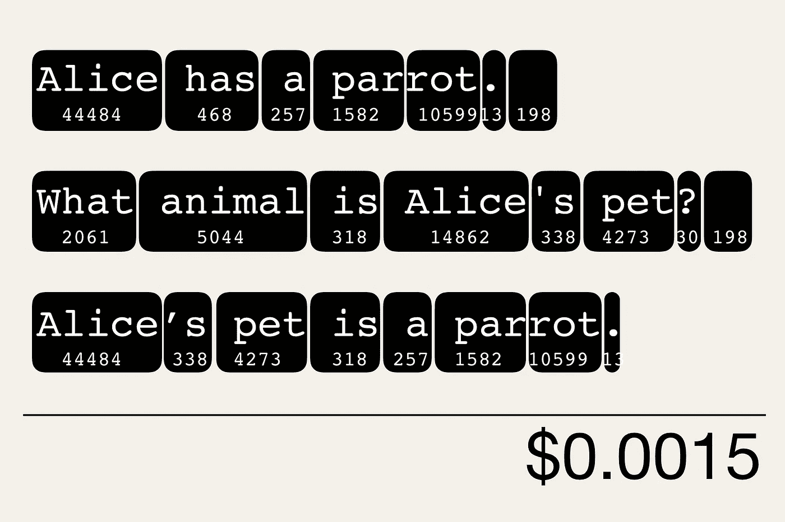
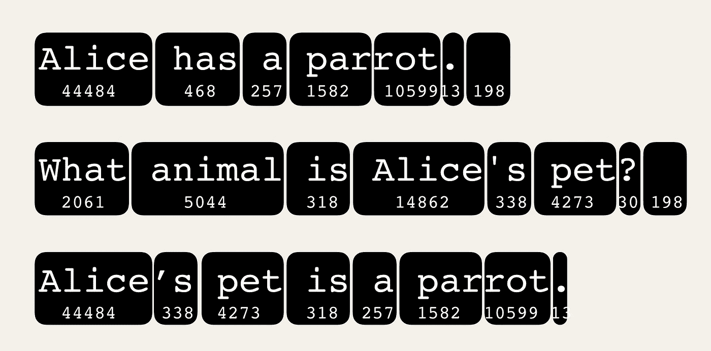
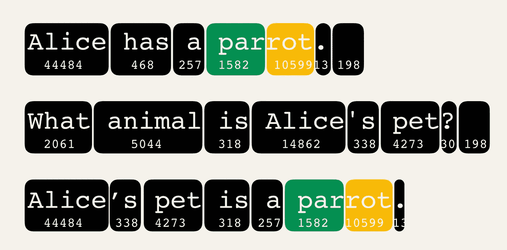
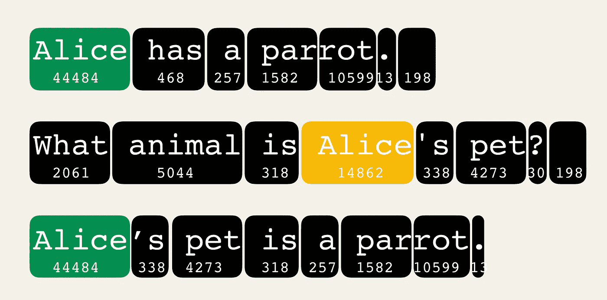
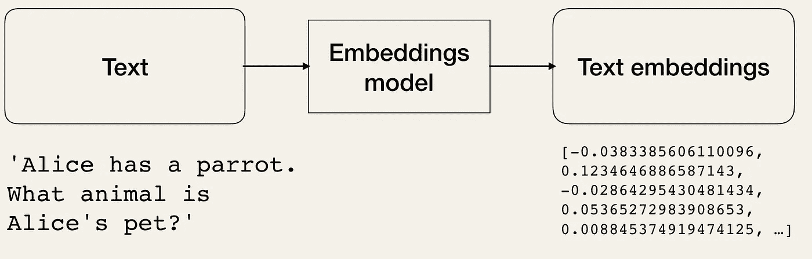
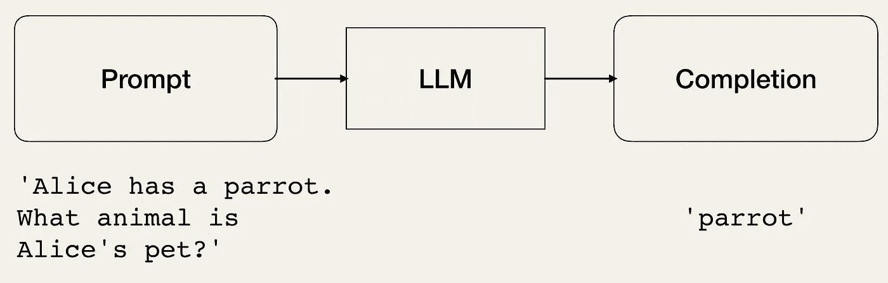

# 使用 Tiktoken 轻松估算你的 OpenAI API 成本

> 原文：[`towardsdatascience.com/easily-estimate-your-openai-api-costs-with-tiktoken-c17caf6d015e`](https://towardsdatascience.com/easily-estimate-your-openai-api-costs-with-tiktoken-c17caf6d015e)

## 计算你的令牌，避免因为使用 OpenAI API 而破产

[](https://medium.com/@iamleonie?source=post_page-----c17caf6d015e--------------------------------)[](https://towardsdatascience.com/?source=post_page-----c17caf6d015e--------------------------------) [Leonie Monigatti](https://medium.com/@iamleonie?source=post_page-----c17caf6d015e--------------------------------)

·发表于 [Towards Data Science](https://towardsdatascience.com/?source=post_page-----c17caf6d015e--------------------------------) ·6 分钟阅读·2023 年 8 月 1 日

--



新鲜的令牌！每千个$0.0015！

我认识的许多人对使用 OpenAI 的大型语言模型（LLMs）感兴趣。但托管 LLMs 是昂贵的，因此像 OpenAI 的应用程序编程接口（API）这样的推理服务并不是免费的。但在不了解推理成本总额的情况下输入付款信息可能会有些令人担忧。

通常，我喜欢在文章的操作指南中包含一个 API 成本的小提示，以便读者知道可以预期什么，并对推理成本有一个感受。

本文介绍了我用来估算 OpenAI 基础模型推理成本的 `tiktoken` 库。

# 什么是 tiktoken？

`tiktoken` 是一个由 OpenAI 开发的开源字节对编码（BPE）分词器，用于在其 LLMs 中对文本进行分词。它允许开发者在调用 OpenAI 端点之前计算文本中有多少个令牌。

因此，它有助于估算使用 OpenAI API 相关的成本，因为其费用是根据 [OpenAI 的定价页面](https://openai.com/pricing) **按每 1,000 个令牌计费** [1]。

[](https://github.com/openai/tiktoken?source=post_page-----c17caf6d015e--------------------------------) [## GitHub — openai/tiktoken: tiktoken 是一个快速的 BPE 分词器，用于 OpenAI 的模型。

### tiktoken 是一个快速的 BPE 分词器，用于 OpenAI 的模型。 — GitHub — openai/tiktoken: tiktoken 是一个快速的 BPE…

github.com](https://github.com/openai/tiktoken?source=post_page-----c17caf6d015e--------------------------------)

# 令牌与分词

**令牌** 是文本中常见的字符序列，**分词** 是将文本字符串拆分为令牌列表的过程。一个令牌可以等于一个词，但通常一个词由多个令牌组成。

自然语言处理（NLP）模型是通过 tokens 进行训练的，并理解它们之间的关系。因此，输入文本在 NLP 模型处理之前会进行分词。

但词语如何被分词，具体取决于使用的分词器。

下面你可以看到文本的一个示例

> “Alice 有一只鹦鹉。
> 
> Alice 的宠物是什么动物？
> 
> Alice 的宠物是一只鹦鹉。”

可以进行分词。



你可以看到文本被分成字符块，包括空格和标点符号，甚至换行符。然后每个 token 被编码为一个整数。

虽然一些较短的词等于一个 token，但较长的词，例如“parrot”，会被分成多个 tokens，如下所示：



根据分词器的不同，相同的词可能不会被编码为相同的 token。例如，在这个例子中，词 Alice 在文本中出现的位置不同时，会被一次分词为“Alice”，一次分词为“ Alice”（带有前导空格）。因此，tokens “Alice” 和 “ Alice”（带有前导空格）具有不同的 token 标识符。



OpenAI 使用一种称为字节对编码（BPE）的分词技术，该技术用一个单一的字节替换文本中最常见的字节对，从而帮助 NLP 模型更好地理解语法 [4]。

例如，“ing” 是英语中一个常见的字符子串。因此，BPE 将以“ing”结尾的词，如“walking”，分词为“walk”和“ing”。

平均来说，每个 token 对应于大约 4 字节或 4 个字符的常见英语文本，在 BPE 中，这大致相当于 75 个词对应 100 个 tokens [2, 4]。

关于 BPE 的详细解释，我推荐这篇文章：

[](/byte-pair-encoding-subword-based-tokenization-algorithm-77828a70bee0?source=post_page-----c17caf6d015e--------------------------------) ## 字节对编码：基于子词的分词算法

### 了解前沿 NLP 模型使用的基于子词的分词算法——字节对编码（BPE）

towardsdatascience.com

# 如何使用 tiktoken 估算 OpenAI API 成本

使用 `tiktoken` 估算 OpenAI API 成本包括以下四个简单步骤，我们将详细讨论：

1.  安装和设置

1.  定义编码

1.  分词文本

1.  估算 OpenAI API 成本

## 第一步：安装和设置

首先，你需要按照以下步骤安装 `tiktoken`：

```py
pip install tiktoken
```

然后你导入库：

```py
import tiktoken
```

## 第二步：定义编码

接下来，你需要定义用于分词的编码，因为 OpenAI 模型使用不同的编码 [3]：

+   `cl100k_base`：用于 `gpt-4`、`gpt-3.5-turbo` 和 `text-embedding-ada-002`

+   `p50k_base`：用于 codex 模型，`text-davinci-002`、`text-davinci-003`

+   `gpt2`（或 `r50k_base`）：用于 GPT-3 模型，如 `davinci`

如果你知道你的模型的编码方式，可以如下面所示定义编码：

```py
encoding = tiktoken.get_encoding("cl100k_base")
```

另外，你可以根据使用的模型定义编码方式：

```py
encoding = tiktoken.encoding_for_model("gpt-3.5-turbo")
```

## 第三步：对文本进行分词

最后，你可以使用`.encode()`方法对任何文本进行分词，这将返回一个表示令牌的整数列表。

```py
text = "Alice has a parrot.\n
What animal is Alice's pet?\n
Alice's pet is a parrot."

tokens = encoding.encode(text)
```

```py
[44484, 468, 257, 1582, 10599, 13, 198, 2061, 5044, 318, 14862, 338, 4273, 30, 198, 44484, 338, 4273, 318, 257, 1582, 10599, 13]
```

## 第四步：估算 OpenAI API 费用

要估算 OpenAI API 的费用，你现在可以计算文本中的令牌数量，并根据你使用的模型估算推断服务的相关费用。

```py
len(tokens)
```

如果你使用的是**嵌入模型**，你仅为要嵌入的输入文本的令牌数量付费。例如，`text-embedding-ada-002`在写作时的费用为每 1,000 个令牌$0.0001 [1]。



但请注意，如果你使用的是**对话模型**，你将为输入令牌的数量（你的提示中的令牌数量）以及输出令牌的数量（返回的完成中的令牌数量）收费。例如，`gpt-3.5-turbo`（4K 上下文）模型在写作时的费用为每 1,000 个输入令牌$0.0015，每 1,000 个输出令牌$0.002 [1]。



这就是为什么你需要控制输出令牌的数量，除了管理输入文本的长度，以避免意外的费用。你可以通过可选但强烈推荐的`max_tokens`参数来控制输出令牌的数量。

## 可选步骤：解码令牌

BPE 的另一个优点是它是可逆的。如果你想解码一个令牌列表，可以使用下面显示的`.decode_sigle_token_bytes()`方法：

```py
decoded_text = [encoding.decode_single_token_bytes(token) for token in tokens]
```

```py
["Alice", " has", " a", " par", "rot", ".", "\n", "What", " animal"," is"," Alice", "'s", " pet", "?", "\n", "Alice", "'s", " pet", " is", " a", " par", "rot", "."]
```

# 总结

这篇文章展示了如何使用`tiktoken`库轻松计算输入文本（要嵌入或提示）的令牌数量，然后再调用 OpenAI API 端点。通过将此步骤纳入你的编码实践中，你将对 API 费用有一个感性认识。此外，我们讨论了在使用会输出完成的 LLM 时，你还应该使用`max_tokens`参数，以避免意外费用。

# 喜欢这个故事吗？

[*免费订阅*](https://medium.com/subscribe/@iamleonie) *以便在我发布新故事时获得通知。*

[](https://medium.com/@iamleonie/subscribe?source=post_page-----c17caf6d015e--------------------------------) [## 每当 Leonie Monigatti 发布新内容时获得邮件提醒。

### 每当 Leonie Monigatti 发布新内容时，你会收到一封邮件。通过注册，你将创建一个 Medium 账户（如果你还没有的话）…

[medium.com](https://medium.com/@iamleonie/subscribe?source=post_page-----c17caf6d015e--------------------------------)

*在* [*LinkedIn*](https://www.linkedin.com/in/804250ab/)、[*Twitter*](https://twitter.com/helloiamleonie) *和* [*Kaggle*](https://www.kaggle.com/iamleonie) *上找到我！*

# 参考文献

## 图片参考

如果没有另行说明，所有图片均由作者创建。

## 网络与文献

[1] OpenAI（2023）。[定价](https://openai.com/pricing)（访问日期：2023 年 7 月 31 日）

[2] OpenAI (2023)。 [Tokenizer](https://platform.openai.com/tokenizer)（访问于 2023 年 7 月 31 日）

[3] OpenAI 在 GitHub(2023)。 [OpenAI Cookbook](https://github.com/openai/openai-cookbook/blob/main/examples/How_to_count_tokens_with_tiktoken.ipynb)（访问于 2023 年 7 月 31 日）

[4] OpenAI 在 GitHub(2023)。 [tiktoken](https://github.com/openai/tiktoken)（访问于 2023 年 7 月 31 日）
