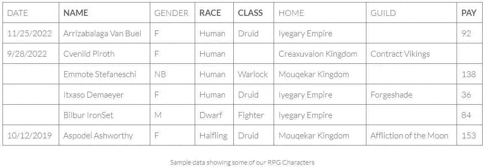

# 使用 Pydantic 轻松验证用户生成的数据

> 原文：[`towardsdatascience.com/easily-validate-user-generated-data-using-pydantic-5ace695cc3c8?source=collection_archive---------0-----------------------#2023-02-05`](https://towardsdatascience.com/easily-validate-user-generated-data-using-pydantic-5ace695cc3c8?source=collection_archive---------0-----------------------#2023-02-05)

## 如何使用 Pydantic 验证 Excel 数据

[](https://medium.com/@Carobert?source=post_page-----5ace695cc3c8--------------------------------)[](https://towardsdatascience.com/?source=post_page-----5ace695cc3c8--------------------------------) [Charles Mendelson](https://medium.com/@Carobert?source=post_page-----5ace695cc3c8--------------------------------)

·

[阅读原文](https://medium.com/m/signin?actionUrl=https%3A%2F%2Fmedium.com%2F_%2Fsubscribe%2Fuser%2Fa6f4d278f87e&operation=register&redirect=https%3A%2F%2Ftowardsdatascience.com%2Feasily-validate-user-generated-data-using-pydantic-5ace695cc3c8&user=Charles+Mendelson&userId=a6f4d278f87e&source=post_page-a6f4d278f87e----5ace695cc3c8---------------------post_header-----------) 发表在 [数据科学进展](https://towardsdatascience.com/?source=post_page-----5ace695cc3c8--------------------------------) · 6 分钟阅读 · 2023 年 2 月 5 日[](https://medium.com/m/signin?actionUrl=https%3A%2F%2Fmedium.com%2F_%2Fvote%2Ftowards-data-science%2F5ace695cc3c8&operation=register&redirect=https%3A%2F%2Ftowardsdatascience.com%2Feasily-validate-user-generated-data-using-pydantic-5ace695cc3c8&user=Charles+Mendelson&userId=a6f4d278f87e&source=-----5ace695cc3c8---------------------clap_footer-----------)

--

[](https://medium.com/m/signin?actionUrl=https%3A%2F%2Fmedium.com%2F_%2Fbookmark%2Fp%2F5ace695cc3c8&operation=register&redirect=https%3A%2F%2Ftowardsdatascience.com%2Feasily-validate-user-generated-data-using-pydantic-5ace695cc3c8&source=-----5ace695cc3c8---------------------bookmark_footer-----------)

图片由 [DeepMind](https://unsplash.com/@deepmind?utm_source=unsplash&utm_medium=referral&utm_content=creditCopyText) 提供，来源于 [Unsplash](https://unsplash.com/photos/oVm12cylnBw?utm_source=unsplash&utm_medium=referral&utm_content=creditCopyText)

# 使用 Pydantic 验证 Excel 数据

作为数据工程师，我经常遇到这样的情况：我建立了基于 Excel 用户生成数据的管道和其他自动化。Excel 的灵活性使其可以被各种用户使用，但不幸的是，这种灵活性导致无效数据进入管道。在发现 Pydantic 之前，我编写了非常复杂的 Pandas 函数来检查和过滤数据，以确保其有效性。

# 什么是 Pydantic？

Pydantic 是一个 Python 库，它允许你以 Pythonic 的方式定义数据模型，并使用该模型验证数据输入，主要通过使用类型提示。

# 示例数据：

在开始之前，让我们检查一下我们的示例数据；一个我使用随机名称生成器创建的 RPG 角色的电子表格：



作者提供的图片

粗体列标题表示必填字段，我们可以看到一些必填字段缺失。此外，我们的一些文本字段，如 `Race`、`Class` 和 `Gender` 应该限制为特定的单词，而不是自由文本字段。

# 开始构建我们的数据模型

Pydantic 为数据模型提供了多个起始点，但我们的模型相当简单，因此我们将使用 `pydantic.BaseMode`：

```py
import pydantic

class RpgCharacterModel(pydantic.BaseModel):
    DATE: datetime
    NAME: str
    GENDER: str
    RACE: str
    CLASS: str
    HOME: str
    GUILD: str
    PAY: int
```

语法相当简单。在定义类并继承自我们的基础模型后，我们输入每个字段名称并提供类型提示。

虽然这是一个好的开始，但这个模型有一些严重的限制。目前，它将接受任何字符串用于许多我们希望限制为特定值的字段。

# 控制字符串字段的枚举

在与 Python 中的其他类类型一起工作时，Pydantic 的类型提示更为强大。一个强大的功能是能够通过定义枚举并将枚举作为类型提示来限制字符串条目。

现在我们将这些选择定义为枚举：

```py
import enum

class GenderEnum(enum.Enum):
    M = 'M'
    F = 'F'
    NB = 'NB'

class ClassEnum(enum.Enum):
    Druid = 'Druid'
    Fighter = 'Fighter'
    Warlock = 'Warlock'
    Ranger = 'Ranger'
    Bard = 'Bard'
    Sorcerer = 'Sorcerer'
    Paladin = 'Paladin'
    Rogue = 'Rogue'
    Wizard = 'Wizard'
    Monk = 'Monk'
    Barbarian = 'Barbarian'
    Cleric = 'Cleric'

class RaceEnum(enum.Enum):
    Human = 'Human'
    Dwarf = 'Dwarf'
    Halfling = 'Halfling'
    Elf = 'Elf'
    Dragonborn = 'Dragonborn'
    Tiefling = 'Tiefling'
    Half_Orc = 'Half-Orc'
    Gnome = 'Gnome'
    Half_Elf = 'Half-Elf'
```

现在，我们可以使用这些枚举使我们的数据模型更具体：

```py
class RpgCharacterModel(pydantic.BaseModel):
    DATE: datetime
    NAME: str
    GENDER: GenderEnum
    RACE: RaceEnum
    CLASS: ClassEnum
    HOME: str
    GUILD: str
    PAY: int
```

我们的数据模型已经变得更好，但还有两件事需要做才能真正完善它。

1.  指定必填字段

1.  为薪资指定范围。数字是数据输入错误的常见地方

Pydantic 提供了一个可选的函数，允许我们在数据模型中定义更具体的选项。

# 使用 Field() 实现更高的具体性。

在定义数据模型中的字段时，我们可以调用 Field() 函数来指定附加选项，包括字段是否为必填项，以及设置数值输入的限制。

```py
import pydantic

class RpgCharacterModel(pydantic.BaseModel):
    DATE: datetime
    NAME: str = pydantic.Field(...)
    GENDER: GenderEnum
    RACE: RaceEnum = pydantic.Field(...)
    CLASS: ClassEnum = pydantic.Field(...)
    HOME: str
    GUILD: str
    PAY: int = pydantic.Field(..., ge=1, le=500)
```

将 `...` 作为 Field 的第一个参数表示该字段是必填的。

+   `ge` 关键字表示 `大于或等于`

+   `le` 关键字表示 `小于或等于`

# 使用模型

现在我们已经完成了定义模型的所有工作，我们需要使用它。

Pydantic 模型期望接收类似 JSON 的数据，因此我们传递给模型进行验证的数据必须是字典。

对于我们的数据验证，我们需要做以下几点：

+   以 DataFrame 作为输入

+   将其转换为字典列表（每行一个字典）

+   运行每一行的数据验证

+   将成功验证的行追加到一个列表中

+   将失败的行追加到另一个列表中，包含行号和错误信息

```py
import pandas as pd
import pydantic

def validate_df_data(df: pd.DataFrame, model: pydantic.BaseModel, index_offset: int = 2) -> tuple[list, list]:
    # Python index starts at 0, excel at 1, and 1 row for the header in Excel

    #capturing our good data and our bad data
    good_data = []
    bad_data = []
    df_rows = df.to_dict(orient='records')
    for index, row in enumerate(df_rows):
        try:
            model(**row)  #unpacks our dictionary into our keyword arguments
            good_data.append(row)  #appends valid data to a new list of dictionaries
        except pydantic.ValidationError as e:
            # Adds all validation error messages associated with the error
            # and adds them to the dictionary
            row['Errors'] = [error_message['msg'] for error_message in e.errors()]

            row['Error_row_num'] = index + index_offset
            bad_data.append(row)  #appends bad data to a different list of dictionaries

    return (good_data, bad_data)
```

使用这个功能，我们可以处理好的数据行，并将不良的数据行返回以进行 QA、修改和重新提交。

# 完整代码

```py
# Standard Library imports
from datetime import datetime
import enum

# 3rd Party package imports
import pandas as pd
import pydantic

# Enums for limiting string data in our model

class GenderEnum(enum.Enum):
    M = 'M'
    F = 'F'
    NB = 'NB'

class ClassEnum(enum.Enum):
    Druid = 'Druid'
    Fighter = 'Fighter'
    Warlock = 'Warlock'
    Ranger = 'Ranger'
    Bard = 'Bard'
    Sorcerer = 'Sorcerer'
    Paladin = 'Paladin'
    Rogue = 'Rogue'
    Wizard = 'Wizard'
    Monk = 'Monk'
    Barbarian = 'Barbarian'
    Cleric = 'Cleric'

class RaceEnum(enum.Enum):
    Human = 'Human'
    Dwarf = 'Dwarf'
    Halfling = 'Halfling'
    Elf = 'Elf'
    Dragonborn = 'Dragonborn'
    Tiefling = 'Tiefling'
    Half_Orc = 'Half-Orc'
    Gnome = 'Gnome'
    Half_Elf = 'Half-Elf'

class RpgCharacterModel(pydantic.BaseModel):
    DATE: datetime
    NAME: str = pydantic.Field(...)
    GENDER: GenderEnum
    RACE: RaceEnum = pydantic.Field(...)
    CLASS: ClassEnum = pydantic.Field(...)
    HOME: str
    GUILD: str
    PAY: int = pydantic.Field(..., ge=1, le=500)

def validate_df_data(df: pd.DataFrame, model: pydantic.BaseModel, index_offset: int = 2) -> tuple[list, list]:
    # Python index starts at 0, excel at 1, and 1 row for the header in Excel

    #capturing our good data and our bad data
    good_data = []
    bad_data = []
    df_rows = df.to_dict(orient='records')
    for index, row in enumerate(df_rows):
        try:
            model(**row)  #unpacks our dictionary into our keyword arguments
            good_data.append(row)  #appends valid data to a new list of dictionaries
        except pydantic.ValidationError as e:
            # Adds all validation error messages associated with the error
            # and adds them to the dictionary
            row['Errors'] = [error_message['msg'] for error_message in e.errors()]
            # Python index starts at 0, excel at 1, and 1 row for the header in excel
            row['Error_row_num'] = index + index_offset
            bad_data.append(row)  #appends bad data to a different list of dictionaries

    return (good_data, bad_data)

df = pd.read_excel('sample_dnd_character_data.xlsx')
valid_data, invalid_data = validate_df_data(df, RpgCharacterModel, index_offset=2)
```

所有代码和示例数据可以在我的 [GitHub 仓库](https://github.com/Carobert85/pydantic_data_validation) 中找到

# 结论及下一步

Pydantic 非常强大，虽然这是一个简单的示例，但它可以处理复杂的嵌套模型。这确实提供了许多数据验证的细粒度，而无需编写大量代码。

作为额外的好处，对数据进行建模确实有助于你理解数据，而不是仅仅接受你所得到的内容。

虽然本教程专注于 Pandas，但你可以使用 Pydantic 来验证 Python 中的大多数数据输入形式。

# 关于

查尔斯·门德尔森是一位驻西雅图的数据工程师，怀有软件工程的幻想。除了作为数据工程师工作外，他还协助华盛顿大学继续教育学院教授 Python。 [与他联系的最佳方式是通过 LinkedIn](https://www.linkedin.com/in/charles-mendelson-carobert/)。

*最初发表于* [*https://charlesmendelson.com*](https://charlesmendelson.com/tds/pydantic-data-validation/) *2023 年 2 月 5 日。*
