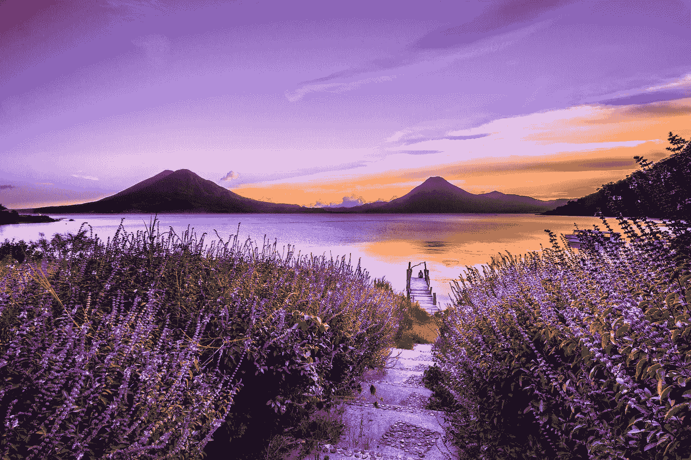
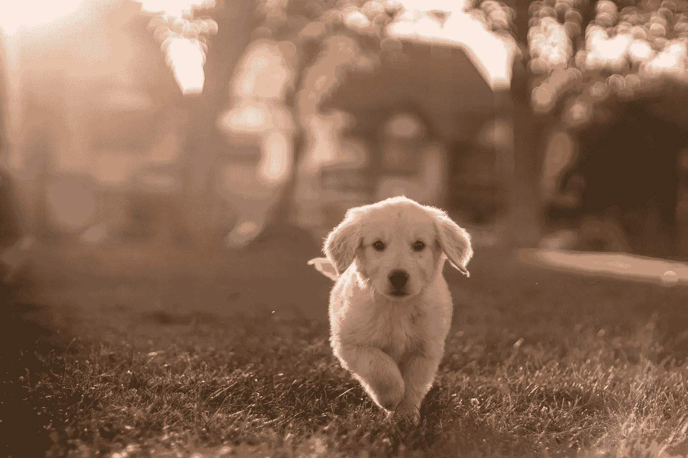
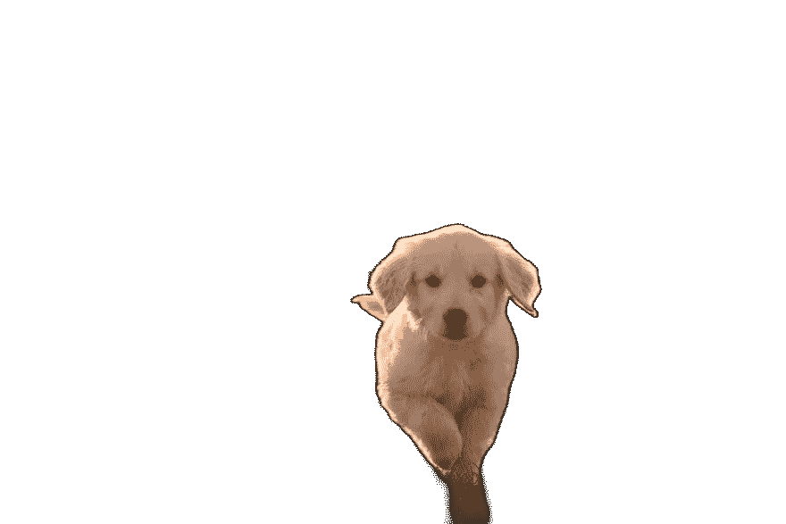
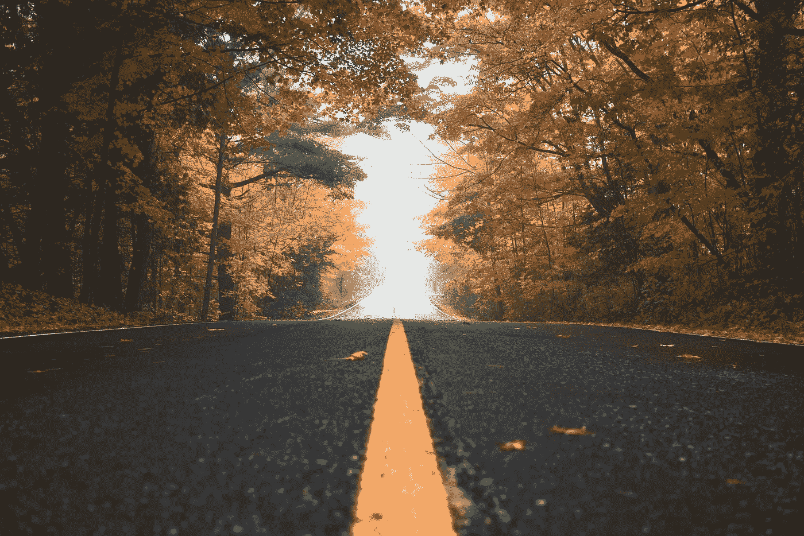
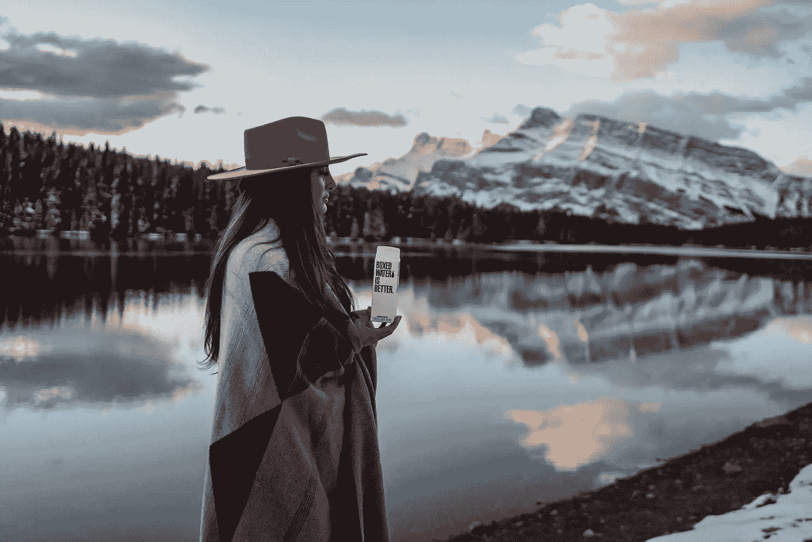

# 使用 Python AI 轻松编辑背景

> 原文：[`towardsdatascience.com/easy-background-editing-with-python-ai-5ab505e81186`](https://towardsdatascience.com/easy-background-editing-with-python-ai-5ab505e81186)

## 去除背景并用几行 Python 代码替换它，以提升你的视觉形象。

[](https://bharath-k1297.medium.com/?source=post_page-----5ab505e81186--------------------------------)[](https://towardsdatascience.com/?source=post_page-----5ab505e81186--------------------------------) [Bharath K](https://bharath-k1297.medium.com/?source=post_page-----5ab505e81186--------------------------------)

·发布在 [Towards Data Science](https://towardsdatascience.com/?source=post_page-----5ab505e81186--------------------------------) ·8 分钟阅读·2023 年 4 月 26 日

--



图片由 [Mark Harpur](https://unsplash.com/@luckybeanz?utm_source=medium&utm_medium=referral) 提供，来源于 [Unsplash](https://unsplash.com/?utm_source=medium&utm_medium=referral)

你有一张自己非常喜欢的照片，但你注意到照片中的背景对图像产生了抑制效果。你觉得如果背景不存在，或者通过对特定图像进行一些修改，同时保留你的照片，将会得到一张高质量的个人肖像。

执行以下操作的许多方法包括支付相当高的费用购买软件或请专业人士完成项目。一些值得注意的免费资源也可能存在，但它们的可信度或效率可能会有一定限制。

与其处理这些问题的麻烦，不如设计你自己的签名方法来管理以下任务，岂不更酷？

借助 Python，可以轻松完成以下项目。通过对计算机视觉和人工智能的更好理解，可以显著提高图像背景去除的性能和质量。在本文中，我们的主要目标是去除不必要的背景，并保留所需的图像。

对于计算机视觉项目的初学者，我强烈推荐我的一篇文章，该文章详细介绍了掌握 Open CV 计算机视觉库的基础知识。以下是方便访问的链接。

[## OpenCV：初学者完整指南，掌握计算机视觉基础及代码！

### 一个包含代码的教程，旨在掌握计算机视觉的所有重要概念，并使用 OpenCV 实现这些概念

[pip 安装 rembg](https://towardsdatascience.com/opencv-complete-beginners-guide-to-master-the-basics-of-computer-vision-with-code-4a1cd0c687f9?source=post_page-----5ab505e81186--------------------------------)

# 用几行 Python 代码移除背景：



图片由 [Cristian Castillo](https://unsplash.com/@castillcc?utm_source=medium&utm_medium=referral) 提供，来源于 [Unsplash](https://unsplash.com/?utm_source=medium&utm_medium=referral)

在本节文章中，我们将专注于使用 Python 移除特定图像的背景。对于这个项目，目前版本要求高于 Python 3.7，低于 Python 3.11。我们将使用的背景移除库在版本 3.7 或更低版本下无法正常运行。

根据我的测试，rembg 库在 Python 3.7 版本下无法使用，因为无法下载适当的 scipy 模块版本。然而，在 Python 3.9 下，运行这篇文章中的程序没有任何问题，只需使用以下 `pip install` 命令。

> `pip install rembg`

rembg 库是利用深度神经网络开发的，主要使用 u2net 架构来处理背景移除任务。该架构有几种修改版，并且有多种经过测试的方法来提供最佳结果。rembg 库还提供了 GPU 安装以加快处理速度。有关更多信息和对以下库的理解，我强烈建议查看官方 GitHub 仓库的 [链接](https://github.com/danielgatis/rembg)。

现在我们对将用于背景移除项目的库有了初步了解，是时候导入两个该项目所需的核心库了。如前所述，rembg 库是我们首选的工具，使以下任务变得简单明了。更高级的开发者可以为该项目创建自己的神经网络。

另一个重要的库是 pillow 库，它是处理图像相关任务的最佳库之一。这个库通常会默认安装在 Python 中。如果没有，可以通过简单的 `pip` 安装命令来安装。必要的库在下面的代码片段中提到。

```py
# Importing the necessary libraries
from rembg import remove
from PIL import Image
```

一旦所需的库被导入，下一步是指定需要去除背景的图像的输入路径。我们还将提到另一个参数，即在工作目录中名为“Image.png”的输出路径，用于存储去背景的透明图像。读者可以选择任何其他文件名和格式。

```py
# Specifying the working paths
input_path = "Dog.jpg"
out_path = "Image.png"
```

对于最终的背景移除过程，我们将使用 pillow 库打开指定输入路径的图像。我们将利用 rembg 库的 remove 功能来去除对应图像的整体背景，只保留狗的图像，这是图像中的主要焦点。

透明背景的狗图像随后保存在工作目录中。执行以下操作的代码片段如下所示。

```py
# Removing the background and saving the image
input = Image.open(input_path)
remove_bgnd = remove(input)
remove_bgnd.save(out_path)
```

在成功编译上述程序后，生成了以下透明的狗图像。



图片由作者提供

一旦我们得到透明的狗图像，我们可以继续进入文章的下一部分，根据需要更换和应用新的背景。读者可以根据自己的选择选择任何合适的背景，只要图像大小相同。让我们在下一部分深入探讨这个话题吧！

# 更换背景：



图片由[Patrick Tomasso](https://unsplash.com/@impatrickt?utm_source=medium&utm_medium=referral)拍摄，发布于[Unsplash](https://unsplash.com/?utm_source=medium&utm_medium=referral)

一旦我们完成了背景的移除，更加好奇的开发者可能会想知道如何处理之前获得的透明图像。接下来的步骤，我们将遵循类似且相对简单的过程。我们将把透明的狗图像与上述背景进行合成。请注意，任何选择的背景都可以用于此任务。我们将用于此任务的唯一库是 pillow 库，用于操作透明图像和上述图片中的背景图。

```py
# Import the pillow library
from PIL import Image
```

在下一步中，我们将打开两个用于背景编辑项目的图像。我们将首先打开透明的狗图像，然后是将要放置的新背景图像。打开以下图像的代码片段如下所示。

```py
# Opening the desired images
img1 = Image.open("Image.png")
img2 = Image.open("New_Bgnd.jpg")
```

一旦我们打开了两个图像，必须确保所有图像的大小相同。如果两个图像的大小不匹配，将无法将背景粘贴到透明的狗图像上。因此，验证图像大小并在必要时进行适当调整是一个必要步骤。

对于按照本指南逐步操作的观众，如果你点击了提供的图像并将其下载到你的工作目录，你会注意到所有图像的大小都是 880 x 557。如果图像大小不匹配，请随意调整其大小。图像大小可以按如下所示进行验证。

```py
# Verifying image sizes
print(img1.size)
print(img2.size)
```

最后，我们将使用 pillow 库的粘贴命令将背景图像粘贴到透明图像上。第一个参数代表第一张图像（背景透明的狗），下一个属性是起始坐标，最后是关键参数，用于指示相应图像的掩码。

alpha 通道作为掩码，用于将背景与透明的狗图像合并。我们可以将新创建的图像保存在我们的工作目录中。执行以下操作的代码在下面的代码片段中提供。

```py
# Effectively changing the background
img2.paste(img1, (0, 0), img1)
img2.show()
img2.save("New_Dog.png")
```

完成以下项目后，我们应该能够生成以下图像。


图像由作者提供

通过这个两步过程，我们成功地去除了之前的背景，同时提取了所需的实体，并将提取的透明背景的狗贴入新的背景中。对于本指南的更高级变体，我建议尝试在一个项目中完成这两个任务。接下来的指南可以转变为视频和实时项目用于背景替换，例如使用绿幕更换背景，满足用户的需求。

# 结论：



照片由 [Boxed Water Is Better](https://unsplash.com/@boxedwater?utm_source=medium&utm_medium=referral) 提供，来源于 [Unsplash](https://unsplash.com/?utm_source=medium&utm_medium=referral)

> “在摄影中，有一种现实如此微妙，以至于它变得比现实更真实。”
> 
> *—* ***阿尔弗雷德·斯蒂格利茨***

拥有一张自己很棒的照片但不喜欢背景，或者想在不同的环境或区域查看自己，有时可能会成为一个问题。使用昂贵的软件手动编辑背景可能很麻烦。其他免费的背景去除选项可能也无法产生最佳结果。然而，借助 AI 和 Python，这个项目可以在几行简单的代码内完成。

在本文中，我们了解了如何使用 Python AI 和几行代码去除、编辑和替换当前背景。我们利用 pillow 和 rembg 库有效地从原始图像中去除背景。一旦背景被过滤掉，我们可以使用原始图像及其相应的掩码添加新的背景。

为了进一步改进项目，我强烈建议将项目从图像扩展到视频甚至实时操作。对于高度高级的学习，我建议尝试学习和构建深度神经网络，从零开始进行背景去除任务。

如果你想在我的文章发布时及时获得通知，请查看以下[链接](https://bharath-k1297.medium.com/subscribe)以订阅电子邮件推荐。如果你希望支持我和其他作者，请订阅以下链接。

[](https://bharath-k1297.medium.com/membership?source=post_page-----5ab505e81186--------------------------------) [## 通过我的推荐链接加入 Medium - Bharath K

### 阅读 Bharath K 的每一个故事（以及 Medium 上成千上万的其他作家的故事）。你的会员费直接支持…

bharath-k1297.medium.com](https://bharath-k1297.medium.com/membership?source=post_page-----5ab505e81186--------------------------------)

如果你对本文中提到的各种要点有任何疑问，请随时在下面的评论中告知我。我会尽快回复你。

查看我其他与本文主题相关的文章，你可能也会喜欢阅读！

[](/advanced-gui-interface-with-python-cb04ef2e29b9?source=post_page-----5ab505e81186--------------------------------) ## 高级 Python GUI 界面

### 通过 Python 开始更多现代开发接口，用于你的项目

towardsdatascience.com [](/the-ultimate-replacements-to-jupyter-notebooks-51da534b559f?source=post_page-----5ab505e81186--------------------------------) ## 终极 Jupyter Notebook 替代方案

### 讨论一个出色的 Jupyter Notebook 替代方案，用于解析数据科学项目

towardsdatascience.com [](/7-best-research-papers-to-read-to-get-started-with-deep-learning-projects-59e11f7b9c32?source=post_page-----5ab505e81186--------------------------------) ## 开始深度学习项目的七篇最佳研究论文

### 七篇经受住时间考验的最佳研究论文，帮助你创建惊人的项目

towardsdatascience.com

感谢大家坚持到最后。我希望你们都喜欢阅读这篇文章。祝大家有美好的一天！
