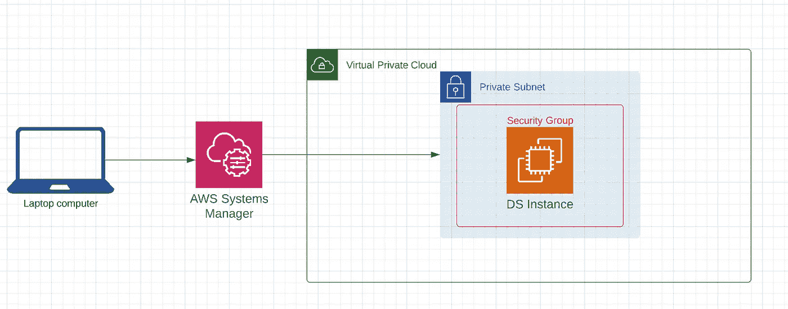
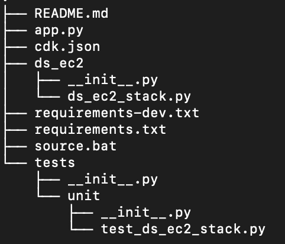
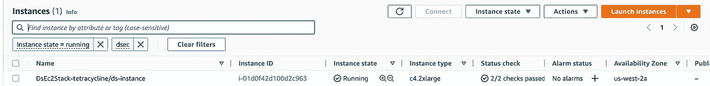
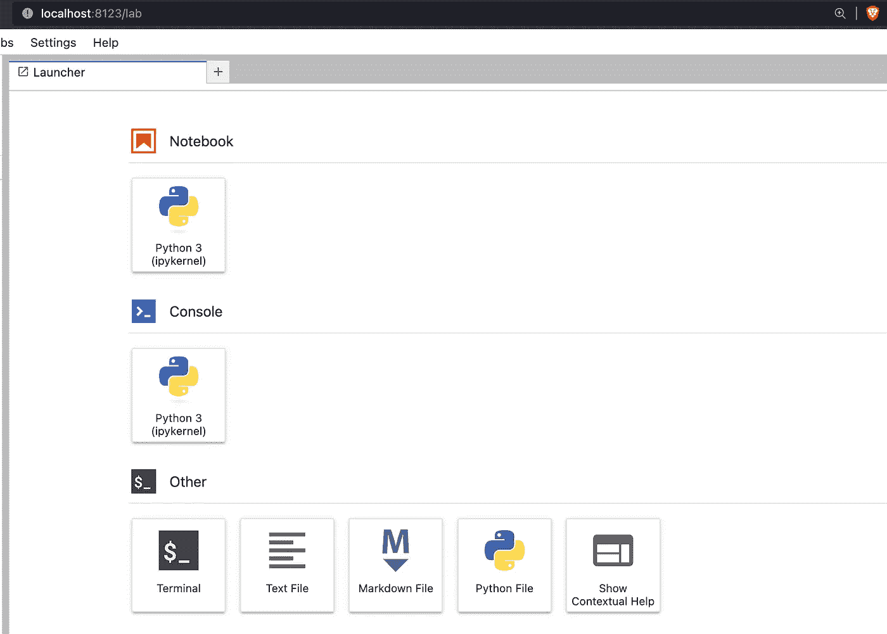

# 简单 CDK 深度学习 EC2 实例

> 原文：[`towardsdatascience.com/easy-cdk-deep-learning-ec2-instances-f30fbeec1ea3`](https://towardsdatascience.com/easy-cdk-deep-learning-ec2-instances-f30fbeec1ea3)

## 使用 CDK 部署深度学习 EC2 实例非常简单

[](https://nbertagnolli.medium.com/?source=post_page-----f30fbeec1ea3--------------------------------)[](https://towardsdatascience.com/?source=post_page-----f30fbeec1ea3--------------------------------) [尼古拉斯·贝尔塔诺利](https://nbertagnolli.medium.com/?source=post_page-----f30fbeec1ea3--------------------------------)

·发表于[数据科学前沿](https://towardsdatascience.com/?source=post_page-----f30fbeec1ea3--------------------------------) ·阅读时间 10 分钟·2023 年 1 月 18 日

--



今天我们要构建的内容的大致概述。

# 介绍

作为数据科学家，我经常需要在云中运行 GPU 作业，而我对点击 UI 的操作深恶痛绝。过去，当我需要一个 GPU 实例进行单次模型训练时，我不得不费力地在 AWS 的 UI 中进行导航。但现在不再是这样！现在，创建一个了解如何安装和实例化所需所有内容的 EC2 堆栈非常简单。在本教程中，我们将使用 AWS CDK 创建一个 EC2 实例。我们会将这个 EC2 实例保护在 VPC 的私有子网中，仅允许入站流量。然后我们将使用 AWS [安全会话管理器](https://docs.aws.amazon.com/systems-manager/latest/userguide/what-is-systems-manager.html)（SSM）连接到这个实例。这很酷，因为过去如果你想让你的机器处于一个完全私密的网络中，你需要一个堡垒主机，而有了 SSM，这不再是必需的！本教程的所有代码可以在这里找到。完成这些步骤后，你将能够运行几个命令，拥有一个完全功能的数据科学准备好的安全 EC2 实例，并配备 JupyterLab 接口。

本教程的所有代码可以在[这里](https://github.com/nbertagnolli/ds-ec2)找到。

# CDK

CDK 是 AWS 创建的云开发工具包。它允许我们使用 Python 或 TypeScript 等语言在云中创建资源。使用起来非常简单，而且免费，不像[Pulumi](https://www.pulumi.com/)（我在生产环境中使用的服务）。然而，CDK 只是 CloudFormation 的一个封装，因此你会继承这个系统的所有限制。

如果你对了解 CDK 多一些感兴趣，我建议你查看这个 [教程](https://cdkworkshop.com/30-python.html)。它会指导你完成设置 CDK 和创建一个非常简单的 API 所需的一切。如果你还没有读过，这值得一读。我假设你已经完成了该教程的 `New Project` 部分，并在本地机器上设置了 CDK。从现在开始，我们将重点关注创建 EC2 实例。

创建一个项目文件夹

```py
mkdir ds-ec2 && cd ds-ec2
```

进入新文件夹后，我们可以实例化我们的项目。

```py
cdk init --language=python
```

这将创建一堆文件，但实际上你只需要关注两个文件，即 app.py 和 ds_ec2_stack.py。

app.py 定义了 CDK 应用程序，并且是部署的入口点。如果你想部署多个互联的堆栈，这就是需要编辑的地方。不过，我们这里不会做太多的操作。

ds_ec2_stack.py 是我们定义堆栈和资源的地方。这是整个系统的工作马，所以让我们开始编辑这个文件并添加我们想要的内容！



激活你的环境并安装 CDK 库。

```py
source .venv/bin/activate
pip install -r requirements.txt
```

# 创建 EC2 实例和其他资源。

如果你不在乎 CDK 的细节和发生了什么，可以跳到部署堆栈部分并直接克隆仓库。

否则，下面的代码需要：

## 1\. 创建 VPC

我们为所有资源创建一个 VPC。

```py
# Create a VPC to control the network our instance lives on.
vpc = ec2.Vpc(self, "ds-vpc", cidr="10.0.0.0/16")
```

## 2\. 为实例分配使用 SSM 的权限

我们为这个实例创建一个 IAM 角色，这使我们能够添加一个托管策略，赋予实例通过 SSM 连接的能力。

```py
# Create a session manager role so we can connect without SSH.
role = iam.Role(
    self,
    "ds-ec2-role",
    assumed_by=iam.ServicePrincipal("ec2.amazonaws.com"),
    role_name="ds-ec2-role",
)

# Provide access to SSM for secure communication with the instance.
role.add_managed_policy(
    iam.ManagedPolicy.from_aws_managed_policy_name(
        "AmazonSSMManagedInstanceCore",
    )
)
```

## 3\. 创建一个安全组

我们希望我们的实例位于私有子网中，并只允许入站流量。这有助于安全性，因为实例中的任何内容都不能离开我们的网络。

```py
# Create a security group that only allows inbound traffic.
security_group = ec2.SecurityGroup(
    self,
    "ds-security-group",
    vpc=vpc,
    allow_all_outbound=True,
    security_group_name="ds-security-group",
)
```

## 4\. 安装我们关心的所有 Python 库

使用 CDK 的一个优点是我们可以设置有关安装 Python 依赖项的自定义逻辑。我已经设置了安装我使用的许多常用库，因此一旦我连接到实例，它就可以立即使用。我们可以使用 CDK 来做到这一点，通过 [ec2.MultipartUserData()](https://docs.aws.amazon.com/cdk/api/v1/python/aws_cdk.aws_ec2/MultipartUserData.html)。这只是一个传递用户数据到实例的高级方式，以便它为你运行一些配置。

```py
# Create initializatoin commands for non GPU instances
multipart_user_data = ec2.MultipartUserData()

python_other_pkgs = []
env_activate_cmd = "python3.8 -m "
install_python = ec2.UserData.for_linux()

# Install python3.8 on the instance
install_python.add_commands("sudo yum update & sudo amazon-linux-extras install -y python3.8 ")

# Activate python3.8 and install the CPU version of torch.
install_python.add_commands(
    f"{env_activate_cmd} pip install torch --extra-index-url https://download.pytorch.org/whl/cpu"  # noqa: E501
)

# Add the commands to the multipart user data and execute them.
multipart_user_data.add_part(ec2.MultipartBody.from_user_data(install_python))
```

在项目中创建一个 `requirements.txt` 文件，位于 app.py 旁边。对我来说，我的文件如下：

```py
matplotlib
seaborn
numpy
datasets
pandas
scikit-learn
boto3
nltk
transformers
spacy
jupyter
jupyterlab
```

然后加载 `requirements.txt` 文件，以便我们知道要安装哪些软件包。

```py
# Create a list of all requirements we want installed on our instance.
with open("requirements.txt", "r") as f:
    python_pkgs = [x.strip() for x in f.readlines()]

# Install python dependencies.
pkgs_to_install = " ".join(python_pkgs)
install_dependencies = ec2.UserData.for_linux()
install_dependencies.add_commands(f"{env_activate_cmd} pip install {pkgs_to_install}")
multipart_user_data.add_part(ec2.MultipartBody.from_user_data(install_dependencies))
```

## 5\. 添加一些块存储，以便我们可以加载一些数据

EC2 实例上的默认磁盘空间有点小，通常我希望在实例上加载几 GB 的数据来进行工作。这会附加一个 EBS 卷以提供额外的磁盘空间。

```py
# Increase the disk space on the device
root_volume = ec2.BlockDevice(device_name="/dev/xvda", volume=ec2.BlockDeviceVolume.ebs(60))
```

## 6\. 获取适合我们实例类型的正确机器镜像

如果我们运行的是 CPU 实例，我们可以使用 AmazonLinux

```py
# Create a generic machine image for use with CPU.
image = ec2.MachineImage.latest_amazon_linux(generation=ec2.AmazonLinuxGeneration.AMAZON_LINUX_2)
```

如果我们运行 GPU，我们需要使用 generic_linux MachineImage 并传递深度学习实例的 AMI。例如，如果在 us-west-2 部署，我们可以使用 ami-0a83cbb39db39cb3e。

```py
# Create a Machine Image with the specified AMI.
image = ec2.MachineImage.generic_linux({region: os.getenv("AWS_AMI")})
```

## 7\. 创建 EC2 实例

最后一步是使用我们到目前为止创建的所有内容实例化 ec2 实例。

```py
ec2.Instance(
            self,
            "ds-instance",
            role=role,
            instance_type=ec2.InstanceType(instance_type),
            machine_image=image,
            vpc=vpc,
            security_group=security_group,
            user_data=multipart_user_data,
            block_devices=[root_volume],
        )
```

## 最终堆栈

我使用的最终堆栈在这里。你会注意到有一些额外的逻辑。这个逻辑检查所需的实例是 GPU 还是 CPU，然后选择正确的堆栈组件。

```py
 from aws_cdk import Stack, aws_ec2 as ec2
from aws_cdk import aws_iam as iam
from constructs import Construct
import os
from ds_ec2.utils import (
    get_instance_type,
    get_machine_image,
    is_gpu,
)

def is_gpu(instance_type: str) -> bool:
    """Check to see if an instance type is gpu enabled."""
    return "p" in instance_type or "g5" in instance_type or "g4" in instance_type

class DsEc2Stack(Stack):
    def __init__(self, scope: Construct, construct_id: str, **kwargs) -> None:
        """
        Create a single EC2 instance with the libraries need to do data science work.

        This ec2 instance understands whether it has a gpu or not and installs the
        correct libraries.  If not instance_type is provided defaults to c4.2xlarge.
        """
        super().__init__(scope, construct_id, **kwargs)

        # Get the current region to deploy to
        region = os.getenv("CDK_DEFAULT_REGION")

        # Get the instance type from the environment. If none then defaults c2.4xlarge.
        if "INSTANCE_TYPE" in os.environ:
            instance_type = os.getenv("INSTANCE_TYPE")
        else:
            instance_type = "c4.2xlarge"

        # Create a VPC to control the network our instance lives on.
        vpc = ec2.Vpc(self, "ds-vpc", cidr="10.0.0.0/16")

        # Create a session manager role so we can connect without SSH.
        role = iam.Role(
            self,
            "ds-ec2-role",
            assumed_by=iam.ServicePrincipal("ec2.amazonaws.com"),
            role_name="ds-ec2-role",
        )

        # Provide access to SSM for secure communication with the instance.
        role.add_managed_policy(
            iam.ManagedPolicy.from_aws_managed_policy_name(
                "AmazonSSMManagedInstanceCore",
            )
        )

        # Create a security group that only allows inbound traffic.
        security_group = ec2.SecurityGroup(
            self,
            "ds-security-group",
            vpc=vpc,
            allow_all_outbound=True,
            security_group_name="ds-security-group",
        )

        # Create initializatoin commands for non GPU instances
        multipart_user_data = ec2.MultipartUserData()

        # Create a list of all requirements we want installed on our instance.
        with open("requirements.txt", "r") as f:
            python_pkgs = [x.strip() for x in f.readlines()]

        # Check if the instance is a GPU if it isn't we want to install python
        # and install the cpu version of pytorch.  Otherwise we want to activate
        # the GPU enabled version of pytorch in the AMI.
        if not is_gpu(instance_type):
            python_other_pkgs = []
            env_activate_cmd = "python3.8 -m "
            install_python = ec2.UserData.for_linux()
            install_python.add_commands("sudo yum update & sudo amazon-linux-extras install -y python3.8 ")
            install_python.add_commands(
                f"{env_activate_cmd} pip install torch --extra-index-url https://download.pytorch.org/whl/cpu"  # noqa: E501
            )

            # Install python.
            multipart_user_data.add_part(ec2.MultipartBody.from_user_data(install_python))

            # Increase the disk space on the device.
            root_volume = ec2.BlockDevice(device_name="/dev/xvda", volume=ec2.BlockDeviceVolume.ebs(25))

            # Create a generic machine image for use with CPU.
            image = ec2.MachineImage.latest_amazon_linux(generation=ec2.AmazonLinuxGeneration.AMAZON_LINUX_2)

        else:
            python_other_pkgs = []

            # The deep learning AMI's have python installed we need to activate it.
            env_activate_cmd = "source activate pytorch; "

            # Increase the disk space on the device
            root_volume = ec2.BlockDevice(device_name="/dev/xvda", volume=ec2.BlockDeviceVolume.ebs(60))

            # Create a Machine Image with the specified AMI.
            image = ec2.MachineImage.generic_linux({region: os.getenv("AWS_AMI")})

        # Install python dependencies.
        pkgs_to_install = " ".join(python_pkgs + python_other_pkgs)
        install_dependencies = ec2.UserData.for_linux()
        install_dependencies.add_commands(f"{env_activate_cmd} pip install {pkgs_to_install}")
        multipart_user_data.add_part(ec2.MultipartBody.from_user_data(install_dependencies))

        # Create an EC2 instance ami-01dafd60663418a6f 1.12.0
        image = get_machine_image(instance_type, region)
        ec2.Instance(
            self,
            "ds-instance",
            role=role,
            instance_type=ec2.InstanceType(instance_type),
            machine_image=image,
            vpc=vpc,
            security_group=security_group,
            user_data=multipart_user_data,
            block_devices=[root_volume],
        )
```

# 部署堆栈

要部署你的堆栈运行，你需要设置两个环境变量。`INSTANCE_TYPE` 和 `AWS_AMI`，如果你使用 GPU 的话。如果你想使用默认设置，你不需要设置这两个变量。作为 GPU 实例部署的示例，请运行：

```py
 export INSTANCE_TYPE="instance-type"; export AWS_AMI="aws_ami_id"; cdk deploy
```

这将通过 CloudFormation 创建我们迄今为止指定的所有资源。一旦完成，你可以登录到控制台查看你的实例。



从第二列中获取实例 ID，你稍后需要用它来通过 SSM 连接到实例。

# 设置 SSM

SSM 允许我们使用 AWS IAM 角色来管理对实例的访问。这很不错，因为我们不必打开任何 ssh 端口，可以将实例完全放置在私有子网中，这在安全性方面非常好。为了使 SSM 能够工作，我们需要用以下行修改我们的 `.ssh/config` 文件：

```py
# SSH over Session Manager
host i-* mi-*
    ProxyCommand sh -c "aws ssm start-session --target %h --document-name AWS-StartSSHSession --parameters 'portNumber=%p'"
```

不用太担心这个复杂的命令。它基本上允许 SSM 使用安全外壳 (SSH) 连接到远程实例，而无需打开入站端口。现在要连接到实例，我们可以运行：

```py
aws ssm start-session --target instance_id --region=our_region
```

如果你想避免使用 UI，你可以使用以下命令从 AWS 获取所有 EC2 实例 ID。

```py
aws ec2 describe-instances --region=your-region  --query "Reservations[].Instances[?State.Name == 'running'].InstanceId[]" --output text
```

# 设置远程笔记本

JupyterLab 提供了一个相当不错的界面，用于在这些远程服务器上工作。我喜欢设置一个实验室会话，然后通过 SSM 连接到它。在你的远程实例上创建一个屏幕来保持 jupyter 会话，以便以后易于查找和管理。

```py
screen -S jupyter
```

确保你在一个具有读写权限的文件夹中，默认情况下你的 EC2 实例会把你放在 `/usr/bin`。如果你运行以下命令，这将把你放到你的用户文件夹中，该文件夹应该具有 Jupyter 的读写权限。

```py
cd /home/ssm-user
```

现在在你的屏幕内创建 JupyterLab 实例。此命令将在端口 8123 上创建一个 JupyterLab 会话。我们稍后将使用此端口通过 SSM 连接。

```py
jupyter-lab --no-browser --ip=0.0.0.0 --port=8123
```

现在退出这个连接（ctrl + d 应该有效），在你的本地机器上运行：

```py
aws ssm start-session --target instance_id --region out_region --document-name AWS-StartPortForwardingSession --parameters '{"portNumber":["8123"],"localPortNumber":["8123"]}'
```

确保此命令中的端口与之前的端口匹配。这将通过 SSM 打开一个通道到你的实例，并转发所有流量到端口 8123\. 现在，只需在浏览器中访问 localhost:8123 即可，*瞧！* 你已连接到你的远程实例，并可以在其中进行所有有趣的 jupyterlab 操作。



连接到实例时你应该看到的内容。

# 拆除操作

一旦你完成所有操作并且想要销毁你的实例，只需运行 `cdk destroy`。此命令将清理你在该堆栈中部署的所有内容。

# 下一步和注意事项

希望这能帮助你轻松地开始和管理 EC2 实例。我发现这是一种非常好的与 EC2 实例交互的方式。你需要记住一些事情。这个脚本创建了一个 VPC。通常，AWS 限制了你在一个区域中可以拥有的自定义 VPC 的数量为 5，因此，如果你想创建多个实例，为每个实例生成一个 VPC 是相当低效的（我的意思是不要这么做……）。这里的目标是个人开发，而不是一个大型共享团队。如果你希望我写另一篇关于创建共享 VPC 的文章，请在评论中告诉我。

下一步，尝试从 AWS 自动获取 AMI，而不是硬编码。尝试使用 CfnParameters 而不是环境变量来指定实例类型。尝试创建一个共享 VPC 实例。所有这些都是改善上述代码的好项目。祝构建愉快！
