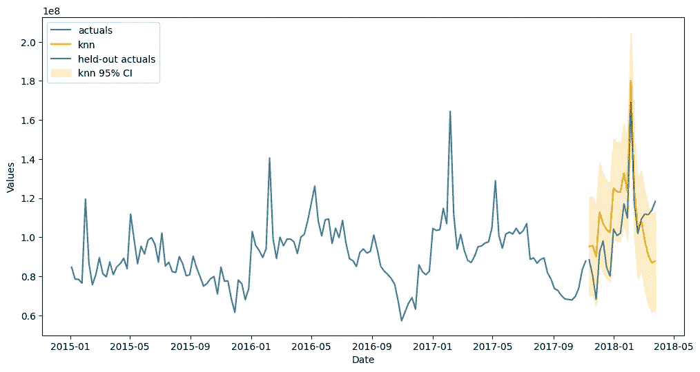
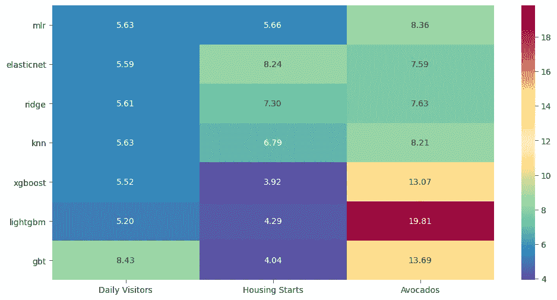
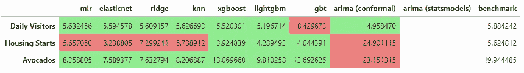

# **时间序列的简易分布无关保形区间**

> 原文：[`towardsdatascience.com/easy-distribution-free-conformal-intervals-for-time-series-665137e4d907`](https://towardsdatascience.com/easy-distribution-free-conformal-intervals-for-time-series-665137e4d907)

## 使用 Python 和你的测试集来推导与分布无关的区间

[](https://mikekeith52.medium.com/?source=post_page-----665137e4d907--------------------------------)[](https://towardsdatascience.com/?source=post_page-----665137e4d907--------------------------------) [Michael Keith](https://mikekeith52.medium.com/?source=post_page-----665137e4d907--------------------------------)

·发布于 [Towards Data Science](https://towardsdatascience.com/?source=post_page-----665137e4d907--------------------------------) ·7 分钟阅读·2023 年 2 月 15 日

--


图片由 [Gilly](https://unsplash.com/@gillyberlin?utm_source=medium&utm_medium=referral) 提供，来源于 [Unsplash](https://unsplash.com/?utm_source=medium&utm_medium=referral)

预测应用中，产生点估计的同时，确定实际值可能与预测值的偏差有多远也同样重要。大多数预测都不是 100%准确的，因此在处理模型实现时，对可能性的良好把握变得至关重要。对于具有基础函数形式的模型，如 ARIMA，可以使用假设的残差分布和估计的标准误差来确定置信区间。这些区间是合乎逻辑的，因为它们在预测超出已知最后值的范围时会扩展——随着不确定性的累积，这以一种与我们的直觉一致的数学方式表现出来。*如果*模型假设成立，则 95%的置信区间可以确保包含 95%的实际值。

# **保形预测**

然而，当处理一个没有简单方程表示的机器学习模型，并且假设数据没有任何分布时，创建一个合理的置信区间变得更加具有挑战性。一个流行的解决方案是**保形预测**。GitHub 仓库，[Awesome Conformal Prediction](https://github.com/valeman/awesome-conformal-prediction)，列出了许多很棒的资源，可以深入探讨这个想法。

这些资源之一是一个提供符合估计器的库，该估计器可以包裹在 scikit-learn 估计器周围：[mapie](https://github.com/scikit-learn-contrib/MAPIE)。我见过的应用此方法于时间序列的最佳方式之一是使用[tspiral 库](https://github.com/cerlymarco/tspiral)，该库在这里进行了概述。然而，如果时间序列在应用 scikit-learn 估计器之前已经被差分以实现平稳性，那么 mapie 符合预测最多只能带你到这一步。符合方法可以应用于差分后的系列，但当我们想要恢复到原始水平时会发生什么？如果我们只是以相同的方式将置信区间还原为未差分的点估计，结果区间通常会过宽。

这时，[scalecast](https://github.com/mikekeith52/scalecast)可以派上用场。它使用一种“幼稚”的符合预测方法，其中测试集用于找到一个百分位范围，以应用于未知范围的预测。当基础系列已被差分时，测试集实际值和预测值都未被差分，并且将百分位函数应用于样本外残差，以找出预测的可能覆盖率。这并不是完全科学的——例如，没有努力纠正结果残差中的自相关。但我相信它有效，通过用经验指标衡量其效果，也许我可以说服你相信这一点。

# MSIS

均值缩放区间分数由 Gneiting & Raftery 于 2007 年提出，用于衡量置信区间的有效性。得分越低越好。Makridakis 等人（2020）使用 MSIS 来评估 M4 竞赛的置信区间提交。这是他们对此的描述：

> 以下算法说明了如何在实践中估计 MSIS，并突出了它在比较两种不同预测方法生成的区间精度时的逻辑：
> 
> • 对每种方法在未来值超出指定范围的点计算罚分。这反映了每种方法的覆盖率。
> 
> • 预测区间的宽度会被加入到罚分中（如果有的话），以获得区间分数（IS）。在这方面，较大区间的方法会被处罚，而不是较小区间的方法，不论实现的覆盖率如何。
> 
> • 在各个点估计的 IS 会被平均，以得到均值区间分数（MIS）。
> 
> • MIS 通过将其值除以系列的均值绝对季节性差分进行缩放，正如 M4 中使用的 MASE 的情况，以使测量尺度独立。

我们可以使用 MSIS 来衡量 scalecast 间隔在机器学习模型上的有效性，并将这些模型与具有基础函数形式的更传统和可靠的时间序列模型——ARIMA 进行基准测试。为了使分析更加全面，我们将尝试三种不同的数据集：

+   [每日访问者](https://www.kaggle.com/datasets/bobnau/daily-website-visitors)：平稳的、大规模的、按日汇总的，并且比较容易预测

+   [住房开工](https://fred.stlouisfed.org/series/HOUSTNSA)：大规模的、按月的，将进行首次差分以实现平稳性

+   [鳄梨价格](https://www.kaggle.com/datasets/neuromusic/avocado-prices)：小规模的、按周的，将进行首次差分和季节性差分

所有数据集都可以公开分享。你可以在 [这里](https://scalecast-examples.readthedocs.io/en/latest/misc/cis/cis.html) 查看包含分析的完整笔记本。

# 代码语法

运行代码需要以下安装：

```py
pip install --upgrade scalecast
pip install tqdm
```

为了简要起见，我将只分享使用鳄梨数据集的笔记本代码。首先，库导入和数据加载：

```py
import pandas as pd
import numpy as np
from scalecast.Forecaster import Forecaster
from scalecast import GridGenerator
from scalecast.util import metrics, find_optimal_transformation
from scalecast.notebook import tune_test_forecast
from scalecast.SeriesTransformer import SeriesTransformer
import matplotlib.pyplot as plt
import seaborn as sns
import time
from tqdm.notebook import tqdm

avocados = pd.read_csv('avocado.csv',parse_dates = ['Date'])
volume = avocados.groupby('Date')['Total Volume'].sum()
```

让我们拆分数据，以确保一切都经过了合理的样本外测试：

```py
val_len = 20
fcst_len = 20

volume_sep = volume.iloc[-fcst_len:]
volume = volume.iloc[:-fcst_len]
```

该数据集较小，并且在差分和使用自回归项进行预测后，可用的观察量变得更少。因此，我们在测试集中使用 20 个观察值，在验证集中使用相同数量的观察值来构建间隔。二十个观察值是可靠形成 95% 置信区间所需的最小值，这也是我们将使用的。现在我们创建一个 [Forecaster](https://scalecast.readthedocs.io/en/latest/Forecaster/Forecaster.html) 对象：

```py
f = Forecaster(
    y = volume,
    current_dates = volume.index,
    future_dates = fcst_len,
    test_length = val_len,
    validation_length = val_len,
    cis = True, # adjust the width using the cilevel attribute
)
```

我们对数据应用首次差分，然后应用首次季节性差分，假设一个 52 周期的周期：

```py
transformer = SeriesTransformer(f)
f = transformer.DiffTransform(1)
f = transformer.DiffTransform(52) # seasonal differencing
```

我们现在使用 [auto_Xvar_select()](https://scalecast.readthedocs.io/en/latest/Forecaster/Forecaster.html#src.scalecast.Forecaster.Forecaster.auto_Xvar_select) 自动选择应用于预测的协变量：

```py
f.auto_Xvar_select(
    estimator='elasticnet',
    alpha=.2,
    max_ar=26,
    monitor='ValidationMetricValue', # not test set
    decomp_trend=False,
)

f
```

通过调用对象实例，我们看到选择了什么：

```py
Forecaster(
    DateStartActuals=2016-01-10T00:00:00.000000000
    DateEndActuals=2017-11-05T00:00:00.000000000
    Freq=W-SUN
    N_actuals=96
    ForecastLength=20
    Xvars=['AR1', 'AR2', 'AR3', 'AR4', 'AR5', 'AR6', 'AR7', 'AR8', 'AR9']
    Differenced=0
    TestLength=20
    ValidationLength=20
    ValidationMetric=rmse
    ForecastsEvaluated=[]
    CILevel=0.95
    CurrentEstimator=None
    GridsFile=Grids
)
```

在这种情况下，它只选择了 9 个自回归项/系列滞后。它也可能选择趋势和季节性协变量，但算法认为这些不会改善模型的准确性。系列已经进行了差分和季节调整，所以这并不令人惊讶。现在，我们选择我们的机器学习模型并用它们中的每一个评估一个预测：

```py
models = (
    'mlr',
    'elasticnet',
    'ridge',
    'knn',
    'xgboost',
    'lightgbm',
    'gbt',
) # these are all scikit-learn models or APIs

tune_test_forecast(
    f,
    models,
    dynamic_testing = fcst_len,
)
```

最后，我们将预测结果还原到原始序列水平并绘制结果：

```py
# revert differencing
f = transformer.DiffRevert(52)
f = transformer.DiffRevert(1)

fig, ax = plt.subplots(figsize=(12,6))
f.plot(ci=True,models='top_1',order_by='TestSetRMSE',ax=ax)
sns.lineplot(
    y = 'Total Volume',
    x = 'Date',
    data = volume_sep.reset_index(),
    ax = ax,
    label = 'held-out actuals',
    color = 'green',
    alpha = 0.7,
)
plt.show()
```



图片由作者提供

顶级表现模型 KNN 的预测和实际结果看起来都非常吻合。然而，一个模型在一个序列上永远无法讲述完整的故事。让我们看看所有应用模型在三个所选数据集上的结果。

# 所有结果

在所有三个时间序列上对 MSIS 分数的比较显示了分数的分散情况：



图片由作者提供

这些数字实际上意味着什么？很难说。MSIS 不是许多人习惯使用的指标，因此这些分数只有在与更熟悉的方法对比时才有意义。使用 auto-ARIMA 过程，我们现在对 [StatsModels 包](https://www.statsmodels.org/dev/generated/statsmodels.tsa.arima.model.ARIMA.html) 中的更标准区间进行评分——这些区间具有基本的函数形式和假设的分布。我们还可以使用相同的 ARIMA 模型，但应用符合区间来完成我们的基准。最终结果如下：



图片由作者提供

我们看到**绿色**代表 scalecast 区间优于 StatsModel ARIMA 区间，而**红色**则相反。好消息是我们看到很多绿色，验证了天真的符合区间方法。然而，并非一切都是好的。获得符合区间的 ARIMA 模型整体表现不如基准。此外，在 Housing Starts 数据集上，仅有三种 ML 模型优于 ARIMA。这些都值得深入探讨，但至少，我们可以高兴的是，在有差分和无差分的多样数据集上使用机器学习模型通常表现优于更传统的 ARIMA 方法。

# 结论

本文概述了使用 scalecast 包应用的符合区间。MSIS 区间分数应用于七种机器学习模型，跨三个多样的数据集，并与 ARIMA 进行基准对比。我们看到机器学习方法在大多数，但不是所有，实例中优于 ARIMA 方法。感谢您的关注，并请务必在 GitHub 上给 scalecast 赞一个！

[](https://github.com/mikekeith52/scalecast?source=post_page-----665137e4d907--------------------------------) [## GitHub - mikekeith52/scalecast: 从业者的预测库]

### Scalecast 是一种轻量级时间序列预测过程、封装器和结果容器，由应用领域的专家构建和维护…

github.com](https://github.com/mikekeith52/scalecast?source=post_page-----665137e4d907--------------------------------)

# 参考文献

Tilmann Gneiting 和 Adrian E Raftery (2007) 《严格的评分规则、预测和估计》，《美国统计协会杂志》，102:477, 359–378, DOI: [10.1198/016214506000001437](https://doi.org/10.1198/016214506000001437)

Makridakis, Spyros & Spiliotis, Evangelos & Assimakopoulos, Vassilios, 2020\. “[**M4 竞赛：100,000 个时间序列和 61 种预测方法**](https://ideas.repec.org/a/eee/intfor/v36y2020i1p54-74.html),” [《国际预测学杂志》](https://ideas.repec.org/s/eee/intfor.html)，Elsevier，第 36 卷（第 1 期），页码 54–74。
