# 有效的数据增强用于 OCR

> 原文：[`towardsdatascience.com/effective-data-augmentation-for-ocr-8013080aa9fa?source=collection_archive---------10-----------------------#2023-04-06`](https://towardsdatascience.com/effective-data-augmentation-for-ocr-8013080aa9fa?source=collection_archive---------10-----------------------#2023-04-06)

## 我实现最后几个百分点的（ac）cu(re)teness 的秘诀

[](https://toon-beerten.medium.com/?source=post_page-----8013080aa9fa--------------------------------)[](https://towardsdatascience.com/?source=post_page-----8013080aa9fa--------------------------------) [Toon Beerten](https://toon-beerten.medium.com/?source=post_page-----8013080aa9fa--------------------------------)

·

[关注](https://medium.com/m/signin?actionUrl=https%3A%2F%2Fmedium.com%2F_%2Fsubscribe%2Fuser%2F3aef462e13b5&operation=register&redirect=https%3A%2F%2Ftowardsdatascience.com%2Feffective-data-augmentation-for-ocr-8013080aa9fa&user=Toon+Beerten&userId=3aef462e13b5&source=post_page-3aef462e13b5----8013080aa9fa---------------------post_header-----------) 发表在 [Towards Data Science](https://towardsdatascience.com/?source=post_page-----8013080aa9fa--------------------------------) ·7 min read·2023 年 4 月 6 日[](https://medium.com/m/signin?actionUrl=https%3A%2F%2Fmedium.com%2F_%2Fvote%2Ftowards-data-science%2F8013080aa9fa&operation=register&redirect=https%3A%2F%2Ftowardsdatascience.com%2Feffective-data-augmentation-for-ocr-8013080aa9fa&user=Toon+Beerten&userId=3aef462e13b5&source=-----8013080aa9fa---------------------clap_footer-----------)

--

[](https://medium.com/m/signin?actionUrl=https%3A%2F%2Fmedium.com%2F_%2Fbookmark%2Fp%2F8013080aa9fa&operation=register&redirect=https%3A%2F%2Ftowardsdatascience.com%2Feffective-data-augmentation-for-ocr-8013080aa9fa&source=-----8013080aa9fa---------------------bookmark_footer-----------)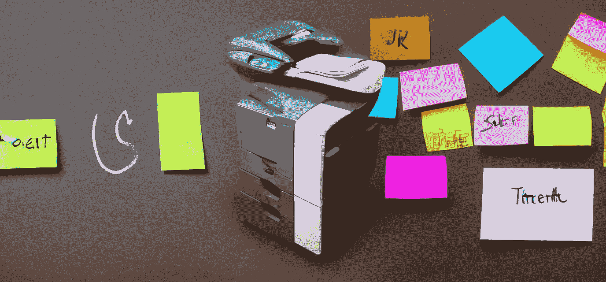

作者图片（生成的 [with](https://huggingface.co/spaces/albarji/mixture-of-diffusers)）

## **背景**

我面临了一个挑战，即手写金额需要尽可能精确地识别。困难在于将误报率保持在 0.01%以下。数据集中的样本数量是固定的，所以数据增强是合逻辑的选择。快速搜索发现没有现成的光学字符识别（OCR）方法。因此，我卷起袖子自己创建了一个数据增强程序。这个程序在训练期间被使用，帮助我的模型达到了目标。继续阅读以了解详细情况。

> 通过在每次训练图像时引入小的变化，模型不容易过拟合，从而更好地进行泛化。我将其与 TROCR 结合使用，但任何其他模型也应受益。

## **测试设置**

由于我不能分享我专有数据集中的图像，我想使用[IAM 手写数据库](https://fki.tic.heia-fr.ch/databases/iam-handwriting-database)中的样本，但我没有收到使用这些图像的许可回复。因此，我创建了一些自己的示例来进行演示。

我将使用 O[penCV](https://opencv.org/)和[albumentations](https://albumentations.ai/)库，进行三种类型的变换：形态学、噪声和变换。

> OpenCV 是一个知名的计算机视觉库。Albumentations 是一个相对较新的 Python 库，提供了简单而强大的图像增强功能。

还有一个很棒的[演示网站](https://demo.albumentations.ai/)，你可以试试 albumentations 能做什么。然而它有一定的限制，因为你不能使用自己的图像进行测试。因此，我创建了一个 Jupyter [笔记本](https://github.com/Toon-nooT/notebooks)，用于渲染本文中的所有增强图像。你可以在[colab](https://colab.research.google.com/github/Toon-nooT/notebooks/blob/main/OCR_data_augmentations.ipynb)中打开并进行实验。

我将首先展示这些变换及其一些解释，然后讨论我将它们结合在一起的技术。我假设所有图像都是灰度图像，并且已经进行了对比度增强（例如 CLAHE）。

## 第一种增强技术：**形态学**变换

这些与结构形式有关。简单来说：它们可以用来使文本线条看起来像是用更细或更粗的笔书写的。它们被称为*腐蚀*和*膨胀*。不幸的是，这些还不是（还？）albumentations 库的一部分，因此我必须借助 opencv 来实现。

为了创造出某人使用了更粗线宽的笔的效果，我们可以对原图进行**膨胀**处理：

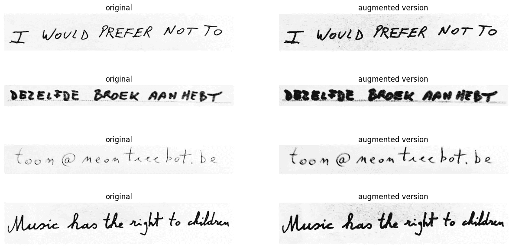

原始图像与膨胀效果 (*图片由作者提供*)

另一方面，**腐蚀**（有意的双关）模拟了文本是用更细的笔书写的效果：

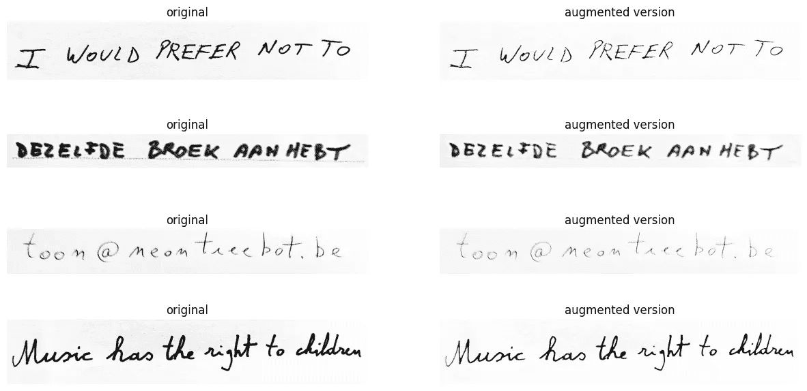

原始图像与腐蚀效果 (*图片由作者提供*)

在这里要小心，最后一个参数——即迭代次数——不要设置得太高（这里设置为 3），否则你最终会得到完全去除的手写字。

```py
cv2.dilate(img, kernel,iterations=random.randint(1, 3))
```

对于我的数据集，我只能设置为 1，因此这确实取决于你的数据。

## 第二种增强技术：**噪声引入**

我们可以选择从图像中去除黑色像素或添加白色像素。对此有几种方法。我尝试了许多方法，但这是我的简短清单：

**随机降雨**与**黑色**滴水颜色非常具有破坏性。即使对我来说也很难阅读文本。因此，我选择将这种情况发生的概率设置得非常低：

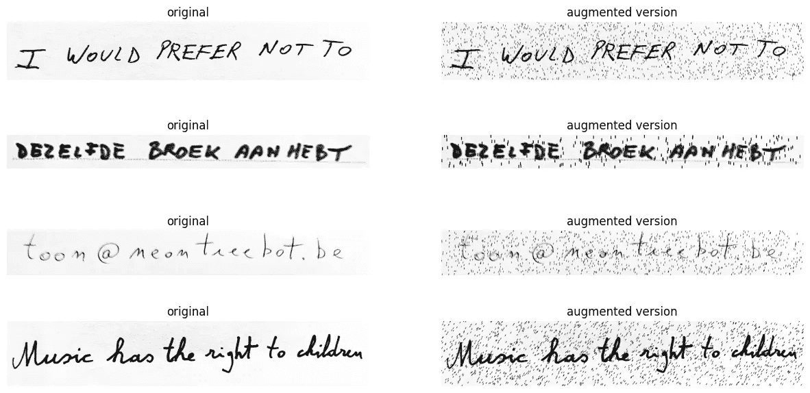

RandomRain 示例（*图片来源：作者*）

**RandomShadow** 将用不同强度的线条涂抹文本：

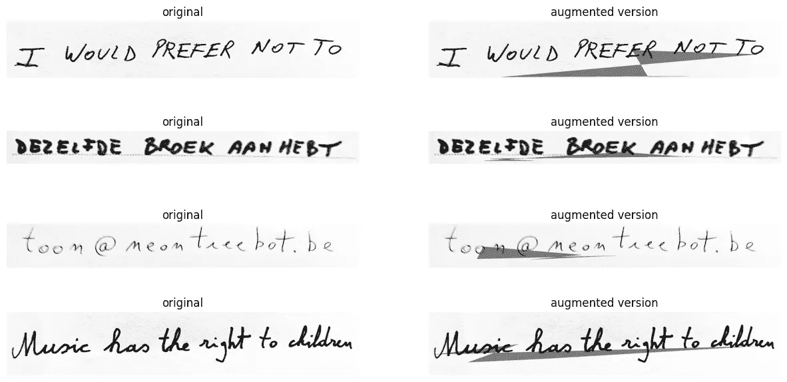

RandomShadow（*图片来源：作者*）

**PixelDropout** 轻轻将随机像素变为黑色：


使用 PixelDropout 的黑色像素（*图片来源：作者*）

与黑色滴落不同，**RandomRain** 使用 **白色** 滴落颜色会使书写变得支离破碎，这使得训练变得更加困难。就像你在复印传真复印件时看到的那种劣质效果一样。这种变换发生的概率可以设得更高。

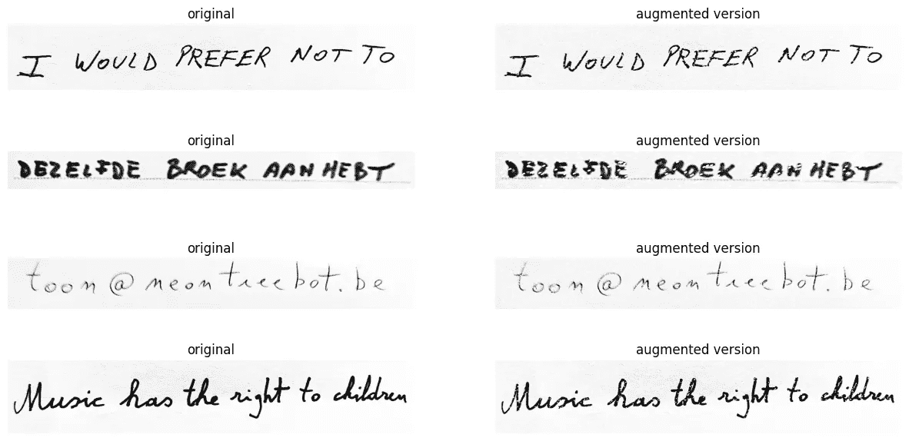

RandomRain — 白色版本（*图片来源：作者*）

在较小程度上，**PixelDropout** 对 **白色** 的处理也是如此。但它更多地导致了一种更普遍的褪色图像：

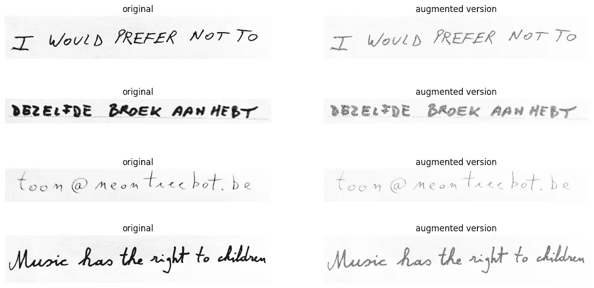

使用 PixelDropout 的白色像素（*图片来源：作者*）

## 第三种增强技术：变换

**ShiftScaleRotate**：在这里需要注意参数。尽量避免文本被切割并超出原始尺寸。这里有缩放和旋转。请确保不要过度使用过大的参数。否则，你会有更大的机会让第一个样本发生。你可以看到它实际上将文本移动到图像之外。这可以通过选择更大的边界框来防止——从而有效地在文本周围添加更多的空白。

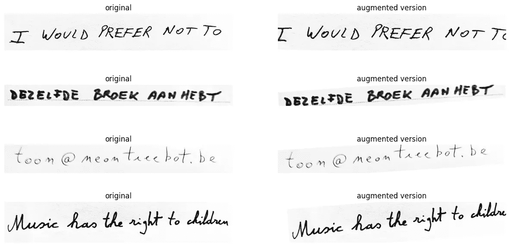

放大和旋转（*图片来源：作者*）

**模糊**。这个旧而可靠的方法，将以不同的强度执行。

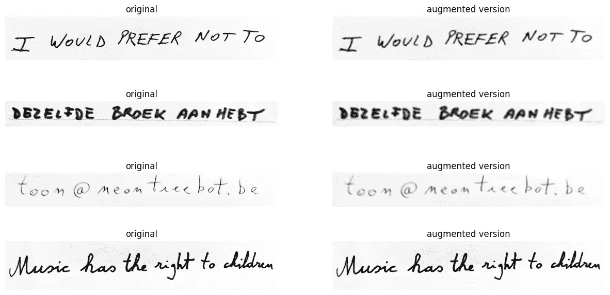

模糊的手写文本（*图片来源：作者*）

**大结局：将它们全部结合起来：**

这就是力量所在。我们可以随机组合这些效果来创建独特的图像，以包含在每个训练周期中。需要仔细考虑的是，避免使用太多相同类型的方法。我们可以使用 albumentation 中的 *OneOf* 函数来做到这一点。*OneOf* 包含一个可能的变换列表，正如名字所示，它只会以概率 P 执行其中之一。因此，将做得更多或更少相同的变换组合在一起是有意义的，以避免过度使用。以下是该函数：

```py
import random
import cv2
import numpy as np
import albumentations as A

#gets PIL image and returns augmented PIL image
def augment_img(img):
  #only augment 3/4th the images
  if random.randint(1, 4) > 3:
      return img

  img = np.asarray(img)     #convert to numpy for opencv

  # morphological alterations
  kernel = cv2.getStructuringElement(cv2.MORPH_ELLIPSE,(3,3))
  if random.randint(1, 5) == 1:
    # dilation because the image is not inverted
    img = cv2.erode(img, kernel, iterations=random.randint(1, 2))
  if random.randint(1, 6) == 1:
    # erosion because the image is not inverted
    img = cv2.dilate(img, kernel,iterations=random.randint(1, 1))

  transform = A.Compose([

    A.OneOf([
      #add black pixels noise
      A.OneOf([
             A.RandomRain(brightness_coefficient=1.0, drop_length=2, drop_width=2, drop_color = (0, 0, 0), blur_value=1, rain_type = 'drizzle', p=0.05), 
              A.RandomShadow(p=1),
              A.PixelDropout(p=1),
         ], p=0.9),

      #add white pixels noise
      A.OneOf([
              A.PixelDropout(dropout_prob=0.5,drop_value=255,p=1),
             A.RandomRain(brightness_coefficient=1.0, drop_length=2, drop_width=2, drop_color = (255, 255, 255), blur_value=1, rain_type = None, p=1), 
        ], p=0.9),
    ], p=1),

    #transformations
    A.OneOf([
            A.ShiftScaleRotate(shift_limit=0, scale_limit=0.25, rotate_limit=2, border_mode=cv2.BORDER_CONSTANT, value=(255,255,255),p=1),
            A.ShiftScaleRotate(shift_limit=0.1, scale_limit=0, rotate_limit=8, border_mode=cv2.BORDER_CONSTANT, value=(255,255,255),p=1),
            A.ShiftScaleRotate(shift_limit=0.02, scale_limit=0.15, rotate_limit=11, border_mode=cv2.BORDER_CONSTANT, value=(255,255,255),p=1),  
            A.Affine(shear=random.randint(-5, 5),mode=cv2.BORDER_CONSTANT, cval=(255,255,255), p=1)          
       ], p=0.5),
    A.Blur(blur_limit=5,p=0.25),
  ])
  img = transform(image=img)['image']  
  image = Image.fromarray(img)   
  return image
```

> P 代表某事发生的概率。它是一个介于 0 和 1 之间的值，其中 1 表示它总是发生，0 表示它从不发生。

那么，让我们看看它的实际效果：

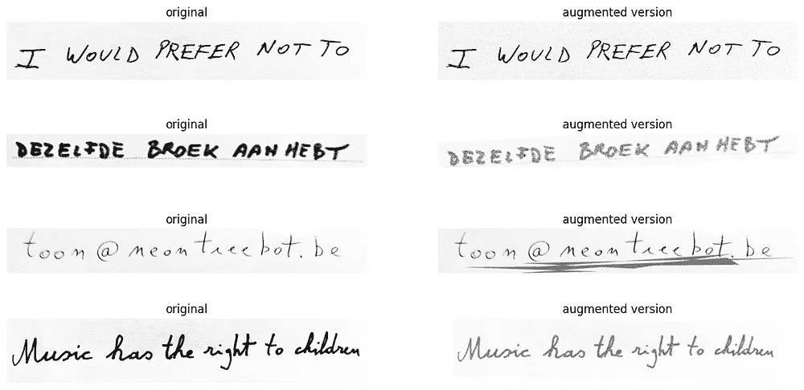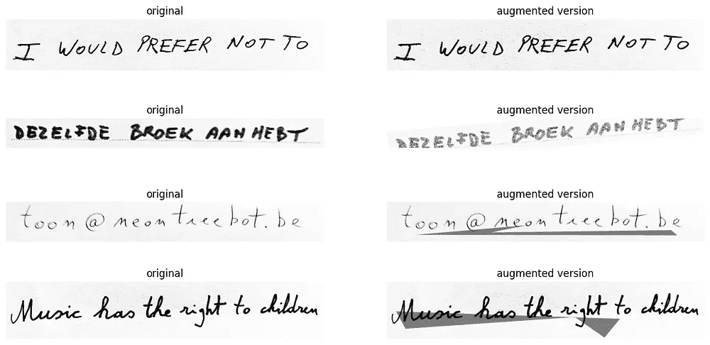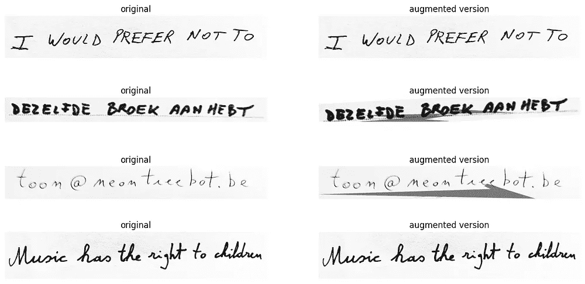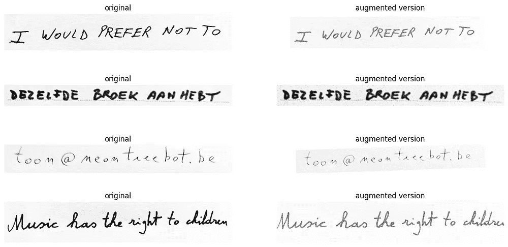

增强的文本（*图片来源：作者*）

看起来相当不错，不是吗？

## **另一种方法：** 🌮

在 [EASTER 2.0](https://arxiv.org/abs/2205.14879) 论文中，他们提出了 [TACo](https://github.com/kartikgill/taco-box) 技术。它代表了 Tiling 和 Corruption。（🌮 哈哈）

它能够做到这一点：

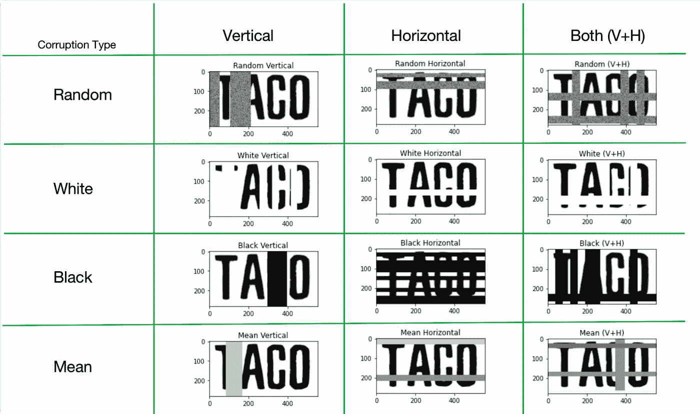

图像来源：[Kartik Chaudhary / Raghav Bali](https://github.com/kartikgill/taco-box)

我还没有尝试过，因为我的直觉告诉我原始数据被破坏得太多。依我看，如果我读不出来，计算机也读不出来。不过，当你考虑到作为人类，你可以猜测‘TACO’，如果你看到‘TA█O’时，我们会查看周围的字母。而‘taco’是一个常见的词。但是背后有字典的计算机可能会将其识别为‘TAMO’，这恰好是‘japanese ash’的英文词。*。

# 结论

我们讨论了许多图像处理方法以及它们如何对 OCR 任务有用。我希望这对你有帮助，或者至少能给你一些灵感，让你自己尝试。你可以使用我的配方作为基础，但你可能需要对一些参数进行微调，以使其对你的数据集完美。让我知道你的模型准确度提高了多少！

我在这个 Jupyter [notebook](https://github.com/Toon-nooT/notebooks/blob/main/OCR_data_augmentations.ipynb) 中公开了该技术。

你可能还喜欢：

[](https://toon-beerten.medium.com/hands-on-document-data-extraction-with-transformer-7130df3b6132?source=post_page-----8013080aa9fa--------------------------------) [## 实操：使用🍩 transformer 进行文档数据提取

### 我使用 donut transformers 模型提取发票索引的经历。

toon-beerten.medium.com](https://toon-beerten.medium.com/hands-on-document-data-extraction-with-transformer-7130df3b6132?source=post_page-----8013080aa9fa--------------------------------)

参考资料：

[](https://opencv.org/?source=post_page-----8013080aa9fa--------------------------------) [## 主页 - OpenCV

### OpenCV 提供了一个实时优化的计算机视觉库、工具和硬件。它还支持模型执行…

opencv.org](https://opencv.org/?source=post_page-----8013080aa9fa--------------------------------) [](https://albumentations.ai/?source=post_page-----8013080aa9fa--------------------------------) [## Albumentations

### 为什么选择 Albumentations？Albumentations 是一个用于快速和灵活图像增强的 Python 库。Albumentations…

albumentations.ai](https://albumentations.ai/?source=post_page-----8013080aa9fa--------------------------------) [](https://fki.tic.heia-fr.ch/databases/iam-handwriting-database?source=post_page-----8013080aa9fa--------------------------------) [## 计算机视觉与人工智能研究组 - 计算机视觉与人工智能…

### IAM 手写数据库包含可以用于训练和测试手写文本的英语手写表单…

[Easter2.0：提高手写文本识别的卷积模型](https://fki.tic.heia-fr.ch/databases/iam-handwriting-database?source=post_page-----8013080aa9fa--------------------------------) 

### 卷积神经网络（CNN）在手写文本识别（HTR）任务中已显示出有前景的结果，但…

[arxiv.org](https://arxiv.org/abs/2205.14879?source=post_page-----8013080aa9fa--------------------------------)

### 你现在无法执行该操作。你已在另一个标签或窗口中登录。你在另一个标签或窗口中已退出…

[GitHub - Toon-nooT/notebooks](https://github.com/Toon-nooT/notebooks?source=post_page-----8013080aa9fa--------------------------------)
