# 有效的数据可视化：9 个有价值的技巧，提高图表质量

> 原文：[`towardsdatascience.com/effective-data-visualization-9-valuable-tips-to-increase-the-quality-of-your-charts-5fec31144a6d`](https://towardsdatascience.com/effective-data-visualization-9-valuable-tips-to-increase-the-quality-of-your-charts-5fec31144a6d)

## 如何通过细微的修改显著提升视觉化效果的传达力

 [Thomas A Dorfer](https://thomasdorfer.medium.com/?source=post_page-----5fec31144a6d--------------------------------)

·发布在 [Towards Data Science](https://towardsdatascience.com/?source=post_page-----5fec31144a6d--------------------------------) ·10 分钟阅读·2023 年 3 月 13 日

--

图片来源：[Mohamed Hassan](https://pixabay.com/users/mohamed_hassan-5229782/) 通过 [Pixabay](https://pixabay.com/illustrations/planning-finance-business-4077086/)

看看上面的那位可怜的家伙。他辛苦了几天，从数据中提取有意义的见解，却没能有效地向上司传达这些见解。尽管他的重大演示的截止日期仅剩几个小时，但他仍然没有意识到他准备的图表比实际有用的信息更令人困惑。饼图的选择很糟糕，因为它要求读者估计角度，而我们人类在这方面确实很差。那彩色条形图也不会对他有任何帮助，因为他显然不恰当地使用了颜色属性，可能让读者疑惑是否在看不同的类别，但实际上并非如此。

让我们来帮他一把，好吗？在阅读下面的文章后，我们将能够建议他如何制作更有说服力的视觉效果，确保他的发现被明确传达，他的辛勤工作得到应有的认可。

## 介绍

数据可视化是数据科学家用于获取探索性见解、可视化趋势和模式或向利益相关者传达结果的一个重要技术。然而，这些图表常常缺乏清晰度，难以阅读和解释，或者信息过于拥挤，无法从中提取出有意义的见解。

反之亦然。一个包含最少信息的视觉表现可能完全过时，简单的数字表示或表格可能是更好的选择。

本文提供了 9 个宝贵的建议，帮助你避免这些情况，并提高你所要传达信息的清晰度和有效性。

## 1\. 确定图表使用是否合适。

你见过这样的图表吗？

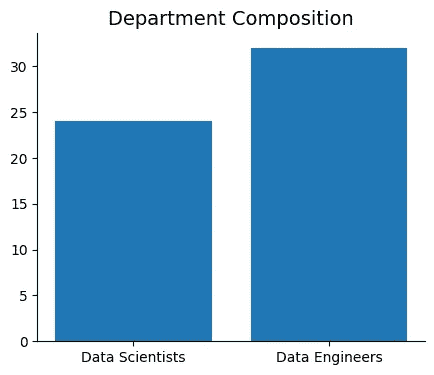

作者提供的图像。

是的，我也是。如果爱德华·塔夫特看到这个，他会称之为[图表垃圾](https://en.wikipedia.org/wiki/Chartjunk#:~:text=The%20term%20chartjunk%20was%20coined,Visual%20Display%20of%20Quantitative%20Information.)，这正是它的本质。以图表形式呈现两个数值不会为数据添加任何价值或见解。实际上，它让从图表中读取确切数字变得不必要地困难。你能告诉我那个部门有多少数据工程师吗？是 33 还是 34？

实际上，是 32。看见了吗？在这里，直接以书面描述报告具体数值会更有效。例如：

> 我们部门目前有 24 名数据科学家和 32 名数据工程师。

那么，什么时候使用图表而不是原始数字更合适呢？实际上没有严格的规则，这通常取决于数据的复杂性、目标受众以及你希望传达的信息。然而，作为一般性指导，如果你的数据包含**三个以上的数值**，考虑使用图表并以视觉形式呈现可能会很有价值，尤其是当这样能够让你揭示数据中的趋势和模式时。

## 2\. 如果精确性很重要，使用表格而不是图表。

虽然图表是可视化数值关系、趋势、分布或时间序列数据的好选择，但它们毕竟是一种抽象，通常不会显示底层的精确数字。然而，在某些领域，例如医学和金融，精确性至关重要。在这种情况下，表格是首选。

看一下以下两个表示：

作者提供的图像

尽管这两者基于相同的数据，但货币转换以表格形式显示精确数字要比图表更好，这样读者就不需要猜测那些小数点。

## 3\. 使用正确的坐标轴标签并确保其可读性。

如果你不知道自己在看什么，图表有多有用？为了避免混淆并确保读者能充分理解你的视觉内容，请确保坐标轴标记正确——展示出所呈现的维度及其单位——并且标签清晰可读。

以下是一个展示功率（马力）和燃油效率（每加仑多少英里）关系的散点图，基于一部分公开的[汽车 MPG 数据集](https://archive.ics.uci.edu/ml/datasets/auto+mpg) [1]。

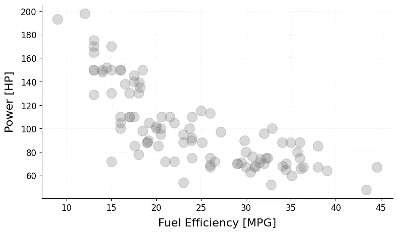

作者提供的图像。

请注意，坐标轴既清晰又有明确标签，采用传统的`Dimension [Unit]`风格，使得此图表易于阅读，并消除了任何解释上的模糊。

## 4\. 适当地使用颜色。

不久前，我遇到过一个看起来像这样子的柱状图：

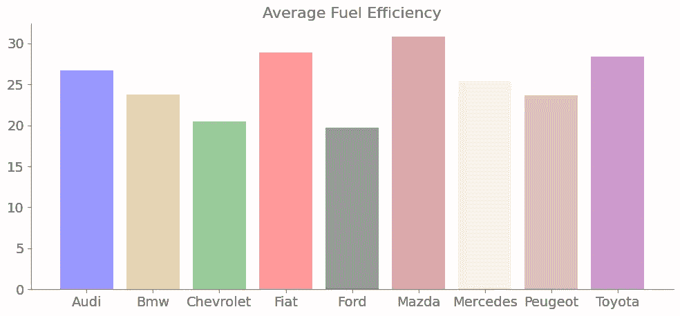

图片由作者提供。

虽然这可能看起来很漂亮，但色彩调色板却带来了更多的混乱而非清晰。在数据可视化中，不同的颜色通常与不同的维度或类别相关联。以下是与上述相同的图表，但颜色属性被用来突出每个汽车制造商的原产国：

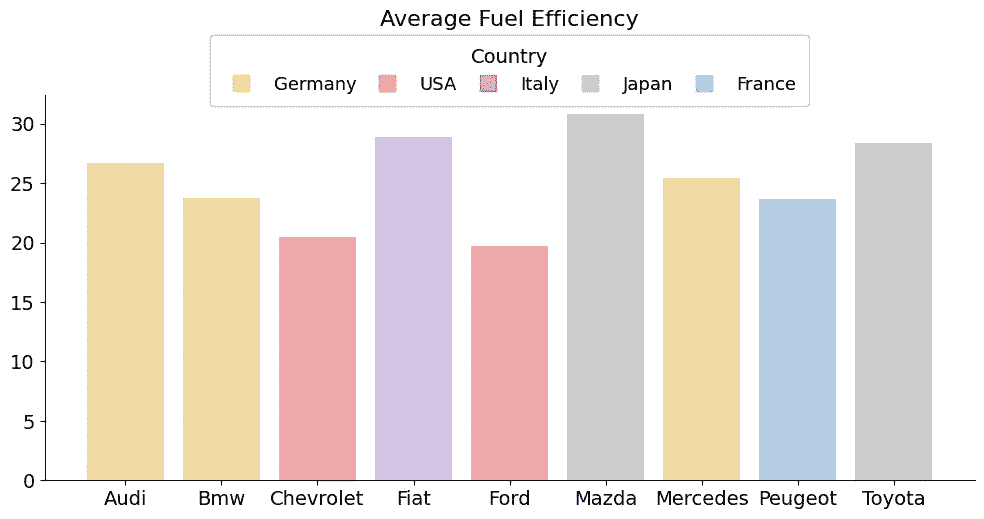

图片由作者提供。

为了更进一步强调适当使用颜色的重要性，这里有另一个例子：

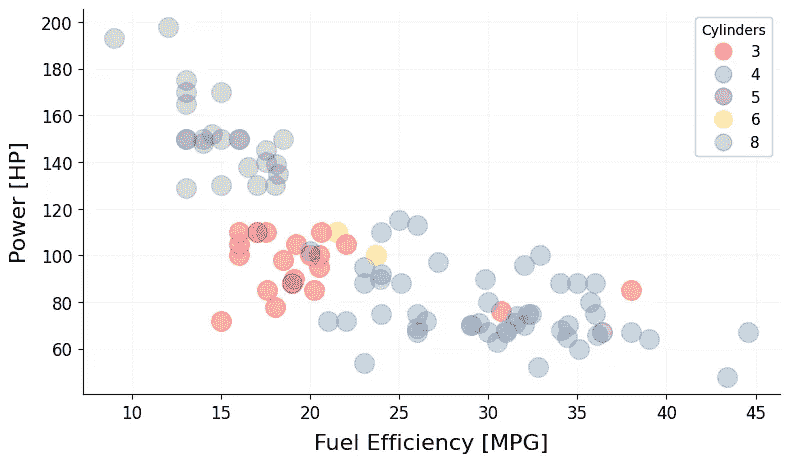

图片由作者提供。

这是与上一节中展示的图表相同的图，但这里使用颜色属性为每辆车的气缸数量添加了一个额外的信息维度。

回到本节开头展示的五彩柱状图——这里只展示了燃油效率的数量。然而，这样五彩斑斓的图表可能会让读者质疑这些颜色是否有任何意义，而在这种情况下，它们并没有。

如果可视化的唯一目的是传达每个汽车制造商的平均燃油效率，那么更清晰的解决方案是将所有条形图绘制为统一颜色，以避免任何歧义。为了进一步改善视觉效果，可以对条形图进行排序，以帮助读者识别潜在的趋势。现在，图表看起来是这样的：

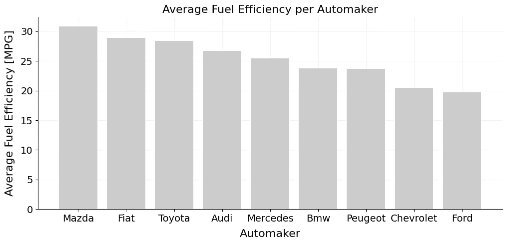

图片由作者提供。

你不觉得这是一种更清晰的传达方式吗？

如果你对数据可视化中的颜色使用感兴趣，请务必查看[Kate Strachnyi](https://medium.com/u/fc065d3295b8?source=post_page-----5fec31144a6d--------------------------------)的书籍[ColorWise](https://www.oreilly.com/library/view/colorwise/9781492097839/)。

## 5\. 避免使用饼图。

现在让我们将上述每个汽车制造商的平均燃油效率的柱状图转换为饼图形式：

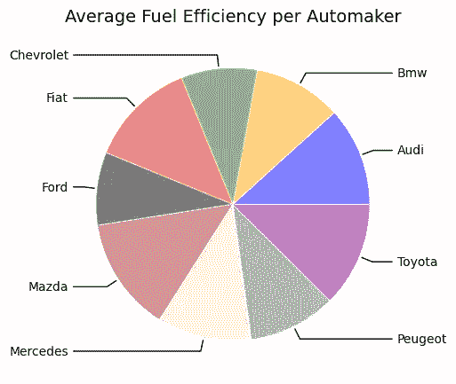

图片由作者提供

嗯，还需要多说吗？

饼图极其难以解读，因为它们要求我们能够准确读取角度，而我们人类通常对此不太擅长。例如，你能判断奥迪还是丰田的平均燃油效率更好吗？宝马与标致呢？

柱状图，比如上一节中的图表，几乎总是更好的选择。或者，正如爱德华·塔夫提所说：

> …比饼图更糟糕的设计是多个饼图…… — 爱德华·塔夫提

PS：甜甜圈图也是一样的道理。

## 6\. 使用对数刻度来可视化高差异和相对变化。

有时，你可能会碰到一些数据，包含**巨大的差异**。看看下面的图表，显示了公司各层级的年薪（用线性刻度）：

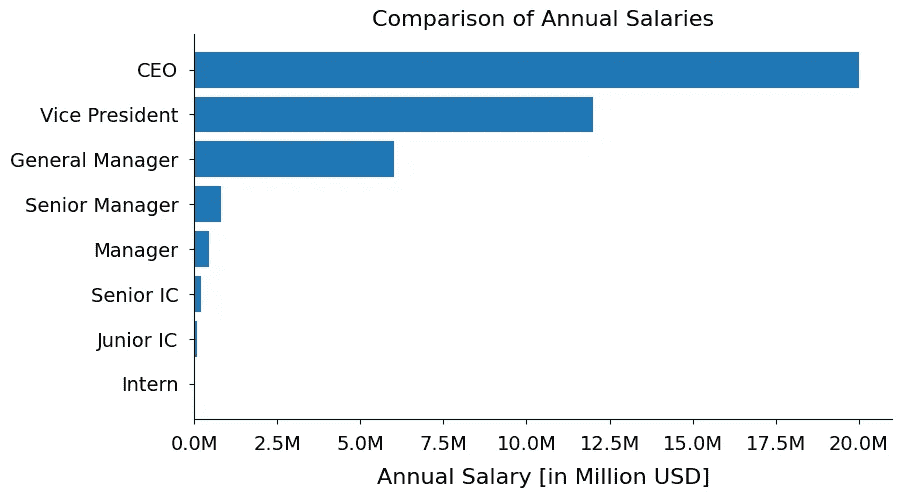

作者提供的图片。

尽管读取高层管理人员的薪资很直接，但当你向下层级移动时，就变得越来越困难。一旦到达个体贡献者（IC）层级，它基本上就成了一个猜测游戏。实习生的薪酬完全不可见。为了解决这个问题，薪资数据可以用对数（log）刻度来绘制，结果如下：

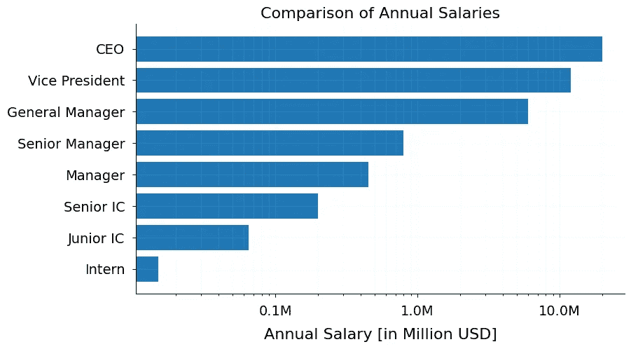

注意现在在整个公司层级中读取薪资是多么容易。

另一个对数刻度派上用场的场景是当你希望可视化**相对变化**时。假设 30 年前，你决定投资 10,000 美元于一个指数基金，并且从那时起它以每年 9% 的速度稳定增长。用线性刻度绘制这种增长会是这样的：

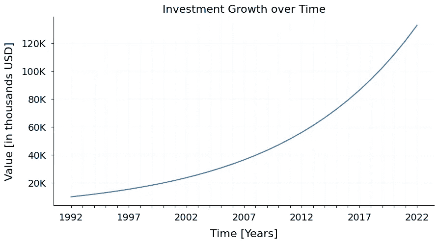

作者提供的图片。

虽然这是一种展示投资增长的好方法，但如果你的目标是展示其每年 9% 的稳定增长率，这并不理想。为了实现这一点，你可以在对数刻度上绘制这些数据：

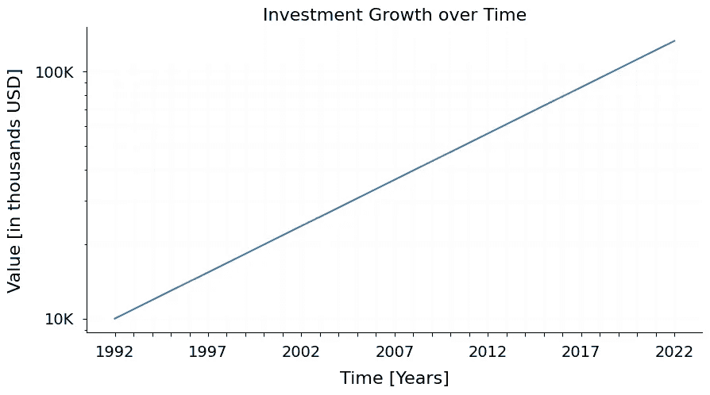

作者提供的图片。

现在这个图表清晰地突出了这项投资在过去 30 年中经历的稳定增长率。

## 7\. 在使用 3D 图形前请三思。

我明白，我真的明白。3D 图表似乎有那种额外的华丽——深度、阴影、奇特的角度——让它们在第一眼看上去非常吸引人。

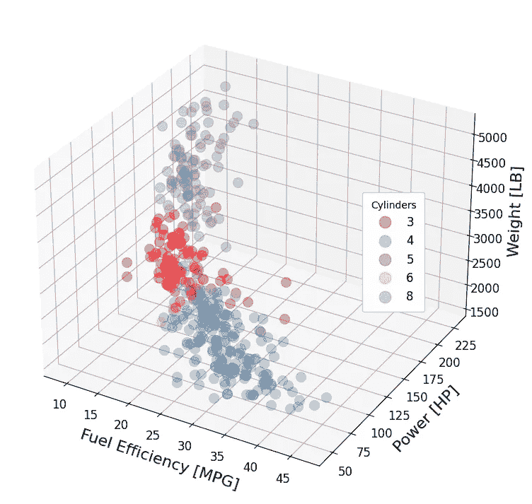

作者提供的图片。

然而，大多数情况下，这些额外的修饰会扭曲基础数据。这是因为 3D 图形仍然被投影到二维空间中，从而在平面上产生了一个*深度的错觉*。这使得我们的脑袋很难处理信息并得出明确的结论。

例如，在上面的图中，很多数据点被其他点遮挡。尽管可以采取一些措施来缓解这个问题，例如使用透明度或降低圆圈的大小，但这并没有解决扭曲的根本问题。

你现在可能不惊讶塔夫提对此也有话要说：

> 外观装饰，常常扭曲数据，永远无法弥补内容的不足。——爱德华·塔夫提

当然，这也有例外。有时你可能会遇到一些情况，使用 3D 可视化会有所帮助，比如表面图或[这些美丽的人口密度图](https://www.theinspiration.com/2023/01/population-density-maps-by-terence-fosstodon/)。如果你的可视化是交互式的，并允许用户充分探索，那也是可以的。但作为一般指南，3D 图表应尽可能避免，特别是对于像条形图和散点图这样的简单图表。

## 8\. 确保可访问性。

如果只有少部分人能阅读图表，那它有什么用呢？

生产可访问的图表确保所有人，不论能力如何，都能平等访问数据，并利用这些见解做出更明智的决策。不幸的是，在数据可视化领域，可访问性常常优先级较低，尽管对此问题的意识似乎在上升。

在这方面的一些最佳实践包括使用文本和背景、颜色和背景之间的高对比度，以及颜色之间的对比度。如果可能的话，还应避免在图表中一起使用红色和绿色，以使图表对色盲人士更友好。此外，提供替代文本以及更具描述性的标题和标签可以帮助使用辅助技术（如屏幕阅读器）的人。

例如，看看以下图表：

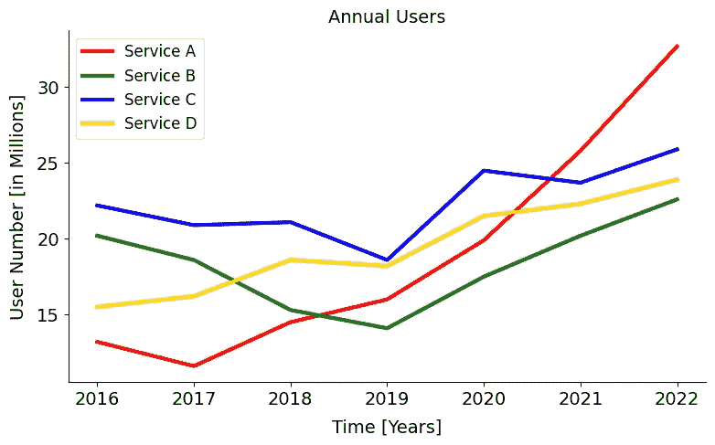

图片由作者提供。

我们可以模拟这对无法感知红色光的人的视觉效果，例如，色盲：

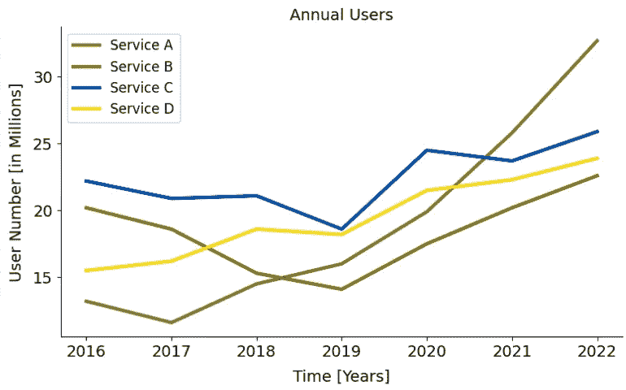

图片由作者提供，使用了[Coblis 色盲模拟器](https://www.color-blindness.com/coblis-color-blindness-simulator/)。

在这个图表中，服务 A 和服务 B 几乎无法区分。这突显了使可访问性工具成为数据可视化从业者常规实践的重要性。

关于如何使你的可视化更具可访问性的更全面指南，我推荐查看[这篇博客文章](https://www.highcharts.com/blog/tutorials/10-guidelines-for-dataviz-accessibility/)。

## 9\. 注意偏见。

如果你关注过金融市场，你可能会注意到[一个特别的怪异现象](https://www.bbc.com/news/av/business-33464903)：与大多数市场相比，中国的股票上涨时显示为红色，而下跌时显示为绿色。这是因为在中国，红色被视为幸运色。

这只是许多**文化关联**中的一个例子，突显了根据你的观众量身定制可视化的重要性，并确保颜色或符号等属性的使用是一致且经过深思熟虑的。

在准备你的可视化时，还有许多其他偏见需要注意。最常见的一些包括：

+   **确认偏差：** 以确认自己预先存在的信念的方式展示数据的倾向。

+   **标签偏差：** 观众对标签的感知扭曲。例如，将一个群体标记为“罪犯”而不是“被逮捕的人”可能会导致重大误解和过早的判断。

通过注意这些偏差，你可以确保所呈现的数据不会在观众的感知中导致任何误解。

## 结论

数据可视化对于以清晰明确的方式有效传达信息至关重要。通过遵循一些简单的提示和最佳实践，如首先确定是否需要图表、适当使用颜色、启用无障碍功能，或者注意可能渗透到图表中的偏差，可以制作出高质量的可视化，能够有效地传达给目标观众预期的信息。

所以，在阅读了这篇文章后，你认为你能帮助我们上面的朋友吗？

## 参考文献

[1] Quinlan, R. (1993). [结合基于实例和基于模型的学习](https://www.sciencedirect.com/science/article/pii/B978155860307350037X?via%3Dihub=). 收录于第十届国际机器学习会议论文集，236–243 页，麻省大学，阿默斯特。摩根·考夫曼。许可证：知识共享许可证（CC0）。

## 喜欢这篇文章吗？

让我们保持联系！你可以在[Twitter](https://twitter.com/ThomasADorfer)和[LinkedIn](https://www.linkedin.com/in/thomasdorfer/)找到我。

如果你喜欢支持我的写作，你可以通过[Medium 会员](https://thomasdorfer.medium.com/membership)来实现，这样你可以访问我所有的故事以及 Medium 上其他成千上万位作家的作品。

 [## 使用我的推荐链接加入 Medium - Thomas A Dorfer

### 阅读 Thomas A Dorfer 的每一个故事（以及 Medium 上成千上万其他作家的故事）。你的会员费直接支持……

medium.com](https://medium.com/@thomasdorfer/membership?source=post_page-----5fec31144a6d--------------------------------)
