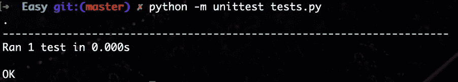
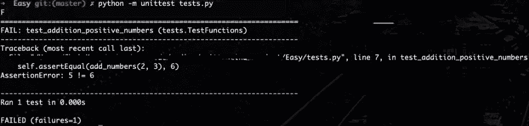
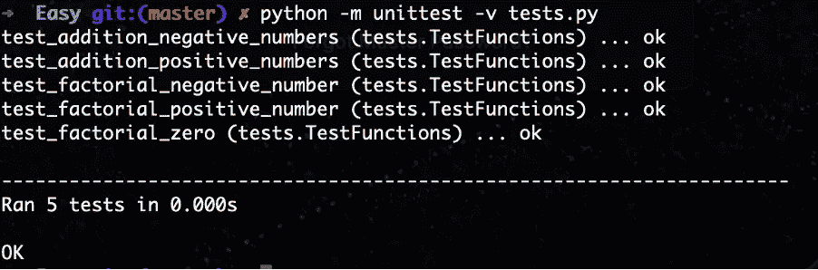
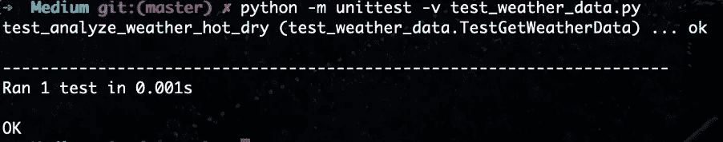
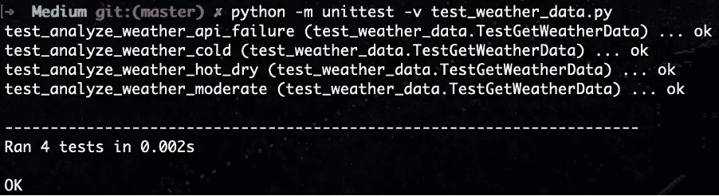
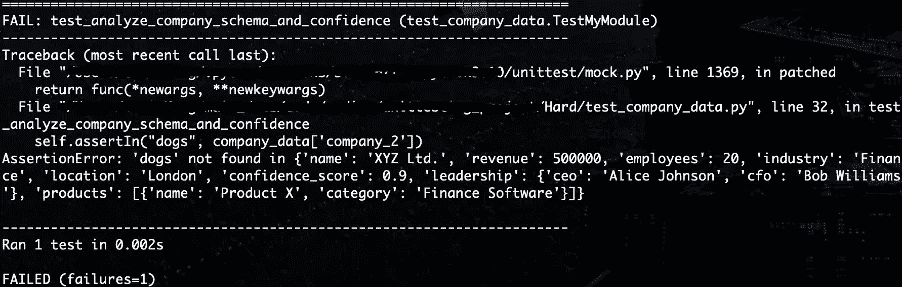
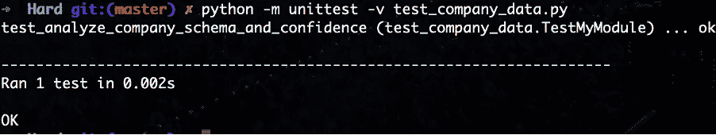

# Python 中的有效单元测试 — 带示例

> 原文：[`towardsdatascience.com/effective-unit-testing-in-python-with-examples-3860d7fac7cd`](https://towardsdatascience.com/effective-unit-testing-in-python-with-examples-3860d7fac7cd)

[](https://medium.com/@christopher_karg?source=post_page-----3860d7fac7cd--------------------------------)[](https://towardsdatascience.com/?source=post_page-----3860d7fac7cd--------------------------------) [Christopher Karg](https://medium.com/@christopher_karg?source=post_page-----3860d7fac7cd--------------------------------)

·发表于 [Towards Data Science](https://towardsdatascience.com/?source=post_page-----3860d7fac7cd--------------------------------) ·16 分钟阅读·2023 年 10 月 1 日

--


来源: [`www.pexels.com/photo/red-vintage-car-stopped-on-the-crossroads-15706251/`](https://www.pexels.com/photo/red-vintage-car-stopped-on-the-crossroads-15706251/)

我的下一篇文章是关于 Python 中的单元测试。这个话题我发现经常被忽视在课程、书籍和在线教程中。然而，它是创建生产级、无漏洞代码时至关重要的技能。本文中的场景有些偏向于数据/数据科学领域。因此，我对“有效”的单元测试的看法可能与来自不同背景的人有所不同。

> 编写单元测试的**终极**目标是防止错误被推送到生产环境中。

这导致了许多头痛的问题和解决这些问题的时间。不同的公司有不同的测试方法。我参与的一些项目（特别是网页抓取项目）虽然不一定需要单元测试，但可以通过实现 Python 的[inbuilt logging functionality](https://docs.python.org/3/library/logging.html)和 try/except 处理来受益。本文仅涵盖[单元测试](https://docs.python.org/3/library/unittest.html?highlight=unittest#module-unittest)的实际应用，包括示例和代码链接，这些代码可以在[我的 GitHub 仓库](https://github.com/CMaxK/unittesting_examples)中找到。欢迎克隆并尝试一些测试函数——有关如何操作的说明可以在仓库的 README 中找到。仓库分为简单、中等和困难三个类别，每个类别都建立在前一个类别的概念之上。

本文中的易用和中级示例介绍了测试语法和如何使用单元测试库的某些功能。更复杂的示例在易用和中级示例的基础上进行，但还引入了‘***有效***’单元测试的概念以及你应该测试的内容。如果你编写了单元测试，但测试的内容无关紧要，那么这些单元测试本身也会变得不太相关！

在生产环境中，这些测试将被纳入 CI/CD 管道中，以便在代码更新时自动运行。这些内容有些超出了本文的范围，但总的来说，一般流程如下：

· 创建测试脚本

· 为你选择的 CI/CD 服务（GitHub Actions、Travis CI、Jenkins 等）创建一个配置文件。配置文件允许你指定任务名称、任务中要运行的命令以及你希望运行的脚本的位置

· 将配置文件和测试脚本推送到代码库（GitHub/GitLab）

· 如果 CI/CD 服务设置正确，测试将被纳入管道中。

· 可以通过 Slack 或 Email 发送测试失败的通知，以确保任何问题能够快速解决。

我将在每个部分的开头嵌入每个类别的相关代码。还会包括一个指向相应 GitHub 代码库的链接。

我们将从 Easy 类别开始。

# Easy

+   一般单元测试。

+   如何设置和运行测试函数。

在[代码库](https://github.com/CMaxK/unittesting_examples/tree/master/Easy)中，我创建了两个函数。一个是简单地将两个数字相加。第二个函数计算给定数字的阶乘：

```py
def add_numbers(a, b):
    return a + b

def factorial(n):
    """
    Function to perform factorial operations. eg:
    0! = 1 (by convention, the factorial of 0 is defined to be 1).
    1! = 1 (since there is only one positive integer from 1 to 1).
    2! = 2 x 1 = 2.
    3! = 3 x 2 x 1 = 6.
    4! = 4 x 3 x 2 x 1 = 24.
    """
    if n < 0:
        raise ValueError("Factorial is not defined for negative numbers.")
    if n == 0:
        return 1
    result = 1
    for i in range(1, n + 1):
        result *= i
    return result
```

让我们将注意力转移到测试脚本（tests.py）：

```py
import unittest
from math_functions import add_numbers, factorial

class TestFunctions(unittest.TestCase):
    #Below functions test the add_numbers function
    def test_addition_positive_numbers(self):
        self.assertEqual(add_numbers(2, 3), 5)

    def test_addition_negative_numbers(self):
        self.assertEqual(add_numbers(-2, -3), -5)

    #Below functions test the factorial function
    def test_factorial_zero(self):
        self.assertEqual(factorial(0), 1)

    def test_factorial_positive_number(self):
        self.assertEqual(factorial(5), 120)

    def test_factorial_negative_number(self):
        with self.assertRaises(ValueError):
            factorial(-2)

if __name__ == '__main__':
    unittest.main()
```

注意，我在 tests.py 脚本的顶部导入了我想测试的函数和 Python 的 unittest 库。在此脚本中，你可以看到实例化了一个类，以及 5 个不同的函数。每个函数作为一个独立的测试。因此，在这个例子中，我为包含 2 个函数的脚本编写了 5 个单元测试。

根据你期望的测试方法，你可以选择为每个函数编写一个有意义的测试、为每个函数编写多个测试（如果函数复杂，建议这样做），或者将其与日志消息和 try/except 块结合使用（正如你在后面的示例中将看到的）以捕捉代码可能出现的所有情况。为了降低风险，我建议尽可能多地编写有意义/有效的测试。什么构成有效测试的理念将在文章后面讨论。

由于我正在测试的是相当简单的函数，它们的逻辑并不复杂。我们仅仅是在函数输入上执行特定的计算。测试这些函数最有效的方法是检查输出是否符合预期。以第一个示例为例——我们期望 2+3 的结果是 5。要使用 unittesting 库编写检查，我们使用*自我.assertEqual*方法。此类测试的另一种术语是‘断言测试’。

我们已经编写了第一个单元测试。让我们检查一下它是否有效。

在 Easy 目录中运行：

***python -m unittest tests.py***

上面的命令是我们告诉 python 解释器使用 unittest 模块运行 tests.py 脚本。***-m***代表模块。

我们命令的输出如下：



为了测试的目的，让我们看看如果单元测试失败时的输出。我将更改断言，使得 2+3=6（错误的……）：



你可以看到上面的测试失败了。函数的输出是 5。我们告诉系统我们期望的是 6。正如你所见，默认情况下输出非常详细，并允许你很快找到问题所在。

让我们运行所有 5 个测试来检查这两个函数的输出。这一次我们将添加***-v***标记以增加详细程度：



你可以看到添加***-v***标记可以轻松看到到底调用了哪些测试函数。当所有测试通过时总是感觉很好

我想指出的一个测试函数是：

```py
def test_factorial_negative_number(self):
        with self.assertRaises(ValueError):
            factorial(-2)
```

如果你回过头来查看我们最初的阶乘函数：

```py
def factorial(n):
    """
    Function to perform factorial operations. eg:
    0! = 1 (by convention, the factorial of 0 is defined to be 1).
    1! = 1 (since there is only one positive integer from 1 to 1).
    2! = 2 x 1 = 2.
    3! = 3 x 2 x 1 = 6.
    4! = 4 x 3 x 2 x 1 = 24.
    """
    if n < 0:
        raise ValueError("Factorial is not defined for negative numbers.")
    if n == 0:
        return 1
    result = 1
    for i in range(1, n + 1):
        result *= i
    return result
```

你可以看到，对于任何小于 0 的数字，阶乘计算都是不可能的。根据上述代码，我们希望在触发此错误时引发 ValueError 并附带注释。如果我们付出努力来捕获代码中的错误，我们还必须在测试中触发这些错误。我们最终需要确保我们的函数也按预期失败。这个函数的测试也应该被视为断言测试，但与其断言输出==预期值不同，我们测试的是确保 ValueError 按预期被引发。其他类型的断言测试都列在 python 的广泛单元测试[文档](https://docs.python.org/3/library/unittest.html?highlight=unittest#module-unittest)中。

让我们转向更具挑战性的测试。

# Medium

+   修补函数输出

进入[Medium 目录](https://github.com/CMaxK/unittesting_examples/tree/master/Medium)进行这些测试。在这里，我们基于之前的断言测试示例，并开始修补我们在***get_weather_data.py***脚本中创建的函数输出。这个脚本旨在模拟对一个虚构天气 API 的典型请求，并返回一个响应 JSON，我们将在脚本中分析。***get_weather_data.py***如下：

```py
import requests

def get_weather_data(city):
    """
    Simulates an API call to fetch weather data
    """
    response = requests.get(f'https://api.weather.com/data/{city}')
    if response.status_code == 200:
        return response.json()
    else:
        raise Exception("Failed to fetch weather data")

def analyze_weather(city):
    """
    Perform analysis on weather data
    """
    data = get_weather_data(city)

    if data['temperature'] > 25 and data['humidity'] < 70:
        return "Hot and dry"
    elif data['temperature'] < 10:
        return "Cold"
    else:
        return "Moderate"
```

这种使用案例可能并不立即显而易见，但如果你实际上无法访问相关的 API，它对测试代码逻辑非常有用。由于我们请求的是一个虚拟的 API，函数不会返回任何数据。如果代码在第一行之后出现错误，我们如何测试剩余的代码？这时，补丁（patching）就派上用场了。

让我们将注意力转向测试脚本，看看它是如何工作的：

```py
import unittest
from unittest.mock import patch
from get_weather_data import analyze_weather

class TestGetWeatherData(unittest.TestCase):
    @patch('get_weather_data.requests.get')
    def test_analyze_weather_hot_dry(self, mock_get):
        mock_response = mock_get.return_value
        mock_response.status_code = 200
        mock_response.json.return_value = {
            'temperature': 30,
            'humidity': 60
        }
        result = analyze_weather('city')
        self.assertEqual(result, "Hot and dry")

    @patch('get_weather_data.requests.get')
    def test_analyze_weather_cold(self, mock_get):
        mock_response = mock_get.return_value
        mock_response.status_code = 200
        mock_response.json.return_value = {
            'temperature': 5,
            'humidity': 80
        }
        result = analyze_weather('city')
        self.assertEqual(result, "Cold")

    @patch('get_weather_data.requests.get')
    def test_analyze_weather_moderate(self, mock_get):
        mock_response = mock_get.return_value
        mock_response.status_code = 200
        mock_response.json.return_value = {
            'temperature': 20,
            'humidity': 50
        }
        result = analyze_weather('city')
        self.assertEqual(result, "Moderate")

    @patch('get_weather_data.requests.get')
    def test_analyze_weather_api_failure(self, mock_get):
        mock_get.return_value.status_code = 404
        with self.assertRaises(Exception):
            analyze_weather('city')

if __name__ == '__main__':
    unittest.main()
```

检查导入内容。它们与简单示例类似，只是现在我们还包含了从***unittest.mock***库导入的 patch 装饰器。我们以第一个测试为例，了解其语法：

```py
class TestGetWeatherData(unittest.TestCase):
    @patch('get_weather_data.requests.get')
    def test_analyze_weather_hot_dry(self, mock_get):
        mock_response = mock_get.return_value
        mock_response.status_code = 200
        mock_response.json.return_value = {
            'temperature': 30,
            'humidity': 60
        }
        result = analyze_weather('city')
        self.assertEqual(result, "Hot and dry")
```

根据之前的示例，我们创建了测试类。然后我们实现了一个函数[装饰器](https://docs.python.org/3/glossary.html#term-decorator)。装饰器用于修改/扩展函数的行为——如果你对这个概念不熟悉，我建议你稍作研究。在这个示例中，我们使用装饰器来“模拟”在我们的***get_weather_data.py***脚本中 requests.get 函数调用的行为。这允许我们控制函数调用的行为并改变返回值。这样，我们可以插入预期的返回值，而无需实际调用虚拟的 API（反正也无法工作）。这允许我们在不需要访问 API 的情况下测试我们的函数逻辑。对函数的调用被替换为模拟对象——***mock_get***。

下一行看起来像是一个普通的函数定义，这里唯一不同的是我们传递了***mock_get***参数（用于替换***requests.get***函数调用的对象）。这允许我们将模拟对象注入函数中以供后续使用。

接下来，我们创建一个***mock_response***对象作为 mock_get 对象的返回值。任何对***mock_get***的调用都将返回这个***mock_response***对象。

现在，我们将在定义的函数中设置某些变量以获得预期的输出。这将允许我们在不实际调用 API 的情况下测试函数的逻辑。我们将 mock_response.status_code = 200。这模拟了在我们的***get_weather_data()***函数中定义的成功 HTTP 响应。我们还将 JSON 响应分配给 mock_response.json.return_value。这再次模拟了我们想要测试的函数的行为。

接下来，我们实际调用脚本中的主函数。注意这个函数调用了我们之前模拟返回值的函数。我们现在可以用预期（假）返回值运行这个函数，以测试整体逻辑。输出结果被保存到‘result’变量中。

因此，请花点时间仔细检查我们上面模拟了哪些变量，以及这如何影响函数的输出。***status_code = 200***，JSON 返回的值为***{‘temperature’: 30, ‘humidity’: 60}***。在检查我们正在测试的实际函数的逻辑时（***analyze_weather()***），我们希望返回值为“热和干燥”，因此我们创建一个断言测试，将结果变量传入并检查它是否等于预期的函数输出。

当使用详细标记运行此测试时，我们得到以下输出：



很好。

另外 3 个测试函数使用类似于简单问题的方法，我们通过断言检查来检查各种输入如何触发函数内的预期逻辑。在最终测试中，我们通过传入 404 状态码来模拟 API 调用失败，从而触发错误。我们希望这会触发***get_weather_data()***函数中的异常子句。



我们成功地做到了这一点。

让我们转到硬例子。

# 硬

+   ‘有效的’单元测试

+   副作用

+   使用示例 JSON 文件/数据作为 API 调用的返回值。

硬例子的代码库可以在[这里](https://github.com/CMaxK/unittesting_examples/tree/master/Hard)找到。我们将在对***有效***的单元测试进行几句说明后覆盖这些示例。

什么才算是***有效***的单元测试？与数据科学中的许多问题一样，答案取决于你的场景。在我看来，单元测试在项目的初期阶段发挥作用，即当你收集数据或编写 ETL 脚本以处理来自第三方或内部数据库的数据传输时。这使你能够跟踪数据的质量，并确保其格式符合预期。当然，进一步下游的转换可能需要发生，并且在管道的其他地方需要实现更多的单元测试，但知道你最初处理的是正确的数据是有帮助的。我认为在这一初始阶段，***有效***的单元测试应涵盖以下领域：

· **模式是否正确？**

是否存在正确数量的列？

是否存在所有必要的列？

数据是否确实包含记录？

对模式的更改可能导致数据集成问题/错误

· **数据中的值**

检查一定数量的空值

许多差异/异常可能表明数据质量问题，并且可以向数据源的所有者提出。

· **语义**

列是否具有预期的数据类型或单位？你的***distance***列是按预期的英里还是已更改为公里？你的***employee_count***列是整数还是浮点数？如果出现这样的误解，你的计算将会出现问题。

测试这些特定标准的想法可以与数据合同的概念相关联，其中包括上述指针以及监控 SLA（关注数据的可访问性/可用性）。如果你对这个话题感兴趣，我建议你查看一些[Chad Sanderson 在 LinkedIn 上的内容](https://www.linkedin.com/in/chad-sanderson/)。以上内容适用于质量保证和监管要求（GDPR 等）的更大背景。

另一个提示是确保你的代码优雅地失败，并实际生成你或其他开发者需要修复错误的描述性错误信息。通过编写测试以确保优雅失败，你将为自己和他人节省大量时间。

回到代码…

检查***get_company_data.py***脚本中的代码：

```py
import requests

def get_company_data(company_name):
    try:
        response = requests.get(f'https://api.example.com/companies/{company_name}')
        response.raise_for_status()
        return response.json()
    except requests.exceptions.RequestException as e:
        raise Exception(f"Failed to fetch company data: {e}")

def analyze_company(company_name):
    try:
        data = get_company_data(company_name)
        if not data:
            raise Exception("Company 'non_existent_company' not found in data")

        # Check if the confidence score is 0.9 or higher
        confidence_score = data.get("confidence_score", 0)  # Default to 0 if confidence_score is missing
        if confidence_score < 0.9:
            raise Exception("Company does not meet the confidence score threshold for analysis")

        # Check schema
        required_fields = ["name", "revenue", "employees", "industry", "location", "confidence_score"]
        for field in required_fields:
            if field not in data:
                raise Exception(f"Missing '{field}' in company data")

        # Perform further analysis on data below.......
        #
        #
        #

        return f"Analysis result for {data['name']}"

    except Exception as e:
        raise Exception(f"Failed to analyze company data: {e}")
```

你可以看到，它与我们之前的示例非常相似，只是这里我们使用了略微不同的逻辑，同时检查与模式相关的问题。我在脚本中留下了空间供你编辑和可能实现我在上面列出的检查。

这里的一个大区别是我们导入了一个包含可能来自 API 的示例输出的 JSON 文件。检查此目录中的 JSON 文件以查看其格式：

```py
{
  "company_1": {
      "name": "ABC Inc.",
      "revenue": 1000000,
      "employees": 50,
      "industry": "Technology",
      "location": "New York",
      "confidence_score": 0.8,
      "leadership": {
          "ceo": "John Doe",
          "cto": "Jane Smith"
      },
      "products": [
          {
              "name": "Product A",
              "category": "Software"
          },
          {
              "name": "Product B",
              "category": "Hardware"
          }
      ]
  },
  "company_2": {
      "name": "XYZ Ltd.",
      "revenue": 500000,
      "employees": 20,
      "industry": "Finance",
      "location": "London",
      "confidence_score": 0.9,
      "leadership": {
          "ceo": "Alice Johnson",
          "cfo": "Bob Williams"
      },
      "products": [
          {
              "name": "Product X",
              "category": "Finance Software"
          }
      ]
  }
}
```

这种方法是测试代码的一种潜在方式，使用由第三方提供的 API 端点的示例输出。只需导入 JSON 并模拟***requests.get***函数的输出，如我们在测试脚本的第 10 行和第 11 行所做的。

如果你查看测试脚本的顶部，它包含了与我们之前示例中所涵盖的语法非常相似的内容：

```py
import unittest
import json
from unittest.mock import patch, Mock
from get_company_data import analyze_company

class TestMyModule(unittest.TestCase):
    @patch('get_company_data.requests.get')
    def test_analyze_company_schema_and_confidence(self, mock_get):
        # Load data from the fake_company_data.json file
        with open('fake_company_data.json', 'r') as file:
            company_data = json.load(file)

        # Mock the response for an existing company with confidence score 0.9 (company_2)
        mock_response = Mock()
        mock_response.status_code = 200
        mock_response.json.return_value = company_data['company_2']  # Use data for company_2
        mock_get.return_value = mock_response

        # Test for an existing company with a confidence score of 0.9
        result = analyze_company('company_2')
        self.assertEqual(result, "Analysis result for XYZ Ltd.")

        # Check schema keys for company_2
        self.assertIn("name", company_data['company_2'])
        self.assertIn("revenue", company_data['company_2'])
        self.assertIn("employees", company_data['company_2'])
        self.assertIn("industry", company_data['company_2'])
        self.assertIn("location", company_data['company_2'])
        self.assertIn("confidence_score", company_data['company_2'])
        self.assertIn("leadership", company_data['company_2'])
        self.assertIn("products", company_data['company_2'])
        #uncomment below test to see how test fails
        #self.assertIn("dogs", company_data['company_2'])

        # Check confidence score for company_2
        confidence_score = company_data['company_2']["confidence_score"]
        self.assertTrue(0.9 <= confidence_score <= 1, "Confidence score should be 0.9 or higher")

        # Mock the response for a non-existent company
        mock_response = Mock()
        mock_response.status_code = 404
        mock_response.json.side_effect = Exception("JSON decoding failed")
        mock_get.return_value = mock_response

        # Mock the response for an existing company with confidence score 0.8 (company_1)
        mock_response = Mock()
        mock_response.status_code = 200
        mock_response.json.return_value = company_data['company_1']  # Use data for company_1
        mock_get.return_value = mock_response

        # Test for an existing company with confidence score 0.8
        with self.assertRaises(Exception) as context:
            analyze_company('company_1')
        self.assertIn("Company does not meet the confidence score threshold for analysis", str(context.exception))

if __name__ == '__main__':
    unittest.main()
```

为了实验的目的，我对从第 14 行开始的语法进行了些许调整。我没有通过将其设置为***mock_response 对象***等于***mock 对象（***mock_get***）的***return_value***来创建***mock_response 对象***，而是通过直接调用导入的***Mock***类来创建响应对象。我认为使用 mock_get.return_value 创建 mock_response 对象是更好的实践和更符合 Python 风格——毕竟，[明确优于隐式](https://peps.python.org/pep-0020/)。

一旦创建了 mock 对象，我们分配返回值，并将公司 _2 的数据分配为初始返回值，因为我们想要再次检查提供的模式是否正确。同样，我们还修改了***requests.get***函数调用的行为，以返回 mock 响应。

一旦我们调用第 20 行中的函数，我们开始进行断言检查。在这里，我们最终检查数据是否包含我们可能需要作为下游算法输入的列。在这个阶段，如果数据不包含所需的数据点，测试将失败，如下所示（为了测试，我包含了对名为‘***dogs***’的列的检查）：



正如我们所见，断言测试失败，因为未在模式中找到‘***dogs***’。

在第 40 行，我们看到创建了一个新的 mock_response，因为我们想测试 404 错误的结果。在这段代码中，我引入了 side_effect 的概念（第 42 行）。在 Python 中，mock 对象的 side_effect 属性用于定义特定方法或函数的自定义行为。它允许你定义方法被调用时应发生的事情，比如引发异常或返回特定值等。一个常见的用途是测试对同一方法的多次调用的不同行为。我将在下面包括一个简短的示例以便于理解：

```py
from unittest.mock import Mock

api_client = Mock()

# Define different behaviors for successive calls to the 'get_data' method
api_client.get_data.side_effect = [10, 20, 30]

# Call 'get_data' method three times
result1 = api_client.get_data()  # Returns 10
result2 = api_client.get_data()  # Returns 20
result3 = api_client.get_data()  # Returns 30

print(result1, result2, result3)  # Output: 10 20 30
```

让我们回到原始的公司示例文件***test_company_data.py***。在第 42 行，我们将***side_effect***对象设置为一个带有自定义消息的异常。这意味着当我们后来调用***mock_repsonse.json()***时，它将引发这个自定义异常。最后，我们将***mock_get.return_value***设置为之前编码的 mock_response 对象的返回值。

最后，从第 52 行开始，我们使用 self.assertRaises 方法设置了一个[上下文管理器](https://docs.python.org/3/glossary.html#term-context-manager)。它指定了在这个代码块中预计会引发‘Exception’类型的异常。这是合理的，因为公司 _1（我们在这个新 mock_object 中测试的公司）的 confidence_score 是 0.8。我们的代码应该只接受信心得分为 0.9 或更高的公司，否则将抛出 Exception。这是期望的行为，我们正在检查是否确实如此。我们检查 Exception 的字符串输出是否包含指定的消息。



很好！

感谢你耐心阅读。在编写单元测试时，记住要考虑代码的逻辑以及更宏观的视角——你测试的脚本如何融入到当前项目中。这将帮助你制定更***有效***的单元测试。

如果你有任何问题或想讨论上述内容，请告诉我。

*所有图片均为作者提供，除非另有说明。*
