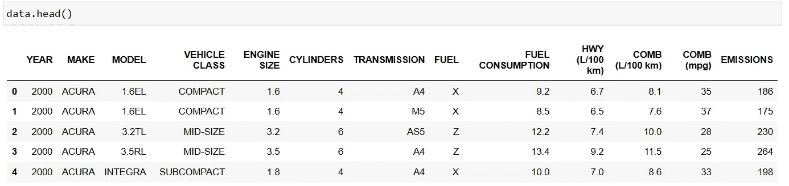

# 有效地使用 %timeit、%lprun 和 %mprun 来编写高效的 Python 代码

> 原文：[`towardsdatascience.com/effectively-use-timeit-lprun-and-mprun-to-write-efficient-python-code-f06fb8457049`](https://towardsdatascience.com/effectively-use-timeit-lprun-and-mprun-to-write-efficient-python-code-f06fb8457049)

## 一个关于如何使用魔法命令测试最高效 Python 代码的实用指南

[](https://suemnjeri.medium.com/?source=post_page-----f06fb8457049--------------------------------)[](https://towardsdatascience.com/?source=post_page-----f06fb8457049--------------------------------) [Susan Maina](https://suemnjeri.medium.com/?source=post_page-----f06fb8457049--------------------------------)

·发表在[Towards Data Science](https://towardsdatascience.com/?source=post_page-----f06fb8457049--------------------------------) ·阅读时间 11 分钟·2023 年 3 月 8 日

--


[`pixabay.com/images/id-534120/`](https://pixabay.com/images/id-534120/)

我最近进行了一次编码面试，其中一个考核标准是代码的优化程度。不幸的是，我未能通过测试，并不是因为代码不能运行（实际上是能运行的）或逻辑错误（实际上没有错误），而是因为我的代码没有优化。

作为数据科学家，高效的代码：

+   在处理和分析大型或复杂数据时节省时间。

+   促进可扩展性，确保你的数据集能够处理更大的数据集和复杂的模型。

+   创建可重用和模块化的代码，这样可以节省时间并减少错误。

+   易于维护和更新，因为它简单易懂。

+   可与更广泛的受众分享，因为它可以在性能较低的硬件上运行。

***优化代码 == 高效代码***

在 Python 中，高效的代码是：

+   符合 Python 风格的 — 它使用 Python 的[独特风格和习惯用法](https://peps.python.org/pep-0020/)，按照创始人和社区所期望的方式进行编写。

+   可读性强 — 它易于阅读和理解代码的功能。例如，遵循[正确的命名](https://realpython.com/python-pep8/#naming-conventions)规范，注意[空白字符](https://realpython.com/python-pep8/#whitespace-in-expressions-and-statements)，并尽可能减少代码行数。

+   快速 — 应该在最短的时间内运行，消耗最少的内存和资源。

公司和雇主更喜欢可以轻松扩展并允许新开发者快速上手的优化代码。

在本文中，我们将讨论四个 python [魔法命令](https://ipython.readthedocs.io/en/stable/interactive/magics.html)，它们测试我们代码的效率。我们还将使用不同的代码方法执行任务，并测量最有效的方法。

**魔法命令 —** 这些是以`%`或`%%`开头的特殊 python 命令，支持在[Jupyter](https://jupyter.org/)笔记本和[Ipython](https://ipython.org/)内核中使用。它们提供了一种快速而强大的方式来执行任务，如计时代码（本文讨论了这个问题）、显示可视化内容和导航目录。

*行魔法命令：* 这些命令有一个%并作用于一行输入。

*单元魔法命令：* 这些命令有两个%%并作用于多行代码或一个单元块。

**注意。** 你可能对‘!’符号很熟悉，它是魔法命令`%system`的简写。该命令直接在笔记本中执行 shell 命令，例如使用`!pip install package`来安装软件包。

要显示所有内置的 python [魔法命令](https://ipython.org/ipython-doc/dev/interactive/magics.html)，请使用`%lsmagic`。


按作者显示魔法命令

要找出魔法命令的功能，可以使用代码*%magic_command****?***来在当前位置显示其文档。


作者截图

## 1\. %timeit

[这个](https://ipython.readthedocs.io/en/stable/interactive/magics.html#magic-timeit)魔法命令测量单行代码的执行时间。它会多次运行代码并返回平均执行时间。

***%timeit 语法*：** 该命令后面跟着要测试的代码，全部在一行中。

```py
%timeit code_to_execute
```

示例输出

```py
34.6 ns ± 1.17 ns per loop (mean ± 
std. dev. of 7 runs, 10000000 loops each)
```

输出解释：

+   *32.4 ns =* 平均执行时间。使用下表进行时间转换。

+   *1.17 ns =* 测量的标准差。


作者的时间单位表

+   *7 runs =* 重复过程的运行次数或迭代次数。我们有不同的运行次数，以考虑内存使用和 CPU 负载等因素的变化，这些因素在一次运行中可能保持不变，但在其他运行中可能会有所不同。

+   *10,000,000 loops =* 每次迭代执行代码的次数。因此，代码总共运行了`runs*loops`次。

运行次数和循环次数根据代码复杂性自动确定，但你也可以将它们作为参数传递，具体如下所述。

***任务 1：计时一行代码 — 比较[]与 list()在实例化列表时的表现。***

*使用文字符号[]创建列表*

```py
%timeit l1=['sue','joe','liz']

###Result
34.6 ns ± 1.17 ns per loop (mean ± 
std. dev. of 7 runs, 10000000 loops each)
```

*使用 list()创建列表*

```py
%timeit l2=list(['sue','joe','liz'])

###Result
92.8 ns ± 1.35 ns per loop (mean ± 
std. dev. of 7 runs, 10000000 loops each)
```

**输出解释：** 使用文字符号需要 34.6 ns，不到使用函数名称（92.8 ns）的一半时间。

因此，在实例化 python 列表、元组或字典时，使用其文字符号比使用其函数名称更高效。

```py
#Efficient
lst = []
tup = ()
dct = {}

#Not Efficient
lst = list()
tup = tuple()
dct = dict()
```

使用 range 函数创建数字列表时也是如此。使用`*`进行列表拆包比使用`list()`名称更高效。

```py
#Efficient
lst = [*range(10)]

#Less efficient
lst = list(range(10))
```

**指定运行次数和循环次数 —** 在`%timeit`命令后，可以通过 -r 和 -n 作为参数传入所需的运行次数和循环次数。

```py
%timeit -r 5 -n 1000 list=['sue','liz','joe']

###Result
42 ns ± 0.458 ns per loop (mean ± std. dev. of 5 runs, 1000 loops each)
```

## 2\. %%timeit

这个命令前面带有**两个**百分号。它测量执行包含多行代码的单元块的平均时间。

***%%timeit 语法：*** 命令写在单元块的开头，后面紧跟要计时的代码行。

```py
%%timeit
code_line_1
code_line_2
...
```

***任务 2：计时多个代码行（一个单元块） — 比较一个 for 循环和一个列表推导式，它们都对 0 到 1000 的所有数字进行平方运算。***

[*For-loop*](https://builtin.com/software-engineering-perspectives/can-you-put-a-for-loop-in-an-if-statement) *—* 下面，我们使用`%%timeit`并传入所需的运行次数（5）和每次运行的循环次数（1000）。

```py
%%timeit -r 5 -n 1000
squared_list=[]
for num in range(1000):
    num_squared=num**2
    squared_list.append(num_squared)

###Result
198 µs ± 9.31 µs per loop (mean ± 
std. dev. of 5 runs, 1000 loops each)
```

代码执行时间为 198 微秒。

*列表推导式 —* 这里我们使用一个百分号的`%timeit`，因为我们只测量一行代码。

```py
%timeit -r 5 -n 1000 squared_list=[num**2 for num in range(1000)]

###Result
173 µs ± 7.22 µs per loop (mean ± 
std. dev. of 5 runs, 1000 loops each)
```

列表推导式代码的速度更快，为 173 微秒。

因此，只要可能，并且不影响可读性，就使用列表推导式而不是 for 循环。

## %lprun — 行分析

这个命令来自[行分析器](https://pypi.org/project/line-profiler/)，该库描述了 python 函数、程序或脚本的时间性能。

它检查函数中每行代码所花的时间，并返回逐行分析的结果。

***%lprun 语法：*** 命令后跟 -f，表示我们正在分析一个函数。然后传入函数名，再传入带有参数的函数调用。

```py
%lprun -f function_name function_name(args)
```

行分析器*不是*内置在 python 中的，需要在系统中首次使用时安装。每次运行新内核时，还需要将其加载到 ipython 会话中。

```py
!pip install line_profiler

%load_ext line_profiler
```

返回的表格是对函数中每一行的分析，包括以下列：

+   *行号：* 函数中该行的位置。

+   *次数：* 该行执行的次数。

+   *时间：* 行执行所用的总时间。计时器单位在表格顶部指定。

+   *每次执行时间：* 执行一行代码所需的平均时间（时间/次数）*。*

+   *%时间：* 每行代码所占的时间百分比，相对于其他行。

+   *行内容：* 行的实际源代码。

***任务 3：计时函数 — 比较一个 for 循环和一个内置 python 函数，去除列表中的重复项。***

在这个例子中，两个函数都接收一个列表，去除重复项，并返回一个唯一项的列表。

*使用 for 循环*

```py
def remove_dups1(lst):
    uniques = []
    for name in lst:
        if name not in uniques:
            uniques.append(name)
    return uniques
```

```py
%lprun -f remove_dups1 remove_dups1(lst)
```


计时器单位为秒（1e-07 s），相当于下表中的 0.1 微秒。整个函数运行了 14.6 微秒，而 for 循环代码被多次运行（许多次数）。


作者提供的时间单位表

*使用* [*set()*](https://www.w3schools.com/python/python_sets.asp) *函数*

```py
def remove_dups2(lst):
    return list(set(lst))
```

```py
%lprun -f remove_dups2 remove_dups2(lst)
```


这个函数只有一行代码，运行了一次（1 hit）。整个函数运行了 3.3 微秒。

因此，尽可能使用内置函数来执行你需要的任务。这是因为这些函数经过优化以提高操作效率。以下是你可以在代码中利用的[内置 Python 函数](https://www.w3schools.com/python/python_ref_functions.asp)的列表。

## %mprun — 内存分析

该命令来源于[memory profiler](https://pypi.org/project/memory-profiler/)库，该库概述了函数的内存使用情况。

因此，%lprun 测量时间，而 %mprun 测量内存消耗，并返回逐行的内存资源分析。

然而，使用 %mprun 时，函数需要保存到一个单独的 Python 文件中。该文件可以保存在你的当前工作目录中，然后你将其导入到会话中，并对其运行命令。我们很快就会做所有这些。

再次，你需要将内存分析器库安装到你的系统中，然后加载到当前内核会话中。

```py
!pip install memory_profiler

%load_ext memory_profiler
```

***%mprun 语法：*** 命令后跟 -f，接着是函数名，最后是函数调用。

```py
from my_file import func_name

%mprun -f func_name func_name(params) 
```

返回的表格包含每行代码的以下信息：

+   *Line #:* 正在执行的行号。

+   *Mem usage:* 执行该行代码后，Python 解释器使用的内存量，以字节为单位。

+   *Increment:* 与上一行相比内存使用的差异。可以将其视为该行对内存的影响。

+   *Occurrences:* 这一行中创建的相同类型项的实例数量。

+   *Line Contents:* 该行上的源代码。

***任务 4: 在 Pandas DataFrame 中计时一个函数 —* *在 Pandas 列上执行计算的最有效方法是什么？***

在下面的示例中，我们将使用一个[Pandas](https://pandas.pydata.org/docs/reference/api/pandas.DataFrame.html) Dataframe，并对一列进行一些计算。我使用了 Kaggle 数据集‘燃料消耗’，可以在[这里](https://www.kaggle.com/datasets/ahmettyilmazz/fuel-consumption)找到，数据集采用[开放数据库](http://opendatacommons.org/licenses/dbcl/1.0/)许可。

首先，导入 Pandas 库，然后将数据集加载到当前会话中。如果代码返回*module not found*错误，请确保首先[安装](https://www.geeksforgeeks.org/how-to-fix-no-module-named-pandas/) Pandas 库。

```py
import pandas as pd

data = pd.read_csv('Fuel_Consumption_2000-2022.csv')
```



作者提供的数据集的前 5 行

该函数接收一个 Pandas dataframe，将列的值乘以一个标量，并返回一个修改后的 dataframe。我们将测试四个函数，以检查最节省内存的方法。

记住`%mprun`必须从文件中访问函数。要将函数保存到一个文件中，请运行下面的单元格块，其中顶行是`%%file your_file.py.` 这将创建并写入（或覆盖）内容到`your_file.py`。

```py
%%file my_file.py
def calc_apply(df):
    column = df['COMB (mpg)']
    new_vals = column.apply(lambda x: x* 0.425)
    df['kml'] = new_vals
    return df

def calc_listcomp(df):
    column = df['COMB (mpg)']
    new_vals = [x*0.425 for x in column]
    df['kml'] = new_vals
    return df

def calc_direct(df):
    column = df['COMB (mpg)']
    new_vals = column*0.425
    df['kml'] = new_vals
    return df

def calc_numpy(df):
    column = df['COMB (mpg)'].values
    new_vals = column*0.425
    df['kml'] = pd.Series(new_vals)
    return df
```

接下来，加载内存分析器扩展并从文件中导入你的函数。

```py
 %load_ext memory_profiler

from my_file import calc_apply, calc_listcomp, 
                    calc_direct, calc_numpy
```

*方法 1: 使用* *apply with a lambda* *函数*

```py
%mprun -f calc_apply calc_apply(data.copy())
```


作者提供的图片

乘法发生的`apply`函数行会导致 45,000 次出现和 1.6 MB 的内存增量。

*方法 2: 使用列表推导*

```py
%mprun -f calc_listcomp calc_listcomp(data.copy())
```


作者提供的图片

使用列表推导将出现次数减少到大约 22,500。然而，两行的内存增加也为 1.7 MB。

*方法 3: 直接乘法。*

```py
%mprun -f calc_direct calc_direct(data.copy())
```


使用直接乘法方法会导致内存中只有一个项，并且内存增加非常小，为 0.4 MB。

*方法 4: 使用* *NumPy* *，首先调用* `*Series.values*` *将列转换为 NumPy 数组。*


第四种方法首先将列转换为一个 NumPy 数组，然后与标量值相乘。与之前的方法 3 相似，这里内存中只有一个项的存在，并且内存增加也为 0.4 MB。

**直接乘法与 NumPy 乘法的速度对比。**

虽然 NumPy 计算消耗的内存与直接方法相同，但它更快。请查看使用`%lprun`测量每行所需时间的两个函数的结果。

*直接乘法 — 更慢*

```py
%lprun -f calc_direct calc_direct(data.copy())
```


直接乘法由作者提供

*NumPy 的计算 — 更快*

```py
%lprun -f calc_numpy calc_numpy(data.copy())
```


NumPy 的乘法由作者提供

NumPy 计算（列首先通过`Series.values`转换为 NumPy 数组）更快，仅需 137 毫秒，而直接乘法需要 1150 毫秒。百分比时间也显著较少，为 9.7%，而直接乘法为 45%。

因此，数据框中的数值计算使用 NumPy 最为高效，因为它对逐元素操作进行了优化。

## 结论

在这篇文章中，我们讨论了编写高效且优化的 python 代码的重要性。我们查看了不同的代码示例，并确定了最有效的编码方法。

我们探索了四个魔法命令；`%timeit`、`%%timeit`、`%lprun` 和 `%mprun`。前三个命令用于测试代码执行的时间，而最后一个命令用于测量消耗的内存。我们还了解到，行魔法命令作用于一行代码，并以一个 % 开头。而单元魔法命令以两个 %% 开头，作用于直接在其下方的多行代码。

我希望你喜欢这篇文章。要在我发布新文章时收到更多类似内容，请订阅[这里](https://suemnjeri.medium.com/subscribe/@suemnjeri)。如果你还不是 Medium 会员，并且希望支持我作为作者，请通过[此链接](https://medium.com/@suemnjeri/membership)订阅$5，我将获得一小笔佣金。感谢你的阅读！

**参考资料**

1.  [MCoding 的 25 个 Python 新手习惯在 YouTube 上](https://youtu.be/qUeud6DvOWI)

1.  [Finxter 的 29 个顶级内置 Python 函数及示例。](https://blog.finxter.com/pythons-top-29-built-in-functions-with-examples/)

3\. Jupyter Notebook 中的魔法命令用于分析
