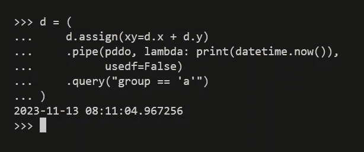

# 数据科学中的高效编码：轻松调试 Pandas 链式操作

> 原文：[`towardsdatascience.com/efficient-coding-in-data-science-easy-debugging-of-pandas-chained-operations-0089f6de920f`](https://towardsdatascience.com/efficient-coding-in-data-science-easy-debugging-of-pandas-chained-operations-0089f6de920f)

## PYTHON 编程

## 如何在不将链式操作拆分为单独语句的情况下检查 Pandas 数据框

[](https://medium.com/@nyggus?source=post_page-----0089f6de920f--------------------------------)[](https://towardsdatascience.com/?source=post_page-----0089f6de920f--------------------------------) [Marcin Kozak](https://medium.com/@nyggus?source=post_page-----0089f6de920f--------------------------------)

·发表于 [Towards Data Science](https://towardsdatascience.com/?source=post_page-----0089f6de920f--------------------------------) ·9 分钟阅读·2023 年 11 月 15 日

--


在不打破链式操作的情况下调试链式 Pandas 操作是可能的。照片由[Miltiadis Fragkidis](https://unsplash.com/@_miltiadis_?utm_source=medium&utm_medium=referral)提供，来源于[Unsplash](https://unsplash.com/?utm_source=medium&utm_medium=referral)

调试是编程的核心。我在以下文章中写到过这个话题：

[](/bugs-in-python-pdb-to-the-rescue-d88a56a2ca71?source=post_page-----0089f6de920f--------------------------------) ## Python 中的错误？Pdb 来救援！

### Pdb 调试器值得学习和使用吗？

towardsdatascience.com

这个说法相当通用，不依赖于语言或框架。当你使用 Python 进行数据分析时，无论是进行复杂的数据分析、编写机器学习软件产品，还是创建 Streamlit 或 Django 应用，你都需要调试代码。

这篇文章讨论了调试 Pandas 代码，或者更具体地说，是在链式操作的情况下调试 Pandas 代码。这种调试提出了一个挑战性的问题。当你不知道如何做到这一点时，链式 Pandas 操作似乎比常规 Pandas 代码，即使用方括号的单独 Pandas 操作，更难调试。

要调试使用方括号的常规 Pandas 代码，只需添加一个 Python 断点 — 并使用 `pdb` 交互式调试器。可能是这样：

```py
>>> d = pd.DataFrame(dict(
...     x=[1, 2, 2, 3, 4],
...     y=[.2, .34, 2.3, .11, .101],
...     group=["a", "a", "b", "b", "b"]
.. ))
>>> d["xy"] = d.x + d.y
>>> breakpoint()
>>> d = d[d.group == "a"]
```

不幸的是，当代码由链式操作组成时，你不能这样做，例如在这里：

```py
>>> d = d.assign(xy=lambda df: df.x + df.y).query("group == 'a'")
```

或者，根据你的喜好，可能是这样：

```py
>>> d = d.assign(xy=d.x + d.y).query("group == 'a'")
```

在这种情况下，没有地方可以停下来查看代码——你只能在链的前面或后面这样做。因此，一个解决方案是在你想调试代码的地方将主链分成两个子链（两个管道），然后从那里进行调试。大多数情况下，调试后你会希望回到一个链而不是两个，因此我个人不喜欢使用这种调试方式。

这就是我想在本文中介绍的方法。我将展示一种调试链式 Pandas 操作的方法，这种方法不需要打断链。相反，你可以添加类似于典型 Python `breakpoint` 的东西。添加和移除这个断点很简单，使调试链式 Pandas 操作变得轻松。

我将提出三种不同的函数，这些函数将帮助你调试 Pandas 操作链中的代码。一旦你了解了它们背后的思想，你将能够实现自己的调试函数。

# 用于调试 Pandas 操作链的函数

我接下来要展示的所有函数都利用了 `pd.pipe()` 函数：

[## pandas.DataFrame.pipe - pandas 2.1.2 文档](https://pandas.pydata.org/docs/reference/api/pandas.DataFrame.pipe.html?source=post_page-----0089f6de920f--------------------------------)

### 应用到 Series/DataFrame 的函数，和 会被传递到 。或者，数据关键字是一个字符串的元组…

pandas.pydata.org

你可以使用 `pd.pip()` 来调用——并应用于数据框——任何期望 Pandas 数据框或系列的函数。这为我们打开了许多可能性：任何这样的函数都可以被添加到 Pandas 操作链中。这就是我们如何构建下面的函数的方式。

## 通过断点调试

让我从最重要且同时最简单的函数开始。它会在 Pandas 操作链中添加一个典型的 `breakpoint`：

```py
def pdbreakpoint(d: pd.DataFrame) -> pd.DataFrame:
    df = d.copy(deep=True)
    breakpoint()
    return d
```

简单，不是吗？

你应该知道为什么我们要创建数据框的深拷贝。如果我们不这样做，就有可能返回原始数据框。在我们的函数中，你对 `df` 数据框所做的一切不会影响原始数据框 `d`。因此，你可以对 `df` 进行更改，一切都将正常。但是你*不*应对 `d` 进行任何更改，因为这些更改会反映在返回的数据框中——这样，在调试过程中传递到后续操作的管道中的数据框将使用这个更改后的数据框。

我们将使用 `pdbreakpoint()` 函数来处理以下 Pandas 管道：

```py
>>> d = pd.DataFrame(dict(
...     x=[1, 2, 2, 3, 4],
...     y=[.2, .34, 2.3, .11, .101],
...     group=["a", "a", "b", "b", "b"]
.. ))
>>> d = d.assign(xy=d.x + d.y).query("group == 'a'")
```

当然，这是一个过于简单的例子，但我们不需要复杂的管道，因为这可能会使我们分心，从而失去对今天的重点：调试。我使用 `d` 作为数据框的名称是有原因的；我想使用一个不同于 `df` 的名称，因为我在 `pdbreakpoint()` 函数内部使用了 `df`。

记住，如果你通常将`df`用作临时数据框的名称，你可以考虑在`pdbreakpoint()`内部使用类似`d`的名称。选择权在你，但唯一的要求是使用一个在`pdbreakpoint()`内部未在外部作用域中使用的数据框名称。

> 在`pdbreakpoint()`内部使用一个在外部作用域中未使用的数据框名称。

现在，假设你想在使用`assign()`函数后但在使用`query()`函数之前检查`d`数据框。如前所述，你可以通过将链分成两个操作来实现这一点。上面，我展示了如何针对基于方括号的 Pandas 代码做到这一点，下面，我将展示如何针对基于链式操作的 Pandas 代码做到这一点：

```py
>>> d = d.assign(xy=d.x + d.y)
>>> breakpoint()
>>> d = d.query("group == 'a'")
```

但这是我从未喜欢做的事情。这就是我提出`pdbreakpoint()`函数的原因。你可以按以下方式使用它：

```py
>>> d = (
...     d.assign(xy=d.x + d.y)
...     .pipe(pdbreakpoint)
...     .query("group == 'a'")
... ) 
```

下面的截图展示了会发生什么：


Python 3.11 的截图：通过 pdbreaking 函数进入 pdb 调试器。图片由作者提供。

你现在在`pdbreakpoint()`函数内部，再次查看时，你会看到你可以访问一个`df`数据框——这是在运行`assign()`之后和运行`query()`之前的数据框。请看：


Python 3.11 的截图：在使用 pdbreaking 函数后使用 pdb 调试器。图片由作者提供。

所以，我们在断点内部检查了`df`；在这样做时，我们运行了`df.query("group == 'b'")`。然而，在按下`c`（用于`continue`）后，我们返回到常规会话，并获得最终结果，即运行`query("group == 'a'")`后的数据框，即对`d`数据框执行整个操作链后的数据框。

就是这样！这是一种非常简单的使用`pdb`内置 Python 调试器检查 Pandas 数据框的方法。

现在我们知道如何实现这样的函数，我们可以利用这些知识实现其他函数，帮助我们调试 Pandas 链式操作。

## 打印数据框的前几行

我们的下一个函数将不使用`pdb`交互式调试器。相反，它将简单地打印数据框的前几行，并可以选择一个列的子集：

```py
def pdhead(
    df: pd.DataFrame,
    n: int = 2,
    cols: Optional[Sequence[str]] = None,
    **kwargs
) -> pd.DataFrame:
    if cols:
        print(df.filter(cols).head(n), **kwargs)
    else:
        print(df.head(n), **kwargs)
    return df
```

让我们看看代码的实际效果：


Python 3.11 的截图：使用 pdhead 函数。图片由作者提供。

为了展示`pdhead()`的工作原理，我们使用了两次——虽然在实际使用中，你不会连续两次使用这个函数。第一次，我们在没有`n`的情况下使用它（即，使用默认的`n`值`2`），第二次使用`n`为`3`。

你可以看到函数按预期工作。下面的截图展示了`pdhead()`如何与`cols`参数一起工作：


Python 3.11 的截图：使用 pdhead 函数。图片由作者提供。

因此，当你想只查看选定的列的数据框时，`cols` 会非常方便。在这里，我们使用了`n`和`cols`两个参数，并查看了`d`数据框的前面三行，包含两列：`xy`和`group`。

正如你可能已经注意到的，`xy` 是在这条操作链中创建的，这没有任何问题，因为我们使用`pdhead()`的临时版本的数据框已经包含了这个列。

你可以轻松地重新实现该函数，以显示数据框的尾部，或显示数据框的选定部分：列的子集和/或行的子集。我将这留给你作为练习。

## 在链中做一些事情

这次，我将展示一个通用函数，使你能够在 Pandas 操作链中实现任何你想做的事情：

```py
 def pddo(
    df: pd.DataFrame,
    func: callable,
    usedf: bool = True,
    *args, **kwargs
) -> pd.DataFrame:
    if usedf:
        func(df, *args, **kwargs)
    else:
        func(*args, **kwargs)
    return df
```

这个函数比之前的函数稍微复杂一点。它有两种不同的使用情况。无论你对检查的数据框的操作意图是什么，都必须在可调用的`func()`中反映出来。你可以为此使用位置参数和关键字参数。

*用例 1：不要使用数据框*。在这种情况下，将`usedf`设置为`False`。例如，你可以打印一个标志：


截图来自 Python 3.11：使用 pddo 函数打印标志。图片作者提供。

或者当前日期和时间：



截图来自 Python 3.11：使用 pddo 函数打印日期和时间。图片作者提供。

你还可以记录信息——但要记住，当`usedf`设置为`False`时，你无法访问数据框。如果你需要访问，你需要将此参数设置为`True`，接下来的用例就是关于它的。

*用例 2：使用数据框*。更有趣的用例涉及访问数据框。让我们从一些简单的例子开始：


截图来自 Python 3.11：使用 pddo 函数打印数据框的形状。图片作者提供。

如你所用，当`usedf`为`True`（这是`pddo()`的默认值）时，你可以使用数据框。它作为`func()`的第一个参数使用——你不能更改这一点，否则`pipe()`将会崩溃。

实际上，你可以使用`pddo()`执行相当高级的操作：


截图来自 Python 3.11：使用 pddo 函数打印 Pandas 操作的复杂管道结果。图片作者提供。

`foo()`函数执行了相当复杂的一系列操作并打印结果。然而，一旦`pipe()`调用`pddo()`（它调用`foo()`）返回，原始链条将恢复到`pipe()`函数被调用之前的状态。

你需要记住，如果你想打印某些内容，你需要直接调用`print()`方法。实际上，你可以实现自己的函数，在其中不需要调用`print()`——我将把这个作为练习留给你。然而，这样的版本只能用于打印，而当前版本的`pddo()`更为通用，因为你可以，例如，将数据框记录到日志记录器中。

# 结论

我们已经探讨了使用自定义函数调试链式操作。最关键的函数是`pdbreakpoint()`，因为它允许你使用`pdb`，内置的交互式 Python 调试器。其他函数采用了静态调试，但其中一些也可以用于其他目的，例如日志记录。

你可以扩展这组用于调试 Pandas 操作的函数。当你需要在特定点检查数据框的状态，而不将链拆分为单独的语句时，它们可以帮助调试这些操作的管道。

既然你了解了这个概念，你应该不会在实现自己的函数时遇到问题。然而，我的建议是不要过度使用它们。我们讨论的是调试，我认为在调试 Pandas 代码时需要从十几个函数中选择，这更多是干扰而非帮助。

说实话，我自己只使用`pdbreakpoint()`函数，但我想与你分享这个概念，而不仅仅是一个函数——以便你可以选择自己调试的方法。正如我在[我之前的*Towards Data Science*关于 Python 调试的文章](https://medium.com/towards-data-science/bugs-in-python-pdb-to-the-rescue-d88a56a2ca71)中讨论的，我是`pdb`交互式调试器的忠实粉丝，我很少需要使用其他工具。但这并不意味着其他方法在某些情况下不是同样有用的。

感谢阅读。如果你喜欢这篇文章，你可能也会喜欢我写的其他文章；你可以[在这里](https://medium.com/@nyggus)看到它们。如果你想加入 Medium，请使用下面的推荐链接：

[](https://medium.com/@nyggus/membership?source=post_page-----0089f6de920f--------------------------------) [## 通过我的推荐链接加入 Medium - Marcin Kozak

### 作为 Medium 会员，你的会员费的一部分将会分配给你阅读的作者，并且你可以完全访问每个故事……

medium.com](https://medium.com/@nyggus/membership?source=post_page-----0089f6de920f--------------------------------)
